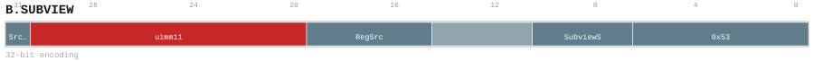
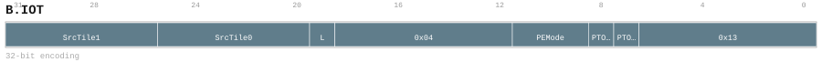
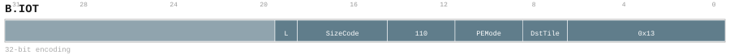
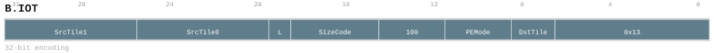
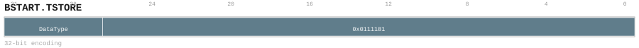
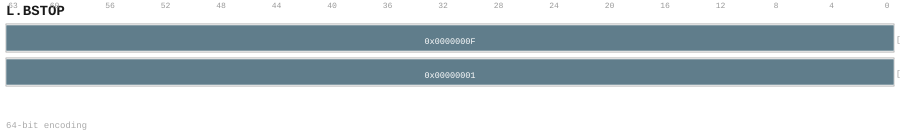

// Generated file; do not edit by hand.

[[insnref-details]]
=== Instruction descriptions (by mnemonic)

This section provides per-mnemonic descriptions. The tables above remain the authoritative listing of encodable forms and decode layouts in the v0.58.5 catalog. Descriptions and pseudocode here are derived from mnemonic naming conventions plus catalog assembly templates/notes and are intended to be *informative*.

[[insndesc-sys]]
==== SYS

[[insndesc-sys-acrc]]
===== ACRC

Architectural control operation (sub-operation selected by the operand encoding).

Catalog forms:: 1 form(s) (32 bits).

Assembly forms::
+
* `acrc rst_type`

Encoding::
+
.`acrc_32_4ecf52b5127e` — `acrc rst_type`
image::encodings/enc_acrc.svg[ACRC encoding form acrc_32_4ecf52b5127e,align="center"]

Encoding notes (informative)::
+
* ACRC requests context close and marks the final scalar position of the active SYS block.

Operation (informative)::
+
[source]
----
CallACR(rst_type)  // privileged ring call (implementation-defined)
----

[[insndesc-sys-acre]]
===== ACRE

Architectural control operation (sub-operation selected by the operand encoding).

Catalog forms:: 1 form(s) (32 bits).

Assembly forms::
+
* `acre rra_type`

Encoding::
+
.`acre_32_a8259d99731c` — `acre rra_type`
image::encodings/enc_acre.svg[ACRE encoding form acre_32_a8259d99731c,align="center"]

Encoding notes (informative)::
+
* ACRE atomically commits the active SYS block and recovers one validated architecture context.

Operation (informative)::
+
[source]
----
EnterACR(rra_type)  // privileged ring transition (implementation-defined)
----

[[insndesc-sys-assert]]
===== ASSERT

Execution-control instruction used for debugging, ordering, or bring-up.

Catalog forms:: 1 form(s) (32 bits).

Assembly forms::
+
* `assert SrcL`

Encoding::
+
.`assert_32_5a2aa5fe31c5` — `assert SrcL`
image::encodings/enc_assert.svg[ASSERT encoding form assert_32_5a2aa5fe31c5,align="center"]

Encoding notes (informative)::
+
* ASSERT raises the architecture assertion trap exactly when its snapshotted scalar condition is zero.

Operation (informative)::
+
[source]
----
if (ECONFIG[3] && Read(SrcL) == 0): Trap(ASSERT_FAIL)
----

[[insndesc-sys-bc-iall]]
===== BC.IALL

Branch cache/predictor maintenance operation, selected by the mnemonic suffix.

Catalog forms:: 1 form(s) (32 bits).

Assembly forms::
+
* `bc.iall`

Encoding::
+
.`bc_iall_32_27b4ceb9cbaa` — `bc.iall`
image::encodings/enc_bc_iall.svg[BC.IALL encoding form bc_iall_32_27b4ceb9cbaa,align="center"]

Encoding notes (informative)::
+
* BC.IALL completes the bundle-cache all-entry scope maintenance operation synchronously.

Operation (informative)::
+
[source]
----
Maintain(op)
----

[[insndesc-sys-bc-iva]]
===== BC.IVA

Branch cache/predictor maintenance operation, selected by the mnemonic suffix.

Catalog forms:: 1 form(s) (32 bits).

Assembly forms::
+
* `bc.iva SrcL`

Encoding::
+
.`bc_iva_32_1108bd41a6b4` — `bc.iva SrcL`
image::encodings/enc_bc_iva.svg[BC.IVA encoding form bc_iva_32_1108bd41a6b4,align="center"]

Encoding notes (informative)::
+
* BC.IVA completes the bundle-cache virtual-address scope token maintenance operation synchronously.

Operation (informative)::
+
[source]
----
Maintain(op, address=Read(SrcL))
----

[[insndesc-sys-bse]]
===== BSE

Execution-control wait/event primitive (exact behavior is platform-defined).

Catalog forms:: 1 form(s) (32 bits).

Assembly forms::
+
* `bse SrcL`

Encoding::
+
.`bse_32_1e9f7cd317bd` — `bse SrcL`
image::encodings/enc_bse.svg[BSE encoding form bse_32_1e9f7cd317bd,align="center"]

Encoding notes (informative)::
+
* BSE publishes the SendEvent nonblocking execution-control request.

Operation (informative)::
+
[source]
----
BlockHint()  // front-end metadata; no architectural effect
----

[[insndesc-sys-bwe]]
===== BWE

Execution-control wait/event primitive (exact behavior is platform-defined).

Catalog forms:: 1 form(s) (32 bits).

Assembly forms::
+
* `bwe SrcL`

Encoding::
+
.`bwe_32_bc6f2ef50c92` — `bwe SrcL`
image::encodings/enc_bwe.svg[BWE encoding form bwe_32_bc6f2ef50c92,align="center"]

Encoding notes (informative)::
+
* BWE publishes the WaitEvent nonblocking execution-control request.

Operation (informative)::
+
[source]
----
BlockHint()  // front-end metadata; no architectural effect
----

[[insndesc-sys-bwi]]
===== BWI

Execution-control wait/event primitive (exact behavior is platform-defined).

Catalog forms:: 1 form(s) (32 bits).

Assembly forms::
+
* `bwi SrcL`

Encoding::
+
.`bwi_32_fb691744700c` — `bwi SrcL`
image::encodings/enc_bwi.svg[BWI encoding form bwi_32_fb691744700c,align="center"]

Encoding notes (informative)::
+
* BWI publishes the WaitInterrupt nonblocking execution-control request.

Operation (informative)::
+
[source]
----
BlockHint()  // front-end metadata; no architectural effect
----

[[insndesc-sys-bwt]]
===== BWT

Requests the processor to sleep for a duration specified by the operand.

Catalog forms:: 1 form(s) (32 bits).

Assembly forms::
+
* `bwt SrcL`

Encoding::
+
.`bwt_32_eb6a95d3ce3b` — `bwt SrcL`
image::encodings/enc_bwt.svg[BWT encoding form bwt_32_eb6a95d3ce3b,align="center"]

Encoding notes (informative)::
+
* BWT publishes the WaitTimeout nonblocking execution-control request.

Operation (informative)::
+
[source]
----
BlockHint()  // front-end metadata; no architectural effect
----

[[insndesc-sys-c-ebreak]]
===== C.EBREAK

This mnemonic has a 16-bit compressed encoding. Execution-control instruction used for debugging, ordering, or bring-up.

Catalog forms:: 1 form(s) (16 bits).

Assembly forms::
+
* `c.break imm`

Encoding::
+
.`c_ebreak_16_89cecd4d3b49` — `c.break imm`
image::encodings/enc_c_ebreak.svg[C.EBREAK encoding form c_ebreak_16_89cecd4d3b49,align="center"]

Encoding notes (informative)::
+
* C.EBREAK raises software-breakpoint trap 50 with its 5-bit immediate as cause.

Operation (informative)::
+
[source]
----
Trap(SW_BREAKPOINT)
----

[[insndesc-sys-c-ssrget]]
===== C.SSRGET

This mnemonic has a 16-bit compressed encoding. Reads a system register identified by the ID operand and writes the value to the selected destination.

Catalog forms:: 1 form(s) (16 bits).

Assembly forms::
+
* `c.ssrget SSR-ID, ->t`

Encoding::
+
.`c_ssrget_16_1f3b9fc04215` — `c.ssrget SSR-ID, ->t`
image::encodings/enc_c_ssrget.svg[C.SSRGET encoding form c_ssrget_16_1f3b9fc04215,align="center"]

Encoding notes (informative)::
+
* C.SSRGET reads the complete encoded system-register address.

Operation (informative)::
+
[source]
----
value = ReadSystemRegister(ID)
Write(Dst, value)
----

[[insndesc-sys-dc-cisw]]
===== DC.CISW

Data-cache maintenance operation (invalidate/clean/zero, by address or by set/way), selected by the mnemonic suffix.

Catalog forms:: 1 form(s) (32 bits).

Assembly forms::
+
* `dc.cisw SrcL`

Encoding::
+
.`dc_cisw_32_2c4675665e67` — `dc.cisw SrcL`
image::encodings/enc_dc_cisw.svg[DC.CISW encoding form dc_cisw_32_2c4675665e67,align="center"]

Encoding notes (informative)::
+
* DC.CISW completes the data-cache clean-and-invalidate set/way token maintenance operation synchronously.

Operation (informative)::
+
[source]
----
Maintain(op, address=Read(SrcL))
----

[[insndesc-sys-dc-civa]]
===== DC.CIVA

Data-cache maintenance operation (invalidate/clean/zero, by address or by set/way), selected by the mnemonic suffix.

Catalog forms:: 1 form(s) (32 bits).

Assembly forms::
+
* `dc.civa SrcL`

Encoding::
+
.`dc_civa_32_70b9880b0c8e` — `dc.civa SrcL`
image::encodings/enc_dc_civa.svg[DC.CIVA encoding form dc_civa_32_70b9880b0c8e,align="center"]

Encoding notes (informative)::
+
* DC.CIVA completes the data-cache clean-and-invalidate scope token maintenance operation synchronously.

Operation (informative)::
+
[source]
----
Maintain(op, address=Read(SrcL))
----

[[insndesc-sys-dc-csw]]
===== DC.CSW

Data-cache maintenance operation (invalidate/clean/zero, by address or by set/way), selected by the mnemonic suffix.

Catalog forms:: 1 form(s) (32 bits).

Assembly forms::
+
* `dc.csw SrcL`

Encoding::
+
.`dc_csw_32_b695d404903d` — `dc.csw SrcL`
image::encodings/enc_dc_csw.svg[DC.CSW encoding form dc_csw_32_b695d404903d,align="center"]

Encoding notes (informative)::
+
* DC.CSW completes the data-cache clean-by-set/way scope token maintenance operation synchronously.

Operation (informative)::
+
[source]
----
Maintain(op, address=Read(SrcL))
----

[[insndesc-sys-dc-cva]]
===== DC.CVA

Data-cache maintenance operation (invalidate/clean/zero, by address or by set/way), selected by the mnemonic suffix.

Catalog forms:: 1 form(s) (32 bits).

Assembly forms::
+
* `dc.cva SrcL`

Encoding::
+
.`dc_cva_32_58d234be1c1c` — `dc.cva SrcL`
image::encodings/enc_dc_cva.svg[DC.CVA encoding form dc_cva_32_58d234be1c1c,align="center"]

Encoding notes (informative)::
+
* DC.CVA completes the data-cache clean-by-address scope token maintenance operation synchronously.

Operation (informative)::
+
[source]
----
Maintain(op, address=Read(SrcL))
----

[[insndesc-sys-dc-iall]]
===== DC.IALL

Data-cache maintenance operation (invalidate/clean/zero, by address or by set/way), selected by the mnemonic suffix.

Catalog forms:: 1 form(s) (32 bits).

Assembly forms::
+
* `dc.iall`

Encoding::
+
.`dc_iall_32_5b7bb9ddc741` — `dc.iall`
image::encodings/enc_dc_iall.svg[DC.IALL encoding form dc_iall_32_5b7bb9ddc741,align="center"]

Encoding notes (informative)::
+
* DC.IALL completes the data-cache all-entry scope maintenance operation synchronously.

Operation (informative)::
+
[source]
----
Maintain(op)
----

[[insndesc-sys-dc-isw]]
===== DC.ISW

Data-cache maintenance operation (invalidate/clean/zero, by address or by set/way), selected by the mnemonic suffix.

Catalog forms:: 1 form(s) (32 bits).

Assembly forms::
+
* `dc.isw SrcL`

Encoding::
+
.`dc_isw_32_a8126df1ce9d` — `dc.isw SrcL`
image::encodings/enc_dc_isw.svg[DC.ISW encoding form dc_isw_32_a8126df1ce9d,align="center"]

Encoding notes (informative)::
+
* DC.ISW completes the data-cache set/way scope token maintenance operation synchronously.

Operation (informative)::
+
[source]
----
Maintain(op, address=Read(SrcL))
----

[[insndesc-sys-dc-iva]]
===== DC.IVA

Data-cache maintenance operation (invalidate/clean/zero, by address or by set/way), selected by the mnemonic suffix.

Catalog forms:: 1 form(s) (32 bits).

Assembly forms::
+
* `dc.iva SrcL`

Encoding::
+
.`dc_iva_32_918b61f9da95` — `dc.iva SrcL`
image::encodings/enc_dc_iva.svg[DC.IVA encoding form dc_iva_32_918b61f9da95,align="center"]

Encoding notes (informative)::
+
* DC.IVA completes the data-cache virtual-address scope token maintenance operation synchronously.

Operation (informative)::
+
[source]
----
Maintain(op, address=Read(SrcL))
----

[[insndesc-sys-dc-zva]]
===== DC.ZVA

Data-cache maintenance operation (invalidate/clean/zero, by address or by set/way), selected by the mnemonic suffix.

Catalog forms:: 1 form(s) (32 bits).

Assembly forms::
+
* `dc.zva SrcL`

Encoding::
+
.`dc_zva_32_c9c44b37d958` — `dc.zva SrcL`
image::encodings/enc_dc_zva.svg[DC.ZVA encoding form dc_zva_32_c9c44b37d958,align="center"]

Encoding notes (informative)::
+
* DC.ZVA completes the data-cache zero-by-address scope token maintenance operation synchronously.

Operation (informative)::
+
[source]
----
Maintain(op, address=Read(SrcL))
----

[[insndesc-sys-ebreak]]
===== EBREAK

Execution-control instruction used for debugging, ordering, or bring-up.

Catalog forms:: 1 form(s) (32 bits).

Assembly forms::
+
* `ebreak imm`

Encoding::
+
.`ebreak_32_d02053c744f8` — `ebreak imm`
image::encodings/enc_ebreak.svg[EBREAK encoding form ebreak_32_d02053c744f8,align="center"]

Encoding notes (informative)::
+
* EBREAK raises software-breakpoint trap 50 with its 4-bit immediate as cause.

Operation (informative)::
+
[source]
----
Trap(SW_BREAKPOINT)
----

[[insndesc-sys-fence-d]]
===== FENCE.D

Execution-control instruction used for debugging, ordering, or bring-up.

Catalog forms:: 1 form(s) (32 bits).

Assembly forms::
+
* `fence.d pred_imm, succ_imm`

Encoding::
+
.`fence_d_32_995ba6ba6bb7` — `fence.d pred_imm, succ_imm`
image::encodings/enc_fence_d.svg[FENCE.D encoding form fence_d_32_995ba6ba6bb7,align="center"]

Encoding notes (informative)::
+
* FENCE.D records predecessor/successor ordering masks and invalidates the local reservation.

Operation (informative)::
+
[source]
----
FenceD()  // data-cache fence
----

[[insndesc-sys-fence-i]]
===== FENCE.I

Execution-control instruction used for debugging, ordering, or bring-up.

Catalog forms:: 1 form(s) (32 bits).

Assembly forms::
+
* `fence.i`

Encoding::
+
.`fence_i_32_85d88bc9693d` — `fence.i`
image::encodings/enc_fence_i.svg[FENCE.I encoding form fence_i_32_85d88bc9693d,align="center"]

Encoding notes (informative)::
+
* FENCE.I establishes instruction visibility, invalidates the reservation, and advances the instruction-cache epoch.

Operation (informative)::
+
[source]
----
FenceI()  // instruction-cache fence
----

[[insndesc-sys-hl-ssrget]]
===== HL.SSRGET

This mnemonic has a 48-bit composed encoding (prefix + main). Reads a system register identified by the ID operand and writes the value to the selected destination.

Catalog forms:: 1 form(s) (48 bits).

Assembly forms::
+
* `hl.ssrget SSR_ID, ->{t, u, Rd}`

Encoding::
+
.`hl_ssrget_48_3f4a207e02ae` — `hl.ssrget SSR_ID, ->{t, u, Rd}`
image::encodings/enc_hl_ssrget.svg[HL.SSRGET encoding form hl_ssrget_48_3f4a207e02ae,align="center"]

Encoding notes (informative)::
+
* HL.SSRGET reads the complete encoded system-register address.

Operation (informative)::
+
[source]
----
value = ReadSystemRegister(ID)
Write(Dst, value)
----

[[insndesc-sys-hl-ssrset]]
===== HL.SSRSET

This mnemonic has a 48-bit composed encoding (prefix + main). Writes a system register identified by the ID operand with the provided value.

Catalog forms:: 1 form(s) (48 bits).

Assembly forms::
+
* `hl.ssrset SrcL, SSR_ID`

Encoding::
+
.`hl_ssrset_48_b5e450817a0e` — `hl.ssrset SrcL, SSR_ID`
image::encodings/enc_hl_ssrset.svg[HL.SSRSET encoding form hl_ssrset_48_b5e450817a0e,align="center"]

Encoding notes (informative)::
+
* HL.SSRSET writes the complete encoded system-register address.

Operation (informative)::
+
[source]
----
WriteSystemRegister(ID, Read(SrcL))
----

[[insndesc-sys-ic-iall]]
===== IC.IALL

Instruction-cache maintenance operation (invalidate by address or invalidate all), selected by the mnemonic suffix.

Catalog forms:: 1 form(s) (32 bits).

Assembly forms::
+
* `ic.iall`

Encoding::
+
.`ic_iall_32_3277175d73e1` — `ic.iall`
image::encodings/enc_ic_iall.svg[IC.IALL encoding form ic_iall_32_3277175d73e1,align="center"]

Encoding notes (informative)::
+
* IC.IALL completes the instruction-cache all-entry scope maintenance operation synchronously.

Operation (informative)::
+
[source]
----
Maintain(op)
----

[[insndesc-sys-ic-iva]]
===== IC.IVA

Instruction-cache maintenance operation (invalidate by address or invalidate all), selected by the mnemonic suffix.

Catalog forms:: 1 form(s) (32 bits).

Assembly forms::
+
* `ic.iva SrcL`

Encoding::
+
.`ic_iva_32_ab867dbab977` — `ic.iva SrcL`
image::encodings/enc_ic_iva.svg[IC.IVA encoding form ic_iva_32_ab867dbab977,align="center"]

Encoding notes (informative)::
+
* IC.IVA completes the instruction-cache virtual-address scope token maintenance operation synchronously.

Operation (informative)::
+
[source]
----
Maintain(op, address=Read(SrcL))
----

[[insndesc-sys-lsrget]]
===== LSRGET

Reads a system register identified by the ID operand and writes the value to the selected destination.

Catalog forms:: 1 form(s) (32 bits).

Assembly forms::
+
* `lsrget LSR_ID, ->{t, u, Rd}`

Encoding::
+
.`lsrget_32_cd877ff2f5e7` — `lsrget LSR_ID, ->{t, u, Rd}`
image::encodings/enc_lsrget.svg[LSRGET encoding form lsrget_32_cd877ff2f5e7,align="center"]

Encoding notes (informative)::
+
* LSRGET reads one assigned word from the active block BARG view.

Operation (informative)::
+
[source]
----
value = ReadSystemRegister(ID)
Write(Dst, value)
----

[[insndesc-sys-setc-tgt]]
===== SETC.TGT

Sets the block-commit condition/argument consumed by subsequent conditional block transitions.

Catalog forms:: 1 form(s) (32 bits).

Assembly forms::
+
* `setc.tgt SrcL`

Encoding::
+
.`setc_tgt_32_1142be6a4568` — `setc.tgt SrcL`
image::encodings/enc_setc_tgt.svg[SETC.TGT encoding form setc_tgt_32_1142be6a4568,align="center"]

Encoding notes (informative)::
+
* SETC.TGT snapshots SrcL into BARG.BPCN for the active Standard or Floating block.

Operation (informative)::
+
[source]
----
SetCommitTarget(Read(SrcL))
----

[[insndesc-sys-ssrget]]
===== SSRGET

Reads a system register identified by the ID operand and writes the value to the selected destination.

Catalog forms:: 1 form(s) (32 bits).

Assembly forms::
+
* `ssrget SSR_ID, ->{t, u, Rd}`

Encoding::
+
.`ssrget_32_631c1632acb5` — `ssrget SSR_ID, ->{t, u, Rd}`
image::encodings/enc_ssrget.svg[SSRGET encoding form ssrget_32_631c1632acb5,align="center"]

Encoding notes (informative)::
+
* SSRGET reads the complete encoded system-register address.

Operation (informative)::
+
[source]
----
value = ReadSystemRegister(ID)
Write(Dst, value)
----

[[insndesc-sys-ssrset]]
===== SSRSET

Writes a system register identified by the ID operand with the provided value.

Catalog forms:: 1 form(s) (32 bits).

Assembly forms::
+
* `ssrset SrcL, SSR_ID`

Encoding::
+
.`ssrset_32_b8183287cc8a` — `ssrset SrcL, SSR_ID`
image::encodings/enc_ssrset.svg[SSRSET encoding form ssrset_32_b8183287cc8a,align="center"]

Encoding notes (informative)::
+
* SSRSET writes the complete encoded system-register address.

Operation (informative)::
+
[source]
----
WriteSystemRegister(ID, Read(SrcL))
----

[[insndesc-sys-ssrswap]]
===== SSRSWAP

Atomically swaps a system register value with the provided value.

Catalog forms:: 1 form(s) (32 bits).

Assembly forms::
+
* `ssrswap SrcL, SSR_ID, ->{t, u, Rd}`

Encoding::
+
.`ssrswap_32_09746cac9337` — `ssrswap SrcL, SSR_ID, ->{t, u, Rd}`
image::encodings/enc_ssrswap.svg[SSRSWAP encoding form ssrswap_32_09746cac9337,align="center"]

Encoding notes (informative)::
+
* SSRSWAP atomically swaps the complete encoded system-register address.

Operation (informative)::
+
[source]
----
old = ReadSystemRegister(ID)
WriteSystemRegister(ID, Read(SrcL))
Write(Dst, old)
----

[[insndesc-sys-tlb-ia]]
===== TLB.IA

TLB maintenance operation, selected by the mnemonic suffix.

Catalog forms:: 1 form(s) (32 bits).

Assembly forms::
+
* `tlb.ia SrcL`

Encoding::
+
.`tlb_ia_32_c51104bbc469` — `tlb.ia SrcL`
image::encodings/enc_tlb_ia.svg[TLB.IA encoding form tlb_ia_32_c51104bbc469,align="center"]

Encoding notes (informative)::
+
* TLB.IA completes the 16-bit ASID token in bits 15:0 maintenance operation synchronously.

Operation (informative)::
+
[source]
----
Maintain(op, address=Read(SrcL))
----

[[insndesc-sys-tlb-iall]]
===== TLB.IALL

TLB maintenance operation, selected by the mnemonic suffix.

Catalog forms:: 1 form(s) (32 bits).

Assembly forms::
+
* `tlb.iall`

Encoding::
+
.`tlb_iall_32_6ba8b1f1b813` — `tlb.iall`
image::encodings/enc_tlb_iall.svg[TLB.IALL encoding form tlb_iall_32_6ba8b1f1b813,align="center"]

Encoding notes (informative)::
+
* TLB.IALL completes the all translation entries maintenance operation synchronously.

Operation (informative)::
+
[source]
----
Maintain(op)
----

[[insndesc-sys-tlb-iav]]
===== TLB.IAV

TLB maintenance operation, selected by the mnemonic suffix.

Catalog forms:: 1 form(s) (32 bits).

Assembly forms::
+
* `tlb.iav SrcL`

Encoding::
+
.`tlb_iav_32_f7dd01305fed` — `tlb.iav SrcL`
image::encodings/enc_tlb_iav.svg[TLB.IAV encoding form tlb_iav_32_f7dd01305fed,align="center"]

Encoding notes (informative)::
+
* TLB.IAV completes the canonical 48-bit virtual address with ASID scope maintenance operation synchronously.

Operation (informative)::
+
[source]
----
Maintain(op, address=Read(SrcL))
----

[[insndesc-sys-tlb-iv]]
===== TLB.IV

TLB maintenance operation, selected by the mnemonic suffix.

Catalog forms:: 1 form(s) (32 bits).

Assembly forms::
+
* `tlb.iv SrcL`

Encoding::
+
.`tlb_iv_32_d5562480924a` — `tlb.iv SrcL`
image::encodings/enc_tlb_iv.svg[TLB.IV encoding form tlb_iv_32_d5562480924a,align="center"]

Encoding notes (informative)::
+
* TLB.IV completes the canonical 48-bit virtual address maintenance operation synchronously.

Operation (informative)::
+
[source]
----
Maintain(op, address=Read(SrcL))
----

[[insndesc-alu]]
==== ALU

[[insndesc-alu-add]]
===== ADD

Integer addition.

Catalog forms:: 1 form(s) (32 bits).

Assembly forms::
+
* `add SrcL, SrcR<{.sw,.uw,.neg}><<<shamt>, ->{t, u, Rd}`

Encoding::
+
.`add_32_3af05dd9677d` — `add SrcL, SrcR<{.sw,.uw,.neg}><<<shamt>, ->{t, u, Rd}`
image::encodings/enc_add.svg[ADD encoding form add_32_3af05dd9677d,align="center"]

Encoding notes (informative)::
+
* ADD applies the selected right-source transformation before its encoded logical left shift, performs fixed-width addition, and publishes the PTO_XLEN result.

Operation (informative)::
+
[source]
----
lhs = Read(SrcL)
rhs = Read(SrcR)  // apply modifiers/shift as encoded
result = lhs + rhs
Write(Dst, result)
----

[[insndesc-alu-addi]]
===== ADDI

Integer add-immediate.

Catalog forms:: 1 form(s) (32 bits).

Assembly forms::
+
* `addi SrcL, uimm, ->{t, u, Rd}`

Encoding::
+
.`addi_32_1f3ff8db558b` — `addi SrcL, uimm, ->{t, u, Rd}`
image::encodings/enc_addi.svg[ADDI encoding form addi_32_1f3ff8db558b,align="center"]

Encoding notes (informative)::
+
* ADDI adds the zero-extended unsigned 12-bit immediate to the snapshotted XLEN source modulo 2^PTO_XLEN and publishes the result through the selected Reg5 destination.

Operation (informative)::
+
[source]
----
lhs = Read(SrcL)
rhs = imm  // immediate as encoded
result = lhs + rhs
Write(Dst, result)
----

[[insndesc-alu-addiw]]
===== ADDIW

Word (32-bit) add-immediate.

Catalog forms:: 1 form(s) (32 bits).

Assembly forms::
+
* `addiw SrcL, uimm, ->{t, u, Rd}`

Encoding::
+
.`addiw_32_21a5eabbbdc6` — `addiw SrcL, uimm, ->{t, u, Rd}`
image::encodings/enc_addiw.svg[ADDIW encoding form addiw_32_21a5eabbbdc6,align="center"]

Encoding notes (informative)::
+
* ADDIW adds the zero-extended unsigned 12-bit immediate to SrcL[31:0] modulo 2^32, sign-extends the word result to XLEN, and publishes it through RegDst.

Operation (informative)::
+
[source]
----
Execute operation as selected by the mnemonic and encoded modifiers.
----

[[insndesc-alu-addw]]
===== ADDW

Word (32-bit) integer addition.

Catalog forms:: 1 form(s) (32 bits).

Assembly forms::
+
* `addw SrcL, SrcR<{.sw,.uw,.neg}><<<shamt>, ->{t, u, Rd}`

Encoding::
+
.`addw_32_f237d211a91d` — `addw SrcL, SrcR<{.sw,.uw,.neg}><<<shamt>, ->{t, u, Rd}`
image::encodings/enc_addw.svg[ADDW encoding form addw_32_f237d211a91d,align="center"]

Encoding notes (informative)::
+
* ADDW applies the selected right-source transformation before its encoded logical left shift, performs fixed-width word addition, and publishes the low 32-bit result sign-extended to XLEN.

Operation (informative)::
+
[source]
----
Execute operation as selected by the mnemonic and encoded modifiers.
----

[[insndesc-alu-and]]
===== AND

Bitwise AND.

Catalog forms:: 1 form(s) (32 bits).

Assembly forms::
+
* `and SrcL, SrcR<{.sw,.uw,.not}><<<shamt>, ->{t, u, Rd}`

Encoding::
+
.`and_32_947d0acde105` — `and SrcL, SrcR<{.sw,.uw,.not}><<<shamt>, ->{t, u, Rd}`
image::encodings/enc_and.svg[AND encoding form and_32_947d0acde105,align="center"]

Encoding notes (informative)::
+
* AND applies the selected right-source transformation before its encoded logical left shift, performs bitwise conjunction, and publishes the PTO_XLEN result.

Operation (informative)::
+
[source]
----
lhs = Read(SrcL)
rhs = Read(SrcR)  // apply modifiers/shift as encoded
result = lhs & rhs
Write(Dst, result)
----

[[insndesc-alu-andi]]
===== ANDI

Bitwise AND (immediate).

Catalog forms:: 1 form(s) (32 bits).

Assembly forms::
+
* `andi SrcL, simm, ->{t, u, Rd}`

Encoding::
+
.`andi_32_2465e8402fe6` — `andi SrcL, simm, ->{t, u, Rd}`
image::encodings/enc_andi.svg[ANDI encoding form andi_32_2465e8402fe6,align="center"]

Encoding notes (informative)::
+
* ANDI sign-extends simm12 to PTO_XLEN, ANDs it with the snapshotted XLEN source, and publishes the complete result through RegDst.

Operation (informative)::
+
[source]
----
a = Read(SrcL)
imm = SignExtend(simm12)
result = a & imm
Write(Dst, result)
----

[[insndesc-alu-andiw]]
===== ANDIW

Word (32-bit) AND-immediate.

Catalog forms:: 1 form(s) (32 bits).

Assembly forms::
+
* `andiw SrcL, simm, ->{t, u, Rd}`

Encoding::
+
.`andiw_32_a84e137e01a1` — `andiw SrcL, simm, ->{t, u, Rd}`
image::encodings/enc_andiw.svg[ANDIW encoding form andiw_32_a84e137e01a1,align="center"]

Encoding notes (informative)::
+
* ANDIW ANDs SrcL[31:0] with the low 32 bits of sign-extended simm12, sign-extends the result to XLEN, and publishes it through RegDst.

Operation (informative)::
+
[source]
----
a = Read(SrcL)[31:0]
imm = SignExtend(simm12)[31:0]
result32 = a & imm
result = SignExtend32(result32)
Write(Dst, result)
----

[[insndesc-alu-andw]]
===== ANDW

Word (32-bit) bitwise AND.

Catalog forms:: 1 form(s) (32 bits).

Assembly forms::
+
* `andw SrcL, SrcR<{.sw,.uw,.not}><<<shamt>, ->{t, u, Rd}`

Encoding::
+
.`andw_32_e5aabf349678` — `andw SrcL, SrcR<{.sw,.uw,.not}><<<shamt>, ->{t, u, Rd}`
image::encodings/enc_andw.svg[ANDW encoding form andw_32_e5aabf349678,align="center"]

Encoding notes (informative)::
+
* ANDW applies the selected right-source transformation before its encoded logical left shift, performs word bitwise conjunction, and publishes the low 32-bit result sign-extended to XLEN.

Operation (informative)::
+
[source]
----
Execute operation as selected by the mnemonic and encoded modifiers.
----

[[insndesc-alu-bcnt]]
===== BCNT

Population count (count set bits).

Catalog forms:: 1 form(s) (32 bits).

Assembly forms::
+
* `bcnt srcL, Nminus1, M, ->{t, u, Rd}`

Encoding::
+
.`bcnt_32_421cd5d5713a` — `bcnt srcL, M, N, ->{t, u, Rd}`
image::encodings/enc_bcnt.svg[BCNT encoding form bcnt_32_421cd5d5713a,align="center"]

Encoding notes (informative)::
+
* BCNT counts set bits in an independently selected wrapping scalar field and publishes the XLEN population count.

Operation (informative)::
+
[source]
----
Execute operation as selected by the mnemonic and encoded modifiers.
----

[[insndesc-alu-bic]]
===== BIC

Bit clear / AND-NOT operation.

Catalog forms:: 1 form(s) (32 bits).

Assembly forms::
+
* `bic SrcL, Nminus1, M, ->{t, u, Rd}`

Encoding::
+
.`bic_32_856fa5d3ee3c` — `bic SrcL, M, N, ->{t, u, Rd}`
image::encodings/enc_bic.svg[BIC encoding form bic_32_856fa5d3ee3c,align="center"]

Encoding notes (informative)::
+
* BIC clears every bit in an independently selected wrapping scalar field and publishes the modified XLEN value.

Operation (informative)::
+
[source]
----
Execute operation as selected by the mnemonic and encoded modifiers.
----

[[insndesc-alu-bis]]
===== BIS

Bit set / OR operation.

Catalog forms:: 1 form(s) (32 bits).

Assembly forms::
+
* `bis SrcL, Nminus1, M, ->{t, u, Rd}`

Encoding::
+
.`bis_32_74124ad50d6b` — `bis SrcL, M, N, ->{t, u, Rd}`
image::encodings/enc_bis.svg[BIS encoding form bis_32_74124ad50d6b,align="center"]

Encoding notes (informative)::
+
* BIS sets every bit in an independently selected wrapping scalar field and publishes the modified XLEN value.

Operation (informative)::
+
[source]
----
Execute operation as selected by the mnemonic and encoded modifiers.
----

[[insndesc-alu-bxs]]
===== BXS

Bit-field extract (signed).

Catalog forms:: 1 form(s) (32 bits).

Assembly forms::
+
* `bxs SrcL, Nminus1, M, ->{t, u, Rd}`

Encoding::
+
.`bxs_32_052087417b0a` — `bxs SrcL, M, N, ->{t, u, Rd}`
image::encodings/enc_bxs.svg[BXS encoding form bxs_32_052087417b0a,align="center"]

Encoding notes (informative)::
+
* BXS extracts an independently selected wrapping scalar field, sign-extends it to XLEN, and publishes the result.

Operation (informative)::
+
[source]
----
Execute operation as selected by the mnemonic and encoded modifiers.
----

[[insndesc-alu-bxu]]
===== BXU

Bit-field extract (unsigned).

Catalog forms:: 1 form(s) (32 bits).

Assembly forms::
+
* `bxu SrcL, Nminus1, M, ->{t, u, Rd}`

Encoding::
+
.`bxu_32_2e573a8b7d39` — `bxu SrcL, M, N, ->{t, u, Rd}`
image::encodings/enc_bxu.svg[BXU encoding form bxu_32_2e573a8b7d39,align="center"]

Encoding notes (informative)::
+
* BXU extracts an independently selected wrapping scalar field, zero-extends it to XLEN, and publishes the result.

Operation (informative)::
+
[source]
----
Execute operation as selected by the mnemonic and encoded modifiers.
----

[[insndesc-alu-c-add]]
===== C.ADD

This mnemonic has a 16-bit compressed encoding. Integer addition.

Catalog forms:: 1 form(s) (16 bits).

Assembly forms::
+
* `c.add srcL, srcR, ->t`

Encoding::
+
.`c_add_16_60d7dba2d28e` — `c.add srcL, srcR, ->t`
image::encodings/enc_c_add.svg[C.ADD encoding form c_add_16_60d7dba2d28e,align="center"]

Encoding notes (informative)::
+
* C.ADD snapshots two complete Reg5 sources, adds SrcL and SrcR, and pushes the wrapping XLEN result to T.

Operation (informative)::
+
[source]
----
lhs = Read(SrcL)
rhs = Read(SrcR)  // apply modifiers/shift as encoded
result = lhs + rhs
Write(Dst, result)
----

[[insndesc-alu-c-addi]]
===== C.ADDI

This mnemonic has a 16-bit compressed encoding. Integer add-immediate.

Catalog forms:: 1 form(s) (16 bits).

Assembly forms::
+
* `c.addi srcL, simm, ->t`

Encoding::
+
.`c_addi_16_b54f67cb5084` — `c.addi srcL, simm, ->t`
image::encodings/enc_c_addi.svg[C.ADDI encoding form c_addi_16_b54f67cb5084,align="center"]

Encoding notes (informative)::
+
* C.ADDI snapshots one complete Reg5 source, sign-extends simm5, adds modulo 2^XLEN, and pushes the result to T.

Operation (informative)::
+
[source]
----
lhs = Read(SrcL)
rhs = imm  // immediate as encoded
result = lhs + rhs
Write(Dst, result)
----

[[insndesc-alu-c-and]]
===== C.AND

This mnemonic has a 16-bit compressed encoding. Bitwise AND.

Catalog forms:: 1 form(s) (16 bits).

Assembly forms::
+
* `c.and srcL, srcR, ->t`

Encoding::
+
.`c_and_16_9e9b46560f1a` — `c.and srcL, srcR, ->t`
image::encodings/enc_c_and.svg[C.AND encoding form c_and_16_9e9b46560f1a,align="center"]

Encoding notes (informative)::
+
* C.AND snapshots two complete Reg5 sources, computes the bitwise conjunction of SrcL and SrcR, and pushes the wrapping XLEN result to T.

Operation (informative)::
+
[source]
----
lhs = Read(SrcL)
rhs = Read(SrcR)  // apply modifiers/shift as encoded
result = lhs & rhs
Write(Dst, result)
----

[[insndesc-alu-c-movi]]
===== C.MOVI

This mnemonic has a 16-bit compressed encoding. Moves an immediate or register value into the selected destination (GPR or queue push).

Catalog forms:: 1 form(s) (16 bits).

Assembly forms::
+
* `c.movi simm, ->{t, u, Rd}`

Encoding::
+
.`c_movi_16_1b0d3ea7d5fd` — `c.movi simm, ->{t, u, Rd}`
image::encodings/enc_c_movi.svg[C.MOVI encoding form c_movi_16_1b0d3ea7d5fd,align="center"]

Encoding notes (informative)::
+
* C.MOVI sign-extends its encoded five-bit immediate to XLEN and publishes it through RegDst.

Operation (informative)::
+
[source]
----
Execute operation as selected by the mnemonic and encoded modifiers.
----

[[insndesc-alu-c-movr]]
===== C.MOVR

This mnemonic has a 16-bit compressed encoding. Moves an immediate or register value into the selected destination (GPR or queue push).

Catalog forms:: 1 form(s) (16 bits).

Assembly forms::
+
* `c.movr SrcL, ->{t, u, Rd}`

Encoding::
+
.`c_movr_16_12f1ae6e940f` — `c.movr SrcL, ->{t, u, Rd}`
image::encodings/enc_c_movr.svg[C.MOVR encoding form c_movr_16_12f1ae6e940f,align="center"]

Encoding notes (informative)::
+
* C.MOVR snapshots a Reg5 source and publishes the complete XLEN value unchanged through RegDst.

Operation (informative)::
+
[source]
----
Execute operation as selected by the mnemonic and encoded modifiers.
----

[[insndesc-alu-c-or]]
===== C.OR

This mnemonic has a 16-bit compressed encoding. Bitwise OR.

Catalog forms:: 1 form(s) (16 bits).

Assembly forms::
+
* `c.or srcL, srcR, ->t`

Encoding::
+
.`c_or_16_0916ed8c7749` — `c.or srcL, srcR, ->t`
image::encodings/enc_c_or.svg[C.OR encoding form c_or_16_0916ed8c7749,align="center"]

Encoding notes (informative)::
+
* C.OR snapshots two complete Reg5 sources, computes the bitwise inclusive OR of SrcL and SrcR, and pushes the wrapping XLEN result to T.

Operation (informative)::
+
[source]
----
lhs = Read(SrcL)
rhs = Read(SrcR)  // apply modifiers/shift as encoded
result = lhs | rhs
Write(Dst, result)
----

[[insndesc-alu-c-setc-tgt]]
===== C.SETC.TGT

This mnemonic has a 16-bit compressed encoding. Sets the block-commit condition/argument consumed by subsequent conditional block transitions.

Catalog forms:: 1 form(s) (16 bits).

Assembly forms::
+
* `c.setc.tgt srcL`

Encoding::
+
.`c_setc_tgt_16_dcaf9673a01f` — `c.setc.tgt srcL`
image::encodings/enc_c_setc_tgt.svg[C.SETC.TGT encoding form c_setc_tgt_16_dcaf9673a01f,align="center"]

Encoding notes (informative)::
+
* Snapshot one scalar source value into the active block BARG.BPCN.

Operation (informative)::
+
[source]
----
SetCommitTarget(Read(SrcL))
----

[[insndesc-alu-c-setret]]
===== C.SETRET

This mnemonic has a 16-bit compressed encoding. Materializes a return address into `ra` using a PC-relative offset.

Catalog forms:: 1 form(s) (16 bits).

Assembly forms::
+
* `c.setret uimm, ->ra`

Encoding::
+
.`c_setret_16_a7d8ca711d38` — `c.setret uimm, ->ra`
image::encodings/enc_c_setret.svg[C.SETRET encoding form c_setret_16_a7d8ca711d38,align="center"]

Encoding notes (informative)::
+
* Materialize an unsigned halfword-scaled TPC-relative return address in ra and captured return state.

Operation (informative)::
+
[source]
----
base = CurrentPC()
off = (ZeroExtend(uimm5) << 1)
ra = base + off
----

[[insndesc-alu-c-sext-b]]
===== C.SEXT.B

This mnemonic has a 16-bit compressed encoding. Performs the operation indicated by the mnemonic on the operands specified by the selected form. Operand-size, signedness, and addressing modifiers are encoded via suffixes and qualifiers in the assembly syntax.

Catalog forms:: 1 form(s) (16 bits).

Assembly forms::
+
* `c.sext.b srcL, ->t`

Encoding::
+
.`c_sext_b_16_7e23cd4d5047` — `c.sext.b srcL, ->t`
image::encodings/enc_c_sext_b.svg[C.SEXT.B encoding form c_sext_b_16_7e23cd4d5047,align="center"]

Encoding notes (informative)::
+
* C.SEXT.B sign-extends SrcL[7:0] to XLEN and pushes the result to T.

Operation (informative)::
+
[source]
----
Execute operation as selected by the mnemonic and encoded modifiers.
----

[[insndesc-alu-c-sext-h]]
===== C.SEXT.H

This mnemonic has a 16-bit compressed encoding. Performs the operation indicated by the mnemonic on the operands specified by the selected form. Operand-size, signedness, and addressing modifiers are encoded via suffixes and qualifiers in the assembly syntax.

Catalog forms:: 1 form(s) (16 bits).

Assembly forms::
+
* `c.sext.h srcL, ->t`

Encoding::
+
.`c_sext_h_16_68b189004851` — `c.sext.h srcL, ->t`
image::encodings/enc_c_sext_h.svg[C.SEXT.H encoding form c_sext_h_16_68b189004851,align="center"]

Encoding notes (informative)::
+
* C.SEXT.H sign-extends SrcL[15:0] to XLEN and pushes the result to T.

Operation (informative)::
+
[source]
----
Execute operation as selected by the mnemonic and encoded modifiers.
----

[[insndesc-alu-c-sext-w]]
===== C.SEXT.W

This mnemonic has a 16-bit compressed encoding. Performs the operation indicated by the mnemonic on the operands specified by the selected form. Operand-size, signedness, and addressing modifiers are encoded via suffixes and qualifiers in the assembly syntax.

Catalog forms:: 1 form(s) (16 bits).

Assembly forms::
+
* `c.sext.w srcL, ->t`

Encoding::
+
.`c_sext_w_16_da3221576f02` — `c.sext.w srcL, ->t`
image::encodings/enc_c_sext_w.svg[C.SEXT.W encoding form c_sext_w_16_da3221576f02,align="center"]

Encoding notes (informative)::
+
* C.SEXT.W sign-extends SrcL[31:0] to XLEN and pushes the result to T.

Operation (informative)::
+
[source]
----
Execute operation as selected by the mnemonic and encoded modifiers.
----

[[insndesc-alu-c-slli]]
===== C.SLLI

This mnemonic has a 16-bit compressed encoding. Logical left shift (immediate).

Catalog forms:: 1 form(s) (16 bits).

Assembly forms::
+
* `c.slli t#1, uimm, ->t`

Encoding::
+
.`c_slli_16_87838075b971` — `c.slli t#1, uimm, ->t`
image::encodings/enc_c_slli.svg[C.SLLI encoding form c_slli_16_87838075b971,align="center"]

Encoding notes (informative)::
+
* C.SLLI snapshots the pre-instruction T#1 value, logically shifts it left by uimm5, and pushes the XLEN result to T.

Operation (informative)::
+
[source]
----
a = Read(SrcL)
sh = shamt
result = a << sh
Write(Dst, result)
----

[[insndesc-alu-c-srli]]
===== C.SRLI

This mnemonic has a 16-bit compressed encoding. Logical right shift (immediate).

Catalog forms:: 1 form(s) (16 bits).

Assembly forms::
+
* `c.srli t#1, uimm, ->t`

Encoding::
+
.`c_srli_16_418c85aaaef6` — `c.srli t#1, uimm, ->t`
image::encodings/enc_c_srli.svg[C.SRLI encoding form c_srli_16_418c85aaaef6,align="center"]

Encoding notes (informative)::
+
* C.SRLI snapshots the pre-instruction T#1 value, logically shifts it right by uimm5, and pushes the XLEN result to T.

Operation (informative)::
+
[source]
----
a = Read(SrcL)
sh = shamt
result = a >> sh
Write(Dst, result)
----

[[insndesc-alu-c-sub]]
===== C.SUB

This mnemonic has a 16-bit compressed encoding. Integer subtraction.

Catalog forms:: 1 form(s) (16 bits).

Assembly forms::
+
* `c.sub srcL, srcR, ->t`

Encoding::
+
.`c_sub_16_539862e7d43d` — `c.sub srcL, srcR, ->t`
image::encodings/enc_c_sub.svg[C.SUB encoding form c_sub_16_539862e7d43d,align="center"]

Encoding notes (informative)::
+
* C.SUB snapshots two complete Reg5 sources, subtracts SrcR from SrcL modulo 2^XLEN, and pushes the result to T.

Operation (informative)::
+
[source]
----
lhs = Read(SrcL)
rhs = Read(SrcR)  // apply modifiers/shift as encoded
result = lhs - rhs
Write(Dst, result)
----

[[insndesc-alu-c-zext-b]]
===== C.ZEXT.B

This mnemonic has a 16-bit compressed encoding. Performs the operation indicated by the mnemonic on the operands specified by the selected form. Operand-size, signedness, and addressing modifiers are encoded via suffixes and qualifiers in the assembly syntax.

Catalog forms:: 1 form(s) (16 bits).

Assembly forms::
+
* `c.zext.b srcL, ->t`

Encoding::
+
.`c_zext_b_16_77d351ddb38b` — `c.zext.b srcL, ->t`
image::encodings/enc_c_zext_b.svg[C.ZEXT.B encoding form c_zext_b_16_77d351ddb38b,align="center"]

Encoding notes (informative)::
+
* C.ZEXT.B zero-extends SrcL[7:0] to XLEN and pushes the result to T.

Operation (informative)::
+
[source]
----
Execute operation as selected by the mnemonic and encoded modifiers.
----

[[insndesc-alu-c-zext-h]]
===== C.ZEXT.H

This mnemonic has a 16-bit compressed encoding. Performs the operation indicated by the mnemonic on the operands specified by the selected form. Operand-size, signedness, and addressing modifiers are encoded via suffixes and qualifiers in the assembly syntax.

Catalog forms:: 1 form(s) (16 bits).

Assembly forms::
+
* `c.zext.h srcL, ->t`

Encoding::
+
.`c_zext_h_16_9e970296ffaa` — `c.zext.h srcL, ->t`
image::encodings/enc_c_zext_h.svg[C.ZEXT.H encoding form c_zext_h_16_9e970296ffaa,align="center"]

Encoding notes (informative)::
+
* C.ZEXT.H zero-extends SrcL[15:0] to XLEN and pushes the result to T.

Operation (informative)::
+
[source]
----
Execute operation as selected by the mnemonic and encoded modifiers.
----

[[insndesc-alu-c-zext-w]]
===== C.ZEXT.W

This mnemonic has a 16-bit compressed encoding. Performs the operation indicated by the mnemonic on the operands specified by the selected form. Operand-size, signedness, and addressing modifiers are encoded via suffixes and qualifiers in the assembly syntax.

Catalog forms:: 1 form(s) (16 bits).

Assembly forms::
+
* `c.zext.w srcL, ->t`

Encoding::
+
.`c_zext_w_16_0ee7e6d7a99d` — `c.zext.w srcL, ->t`
image::encodings/enc_c_zext_w.svg[C.ZEXT.W encoding form c_zext_w_16_0ee7e6d7a99d,align="center"]

Encoding notes (informative)::
+
* C.ZEXT.W zero-extends SrcL[31:0] to XLEN and pushes the result to T.

Operation (informative)::
+
[source]
----
Execute operation as selected by the mnemonic and encoded modifiers.
----

[[insndesc-alu-clz]]
===== CLZ

Count leading zeros.

Catalog forms:: 1 form(s) (32 bits).

Assembly forms::
+
* `clz SrcL, Nminus1, M, ->{t, u, Rd}`

Encoding::
+
.`clz_32_55751a03cf54` — `clz SrcL, M, N, ->{t, u, Rd}`
image::encodings/enc_clz.svg[CLZ encoding form clz_32_55751a03cf54,align="center"]

Encoding notes (informative)::
+
* CLZ counts leading zero bits in an independently selected wrapping scalar field and publishes the XLEN count.

Operation (informative)::
+
[source]
----
Execute operation as selected by the mnemonic and encoded modifiers.
----

[[insndesc-alu-csel]]
===== CSEL

Conditional select.

Catalog forms:: 1 form(s) (32 bits).

Assembly forms::
+
* `csel SrcP, SrcL, SrcR<.neg>, ->{t, u, Rd}`

Encoding::
+
.`csel_32_380797cd2ab0` — `csel SrcP, SrcL, SrcR<.neg>, ->{t, u, Rd}`
image::encodings/enc_csel.svg[CSEL encoding form csel_32_380797cd2ab0,align="center"]

Encoding notes (informative)::
+
* CSEL snapshots three Reg5 sources, selects SrcL for a nonzero predicate or its optionally negated SrcR for zero, and publishes through the common scalar destination map.

Operation (informative)::
+
[source]
----
p = Read(SrcP)
lhs = Read(SrcL)
rhs = Read(SrcR)  // apply optional .neg as encoded
result = (p != 0) ? lhs : rhs
Write(Dst, result)
----

[[insndesc-alu-ctz]]
===== CTZ

Count trailing zeros.

Catalog forms:: 1 form(s) (32 bits).

Assembly forms::
+
* `ctz SrcL, Nminus1, M, ->{t, u, Rd}`

Encoding::
+
.`ctz_32_57d18ac7129e` — `ctz SrcL, M, N, ->{t, u, Rd}`
image::encodings/enc_ctz.svg[CTZ encoding form ctz_32_57d18ac7129e,align="center"]

Encoding notes (informative)::
+
* CTZ counts trailing zero bits in an independently selected wrapping scalar field and publishes the XLEN count.

Operation (informative)::
+
[source]
----
Execute operation as selected by the mnemonic and encoded modifiers.
----

[[insndesc-alu-div]]
===== DIV

Integer division (signed).

Catalog forms:: 1 form(s) (32 bits).

Assembly forms::
+
* `div SrcL, SrcR, ->{t, u, Rd}`

Encoding::
+
.`div_32_0aea1e39938c` — `div SrcL, SrcR, ->{t, u, Rd}`
image::encodings/enc_div.svg[DIV encoding form div_32_0aea1e39938c,align="center"]

Encoding notes (informative)::
+
* DIV computes the signed XLEN quotient using total fixed-width semantics and publishes the XLEN result.

Operation (informative)::
+
[source]
----
a = Read(SrcL)
b = Read(SrcR)
if (b == 0):
  result = 0
else:
  // signed overflow: MIN_INT / -1
  result = TruncTowardZeroDiv(a, b)
Write(Dst, result)
----

[[insndesc-alu-divu]]
===== DIVU

Integer division (unsigned).

Catalog forms:: 1 form(s) (32 bits).

Assembly forms::
+
* `divu SrcL, SrcR, ->{t, u, Rd}`

Encoding::
+
.`divu_32_db4cf971d07e` — `divu SrcL, SrcR, ->{t, u, Rd}`
image::encodings/enc_divu.svg[DIVU encoding form divu_32_db4cf971d07e,align="center"]

Encoding notes (informative)::
+
* DIVU computes the unsigned XLEN quotient using total fixed-width semantics and publishes the XLEN result.

Operation (informative)::
+
[source]
----
a = Read(SrcL)
b = Read(SrcR)
if (b == 0):
  result = 0
else:
  result = TruncTowardZeroDiv(a, b)
Write(Dst, result)
----

[[insndesc-alu-divuw]]
===== DIVUW

Word (32-bit) integer division (unsigned).

Catalog forms:: 1 form(s) (32 bits).

Assembly forms::
+
* `divuw SrcL, SrcR, ->{t, u, Rd}`

Encoding::
+
.`divuw_32_98893eeefac0` — `divuw SrcL, SrcR, ->{t, u, Rd}`
image::encodings/enc_divuw.svg[DIVUW encoding form divuw_32_98893eeefac0,align="center"]

Encoding notes (informative)::
+
* DIVUW computes the unsigned low-32-bit quotient using total fixed-width semantics and publishes the XLEN result.

Operation (informative)::
+
[source]
----
a = Read(SrcL)[31:0]
b = Read(SrcR)[31:0]
if (b == 0):
  result = 0
else:
  result = TruncTowardZeroDiv(a, b)
  result = SignExtend32(result)
Write(Dst, result)
----

[[insndesc-alu-divw]]
===== DIVW

Word (32-bit) integer division (signed).

Catalog forms:: 1 form(s) (32 bits).

Assembly forms::
+
* `divw SrcL, SrcR, ->{t, u, Rd}`

Encoding::
+
.`divw_32_194dfb6bb5cf` — `divw SrcL, SrcR, ->{t, u, Rd}`
image::encodings/enc_divw.svg[DIVW encoding form divw_32_194dfb6bb5cf,align="center"]

Encoding notes (informative)::
+
* DIVW computes the signed low-32-bit quotient using total fixed-width semantics and publishes the XLEN result.

Operation (informative)::
+
[source]
----
a = Read(SrcL)[31:0]
b = Read(SrcR)[31:0]
if (b == 0):
  result = 0
else:
  // signed overflow: MIN_INT / -1
  result = TruncTowardZeroDiv(a, b)
  result = SignExtend32(result)
Write(Dst, result)
----

[[insndesc-alu-hl-addi]]
===== HL.ADDI

This mnemonic has a 48-bit composed encoding (prefix + main). Integer add-immediate.

Catalog forms:: 1 form(s) (48 bits).

Assembly forms::
+
* `hl.addi SrcL, uimm, ->{t, u, Rd}`

Encoding::
+
.`hl_addi_48_33e95acd8260` — `hl.addi SrcL, uimm, ->{t, u, Rd}`
image::encodings/enc_hl_addi.svg[HL.ADDI encoding form hl_addi_48_33e95acd8260,align="center"]

Encoding notes (informative)::
+
* HL.ADDI applies XLEN addition to SrcL and a zero-extended 24-bit immediate.

Operation (informative)::
+
[source]
----
lhs = Read(SrcL)
rhs = imm  // immediate as encoded
result = lhs + rhs
Write(Dst, result)
----

[[insndesc-alu-hl-addiw]]
===== HL.ADDIW

This mnemonic has a 48-bit composed encoding (prefix + main). Word (32-bit) add-immediate.

Catalog forms:: 1 form(s) (48 bits).

Assembly forms::
+
* `hl.addiw SrcL, uimm, ->{t, u, Rd}`

Encoding::
+
.`hl_addiw_48_44b1e49e137f` — `hl.addiw SrcL, uimm, ->{t, u, Rd}`
image::encodings/enc_hl_addiw.svg[HL.ADDIW encoding form hl_addiw_48_44b1e49e137f,align="center"]

Encoding notes (informative)::
+
* HL.ADDIW applies word addition to SrcL[31:0] and the low word of a zero-extended 24-bit immediate, then sign-extends the 32-bit result.

Operation (informative)::
+
[source]
----
Execute operation as selected by the mnemonic and encoded modifiers.
----

[[insndesc-alu-hl-andi]]
===== HL.ANDI

This mnemonic has a 48-bit composed encoding (prefix + main). Bitwise AND (immediate).

Catalog forms:: 1 form(s) (48 bits).

Assembly forms::
+
* `hl.andi SrcL, simm, ->{t, u, Rd}`

Encoding::
+
.`hl_andi_48_eb27c6a8244f` — `hl.andi SrcL, simm, ->{t, u, Rd}`
image::encodings/enc_hl_andi.svg[HL.ANDI encoding form hl_andi_48_eb27c6a8244f,align="center"]

Encoding notes (informative)::
+
* HL.ANDI applies XLEN bitwise conjunction to SrcL and a sign-extended 24-bit immediate.

Operation (informative)::
+
[source]
----
a = Read(SrcL)
imm = SignExtend(simm24)
result = a & imm
Write(Dst, result)
----

[[insndesc-alu-hl-andiw]]
===== HL.ANDIW

This mnemonic has a 48-bit composed encoding (prefix + main). Word (32-bit) AND-immediate.

Catalog forms:: 1 form(s) (48 bits).

Assembly forms::
+
* `hl.andiw SrcL, simm, ->{t, u, Rd}`

Encoding::
+
.`hl_andiw_48_86e6d9c1191f` — `hl.andiw SrcL, simm, ->{t, u, Rd}`
image::encodings/enc_hl_andiw.svg[HL.ANDIW encoding form hl_andiw_48_86e6d9c1191f,align="center"]

Encoding notes (informative)::
+
* HL.ANDIW applies word bitwise conjunction to SrcL[31:0] and the low word of a sign-extended 24-bit immediate, then sign-extends the 32-bit result.

Operation (informative)::
+
[source]
----
a = Read(SrcL)[31:0]
imm = SignExtend(simm24)[31:0]
result32 = a & imm
result = SignExtend32(result32)
Write(Dst, result)
----

[[insndesc-alu-hl-bfi]]
===== HL.BFI

This mnemonic has a 48-bit composed encoding (prefix + main). Bit-field insert.

Catalog forms:: 1 form(s) (48 bits).

Assembly forms::
+
* `hl.bfi SrcL, SrcR, M, N, ->{t, u, Rd}`

Encoding::
+
.`hl_bfi_48_995211593446` — `hl.bfi SrcL, SrcR, M, N, ->{t, u, Rd}`
image::encodings/enc_hl_bfi.svg[HL.BFI encoding form hl_bfi_48_995211593446,align="center"]

Encoding notes (informative)::
+
* HL.BFI inserts ascending low source bits into an inclusive wrapping destination interval of a snapshotted base value and publishes the XLEN result.

Operation (informative)::
+
[source]
----
Execute operation as selected by the mnemonic and encoded modifiers.
----

[[insndesc-alu-hl-ccat]]
===== HL.CCAT

This mnemonic has a 48-bit composed encoding (prefix + main). Performs the operation indicated by the mnemonic on the operands specified by the selected form. Operand-size, signedness, and addressing modifiers are encoded via suffixes and qualifiers in the assembly syntax.

Catalog forms:: 1 form(s) (48 bits).

Assembly forms::
+
* `hl.ccat SrcL, SrcR, shamt, ->Dst0, Dst1`

Encoding::
+
.`hl_ccat_48_8d442e3c68d1` — `hl.ccat SrcL, SrcR, shamt, ->Dst0, Dst1`
image::encodings/enc_hl_ccat.svg[HL.CCAT encoding form hl_ccat_48_8d442e3c68d1,align="center"]

Encoding notes (informative)::
+
* HL.CCAT logically right-shifts {SrcL, SrcR}, writes the low 64-bit result to Dst0, then writes the high result to Dst1.

Operation (informative)::
+
[source]
----
Execute operation as selected by the mnemonic and encoded modifiers.
----

[[insndesc-alu-hl-ccatw]]
===== HL.CCATW

This mnemonic has a 48-bit composed encoding (prefix + main). Performs the operation indicated by the mnemonic on the operands specified by the selected form. Operand-size, signedness, and addressing modifiers are encoded via suffixes and qualifiers in the assembly syntax.

Catalog forms:: 1 form(s) (48 bits).

Assembly forms::
+
* `hl.ccatw SrcL, SrcR, shamt, ->Dst0, Dst1`

Encoding::
+
.`hl_ccatw_48_c255ae0ff09d` — `hl.ccatw SrcL, SrcR, shamt, ->Dst0, Dst1`
image::encodings/enc_hl_ccatw.svg[HL.CCATW encoding form hl_ccatw_48_c255ae0ff09d,align="center"]

Encoding notes (informative)::
+
* HL.CCATW logically right-shifts {SrcL[31:0], SrcR[31:0]}, sign-extends the low then high 32-bit results, and writes them in order.

Operation (informative)::
+
[source]
----
Execute operation as selected by the mnemonic and encoded modifiers.
----

[[insndesc-alu-hl-div]]
===== HL.DIV

This mnemonic has a 48-bit composed encoding (prefix + main). Integer division (signed).

Catalog forms:: 1 form(s) (48 bits).

Assembly forms::
+
* `hl.div SrcL, SrcR, ->Dst0, Dst1`

Encoding::
+
.`hl_div_48_71f2e355e814` — `hl.div SrcL, SrcR, ->Dst0, Dst1`
image::encodings/enc_hl_div.svg[HL.DIV encoding form hl_div_48_71f2e355e814,align="center"]

Encoding notes (informative)::
+
* HL.DIV computes a signed XLEN quotient/remainder pair from source snapshots, then publishes quotient followed by remainder.

Operation (informative)::
+
[source]
----
a = Read(SrcL)
b = Read(SrcR)
if (b == 0):
  q = 0
  r = a
else:
  // signed overflow: MIN_INT / -1
  q = TruncTowardZeroDiv(a, b)
  r = a - q*b
Write(Dst0, q)
Write(Dst1, r)
----

[[insndesc-alu-hl-divu]]
===== HL.DIVU

This mnemonic has a 48-bit composed encoding (prefix + main). Integer division (unsigned).

Catalog forms:: 1 form(s) (48 bits).

Assembly forms::
+
* `hl.divu SrcL, SrcR, ->Dst0, Dst1`

Encoding::
+
.`hl_divu_48_c52b29acc7b1` — `hl.divu SrcL, SrcR, ->Dst0, Dst1`
image::encodings/enc_hl_divu.svg[HL.DIVU encoding form hl_divu_48_c52b29acc7b1,align="center"]

Encoding notes (informative)::
+
* HL.DIVU computes a unsigned XLEN quotient/remainder pair from source snapshots, then publishes quotient followed by remainder.

Operation (informative)::
+
[source]
----
a = Read(SrcL)
b = Read(SrcR)
if (b == 0):
  q = 0
  r = a
else:
  q = TruncTowardZeroDiv(a, b)
  r = a - q*b
Write(Dst0, q)
Write(Dst1, r)
----

[[insndesc-alu-hl-divuw]]
===== HL.DIVUW

This mnemonic has a 48-bit composed encoding (prefix + main). Word (32-bit) integer division (unsigned).

Catalog forms:: 1 form(s) (48 bits).

Assembly forms::
+
* `hl.divuw SrcL, SrcR, ->Dst0, Dst1`

Encoding::
+
.`hl_divuw_48_9d1b07a9059c` — `hl.divuw SrcL, SrcR, ->Dst0, Dst1`
image::encodings/enc_hl_divuw.svg[HL.DIVUW encoding form hl_divuw_48_9d1b07a9059c,align="center"]

Encoding notes (informative)::
+
* HL.DIVUW computes a unsigned low-32-bit quotient/remainder pair from source snapshots, then publishes quotient followed by remainder.

Operation (informative)::
+
[source]
----
a = Read(SrcL)[31:0]
b = Read(SrcR)[31:0]
if (b == 0):
  q = 0
  r = a
else:
  q = TruncTowardZeroDiv(a, b)
  r = a - q*b
  q = SignExtend32(q)
  r = SignExtend32(r)
Write(Dst0, q)
Write(Dst1, r)
----

[[insndesc-alu-hl-divw]]
===== HL.DIVW

This mnemonic has a 48-bit composed encoding (prefix + main). Word (32-bit) integer division (signed).

Catalog forms:: 1 form(s) (48 bits).

Assembly forms::
+
* `hl.divw SrcL, SrcR, ->Dst0, Dst1`

Encoding::
+
.`hl_divw_48_fb301f0618c6` — `hl.divw SrcL, SrcR, ->Dst0, Dst1`
image::encodings/enc_hl_divw.svg[HL.DIVW encoding form hl_divw_48_fb301f0618c6,align="center"]

Encoding notes (informative)::
+
* HL.DIVW computes a signed low-32-bit quotient/remainder pair from source snapshots, then publishes quotient followed by remainder.

Operation (informative)::
+
[source]
----
a = Read(SrcL)[31:0]
b = Read(SrcR)[31:0]
if (b == 0):
  q = 0
  r = a
else:
  // signed overflow: MIN_INT / -1
  q = TruncTowardZeroDiv(a, b)
  r = a - q*b
  q = SignExtend32(q)
  r = SignExtend32(r)
Write(Dst0, q)
Write(Dst1, r)
----

[[insndesc-alu-hl-lis]]
===== HL.LIS

This mnemonic has a 48-bit composed encoding (prefix + main). Performs the operation indicated by the mnemonic on the operands specified by the selected form. Operand-size, signedness, and addressing modifiers are encoded via suffixes and qualifiers in the assembly syntax.

Catalog forms:: 1 form(s) (48 bits).

Assembly forms::
+
* `hl.lis simm, ->{t, u, Rd}`

Encoding::
+
.`hl_lis_48_cfdc142eab23` — `hl.lis simm, ->{t, u, Rd}`
image::encodings/enc_hl_lis.svg[HL.LIS encoding form hl_lis_48_cfdc142eab23,align="center"]

Encoding notes (informative)::
+
* HL.LIS sign-extends its split encoded 32-bit immediate to XLEN and publishes the result through RegDst.

Operation (informative)::
+
[source]
----
imm = SignExtend(imm32)
Write(RegDst, imm)
----

[[insndesc-alu-hl-liu]]
===== HL.LIU

This mnemonic has a 48-bit composed encoding (prefix + main). Performs the operation indicated by the mnemonic on the operands specified by the selected form. Operand-size, signedness, and addressing modifiers are encoded via suffixes and qualifiers in the assembly syntax.

Catalog forms:: 1 form(s) (48 bits).

Assembly forms::
+
* `hl.liu uimm, ->{t, u, Rd}`

Encoding::
+
.`hl_liu_48_38b81ddfedb9` — `hl.liu uimm, ->{t, u, Rd}`
image::encodings/enc_hl_liu.svg[HL.LIU encoding form hl_liu_48_38b81ddfedb9,align="center"]

Encoding notes (informative)::
+
* HL.LIU zero-extends its split encoded 32-bit immediate to XLEN and publishes the result through RegDst.

Operation (informative)::
+
[source]
----
imm = ZeroExtend(imm32)
Write(RegDst, imm)
----

[[insndesc-alu-hl-lui]]
===== HL.LUI

This mnemonic has a 48-bit composed encoding (prefix + main). Load upper immediate (constant materialization).

Catalog forms:: 1 form(s) (48 bits).

Assembly forms::
+
* `hl.lui imm, ->{t, u, Rd}`

Encoding::
+
.`hl_lui_48_6807bdeb5949` — `hl.lui imm, ->{t, u, Rd}`
image::encodings/enc_hl_lui.svg[HL.LUI encoding form hl_lui_48_6807bdeb5949,align="center"]

Encoding notes (informative)::
+
* HL.LUI places its split 32-bit immediate in result bits 63:32 and clears result bits 31:0.

Operation (informative)::
+
[source]
----
imm = SignExtend(imm32)
Write(RegDst, imm)
----

[[insndesc-alu-hl-madd]]
===== HL.MADD

This mnemonic has a 48-bit composed encoding (prefix + main). Multiply-add (three-source).

Catalog forms:: 1 form(s) (48 bits).

Assembly forms::
+
* `hl.madd SrcL, SrcR, SrcD, ->Dst0, Dst1`

Encoding::
+
.`hl_madd_48_1c48c58a9113` — `hl.madd SrcL, SrcR, SrcD, ->Dst0, Dst1`
image::encodings/enc_hl_madd.svg[HL.MADD encoding form hl_madd_48_1c48c58a9113,align="center"]

Encoding notes (informative)::
+
* HL.MADD computes a signed 128-bit product plus a sign-extended XLEN addend and publishes low then high halves.

Operation (informative)::
+
[source]
----
a = Read(SrcL)
b = Read(SrcR)
d = Read(SrcD)
acc = FullProduct(a, b) + SignExtend(d)
lo = acc[63:0]
hi = acc[127:64]
Write(Dst0, lo)
Write(Dst1, hi)
----

[[insndesc-alu-hl-maddw]]
===== HL.MADDW

This mnemonic has a 48-bit composed encoding (prefix + main). Word (32-bit) multiply-add (three-source).

Catalog forms:: 1 form(s) (48 bits).

Assembly forms::
+
* `hl.maddw SrcL, SrcR, SrcD, ->Dst0, Dst1`

Encoding::
+
.`hl_maddw_48_f3705bdfbffe` — `hl.maddw SrcL, SrcR, SrcD, ->Dst0, Dst1`
image::encodings/enc_hl_maddw.svg[HL.MADDW encoding form hl_maddw_48_f3705bdfbffe,align="center"]

Encoding notes (informative)::
+
* HL.MADDW computes a signed 64-bit word multiply-add result and publishes its sign-extended low and high 32-bit halves.

Operation (informative)::
+
[source]
----
a = Read(SrcL)[31:0]
b = Read(SrcR)[31:0]
d = Read(SrcD)[31:0]
acc = FullProduct(a, b) + SignExtend(d)
lo = acc[63:0]
hi = acc[127:64]
Write(Dst0, lo)
Write(Dst1, hi)
----

[[insndesc-alu-hl-miadd]]
===== HL.MIADD

This mnemonic has a 48-bit composed encoding (prefix + main). Performs the operation indicated by the mnemonic on the operands specified by the selected form. Operand-size, signedness, and addressing modifiers are encoded via suffixes and qualifiers in the assembly syntax.

Catalog forms:: 1 form(s) (48 bits).

Assembly forms::
+
* `hl.miadd SrcL, SrcR, uimm, ->{t, u, Rd}`

Encoding::
+
.`hl_miadd_48_988747dddd68` — `hl.miadd SrcL, SrcR, uimm, ->{t, u, Rd}`
image::encodings/enc_hl_miadd.svg[HL.MIADD encoding form hl_miadd_48_988747dddd68,align="center"]

Encoding notes (informative)::
+
* HL.MIADD multiplies SrcR by the unsigned 19-bit immediate, adds SrcL modulo 2^PTO_XLEN, and publishes the result.

Operation (informative)::
+
[source]
----
Execute operation as selected by the mnemonic and encoded modifiers.
----

[[insndesc-alu-hl-misub]]
===== HL.MISUB

This mnemonic has a 48-bit composed encoding (prefix + main). Performs the operation indicated by the mnemonic on the operands specified by the selected form. Operand-size, signedness, and addressing modifiers are encoded via suffixes and qualifiers in the assembly syntax.

Catalog forms:: 1 form(s) (48 bits).

Assembly forms::
+
* `hl.misub SrcL, SrcR, uimm, ->{t, u, Rd}`

Encoding::
+
.`hl_misub_48_f04e7ab7158a` — `hl.misub SrcL, SrcR, uimm, ->{t, u, Rd}`
image::encodings/enc_hl_misub.svg[HL.MISUB encoding form hl_misub_48_f04e7ab7158a,align="center"]

Encoding notes (informative)::
+
* HL.MISUB multiplies SrcR by the unsigned 19-bit immediate, subtracts the product from SrcL modulo 2^PTO_XLEN, and publishes the result.

Operation (informative)::
+
[source]
----
Execute operation as selected by the mnemonic and encoded modifiers.
----

[[insndesc-alu-hl-mul]]
===== HL.MUL

This mnemonic has a 48-bit composed encoding (prefix + main). Integer multiply.

Catalog forms:: 1 form(s) (48 bits).

Assembly forms::
+
* `hl.mul SrcL, SrcR, ->Dst0, Dst1`

Encoding::
+
.`hl_mul_48_630da5409394` — `hl.mul SrcL, SrcR, ->Dst0, Dst1`
image::encodings/enc_hl_mul.svg[HL.MUL encoding form hl_mul_48_630da5409394,align="center"]

Encoding notes (informative)::
+
* HL.MUL computes a signed 128-bit scalar product and publishes its low half followed by its high half.

Operation (informative)::
+
[source]
----
a = Read(SrcL)
b = Read(SrcR)
acc = FullProduct(a, b)
lo = acc[63:0]
hi = acc[127:64]
Write(Dst0, lo)
Write(Dst1, hi)
----

[[insndesc-alu-hl-mulu]]
===== HL.MULU

This mnemonic has a 48-bit composed encoding (prefix + main). Integer multiply (unsigned).

Catalog forms:: 1 form(s) (48 bits).

Assembly forms::
+
* `hl.mulu SrcL, SrcR, ->Dst0, Dst1`

Encoding::
+
.`hl_mulu_48_a136ffa6b63f` — `hl.mulu SrcL, SrcR, ->Dst0, Dst1`
image::encodings/enc_hl_mulu.svg[HL.MULU encoding form hl_mulu_48_a136ffa6b63f,align="center"]

Encoding notes (informative)::
+
* HL.MULU computes an unsigned 128-bit scalar product and publishes its low half followed by its high half.

Operation (informative)::
+
[source]
----
a = Read(SrcL)
b = Read(SrcR)
acc = FullProduct(a, b)
lo = acc[63:0]
hi = acc[127:64]
Write(Dst0, lo)
Write(Dst1, hi)
----

[[insndesc-alu-hl-ori]]
===== HL.ORI

This mnemonic has a 48-bit composed encoding (prefix + main). Bitwise OR (immediate).

Catalog forms:: 1 form(s) (48 bits).

Assembly forms::
+
* `hl.ori SrcL, simm, ->{t, u, Rd}`

Encoding::
+
.`hl_ori_48_2c8dba59eddb` — `hl.ori SrcL, simm, ->{t, u, Rd}`
image::encodings/enc_hl_ori.svg[HL.ORI encoding form hl_ori_48_2c8dba59eddb,align="center"]

Encoding notes (informative)::
+
* HL.ORI applies XLEN bitwise inclusive-or to SrcL and a sign-extended 24-bit immediate.

Operation (informative)::
+
[source]
----
a = Read(SrcL)
imm = SignExtend(simm24)
result = a | imm
Write(Dst, result)
----

[[insndesc-alu-hl-oriw]]
===== HL.ORIW

This mnemonic has a 48-bit composed encoding (prefix + main). Word (32-bit) OR-immediate.

Catalog forms:: 1 form(s) (48 bits).

Assembly forms::
+
* `hl.oriw SrcL, simm, ->{t, u, Rd}`

Encoding::
+
.`hl_oriw_48_688c3cd2776e` — `hl.oriw SrcL, simm, ->{t, u, Rd}`
image::encodings/enc_hl_oriw.svg[HL.ORIW encoding form hl_oriw_48_688c3cd2776e,align="center"]

Encoding notes (informative)::
+
* HL.ORIW applies word bitwise inclusive-or to SrcL[31:0] and the low word of a sign-extended 24-bit immediate, then sign-extends the 32-bit result.

Operation (informative)::
+
[source]
----
a = Read(SrcL)[31:0]
imm = SignExtend(simm24)[31:0]
result32 = a | imm
result = SignExtend32(result32)
Write(Dst, result)
----

[[insndesc-alu-hl-rem]]
===== HL.REM

This mnemonic has a 48-bit composed encoding (prefix + main). Integer remainder (signed).

Catalog forms:: 1 form(s) (48 bits).

Assembly forms::
+
* `hl.rem SrcL, SrcR, ->Dst0, Dst1`

Encoding::
+
.`hl_rem_48_d27b2fa30c08` — `hl.rem SrcL, SrcR, ->Dst0, Dst1`
image::encodings/enc_hl_rem.svg[HL.REM encoding form hl_rem_48_d27b2fa30c08,align="center"]

Encoding notes (informative)::
+
* HL.REM computes a signed XLEN remainder/quotient pair from source snapshots, then publishes remainder followed by quotient.

Operation (informative)::
+
[source]
----
a = Read(SrcL)
b = Read(SrcR)
if (b == 0):
  q = 0
  r = a
else:
  // signed overflow: MIN_INT / -1
  q = TruncTowardZeroDiv(a, b)
  r = a - q*b
Write(Dst0, q)
Write(Dst1, r)
----

[[insndesc-alu-hl-remu]]
===== HL.REMU

This mnemonic has a 48-bit composed encoding (prefix + main). Integer remainder (unsigned).

Catalog forms:: 1 form(s) (48 bits).

Assembly forms::
+
* `hl.remu SrcL, SrcR, ->Dst0, Dst1`

Encoding::
+
.`hl_remu_48_4c8ad6d9e72e` — `hl.remu SrcL, SrcR, ->Dst0, Dst1`
image::encodings/enc_hl_remu.svg[HL.REMU encoding form hl_remu_48_4c8ad6d9e72e,align="center"]

Encoding notes (informative)::
+
* HL.REMU computes an unsigned XLEN remainder/quotient pair from source snapshots, then publishes remainder followed by quotient.

Operation (informative)::
+
[source]
----
a = Read(SrcL)
b = Read(SrcR)
if (b == 0):
  q = 0
  r = a
else:
  q = TruncTowardZeroDiv(a, b)
  r = a - q*b
Write(Dst0, q)
Write(Dst1, r)
----

[[insndesc-alu-hl-remuw]]
===== HL.REMUW

This mnemonic has a 48-bit composed encoding (prefix + main). Word (32-bit) integer remainder (unsigned).

Catalog forms:: 1 form(s) (48 bits).

Assembly forms::
+
* `hl.remuw SrcL, SrcR, ->Dst0, Dst1`

Encoding::
+
.`hl_remuw_48_43e2a7472661` — `hl.remuw SrcL, SrcR, ->Dst0, Dst1`
image::encodings/enc_hl_remuw.svg[HL.REMUW encoding form hl_remuw_48_43e2a7472661,align="center"]

Encoding notes (informative)::
+
* HL.REMUW computes an unsigned low-32-bit remainder/quotient pair from source snapshots, then publishes remainder followed by quotient.

Operation (informative)::
+
[source]
----
a = Read(SrcL)[31:0]
b = Read(SrcR)[31:0]
if (b == 0):
  q = 0
  r = a
else:
  q = TruncTowardZeroDiv(a, b)
  r = a - q*b
  q = SignExtend32(q)
  r = SignExtend32(r)
Write(Dst0, q)
Write(Dst1, r)
----

[[insndesc-alu-hl-remw]]
===== HL.REMW

This mnemonic has a 48-bit composed encoding (prefix + main). Word (32-bit) integer remainder (signed).

Catalog forms:: 1 form(s) (48 bits).

Assembly forms::
+
* `hl.remw SrcL, SrcR, ->Dst0, Dst1`

Encoding::
+
.`hl_remw_48_1d5c20784d8d` — `hl.remw SrcL, SrcR, ->Dst0, Dst1`
image::encodings/enc_hl_remw.svg[HL.REMW encoding form hl_remw_48_1d5c20784d8d,align="center"]

Encoding notes (informative)::
+
* HL.REMW computes a signed low-32-bit remainder/quotient pair from source snapshots, then publishes remainder followed by quotient.

Operation (informative)::
+
[source]
----
a = Read(SrcL)[31:0]
b = Read(SrcR)[31:0]
if (b == 0):
  q = 0
  r = a
else:
  // signed overflow: MIN_INT / -1
  q = TruncTowardZeroDiv(a, b)
  r = a - q*b
  q = SignExtend32(q)
  r = SignExtend32(r)
Write(Dst0, q)
Write(Dst1, r)
----

[[insndesc-alu-hl-subi]]
===== HL.SUBI

This mnemonic has a 48-bit composed encoding (prefix + main). Integer subtract-immediate.

Catalog forms:: 1 form(s) (48 bits).

Assembly forms::
+
* `hl.subi SrcL, uimm, ->{t, u, Rd}`

Encoding::
+
.`hl_subi_48_e24cfc10af59` — `hl.subi SrcL, uimm, ->{t, u, Rd}`
image::encodings/enc_hl_subi.svg[HL.SUBI encoding form hl_subi_48_e24cfc10af59,align="center"]

Encoding notes (informative)::
+
* HL.SUBI applies XLEN subtraction to SrcL and a zero-extended 24-bit immediate.

Operation (informative)::
+
[source]
----
lhs = Read(SrcL)
rhs = imm  // immediate as encoded
result = lhs - rhs
Write(Dst, result)
----

[[insndesc-alu-hl-subiw]]
===== HL.SUBIW

This mnemonic has a 48-bit composed encoding (prefix + main). Word (32-bit) subtract-immediate.

Catalog forms:: 1 form(s) (48 bits).

Assembly forms::
+
* `hl.subiw SrcL, uimm, ->{t, u, Rd}`

Encoding::
+
.`hl_subiw_48_15dba1df0e83` — `hl.subiw SrcL, uimm, ->{t, u, Rd}`
image::encodings/enc_hl_subiw.svg[HL.SUBIW encoding form hl_subiw_48_15dba1df0e83,align="center"]

Encoding notes (informative)::
+
* HL.SUBIW applies word subtraction to SrcL[31:0] and the low word of a zero-extended 24-bit immediate, then sign-extends the 32-bit result.

Operation (informative)::
+
[source]
----
Execute operation as selected by the mnemonic and encoded modifiers.
----

[[insndesc-alu-hl-xori]]
===== HL.XORI

This mnemonic has a 48-bit composed encoding (prefix + main). Bitwise XOR (immediate).

Catalog forms:: 1 form(s) (48 bits).

Assembly forms::
+
* `hl.xori SrcL, simm, ->{t, u, Rd}`

Encoding::
+
.`hl_xori_48_8c8f3b38f25f` — `hl.xori SrcL, simm, ->{t, u, Rd}`
image::encodings/enc_hl_xori.svg[HL.XORI encoding form hl_xori_48_8c8f3b38f25f,align="center"]

Encoding notes (informative)::
+
* HL.XORI applies XLEN bitwise exclusive-or to SrcL and a sign-extended 24-bit immediate.

Operation (informative)::
+
[source]
----
a = Read(SrcL)
imm = SignExtend(simm24)
result = a ^ imm
Write(Dst, result)
----

[[insndesc-alu-hl-xoriw]]
===== HL.XORIW

This mnemonic has a 48-bit composed encoding (prefix + main). Word (32-bit) XOR-immediate.

Catalog forms:: 1 form(s) (48 bits).

Assembly forms::
+
* `hl.xoriw SrcL, simm, ->{t, u, Rd}`

Encoding::
+
.`hl_xoriw_48_e30713fd754d` — `hl.xoriw SrcL, simm, ->{t, u, Rd}`
image::encodings/enc_hl_xoriw.svg[HL.XORIW encoding form hl_xoriw_48_e30713fd754d,align="center"]

Encoding notes (informative)::
+
* HL.XORIW applies word bitwise exclusive-or to SrcL[31:0] and the low word of a sign-extended 24-bit immediate, then sign-extends the 32-bit result.

Operation (informative)::
+
[source]
----
a = Read(SrcL)[31:0]
imm = SignExtend(simm24)[31:0]
result32 = a ^ imm
result = SignExtend32(result32)
Write(Dst, result)
----

[[insndesc-alu-lui]]
===== LUI

Load upper immediate (constant materialization).

Catalog forms:: 1 form(s) (32 bits).

Assembly forms::
+
* `lui simm, ->{t, u, Rd}`

Encoding::
+
.`lui_32_8481697c660d` — `lui simm, ->{t, u, Rd}`
image::encodings/enc_lui.svg[LUI encoding form lui_32_8481697c660d,align="center"]

Encoding notes (informative)::
+
* LUI sign-extends its encoded 20-bit immediate to XLEN, shifts it left by 12 bits, and publishes the result through RegDst.

Operation (informative)::
+
[source]
----
imm = (SignExtend(imm20) << 12)
Write(RegDst, imm)
----

[[insndesc-alu-madd]]
===== MADD

Multiply-add (three-source).

Catalog forms:: 1 form(s) (32 bits).

Assembly forms::
+
* `madd SrcL, SrcR, SrcD, ->{t, u, Rd}`

Encoding::
+
.`madd_32_112b471fbd0b` — `madd SrcL, SrcR, SrcD, ->{t, u, Rd}`
image::encodings/enc_madd.svg[MADD encoding form madd_32_112b471fbd0b,align="center"]

Encoding notes (informative)::
+
* MADD adds a snapshotted XLEN addend to the low XLEN scalar product modulo 2^PTO_XLEN and publishes the result.

Operation (informative)::
+
[source]
----
a = Read(SrcL)
b = Read(SrcR)
d = Read(SrcD)
result = LowProduct(a, b) + d
Write(Dst, result)
----

[[insndesc-alu-maddw]]
===== MADDW

Word (32-bit) multiply-add (three-source).

Catalog forms:: 1 form(s) (32 bits).

Assembly forms::
+
* `maddw SrcL, SrcR, SrcD, ->{t, u, Rd}`

Encoding::
+
.`maddw_32_3d8ff30fb154` — `maddw SrcL, SrcR, SrcD, ->{t, u, Rd}`
image::encodings/enc_maddw.svg[MADDW encoding form maddw_32_3d8ff30fb154,align="center"]

Encoding notes (informative)::
+
* MADDW adds low 32-bit source values modulo 2^32, sign-extends the accumulated result to XLEN, and publishes it.

Operation (informative)::
+
[source]
----
a = Read(SrcL)[31:0]
b = Read(SrcR)[31:0]
d = Read(SrcD)[31:0]
result = LowProduct(a, b) + d
result = SignExtend32(result)
Write(Dst, result)
----

[[insndesc-alu-max]]
===== MAX

Performs the operation indicated by the mnemonic on the operands specified by the selected form. Operand-size, signedness, and addressing modifiers are encoded via suffixes and qualifiers in the assembly syntax.

Catalog forms:: 1 form(s) (32 bits).

Assembly forms::
+
* `max SrcL, SrcR, ->{t, u, Rd}`

Encoding::
+
.`max_32_dc7d53abd4ea` — `max SrcL, SrcR, ->{t, u, Rd}`
image::encodings/enc_max.svg[MAX encoding form max_32_dc7d53abd4ea,align="center"]

Encoding notes (informative)::
+
* MAX performs a signed full-XLEN comparison and publishes the complete bit pattern of the maximum operand.

Operation (informative)::
+
[source]
----
a = Read(SrcL)
b = Read(SrcR)
result = (signed(a) >= signed(b)) ? a : b
Write(Dst, result)
----

[[insndesc-alu-maxu]]
===== MAXU

Performs the operation indicated by the mnemonic on the operands specified by the selected form. Operand-size, signedness, and addressing modifiers are encoded via suffixes and qualifiers in the assembly syntax.

Catalog forms:: 1 form(s) (32 bits).

Assembly forms::
+
* `maxu SrcL, SrcR, ->{t, u, Rd}`

Encoding::
+
.`maxu_32_9a84aa7c58da` — `maxu SrcL, SrcR, ->{t, u, Rd}`
image::encodings/enc_maxu.svg[MAXU encoding form maxu_32_9a84aa7c58da,align="center"]

Encoding notes (informative)::
+
* MAXU performs an unsigned full-XLEN comparison and publishes the complete bit pattern of the maximum operand.

Operation (informative)::
+
[source]
----
a = Read(SrcL)
b = Read(SrcR)
result = (unsigned(a) >= unsigned(b)) ? a : b
Write(Dst, result)
----

[[insndesc-alu-min]]
===== MIN

Performs the operation indicated by the mnemonic on the operands specified by the selected form. Operand-size, signedness, and addressing modifiers are encoded via suffixes and qualifiers in the assembly syntax.

Catalog forms:: 1 form(s) (32 bits).

Assembly forms::
+
* `min SrcL, SrcR, ->{t, u, Rd}`

Encoding::
+
.`min_32_617f56f2afaa` — `min SrcL, SrcR, ->{t, u, Rd}`
image::encodings/enc_min.svg[MIN encoding form min_32_617f56f2afaa,align="center"]

Encoding notes (informative)::
+
* MIN performs a signed full-XLEN comparison and publishes the complete bit pattern of the minimum operand.

Operation (informative)::
+
[source]
----
a = Read(SrcL)
b = Read(SrcR)
result = (signed(a) <= signed(b)) ? a : b
Write(Dst, result)
----

[[insndesc-alu-minu]]
===== MINU

Performs the operation indicated by the mnemonic on the operands specified by the selected form. Operand-size, signedness, and addressing modifiers are encoded via suffixes and qualifiers in the assembly syntax.

Catalog forms:: 1 form(s) (32 bits).

Assembly forms::
+
* `minu SrcL, SrcR, ->{t, u, Rd}`

Encoding::
+
.`minu_32_7989855fde1f` — `minu SrcL, SrcR, ->{t, u, Rd}`
image::encodings/enc_minu.svg[MINU encoding form minu_32_7989855fde1f,align="center"]

Encoding notes (informative)::
+
* MINU performs an unsigned full-XLEN comparison and publishes the complete bit pattern of the minimum operand.

Operation (informative)::
+
[source]
----
a = Read(SrcL)
b = Read(SrcR)
result = (unsigned(a) <= unsigned(b)) ? a : b
Write(Dst, result)
----

[[insndesc-alu-mul]]
===== MUL

Integer multiply.

Catalog forms:: 1 form(s) (32 bits).

Assembly forms::
+
* `mul SrcL, SrcR, ->{t, u, Rd}`

Encoding::
+
.`mul_32_39b0b15eeb20` — `mul SrcL, SrcR, ->{t, u, Rd}`
image::encodings/enc_mul.svg[MUL encoding form mul_32_39b0b15eeb20,align="center"]

Encoding notes (informative)::
+
* MUL computes the low XLEN bits of the complete scalar product and publishes the result.

Operation (informative)::
+
[source]
----
a = Read(SrcL)
b = Read(SrcR)
result = LowProduct(a, b)
Write(Dst, result)
----

[[insndesc-alu-mulu]]
===== MULU

Integer multiply (unsigned).

Catalog forms:: 1 form(s) (32 bits).

Assembly forms::
+
* `mulu SrcL, SrcR, ->{t, u, Rd}`

Encoding::
+
.`mulu_32_1a9c899e0ceb` — `mulu SrcL, SrcR, ->{t, u, Rd}`
image::encodings/enc_mulu.svg[MULU encoding form mulu_32_1a9c899e0ceb,align="center"]

Encoding notes (informative)::
+
* MULU computes the low XLEN bits of the complete unsigned scalar product and publishes the result.

Operation (informative)::
+
[source]
----
a = Read(SrcL)
b = Read(SrcR)
result = LowProduct(a, b)
Write(Dst, result)
----

[[insndesc-alu-muluw]]
===== MULUW

Word (32-bit) integer multiply (unsigned).

Catalog forms:: 1 form(s) (32 bits).

Assembly forms::
+
* `muluw SrcL, SrcR, ->{t, u, Rd}`

Encoding::
+
.`muluw_32_79a76c3ecbb6` — `muluw SrcL, SrcR, ->{t, u, Rd}`
image::encodings/enc_muluw.svg[MULUW encoding form muluw_32_79a76c3ecbb6,align="center"]

Encoding notes (informative)::
+
* MULUW multiplies the source low 32-bit values, retains the low 32 product bits, sign-extends them to XLEN, and publishes the result.

Operation (informative)::
+
[source]
----
a = Read(SrcL)[31:0]
b = Read(SrcR)[31:0]
result = LowProduct(a, b)
result = SignExtend32(result)
Write(Dst, result)
----

[[insndesc-alu-mulw]]
===== MULW

Word (32-bit) integer multiply.

Catalog forms:: 1 form(s) (32 bits).

Assembly forms::
+
* `mulw SrcL, SrcR, ->{t, u, Rd}`

Encoding::
+
.`mulw_32_82baaad1cb95` — `mulw SrcL, SrcR, ->{t, u, Rd}`
image::encodings/enc_mulw.svg[MULW encoding form mulw_32_82baaad1cb95,align="center"]

Encoding notes (informative)::
+
* MULW multiplies the source low 32-bit values, retains the low 32 product bits, sign-extends them to XLEN, and publishes the result.

Operation (informative)::
+
[source]
----
a = Read(SrcL)[31:0]
b = Read(SrcR)[31:0]
result = LowProduct(a, b)
result = SignExtend32(result)
Write(Dst, result)
----

[[insndesc-alu-or]]
===== OR

Bitwise OR.

Catalog forms:: 1 form(s) (32 bits).

Assembly forms::
+
* `or SrcL, SrcR<{.sw,.uw,.not}><<<shamt>, ->{t, u, Rd}`

Encoding::
+
.`or_32_3eaea256559e` — `or SrcL, SrcR<{.sw,.uw,.not}><<<shamt>, ->{t, u, Rd}`
image::encodings/enc_or.svg[OR encoding form or_32_3eaea256559e,align="center"]

Encoding notes (informative)::
+
* OR applies the selected right-source transformation before its encoded logical left shift, performs bitwise inclusive OR, and publishes the PTO_XLEN result.

Operation (informative)::
+
[source]
----
lhs = Read(SrcL)
rhs = Read(SrcR)  // apply modifiers/shift as encoded
result = lhs | rhs
Write(Dst, result)
----

[[insndesc-alu-ori]]
===== ORI

Bitwise OR (immediate).

Catalog forms:: 1 form(s) (32 bits).

Assembly forms::
+
* `ori SrcL, simm, ->{t, u, Rd}`

Encoding::
+
.`ori_32_7c9ff7ddead8` — `ori SrcL, simm, ->{t, u, Rd}`
image::encodings/enc_ori.svg[ORI encoding form ori_32_7c9ff7ddead8,align="center"]

Encoding notes (informative)::
+
* ORI sign-extends simm12 to PTO_XLEN, ORs it with the snapshotted XLEN source, and publishes the complete result through RegDst.

Operation (informative)::
+
[source]
----
a = Read(SrcL)
imm = SignExtend(simm12)
result = a | imm
Write(Dst, result)
----

[[insndesc-alu-oriw]]
===== ORIW

Word (32-bit) OR-immediate.

Catalog forms:: 1 form(s) (32 bits).

Assembly forms::
+
* `oriw SrcL, simm, ->{t, u, Rd}`

Encoding::
+
.`oriw_32_bfe88cba243e` — `oriw SrcL, simm, ->{t, u, Rd}`
image::encodings/enc_oriw.svg[ORIW encoding form oriw_32_bfe88cba243e,align="center"]

Encoding notes (informative)::
+
* ORIW ORs SrcL[31:0] with the low 32 bits of sign-extended simm12, sign-extends the result to XLEN, and publishes it through RegDst.

Operation (informative)::
+
[source]
----
a = Read(SrcL)[31:0]
imm = SignExtend(simm12)[31:0]
result32 = a | imm
result = SignExtend32(result32)
Write(Dst, result)
----

[[insndesc-alu-orw]]
===== ORW

Word (32-bit) bitwise OR.

Catalog forms:: 1 form(s) (32 bits).

Assembly forms::
+
* `orw SrcL, SrcR<{.sw,.uw,.not}><<<shamt>, ->{t, u, Rd}`

Encoding::
+
.`orw_32_66180559ceab` — `orw SrcL, SrcR<{.sw,.uw,.not}><<<shamt>, ->{t, u, Rd}`
image::encodings/enc_orw.svg[ORW encoding form orw_32_66180559ceab,align="center"]

Encoding notes (informative)::
+
* ORW applies the selected right-source transformation before its encoded logical left shift, performs word bitwise inclusive OR, and publishes the low 32-bit result sign-extended to XLEN.

Operation (informative)::
+
[source]
----
Execute operation as selected by the mnemonic and encoded modifiers.
----

[[insndesc-alu-rem]]
===== REM

Integer remainder (signed).

Catalog forms:: 1 form(s) (32 bits).

Assembly forms::
+
* `rem SrcL, SrcR, ->{t, u, Rd}`

Encoding::
+
.`rem_32_505d4821713f` — `rem SrcL, SrcR, ->{t, u, Rd}`
image::encodings/enc_rem.svg[REM encoding form rem_32_505d4821713f,align="center"]

Encoding notes (informative)::
+
* REM computes the signed XLEN remainder using total fixed-width semantics and publishes the XLEN result.

Operation (informative)::
+
[source]
----
a = Read(SrcL)
b = Read(SrcR)
if (b == 0):
  result = a
else:
  // signed overflow: MIN_INT / -1
  q = TruncTowardZeroDiv(a, b)
  result = a - q*b
Write(Dst, result)
----

[[insndesc-alu-remu]]
===== REMU

Integer remainder (unsigned).

Catalog forms:: 1 form(s) (32 bits).

Assembly forms::
+
* `remu SrcL, SrcR, ->{t, u, Rd}`

Encoding::
+
.`remu_32_6ca426fd271f` — `remu SrcL, SrcR, ->{t, u, Rd}`
image::encodings/enc_remu.svg[REMU encoding form remu_32_6ca426fd271f,align="center"]

Encoding notes (informative)::
+
* REMU computes the unsigned XLEN remainder using total fixed-width semantics and publishes the XLEN result.

Operation (informative)::
+
[source]
----
a = Read(SrcL)
b = Read(SrcR)
if (b == 0):
  result = a
else:
  q = TruncTowardZeroDiv(a, b)
  result = a - q*b
Write(Dst, result)
----

[[insndesc-alu-remuw]]
===== REMUW

Word (32-bit) integer remainder (unsigned).

Catalog forms:: 1 form(s) (32 bits).

Assembly forms::
+
* `remuw SrcL, SrcR, ->{t, u, Rd}`

Encoding::
+
.`remuw_32_f48071cbb8d7` — `remuw SrcL, SrcR, ->{t, u, Rd}`
image::encodings/enc_remuw.svg[REMUW encoding form remuw_32_f48071cbb8d7,align="center"]

Encoding notes (informative)::
+
* REMUW computes the unsigned low-32-bit remainder using total fixed-width semantics and publishes the XLEN result.

Operation (informative)::
+
[source]
----
a = Read(SrcL)[31:0]
b = Read(SrcR)[31:0]
if (b == 0):
  result = a
else:
  q = TruncTowardZeroDiv(a, b)
  result = a - q*b
  result = SignExtend32(result)
Write(Dst, result)
----

[[insndesc-alu-remw]]
===== REMW

Word (32-bit) integer remainder (signed).

Catalog forms:: 1 form(s) (32 bits).

Assembly forms::
+
* `remw SrcL, SrcR, ->{t, u, Rd}`

Encoding::
+
.`remw_32_76360e4f0bf8` — `remw SrcL, SrcR, ->{t, u, Rd}`
image::encodings/enc_remw.svg[REMW encoding form remw_32_76360e4f0bf8,align="center"]

Encoding notes (informative)::
+
* REMW computes the signed low-32-bit remainder using total fixed-width semantics and publishes the XLEN result.

Operation (informative)::
+
[source]
----
a = Read(SrcL)[31:0]
b = Read(SrcR)[31:0]
if (b == 0):
  result = a
else:
  // signed overflow: MIN_INT / -1
  q = TruncTowardZeroDiv(a, b)
  result = a - q*b
  result = SignExtend32(result)
Write(Dst, result)
----

[[insndesc-alu-rev]]
===== REV

Bit-reversal operation.

Catalog forms:: 1 form(s) (32 bits).

Assembly forms::
+
* `rev SrcL, M, N, ->{t, u, Rd}`

Encoding::
+
.`rev_32_3222fc17aabf` — `rev SrcL, M, N, ->{t, u, Rd}`
image::encodings/enc_rev.svg[REV encoding form rev_32_3222fc17aabf,align="center"]

Encoding notes (informative)::
+
* REV reverses the bytes of an independently selected wrapping scalar field, zero-fills high result bits, and returns zero for a non-byte width.

Operation (informative)::
+
[source]
----
Execute operation as selected by the mnemonic and encoded modifiers.
----

[[insndesc-alu-sll]]
===== SLL

Logical left shift.

Catalog forms:: 1 form(s) (32 bits).

Assembly forms::
+
* `sll SrcL, SrcR, ->{t, u, Rd}`

Encoding::
+
.`sll_32_ec390af54378` — `sll SrcL, SrcR, ->{t, u, Rd}`
image::encodings/enc_sll.svg[SLL encoding form sll_32_ec390af54378,align="center"]

Encoding notes (informative)::
+
* SLL performs a logical left shift of the PTO_XLEN source by the low six bits of the snapshotted SrcR; the XLEN result is published directly.

Operation (informative)::
+
[source]
----
a = Read(SrcL)
sh = Read(SrcR) & 63
result = a << sh
Write(Dst, result)
----

[[insndesc-alu-slli]]
===== SLLI

Logical left shift (immediate).

Catalog forms:: 1 form(s) (32 bits).

Assembly forms::
+
* `slli SrcL, shamt, ->{t, u, Rd}`

Encoding::
+
.`slli_32_429ee9565626` — `slli SrcL, shamt, ->{t, u, Rd}`
image::encodings/enc_slli.svg[SLLI encoding form slli_32_429ee9565626,align="center"]

Encoding notes (informative)::
+
* SLLI logically shifts the snapshotted XLEN source left by the encoded six-bit amount and publishes the XLEN result through RegDst.

Operation (informative)::
+
[source]
----
a = Read(SrcL)
sh = shamt
result = a << sh
Write(Dst, result)
----

[[insndesc-alu-slliw]]
===== SLLIW

Word (32-bit) logical left shift (immediate).

Catalog forms:: 1 form(s) (32 bits).

Assembly forms::
+
* `slliw SrcL, shamt, ->{t, u, Rd}`

Encoding::
+
.`slliw_32_3e4ad076fbfe` — `slliw SrcL, shamt, ->{t, u, Rd}`
image::encodings/enc_slliw.svg[SLLIW encoding form slliw_32_3e4ad076fbfe,align="center"]

Encoding notes (informative)::
+
* SLLIW logically shifts SrcL[31:0] left by the encoded five-bit amount, sign-extends the word result to XLEN, and publishes it.

Operation (informative)::
+
[source]
----
a = Read(SrcL)[31:0]
sh = shamt
result32 = a << sh
result = SignExtend32(result32)
Write(Dst, result)
----

[[insndesc-alu-sllw]]
===== SLLW

Word (32-bit) logical left shift.

Catalog forms:: 1 form(s) (32 bits).

Assembly forms::
+
* `sllw SrcL, SrcR, ->{t, u, Rd}`

Encoding::
+
.`sllw_32_cbb3d01355c7` — `sllw SrcL, SrcR, ->{t, u, Rd}`
image::encodings/enc_sllw.svg[SLLW encoding form sllw_32_cbb3d01355c7,align="center"]

Encoding notes (informative)::
+
* SLLW performs a logical left shift of the low 32-bit source by the low five bits of the snapshotted SrcR; the 32-bit result is sign-extended to XLEN.

Operation (informative)::
+
[source]
----
a = Read(SrcL)[31:0]
sh = Read(SrcR) & 31
result32 = a << sh
result = SignExtend32(result32)
Write(Dst, result)
----

[[insndesc-alu-sra]]
===== SRA

Arithmetic right shift.

Catalog forms:: 1 form(s) (32 bits).

Assembly forms::
+
* `sra SrcL, SrcR, ->{t, u, Rd}`

Encoding::
+
.`sra_32_a121613c8ef0` — `sra SrcL, SrcR, ->{t, u, Rd}`
image::encodings/enc_sra.svg[SRA encoding form sra_32_a121613c8ef0,align="center"]

Encoding notes (informative)::
+
* SRA performs a arithmetic right shift of the PTO_XLEN source by the low six bits of the snapshotted SrcR; the XLEN result is published directly.

Operation (informative)::
+
[source]
----
a = Read(SrcL)
sh = Read(SrcR) & 63
result = a >> (arith) sh
Write(Dst, result)
----

[[insndesc-alu-srai]]
===== SRAI

Arithmetic right shift (immediate).

Catalog forms:: 1 form(s) (32 bits).

Assembly forms::
+
* `srai SrcL, shamt, ->{t, u, Rd}`

Encoding::
+
.`srai_32_12275dbcf4a3` — `srai SrcL, shamt, ->{t, u, Rd}`
image::encodings/enc_srai.svg[SRAI encoding form srai_32_12275dbcf4a3,align="center"]

Encoding notes (informative)::
+
* SRAI arithmetically shifts the snapshotted XLEN source right by the encoded six-bit amount and publishes the XLEN result through RegDst.

Operation (informative)::
+
[source]
----
a = Read(SrcL)
sh = shamt
result = a >> (arith) sh
Write(Dst, result)
----

[[insndesc-alu-sraiw]]
===== SRAIW

Word (32-bit) arithmetic right shift (immediate).

Catalog forms:: 1 form(s) (32 bits).

Assembly forms::
+
* `sraiw SrcL, shamt, ->{t, u, Rd}`

Encoding::
+
.`sraiw_32_8187cca2c0bf` — `sraiw SrcL, shamt, ->{t, u, Rd}`
image::encodings/enc_sraiw.svg[SRAIW encoding form sraiw_32_8187cca2c0bf,align="center"]

Encoding notes (informative)::
+
* SRAIW arithmetically shifts SrcL[31:0] right by the encoded five-bit amount, sign-extends the word result to XLEN, and publishes it.

Operation (informative)::
+
[source]
----
a = Read(SrcL)[31:0]
sh = shamt
result32 = a >> (arith) sh
result = SignExtend32(result32)
Write(Dst, result)
----

[[insndesc-alu-sraw]]
===== SRAW

Word (32-bit) arithmetic right shift.

Catalog forms:: 1 form(s) (32 bits).

Assembly forms::
+
* `sraw SrcL, SrcR, ->{t, u, Rd}`

Encoding::
+
.`sraw_32_338dfb251c52` — `sraw SrcL, SrcR, ->{t, u, Rd}`
image::encodings/enc_sraw.svg[SRAW encoding form sraw_32_338dfb251c52,align="center"]

Encoding notes (informative)::
+
* SRAW performs a arithmetic right shift of the low 32-bit source by the low five bits of the snapshotted SrcR; the 32-bit result is sign-extended to XLEN.

Operation (informative)::
+
[source]
----
a = Read(SrcL)[31:0]
sh = Read(SrcR) & 31
result32 = a >> (arith) sh
result = SignExtend32(result32)
Write(Dst, result)
----

[[insndesc-alu-srl]]
===== SRL

Logical right shift.

Catalog forms:: 1 form(s) (32 bits).

Assembly forms::
+
* `srl SrcL, SrcR, ->{t, u, Rd}`

Encoding::
+
.`srl_32_68dcf8b0f7e8` — `srl SrcL, SrcR, ->{t, u, Rd}`
image::encodings/enc_srl.svg[SRL encoding form srl_32_68dcf8b0f7e8,align="center"]

Encoding notes (informative)::
+
* SRL performs a logical right shift of the PTO_XLEN source by the low six bits of the snapshotted SrcR; the XLEN result is published directly.

Operation (informative)::
+
[source]
----
a = Read(SrcL)
sh = Read(SrcR) & 63
result = a >> sh
Write(Dst, result)
----

[[insndesc-alu-srli]]
===== SRLI

Logical right shift (immediate).

Catalog forms:: 1 form(s) (32 bits).

Assembly forms::
+
* `srli SrcL, shamt, ->{t, u, Rd}`

Encoding::
+
.`srli_32_169911e3d3be` — `srli SrcL, shamt, ->{t, u, Rd}`
image::encodings/enc_srli.svg[SRLI encoding form srli_32_169911e3d3be,align="center"]

Encoding notes (informative)::
+
* SRLI logically shifts the snapshotted XLEN source right by the encoded six-bit amount and publishes the XLEN result through RegDst.

Operation (informative)::
+
[source]
----
a = Read(SrcL)
sh = shamt
result = a >> sh
Write(Dst, result)
----

[[insndesc-alu-srliw]]
===== SRLIW

Word (32-bit) logical right shift (immediate).

Catalog forms:: 1 form(s) (32 bits).

Assembly forms::
+
* `srliw SrcL, shamt, ->{t, u, Rd}`

Encoding::
+
.`srliw_32_915d4a723b73` — `srliw SrcL, shamt, ->{t, u, Rd}`
image::encodings/enc_srliw.svg[SRLIW encoding form srliw_32_915d4a723b73,align="center"]

Encoding notes (informative)::
+
* SRLIW logically shifts SrcL[31:0] right by the encoded five-bit amount, sign-extends the word result to XLEN, and publishes it.

Operation (informative)::
+
[source]
----
a = Read(SrcL)[31:0]
sh = shamt
result32 = a >> sh
result = SignExtend32(result32)
Write(Dst, result)
----

[[insndesc-alu-srlw]]
===== SRLW

Word (32-bit) logical right shift.

Catalog forms:: 1 form(s) (32 bits).

Assembly forms::
+
* `srlw SrcL, SrcR, ->{t, u, Rd}`

Encoding::
+
.`srlw_32_a0c0469fb5ad` — `srlw SrcL, SrcR, ->{t, u, Rd}`
image::encodings/enc_srlw.svg[SRLW encoding form srlw_32_a0c0469fb5ad,align="center"]

Encoding notes (informative)::
+
* SRLW performs a logical right shift of the low 32-bit source by the low five bits of the snapshotted SrcR; the 32-bit result is sign-extended to XLEN.

Operation (informative)::
+
[source]
----
a = Read(SrcL)[31:0]
sh = Read(SrcR) & 31
result32 = a >> sh
result = SignExtend32(result32)
Write(Dst, result)
----

[[insndesc-alu-sub]]
===== SUB

Integer subtraction.

Catalog forms:: 1 form(s) (32 bits).

Assembly forms::
+
* `sub SrcL, SrcR<{.sw,.uw,.neg}><<<shamt>, ->{t, u, Rd}`

Encoding::
+
.`sub_32_44e15384f7e6` — `sub SrcL, SrcR<{.sw,.uw,.neg}><<<shamt>, ->{t, u, Rd}`
image::encodings/enc_sub.svg[SUB encoding form sub_32_44e15384f7e6,align="center"]

Encoding notes (informative)::
+
* SUB applies the selected right-source transformation before its encoded logical left shift, performs fixed-width subtraction, and publishes the PTO_XLEN result.

Operation (informative)::
+
[source]
----
lhs = Read(SrcL)
rhs = Read(SrcR)  // apply modifiers/shift as encoded
result = lhs - rhs
Write(Dst, result)
----

[[insndesc-alu-subi]]
===== SUBI

Integer subtract-immediate.

Catalog forms:: 1 form(s) (32 bits).

Assembly forms::
+
* `subi SrcL, uimm, ->{t, u, Rd}`

Encoding::
+
.`subi_32_3affc814439d` — `subi SrcL, uimm, ->{t, u, Rd}`
image::encodings/enc_subi.svg[SUBI encoding form subi_32_3affc814439d,align="center"]

Encoding notes (informative)::
+
* SUBI subtracts the zero-extended unsigned 12-bit immediate from the snapshotted XLEN source modulo 2^PTO_XLEN and publishes the result through RegDst.

Operation (informative)::
+
[source]
----
lhs = Read(SrcL)
rhs = imm  // immediate as encoded
result = lhs - rhs
Write(Dst, result)
----

[[insndesc-alu-subiw]]
===== SUBIW

Word (32-bit) subtract-immediate.

Catalog forms:: 1 form(s) (32 bits).

Assembly forms::
+
* `subiw SrcL, uimm, ->{t, u, Rd}`

Encoding::
+
.`subiw_32_cce8f90b8d62` — `subiw SrcL, uimm, ->{t, u, Rd}`
image::encodings/enc_subiw.svg[SUBIW encoding form subiw_32_cce8f90b8d62,align="center"]

Encoding notes (informative)::
+
* SUBIW subtracts the zero-extended unsigned 12-bit immediate from SrcL[31:0] modulo 2^32, sign-extends the word result to XLEN, and publishes it through RegDst.

Operation (informative)::
+
[source]
----
Execute operation as selected by the mnemonic and encoded modifiers.
----

[[insndesc-alu-subw]]
===== SUBW

Word (32-bit) integer subtraction.

Catalog forms:: 1 form(s) (32 bits).

Assembly forms::
+
* `subw SrcL, SrcR<{.sw,.uw,.neg}><<<shamt>, ->{t, u, Rd}`

Encoding::
+
.`subw_32_f266a4b8d382` — `subw SrcL, SrcR<{.sw,.uw,.neg}><<<shamt>, ->{t, u, Rd}`
image::encodings/enc_subw.svg[SUBW encoding form subw_32_f266a4b8d382,align="center"]

Encoding notes (informative)::
+
* SUBW applies the selected right-source transformation before its encoded logical left shift, performs fixed-width word subtraction, and publishes the low 32-bit result sign-extended to XLEN.

Operation (informative)::
+
[source]
----
Execute operation as selected by the mnemonic and encoded modifiers.
----

[[insndesc-alu-xor]]
===== XOR

Bitwise XOR.

Catalog forms:: 1 form(s) (32 bits).

Assembly forms::
+
* `xor SrcL, SrcR<{.sw,.uw,.not}><<<shamt>, ->{t, u, Rd}`

Encoding::
+
.`xor_32_068757596736` — `xor SrcL, SrcR<{.sw,.uw,.not}><<<shamt>, ->{t, u, Rd}`
image::encodings/enc_xor.svg[XOR encoding form xor_32_068757596736,align="center"]

Encoding notes (informative)::
+
* XOR applies the selected right-source transformation before its encoded logical left shift, performs bitwise exclusive OR, and publishes the PTO_XLEN result.

Operation (informative)::
+
[source]
----
lhs = Read(SrcL)
rhs = Read(SrcR)  // apply modifiers/shift as encoded
result = lhs ^ rhs
Write(Dst, result)
----

[[insndesc-alu-xori]]
===== XORI

Bitwise XOR (immediate).

Catalog forms:: 1 form(s) (32 bits).

Assembly forms::
+
* `xori SrcL, simm, ->{t, u, Rd}`

Encoding::
+
.`xori_32_879e08eb6d7b` — `xori SrcL, simm, ->{t, u, Rd}`
image::encodings/enc_xori.svg[XORI encoding form xori_32_879e08eb6d7b,align="center"]

Encoding notes (informative)::
+
* XORI sign-extends simm12 to PTO_XLEN, XORs it with the snapshotted XLEN source, and publishes the complete result through RegDst.

Operation (informative)::
+
[source]
----
a = Read(SrcL)
imm = SignExtend(simm12)
result = a ^ imm
Write(Dst, result)
----

[[insndesc-alu-xoriw]]
===== XORIW

Word (32-bit) XOR-immediate.

Catalog forms:: 1 form(s) (32 bits).

Assembly forms::
+
* `xoriw SrcL, simm, ->{t, u, Rd}`

Encoding::
+
.`xoriw_32_36bd3823f008` — `xoriw SrcL, simm, ->{t, u, Rd}`
image::encodings/enc_xoriw.svg[XORIW encoding form xoriw_32_36bd3823f008,align="center"]

Encoding notes (informative)::
+
* XORIW XORs SrcL[31:0] with the low 32 bits of sign-extended simm12, sign-extends the result to XLEN, and publishes it through RegDst.

Operation (informative)::
+
[source]
----
a = Read(SrcL)[31:0]
imm = SignExtend(simm12)[31:0]
result32 = a ^ imm
result = SignExtend32(result32)
Write(Dst, result)
----

[[insndesc-alu-xorw]]
===== XORW

Word (32-bit) bitwise XOR.

Catalog forms:: 1 form(s) (32 bits).

Assembly forms::
+
* `xorw SrcL, SrcR<{.sw,.uw,.not}><<<shamt>, ->{t, u, Rd}`

Encoding::
+
.`xorw_32_48dec774b9d6` — `xorw SrcL, SrcR<{.sw,.uw,.not}><<<shamt>, ->{t, u, Rd}`
image::encodings/enc_xorw.svg[XORW encoding form xorw_32_48dec774b9d6,align="center"]

Encoding notes (informative)::
+
* XORW applies the selected right-source transformation before its encoded logical left shift, performs word bitwise exclusive OR, and publishes the low 32-bit result sign-extended to XLEN.

Operation (informative)::
+
[source]
----
Execute operation as selected by the mnemonic and encoded modifiers.
----

[[insndesc-bru]]
==== BRU

[[insndesc-bru-addtpc]]
===== ADDTPC

PC-relative addition (adds to the current PC/TPC).

Catalog forms:: 1 form(s) (32 bits).

Assembly forms::
+
* `addtpc simm, ->{t, u, Rd}`

Encoding::
+
.`addtpc_32_425b43c01598` — `addtpc simm, ->{t, u, Rd}`
image::encodings/enc_addtpc.svg[ADDTPC encoding form addtpc_32_425b43c01598,align="center"]

Encoding notes (informative)::
+
* ADDTPC - Add a signed 4 KiB page displacement to the current TPC.

Operation (informative)::
+
[source]
----
base = CurrentPC()
off = (SignExtend(imm20) << 1)
Write(RegDst, base + off)
----

[[insndesc-bru-c-cmp-eqi]]
===== C.CMP.EQI

This mnemonic has a 16-bit compressed encoding. Performs a comparison as selected by the mnemonic and writes a boolean result to the selected destination.

Catalog forms:: 1 form(s) (16 bits).

Assembly forms::
+
* `c.cmp.eqi t#1, simm, ->t`

Encoding::
+
.`c_cmp_eqi_16_2a8ab7c0001a` — `c.cmp.eqi t#1, simm, ->t`
image::encodings/enc_c_cmp_eqi.svg[C.CMP.EQI encoding form c_cmp_eqi_16_2a8ab7c0001a,align="center"]

Encoding notes (informative)::
+
* C.CMP.EQI - Compare scalar operands and write the encoded boolean result.

Operation (informative)::
+
[source]
----
imm = SignExtend(simm)
result = (Read(SrcL) == imm) ? 1 : 0
Write(Dst, result)
----

[[insndesc-bru-c-cmp-nei]]
===== C.CMP.NEI

This mnemonic has a 16-bit compressed encoding. Performs a comparison as selected by the mnemonic and writes a boolean result to the selected destination.

Catalog forms:: 1 form(s) (16 bits).

Assembly forms::
+
* `c.cmp.nei t#1, simm, ->t`

Encoding::
+
.`c_cmp_nei_16_64f5d184f8e1` — `c.cmp.nei t#1, simm, ->t`
image::encodings/enc_c_cmp_nei.svg[C.CMP.NEI encoding form c_cmp_nei_16_64f5d184f8e1,align="center"]

Encoding notes (informative)::
+
* C.CMP.NEI - Compare scalar operands and write the encoded boolean result.

Operation (informative)::
+
[source]
----
imm = SignExtend(simm)
result = (Read(SrcL) != imm) ? 1 : 0
Write(Dst, result)
----

[[insndesc-bru-c-setc-eq]]
===== C.SETC.EQ

This mnemonic has a 16-bit compressed encoding. Sets the block-commit condition/argument consumed by subsequent conditional block transitions.

Catalog forms:: 1 form(s) (16 bits).

Assembly forms::
+
* `c.setc.eq srcL, srcR`

Encoding::
+
.`c_setc_eq_16_cea2ce71935f` — `c.setc.eq srcL, srcR`
image::encodings/enc_c_setc_eq.svg[C.SETC.EQ encoding form c_setc_eq_16_cea2ce71935f,align="center"]

Encoding notes (informative)::
+
* C.SETC.EQ - Compare scalar operands and update the bundle commit condition.

Operation (informative)::
+
[source]
----
commit_arg = (Read(SrcL) == Read(SrcR)) ? 1 : 0
SetCommitArgument(commit_arg)
----

[[insndesc-bru-c-setc-ne]]
===== C.SETC.NE

This mnemonic has a 16-bit compressed encoding. Sets the block-commit condition/argument consumed by subsequent conditional block transitions.

Catalog forms:: 1 form(s) (16 bits).

Assembly forms::
+
* `c.setc.ne srcL, srcR`

Encoding::
+
.`c_setc_ne_16_1ab7c6d0b122` — `c.setc.ne srcL, srcR`
image::encodings/enc_c_setc_ne.svg[C.SETC.NE encoding form c_setc_ne_16_1ab7c6d0b122,align="center"]

Encoding notes (informative)::
+
* C.SETC.NE - Compare scalar operands and update the bundle commit condition.

Operation (informative)::
+
[source]
----
commit_arg = (Read(SrcL) != Read(SrcR)) ? 1 : 0
SetCommitArgument(commit_arg)
----

[[insndesc-bru-cmp-and]]
===== CMP.AND

Performs a comparison as selected by the mnemonic and writes a boolean result to the selected destination.

Catalog forms:: 1 form(s) (32 bits).

Assembly forms::
+
* `cmp.and SrcL, SrcR<.sw, .uw, .not>, ->{t, u, Rd}`

Encoding::
+
.`cmp_and_32_712a3c7a400d` — `cmp.and SrcL, SrcR<.sw, .uw, .not>, ->{t, u, Rd}`
image::encodings/enc_cmp_and.svg[CMP.AND encoding form cmp_and_32_712a3c7a400d,align="center"]

Encoding notes (informative)::
+
* CMP.AND - Combine scalar comparison results with the encoded logical operation.

Operation (informative)::
+
[source]
----
lhs = Read(SrcL)
rhs = Read(SrcR)  // apply SrcRType modifiers (.sw/.uw/.not) as encoded
result = ((lhs & rhs) != 0) ? 1 : 0
Write(Dst, result)
----

[[insndesc-bru-cmp-andi]]
===== CMP.ANDI

Performs a comparison as selected by the mnemonic and writes a boolean result to the selected destination.

Catalog forms:: 1 form(s) (32 bits).

Assembly forms::
+
* `cmp.andi SrcL, simm, ->{t, u, Rd}`

Encoding::
+
.`cmp_andi_32_79b337f0fbdb` — `cmp.andi SrcL, simm, ->{t, u, Rd}`
image::encodings/enc_cmp_andi.svg[CMP.ANDI encoding form cmp_andi_32_79b337f0fbdb,align="center"]

Encoding notes (informative)::
+
* CMP.ANDI - Combine scalar comparison results with the encoded logical operation.

Operation (informative)::
+
[source]
----
lhs = Read(SrcL)
imm = SignExtend(simm)
result = ((lhs & imm) != 0) ? 1 : 0
Write(Dst, result)
----

[[insndesc-bru-cmp-eq]]
===== CMP.EQ

Performs a comparison as selected by the mnemonic and writes a boolean result to the selected destination.

Catalog forms:: 1 form(s) (32 bits).

Assembly forms::
+
* `cmp.eq SrcL, SrcR<{.sw, .uw}>, ->{t, u, Rd}`

Encoding::
+
.`cmp_eq_32_3c038a11a08f` — `cmp.eq SrcL, SrcR<{.sw, .uw}>, ->{t, u, Rd}`
image::encodings/enc_cmp_eq.svg[CMP.EQ encoding form cmp_eq_32_3c038a11a08f,align="center"]

Encoding notes (informative)::
+
* CMP.EQ - Compare scalar operands and write the encoded boolean result.

Operation (informative)::
+
[source]
----
result = (Read(SrcL) == Read(SrcR)) ? 1 : 0
Write(Dst, result)
----

[[insndesc-bru-cmp-eqi]]
===== CMP.EQI

Performs a comparison as selected by the mnemonic and writes a boolean result to the selected destination.

Catalog forms:: 1 form(s) (32 bits).

Assembly forms::
+
* `cmp.eqi SrcL, simm, ->{t, u, Rd}`

Encoding::
+
.`cmp_eqi_32_6b9e0a769ea7` — `cmp.eqi SrcL, simm, ->{t, u, Rd}`
image::encodings/enc_cmp_eqi.svg[CMP.EQI encoding form cmp_eqi_32_6b9e0a769ea7,align="center"]

Encoding notes (informative)::
+
* CMP.EQI - Compare scalar operands and write the encoded boolean result.

Operation (informative)::
+
[source]
----
imm = SignExtend(simm)
result = (Read(SrcL) == imm) ? 1 : 0
Write(Dst, result)
----

[[insndesc-bru-cmp-ge]]
===== CMP.GE

Performs a comparison as selected by the mnemonic and writes a boolean result to the selected destination.

Catalog forms:: 1 form(s) (32 bits).

Assembly forms::
+
* `cmp.ge SrcL, SrcR<{.sw, .uw}>, ->{t, u, Rd}`

Encoding::
+
.`cmp_ge_32_2ed74e719f3f` — `cmp.ge SrcL, SrcR<{.sw, .uw}>, ->{t, u, Rd}`
image::encodings/enc_cmp_ge.svg[CMP.GE encoding form cmp_ge_32_2ed74e719f3f,align="center"]

Encoding notes (informative)::
+
* CMP.GE - Compare scalar operands and write the encoded boolean result.

Operation (informative)::
+
[source]
----
result = (Read(SrcL) >= Read(SrcR)  // signed) ? 1 : 0
Write(Dst, result)
----

[[insndesc-bru-cmp-gei]]
===== CMP.GEI

Performs a comparison as selected by the mnemonic and writes a boolean result to the selected destination.

Catalog forms:: 1 form(s) (32 bits).

Assembly forms::
+
* `cmp.gei SrcL, simm, ->{t, u, Rd}`

Encoding::
+
.`cmp_gei_32_08ce61bb4e3d` — `cmp.gei SrcL, simm, ->{t, u, Rd}`
image::encodings/enc_cmp_gei.svg[CMP.GEI encoding form cmp_gei_32_08ce61bb4e3d,align="center"]

Encoding notes (informative)::
+
* CMP.GEI - Compare scalar operands and write the encoded boolean result.

Operation (informative)::
+
[source]
----
imm = SignExtend(simm)
result = (Read(SrcL) >= imm  // signed) ? 1 : 0
Write(Dst, result)
----

[[insndesc-bru-cmp-geu]]
===== CMP.GEU

Performs a comparison as selected by the mnemonic and writes a boolean result to the selected destination.

Catalog forms:: 1 form(s) (32 bits).

Assembly forms::
+
* `cmp.geu SrcL, SrcR<{.sw, .uw}>, ->{t, u, Rd}`

Encoding::
+
.`cmp_geu_32_e4a826feb1e8` — `cmp.geu SrcL, SrcR<{.sw, .uw}>, ->{t, u, Rd}`
image::encodings/enc_cmp_geu.svg[CMP.GEU encoding form cmp_geu_32_e4a826feb1e8,align="center"]

Encoding notes (informative)::
+
* CMP.GEU - Compare scalar operands and write the encoded boolean result.

Operation (informative)::
+
[source]
----
result = (Read(SrcL) >= Read(SrcR)  // unsigned) ? 1 : 0
Write(Dst, result)
----

[[insndesc-bru-cmp-geui]]
===== CMP.GEUI

Performs a comparison as selected by the mnemonic and writes a boolean result to the selected destination.

Catalog forms:: 1 form(s) (32 bits).

Assembly forms::
+
* `cmp.geui SrcL, uimm, ->{t, u, Rd}`

Encoding::
+
.`cmp_geui_32_76bef0cfc2de` — `cmp.geui SrcL, uimm, ->{t, u, Rd}`
image::encodings/enc_cmp_geui.svg[CMP.GEUI encoding form cmp_geui_32_76bef0cfc2de,align="center"]

Encoding notes (informative)::
+
* CMP.GEUI - Compare scalar operands and write the encoded boolean result.

Operation (informative)::
+
[source]
----
imm = ZeroExtend(uimm)
result = (Read(SrcL) >= imm  // unsigned) ? 1 : 0
Write(Dst, result)
----

[[insndesc-bru-cmp-lt]]
===== CMP.LT

Performs a comparison as selected by the mnemonic and writes a boolean result to the selected destination.

Catalog forms:: 1 form(s) (32 bits).

Assembly forms::
+
* `cmp.lt SrcL, SrcR<{.sw, .uw}>, ->{t, u, Rd}`

Encoding::
+
.`cmp_lt_32_162aa717f9f5` — `cmp.lt SrcL, SrcR<{.sw, .uw}>, ->{t, u, Rd}`
image::encodings/enc_cmp_lt.svg[CMP.LT encoding form cmp_lt_32_162aa717f9f5,align="center"]

Encoding notes (informative)::
+
* CMP.LT - Compare scalar operands and write the encoded boolean result.

Operation (informative)::
+
[source]
----
result = (Read(SrcL) < Read(SrcR)  // signed) ? 1 : 0
Write(Dst, result)
----

[[insndesc-bru-cmp-lti]]
===== CMP.LTI

Performs a comparison as selected by the mnemonic and writes a boolean result to the selected destination.

Catalog forms:: 1 form(s) (32 bits).

Assembly forms::
+
* `cmp.lti SrcL, simm, ->{t, u, Rd}`

Encoding::
+
.`cmp_lti_32_850e5cef0629` — `cmp.lti SrcL, simm, ->{t, u, Rd}`
image::encodings/enc_cmp_lti.svg[CMP.LTI encoding form cmp_lti_32_850e5cef0629,align="center"]

Encoding notes (informative)::
+
* CMP.LTI - Compare scalar operands and write the encoded boolean result.

Operation (informative)::
+
[source]
----
imm = SignExtend(simm)
result = (Read(SrcL) < imm  // signed) ? 1 : 0
Write(Dst, result)
----

[[insndesc-bru-cmp-ltu]]
===== CMP.LTU

Performs a comparison as selected by the mnemonic and writes a boolean result to the selected destination.

Catalog forms:: 1 form(s) (32 bits).

Assembly forms::
+
* `cmp.ltu SrcL, SrcR<{.sw, .uw}>, ->{t, u, Rd}`

Encoding::
+
.`cmp_ltu_32_5f14a7edd35a` — `cmp.ltu SrcL, SrcR<{.sw, .uw}>, ->{t, u, Rd}`
image::encodings/enc_cmp_ltu.svg[CMP.LTU encoding form cmp_ltu_32_5f14a7edd35a,align="center"]

Encoding notes (informative)::
+
* CMP.LTU - Compare scalar operands and write the encoded boolean result.

Operation (informative)::
+
[source]
----
result = (Read(SrcL) < Read(SrcR)  // unsigned) ? 1 : 0
Write(Dst, result)
----

[[insndesc-bru-cmp-ltui]]
===== CMP.LTUI

Performs a comparison as selected by the mnemonic and writes a boolean result to the selected destination.

Catalog forms:: 1 form(s) (32 bits).

Assembly forms::
+
* `cmp.ltui SrcL, uimm, ->{t, u, Rd}`

Encoding::
+
.`cmp_ltui_32_9cfd73ac37dc` — `cmp.ltui SrcL, uimm, ->{t, u, Rd}`
image::encodings/enc_cmp_ltui.svg[CMP.LTUI encoding form cmp_ltui_32_9cfd73ac37dc,align="center"]

Encoding notes (informative)::
+
* CMP.LTUI - Compare scalar operands and write the encoded boolean result.

Operation (informative)::
+
[source]
----
imm = ZeroExtend(uimm)
result = (Read(SrcL) < imm  // unsigned) ? 1 : 0
Write(Dst, result)
----

[[insndesc-bru-cmp-ne]]
===== CMP.NE

Performs a comparison as selected by the mnemonic and writes a boolean result to the selected destination.

Catalog forms:: 1 form(s) (32 bits).

Assembly forms::
+
* `cmp.ne SrcL, SrcR<{.sw, .uw}>, ->{t, u, Rd}`

Encoding::
+
.`cmp_ne_32_5a105022c779` — `cmp.ne SrcL, SrcR<{.sw, .uw}>, ->{t, u, Rd}`
image::encodings/enc_cmp_ne.svg[CMP.NE encoding form cmp_ne_32_5a105022c779,align="center"]

Encoding notes (informative)::
+
* CMP.NE - Compare scalar operands and write the encoded boolean result.

Operation (informative)::
+
[source]
----
result = (Read(SrcL) != Read(SrcR)) ? 1 : 0
Write(Dst, result)
----

[[insndesc-bru-cmp-nei]]
===== CMP.NEI

Performs a comparison as selected by the mnemonic and writes a boolean result to the selected destination.

Catalog forms:: 1 form(s) (32 bits).

Assembly forms::
+
* `cmp.nei SrcL, simm, ->{t, u, Rd}`

Encoding::
+
.`cmp_nei_32_52420af6fb9d` — `cmp.nei SrcL, simm, ->{t, u, Rd}`
image::encodings/enc_cmp_nei.svg[CMP.NEI encoding form cmp_nei_32_52420af6fb9d,align="center"]

Encoding notes (informative)::
+
* CMP.NEI - Compare scalar operands and write the encoded boolean result.

Operation (informative)::
+
[source]
----
imm = SignExtend(simm)
result = (Read(SrcL) != imm) ? 1 : 0
Write(Dst, result)
----

[[insndesc-bru-cmp-or]]
===== CMP.OR

Performs a comparison as selected by the mnemonic and writes a boolean result to the selected destination.

Catalog forms:: 1 form(s) (32 bits).

Assembly forms::
+
* `cmp.or SrcL, SrcR<.sw, .uw, .not>, ->{t, u, Rd}`

Encoding::
+
.`cmp_or_32_11d1e68a8482` — `cmp.or SrcL, SrcR<.sw, .uw, .not>, ->{t, u, Rd}`
image::encodings/enc_cmp_or.svg[CMP.OR encoding form cmp_or_32_11d1e68a8482,align="center"]

Encoding notes (informative)::
+
* CMP.OR - Combine scalar comparison results with the encoded logical operation.

Operation (informative)::
+
[source]
----
lhs = Read(SrcL)
rhs = Read(SrcR)  // apply SrcRType modifiers (.sw/.uw/.not) as encoded
result = ((lhs | rhs) != 0) ? 1 : 0
Write(Dst, result)
----

[[insndesc-bru-cmp-ori]]
===== CMP.ORI

Performs a comparison as selected by the mnemonic and writes a boolean result to the selected destination.

Catalog forms:: 1 form(s) (32 bits).

Assembly forms::
+
* `cmp.ori SrcL, simm, ->{t, u, Rd}`

Encoding::
+
.`cmp_ori_32_ea0f4c81dbe8` — `cmp.ori SrcL, simm, ->{t, u, Rd}`
image::encodings/enc_cmp_ori.svg[CMP.ORI encoding form cmp_ori_32_ea0f4c81dbe8,align="center"]

Encoding notes (informative)::
+
* CMP.ORI - Combine scalar comparison results with the encoded logical operation.

Operation (informative)::
+
[source]
----
lhs = Read(SrcL)
imm = SignExtend(simm)
result = ((lhs | imm) != 0) ? 1 : 0
Write(Dst, result)
----

[[insndesc-bru-hl-addtpc]]
===== HL.ADDTPC

This mnemonic has a 48-bit composed encoding (prefix + main). PC-relative addition (adds to the current PC/TPC).

Catalog forms:: 1 form(s) (48 bits).

Assembly forms::
+
* `hl.addtpc imm, ->{t, u, Rd}`

Encoding::
+
.`hl_addtpc_48_ff231c57a91f` — `hl.addtpc imm, ->{t, u, Rd}`
image::encodings/enc_hl_addtpc.svg[HL.ADDTPC encoding form hl_addtpc_48_ff231c57a91f,align="center"]

Encoding notes (informative)::
+
* HL.ADDTPC - Add a signed 4 KiB page displacement to the current TPC.

Operation (informative)::
+
[source]
----
base = CurrentPC()
off = (SignExtend(imm32) << 1)
Write(RegDst, base + off)
----

[[insndesc-bru-hl-cmp-andi]]
===== HL.CMP.ANDI

This mnemonic has a 48-bit composed encoding (prefix + main). Performs a comparison as selected by the mnemonic and writes a boolean result to the selected destination.

Catalog forms:: 1 form(s) (48 bits).

Assembly forms::
+
* `hl.cmp.andi SrcL, simm, ->{t, u, Rd}`

Encoding::
+
.`hl_cmp_andi_48_1c5c0a327c51` — `hl.cmp.andi SrcL, simm, ->{t, u, Rd}`
image::encodings/enc_hl_cmp_andi.svg[HL.CMP.ANDI encoding form hl_cmp_andi_48_1c5c0a327c51,align="center"]

Encoding notes (informative)::
+
* HL.CMP.ANDI - Combine scalar comparison results with the encoded logical operation.

Operation (informative)::
+
[source]
----
lhs = Read(SrcL)
imm = SignExtend(simm)
result = ((lhs & imm) != 0) ? 1 : 0
Write(Dst, result)
----

[[insndesc-bru-hl-cmp-eqi]]
===== HL.CMP.EQI

This mnemonic has a 48-bit composed encoding (prefix + main). Performs a comparison as selected by the mnemonic and writes a boolean result to the selected destination.

Catalog forms:: 1 form(s) (48 bits).

Assembly forms::
+
* `hl.cmp.eqi SrcL, simm, ->{t, u, Rd}`

Encoding::
+
.`hl_cmp_eqi_48_a8ed1ea8c5f7` — `hl.cmp.eqi SrcL, simm, ->{t, u, Rd}`
image::encodings/enc_hl_cmp_eqi.svg[HL.CMP.EQI encoding form hl_cmp_eqi_48_a8ed1ea8c5f7,align="center"]

Encoding notes (informative)::
+
* HL.CMP.EQI - Compare scalar operands and write the encoded boolean result.

Operation (informative)::
+
[source]
----
imm = SignExtend(simm)
result = (Read(SrcL) == imm) ? 1 : 0
Write(Dst, result)
----

[[insndesc-bru-hl-cmp-gei]]
===== HL.CMP.GEI

This mnemonic has a 48-bit composed encoding (prefix + main). Performs a comparison as selected by the mnemonic and writes a boolean result to the selected destination.

Catalog forms:: 1 form(s) (48 bits).

Assembly forms::
+
* `hl.cmp.gei SrcL, simm, ->{t, u, Rd}`

Encoding::
+
.`hl_cmp_gei_48_b2f7c4a0a0c3` — `hl.cmp.gei SrcL, simm, ->{t, u, Rd}`
image::encodings/enc_hl_cmp_gei.svg[HL.CMP.GEI encoding form hl_cmp_gei_48_b2f7c4a0a0c3,align="center"]

Encoding notes (informative)::
+
* HL.CMP.GEI - Compare scalar operands and write the encoded boolean result.

Operation (informative)::
+
[source]
----
imm = SignExtend(simm)
result = (Read(SrcL) >= imm  // signed) ? 1 : 0
Write(Dst, result)
----

[[insndesc-bru-hl-cmp-geui]]
===== HL.CMP.GEUI

This mnemonic has a 48-bit composed encoding (prefix + main). Performs a comparison as selected by the mnemonic and writes a boolean result to the selected destination.

Catalog forms:: 1 form(s) (48 bits).

Assembly forms::
+
* `hl.cmp.geui SrcL, uimm, ->{t, u, Rd}`

Encoding::
+
.`hl_cmp_geui_48_23dc3a234311` — `hl.cmp.geui SrcL, uimm, ->{t, u, Rd}`
image::encodings/enc_hl_cmp_geui.svg[HL.CMP.GEUI encoding form hl_cmp_geui_48_23dc3a234311,align="center"]

Encoding notes (informative)::
+
* HL.CMP.GEUI - Compare scalar operands and write the encoded boolean result.

Operation (informative)::
+
[source]
----
imm = ZeroExtend(uimm)
result = (Read(SrcL) >= imm  // unsigned) ? 1 : 0
Write(Dst, result)
----

[[insndesc-bru-hl-cmp-lti]]
===== HL.CMP.LTI

This mnemonic has a 48-bit composed encoding (prefix + main). Performs a comparison as selected by the mnemonic and writes a boolean result to the selected destination.

Catalog forms:: 1 form(s) (48 bits).

Assembly forms::
+
* `hl.cmp.lti SrcL, simm, ->{t, u, Rd}`

Encoding::
+
.`hl_cmp_lti_48_4ab7ca4fb5c8` — `hl.cmp.lti SrcL, simm, ->{t, u, Rd}`
image::encodings/enc_hl_cmp_lti.svg[HL.CMP.LTI encoding form hl_cmp_lti_48_4ab7ca4fb5c8,align="center"]

Encoding notes (informative)::
+
* HL.CMP.LTI - Compare scalar operands and write the encoded boolean result.

Operation (informative)::
+
[source]
----
imm = SignExtend(simm)
result = (Read(SrcL) < imm  // signed) ? 1 : 0
Write(Dst, result)
----

[[insndesc-bru-hl-cmp-ltui]]
===== HL.CMP.LTUI

This mnemonic has a 48-bit composed encoding (prefix + main). Performs a comparison as selected by the mnemonic and writes a boolean result to the selected destination.

Catalog forms:: 1 form(s) (48 bits).

Assembly forms::
+
* `hl.cmp.ltui SrcL, uimm, ->{t, u, Rd}`

Encoding::
+
.`hl_cmp_ltui_48_49567bfce62b` — `hl.cmp.ltui SrcL, uimm, ->{t, u, Rd}`
image::encodings/enc_hl_cmp_ltui.svg[HL.CMP.LTUI encoding form hl_cmp_ltui_48_49567bfce62b,align="center"]

Encoding notes (informative)::
+
* HL.CMP.LTUI - Compare scalar operands and write the encoded boolean result.

Operation (informative)::
+
[source]
----
imm = ZeroExtend(uimm)
result = (Read(SrcL) < imm  // unsigned) ? 1 : 0
Write(Dst, result)
----

[[insndesc-bru-hl-cmp-nei]]
===== HL.CMP.NEI

This mnemonic has a 48-bit composed encoding (prefix + main). Performs a comparison as selected by the mnemonic and writes a boolean result to the selected destination.

Catalog forms:: 1 form(s) (48 bits).

Assembly forms::
+
* `hl.cmp.nei SrcL, simm, ->{t, u, Rd}`

Encoding::
+
.`hl_cmp_nei_48_c7925860f736` — `hl.cmp.nei SrcL, simm, ->{t, u, Rd}`
image::encodings/enc_hl_cmp_nei.svg[HL.CMP.NEI encoding form hl_cmp_nei_48_c7925860f736,align="center"]

Encoding notes (informative)::
+
* HL.CMP.NEI - Compare scalar operands and write the encoded boolean result.

Operation (informative)::
+
[source]
----
imm = SignExtend(simm)
result = (Read(SrcL) != imm) ? 1 : 0
Write(Dst, result)
----

[[insndesc-bru-hl-cmp-ori]]
===== HL.CMP.ORI

This mnemonic has a 48-bit composed encoding (prefix + main). Performs a comparison as selected by the mnemonic and writes a boolean result to the selected destination.

Catalog forms:: 1 form(s) (48 bits).

Assembly forms::
+
* `hl.cmp.ori SrcL, simm, ->{t, u, Rd}`

Encoding::
+
.`hl_cmp_ori_48_4441b48214ea` — `hl.cmp.ori SrcL, simm, ->{t, u, Rd}`
image::encodings/enc_hl_cmp_ori.svg[HL.CMP.ORI encoding form hl_cmp_ori_48_4441b48214ea,align="center"]

Encoding notes (informative)::
+
* HL.CMP.ORI - Combine scalar comparison results with the encoded logical operation.

Operation (informative)::
+
[source]
----
lhs = Read(SrcL)
imm = SignExtend(simm)
result = ((lhs | imm) != 0) ? 1 : 0
Write(Dst, result)
----

[[insndesc-bru-hl-setc-andi]]
===== HL.SETC.ANDI

This mnemonic has a 48-bit composed encoding (prefix + main). Sets the block-commit condition/argument consumed by subsequent conditional block transitions.

Catalog forms:: 1 form(s) (48 bits).

Assembly forms::
+
* `hl.setc.andi SrcL, simm`

Encoding::
+
.`hl_setc_andi_48_0f1b4b325221` — `hl.setc.andi SrcL, simm`
image::encodings/enc_hl_setc_andi.svg[HL.SETC.ANDI encoding form hl_setc_andi_48_0f1b4b325221,align="center"]

Encoding notes (informative)::
+
* HL.SETC.ANDI - Combine scalar comparison results and update the bundle commit condition.

Operation (informative)::
+
[source]
----
lhs = Read(SrcL)
imm = (SignExtend(simm) << shamt)
commit_arg = ((lhs & imm) != 0) ? 1 : 0
SetCommitArgument(commit_arg)
----

[[insndesc-bru-hl-setc-eqi]]
===== HL.SETC.EQI

This mnemonic has a 48-bit composed encoding (prefix + main). Sets the block-commit condition/argument consumed by subsequent conditional block transitions.

Catalog forms:: 1 form(s) (48 bits).

Assembly forms::
+
* `hl.setc.eqi SrcL, simm`

Encoding::
+
.`hl_setc_eqi_48_36b03e040e50` — `hl.setc.eqi SrcL, simm`
image::encodings/enc_hl_setc_eqi.svg[HL.SETC.EQI encoding form hl_setc_eqi_48_36b03e040e50,align="center"]

Encoding notes (informative)::
+
* HL.SETC.EQI - Compare scalar operands and update the bundle commit condition.

Operation (informative)::
+
[source]
----
imm = (SignExtend(simm) << shamt)
commit_arg = (Read(SrcL) == imm) ? 1 : 0
SetCommitArgument(commit_arg)
----

[[insndesc-bru-hl-setc-gei]]
===== HL.SETC.GEI

This mnemonic has a 48-bit composed encoding (prefix + main). Sets the block-commit condition/argument consumed by subsequent conditional block transitions.

Catalog forms:: 1 form(s) (48 bits).

Assembly forms::
+
* `hl.setc.gei SrcL, simm`

Encoding::
+
.`hl_setc_gei_48_c8e6af25febe` — `hl.setc.gei SrcL, simm`
image::encodings/enc_hl_setc_gei.svg[HL.SETC.GEI encoding form hl_setc_gei_48_c8e6af25febe,align="center"]

Encoding notes (informative)::
+
* HL.SETC.GEI - Compare scalar operands and update the bundle commit condition.

Operation (informative)::
+
[source]
----
imm = (SignExtend(simm) << shamt)
commit_arg = (Read(SrcL) >= imm  // signed) ? 1 : 0
SetCommitArgument(commit_arg)
----

[[insndesc-bru-hl-setc-geui]]
===== HL.SETC.GEUI

This mnemonic has a 48-bit composed encoding (prefix + main). Sets the block-commit condition/argument consumed by subsequent conditional block transitions.

Catalog forms:: 1 form(s) (48 bits).

Assembly forms::
+
* `hl.setc.geui SrcL, uimm`

Encoding::
+
.`hl_setc_geui_48_4dccc643dda4` — `hl.setc.geui SrcL, uimm`
image::encodings/enc_hl_setc_geui.svg[HL.SETC.GEUI encoding form hl_setc_geui_48_4dccc643dda4,align="center"]

Encoding notes (informative)::
+
* HL.SETC.GEUI - Compare scalar operands and update the bundle commit condition.

Operation (informative)::
+
[source]
----
imm = (ZeroExtend(uimm) << shamt)
commit_arg = (Read(SrcL) >= imm  // unsigned) ? 1 : 0
SetCommitArgument(commit_arg)
----

[[insndesc-bru-hl-setc-lti]]
===== HL.SETC.LTI

This mnemonic has a 48-bit composed encoding (prefix + main). Sets the block-commit condition/argument consumed by subsequent conditional block transitions.

Catalog forms:: 1 form(s) (48 bits).

Assembly forms::
+
* `hl.setc.lti SrcL, simm`

Encoding::
+
.`hl_setc_lti_48_4ba5d7d9fa2a` — `hl.setc.lti SrcL, simm`
image::encodings/enc_hl_setc_lti.svg[HL.SETC.LTI encoding form hl_setc_lti_48_4ba5d7d9fa2a,align="center"]

Encoding notes (informative)::
+
* HL.SETC.LTI - Compare scalar operands and update the bundle commit condition.

Operation (informative)::
+
[source]
----
imm = (SignExtend(simm) << shamt)
commit_arg = (Read(SrcL) < imm  // signed) ? 1 : 0
SetCommitArgument(commit_arg)
----

[[insndesc-bru-hl-setc-ltui]]
===== HL.SETC.LTUI

This mnemonic has a 48-bit composed encoding (prefix + main). Sets the block-commit condition/argument consumed by subsequent conditional block transitions.

Catalog forms:: 1 form(s) (48 bits).

Assembly forms::
+
* `hl.setc.ltui SrcL, uimm`

Encoding::
+
.`hl_setc_ltui_48_c2daef3063ae` — `hl.setc.ltui SrcL, uimm`
image::encodings/enc_hl_setc_ltui.svg[HL.SETC.LTUI encoding form hl_setc_ltui_48_c2daef3063ae,align="center"]

Encoding notes (informative)::
+
* HL.SETC.LTUI - Compare scalar operands and update the bundle commit condition.

Operation (informative)::
+
[source]
----
imm = (ZeroExtend(uimm) << shamt)
commit_arg = (Read(SrcL) < imm  // unsigned) ? 1 : 0
SetCommitArgument(commit_arg)
----

[[insndesc-bru-hl-setc-nei]]
===== HL.SETC.NEI

This mnemonic has a 48-bit composed encoding (prefix + main). Sets the block-commit condition/argument consumed by subsequent conditional block transitions.

Catalog forms:: 1 form(s) (48 bits).

Assembly forms::
+
* `hl.setc.nei SrcL, simm`

Encoding::
+
.`hl_setc_nei_48_1062c234904a` — `hl.setc.nei SrcL, simm`
image::encodings/enc_hl_setc_nei.svg[HL.SETC.NEI encoding form hl_setc_nei_48_1062c234904a,align="center"]

Encoding notes (informative)::
+
* HL.SETC.NEI - Compare scalar operands and update the bundle commit condition.

Operation (informative)::
+
[source]
----
imm = (SignExtend(simm) << shamt)
commit_arg = (Read(SrcL) != imm) ? 1 : 0
SetCommitArgument(commit_arg)
----

[[insndesc-bru-hl-setc-ori]]
===== HL.SETC.ORI

This mnemonic has a 48-bit composed encoding (prefix + main). Sets the block-commit condition/argument consumed by subsequent conditional block transitions.

Catalog forms:: 1 form(s) (48 bits).

Assembly forms::
+
* `hl.setc.ori SrcL, simm`

Encoding::
+
.`hl_setc_ori_48_7c8062d805d3` — `hl.setc.ori SrcL, simm`
image::encodings/enc_hl_setc_ori.svg[HL.SETC.ORI encoding form hl_setc_ori_48_7c8062d805d3,align="center"]

Encoding notes (informative)::
+
* HL.SETC.ORI - Combine scalar comparison results and update the bundle commit condition.

Operation (informative)::
+
[source]
----
lhs = Read(SrcL)
imm = (SignExtend(simm) << shamt)
commit_arg = ((lhs | imm) != 0) ? 1 : 0
SetCommitArgument(commit_arg)
----

[[insndesc-bru-hl-setret]]
===== HL.SETRET

This mnemonic has a 48-bit composed encoding (prefix + main). Materializes a return address into `ra` using a PC-relative offset.

Catalog forms:: 1 form(s) (48 bits).

Assembly forms::
+
* `hl.setret imm, ->Ra`

Encoding::
+
.`hl_setret_48_303ff59769e6` — `hl.setret imm, ->Ra`
image::encodings/enc_hl_setret.svg[HL.SETRET encoding form hl_setret_48_303ff59769e6,align="center"]

Encoding notes (informative)::
+
* HL.SETRET - Write the architectural return address.

Operation (informative)::
+
[source]
----
base = CurrentPC()
off = (ZeroExtend(imm32) << 1)
ra = base + off
----

[[insndesc-bru-j]]
===== J

Performs the operation indicated by the mnemonic on the operands specified by the selected form. Operand-size, signedness, and addressing modifiers are encoded via suffixes and qualifiers in the assembly syntax.

Catalog forms:: 1 form(s) (32 bits).

Assembly forms::
+
* `j label`

Encoding::
+
.`j_32_545bba5a7d2e` — `j label`
image::encodings/enc_j.svg[J encoding form j_32_545bba5a7d2e,align="center"]

Encoding notes (informative)::
+
* J - Jump to the PC-relative target.

Operation (informative)::
+
[source]
----
Execute operation as selected by the mnemonic and encoded modifiers.
----

[[insndesc-bru-jr]]
===== JR

Performs the operation indicated by the mnemonic on the operands specified by the selected form. Operand-size, signedness, and addressing modifiers are encoded via suffixes and qualifiers in the assembly syntax.

Catalog forms:: 1 form(s) (32 bits).

Assembly forms::
+
* `jr SrcL, label`

Encoding::
+
.`jr_32_a2e6279f1caa` — `jr SrcL, label`
image::encodings/enc_jr.svg[JR encoding form jr_32_a2e6279f1caa,align="center"]

Encoding notes (informative)::
+
* JR - Jump to the scalar-register target.

Operation (informative)::
+
[source]
----
Execute operation as selected by the mnemonic and encoded modifiers.
----

[[insndesc-bru-setc-and]]
===== SETC.AND

Sets the block-commit condition/argument consumed by subsequent conditional block transitions.

Catalog forms:: 1 form(s) (32 bits).

Assembly forms::
+
* `setc.and SrcL, SrcR<.sw, .uw, .not>`

Encoding::
+
.`setc_and_32_89cbb60acd53` — `setc.and SrcL, SrcR<.sw, .uw, .not>`
image::encodings/enc_setc_and.svg[SETC.AND encoding form setc_and_32_89cbb60acd53,align="center"]

Encoding notes (informative)::
+
* SETC.AND - Combine scalar comparison results and update the bundle commit condition.

Operation (informative)::
+
[source]
----
lhs = Read(SrcL)
rhs = Read(SrcR)  // apply SrcRType modifiers (.sw/.uw/.not) as encoded
commit_arg = ((lhs & rhs) != 0) ? 1 : 0
SetCommitArgument(commit_arg)
----

[[insndesc-bru-setc-andi]]
===== SETC.ANDI

Sets the block-commit condition/argument consumed by subsequent conditional block transitions.

Catalog forms:: 1 form(s) (32 bits).

Assembly forms::
+
* `setc.andi SrcL, simm`

Encoding::
+
.`setc_andi_32_71953c53b18f` — `setc.andi SrcL, simm`
image::encodings/enc_setc_andi.svg[SETC.ANDI encoding form setc_andi_32_71953c53b18f,align="center"]

Encoding notes (informative)::
+
* SETC.ANDI - Combine scalar comparison results and update the bundle commit condition.

Operation (informative)::
+
[source]
----
lhs = Read(SrcL)
imm = (SignExtend(simm) << shamt)
commit_arg = ((lhs & imm) != 0) ? 1 : 0
SetCommitArgument(commit_arg)
----

[[insndesc-bru-setc-eq]]
===== SETC.EQ

Sets the block-commit condition/argument consumed by subsequent conditional block transitions.

Catalog forms:: 1 form(s) (32 bits).

Assembly forms::
+
* `setc.eq SrcL, SrcR<{.sw, .uw}>`

Encoding::
+
.`setc_eq_32_5b3c1db79061` — `setc.eq SrcL, SrcR<{.sw, .uw}>`
image::encodings/enc_setc_eq.svg[SETC.EQ encoding form setc_eq_32_5b3c1db79061,align="center"]

Encoding notes (informative)::
+
* SETC.EQ - Compare scalar operands and update the bundle commit condition.

Operation (informative)::
+
[source]
----
commit_arg = (Read(SrcL) == Read(SrcR)) ? 1 : 0
SetCommitArgument(commit_arg)
----

[[insndesc-bru-setc-eqi]]
===== SETC.EQI

Sets the block-commit condition/argument consumed by subsequent conditional block transitions.

Catalog forms:: 1 form(s) (32 bits).

Assembly forms::
+
* `setc.eqi SrcL, simm`

Encoding::
+
.`setc_eqi_32_59f7ff1d8707` — `setc.eqi SrcL, simm`
image::encodings/enc_setc_eqi.svg[SETC.EQI encoding form setc_eqi_32_59f7ff1d8707,align="center"]

Encoding notes (informative)::
+
* SETC.EQI - Compare scalar operands and update the bundle commit condition.

Operation (informative)::
+
[source]
----
imm = (SignExtend(simm) << shamt)
commit_arg = (Read(SrcL) == imm) ? 1 : 0
SetCommitArgument(commit_arg)
----

[[insndesc-bru-setc-ge]]
===== SETC.GE

Sets the block-commit condition/argument consumed by subsequent conditional block transitions.

Catalog forms:: 1 form(s) (32 bits).

Assembly forms::
+
* `setc.ge SrcL, SrcR<{.sw, .uw}>`

Encoding::
+
.`setc_ge_32_b67724f42531` — `setc.ge SrcL, SrcR<{.sw, .uw}>`
image::encodings/enc_setc_ge.svg[SETC.GE encoding form setc_ge_32_b67724f42531,align="center"]

Encoding notes (informative)::
+
* SETC.GE - Compare scalar operands and update the bundle commit condition.

Operation (informative)::
+
[source]
----
commit_arg = (Read(SrcL) >= Read(SrcR)  // signed) ? 1 : 0
SetCommitArgument(commit_arg)
----

[[insndesc-bru-setc-gei]]
===== SETC.GEI

Sets the block-commit condition/argument consumed by subsequent conditional block transitions.

Catalog forms:: 1 form(s) (32 bits).

Assembly forms::
+
* `setc.gei SrcL, simm`

Encoding::
+
.`setc_gei_32_47f1badfff34` — `setc.gei SrcL, simm`
image::encodings/enc_setc_gei.svg[SETC.GEI encoding form setc_gei_32_47f1badfff34,align="center"]

Encoding notes (informative)::
+
* SETC.GEI - Compare scalar operands and update the bundle commit condition.

Operation (informative)::
+
[source]
----
imm = (SignExtend(simm) << shamt)
commit_arg = (Read(SrcL) >= imm  // signed) ? 1 : 0
SetCommitArgument(commit_arg)
----

[[insndesc-bru-setc-geu]]
===== SETC.GEU

Sets the block-commit condition/argument consumed by subsequent conditional block transitions.

Catalog forms:: 1 form(s) (32 bits).

Assembly forms::
+
* `setc.geu SrcL, SrcR<{.sw, .uw}>`

Encoding::
+
.`setc_geu_32_840231c0c297` — `setc.geu SrcL, SrcR<{.sw, .uw}>`
image::encodings/enc_setc_geu.svg[SETC.GEU encoding form setc_geu_32_840231c0c297,align="center"]

Encoding notes (informative)::
+
* SETC.GEU - Compare scalar operands and update the bundle commit condition.

Operation (informative)::
+
[source]
----
commit_arg = (Read(SrcL) >= Read(SrcR)  // unsigned) ? 1 : 0
SetCommitArgument(commit_arg)
----

[[insndesc-bru-setc-geui]]
===== SETC.GEUI

Sets the block-commit condition/argument consumed by subsequent conditional block transitions.

Catalog forms:: 1 form(s) (32 bits).

Assembly forms::
+
* `setc.geui SrcL, uimm`

Encoding::
+
.`setc_geui_32_2314f2526764` — `setc.geui SrcL, uimm`
image::encodings/enc_setc_geui.svg[SETC.GEUI encoding form setc_geui_32_2314f2526764,align="center"]

Encoding notes (informative)::
+
* SETC.GEUI - Compare scalar operands and update the bundle commit condition.

Operation (informative)::
+
[source]
----
imm = (ZeroExtend(uimm) << shamt)
commit_arg = (Read(SrcL) >= imm  // unsigned) ? 1 : 0
SetCommitArgument(commit_arg)
----

[[insndesc-bru-setc-lt]]
===== SETC.LT

Sets the block-commit condition/argument consumed by subsequent conditional block transitions.

Catalog forms:: 1 form(s) (32 bits).

Assembly forms::
+
* `setc.lt SrcL, SrcR<{.sw, .uw}>`

Encoding::
+
.`setc_lt_32_3b019851f06f` — `setc.lt SrcL, SrcR<{.sw, .uw}>`
image::encodings/enc_setc_lt.svg[SETC.LT encoding form setc_lt_32_3b019851f06f,align="center"]

Encoding notes (informative)::
+
* SETC.LT - Compare scalar operands and update the bundle commit condition.

Operation (informative)::
+
[source]
----
commit_arg = (Read(SrcL) < Read(SrcR)  // signed) ? 1 : 0
SetCommitArgument(commit_arg)
----

[[insndesc-bru-setc-lti]]
===== SETC.LTI

Sets the block-commit condition/argument consumed by subsequent conditional block transitions.

Catalog forms:: 1 form(s) (32 bits).

Assembly forms::
+
* `setc.lti SrcL, simm`

Encoding::
+
.`setc_lti_32_b52c260573ef` — `setc.lti SrcL, simm`
image::encodings/enc_setc_lti.svg[SETC.LTI encoding form setc_lti_32_b52c260573ef,align="center"]

Encoding notes (informative)::
+
* SETC.LTI - Compare scalar operands and update the bundle commit condition.

Operation (informative)::
+
[source]
----
imm = (SignExtend(simm) << shamt)
commit_arg = (Read(SrcL) < imm  // signed) ? 1 : 0
SetCommitArgument(commit_arg)
----

[[insndesc-bru-setc-ltu]]
===== SETC.LTU

Sets the block-commit condition/argument consumed by subsequent conditional block transitions.

Catalog forms:: 1 form(s) (32 bits).

Assembly forms::
+
* `setc.ltu SrcL, SrcR<{.sw, .uw}>`

Encoding::
+
.`setc_ltu_32_e8f0be86d019` — `setc.ltu SrcL, SrcR<{.sw, .uw}>`
image::encodings/enc_setc_ltu.svg[SETC.LTU encoding form setc_ltu_32_e8f0be86d019,align="center"]

Encoding notes (informative)::
+
* SETC.LTU - Compare scalar operands and update the bundle commit condition.

Operation (informative)::
+
[source]
----
commit_arg = (Read(SrcL) < Read(SrcR)  // unsigned) ? 1 : 0
SetCommitArgument(commit_arg)
----

[[insndesc-bru-setc-ltui]]
===== SETC.LTUI

Sets the block-commit condition/argument consumed by subsequent conditional block transitions.

Catalog forms:: 1 form(s) (32 bits).

Assembly forms::
+
* `setc.ltui SrcL, uimm`

Encoding::
+
.`setc_ltui_32_9de64cdb95a3` — `setc.ltui SrcL, uimm`
image::encodings/enc_setc_ltui.svg[SETC.LTUI encoding form setc_ltui_32_9de64cdb95a3,align="center"]

Encoding notes (informative)::
+
* SETC.LTUI - Compare scalar operands and update the bundle commit condition.

Operation (informative)::
+
[source]
----
imm = (ZeroExtend(uimm) << shamt)
commit_arg = (Read(SrcL) < imm  // unsigned) ? 1 : 0
SetCommitArgument(commit_arg)
----

[[insndesc-bru-setc-ne]]
===== SETC.NE

Sets the block-commit condition/argument consumed by subsequent conditional block transitions.

Catalog forms:: 1 form(s) (32 bits).

Assembly forms::
+
* `setc.ne SrcL, SrcR<{.sw, .uw}>`

Encoding::
+
.`setc_ne_32_970844ff2f9d` — `setc.ne SrcL, SrcR<{.sw, .uw}>`
image::encodings/enc_setc_ne.svg[SETC.NE encoding form setc_ne_32_970844ff2f9d,align="center"]

Encoding notes (informative)::
+
* SETC.NE - Compare scalar operands and update the bundle commit condition.

Operation (informative)::
+
[source]
----
commit_arg = (Read(SrcL) != Read(SrcR)) ? 1 : 0
SetCommitArgument(commit_arg)
----

[[insndesc-bru-setc-nei]]
===== SETC.NEI

Sets the block-commit condition/argument consumed by subsequent conditional block transitions.

Catalog forms:: 1 form(s) (32 bits).

Assembly forms::
+
* `setc.nei SrcL, simm`

Encoding::
+
.`setc_nei_32_ad00412a2c42` — `setc.nei SrcL, simm`
image::encodings/enc_setc_nei.svg[SETC.NEI encoding form setc_nei_32_ad00412a2c42,align="center"]

Encoding notes (informative)::
+
* SETC.NEI - Compare scalar operands and update the bundle commit condition.

Operation (informative)::
+
[source]
----
imm = (SignExtend(simm) << shamt)
commit_arg = (Read(SrcL) != imm) ? 1 : 0
SetCommitArgument(commit_arg)
----

[[insndesc-bru-setc-or]]
===== SETC.OR

Sets the block-commit condition/argument consumed by subsequent conditional block transitions.

Catalog forms:: 1 form(s) (32 bits).

Assembly forms::
+
* `setc.or SrcL, SrcR<.sw, .uw, .not>`

Encoding::
+
.`setc_or_32_7e7049d48a32` — `setc.or SrcL, SrcR<.sw, .uw, .not>`
image::encodings/enc_setc_or.svg[SETC.OR encoding form setc_or_32_7e7049d48a32,align="center"]

Encoding notes (informative)::
+
* SETC.OR - Combine scalar comparison results and update the bundle commit condition.

Operation (informative)::
+
[source]
----
lhs = Read(SrcL)
rhs = Read(SrcR)  // apply SrcRType modifiers (.sw/.uw/.not) as encoded
commit_arg = ((lhs | rhs) != 0) ? 1 : 0
SetCommitArgument(commit_arg)
----

[[insndesc-bru-setc-ori]]
===== SETC.ORI

Sets the block-commit condition/argument consumed by subsequent conditional block transitions.

Catalog forms:: 1 form(s) (32 bits).

Assembly forms::
+
* `setc.ori SrcL, simm`

Encoding::
+
.`setc_ori_32_b8d2423ac08d` — `setc.ori SrcL, simm`
image::encodings/enc_setc_ori.svg[SETC.ORI encoding form setc_ori_32_b8d2423ac08d,align="center"]

Encoding notes (informative)::
+
* SETC.ORI - Combine scalar comparison results and update the bundle commit condition.

Operation (informative)::
+
[source]
----
lhs = Read(SrcL)
imm = (SignExtend(simm) << shamt)
commit_arg = ((lhs | imm) != 0) ? 1 : 0
SetCommitArgument(commit_arg)
----

[[insndesc-bru-setret]]
===== SETRET

Materializes a return address into `ra` using a PC-relative offset.

Catalog forms:: 1 form(s) (32 bits).

Assembly forms::
+
* `setret uimm, ->Ra`

Encoding::
+
.`setret_32_4f06d5a8c864` — `setret uimm, ->Ra`
image::encodings/enc_setret.svg[SETRET encoding form setret_32_4f06d5a8c864,align="center"]

Encoding notes (informative)::
+
* SETRET - Write the architectural return address.

Operation (informative)::
+
[source]
----
base = CurrentPC()
off = (ZeroExtend(imm20) << 1)
ra = base + off
----

[[insndesc-bundle-range-modifier]]
==== Bundle Range Modifier

[[insndesc-bundle-range-modifier-b-assemble]]
===== B.ASSEMBLE

Performs the operation indicated by the mnemonic on the operands specified by the selected form. Operand-size, signedness, and addressing modifiers are encoded via suffixes and qualifiers in the assembly syntax.

Catalog forms:: 1 form(s) (32 bits).

Assembly forms::
+
* `B.ASSEMBLE INIT, LAST, RegSrc, uimm11, ParentSizeCode`

Encoding::
+
.`b_assemble_32_058abbee219d` — `B.ASSEMBLE INIT, LAST, RegSrc, uimm11, ParentSizeCode`
image::encodings/enc_b_assemble.svg[B.ASSEMBLE encoding form b_assemble_32_058abbee219d,align="center"]

Encoding notes (informative)::
+
* Decodes one destination-range assemble modifier and retains its XLEN-wrapped derived offset in the immediately preceding binder group.

Operation (informative)::
+
[source]
----
Execute operation as selected by the mnemonic and encoded modifiers.
----

[[insndesc-bundle-range-modifier-b-subview]]
===== B.SUBVIEW

Performs the operation indicated by the mnemonic on the operands specified by the selected form. Operand-size, signedness, and addressing modifiers are encoded via suffixes and qualifiers in the assembly syntax.

Catalog forms:: 1 form(s) (32 bits).

Assembly forms::
+
* `B.SUBVIEW SrcSelect, RegSrc, uimm11, SubviewSizeCode`

Encoding::
+
.`b_subview_32_48f114b5d12b` — `B.SUBVIEW SrcSelect, RegSrc, uimm11, SubviewSizeCode`

Encoding notes (informative)::
+
* Decodes one source-range subview modifier and retains its XLEN-wrapped derived offset in the immediately preceding binder group.

Operation (informative)::
+
[source]
----
Execute operation as selected by the mnemonic and encoded modifiers.
----

[[insndesc-bundle-control-attribute]]
==== Bundle Control Attribute

[[insndesc-bundle-control-attribute-b-catr]]
===== B.CATR

Performs the operation indicated by the mnemonic on the operands specified by the selected form. Operand-size, signedness, and addressing modifiers are encoded via suffixes and qualifiers in the assembly syntax.

Catalog forms:: 1 form(s) (32 bits).

Assembly forms::
+
* `B.CATR {trap, atomic, <aq, rl, aqrl>, far, dr}`

Encoding::
+
.`b_catr_32_18ebd8429b53` — `B.CATR {trap, atomic, <aq, rl, aqrl>, far, dr}`
image::encodings/enc_b_catr.svg[B.CATR encoding form b_catr_32_18ebd8429b53,align="center"]

Encoding notes (informative)::
+
* Defines one optional block control record for post-commit trap, transactional visibility, acquire/release ordering, remote execution, and dimension-reduction mode.

Operation (informative)::
+
[source]
----
Execute operation as selected by the mnemonic and encoded modifiers.
----

[[insndesc-bundle-data-attribute]]
==== Bundle Data Attribute

[[insndesc-bundle-data-attribute-b-datr]]
===== B.DATR

Performs the operation indicated by the mnemonic on the operands specified by the selected form. Operand-size, signedness, and addressing modifiers are encoded via suffixes and qualifiers in the assembly syntax.

Catalog forms:: 1 form(s) (32 bits).

Assembly forms::
+
* `B.DATR {layout, datatype, padvalue_or_byteid, cmode, rmode, sat, canonicalize}`

Encoding::
+
.`b_datr_32_85918343b9b5` — `B.DATR {layout, datatype, padvalue_or_byteid, cmode, rmode, sat, canonicalize}`
image::encodings/enc_b_datr.svg[B.DATR encoding form b_datr_32_85918343b9b5,align="center"]

Encoding notes (informative)::
+
* Latches the optional per-block tile layout, data type, padding, comparison, rounding, saturation, and canonicalization attributes.

Operation (informative)::
+
[source]
----
Execute operation as selected by the mnemonic and encoded modifiers.
----

[[insndesc-bundle-argument]]
==== Bundle Argument

[[insndesc-bundle-argument-b-dim]]
===== B.DIM

Performs the operation indicated by the mnemonic on the operands specified by the selected form. Operand-size, signedness, and addressing modifiers are encoded via suffixes and qualifiers in the assembly syntax.

Catalog forms:: 3 form(s) (32 bits).

Assembly forms::
+
* `B.DIM RegSrc, uimm, ->LB1`
* `B.DIM RegSrc, uimm, ->LB0`
* `B.DIM RegSrc, uimm, ->LB2`

Encoding::
+
.`b_dim_32_570ae2178c51` — `B.DIM RegSrc, uimm, ->LB1`
image::encodings/enc_b_dim_32_570ae2178c51.svg[B.DIM encoding form b_dim_32_570ae2178c51,align="center"]
.`b_dim_32_a097166c338b` — `B.DIM RegSrc, uimm, ->LB0`
image::encodings/enc_b_dim_32_a097166c338b.svg[B.DIM encoding form b_dim_32_a097166c338b,align="center"]
.`b_dim_32_f88715bdc6ea` — `B.DIM RegSrc, uimm, ->LB2`
image::encodings/enc_b_dim_32_f88715bdc6ea.svg[B.DIM encoding form b_dim_32_f88715bdc6ea,align="center"]

Encoding notes (informative)::
+
* Writes zero-extend((GPR[RegSrc] + uimm17)[15:0]) to the selected bundle-local LB register exactly once.

Operation (informative)::
+
[source]
----
Execute operation as selected by the mnemonic and encoded modifiers.
----

[[insndesc-bundle-fixed-point-postprocess-attribute]]
==== Bundle Fixed-Point PostProcess Attribute

[[insndesc-bundle-fixed-point-postprocess-attribute-b-fpatr]]
===== B.FPATR

Performs the operation indicated by the mnemonic on the operands specified by the selected form. Operand-size, signedness, and addressing modifiers are encoded via suffixes and qualifiers in the assembly syntax.

Catalog forms:: 1 form(s) (32 bits).

Assembly forms::
+
* `B.FPATR PreQuantMode, ReluMode, GroupNCode, RowMaxEn, GroupMaxEn, RowMaxInit, MaxAbsEn, TransA, TransB, CScaleEn`

Encoding::
+
.`b_fpatr_32_12243b200432` — `B.FPATR PreQuantMode, ReluMode, GroupNCode, RowMaxEn, GroupMaxEn, RowMaxInit, MaxAbsEn, TransA, TransB, CScaleEn`
image::encodings/enc_b_fpatr.svg[B.FPATR encoding form b_fpatr_32_12243b200432,align="center"]

Encoding notes (informative)::
+
* Latches complete-bundle matrix post-processing mode, reduction enables, and fixed-point descriptor controls.

Operation (informative)::
+
[source]
----
Execute operation as selected by the mnemonic and encoded modifiers.
----

[[insndesc-bundle-hint]]
==== Bundle Hint

[[insndesc-bundle-hint-b-hint]]
===== B.HINT

Performs the operation indicated by the mnemonic on the operands specified by the selected form. Operand-size, signedness, and addressing modifiers are encoded via suffixes and qualifiers in the assembly syntax.

Catalog forms:: 2 form(s) (32 bits).

Assembly forms::
+
* `B.HINT TRACE.{begin, end}`
* `B.HINT {BR.{likely, unlikely}, TEMP.{hot, warm, cool, none}, PRFSIZE}`

Encoding::
+
.`b_hint_32_67e2ad8dd981` — `B.HINT TRACE.{begin, end}`
image::encodings/enc_b_hint_32_67e2ad8dd981.svg[B.HINT encoding form b_hint_32_67e2ad8dd981,align="center"]
.`b_hint_32_b3e8a4e77930` — `B.HINT {BR.{likely, unlikely}, TEMP.{hot, warm, cool, none}, PRFSIZE}`
image::encodings/enc_b_hint_32_b3e8a4e77930.svg[B.HINT encoding form b_hint_32_b3e8a4e77930,align="center"]

Encoding notes (informative)::
+
* Records one optional per-block branch, temperature, prefetch-size, or trace-boundary hint without changing functional results.

Operation (informative)::
+
[source]
----
Execute operation as selected by the mnemonic and encoded modifiers.
----

[[insndesc-bundle-input-output]]
==== Bundle Input & Output

[[insndesc-bundle-input-output-b-ior]]
===== B.IOR

Loads a value from memory using the addressing form shown in the syntax and writes the result to the selected destination.

Catalog forms:: 1 form(s) (32 bits).

Assembly forms::
+
* `B.IOR [<gpr>[, <gpr>[, <gpr>]]][, -><gpr>]`

Encoding::
+
.`b_ior_32_df50a269be7c` — `B.IOR [<gpr>[, <gpr>[, <gpr>]]][, -><gpr>]`
image::encodings/enc_b_ior.svg[B.IOR encoding form b_ior_32_df50a269be7c,align="center"]

Encoding notes (informative)::
+
* Bind up to three absolute GPR inputs and one absolute GPR output; regular TLSU uses source one as row stride and indexed TLSU uses it as GM row stride in elements.

Operation (informative)::
+
[source]
----
Execute operation as selected by the mnemonic and encoded modifiers.
----

[[insndesc-bundle-input-output-b-ios]]
===== B.IOS

Performs the operation indicated by the mnemonic on the operands specified by the selected form. Operand-size, signedness, and addressing modifiers are encoded via suffixes and qualifiers in the assembly syntax.

Catalog forms:: 1 form(s) (32 bits).

Assembly forms::
+
* `B.IOS S<SharedTileID>, mask=<PE_MASK> \| B.IOS mask=<PE_MASK>, ->S<SharedTileID><SizeCode>`

Encoding::
+
.`b_ios_32_2f2d1ab83761` — `B.IOS S<SharedTileID>, mask=<PE_MASK> \| B.IOS mask=<PE_MASK>, ->S<SharedTileID><SizeCode>`
image::encodings/enc_b_ios.svg[B.IOS encoding form b_ios_32_2f2d1ab83761,align="center"]

Encoding notes (informative)::
+
* Binds one ordered absolute Core-private Shared register S0..S63 as a source or destination with a common four-PE participation mode decoded to a fixed mask.

Operation (informative)::
+
[source]
----
Execute operation as selected by the mnemonic and encoded modifiers.
----

[[insndesc-bundle-input-output-b-iot]]
===== B.IOT

Performs the operation indicated by the mnemonic on the operands specified by the selected form. Operand-size, signedness, and addressing modifiers are encoded via suffixes and qualifiers in the assembly syntax.

Catalog forms:: 5 form(s) (32 bits).

Assembly forms::
+
* `B.IOT SrcTile0, mask=PE_MASK, <last>`
* `B.IOT SrcTile0, mask=PE_MASK, <last>, ->DstTile<SizeCode>`
* `B.IOT SrcTile0, SrcTile1, mask=PE_MASK, <last>`
* `B.IOT mask=PE_MASK, <last>, ->DstTile<SizeCode>`
* `B.IOT SrcTile0, SrcTile1, mask=PE_MASK, <last>, ->DstTile<SizeCode>`

Encoding::
+
.`b_iot_32_21bee57b65c0` — `B.IOT SrcTile0, mask=PE_MASK, <last>`
image::encodings/enc_b_iot_32_21bee57b65c0.svg[B.IOT encoding form b_iot_32_21bee57b65c0,align="center"]
.`b_iot_32_3bc48b48fea2` — `B.IOT SrcTile0, mask=PE_MASK, <last>, ->DstTile<SizeCode>`
image::encodings/enc_b_iot_32_3bc48b48fea2.svg[B.IOT encoding form b_iot_32_3bc48b48fea2,align="center"]
.`b_iot_32_53c1ffc02364` — `B.IOT SrcTile0, SrcTile1, mask=PE_MASK, <last>`

.`b_iot_32_7d0899202df1` — `B.IOT mask=PE_MASK, <last>, ->DstTile<SizeCode>`

.`b_iot_32_cd6ec8181a49` — `B.IOT SrcTile0, SrcTile1, mask=PE_MASK, <last>, ->DstTile<SizeCode>`

Encoding notes (informative)::
+
* Bind ordered relative Local Tile sources and renamed destinations; each T/U/M/N #1 source names the newest published generation of that hand.

Operation (informative)::
+
[source]
----
Execute operation as selected by the mnemonic and encoded modifiers.
----

[[insndesc-bundle-offset]]
==== Bundle Offset

[[insndesc-bundle-offset-b-text]]
===== B.TEXT

Performs the operation indicated by the mnemonic on the operands specified by the selected form. Operand-size, signedness, and addressing modifiers are encoded via suffixes and qualifiers in the assembly syntax.

Catalog forms:: 1 form(s) (32 bits).

Assembly forms::
+
* `B.TEXT <label>`

Encoding::
+
.`b_text_32_6f2fe6f95841` — `B.TEXT <label>`
image::encodings/enc_b_text.svg[B.TEXT encoding form b_text_32_6f2fe6f95841,align="center"]

Encoding notes (informative)::
+
* Sets the out-of-line body entry address for a decoupled bundle.

Operation (informative)::
+
[source]
----
Execute operation as selected by the mnemonic and encoded modifiers.
----

[[insndesc-bundle-split]]
==== Bundle Split

[[insndesc-bundle-split-bstart]]
===== BSTART

Terminates the current block and begins the next block, encoding both block type and transition kind.

Catalog forms:: 2 form(s) (32 bits).

Assembly forms::
+
* `BSTART DIRECT, <label>`
* `BSTART COND, <label>`

Encoding::
+
.`bstart_32_416bc417fc20` — `BSTART DIRECT, <label>`
image::encodings/enc_bstart_32_416bc417fc20.svg[BSTART encoding form bstart_32_416bc417fc20,align="center"]
.`bstart_32_7e66993d15d0` — `BSTART COND, <label>`
image::encodings/enc_bstart_32_7e66993d15d0.svg[BSTART encoding form bstart_32_7e66993d15d0,align="center"]

Encoding notes (informative)::
+
* Initializes the single BARG continuation record after any retiring block commits successfully.

Operation (informative)::
+
[source]
----
EndBlock()
BeginNextBlock(/* type/kind/target as encoded */)
----

[[insndesc-bundle-split-bstart-fp]]
===== BSTART.FP

Terminates the current block and begins the next block, encoding both block type and transition kind.

Catalog forms:: 5 form(s) (32 bits).

Assembly forms::
+
* `BSTART.FP FALL`
* `BSTART.FP RET`
* `BSTART.FP DIRECT, <label>`
* `BSTART.FP IND`
* `BSTART.FP COND, <label>`

Encoding::
+
.`bstart_fp_32_2d6ee1b89bae` — `BSTART.FP FALL`
image::encodings/enc_bstart_fp_32_2d6ee1b89bae.svg[BSTART.FP encoding form bstart_fp_32_2d6ee1b89bae,align="center"]
.`bstart_fp_32_82106bc72d98` — `BSTART.FP RET`
image::encodings/enc_bstart_fp_32_82106bc72d98.svg[BSTART.FP encoding form bstart_fp_32_82106bc72d98,align="center"]
.`bstart_fp_32_c6cf502b7ebd` — `BSTART.FP DIRECT, <label>`
image::encodings/enc_bstart_fp_32_c6cf502b7ebd.svg[BSTART.FP encoding form bstart_fp_32_c6cf502b7ebd,align="center"]
.`bstart_fp_32_dea7bdf4c480` — `BSTART.FP IND`
image::encodings/enc_bstart_fp_32_dea7bdf4c480.svg[BSTART.FP encoding form bstart_fp_32_dea7bdf4c480,align="center"]
.`bstart_fp_32_ed54a0ac3b7a` — `BSTART.FP COND, <label>`
image::encodings/enc_bstart_fp_32_ed54a0ac3b7a.svg[BSTART.FP encoding form bstart_fp_32_ed54a0ac3b7a,align="center"]

Encoding notes (informative)::
+
* Closes the current bundle, initializes the next bundle descriptor, and selects its transfer and execution kind.

Operation (informative)::
+
[source]
----
EndBlock()
BeginNextBlock(/* type/kind/target as encoded */)
----

[[insndesc-bundle-split-bstart-gmov]]
===== BSTART.GMOV

Terminates the current block and begins the next block, encoding both block type and transition kind.

Catalog forms:: 1 form(s) (32 bits).

Assembly forms::
+
* `BSTART.GMOV DataType`

Encoding::
+
.`bstart_gmov_32_ccfcf9904850` — `BSTART.GMOV DataType`
image::encodings/enc_bstart_gmov.svg[BSTART.GMOV encoding form bstart_gmov_32_ccfcf9904850,align="center"]

Encoding notes (informative)::
+
* Starts a Core4 peer-Local fragment transfer block.

Operation (informative)::
+
[source]
----
EndBlock()
BeginNextBlock(/* type/kind/target as encoded */)
----

[[insndesc-bundle-split-bstart-mgather]]
===== BSTART.MGATHER

Terminates the current block and begins the next block, encoding both block type and transition kind.

Catalog forms:: 1 form(s) (32 bits).

Assembly forms::
+
* `BSTART.MGATHER DataType`

Encoding::
+
.`bstart_mgather_32_477b2795765c` — `BSTART.MGATHER DataType`
image::encodings/enc_bstart_mgather.svg[BSTART.MGATHER encoding form bstart_mgather_32_477b2795765c,align="center"]

Encoding notes (informative)::
+
* Begins a strided indexed TLSU gather block.

Operation (informative)::
+
[source]
----
EndBlock()
BeginNextBlock(/* type/kind/target as encoded */)
----

[[insndesc-bundle-split-bstart-mgather-cas]]
===== BSTART.MGATHER.CAS

Terminates the current block and begins the next block, encoding both block type and transition kind.

Catalog forms:: 1 form(s) (32 bits).

Assembly forms::
+
* `BSTART.MGATHER.CAS DataType`

Encoding::
+
.`bstart_mgather_cas_32_74d282c28e52` — `BSTART.MGATHER.CAS DataType`
image::encodings/enc_bstart_mgather_cas.svg[BSTART.MGATHER.CAS encoding form bstart_mgather_cas_32_74d282c28e52,align="center"]

Encoding notes (informative)::
+
* Begins an atomic compare-and-swap strided indexed TLSU gather block.

Operation (informative)::
+
[source]
----
EndBlock()
BeginNextBlock(/* type/kind/target as encoded */)
----

[[insndesc-bundle-split-bstart-mgather-mask]]
===== BSTART.MGATHER.MASK

Terminates the current block and begins the next block, encoding both block type and transition kind.

Catalog forms:: 1 form(s) (32 bits).

Assembly forms::
+
* `BSTART.MGATHER.MASK DataType`

Encoding::
+
.`bstart_mgather_mask_32_c53a0033eb26` — `BSTART.MGATHER.MASK DataType`
image::encodings/enc_bstart_mgather_mask.svg[BSTART.MGATHER.MASK encoding form bstart_mgather_mask_32_c53a0033eb26,align="center"]

Encoding notes (informative)::
+
* Begins a predicate-masked strided indexed TLSU gather block.

Operation (informative)::
+
[source]
----
EndBlock()
BeginNextBlock(/* type/kind/target as encoded */)
----

[[insndesc-bundle-split-bstart-mpar]]
===== BSTART.MPAR

Terminates the current block and begins the next block, encoding both block type and transition kind.

Catalog forms:: 1 form(s) (32 bits).

Assembly forms::
+
* `BSTART.MPAR <VS8, VS16>`

Encoding::
+
.`bstart_mpar_32_beccb0565e7d` — `BSTART.MPAR <VS8, VS16>`
image::encodings/enc_bstart_mpar.svg[BSTART.MPAR encoding form bstart_mpar_32_beccb0565e7d,align="center"]

Encoding notes (informative)::
+
* Closes the current bundle, initializes the next bundle descriptor, and selects its transfer and execution kind.

Operation (informative)::
+
[source]
----
EndBlock()
BeginNextBlock(/* type/kind/target as encoded */)
----

[[insndesc-bundle-split-bstart-mscatter]]
===== BSTART.MSCATTER

Terminates the current block and begins the next block, encoding both block type and transition kind.

Catalog forms:: 1 form(s) (32 bits).

Assembly forms::
+
* `BSTART.MSCATTER DataType`

Encoding::
+
.`bstart_mscatter_32_7f76f632a75f` — `BSTART.MSCATTER DataType`
image::encodings/enc_bstart_mscatter.svg[BSTART.MSCATTER encoding form bstart_mscatter_32_7f76f632a75f,align="center"]

Encoding notes (informative)::
+
* Begins a strided indexed TLSU scatter block.

Operation (informative)::
+
[source]
----
EndBlock()
BeginNextBlock(/* type/kind/target as encoded */)
----

[[insndesc-bundle-split-bstart-mscatter-mask]]
===== BSTART.MSCATTER.MASK

Terminates the current block and begins the next block, encoding both block type and transition kind.

Catalog forms:: 1 form(s) (32 bits).

Assembly forms::
+
* `BSTART.MSCATTER.MASK DataType`

Encoding::
+
.`bstart_mscatter_mask_32_6037e1cd885f` — `BSTART.MSCATTER.MASK DataType`
image::encodings/enc_bstart_mscatter_mask.svg[BSTART.MSCATTER.MASK encoding form bstart_mscatter_mask_32_6037e1cd885f,align="center"]

Encoding notes (informative)::
+
* Begins a predicate-masked strided indexed TLSU scatter block.

Operation (informative)::
+
[source]
----
EndBlock()
BeginNextBlock(/* type/kind/target as encoded */)
----

[[insndesc-bundle-split-bstart-mseq]]
===== BSTART.MSEQ

Terminates the current block and begins the next block, encoding both block type and transition kind.

Catalog forms:: 1 form(s) (32 bits).

Assembly forms::
+
* `BSTART.MSEQ <VS8, VS16>`

Encoding::
+
.`bstart_mseq_32_2cdcceaf89d4` — `BSTART.MSEQ <VS8, VS16>`
image::encodings/enc_bstart_mseq.svg[BSTART.MSEQ encoding form bstart_mseq_32_2cdcceaf89d4,align="center"]

Encoding notes (informative)::
+
* Closes the current bundle, initializes the next bundle descriptor, and selects its transfer and execution kind.

Operation (informative)::
+
[source]
----
EndBlock()
BeginNextBlock(/* type/kind/target as encoded */)
----

[[insndesc-bundle-split-bstart-std]]
===== BSTART.STD

Terminates the current block and begins the next block, encoding both block type and transition kind.

Catalog forms:: 5 form(s) (32 bits).

Assembly forms::
+
* `BSTART.STD FALL`
* `BSTART.STD IND`
* `BSTART.STD COND, <label>`
* `BSTART.STD RET`
* `BSTART.STD DIRECT, <label>`

Encoding::
+
.`bstart_std_32_185f13d8e302` — `BSTART.STD FALL`
image::encodings/enc_bstart_std_32_185f13d8e302.svg[BSTART.STD encoding form bstart_std_32_185f13d8e302,align="center"]
.`bstart_std_32_49f2c6a8906f` — `BSTART.STD IND`
image::encodings/enc_bstart_std_32_49f2c6a8906f.svg[BSTART.STD encoding form bstart_std_32_49f2c6a8906f,align="center"]
.`bstart_std_32_696f98ac4bf1` — `BSTART.STD COND, <label>`
image::encodings/enc_bstart_std_32_696f98ac4bf1.svg[BSTART.STD encoding form bstart_std_32_696f98ac4bf1,align="center"]
.`bstart_std_32_7876537dce06` — `BSTART.STD RET`
image::encodings/enc_bstart_std_32_7876537dce06.svg[BSTART.STD encoding form bstart_std_32_7876537dce06,align="center"]
.`bstart_std_32_d3733f87964d` — `BSTART.STD DIRECT, <label>`
image::encodings/enc_bstart_std_32_d3733f87964d.svg[BSTART.STD encoding form bstart_std_32_d3733f87964d,align="center"]

Encoding notes (informative)::
+
* Closes the current bundle, initializes the next bundle descriptor, and selects its transfer and execution kind.

Operation (informative)::
+
[source]
----
EndBlock()
BeginNextBlock(/* type/kind/target as encoded */)
----

[[insndesc-bundle-split-bstart-sys]]
===== BSTART.SYS

Terminates the current block and begins the next block, encoding both block type and transition kind.

Catalog forms:: 1 form(s) (32 bits).

Assembly forms::
+
* `BSTART.SYS FALL`

Encoding::
+
.`bstart_sys_32_bde97cc8c0cd` — `BSTART.SYS FALL`
image::encodings/enc_bstart_sys.svg[BSTART.SYS encoding form bstart_sys_32_bde97cc8c0cd,align="center"]

Encoding notes (informative)::
+
* Closes the current bundle, initializes the next bundle descriptor, and selects its transfer and execution kind.

Operation (informative)::
+
[source]
----
EndBlock()
BeginNextBlock(/* type/kind/target as encoded */)
----

[[insndesc-bundle-split-bstart-tepl]]
===== BSTART.TEPL

Terminates the current block and begins the next block, encoding both block type and transition kind.

Catalog forms:: 1 form(s) (32 bits).

Assembly forms::
+
* `BSTART.TEPL Mode, Function, DataType`

Encoding::
+
.`bstart_tepl_32_f0754cf51a8d` — `BSTART.TEPL Mode, Function, DataType`
image::encodings/enc_bstart_tepl.svg[BSTART.TEPL encoding form bstart_tepl_32_f0754cf51a8d,align="center"]

Encoding notes (informative)::
+
* Closes the current bundle, initializes the next bundle descriptor, and selects its transfer and execution kind.

Operation (informative)::
+
[source]
----
EndBlock()
BeginNextBlock(/* type/kind/target as encoded */)
----

[[insndesc-bundle-split-bstart-tgemv]]
===== BSTART.TGEMV

Terminates the current block and begins the next block, encoding both block type and transition kind.

Catalog forms:: 1 form(s) (32 bits).

Assembly forms::
+
* `BSTART.TGEMV DataType`

Encoding::
+
.`bstart_tgemv_32_5793d27aa023` — `BSTART.TGEMV DataType`
image::encodings/enc_bstart_tgemv.svg[BSTART.TGEMV encoding form bstart_tgemv_32_5793d27aa023,align="center"]

Encoding notes (informative)::
+
* Starts CUBE Function 16 for the TGEMV M=1 Matrix-vector complete-bundle operation.

Operation (informative)::
+
[source]
----
EndBlock()
BeginNextBlock(/* type/kind/target as encoded */)
----

[[insndesc-bundle-split-bstart-tgemv-acc]]
===== BSTART.TGEMV.ACC

Terminates the current block and begins the next block, encoding both block type and transition kind.

Catalog forms:: 1 form(s) (32 bits).

Assembly forms::
+
* `BSTART.TGEMV.ACC DataType`

Encoding::
+
.`bstart_tgemv_acc_32_d95ec8489341` — `BSTART.TGEMV.ACC DataType`
image::encodings/enc_bstart_tgemv_acc.svg[BSTART.TGEMV.ACC encoding form bstart_tgemv_acc_32_d95ec8489341,align="center"]

Encoding notes (informative)::
+
* Starts CUBE Function 18 for the TGEMV_ACC M=1 Matrix-vector complete-bundle operation.

Operation (informative)::
+
[source]
----
EndBlock()
BeginNextBlock(/* type/kind/target as encoded */)
----

[[insndesc-bundle-split-bstart-tgemv-bias]]
===== BSTART.TGEMV.BIAS

Terminates the current block and begins the next block, encoding both block type and transition kind.

Catalog forms:: 1 form(s) (32 bits).

Assembly forms::
+
* `BSTART.TGEMV.BIAS DataType`

Encoding::
+
.`bstart_tgemv_bias_32_98ff0e3b4e7b` — `BSTART.TGEMV.BIAS DataType`
image::encodings/enc_bstart_tgemv_bias.svg[BSTART.TGEMV.BIAS encoding form bstart_tgemv_bias_32_98ff0e3b4e7b,align="center"]

Encoding notes (informative)::
+
* Starts CUBE Function 17 for the TGEMV_BIAS M=1 Matrix-vector complete-bundle operation.

Operation (informative)::
+
[source]
----
EndBlock()
BeginNextBlock(/* type/kind/target as encoded */)
----

[[insndesc-bundle-split-bstart-tgemvmx]]
===== BSTART.TGEMVMX

Terminates the current block and begins the next block, encoding both block type and transition kind.

Catalog forms:: 1 form(s) (32 bits).

Assembly forms::
+
* `BSTART.TGEMVMX DataType`

Encoding::
+
.`bstart_tgemvmx_32_a6083394d51a` — `BSTART.TGEMVMX DataType`
image::encodings/enc_bstart_tgemvmx.svg[BSTART.TGEMVMX encoding form bstart_tgemvmx_32_a6083394d51a,align="center"]

Encoding notes (informative)::
+
* Starts CUBE Function 20 for the TGEMV_MX M=1 Matrix-vector complete-bundle operation.

Operation (informative)::
+
[source]
----
EndBlock()
BeginNextBlock(/* type/kind/target as encoded */)
----

[[insndesc-bundle-split-bstart-tgemvmx-acc]]
===== BSTART.TGEMVMX.ACC

Terminates the current block and begins the next block, encoding both block type and transition kind.

Catalog forms:: 1 form(s) (32 bits).

Assembly forms::
+
* `BSTART.TGEMVMX.ACC DataType`

Encoding::
+
.`bstart_tgemvmx_acc_32_750196820fcf` — `BSTART.TGEMVMX.ACC DataType`
image::encodings/enc_bstart_tgemvmx_acc.svg[BSTART.TGEMVMX.ACC encoding form bstart_tgemvmx_acc_32_750196820fcf,align="center"]

Encoding notes (informative)::
+
* Starts CUBE Function 22 for the TGEMV_MX_ACC M=1 Matrix-vector complete-bundle operation.

Operation (informative)::
+
[source]
----
EndBlock()
BeginNextBlock(/* type/kind/target as encoded */)
----

[[insndesc-bundle-split-bstart-tgemvmx-bias]]
===== BSTART.TGEMVMX.BIAS

Terminates the current block and begins the next block, encoding both block type and transition kind.

Catalog forms:: 1 form(s) (32 bits).

Assembly forms::
+
* `BSTART.TGEMVMX.BIAS DataType`

Encoding::
+
.`bstart_tgemvmx_bias_32_efccafe36069` — `BSTART.TGEMVMX.BIAS DataType`
image::encodings/enc_bstart_tgemvmx_bias.svg[BSTART.TGEMVMX.BIAS encoding form bstart_tgemvmx_bias_32_efccafe36069,align="center"]

Encoding notes (informative)::
+
* Starts CUBE Function 21 for the TGEMV_MX_BIAS M=1 Matrix-vector complete-bundle operation.

Operation (informative)::
+
[source]
----
EndBlock()
BeginNextBlock(/* type/kind/target as encoded */)
----

[[insndesc-bundle-split-bstart-tload]]
===== BSTART.TLOAD

Terminates the current block and begins the next block, encoding both block type and transition kind.

Catalog forms:: 1 form(s) (32 bits).

Assembly forms::
+
* `BSTART.TLOAD DataType`

Encoding::
+
.`bstart_tload_32_5178a1794614` — `BSTART.TLOAD DataType`
image::encodings/enc_bstart_tload.svg[BSTART.TLOAD encoding form bstart_tload_32_5178a1794614,align="center"]

Encoding notes (informative)::
+
* Closes the current bundle, initializes the next bundle descriptor, and selects its transfer and execution kind.

Operation (informative)::
+
[source]
----
EndBlock()
BeginNextBlock(/* type/kind/target as encoded */)
----

[[insndesc-bundle-split-bstart-tmatmul]]
===== BSTART.TMATMUL

Terminates the current block and begins the next block, encoding both block type and transition kind.

Catalog forms:: 1 form(s) (32 bits).

Assembly forms::
+
* `BSTART.TMATMUL DataType`

Encoding::
+
.`bstart_tmatmul_32_3bb582723869` — `BSTART.TMATMUL DataType`
image::encodings/enc_bstart_tmatmul.svg[BSTART.TMATMUL encoding form bstart_tmatmul_32_3bb582723869,align="center"]

Encoding notes (informative)::
+
* Starts CUBE Function 0 for the TMATMUL Matrix-matrix complete-bundle operation.

Operation (informative)::
+
[source]
----
EndBlock()
BeginNextBlock(/* type/kind/target as encoded */)
----

[[insndesc-bundle-split-bstart-tmatmul-acc]]
===== BSTART.TMATMUL.ACC

Terminates the current block and begins the next block, encoding both block type and transition kind.

Catalog forms:: 1 form(s) (32 bits).

Assembly forms::
+
* `BSTART.TMATMUL.ACC DataType`

Encoding::
+
.`bstart_tmatmul_acc_32_e0bbf989304d` — `BSTART.TMATMUL.ACC DataType`
image::encodings/enc_bstart_tmatmul_acc.svg[BSTART.TMATMUL.ACC encoding form bstart_tmatmul_acc_32_e0bbf989304d,align="center"]

Encoding notes (informative)::
+
* Starts CUBE Function 2 for the TMATMUL_ACC Matrix-matrix complete-bundle operation.

Operation (informative)::
+
[source]
----
EndBlock()
BeginNextBlock(/* type/kind/target as encoded */)
----

[[insndesc-bundle-split-bstart-tmatmul-bias]]
===== BSTART.TMATMUL.BIAS

Terminates the current block and begins the next block, encoding both block type and transition kind.

Catalog forms:: 1 form(s) (32 bits).

Assembly forms::
+
* `BSTART.TMATMUL.BIAS DataType`

Encoding::
+
.`bstart_tmatmul_bias_32_82792b6c3b84` — `BSTART.TMATMUL.BIAS DataType`
image::encodings/enc_bstart_tmatmul_bias.svg[BSTART.TMATMUL.BIAS encoding form bstart_tmatmul_bias_32_82792b6c3b84,align="center"]

Encoding notes (informative)::
+
* Starts CUBE Function 1 for the TMATMUL_BIAS Matrix-matrix complete-bundle operation.

Operation (informative)::
+
[source]
----
EndBlock()
BeginNextBlock(/* type/kind/target as encoded */)
----

[[insndesc-bundle-split-bstart-tmatmulmx]]
===== BSTART.TMATMULMX

Terminates the current block and begins the next block, encoding both block type and transition kind.

Catalog forms:: 1 form(s) (32 bits).

Assembly forms::
+
* `BSTART.TMATMULMX DataType`

Encoding::
+
.`bstart_tmatmulmx_32_4df63f33e364` — `BSTART.TMATMULMX DataType`
image::encodings/enc_bstart_tmatmulmx.svg[BSTART.TMATMULMX encoding form bstart_tmatmulmx_32_4df63f33e364,align="center"]

Encoding notes (informative)::
+
* Starts CUBE Function 4 for the TMATMUL_MX Matrix-matrix complete-bundle operation.

Operation (informative)::
+
[source]
----
EndBlock()
BeginNextBlock(/* type/kind/target as encoded */)
----

[[insndesc-bundle-split-bstart-tmatmulmx-acc]]
===== BSTART.TMATMULMX.ACC

Terminates the current block and begins the next block, encoding both block type and transition kind.

Catalog forms:: 1 form(s) (32 bits).

Assembly forms::
+
* `BSTART.TMATMULMX.ACC DataType`

Encoding::
+
.`bstart_tmatmulmx_acc_32_3848afaeabdd` — `BSTART.TMATMULMX.ACC DataType`
image::encodings/enc_bstart_tmatmulmx_acc.svg[BSTART.TMATMULMX.ACC encoding form bstart_tmatmulmx_acc_32_3848afaeabdd,align="center"]

Encoding notes (informative)::
+
* Starts CUBE Function 6 for the TMATMUL_MX_ACC Matrix-matrix complete-bundle operation.

Operation (informative)::
+
[source]
----
EndBlock()
BeginNextBlock(/* type/kind/target as encoded */)
----

[[insndesc-bundle-split-bstart-tmatmulmx-bias]]
===== BSTART.TMATMULMX.BIAS

Terminates the current block and begins the next block, encoding both block type and transition kind.

Catalog forms:: 1 form(s) (32 bits).

Assembly forms::
+
* `BSTART.TMATMULMX.BIAS DataType`

Encoding::
+
.`bstart_tmatmulmx_bias_32_5b20d174f5d9` — `BSTART.TMATMULMX.BIAS DataType`
image::encodings/enc_bstart_tmatmulmx_bias.svg[BSTART.TMATMULMX.BIAS encoding form bstart_tmatmulmx_bias_32_5b20d174f5d9,align="center"]

Encoding notes (informative)::
+
* Starts CUBE Function 5 for the TMATMUL_MX_BIAS Matrix-matrix complete-bundle operation.

Operation (informative)::
+
[source]
----
EndBlock()
BeginNextBlock(/* type/kind/target as encoded */)
----

[[insndesc-bundle-split-bstart-tmov]]
===== BSTART.TMOV

Terminates the current block and begins the next block, encoding both block type and transition kind.

Catalog forms:: 1 form(s) (32 bits).

Assembly forms::
+
* `BSTART.TMOV DataType`

Encoding::
+
.`bstart_tmov_32_3079328b98d6` — `BSTART.TMOV DataType`

Encoding notes (informative)::
+
* Closes the current bundle, initializes the next bundle descriptor, and selects its transfer and execution kind.

Operation (informative)::
+
[source]
----
EndBlock()
BeginNextBlock(/* type/kind/target as encoded */)
----

[[insndesc-bundle-split-bstart-tprefetch]]
===== BSTART.TPREFETCH

Terminates the current block and begins the next block, encoding both block type and transition kind.

Catalog forms:: 1 form(s) (32 bits).

Assembly forms::
+
* `BSTART.TPREFETCH DataType`

Encoding::
+
.`bstart_tprefetch_32_3c9e83c5a42f` — `BSTART.TPREFETCH DataType`
image::encodings/enc_bstart_tprefetch.svg[BSTART.TPREFETCH encoding form bstart_tprefetch_32_3c9e83c5a42f,align="center"]

Encoding notes (informative)::
+
* Starts a destination-free, four-PE TLSU prefetch block with an explicit element data type.

Operation (informative)::
+
[source]
----
EndBlock()
BeginNextBlock(/* type/kind/target as encoded */)
----

[[insndesc-bundle-split-bstart-tstore]]
===== BSTART.TSTORE

Terminates the current block and begins the next block, encoding both block type and transition kind.

Catalog forms:: 1 form(s) (32 bits).

Assembly forms::
+
* `BSTART.TSTORE DataType`

Encoding::
+
.`bstart_tstore_32_d592de9e15a8` — `BSTART.TSTORE DataType`

Encoding notes (informative)::
+
* Closes the current bundle, initializes the next bundle descriptor, and selects its transfer and execution kind.

Operation (informative)::
+
[source]
----
EndBlock()
BeginNextBlock(/* type/kind/target as encoded */)
----

[[insndesc-bundle-split-bstop]]
===== BSTOP

Terminates the current basic block.

Catalog forms:: 1 form(s) (32 bits).

Assembly forms::
+
* `BSTOP`

Encoding::
+
.`bstop_32_1c80341ebaa2` — `BSTOP`
image::encodings/enc_bstop.svg[BSTOP encoding form bstop_32_1c80341ebaa2,align="center"]

Encoding notes (informative)::
+
* Commits the current bundle and transfers to its selected continuation.

Operation (informative)::
+
[source]
----
EndBlock()
----

[[insndesc-bundle-split-c-bstart]]
===== C.BSTART

This mnemonic has a 16-bit compressed encoding. Terminates the current block and begins the next block, encoding both block type and transition kind.

Catalog forms:: 2 form(s) (16 bits).

Assembly forms::
+
* `C.BSTART DIRECT, label`
* `C.BSTART COND, label`

Encoding::
+
.`c_bstart_16_78ebf9b37d2d` — `C.BSTART DIRECT, label`
image::encodings/enc_c_bstart_16_78ebf9b37d2d.svg[C.BSTART encoding form c_bstart_16_78ebf9b37d2d,align="center"]
.`c_bstart_16_b82b9a0c292c` — `C.BSTART COND, label`
image::encodings/enc_c_bstart_16_b82b9a0c292c.svg[C.BSTART encoding form c_bstart_16_b82b9a0c292c,align="center"]

Encoding notes (informative)::
+
* Starts a compressed standard block with a PC-relative direct or conditional candidate target.

Operation (informative)::
+
[source]
----
EndBlock()
BeginNextBlock(/* type/kind/target as encoded */)
----

[[insndesc-bundle-split-c-bstop]]
===== C.BSTOP

This mnemonic has a 16-bit compressed encoding. Terminates the current basic block.

Catalog forms:: 1 form(s) (16 bits).

Assembly forms::
+
* `C.BSTOP`

Encoding::
+
.`c_bstop_16_08a2ad84e04b` — `C.BSTOP`
image::encodings/enc_c_bstop.svg[C.BSTOP encoding form c_bstop_16_08a2ad84e04b,align="center"]

Encoding notes (informative)::
+
* Commits the current bundle and transfers to its selected continuation.

Operation (informative)::
+
[source]
----
EndBlock()
----

[[insndesc-bundle-split-ercov]]
===== ERCOV

Loads a value from memory using the addressing form shown in the syntax and writes the result to the selected destination.

Catalog forms:: 1 form(s) (32 bits).

Assembly forms::
+
* `ERCOV [RegSrc0=BasePtr, RegSrc1=LenBytes, RegSrc2=Kind]`

Encoding::
+
.`ercov_32_9b0c74795df0` — `ERCOV [RegSrc0=BasePtr, RegSrc1=LenBytes, RegSrc2=Kind]`
image::encodings/enc_ercov.svg[ERCOV encoding form ercov_32_9b0c74795df0,align="center"]

Encoding notes (informative)::
+
* Inventories an extension-owned execution-context recovery family rejected by PTO before operand interpretation or effects.

Operation (informative)::
+
[source]
----
Execute operation as selected by the mnemonic and encoded modifiers.
----

[[insndesc-bundle-split-esave]]
===== ESAVE

Loads a value from memory using the addressing form shown in the syntax and writes the result to the selected destination.

Catalog forms:: 1 form(s) (32 bits).

Assembly forms::
+
* `ESAVE [RegSrc0=BasePtr, RegSrc1=LenBytes, RegSrc2=Kind]`

Encoding::
+
.`esave_32_c85cb830dc0b` — `ESAVE [RegSrc0=BasePtr, RegSrc1=LenBytes, RegSrc2=Kind]`
image::encodings/enc_esave.svg[ESAVE encoding form esave_32_c85cb830dc0b,align="center"]

Encoding notes (informative)::
+
* Inventories an extension-owned execution-context save family rejected by PTO before operand interpretation or effects.

Operation (informative)::
+
[source]
----
Execute operation as selected by the mnemonic and encoded modifiers.
----

[[insndesc-bundle-split-fentry]]
===== FENTRY

Template-style function prologue/epilogue instruction for saving/restoring register ranges and adjusting the stack.

Catalog forms:: 1 form(s) (32 bits).

Assembly forms::
+
* `FENTRY [RegSrc0 ~ RegSrcn], sp!, uimm`

Encoding::
+
.`fentry_32_74a07f46d846` — `FENTRY [RegSrc0 ~ RegSrcn], sp!, uimm`
image::encodings/enc_fentry.svg[FENTRY encoding form fentry_32_74a07f46d846,align="center"]

Encoding notes (informative)::
+
* Creates a restartable stack frame by snapshotting and storing one inclusive callee-save register-ring range.

Operation (informative)::
+
[source]
----
AdjustSPAndSaveRestoreRange(/* register range + uimm */)
----

[[insndesc-bundle-split-fexit]]
===== FEXIT

Template-style function prologue/epilogue instruction for saving/restoring register ranges and adjusting the stack.

Catalog forms:: 1 form(s) (32 bits).

Assembly forms::
+
* `FEXIT [RegDst0 ~ RegDstn], sp!, uimm`

Encoding::
+
.`fexit_32_6492f41b2239` — `FEXIT [RegDst0 ~ RegDstn], sp!, uimm`
image::encodings/enc_fexit.svg[FEXIT encoding form fexit_32_6492f41b2239,align="center"]

Encoding notes (informative)::
+
* Destroys a restartable stack frame and restores one inclusive callee-save register-ring range.

Operation (informative)::
+
[source]
----
AdjustSPAndSaveRestoreRange(/* register range + uimm */)
----

[[insndesc-bundle-split-fret-ra]]
===== FRET.RA

Template-style function prologue/epilogue instruction for saving/restoring register ranges and adjusting the stack.

Catalog forms:: 1 form(s) (32 bits).

Assembly forms::
+
* `FRET.RA [RegDst0 ~ RegDstn], sp!, uimm`

Encoding::
+
.`fret_ra_32_b6f13adb3ea1` — `FRET.RA [RegDst0 ~ RegDstn], sp!, uimm`
image::encodings/enc_fret_ra.svg[FRET.RA encoding form fret_ra_32_b6f13adb3ea1,align="center"]

Encoding notes (informative)::
+
* Restores a restartable stack frame and returns through the pre-restore architectural return address.

Operation (informative)::
+
[source]
----
AdjustSPAndSaveRestoreRange(/* register range + uimm */)
----

[[insndesc-bundle-split-fret-stk]]
===== FRET.STK

Template-style function prologue/epilogue instruction for saving/restoring register ranges and adjusting the stack.

Catalog forms:: 1 form(s) (32 bits).

Assembly forms::
+
* `FRET.STK [ra ~ RegDstn], sp!, uimm`

Encoding::
+
.`fret_stk_32_4084c4c88e89` — `FRET.STK [ra ~ RegDstn], sp!, uimm`
image::encodings/enc_fret_stk.svg[FRET.STK encoding form fret_stk_32_4084c4c88e89,align="center"]

Encoding notes (informative)::
+
* Restores a restartable stack frame whose first stack slot supplies the validated return target.

Operation (informative)::
+
[source]
----
AdjustSPAndSaveRestoreRange(/* register range + uimm */)
----

[[insndesc-bundle-split-l-bstop]]
===== L.BSTOP

Performs the operation indicated by the mnemonic on the operands specified by the selected form. Operand-size, signedness, and addressing modifiers are encoded via suffixes and qualifiers in the assembly syntax.

Catalog forms:: 1 form(s) (64 bits).

Assembly forms::
+
* `L.BSTOP`

Encoding::
+
.`l_bstop_64_94c7f0a5e8b3` — `L.BSTOP`

Encoding notes (informative)::
+
* Commits the current bundle and transfers to its selected continuation.

Operation (informative)::
+
[source]
----
Execute operation as selected by the mnemonic and encoded modifiers.
----

[[insndesc-bundle-split-mcopy]]
===== MCOPY

Performs a bulk memory operation as specified by the operands (copy or set).

Catalog forms:: 1 form(s) (32 bits).

Assembly forms::
+
* `MCOPY [RegSrc0, RegSrc1, RegSrc2]`

Encoding::
+
.`mcopy_32_10262506ace5` — `MCOPY [RegSrc0, RegSrc1, RegSrc2]`
image::encodings/enc_mcopy.svg[MCOPY encoding form mcopy_32_10262506ace5,align="center"]

Encoding notes (informative)::
+
* Copies a non-overlapping byte range in restartable forward memory steps.

Operation (informative)::
+
[source]
----
MemCopy(dst=RegSrc0, src=RegSrc1, size=RegSrc2)
----

[[insndesc-bundle-split-mset]]
===== MSET

Performs a bulk memory operation as specified by the operands (copy or set).

Catalog forms:: 1 form(s) (32 bits).

Assembly forms::
+
* `MSET [RegSrc0=Destination, RegSrc1=FillByte, RegSrc2=LengthBytes]`

Encoding::
+
.`mset_32_7a5f3c26ac6b` — `MSET [RegSrc0=Destination, RegSrc1=FillByte, RegSrc2=LengthBytes]`
image::encodings/enc_mset.svg[MSET encoding form mset_32_7a5f3c26ac6b,align="center"]

Encoding notes (informative)::
+
* Fills a complete unsigned XLEN byte range with the low byte of an absolute GPR after complete access preflight.

Operation (informative)::
+
[source]
----
MemSet(dst=RegSrc0, value=RegSrc1, size=RegSrc2)
----

[[insndesc-bundle-split-xb]]
===== XB

Performs the operation indicated by the mnemonic on the operands specified by the selected form. Operand-size, signedness, and addressing modifiers are encoded via suffixes and qualifiers in the assembly syntax.

Catalog forms:: 1 form(s) (32 bits).

Assembly forms::
+
* `XB ACR-ID, C-ID`

Encoding::
+
.`xb_32_1c3043ef6fa8` — `XB ACR-ID, C-ID`
image::encodings/enc_xb.svg[XB encoding form xb_32_1c3043ef6fa8,align="center"]

Encoding notes (informative)::
+
* Inventories an extension-owned cross-block transfer encoding that PTO rejects before field interpretation or architectural effects.

Operation (informative)::
+
[source]
----
Execute operation as selected by the mnemonic and encoded modifiers.
----

[[insndesc-bstart]]
==== BSTART

[[insndesc-bstart-bstart-call]]
===== BSTART.CALL

Terminates the current block and begins the next block, encoding both block type and transition kind.

Catalog forms:: 1 form(s) (32 bits).

Assembly forms::
+
* `BSTART.CALL <br_label>, <rt_label>, ->ra`

Exact operand contract (catalog-derived)::
+
* `bstart_call_32_b9e7c481c0c7`: relocations `simm12` → `CBSTART12_PCREL`, `uimm5` → `CSETRET5_PCREL`; roles `<br_label>` → call_target (P), `<rt_label>` → return_target (P+2), `->ra` → link_destination (n/a).

Encoding::
+
.`bstart_call_32_b9e7c481c0c7` — `BSTART.CALL <br_label>, <rt_label>, ->ra`
image::encodings/enc_bstart_call.svg[BSTART.CALL encoding form bstart_call_32_b9e7c481c0c7,align="center"]

Encoding notes (informative)::
+
* Atomically retires the old block, installs a direct-call BARG, and writes the independent return target to ra.

Operation (informative)::
+
[source]
----
EndBlock()
BeginNextBlock(/* type/kind/target as encoded */)
----

[[insndesc-bstart-bstart-icall]]
===== BSTART.ICALL

Terminates the current block and begins the next block, encoding both block type and transition kind.

Catalog forms:: 1 form(s) (32 bits).

Assembly forms::
+
* `BSTART.ICALL <rt_label>, ->ra`

Encoding::
+
.`bstart_icall_32_ae989925e2df` — `BSTART.ICALL <rt_label>, ->ra`
image::encodings/enc_bstart_icall.svg[BSTART.ICALL encoding form bstart_icall_32_ae989925e2df,align="center"]

Encoding notes (informative)::
+
* Atomically retires the old block, snapshots its BARG.BPCN into a new indirect-call BARG, and writes the independent return target to ra.

Operation (informative)::
+
[source]
----
EndBlock()
BeginNextBlock(/* type/kind/target as encoded */)
----

[[insndesc-bstart-hl-bstart-call]]
===== HL.BSTART CALL

This mnemonic has a 48-bit composed encoding (prefix + main). Terminates the current block and begins the next block, encoding both block type and transition kind.

Catalog forms:: 1 form(s) (48 bits).

Assembly forms::
+
* `HL.BSTART.CALL <br_label>, <rt_label>, ->ra`

Exact operand contract (catalog-derived)::
+
* `hl_bstart_call_48_d71cee46ab50`: relocations `simm25` → `B25_PCREL`, `uimm5` → `CSETRET5_PCREL`; roles `<br_label>` → call_target (P), `<rt_label>` → return_target (P+4), `->ra` → link_destination (n/a).

Encoding::
+
.`hl_bstart_call_48_d71cee46ab50` — `HL.BSTART.CALL <br_label>, <rt_label>, ->ra`
image::encodings/enc_hl_bstart_call.svg[HL.BSTART CALL encoding form hl_bstart_call_48_d71cee46ab50,align="center"]

Encoding notes (informative)::
+
* Atomic fused CALL: call_target = P + (SignExtend(simm25) << 1); ra = (P + 4) + (ZeroExtend(uimm5) << 1). Both labels are explicit and independently relocatable.

Operation (informative)::
+
[source]
----
P = CurrentPC()
call_target = P + (SignExtend(simm25) << 1)
ra = (P + 4) + (ZeroExtend(uimm5) << 1)
AtomicCallTransfer(call_target, ra)
----

[[insndesc-bstart-hl-bstart-fp]]
===== HL.BSTART.FP

This mnemonic has a 48-bit composed encoding (prefix + main). Terminates the current block and begins the next block, encoding both block type and transition kind.

Catalog forms:: 4 form(s) (48 bits).

Assembly forms::
+
* `HL.BSTART.FP FALL<, fixup_label>`
* `HL.BSTART.FP CALL, <label>`
* `HL.BSTART.FP DIRECT, <label>`
* `HL.BSTART.FP COND, <label>`

Encoding::
+
.`hl_bstart_fp_48_0368fb7424f4` — `HL.BSTART.FP FALL<, fixup_label>`
image::encodings/enc_hl_bstart_fp_48_0368fb7424f4.svg[HL.BSTART.FP encoding form hl_bstart_fp_48_0368fb7424f4,align="center"]
.`hl_bstart_fp_48_9955c1f823f6` — `HL.BSTART.FP CALL, <label>`
image::encodings/enc_hl_bstart_fp_48_9955c1f823f6.svg[HL.BSTART.FP encoding form hl_bstart_fp_48_9955c1f823f6,align="center"]
.`hl_bstart_fp_48_9a0544563449` — `HL.BSTART.FP DIRECT, <label>`
image::encodings/enc_hl_bstart_fp_48_9a0544563449.svg[HL.BSTART.FP encoding form hl_bstart_fp_48_9a0544563449,align="center"]
.`hl_bstart_fp_48_f074f1e2c089` — `HL.BSTART.FP COND, <label>`
image::encodings/enc_hl_bstart_fp_48_f074f1e2c089.svg[HL.BSTART.FP encoding form hl_bstart_fp_48_f074f1e2c089,align="center"]

Encoding notes (informative)::
+
* Closes the current bundle, initializes the next bundle descriptor, and selects its transfer and execution kind.

Operation (informative)::
+
[source]
----
EndBlock()
BeginNextBlock(/* type/kind/target as encoded */)
----

[[insndesc-bstart-hl-bstart-std]]
===== HL.BSTART.STD

This mnemonic has a 48-bit composed encoding (prefix + main). Terminates the current block and begins the next block, encoding both block type and transition kind.

Catalog forms:: 4 form(s) (48 bits).

Assembly forms::
+
* `HL.BSTART.STD FALL<, fixup_label>`
* `HL.BSTART.STD COND, <label>`
* `HL.BSTART.STD CALL, <label>`
* `HL.BSTART.STD DIRECT, <label>`

Encoding::
+
.`hl_bstart_std_48_170d04be4f7e` — `HL.BSTART.STD FALL<, fixup_label>`
image::encodings/enc_hl_bstart_std_48_170d04be4f7e.svg[HL.BSTART.STD encoding form hl_bstart_std_48_170d04be4f7e,align="center"]
.`hl_bstart_std_48_436ff4a95f39` — `HL.BSTART.STD COND, <label>`
image::encodings/enc_hl_bstart_std_48_436ff4a95f39.svg[HL.BSTART.STD encoding form hl_bstart_std_48_436ff4a95f39,align="center"]
.`hl_bstart_std_48_4eff98193028` — `HL.BSTART.STD CALL, <label>`
image::encodings/enc_hl_bstart_std_48_4eff98193028.svg[HL.BSTART.STD encoding form hl_bstart_std_48_4eff98193028,align="center"]
.`hl_bstart_std_48_c970f578674f` — `HL.BSTART.STD DIRECT, <label>`
image::encodings/enc_hl_bstart_std_48_c970f578674f.svg[HL.BSTART.STD encoding form hl_bstart_std_48_c970f578674f,align="center"]

Encoding notes (informative)::
+
* Closes the current bundle, initializes the next bundle descriptor, and selects its transfer and execution kind.

Operation (informative)::
+
[source]
----
EndBlock()
BeginNextBlock(/* type/kind/target as encoded */)
----

[[insndesc-bstart-hl-bstart-sys]]
===== HL.BSTART.SYS

This mnemonic has a 48-bit composed encoding (prefix + main). Terminates the current block and begins the next block, encoding both block type and transition kind.

Catalog forms:: 1 form(s) (48 bits).

Assembly forms::
+
* `HL.BSTART.SYS FALL<, fixup_label>`

Encoding::
+
.`hl_bstart_sys_48_54ff489122fe` — `HL.BSTART.SYS FALL<, fixup_label>`
image::encodings/enc_hl_bstart_sys.svg[HL.BSTART.SYS encoding form hl_bstart_sys_48_54ff489122fe,align="center"]

Encoding notes (informative)::
+
* Closes the current bundle, initializes the next bundle descriptor, and selects its transfer and execution kind.

Operation (informative)::
+
[source]
----
EndBlock()
BeginNextBlock(/* type/kind/target as encoded */)
----

[[insndesc-bstart-l-bstart-fp]]
===== L.BSTART.FP

Performs the operation indicated by the mnemonic on the operands specified by the selected form. Operand-size, signedness, and addressing modifiers are encoded via suffixes and qualifiers in the assembly syntax.

Catalog forms:: 4 form(s) (64 bits).

Assembly forms::
+
* `L.BSTART.FP DIRECT, <label>`
* `L.BSTART.FP FALL<, fixup_label>`
* `L.BSTART.FP CALL, <label>`
* `L.BSTART.FP COND, <label>`

Encoding::
+
.`l_bstart_fp_64_52a1fd45d908` — `L.BSTART.FP DIRECT, <label>`
image::encodings/enc_l_bstart_fp_64_52a1fd45d908.svg[L.BSTART.FP encoding form l_bstart_fp_64_52a1fd45d908,align="center"]
.`l_bstart_fp_64_59792b6f0002` — `L.BSTART.FP FALL<, fixup_label>`
image::encodings/enc_l_bstart_fp_64_59792b6f0002.svg[L.BSTART.FP encoding form l_bstart_fp_64_59792b6f0002,align="center"]
.`l_bstart_fp_64_9673fedb498b` — `L.BSTART.FP CALL, <label>`
image::encodings/enc_l_bstart_fp_64_9673fedb498b.svg[L.BSTART.FP encoding form l_bstart_fp_64_9673fedb498b,align="center"]
.`l_bstart_fp_64_b27a4726298b` — `L.BSTART.FP COND, <label>`
image::encodings/enc_l_bstart_fp_64_b27a4726298b.svg[L.BSTART.FP encoding form l_bstart_fp_64_b27a4726298b,align="center"]

Encoding notes (informative)::
+
* Closes the current bundle, initializes the next bundle descriptor, and selects its transfer and execution kind.
* Bare L.BSTART.FP CALL preserves ra. A returning call must be preceded by SETRET or C.SETRET with an explicit return label.

Operation (informative)::
+
[source]
----
Execute operation as selected by the mnemonic and encoded modifiers.
----

[[insndesc-bstart-l-bstart-std]]
===== L.BSTART.STD

Performs the operation indicated by the mnemonic on the operands specified by the selected form. Operand-size, signedness, and addressing modifiers are encoded via suffixes and qualifiers in the assembly syntax.

Catalog forms:: 4 form(s) (64 bits).

Assembly forms::
+
* `L.BSTART.STD COND, <label>`
* `L.BSTART.STD DIRECT, <label>`
* `L.BSTART.STD CALL, <label>`
* `L.BSTART.STD FALL<, fixup_label>`

Encoding::
+
.`l_bstart_std_64_40bf385dbbff` — `L.BSTART.STD COND, <label>`
image::encodings/enc_l_bstart_std_64_40bf385dbbff.svg[L.BSTART.STD encoding form l_bstart_std_64_40bf385dbbff,align="center"]
.`l_bstart_std_64_49b7cf990e62` — `L.BSTART.STD DIRECT, <label>`
image::encodings/enc_l_bstart_std_64_49b7cf990e62.svg[L.BSTART.STD encoding form l_bstart_std_64_49b7cf990e62,align="center"]
.`l_bstart_std_64_9a6081ab8f08` — `L.BSTART.STD CALL, <label>`
image::encodings/enc_l_bstart_std_64_9a6081ab8f08.svg[L.BSTART.STD encoding form l_bstart_std_64_9a6081ab8f08,align="center"]
.`l_bstart_std_64_ed61315d3418` — `L.BSTART.STD FALL<, fixup_label>`
image::encodings/enc_l_bstart_std_64_ed61315d3418.svg[L.BSTART.STD encoding form l_bstart_std_64_ed61315d3418,align="center"]

Encoding notes (informative)::
+
* Closes the current bundle, initializes the next bundle descriptor, and selects its transfer and execution kind.
* Bare L.BSTART.STD CALL preserves ra. A returning call must be preceded by SETRET or C.SETRET with an explicit return label.

Operation (informative)::
+
[source]
----
Execute operation as selected by the mnemonic and encoded modifiers.
----

[[insndesc-bstart-l-bstart-sys]]
===== L.BSTART.SYS

Performs the operation indicated by the mnemonic on the operands specified by the selected form. Operand-size, signedness, and addressing modifiers are encoded via suffixes and qualifiers in the assembly syntax.

Catalog forms:: 1 form(s) (64 bits).

Assembly forms::
+
* `L.BSTART.SYS FALL<, fixup_label>`

Encoding::
+
.`l_bstart_sys_64_3e3b45c148bc` — `L.BSTART.SYS FALL<, fixup_label>`
image::encodings/enc_l_bstart_sys_parts.svg[L.BSTART.SYS encoding form l_bstart_sys_64_3e3b45c148bc,align="center"]

Encoding notes (informative)::
+
* Closes the current bundle, initializes the next bundle descriptor, and selects its transfer and execution kind.

Operation (informative)::
+
[source]
----
Execute operation as selected by the mnemonic and encoded modifiers.
----

[[insndesc-block-split]]
==== Block Split

[[insndesc-block-split-bstart-vpar]]
===== BSTART.VPAR

Terminates the current block and begins the next block, encoding both block type and transition kind.

Catalog forms:: 1 form(s) (32 bits).

Assembly forms::
+
* `BSTART.VPAR <VS8, VS16>`

Encoding::
+
.`bstart_vpar_32_8998d3fa51f8` — `BSTART.VPAR <VS8, VS16>`
image::encodings/enc_bstart_vpar.svg[BSTART.VPAR encoding form bstart_vpar_32_8998d3fa51f8,align="center"]

Encoding notes (informative)::
+
* TVEC-equivalent parallel SIMT header; requires B.TEXT body target in decoupled form.

Operation (informative)::
+
[source]
----
EndBlock()
BeginNextBlock(/* type/kind/target as encoded */)
----

[[insndesc-block-split-bstart-vseq]]
===== BSTART.VSEQ

Terminates the current block and begins the next block, encoding both block type and transition kind.

Catalog forms:: 1 form(s) (32 bits).

Assembly forms::
+
* `BSTART.VSEQ <VS8, VS16>`

Encoding::
+
.`bstart_vseq_32_9324064902ae` — `BSTART.VSEQ <VS8, VS16>`
image::encodings/enc_bstart_vseq.svg[BSTART.VSEQ encoding form bstart_vseq_32_9324064902ae,align="center"]

Encoding notes (informative)::
+
* TVEC-equivalent sequential SIMT header; requires B.TEXT body target in decoupled form.

Operation (informative)::
+
[source]
----
EndBlock()
BeginNextBlock(/* type/kind/target as encoded */)
----

[[insndesc-bundle-dimension]]
==== Bundle Dimension

[[insndesc-bundle-dimension-c-b-dimi]]
===== C.B.DIMI

This mnemonic has a 16-bit compressed encoding. Performs the operation indicated by the mnemonic on the operands specified by the selected form. Operand-size, signedness, and addressing modifiers are encoded via suffixes and qualifiers in the assembly syntax.

Catalog forms:: 1 form(s) (16 bits).

Assembly forms::
+
* `C.B.DIMI imm, ->{LB0, LB1, LB2}`

Encoding::
+
.`c_b_dimi_16_f5bd6ae22b96` — `C.B.DIMI imm, ->{LB0, LB1, LB2}`
image::encodings/enc_c_b_dimi.svg[C.B.DIMI encoding form c_b_dimi_16_f5bd6ae22b96,align="center"]

Encoding notes (informative)::
+
* Zero-extends imm8 and writes one selected bundle-local LB exactly once.

Operation (informative)::
+
[source]
----
Execute operation as selected by the mnemonic and encoded modifiers.
----

[[insndesc-c-bstart]]
==== C.BSTART

[[insndesc-c-bstart-c-bstart-fp]]
===== C.BSTART.FP

This mnemonic has a 16-bit compressed encoding. Terminates the current block and begins the next block, encoding both block type and transition kind.

Catalog forms:: 1 form(s) (16 bits).

Assembly forms::
+
* `C.BSTART.FP {FALL, IND, RET}`

Encoding::
+
.`c_bstart_fp_16_9581dfc6187e` — `C.BSTART.FP {FALL, IND, RET}`
image::encodings/enc_c_bstart_fp.svg[C.BSTART.FP encoding form c_bstart_fp_16_9581dfc6187e,align="center"]

Encoding notes (informative)::
+
* Starts a compressed FP block with fallthrough, indirect, or return transfer; every other BrType rejects before effects.

Operation (informative)::
+
[source]
----
EndBlock()
BeginNextBlock(/* type/kind/target as encoded */)
----

[[insndesc-c-bstart-c-bstart-mpar]]
===== C.BSTART.MPAR

This mnemonic has a 16-bit compressed encoding. Terminates the current block and begins the next block, encoding both block type and transition kind.

Catalog forms:: 1 form(s) (16 bits).

Assembly forms::
+
* `C.BSTART.MPAR FALL`

Encoding::
+
.`c_bstart_mpar_16_44b1572333b1` — `C.BSTART.MPAR FALL`
image::encodings/enc_c_bstart_mpar.svg[C.BSTART.MPAR encoding form c_bstart_mpar_16_44b1572333b1,align="center"]

Encoding notes (informative)::
+
* Closes the current bundle, initializes the next bundle descriptor, and selects its transfer and execution kind.

Operation (informative)::
+
[source]
----
EndBlock()
BeginNextBlock(/* type/kind/target as encoded */)
----

[[insndesc-c-bstart-c-bstart-mseq]]
===== C.BSTART.MSEQ

This mnemonic has a 16-bit compressed encoding. Terminates the current block and begins the next block, encoding both block type and transition kind.

Catalog forms:: 1 form(s) (16 bits).

Assembly forms::
+
* `C.BSTART.MSEQ FALL`

Encoding::
+
.`c_bstart_mseq_16_190877b09b0a` — `C.BSTART.MSEQ FALL`
image::encodings/enc_c_bstart_mseq.svg[C.BSTART.MSEQ encoding form c_bstart_mseq_16_190877b09b0a,align="center"]

Encoding notes (informative)::
+
* Closes the current bundle, initializes the next bundle descriptor, and selects its transfer and execution kind.

Operation (informative)::
+
[source]
----
EndBlock()
BeginNextBlock(/* type/kind/target as encoded */)
----

[[insndesc-c-bstart-c-bstart-std]]
===== C.BSTART.STD

This mnemonic has a 16-bit compressed encoding. Terminates the current block and begins the next block, encoding both block type and transition kind.

Catalog forms:: 1 form(s) (16 bits).

Assembly forms::
+
* `C.BSTART.STD {FALL, IND, RET}`

Encoding::
+
.`c_bstart_std_16_f98cb0206cb1` — `C.BSTART.STD {FALL, IND, RET}`
image::encodings/enc_c_bstart_std.svg[C.BSTART.STD encoding form c_bstart_std_16_f98cb0206cb1,align="center"]

Encoding notes (informative)::
+
* Starts a compressed STD block with fallthrough, indirect, or return transfer; every other BrType rejects before effects.

Operation (informative)::
+
[source]
----
EndBlock()
BeginNextBlock(/* type/kind/target as encoded */)
----

[[insndesc-c-bstart-c-bstart-sys]]
===== C.BSTART.SYS

This mnemonic has a 16-bit compressed encoding. Terminates the current block and begins the next block, encoding both block type and transition kind.

Catalog forms:: 1 form(s) (16 bits).

Assembly forms::
+
* `C.BSTART.SYS FALL`

Encoding::
+
.`c_bstart_sys_16_1c7558ab7fe7` — `C.BSTART.SYS FALL`
image::encodings/enc_c_bstart_sys.svg[C.BSTART.SYS encoding form c_bstart_sys_16_1c7558ab7fe7,align="center"]

Encoding notes (informative)::
+
* Starts the fixed compressed sequential System block without a selecting branch continuation.

Operation (informative)::
+
[source]
----
EndBlock()
BeginNextBlock(/* type/kind/target as encoded */)
----

[[insndesc-c-bstart-c-bstart-vpar]]
===== C.BSTART.VPAR

This mnemonic has a 16-bit compressed encoding. Terminates the current block and begins the next block, encoding both block type and transition kind.

Catalog forms:: 1 form(s) (16 bits).

Assembly forms::
+
* `C.BSTART.VPAR FALL`

Encoding::
+
.`c_bstart_vpar_16_c4d89efc71ea` — `C.BSTART.VPAR FALL`
image::encodings/enc_c_bstart_vpar.svg[C.BSTART.VPAR encoding form c_bstart_vpar_16_c4d89efc71ea,align="center"]

Operation (informative)::
+
[source]
----
EndBlock()
BeginNextBlock(/* type/kind/target as encoded */)
----

[[insndesc-c-bstart-c-bstart-vseq]]
===== C.BSTART.VSEQ

This mnemonic has a 16-bit compressed encoding. Terminates the current block and begins the next block, encoding both block type and transition kind.

Catalog forms:: 1 form(s) (16 bits).

Assembly forms::
+
* `C.BSTART.VSEQ FALL`

Encoding::
+
.`c_bstart_vseq_16_50d70de3f84f` — `C.BSTART.VSEQ FALL`
image::encodings/enc_c_bstart_vseq.svg[C.BSTART.VSEQ encoding form c_bstart_vseq_16_50d70de3f84f,align="center"]

Operation (informative)::
+
[source]
----
EndBlock()
BeginNextBlock(/* type/kind/target as encoded */)
----

[[insndesc-lda-base-imm]]
==== LDA/BASE_IMM

[[insndesc-lda-base-imm-c-ldi]]
===== C.LDI

This mnemonic has a 16-bit compressed encoding. Loads a 64-bit value from memory using the addressing form shown in the syntax and writes the result to the selected destination.

Catalog forms:: 1 form(s) (16 bits).

Assembly forms::
+
* `c.ldi [srcL, simm], ->t`

Encoding::
+
.`c_ldi_16_0a811dc4fbfa` — `c.ldi [srcL, simm], ->t`
image::encodings/enc_c_ldi.svg[C.LDI encoding form c_ldi_16_0a811dc4fbfa,align="center"]

Encoding notes (informative)::
+
* C.LDI snapshots its scalar sources, forms its encoded address, and loads one aligned little-endian 8-byte value.

Operation (informative)::
+
[source]
----
Execute operation as selected by the mnemonic and encoded modifiers.
----

[[insndesc-lda-base-imm-c-lwi]]
===== C.LWI

This mnemonic has a 16-bit compressed encoding. Loads a signed 32-bit value from memory using the addressing form shown in the syntax and writes the result to the selected destination.

Catalog forms:: 1 form(s) (16 bits).

Assembly forms::
+
* `c.lwi [srcL, simm], ->t`

Encoding::
+
.`c_lwi_16_1dc1e4810b0d` — `c.lwi [srcL, simm], ->t`
image::encodings/enc_c_lwi.svg[C.LWI encoding form c_lwi_16_1dc1e4810b0d,align="center"]

Encoding notes (informative)::
+
* C.LWI snapshots its scalar sources, forms its encoded address, and loads one aligned little-endian 4-byte value.

Operation (informative)::
+
[source]
----
Execute operation as selected by the mnemonic and encoded modifiers.
----

[[insndesc-lda-base-imm-lbi]]
===== LBI

Loads a signed 8-bit value from memory using the addressing form shown in the syntax and writes the result to the selected destination.

Catalog forms:: 1 form(s) (32 bits).

Assembly forms::
+
* `lbi [SrcL, simm], ->{t, u, Rd}`

Encoding::
+
.`lbi_32_2e4235d2fdb2` — `lbi [SrcL, simm], ->{t, u, Rd}`
image::encodings/enc_lbi.svg[LBI encoding form lbi_32_2e4235d2fdb2,align="center"]

Encoding notes (informative)::
+
* LBI snapshots its scalar sources, forms its encoded address, and loads one aligned little - endian 1 - byte value.

Operation (informative)::
+
[source]
----
Execute operation as selected by the mnemonic and encoded modifiers.
----

[[insndesc-lda-base-imm-lbui]]
===== LBUI

Loads an unsigned 8-bit value from memory using the addressing form shown in the syntax and writes the result to the selected destination.

Catalog forms:: 1 form(s) (32 bits).

Assembly forms::
+
* `lbui [SrcL, simm], ->{t, u, Rd}`

Encoding::
+
.`lbui_32_620e17877f76` — `lbui [SrcL, simm], ->{t, u, Rd}`
image::encodings/enc_lbui.svg[LBUI encoding form lbui_32_620e17877f76,align="center"]

Encoding notes (informative)::
+
* LBUI snapshots its scalar sources, forms its encoded address, and loads one aligned little - endian 1 - byte value.

Operation (informative)::
+
[source]
----
Execute operation as selected by the mnemonic and encoded modifiers.
----

[[insndesc-lda-base-imm-ldi]]
===== LDI

Loads a 64-bit value from memory using the addressing form shown in the syntax and writes the result to the selected destination.

Catalog forms:: 1 form(s) (32 bits).

Assembly forms::
+
* `ldi [SrcL, simm], ->{t, u, Rd}`

Encoding::
+
.`ldi_32_5df81383309c` — `ldi [SrcL, simm], ->{t, u, Rd}`
image::encodings/enc_ldi.svg[LDI encoding form ldi_32_5df81383309c,align="center"]

Encoding notes (informative)::
+
* LDI snapshots its scalar sources, forms its encoded address, and loads one aligned little-endian 8-byte value.

Operation (informative)::
+
[source]
----
Execute operation as selected by the mnemonic and encoded modifiers.
----

[[insndesc-lda-base-imm-lhi]]
===== LHI

Loads a signed 16-bit value from memory using the addressing form shown in the syntax and writes the result to the selected destination.

Catalog forms:: 1 form(s) (32 bits).

Assembly forms::
+
* `lhi [SrcL, simm], ->{t, u, Rd}`

Encoding::
+
.`lhi_32_311b9e5390e6` — `lhi [SrcL, simm], ->{t, u, Rd}`
image::encodings/enc_lhi.svg[LHI encoding form lhi_32_311b9e5390e6,align="center"]

Encoding notes (informative)::
+
* LHI snapshots its scalar sources, forms its encoded address, and loads one aligned little-endian 2-byte value.

Operation (informative)::
+
[source]
----
Execute operation as selected by the mnemonic and encoded modifiers.
----

[[insndesc-lda-base-imm-lhui]]
===== LHUI

Loads an unsigned 16-bit value from memory using the addressing form shown in the syntax and writes the result to the selected destination.

Catalog forms:: 1 form(s) (32 bits).

Assembly forms::
+
* `lhui [SrcL, simm], ->{t, u, Rd}`

Encoding::
+
.`lhui_32_3e96a40d0e4f` — `lhui [SrcL, simm], ->{t, u, Rd}`
image::encodings/enc_lhui.svg[LHUI encoding form lhui_32_3e96a40d0e4f,align="center"]

Encoding notes (informative)::
+
* LHUI snapshots its scalar sources, forms its encoded address, and loads one aligned little-endian 2-byte value.

Operation (informative)::
+
[source]
----
Execute operation as selected by the mnemonic and encoded modifiers.
----

[[insndesc-lda-base-imm-lwi]]
===== LWI

Loads a signed 32-bit value from memory using the addressing form shown in the syntax and writes the result to the selected destination.

Catalog forms:: 1 form(s) (32 bits).

Assembly forms::
+
* `lwi [SrcL, simm], ->{t, u, Rd}`

Encoding::
+
.`lwi_32_f51e338c5e26` — `lwi [SrcL, simm], ->{t, u, Rd}`
image::encodings/enc_lwi.svg[LWI encoding form lwi_32_f51e338c5e26,align="center"]

Encoding notes (informative)::
+
* LWI snapshots its scalar sources, forms its encoded address, and loads one aligned little-endian 4-byte value.

Operation (informative)::
+
[source]
----
Execute operation as selected by the mnemonic and encoded modifiers.
----

[[insndesc-lda-base-imm-lwui]]
===== LWUI

Loads an unsigned 32-bit value from memory using the addressing form shown in the syntax and writes the result to the selected destination.

Catalog forms:: 1 form(s) (32 bits).

Assembly forms::
+
* `lwui [SrcL, simm], ->{t, u, Rd}`

Encoding::
+
.`lwui_32_4a15d73c75bf` — `lwui [SrcL, simm], ->{t, u, Rd}`
image::encodings/enc_lwui.svg[LWUI encoding form lwui_32_4a15d73c75bf,align="center"]

Encoding notes (informative)::
+
* LWUI snapshots its scalar sources, forms its encoded address, and loads one aligned little-endian 4-byte value.

Operation (informative)::
+
[source]
----
Execute operation as selected by the mnemonic and encoded modifiers.
----

[[insndesc-sta-base-imm]]
==== STA/BASE_IMM

[[insndesc-sta-base-imm-c-sdi]]
===== C.SDI

This mnemonic has a 16-bit compressed encoding. Stores a 64-bit value to memory using the addressing form shown in the syntax.

Catalog forms:: 1 form(s) (16 bits).

Assembly forms::
+
* `c.sdi t#1, [srcL, simm]`

Encoding::
+
.`c_sdi_16_c675b0c547ac` — `c.sdi t#1, [srcL, simm]`
image::encodings/enc_c_sdi.svg[C.SDI encoding form c_sdi_16_c675b0c547ac,align="center"]

Encoding notes (informative)::
+
* C.SDI snapshots its scalar sources, forms its encoded address, and stores one aligned little-endian 8-byte value.

Operation (informative)::
+
[source]
----
Execute operation as selected by the mnemonic and encoded modifiers.
----

[[insndesc-sta-base-imm-c-swi]]
===== C.SWI

This mnemonic has a 16-bit compressed encoding. Stores a 32-bit value to memory using the addressing form shown in the syntax.

Catalog forms:: 1 form(s) (16 bits).

Assembly forms::
+
* `c.swi t#1, [srcL, simm]`

Encoding::
+
.`c_swi_16_c1eaad946ebb` — `c.swi t#1, [srcL, simm]`
image::encodings/enc_c_swi.svg[C.SWI encoding form c_swi_16_c1eaad946ebb,align="center"]

Encoding notes (informative)::
+
* C.SWI snapshots its scalar sources, forms its encoded address, and stores one aligned little-endian 4-byte value.

Operation (informative)::
+
[source]
----
Execute operation as selected by the mnemonic and encoded modifiers.
----

[[insndesc-sta-base-imm-sbi]]
===== SBI

Stores a 8-bit value to memory using the addressing form shown in the syntax.

Catalog forms:: 1 form(s) (32 bits).

Assembly forms::
+
* `sbi SrcL, [SrcR, simm]`

Encoding::
+
.`sbi_32_c2e4f36e227d` — `sbi SrcL, [SrcR, simm]`
image::encodings/enc_sbi.svg[SBI encoding form sbi_32_c2e4f36e227d,align="center"]

Encoding notes (informative)::
+
* SBI snapshots its scalar sources, forms its encoded address, and stores one aligned little-endian 1-byte value.

Operation (informative)::
+
[source]
----
Execute operation as selected by the mnemonic and encoded modifiers.
----

[[insndesc-sta-base-imm-sdi]]
===== SDI

Stores a 64-bit value to memory using the addressing form shown in the syntax.

Catalog forms:: 1 form(s) (32 bits).

Assembly forms::
+
* `sdi SrcL, [SrcR, simm]`

Encoding::
+
.`sdi_32_93a5e282bc1e` — `sdi SrcL, [SrcR, simm]`
image::encodings/enc_sdi.svg[SDI encoding form sdi_32_93a5e282bc1e,align="center"]

Encoding notes (informative)::
+
* SDI snapshots its scalar sources, forms its encoded address, and stores one aligned little-endian 8-byte value.

Operation (informative)::
+
[source]
----
Execute operation as selected by the mnemonic and encoded modifiers.
----

[[insndesc-sta-base-imm-sdi-u]]
===== SDI.U

Stores a 64-bit value to memory using unscaled the addressing form shown in the syntax.

Catalog forms:: 1 form(s) (32 bits).

Assembly forms::
+
* `sdi.u SrcL, [SrcR, simm]`

Encoding::
+
.`sdi_u_32_13fc6b3e5eed` — `sdi.u SrcL, [SrcR, simm]`
image::encodings/enc_sdi_u.svg[SDI.U encoding form sdi_u_32_13fc6b3e5eed,align="center"]

Encoding notes (informative)::
+
* SDI.U snapshots its scalar sources, forms its encoded address, and stores one aligned little-endian 8-byte value.

Operation (informative)::
+
[source]
----
Execute operation as selected by the mnemonic and encoded modifiers.
----

[[insndesc-sta-base-imm-shi]]
===== SHI

Stores a 16-bit value to memory using the addressing form shown in the syntax.

Catalog forms:: 1 form(s) (32 bits).

Assembly forms::
+
* `shi SrcL, [SrcR, simm]`

Encoding::
+
.`shi_32_871a7b8c3c21` — `shi SrcL, [SrcR, simm]`
image::encodings/enc_shi.svg[SHI encoding form shi_32_871a7b8c3c21,align="center"]

Encoding notes (informative)::
+
* SHI snapshots its scalar sources, forms its encoded address, and stores one aligned little-endian 2-byte value.

Operation (informative)::
+
[source]
----
Execute operation as selected by the mnemonic and encoded modifiers.
----

[[insndesc-sta-base-imm-shi-u]]
===== SHI.U

Stores a 16-bit value to memory using unscaled the addressing form shown in the syntax.

Catalog forms:: 1 form(s) (32 bits).

Assembly forms::
+
* `shi.u SrcL, [SrcR, simm]`

Encoding::
+
.`shi_u_32_0029a9aab2b2` — `shi.u SrcL, [SrcR, simm]`
image::encodings/enc_shi_u.svg[SHI.U encoding form shi_u_32_0029a9aab2b2,align="center"]

Encoding notes (informative)::
+
* SHI.U snapshots its scalar sources, forms its encoded address, and stores one aligned little-endian 2-byte value.

Operation (informative)::
+
[source]
----
Execute operation as selected by the mnemonic and encoded modifiers.
----

[[insndesc-sta-base-imm-swi]]
===== SWI

Stores a 32-bit value to memory using the addressing form shown in the syntax.

Catalog forms:: 1 form(s) (32 bits).

Assembly forms::
+
* `swi SrcL, [SrcR, simm]`

Encoding::
+
.`swi_32_20c6d8c05d74` — `swi SrcL, [SrcR, simm]`
image::encodings/enc_swi.svg[SWI encoding form swi_32_20c6d8c05d74,align="center"]

Encoding notes (informative)::
+
* SWI snapshots its scalar sources, forms its encoded address, and stores one aligned little-endian 4-byte value.

Operation (informative)::
+
[source]
----
Execute operation as selected by the mnemonic and encoded modifiers.
----

[[insndesc-sta-base-imm-swi-u]]
===== SWI.U

Stores a 32-bit value to memory using unscaled the addressing form shown in the syntax.

Catalog forms:: 1 form(s) (32 bits).

Assembly forms::
+
* `swi.u SrcL, [SrcR, simm]`

Encoding::
+
.`swi_u_32_05ddb4525450` — `swi.u SrcL, [SrcR, simm]`
image::encodings/enc_swi_u.svg[SWI.U encoding form swi_u_32_05ddb4525450,align="center"]

Encoding notes (informative)::
+
* SWI.U snapshots its scalar sources, forms its encoded address, and stores one aligned little-endian 4-byte value.

Operation (informative)::
+
[source]
----
Execute operation as selected by the mnemonic and encoded modifiers.
----

[[insndesc-amo]]
==== AMO

[[insndesc-amo-casb]]
===== CASB

Loads a value from memory using the addressing form shown in the syntax and writes the result to the selected destination.

Catalog forms:: 1 form(s) (32 bits).

Assembly forms::
+
* `casb<.{aq, rl, aqrl}> [SrcL], SrcR, SrcD, ->{t, u, Rd}`

Encoding::
+
.`casb_32_60f1b44a0423` — `casb<.{aq, rl, aqrl}> [SrcL], SrcR, SrcD, ->{t, u, Rd}`
image::encodings/enc_casb.svg[CASB encoding form casb_32_60f1b44a0423,align="center"]

Encoding notes (informative)::
+
* CASB atomically compares and conditionally replaces one byte, then publishes the prior value.

Operation (informative)::
+
[source]
----
Execute operation as selected by the mnemonic and encoded modifiers.
----

[[insndesc-amo-casd]]
===== CASD

Loads a value from memory using the addressing form shown in the syntax and writes the result to the selected destination.

Catalog forms:: 1 form(s) (32 bits).

Assembly forms::
+
* `casd<.{aq, rl, aqrl}> [SrcL], SrcR, SrcD, ->{t, u, Rd}`

Encoding::
+
.`casd_32_952d49f5a0e8` — `casd<.{aq, rl, aqrl}> [SrcL], SrcR, SrcD, ->{t, u, Rd}`
image::encodings/enc_casd.svg[CASD encoding form casd_32_952d49f5a0e8,align="center"]

Encoding notes (informative)::
+
* CASD atomically compares and conditionally replaces one doubleword, then publishes the prior value.

Operation (informative)::
+
[source]
----
Execute operation as selected by the mnemonic and encoded modifiers.
----

[[insndesc-amo-cash]]
===== CASH

Loads a value from memory using the addressing form shown in the syntax and writes the result to the selected destination.

Catalog forms:: 1 form(s) (32 bits).

Assembly forms::
+
* `cash<.{aq, rl, aqrl}> [SrcL], SrcR, SrcD, ->{t, u, Rd}`

Encoding::
+
.`cash_32_0cd597b13a14` — `cash<.{aq, rl, aqrl}> [SrcL], SrcR, SrcD, ->{t, u, Rd}`
image::encodings/enc_cash.svg[CASH encoding form cash_32_0cd597b13a14,align="center"]

Encoding notes (informative)::
+
* CASH atomically compares and conditionally replaces one halfword, then publishes the prior value.

Operation (informative)::
+
[source]
----
Execute operation as selected by the mnemonic and encoded modifiers.
----

[[insndesc-amo-casw]]
===== CASW

Loads a value from memory using the addressing form shown in the syntax and writes the result to the selected destination.

Catalog forms:: 1 form(s) (32 bits).

Assembly forms::
+
* `casw<.{aq, rl, aqrl}> [SrcL], SrcR, SrcD, ->{t, u, Rd}`

Encoding::
+
.`casw_32_8752413602c1` — `casw<.{aq, rl, aqrl}> [SrcL], SrcR, SrcD, ->{t, u, Rd}`
image::encodings/enc_casw.svg[CASW encoding form casw_32_8752413602c1,align="center"]

Encoding notes (informative)::
+
* CASW atomically compares and conditionally replaces one word, then publishes the prior value.

Operation (informative)::
+
[source]
----
Execute operation as selected by the mnemonic and encoded modifiers.
----

[[insndesc-amo-dma]]
===== DMA

Loads a value from memory using the addressing form shown in the syntax and writes the result to the selected destination.

Catalog forms:: 1 form(s) (32 bits).

Assembly forms::
+
* `dma [SrcL], SrcR`

Encoding::
+
.`dma_32_d287b8b83b11` — `dma [SrcL], SrcR`
image::encodings/enc_dma.svg[DMA encoding form dma_32_d287b8b83b11,align="center"]

Encoding notes (informative)::
+
* DMA performs an exact 64-byte copy, validates both ranges before effects, snapshots the source so overlap has memmove semantics, and guarantees that any fault leaves memory unchanged for precise full reissue.

Operation (informative)::
+
[source]
----
Execute operation as selected by the mnemonic and encoded modifiers.
----

[[insndesc-amo-hl-casb]]
===== HL.CASB

This mnemonic has a 48-bit composed encoding (prefix + main). Loads a value from memory using the addressing form shown in the syntax and writes the result to the selected destination.

Catalog forms:: 1 form(s) (48 bits).

Assembly forms::
+
* `hl.casb<.{aq, rl, f, aqrl, aqf, rlf, aqrlf}> [SrcL], SrcR, SrcD, ->{t, u, Rd}`

Encoding::
+
.`hl_casb_48_543d7c321553` — `hl.casb<.{aq, rl, f, aqrl, aqf, rlf, aqrlf}> [SrcL], SrcR, SrcD, ->{t, u, Rd}`
image::encodings/enc_hl_casb.svg[HL.CASB encoding form hl_casb_48_543d7c321553,align="center"]

Encoding notes (informative)::
+
* HL.CASB atomically compares and conditionally replaces one byte, then publishes the prior value.

Operation (informative)::
+
[source]
----
Execute operation as selected by the mnemonic and encoded modifiers.
----

[[insndesc-amo-hl-casd]]
===== HL.CASD

This mnemonic has a 48-bit composed encoding (prefix + main). Loads a value from memory using the addressing form shown in the syntax and writes the result to the selected destination.

Catalog forms:: 1 form(s) (48 bits).

Assembly forms::
+
* `hl.casd<.{aq, rl, f, aqrl, aqf, rlf, aqrlf}> [SrcL], SrcR, SrcD, ->{t, u, Rd}`

Encoding::
+
.`hl_casd_48_c9fee5d4bfb6` — `hl.casd<.{aq, rl, f, aqrl, aqf, rlf, aqrlf}> [SrcL], SrcR, SrcD, ->{t, u, Rd}`
image::encodings/enc_hl_casd.svg[HL.CASD encoding form hl_casd_48_c9fee5d4bfb6,align="center"]

Encoding notes (informative)::
+
* HL.CASD atomically compares and conditionally replaces one doubleword, then publishes the prior value.

Operation (informative)::
+
[source]
----
Execute operation as selected by the mnemonic and encoded modifiers.
----

[[insndesc-amo-hl-cash]]
===== HL.CASH

This mnemonic has a 48-bit composed encoding (prefix + main). Loads a value from memory using the addressing form shown in the syntax and writes the result to the selected destination.

Catalog forms:: 1 form(s) (48 bits).

Assembly forms::
+
* `hl.cash<.{aq, rl, f, aqrl, aqf, rlf, aqrlf}> [SrcL], SrcR, SrcD, ->{t, u, Rd}`

Encoding::
+
.`hl_cash_48_e2e9707803e1` — `hl.cash<.{aq, rl, f, aqrl, aqf, rlf, aqrlf}> [SrcL], SrcR, SrcD, ->{t, u, Rd}`
image::encodings/enc_hl_cash.svg[HL.CASH encoding form hl_cash_48_e2e9707803e1,align="center"]

Encoding notes (informative)::
+
* HL.CASH atomically compares and conditionally replaces one halfword, then publishes the prior value.

Operation (informative)::
+
[source]
----
Execute operation as selected by the mnemonic and encoded modifiers.
----

[[insndesc-amo-hl-casw]]
===== HL.CASW

This mnemonic has a 48-bit composed encoding (prefix + main). Loads a value from memory using the addressing form shown in the syntax and writes the result to the selected destination.

Catalog forms:: 1 form(s) (48 bits).

Assembly forms::
+
* `hl.casw<.{aq, rl, f, aqrl, aqf, rlf, aqrlf}> [SrcL], SrcR, SrcD, ->{t, u, Rd}`

Encoding::
+
.`hl_casw_48_0752c0399a3b` — `hl.casw<.{aq, rl, f, aqrl, aqf, rlf, aqrlf}> [SrcL], SrcR, SrcD, ->{t, u, Rd}`
image::encodings/enc_hl_casw.svg[HL.CASW encoding form hl_casw_48_0752c0399a3b,align="center"]

Encoding notes (informative)::
+
* HL.CASW atomically compares and conditionally replaces one word, then publishes the prior value.

Operation (informative)::
+
[source]
----
Execute operation as selected by the mnemonic and encoded modifiers.
----

[[insndesc-amo-ld-add]]
===== LD.ADD

Atomic read-modify-write operation that returns the original memory value.

Catalog forms:: 1 form(s) (32 bits).

Assembly forms::
+
* `ld.add<.{aq, rl, f, aqrl, aqf, rlf, aqrlf}> [SrcL], SrcR, { ->t, ->u, ->Rd}`

Encoding::
+
.`ld_add_32_1059d59ebbb1` — `ld.add<.{aq, rl, f, aqrl, aqf, rlf, aqrlf}> [SrcL], SrcR, { ->t, ->u, ->Rd}`
image::encodings/enc_ld_add.svg[LD.ADD encoding form ld_add_32_1059d59ebbb1,align="center"]

Encoding notes (informative)::
+
* LD.ADD atomically stores the width-sized modular sum and publishes the prior memory value.

Operation (informative)::
+
[source]
----
addr = Read(SrcL)
old = AtomicLoad64(addr)
new = old + Read(SrcR)
AtomicStore64(addr, new)
Write(Dst, old)
----

[[insndesc-amo-ld-and]]
===== LD.AND

Atomic read-modify-write operation that returns the original memory value.

Catalog forms:: 1 form(s) (32 bits).

Assembly forms::
+
* `ld.and<.{aq, rl, f, aqrl, aqf, rlf, aqrlf}> [SrcL], SrcR, { ->t, ->u, ->Rd}`

Encoding::
+
.`ld_and_32_6213c35d41cb` — `ld.and<.{aq, rl, f, aqrl, aqf, rlf, aqrlf}> [SrcL], SrcR, { ->t, ->u, ->Rd}`
image::encodings/enc_ld_and.svg[LD.AND encoding form ld_and_32_6213c35d41cb,align="center"]

Encoding notes (informative)::
+
* LD.AND atomically stores the width-sized bitwise AND and publishes the prior memory value.

Operation (informative)::
+
[source]
----
addr = Read(SrcL)
old = AtomicLoad64(addr)
new = old & Read(SrcR)
AtomicStore64(addr, new)
Write(Dst, old)
----

[[insndesc-amo-ld-or]]
===== LD.OR

Atomic read-modify-write operation that returns the original memory value.

Catalog forms:: 1 form(s) (32 bits).

Assembly forms::
+
* `ld.or<.{aq, rl, f, aqrl, aqf, rlf, aqrlf}> [SrcL], SrcR, { ->t, ->u, ->Rd}`

Encoding::
+
.`ld_or_32_067ab99e72fd` — `ld.or<.{aq, rl, f, aqrl, aqf, rlf, aqrlf}> [SrcL], SrcR, { ->t, ->u, ->Rd}`
image::encodings/enc_ld_or.svg[LD.OR encoding form ld_or_32_067ab99e72fd,align="center"]

Encoding notes (informative)::
+
* LD.OR atomically stores the width-sized bitwise OR and publishes the prior memory value.

Operation (informative)::
+
[source]
----
addr = Read(SrcL)
old = AtomicLoad64(addr)
new = old | Read(SrcR)
AtomicStore64(addr, new)
Write(Dst, old)
----

[[insndesc-amo-ld-smax]]
===== LD.SMAX

Atomic read-modify-write operation that returns the original memory value.

Catalog forms:: 1 form(s) (32 bits).

Assembly forms::
+
* `ld.smax<.{aq, rl, f, aqrl, aqf, rlf, aqrlf}> [SrcL], SrcR, { ->t, ->u, ->Rd}`

Encoding::
+
.`ld_smax_32_8ae8a06320c9` — `ld.smax<.{aq, rl, f, aqrl, aqf, rlf, aqrlf}> [SrcL], SrcR, { ->t, ->u, ->Rd}`
image::encodings/enc_ld_smax.svg[LD.SMAX encoding form ld_smax_32_8ae8a06320c9,align="center"]

Encoding notes (informative)::
+
* LD.SMAX atomically stores the width-sized signed maximum and publishes the prior memory value.

Operation (informative)::
+
[source]
----
addr = Read(SrcL)
old = AtomicLoad64(addr)
new = smax(old, Read(SrcR))
AtomicStore64(addr, new)
Write(Dst, old)
----

[[insndesc-amo-ld-smin]]
===== LD.SMIN

Atomic read-modify-write operation that returns the original memory value.

Catalog forms:: 1 form(s) (32 bits).

Assembly forms::
+
* `ld.smin<.{aq, rl, f, aqrl, aqf, rlf, aqrlf}> [SrcL], SrcR, { ->t, ->u, ->Rd}`

Encoding::
+
.`ld_smin_32_915060eba2af` — `ld.smin<.{aq, rl, f, aqrl, aqf, rlf, aqrlf}> [SrcL], SrcR, { ->t, ->u, ->Rd}`
image::encodings/enc_ld_smin.svg[LD.SMIN encoding form ld_smin_32_915060eba2af,align="center"]

Encoding notes (informative)::
+
* LD.SMIN atomically stores the width-sized signed minimum and publishes the prior memory value.

Operation (informative)::
+
[source]
----
addr = Read(SrcL)
old = AtomicLoad64(addr)
new = smin(old, Read(SrcR))
AtomicStore64(addr, new)
Write(Dst, old)
----

[[insndesc-amo-ld-umax]]
===== LD.UMAX

Atomic read-modify-write operation that returns the original memory value.

Catalog forms:: 1 form(s) (32 bits).

Assembly forms::
+
* `ld.umax<.{aq, rl, f, aqrl, aqf, rlf, aqrlf}> [SrcL], SrcR, { ->t, ->u, ->Rd}`

Encoding::
+
.`ld_umax_32_f46746e8ee1f` — `ld.umax<.{aq, rl, f, aqrl, aqf, rlf, aqrlf}> [SrcL], SrcR, { ->t, ->u, ->Rd}`
image::encodings/enc_ld_umax.svg[LD.UMAX encoding form ld_umax_32_f46746e8ee1f,align="center"]

Encoding notes (informative)::
+
* LD.UMAX atomically stores the width-sized unsigned maximum and publishes the prior memory value.

Operation (informative)::
+
[source]
----
addr = Read(SrcL)
old = AtomicLoad64(addr)
new = umax(old, Read(SrcR))
AtomicStore64(addr, new)
Write(Dst, old)
----

[[insndesc-amo-ld-umin]]
===== LD.UMIN

Atomic read-modify-write operation that returns the original memory value.

Catalog forms:: 1 form(s) (32 bits).

Assembly forms::
+
* `ld.umin<.{aq, rl, f, aqrl, aqf, rlf, aqrlf}> [SrcL], SrcR, { ->t, ->u, ->Rd}`

Encoding::
+
.`ld_umin_32_41c2e3541b69` — `ld.umin<.{aq, rl, f, aqrl, aqf, rlf, aqrlf}> [SrcL], SrcR, { ->t, ->u, ->Rd}`
image::encodings/enc_ld_umin.svg[LD.UMIN encoding form ld_umin_32_41c2e3541b69,align="center"]

Encoding notes (informative)::
+
* LD.UMIN atomically stores the width-sized unsigned minimum and publishes the prior memory value.

Operation (informative)::
+
[source]
----
addr = Read(SrcL)
old = AtomicLoad64(addr)
new = umin(old, Read(SrcR))
AtomicStore64(addr, new)
Write(Dst, old)
----

[[insndesc-amo-ld-xor]]
===== LD.XOR

Atomic read-modify-write operation that returns the original memory value.

Catalog forms:: 1 form(s) (32 bits).

Assembly forms::
+
* `ld.xor<.{aq, rl, f, aqrl, aqf, rlf, aqrlf}> [SrcL], SrcR, { ->t, ->u, ->Rd}`

Encoding::
+
.`ld_xor_32_45316e13ea74` — `ld.xor<.{aq, rl, f, aqrl, aqf, rlf, aqrlf}> [SrcL], SrcR, { ->t, ->u, ->Rd}`
image::encodings/enc_ld_xor.svg[LD.XOR encoding form ld_xor_32_45316e13ea74,align="center"]

Encoding notes (informative)::
+
* LD.XOR atomically stores the width-sized bitwise XOR and publishes the prior memory value.

Operation (informative)::
+
[source]
----
addr = Read(SrcL)
old = AtomicLoad64(addr)
new = old ^ Read(SrcR)
AtomicStore64(addr, new)
Write(Dst, old)
----

[[insndesc-amo-lr-b]]
===== LR.B

Load-reserved: performs an atomic load and establishes a reservation for a subsequent store-conditional.

Catalog forms:: 1 form(s) (32 bits).

Assembly forms::
+
* `lr.b<.{aq, rl, f, aqrl, aqf, rlf, aqrlf}> [SrcL], { ->t, ->u, ->Rd}`

Encoding::
+
.`lr_b_32_b7a0ca906d57` — `lr.b<.{aq, rl, f, aqrl, aqf, rlf, aqrlf}> [SrcL], { ->t, ->u, ->Rd}`
image::encodings/enc_lr_b.svg[LR.B encoding form lr_b_32_b7a0ca906d57,align="center"]

Encoding notes (informative)::
+
* LR.B loads one byte, establishes a 64-byte-line reservation, and publishes the prior value.

Operation (informative)::
+
[source]
----
addr = Read(SrcL)
value = LoadReserved8 (addr)
Write(Dst, value)
----

[[insndesc-amo-lr-d]]
===== LR.D

Load-reserved: performs an atomic load and establishes a reservation for a subsequent store-conditional.

Catalog forms:: 1 form(s) (32 bits).

Assembly forms::
+
* `lr.d<.{aq, rl, f, aqrl, aqf, rlf, aqrlf}> [SrcL], { ->t, ->u, ->Rd}`

Encoding::
+
.`lr_d_32_b5d1530c7787` — `lr.d<.{aq, rl, f, aqrl, aqf, rlf, aqrlf}> [SrcL], { ->t, ->u, ->Rd}`
image::encodings/enc_lr_d.svg[LR.D encoding form lr_d_32_b5d1530c7787,align="center"]

Encoding notes (informative)::
+
* LR.D loads one doubleword, establishes a 64-byte-line reservation, and publishes the prior value.

Operation (informative)::
+
[source]
----
addr = Read(SrcL)
value = LoadReserved64 (addr)
Write(Dst, value)
----

[[insndesc-amo-lr-h]]
===== LR.H

Load-reserved: performs an atomic load and establishes a reservation for a subsequent store-conditional.

Catalog forms:: 1 form(s) (32 bits).

Assembly forms::
+
* `lr.h<.{aq, rl, f, aqrl, aqf, rlf, aqrlf}> [SrcL], { ->t, ->u, ->Rd}`

Encoding::
+
.`lr_h_32_a20ac817e2cc` — `lr.h<.{aq, rl, f, aqrl, aqf, rlf, aqrlf}> [SrcL], { ->t, ->u, ->Rd}`
image::encodings/enc_lr_h.svg[LR.H encoding form lr_h_32_a20ac817e2cc,align="center"]

Encoding notes (informative)::
+
* LR.H loads one halfword, establishes a 64-byte-line reservation, and publishes the prior value.

Operation (informative)::
+
[source]
----
addr = Read(SrcL)
value = LoadReserved16 (addr)
Write(Dst, value)
----

[[insndesc-amo-lr-w]]
===== LR.W

Load-reserved: performs an atomic load and establishes a reservation for a subsequent store-conditional.

Catalog forms:: 1 form(s) (32 bits).

Assembly forms::
+
* `lr.w<.{aq, rl, f, aqrl, aqf, rlf, aqrlf}> [SrcL], { ->t, ->u, ->Rd}`

Encoding::
+
.`lr_w_32_86c9c73c8792` — `lr.w<.{aq, rl, f, aqrl, aqf, rlf, aqrlf}> [SrcL], { ->t, ->u, ->Rd}`
image::encodings/enc_lr_w.svg[LR.W encoding form lr_w_32_86c9c73c8792,align="center"]

Encoding notes (informative)::
+
* LR.W loads one word, establishes a 64-byte-line reservation, and publishes the prior value.

Operation (informative)::
+
[source]
----
addr = Read(SrcL)
value = LoadReserved32 (addr)
Write(Dst, value)
----

[[insndesc-amo-lw-add]]
===== LW.ADD

Atomic read-modify-write operation that returns the original memory value.

Catalog forms:: 1 form(s) (32 bits).

Assembly forms::
+
* `lw.add<.{aq, rl, f, aqrl, aqf, rlf, aqrlf}> [SrcL], SrcR, { ->t, ->u, ->Rd}`

Encoding::
+
.`lw_add_32_a395e466a6c2` — `lw.add<.{aq, rl, f, aqrl, aqf, rlf, aqrlf}> [SrcL], SrcR, { ->t, ->u, ->Rd}`
image::encodings/enc_lw_add.svg[LW.ADD encoding form lw_add_32_a395e466a6c2,align="center"]

Encoding notes (informative)::
+
* LW.ADD atomically stores the modular 32-bit sum and publishes the prior memory value.

Operation (informative)::
+
[source]
----
addr = Read(SrcL)
old = AtomicLoad32(addr)
new = old + Read(SrcR)
AtomicStore32(addr, new)
Write(Dst, old)
----

[[insndesc-amo-lw-and]]
===== LW.AND

Atomic read-modify-write operation that returns the original memory value.

Catalog forms:: 1 form(s) (32 bits).

Assembly forms::
+
* `lw.and<.{aq, rl, f, aqrl, aqf, rlf, aqrlf}> [SrcL], SrcR, { ->t, ->u, ->Rd}`

Encoding::
+
.`lw_and_32_5c78019e851b` — `lw.and<.{aq, rl, f, aqrl, aqf, rlf, aqrlf}> [SrcL], SrcR, { ->t, ->u, ->Rd}`
image::encodings/enc_lw_and.svg[LW.AND encoding form lw_and_32_5c78019e851b,align="center"]

Encoding notes (informative)::
+
* LW.AND atomically stores the width-sized bitwise AND and publishes the prior memory value.

Operation (informative)::
+
[source]
----
addr = Read(SrcL)
old = AtomicLoad32(addr)
new = old & Read(SrcR)
AtomicStore32(addr, new)
Write(Dst, old)
----

[[insndesc-amo-lw-or]]
===== LW.OR

Atomic read-modify-write operation that returns the original memory value.

Catalog forms:: 1 form(s) (32 bits).

Assembly forms::
+
* `lw.or<.{aq, rl, f, aqrl, aqf, rlf, aqrlf}> [SrcL], SrcR, { ->t, ->u, ->Rd}`

Encoding::
+
.`lw_or_32_182cc5df92cc` — `lw.or<.{aq, rl, f, aqrl, aqf, rlf, aqrlf}> [SrcL], SrcR, { ->t, ->u, ->Rd}`
image::encodings/enc_lw_or.svg[LW.OR encoding form lw_or_32_182cc5df92cc,align="center"]

Encoding notes (informative)::
+
* LW.OR atomically stores the width-sized bitwise OR and publishes the prior memory value.

Operation (informative)::
+
[source]
----
addr = Read(SrcL)
old = AtomicLoad32(addr)
new = old | Read(SrcR)
AtomicStore32(addr, new)
Write(Dst, old)
----

[[insndesc-amo-lw-smax]]
===== LW.SMAX

Atomic read-modify-write operation that returns the original memory value.

Catalog forms:: 1 form(s) (32 bits).

Assembly forms::
+
* `lw.smax<.{aq, rl, f, aqrl, aqf, rlf, aqrlf}> [SrcL], SrcR, { ->t, ->u, ->Rd}`

Encoding::
+
.`lw_smax_32_98238fd7ce15` — `lw.smax<.{aq, rl, f, aqrl, aqf, rlf, aqrlf}> [SrcL], SrcR, { ->t, ->u, ->Rd}`
image::encodings/enc_lw_smax.svg[LW.SMAX encoding form lw_smax_32_98238fd7ce15,align="center"]

Encoding notes (informative)::
+
* LW.SMAX atomically stores the width-sized signed maximum and publishes the prior memory value.

Operation (informative)::
+
[source]
----
addr = Read(SrcL)
old = AtomicLoad32(addr)
new = smax(old, Read(SrcR))
AtomicStore32(addr, new)
Write(Dst, old)
----

[[insndesc-amo-lw-smin]]
===== LW.SMIN

Atomic read-modify-write operation that returns the original memory value.

Catalog forms:: 1 form(s) (32 bits).

Assembly forms::
+
* `lw.smin<.{aq, rl, f, aqrl, aqf, rlf, aqrlf}> [SrcL], SrcR, { ->t, ->u, ->Rd}`

Encoding::
+
.`lw_smin_32_840c62d9e860` — `lw.smin<.{aq, rl, f, aqrl, aqf, rlf, aqrlf}> [SrcL], SrcR, { ->t, ->u, ->Rd}`
image::encodings/enc_lw_smin.svg[LW.SMIN encoding form lw_smin_32_840c62d9e860,align="center"]

Encoding notes (informative)::
+
* LW.SMIN atomically stores the width-sized signed minimum and publishes the prior memory value.

Operation (informative)::
+
[source]
----
addr = Read(SrcL)
old = AtomicLoad32(addr)
new = smin(old, Read(SrcR))
AtomicStore32(addr, new)
Write(Dst, old)
----

[[insndesc-amo-lw-umax]]
===== LW.UMAX

Atomic read-modify-write operation that returns the original memory value.

Catalog forms:: 1 form(s) (32 bits).

Assembly forms::
+
* `lw.umax<.{aq, rl, f, aqrl, aqf, rlf, aqrlf}> [SrcL], SrcR, { ->t, ->u, ->Rd}`

Encoding::
+
.`lw_umax_32_b5079b716b2e` — `lw.umax<.{aq, rl, f, aqrl, aqf, rlf, aqrlf}> [SrcL], SrcR, { ->t, ->u, ->Rd}`
image::encodings/enc_lw_umax.svg[LW.UMAX encoding form lw_umax_32_b5079b716b2e,align="center"]

Encoding notes (informative)::
+
* LW.UMAX atomically stores the width-sized unsigned maximum and publishes the prior memory value.

Operation (informative)::
+
[source]
----
addr = Read(SrcL)
old = AtomicLoad32(addr)
new = umax(old, Read(SrcR))
AtomicStore32(addr, new)
Write(Dst, old)
----

[[insndesc-amo-lw-umin]]
===== LW.UMIN

Atomic read-modify-write operation that returns the original memory value.

Catalog forms:: 1 form(s) (32 bits).

Assembly forms::
+
* `lw.umin<.{aq, rl, f, aqrl, aqf, rlf, aqrlf}> [SrcL], SrcR, { ->t, ->u, ->Rd}`

Encoding::
+
.`lw_umin_32_71f5871dfdae` — `lw.umin<.{aq, rl, f, aqrl, aqf, rlf, aqrlf}> [SrcL], SrcR, { ->t, ->u, ->Rd}`
image::encodings/enc_lw_umin.svg[LW.UMIN encoding form lw_umin_32_71f5871dfdae,align="center"]

Encoding notes (informative)::
+
* LW.UMIN atomically stores the width-sized unsigned minimum and publishes the prior memory value.

Operation (informative)::
+
[source]
----
addr = Read(SrcL)
old = AtomicLoad32(addr)
new = umin(old, Read(SrcR))
AtomicStore32(addr, new)
Write(Dst, old)
----

[[insndesc-amo-lw-xor]]
===== LW.XOR

Atomic read-modify-write operation that returns the original memory value.

Catalog forms:: 1 form(s) (32 bits).

Assembly forms::
+
* `lw.xor<.{aq, rl, f, aqrl, aqf, rlf, aqrlf}> [SrcL], SrcR, { ->t, ->u, ->Rd}`

Encoding::
+
.`lw_xor_32_e503e89a906c` — `lw.xor<.{aq, rl, f, aqrl, aqf, rlf, aqrlf}> [SrcL], SrcR, { ->t, ->u, ->Rd}`
image::encodings/enc_lw_xor.svg[LW.XOR encoding form lw_xor_32_e503e89a906c,align="center"]

Encoding notes (informative)::
+
* LW.XOR atomically stores the width-sized bitwise XOR and publishes the prior memory value.

Operation (informative)::
+
[source]
----
addr = Read(SrcL)
old = AtomicLoad32(addr)
new = old ^ Read(SrcR)
AtomicStore32(addr, new)
Write(Dst, old)
----

[[insndesc-amo-sc-b]]
===== SC.B

Store-conditional: attempts an atomic store that succeeds only if the reservation is still valid; returns a status code.

Catalog forms:: 1 form(s) (32 bits).

Assembly forms::
+
* `sc.b<.{aq, rl, f, aqrl, aqf, rlf, aqrlf}> SrcL, [SrcR], { ->t, ->u, ->Rd}`

Encoding::
+
.`sc_b_32_d2dd1725583d` — `sc.b<.{aq, rl, f, aqrl, aqf, rlf, aqrlf}> SrcL, [SrcR], { ->t, ->u, ->Rd}`
image::encodings/enc_sc_b.svg[SC.B encoding form sc_b_32_d2dd1725583d,align="center"]

Encoding notes (informative)::
+
* SC.B conditionally stores one byte when the local 64-byte-line reservation matches.

Operation (informative)::
+
[source]
----
addr = Read(SrcR)
status = StoreConditional8(addr, Read(SrcL))
Write(Dst, status)
----

[[insndesc-amo-sc-d]]
===== SC.D

Store-conditional: attempts an atomic store that succeeds only if the reservation is still valid; returns a status code.

Catalog forms:: 1 form(s) (32 bits).

Assembly forms::
+
* `sc.d<.{aq, rl, f, aqrl, aqf, rlf, aqrlf}> SrcL, [SrcR], { ->t, ->u, ->Rd}`

Encoding::
+
.`sc_d_32_af31bdf7ae6e` — `sc.d<.{aq, rl, f, aqrl, aqf, rlf, aqrlf}> SrcL, [SrcR], { ->t, ->u, ->Rd}`
image::encodings/enc_sc_d.svg[SC.D encoding form sc_d_32_af31bdf7ae6e,align="center"]

Encoding notes (informative)::
+
* SC.D conditionally stores one doubleword when the local 64-byte-line reservation matches.

Operation (informative)::
+
[source]
----
addr = Read(SrcR)
status = StoreConditional64(addr, Read(SrcL))
Write(Dst, status)
----

[[insndesc-amo-sc-h]]
===== SC.H

Store-conditional: attempts an atomic store that succeeds only if the reservation is still valid; returns a status code.

Catalog forms:: 1 form(s) (32 bits).

Assembly forms::
+
* `sc.h<.{aq, rl, f, aqrl, aqf, rlf, aqrlf}> SrcL, [SrcR], { ->t, ->u, ->Rd}`

Encoding::
+
.`sc_h_32_ad0be22f85c0` — `sc.h<.{aq, rl, f, aqrl, aqf, rlf, aqrlf}> SrcL, [SrcR], { ->t, ->u, ->Rd}`
image::encodings/enc_sc_h.svg[SC.H encoding form sc_h_32_ad0be22f85c0,align="center"]

Encoding notes (informative)::
+
* SC.H conditionally stores one halfword when the local 64-byte-line reservation matches.

Operation (informative)::
+
[source]
----
addr = Read(SrcR)
status = StoreConditional16(addr, Read(SrcL))
Write(Dst, status)
----

[[insndesc-amo-sc-w]]
===== SC.W

Store-conditional: attempts an atomic store that succeeds only if the reservation is still valid; returns a status code.

Catalog forms:: 1 form(s) (32 bits).

Assembly forms::
+
* `sc.w<.{aq, rl, f, aqrl, aqf, rlf, aqrlf}> SrcL, [SrcR], { ->t, ->u, ->Rd}`

Encoding::
+
.`sc_w_32_4b98cbdec076` — `sc.w<.{aq, rl, f, aqrl, aqf, rlf, aqrlf}> SrcL, [SrcR], { ->t, ->u, ->Rd}`
image::encodings/enc_sc_w.svg[SC.W encoding form sc_w_32_4b98cbdec076,align="center"]

Encoding notes (informative)::
+
* SC.W conditionally stores one word when the local 64-byte-line reservation matches.

Operation (informative)::
+
[source]
----
addr = Read(SrcR)
status = StoreConditional32(addr, Read(SrcL))
Write(Dst, status)
----

[[insndesc-amo-sd-add]]
===== SD.ADD

Atomic read-modify-write operation that updates memory without returning a value.

Catalog forms:: 1 form(s) (32 bits).

Assembly forms::
+
* `sd.add<.{rl, f, rlf}> [SrcL], SrcR`

Encoding::
+
.`sd_add_32_9cdd40184ec2` — `sd.add<.{rl, f, rlf}> [SrcL], SrcR`
image::encodings/enc_sd_add.svg[SD.ADD encoding form sd_add_32_9cdd40184ec2,align="center"]

Encoding notes (informative)::
+
* SD.ADD atomically replaces the aligned 64-bit memory value with its modular sum with SrcR; it does not publish the old value.

Operation (informative)::
+
[source]
----
addr = Read(SrcL)
old = AtomicLoad64(addr)
new = old + Read(SrcR)
AtomicStore64(addr, new)
----

[[insndesc-amo-sd-and]]
===== SD.AND

Atomic read-modify-write operation that updates memory without returning a value.

Catalog forms:: 1 form(s) (32 bits).

Assembly forms::
+
* `sd.and<.{rl, f, rlf}> [SrcL], SrcR`

Encoding::
+
.`sd_and_32_8b24390b4f75` — `sd.and<.{rl, f, rlf}> [SrcL], SrcR`
image::encodings/enc_sd_and.svg[SD.AND encoding form sd_and_32_8b24390b4f75,align="center"]

Encoding notes (informative)::
+
* SD.AND atomically replaces the aligned 64-bit memory value with its bitwise AND with SrcR; it does not publish the old value.

Operation (informative)::
+
[source]
----
addr = Read(SrcL)
old = AtomicLoad64(addr)
new = old & Read(SrcR)
AtomicStore64(addr, new)
----

[[insndesc-amo-sd-or]]
===== SD.OR

Atomic read-modify-write operation that updates memory without returning a value.

Catalog forms:: 1 form(s) (32 bits).

Assembly forms::
+
* `sd.or<.{rl, f, rlf}> [SrcL], SrcR`

Encoding::
+
.`sd_or_32_e7c1239db1b8` — `sd.or<.{rl, f, rlf}> [SrcL], SrcR`
image::encodings/enc_sd_or.svg[SD.OR encoding form sd_or_32_e7c1239db1b8,align="center"]

Encoding notes (informative)::
+
* SD.OR atomically replaces the aligned 64-bit memory value with its bitwise OR with SrcR; it does not publish the old value.

Operation (informative)::
+
[source]
----
addr = Read(SrcL)
old = AtomicLoad64(addr)
new = old | Read(SrcR)
AtomicStore64(addr, new)
----

[[insndesc-amo-sd-smax]]
===== SD.SMAX

Atomic read-modify-write operation that updates memory without returning a value.

Catalog forms:: 1 form(s) (32 bits).

Assembly forms::
+
* `sd.smax<.{rl, f, rlf}> [SrcL], SrcR`

Encoding::
+
.`sd_smax_32_5b65ed0a13c9` — `sd.smax<.{rl, f, rlf}> [SrcL], SrcR`
image::encodings/enc_sd_smax.svg[SD.SMAX encoding form sd_smax_32_5b65ed0a13c9,align="center"]

Encoding notes (informative)::
+
* SD.SMAX atomically replaces the aligned 64-bit memory value with its signed maximum with SrcR; it does not publish the old value.

Operation (informative)::
+
[source]
----
addr = Read(SrcL)
old = AtomicLoad64(addr)
new = smax(old, Read(SrcR))
AtomicStore64(addr, new)
----

[[insndesc-amo-sd-smin]]
===== SD.SMIN

Atomic read-modify-write operation that updates memory without returning a value.

Catalog forms:: 1 form(s) (32 bits).

Assembly forms::
+
* `sd.smin<.{rl, f, rlf}> [SrcL], SrcR`

Encoding::
+
.`sd_smin_32_31474faff237` — `sd.smin<.{rl, f, rlf}> [SrcL], SrcR`
image::encodings/enc_sd_smin.svg[SD.SMIN encoding form sd_smin_32_31474faff237,align="center"]

Encoding notes (informative)::
+
* SD.SMIN atomically replaces the aligned 64-bit memory value with its signed minimum with SrcR; it does not publish the old value.

Operation (informative)::
+
[source]
----
addr = Read(SrcL)
old = AtomicLoad64(addr)
new = smin(old, Read(SrcR))
AtomicStore64(addr, new)
----

[[insndesc-amo-sd-umax]]
===== SD.UMAX

Atomic read-modify-write operation that updates memory without returning a value.

Catalog forms:: 1 form(s) (32 bits).

Assembly forms::
+
* `sd.umax<.{rl, f, rlf}> [SrcL], SrcR`

Encoding::
+
.`sd_umax_32_0d7af57a68c8` — `sd.umax<.{rl, f, rlf}> [SrcL], SrcR`
image::encodings/enc_sd_umax.svg[SD.UMAX encoding form sd_umax_32_0d7af57a68c8,align="center"]

Encoding notes (informative)::
+
* SD.UMAX atomically replaces the aligned 64-bit memory value with its unsigned maximum with SrcR; it does not publish the old value.

Operation (informative)::
+
[source]
----
addr = Read(SrcL)
old = AtomicLoad64(addr)
new = umax(old, Read(SrcR))
AtomicStore64(addr, new)
----

[[insndesc-amo-sd-umin]]
===== SD.UMIN

Atomic read-modify-write operation that updates memory without returning a value.

Catalog forms:: 1 form(s) (32 bits).

Assembly forms::
+
* `sd.umin<.{rl, f, rlf}> [SrcL], SrcR`

Encoding::
+
.`sd_umin_32_eb1f770c8c37` — `sd.umin<.{rl, f, rlf}> [SrcL], SrcR`
image::encodings/enc_sd_umin.svg[SD.UMIN encoding form sd_umin_32_eb1f770c8c37,align="center"]

Encoding notes (informative)::
+
* SD.UMIN atomically replaces the aligned 64-bit memory value with its unsigned minimum with SrcR; it does not publish the old value.

Operation (informative)::
+
[source]
----
addr = Read(SrcL)
old = AtomicLoad64(addr)
new = umin(old, Read(SrcR))
AtomicStore64(addr, new)
----

[[insndesc-amo-sd-xor]]
===== SD.XOR

Atomic read-modify-write operation that updates memory without returning a value.

Catalog forms:: 1 form(s) (32 bits).

Assembly forms::
+
* `sd.xor<.{rl, f, rlf}> [SrcL], SrcR`

Encoding::
+
.`sd_xor_32_23ed6f566772` — `sd.xor<.{rl, f, rlf}> [SrcL], SrcR`
image::encodings/enc_sd_xor.svg[SD.XOR encoding form sd_xor_32_23ed6f566772,align="center"]

Encoding notes (informative)::
+
* SD.XOR atomically replaces the aligned 64-bit memory value with its bitwise XOR with SrcR; it does not publish the old value.

Operation (informative)::
+
[source]
----
addr = Read(SrcL)
old = AtomicLoad64(addr)
new = old ^ Read(SrcR)
AtomicStore64(addr, new)
----

[[insndesc-amo-sw-add]]
===== SW.ADD

Atomic read-modify-write operation that updates memory without returning a value.

Catalog forms:: 1 form(s) (32 bits).

Assembly forms::
+
* `sw.add<.{rl, f, rlf}> [SrcL], SrcR`

Encoding::
+
.`sw_add_32_cdc21110aec6` — `sw.add<.{rl, f, rlf}> [SrcL], SrcR`
image::encodings/enc_sw_add.svg[SW.ADD encoding form sw_add_32_cdc21110aec6,align="center"]

Encoding notes (informative)::
+
* SW.ADD atomically replaces the aligned 32-bit memory value with its modular sum with SrcR; it does not publish the old value.

Operation (informative)::
+
[source]
----
addr = Read(SrcL)
old = AtomicLoad32(addr)
new = old + Read(SrcR)
AtomicStore32(addr, new)
----

[[insndesc-amo-sw-and]]
===== SW.AND

Atomic read-modify-write operation that updates memory without returning a value.

Catalog forms:: 1 form(s) (32 bits).

Assembly forms::
+
* `sw.and<.{rl, f, rlf}> [SrcL], SrcR`

Encoding::
+
.`sw_and_32_2c5dbd101b9c` — `sw.and<.{rl, f, rlf}> [SrcL], SrcR`
image::encodings/enc_sw_and.svg[SW.AND encoding form sw_and_32_2c5dbd101b9c,align="center"]

Encoding notes (informative)::
+
* SW.AND atomically replaces the aligned 32-bit memory value with its bitwise AND with SrcR; it does not publish the old value.

Operation (informative)::
+
[source]
----
addr = Read(SrcL)
old = AtomicLoad32(addr)
new = old & Read(SrcR)
AtomicStore32(addr, new)
----

[[insndesc-amo-sw-or]]
===== SW.OR

Atomic read-modify-write operation that updates memory without returning a value.

Catalog forms:: 1 form(s) (32 bits).

Assembly forms::
+
* `sw.or<.{rl, f, rlf}> [SrcL], SrcR`

Encoding::
+
.`sw_or_32_23725511705c` — `sw.or<.{rl, f, rlf}> [SrcL], SrcR`
image::encodings/enc_sw_or.svg[SW.OR encoding form sw_or_32_23725511705c,align="center"]

Encoding notes (informative)::
+
* SW.OR atomically replaces the aligned 32-bit memory value with its bitwise OR with SrcR; it does not publish the old value.

Operation (informative)::
+
[source]
----
addr = Read(SrcL)
old = AtomicLoad32(addr)
new = old | Read(SrcR)
AtomicStore32(addr, new)
----

[[insndesc-amo-sw-smax]]
===== SW.SMAX

Atomic read-modify-write operation that updates memory without returning a value.

Catalog forms:: 1 form(s) (32 bits).

Assembly forms::
+
* `sw.smax<.{rl, f, rlf}> [SrcL], SrcR`

Encoding::
+
.`sw_smax_32_b2f2db9c26ee` — `sw.smax<.{rl, f, rlf}> [SrcL], SrcR`
image::encodings/enc_sw_smax.svg[SW.SMAX encoding form sw_smax_32_b2f2db9c26ee,align="center"]

Encoding notes (informative)::
+
* SW.SMAX atomically replaces the aligned 32-bit memory value with its signed maximum with SrcR; it does not publish the old value.

Operation (informative)::
+
[source]
----
addr = Read(SrcL)
old = AtomicLoad32(addr)
new = smax(old, Read(SrcR))
AtomicStore32(addr, new)
----

[[insndesc-amo-sw-smin]]
===== SW.SMIN

Atomic read-modify-write operation that updates memory without returning a value.

Catalog forms:: 1 form(s) (32 bits).

Assembly forms::
+
* `sw.smin<.{rl, f, rlf}> [SrcL], SrcR`

Encoding::
+
.`sw_smin_32_6aa9a7fd742e` — `sw.smin<.{rl, f, rlf}> [SrcL], SrcR`
image::encodings/enc_sw_smin.svg[SW.SMIN encoding form sw_smin_32_6aa9a7fd742e,align="center"]

Encoding notes (informative)::
+
* SW.SMIN atomically replaces the aligned 32-bit memory value with its signed minimum with SrcR; it does not publish the old value.

Operation (informative)::
+
[source]
----
addr = Read(SrcL)
old = AtomicLoad32(addr)
new = smin(old, Read(SrcR))
AtomicStore32(addr, new)
----

[[insndesc-amo-sw-umax]]
===== SW.UMAX

Atomic read-modify-write operation that updates memory without returning a value.

Catalog forms:: 1 form(s) (32 bits).

Assembly forms::
+
* `sw.umax<.{rl, f, rlf}> [SrcL], SrcR`

Encoding::
+
.`sw_umax_32_6a5330a64d74` — `sw.umax<.{rl, f, rlf}> [SrcL], SrcR`
image::encodings/enc_sw_umax.svg[SW.UMAX encoding form sw_umax_32_6a5330a64d74,align="center"]

Encoding notes (informative)::
+
* SW.UMAX atomically replaces the aligned 32-bit memory value with its unsigned maximum with SrcR; it does not publish the old value.

Operation (informative)::
+
[source]
----
addr = Read(SrcL)
old = AtomicLoad32(addr)
new = umax(old, Read(SrcR))
AtomicStore32(addr, new)
----

[[insndesc-amo-sw-umin]]
===== SW.UMIN

Atomic read-modify-write operation that updates memory without returning a value.

Catalog forms:: 1 form(s) (32 bits).

Assembly forms::
+
* `sw.umin<.{rl, f, rlf}> [SrcL], SrcR`

Encoding::
+
.`sw_umin_32_98008dc9a665` — `sw.umin<.{rl, f, rlf}> [SrcL], SrcR`
image::encodings/enc_sw_umin.svg[SW.UMIN encoding form sw_umin_32_98008dc9a665,align="center"]

Encoding notes (informative)::
+
* SW.UMIN atomically replaces the aligned 32-bit memory value with its unsigned minimum with SrcR; it does not publish the old value.

Operation (informative)::
+
[source]
----
addr = Read(SrcL)
old = AtomicLoad32(addr)
new = umin(old, Read(SrcR))
AtomicStore32(addr, new)
----

[[insndesc-amo-sw-xor]]
===== SW.XOR

Atomic read-modify-write operation that updates memory without returning a value.

Catalog forms:: 1 form(s) (32 bits).

Assembly forms::
+
* `sw.xor<.{rl, f, rlf}> [SrcL], SrcR`

Encoding::
+
.`sw_xor_32_5f8233437aed` — `sw.xor<.{rl, f, rlf}> [SrcL], SrcR`
image::encodings/enc_sw_xor.svg[SW.XOR encoding form sw_xor_32_5f8233437aed,align="center"]

Encoding notes (informative)::
+
* SW.XOR atomically replaces the aligned 32-bit memory value with its bitwise XOR with SrcR; it does not publish the old value.

Operation (informative)::
+
[source]
----
addr = Read(SrcL)
old = AtomicLoad32(addr)
new = old ^ Read(SrcR)
AtomicStore32(addr, new)
----

[[insndesc-amo-swapb]]
===== SWAPB

Atomic swap: atomically exchanges a memory value with a register value and returns the old value.

Catalog forms:: 1 form(s) (32 bits).

Assembly forms::
+
* `swapb<.{aq, rl, f, aqrl, aqf, rlf, aqrlf}> [SrcL], SrcR, { ->t, ->u, ->Rd}`

Encoding::
+
.`swapb_32_1595e5ac6857` — `swapb<.{aq, rl, f, aqrl, aqf, rlf, aqrlf}> [SrcL], SrcR, { ->t, ->u, ->Rd}`
image::encodings/enc_swapb.svg[SWAPB encoding form swapb_32_1595e5ac6857,align="center"]

Encoding notes (informative)::
+
* SWAPB atomically replaces one byte and publishes the prior value.

Operation (informative)::
+
[source]
----
addr = Read(SrcL)
old = AtomicSwap8(addr, Read(SrcR))
Write(Dst, old)
----

[[insndesc-amo-swapd]]
===== SWAPD

Atomic swap: atomically exchanges a memory value with a register value and returns the old value.

Catalog forms:: 1 form(s) (32 bits).

Assembly forms::
+
* `swapd<.{aq, rl, f, aqrl, aqf, rlf, aqrlf}> [SrcL], SrcR, { ->t, ->u, ->Rd}`

Encoding::
+
.`swapd_32_de13dd7c6406` — `swapd<.{aq, rl, f, aqrl, aqf, rlf, aqrlf}> [SrcL], SrcR, { ->t, ->u, ->Rd}`
image::encodings/enc_swapd.svg[SWAPD encoding form swapd_32_de13dd7c6406,align="center"]

Encoding notes (informative)::
+
* SWAPD atomically replaces one doubleword and publishes the prior value.

Operation (informative)::
+
[source]
----
addr = Read(SrcL)
old = AtomicSwap64(addr, Read(SrcR))
Write(Dst, old)
----

[[insndesc-amo-swaph]]
===== SWAPH

Atomic swap: atomically exchanges a memory value with a register value and returns the old value.

Catalog forms:: 1 form(s) (32 bits).

Assembly forms::
+
* `swaph<.{aq, rl, f, aqrl, aqf, rlf, aqrlf}> [SrcL], SrcR, { ->t, ->u, ->Rd}`

Encoding::
+
.`swaph_32_60efe56aa597` — `swaph<.{aq, rl, f, aqrl, aqf, rlf, aqrlf}> [SrcL], SrcR, { ->t, ->u, ->Rd}`
image::encodings/enc_swaph.svg[SWAPH encoding form swaph_32_60efe56aa597,align="center"]

Encoding notes (informative)::
+
* SWAPH atomically replaces one halfword and publishes the prior value.

Operation (informative)::
+
[source]
----
addr = Read(SrcL)
old = AtomicSwap16(addr, Read(SrcR))
Write(Dst, old)
----

[[insndesc-amo-swapw]]
===== SWAPW

Atomic swap: atomically exchanges a memory value with a register value and returns the old value.

Catalog forms:: 1 form(s) (32 bits).

Assembly forms::
+
* `swapw<.{aq, rl, f, aqrl, aqf, rlf, aqrlf}> [SrcL], SrcR, { ->t, ->u, ->Rd}`

Encoding::
+
.`swapw_32_fc4f50e6139b` — `swapw<.{aq, rl, f, aqrl, aqf, rlf, aqrlf}> [SrcL], SrcR, { ->t, ->u, ->Rd}`
image::encodings/enc_swapw.svg[SWAPW encoding form swapw_32_fc4f50e6139b,align="center"]

Encoding notes (informative)::
+
* SWAPW atomically replaces one word and publishes the prior value.

Operation (informative)::
+
[source]
----
addr = Read(SrcL)
old = AtomicSwap32(addr, Read(SrcR))
Write(Dst, old)
----

[[insndesc-fsu]]
==== FSU

[[insndesc-fsu-fabs]]
===== FABS

Performs a floating-point operation as selected by the mnemonic and operand type qualifiers.

Catalog forms:: 1 form(s) (32 bits).

Assembly forms::
+
* `fabs.{T} SrcL, ->{t, u, Rd}`

Encoding::
+
.`fabs_32_4fe7844762b0` — `fabs.{T} SrcL, ->{t, u, Rd}`
image::encodings/enc_fabs.svg[FABS encoding form fabs_32_4fe7844762b0,align="center"]

Encoding notes (informative)::
+
* FABS clears the sign bit of the selected FP64 or FP32 carrier, preserves every other carrier bit, and publishes no numeric flags.

Operation (informative)::
+
[source]
----
a = Read(SrcL)
// clear sign bit (fd: bit63; fs: bit31 in low word)
result = Abs(a)
Write(Dst, result)
----

[[insndesc-fsu-fadd]]
===== FADD

Performs a floating-point operation as selected by the mnemonic and operand type qualifiers.

Catalog forms:: 1 form(s) (32 bits).

Assembly forms::
+
* `fadd.{T} SrcL, SrcR, ->{t, u, Rd}`

Encoding::
+
.`fadd_32_678eb1a3a4fe` — `fadd.{T} SrcL, SrcR, ->{t, u, Rd}`
image::encodings/enc_fadd.svg[FADD encoding form fadd_32_678eb1a3a4fe,align="center"]

Encoding notes (informative)::
+
* FADD adds two selected FP64 or FP32 carriers through the active numeric profile and publishes its sticky flags.

Operation (informative)::
+
[source]
----
Execute operation as selected by the mnemonic and encoded modifiers.
----

[[insndesc-fsu-fcvt]]
===== FCVT

Performs a floating-point operation as selected by the mnemonic and operand type qualifiers.

Catalog forms:: 1 form(s) (32 bits).

Assembly forms::
+
* `fcvt.{srcT2dstT} SrcL, ->{t, u, Rd}`

Encoding::
+
.`fcvt_32_5bc6f18dcd9f` — `fcvt.{srcT2dstT} SrcL, ->{t, u, Rd}`
image::encodings/enc_fcvt.svg[FCVT encoding form fcvt_32_5bc6f18dcd9f,align="center"]

Encoding notes (informative)::
+
* FCVT converts an FP64, FP32, FP16, or E4M3 source to any of those four floating destinations through the common scalar/TCVT profile.

Operation (informative)::
+
[source]
----
Execute operation as selected by the mnemonic and encoded modifiers.
----

[[insndesc-fsu-fcvta]]
===== FCVTA

Performs a floating-point operation as selected by the mnemonic and operand type qualifiers.

Catalog forms:: 1 form(s) (32 bits).

Assembly forms::
+
* `fcvta.{srcT2dstT} SrcL, ->{t, u, Rd}`

Encoding::
+
.`fcvta_32_e40944328b8e` — `fcvta.{srcT2dstT} SrcL, ->{t, u, Rd}`
image::encodings/enc_fcvta.svg[FCVTA encoding form fcvta_32_e40944328b8e,align="center"]

Encoding notes (informative)::
+
* FCVTA converts an FP64, FP32, FP16, or E4M3 source to U64/U32/U16/U8 or S64/S32/S16/S8 with fixed round-away mode.

Operation (informative)::
+
[source]
----
Execute operation as selected by the mnemonic and encoded modifiers.
----

[[insndesc-fsu-fcvtm]]
===== FCVTM

Performs a floating-point operation as selected by the mnemonic and operand type qualifiers.

Catalog forms:: 1 form(s) (32 bits).

Assembly forms::
+
* `fcvtm.{srcT2dstT} SrcL, ->{t, u, Rd}`

Encoding::
+
.`fcvtm_32_9a1ae5d79987` — `fcvtm.{srcT2dstT} SrcL, ->{t, u, Rd}`
image::encodings/enc_fcvtm.svg[FCVTM encoding form fcvtm_32_9a1ae5d79987,align="center"]

Encoding notes (informative)::
+
* FCVTM converts an FP64, FP32, FP16, or E4M3 source to U64/U32/U16/U8 or S64/S32/S16/S8 with fixed round-down mode.

Operation (informative)::
+
[source]
----
Execute operation as selected by the mnemonic and encoded modifiers.
----

[[insndesc-fsu-fcvtn]]
===== FCVTN

Performs a floating-point operation as selected by the mnemonic and operand type qualifiers.

Catalog forms:: 1 form(s) (32 bits).

Assembly forms::
+
* `fcvtn.{srcT2dstT} SrcL, ->{t, u, Rd}`

Encoding::
+
.`fcvtn_32_a24d859f77cf` — `fcvtn.{srcT2dstT} SrcL, ->{t, u, Rd}`
image::encodings/enc_fcvtn.svg[FCVTN encoding form fcvtn_32_a24d859f77cf,align="center"]

Encoding notes (informative)::
+
* FCVTN converts an FP64, FP32, FP16, or E4M3 source to U64/U32/U16/U8 or S64/S32/S16/S8 with fixed round-nearest mode.

Operation (informative)::
+
[source]
----
Execute operation as selected by the mnemonic and encoded modifiers.
----

[[insndesc-fsu-fcvtp]]
===== FCVTP

Performs a floating-point operation as selected by the mnemonic and operand type qualifiers.

Catalog forms:: 1 form(s) (32 bits).

Assembly forms::
+
* `fcvtp.{srcT2dstT} SrcL, ->{t, u, Rd}`

Encoding::
+
.`fcvtp_32_20805e380dd5` — `fcvtp.{srcT2dstT} SrcL, ->{t, u, Rd}`
image::encodings/enc_fcvtp.svg[FCVTP encoding form fcvtp_32_20805e380dd5,align="center"]

Encoding notes (informative)::
+
* FCVTP converts an FP64, FP32, FP16, or E4M3 source to U64/U32/U16/U8 or S64/S32/S16/S8 with fixed round-up mode.

Operation (informative)::
+
[source]
----
Execute operation as selected by the mnemonic and encoded modifiers.
----

[[insndesc-fsu-fcvtz]]
===== FCVTZ

Performs a floating-point operation as selected by the mnemonic and operand type qualifiers.

Catalog forms:: 1 form(s) (32 bits).

Assembly forms::
+
* `fcvtz.{srcT2dstT} SrcL, ->{t, u, Rd}`

Encoding::
+
.`fcvtz_32_d9465be494b6` — `fcvtz.{srcT2dstT} SrcL, ->{t, u, Rd}`
image::encodings/enc_fcvtz.svg[FCVTZ encoding form fcvtz_32_d9465be494b6,align="center"]

Encoding notes (informative)::
+
* FCVTZ converts an FP64, FP32, FP16, or E4M3 source to U64/U32/U16/U8 or S64/S32/S16/S8 with fixed round-toward-zero mode.

Operation (informative)::
+
[source]
----
Execute operation as selected by the mnemonic and encoded modifiers.
----

[[insndesc-fsu-fdiv]]
===== FDIV

Performs a floating-point operation as selected by the mnemonic and operand type qualifiers.

Catalog forms:: 1 form(s) (32 bits).

Assembly forms::
+
* `fdiv.{T} SrcL, SrcR, ->{t, u, Rd}`

Encoding::
+
.`fdiv_32_9182a842b59f` — `fdiv.{T} SrcL, SrcR, ->{t, u, Rd}`
image::encodings/enc_fdiv.svg[FDIV encoding form fdiv_32_9182a842b59f,align="center"]

Encoding notes (informative)::
+
* FDIV divides the left selected carrier by the right through the active numeric profile and publishes its sticky flags.

Operation (informative)::
+
[source]
----
Execute operation as selected by the mnemonic and encoded modifiers.
----

[[insndesc-fsu-feq]]
===== FEQ

Performs a comparison as selected by the mnemonic and writes a boolean result to the selected destination.

Catalog forms:: 1 form(s) (32 bits).

Assembly forms::
+
* `feq.{T} SrcL, SrcR, ->{t, u, Rd}`

Encoding::
+
.`feq_32_d68cbd7fb75e` — `feq.{T} SrcL, SrcR, ->{t, u, Rd}`
image::encodings/enc_feq.svg[FEQ encoding form feq_32_d68cbd7fb75e,align="center"]

Encoding notes (informative)::
+
* FEQ performs ordered quiet equality and returns canonical XLEN zero or one.

Operation (informative)::
+
[source]
----
a = Read(SrcL)  // fd: full 64b; fs: low 32b
b = Read(SrcR)
// SrcType selects fd/fs; NaNs make predicate false
result = OrderedEq(a, b) ? 1 : 0
Write(Dst, result)
----

[[insndesc-fsu-feqs]]
===== FEQS

Performs a floating-point operation as selected by the mnemonic and operand type qualifiers.

Catalog forms:: 1 form(s) (32 bits).

Assembly forms::
+
* `feqs.{T} SrcL, SrcR, ->{t, u, Rd}`

Encoding::
+
.`feqs_32_b96fd8f404be` — `feqs.{T} SrcL, SrcR, ->{t, u, Rd}`
image::encodings/enc_feqs.svg[FEQS encoding form feqs_32_b96fd8f404be,align="center"]

Encoding notes (informative)::
+
* FEQS performs ordered signaling equality and returns canonical XLEN zero or one.

Operation (informative)::
+
[source]
----
a = Read(SrcL)  // fd: full 64b; fs: low 32b
b = Read(SrcR)
// SrcType selects fd/fs; NaNs make predicate false
result = OrderedEq(a, b) ? 1 : 0
Write(Dst, result)
----

[[insndesc-fsu-fexp]]
===== FEXP

Performs a floating-point operation as selected by the mnemonic and operand type qualifiers.

Catalog forms:: 1 form(s) (32 bits).

Assembly forms::
+
* `fexp.{T} SrcL, ->{t, u, Rd}`

Encoding::
+
.`fexp_32_c8235e433da4` — `fexp.{T} SrcL, ->{t, u, Rd}`
image::encodings/enc_fexp.svg[FEXP encoding form fexp_32_c8235e433da4,align="center"]

Encoding notes (informative)::
+
* FEXP applies the active numeric profile exponential operation to the selected FP64 or FP32 carrier.

Operation (informative)::
+
[source]
----
Execute operation as selected by the mnemonic and encoded modifiers.
----

[[insndesc-fsu-fge]]
===== FGE

Performs a comparison as selected by the mnemonic and writes a boolean result to the selected destination.

Catalog forms:: 1 form(s) (32 bits).

Assembly forms::
+
* `fge.{T} SrcL, SrcR, ->{t, u, Rd}`

Encoding::
+
.`fge_32_f8b4d2fde903` — `fge.{T} SrcL, SrcR, ->{t, u, Rd}`
image::encodings/enc_fge.svg[FGE encoding form fge_32_f8b4d2fde903,align="center"]

Encoding notes (informative)::
+
* FGE performs ordered quiet greater-than-or-equal comparison and returns canonical XLEN zero or one.

Operation (informative)::
+
[source]
----
a = Read(SrcL)  // fd: full 64b; fs: low 32b
b = Read(SrcR)
// SrcType selects fd/fs; NaNs make predicate false
result = OrderedGe(a, b) ? 1 : 0
Write(Dst, result)
----

[[insndesc-fsu-fges]]
===== FGES

Performs a floating-point operation as selected by the mnemonic and operand type qualifiers.

Catalog forms:: 1 form(s) (32 bits).

Assembly forms::
+
* `fges.{T} SrcL, SrcR, ->{t, u, Rd}`

Encoding::
+
.`fges_32_e68ae150702f` — `fges.{T} SrcL, SrcR, ->{t, u, Rd}`
image::encodings/enc_fges.svg[FGES encoding form fges_32_e68ae150702f,align="center"]

Encoding notes (informative)::
+
* FGES performs ordered signaling greater-than-or-equal comparison and returns canonical XLEN zero or one.

Operation (informative)::
+
[source]
----
a = Read(SrcL)  // fd: full 64b; fs: low 32b
b = Read(SrcR)
// SrcType selects fd/fs; NaNs make predicate false
result = OrderedGe(a, b) ? 1 : 0
Write(Dst, result)
----

[[insndesc-fsu-flt]]
===== FLT

Performs a comparison as selected by the mnemonic and writes a boolean result to the selected destination.

Catalog forms:: 1 form(s) (32 bits).

Assembly forms::
+
* `flt.{T} SrcL, SrcR, ->{t, u, Rd}`

Encoding::
+
.`flt_32_7cead0abb1e8` — `flt.{T} SrcL, SrcR, ->{t, u, Rd}`
image::encodings/enc_flt.svg[FLT encoding form flt_32_7cead0abb1e8,align="center"]

Encoding notes (informative)::
+
* FLT performs ordered quiet less-than comparison and returns canonical XLEN zero or one.

Operation (informative)::
+
[source]
----
a = Read(SrcL)  // fd: full 64b; fs: low 32b
b = Read(SrcR)
// SrcType selects fd/fs; NaNs make predicate false
result = OrderedLt(a, b) ? 1 : 0
Write(Dst, result)
----

[[insndesc-fsu-flts]]
===== FLTS

Performs a floating-point operation as selected by the mnemonic and operand type qualifiers.

Catalog forms:: 1 form(s) (32 bits).

Assembly forms::
+
* `flts.{T} SrcL, SrcR, ->{t, u, Rd}`

Encoding::
+
.`flts_32_0b2f02b4f248` — `flts.{T} SrcL, SrcR, ->{t, u, Rd}`
image::encodings/enc_flts.svg[FLTS encoding form flts_32_0b2f02b4f248,align="center"]

Encoding notes (informative)::
+
* FLTS performs ordered signaling less-than comparison and returns canonical XLEN zero or one.

Operation (informative)::
+
[source]
----
a = Read(SrcL)  // fd: full 64b; fs: low 32b
b = Read(SrcR)
// SrcType selects fd/fs; NaNs make predicate false
result = OrderedLt(a, b) ? 1 : 0
Write(Dst, result)
----

[[insndesc-fsu-fmadd]]
===== FMADD

Performs a floating-point operation as selected by the mnemonic and operand type qualifiers.

Catalog forms:: 1 form(s) (32 bits).

Assembly forms::
+
* `fmadd.{T} SrcL, SrcR, SrcA, ->{t, u, Rd}`

Encoding::
+
.`fmadd_32_2c655b4fc4d1` — `fmadd.{T} SrcL, SrcR, SrcA, ->{t, u, Rd}`
image::encodings/enc_fmadd.svg[FMADD encoding form fmadd_32_2c655b4fc4d1,align="center"]

Encoding notes (informative)::
+
* FMADD computes one fused SrcL multiplied by SrcR plus SrcA operation through the active numeric profile.

Operation (informative)::
+
[source]
----
Execute operation as selected by the mnemonic and encoded modifiers.
----

[[insndesc-fsu-fmax]]
===== FMAX

Performs a floating-point operation as selected by the mnemonic and operand type qualifiers.

Catalog forms:: 1 form(s) (32 bits).

Assembly forms::
+
* `fmax.{T} SrcL, SrcR, ->{t, u, Rd}`

Encoding::
+
.`fmax_32_a026430d6076` — `fmax.{T} SrcL, SrcR, ->{t, u, Rd}`
image::encodings/enc_fmax.svg[FMAX encoding form fmax_32_a026430d6076,align="center"]

Encoding notes (informative)::
+
* FMAX applies the architecture-owned ordered maximum, NaN, and signed-zero rules to selected FP64 or FP32 carriers.

Operation (informative)::
+
[source]
----
a = Read(SrcL)  // fd: full 64b; fs: low 32b
b = Read(SrcR)
// maxNum/minNum: one NaN => other; both NaN => canonical qNaN
result = FPMaxNum(a, b)
Write(Dst, result)
----

[[insndesc-fsu-fmin]]
===== FMIN

Performs a floating-point operation as selected by the mnemonic and operand type qualifiers.

Catalog forms:: 1 form(s) (32 bits).

Assembly forms::
+
* `fmin.{T} SrcL, SrcR, ->{t, u, Rd}`

Encoding::
+
.`fmin_32_426b837bba00` — `fmin.{T} SrcL, SrcR, ->{t, u, Rd}`
image::encodings/enc_fmin.svg[FMIN encoding form fmin_32_426b837bba00,align="center"]

Encoding notes (informative)::
+
* FMIN applies the architecture-owned ordered minimum, NaN, and signed-zero rules to selected FP64 or FP32 carriers.

Operation (informative)::
+
[source]
----
a = Read(SrcL)  // fd: full 64b; fs: low 32b
b = Read(SrcR)
// maxNum/minNum: one NaN => other; both NaN => canonical qNaN
result = FPMinNum(a, b)
Write(Dst, result)
----

[[insndesc-fsu-fmsub]]
===== FMSUB

Performs a floating-point operation as selected by the mnemonic and operand type qualifiers.

Catalog forms:: 1 form(s) (32 bits).

Assembly forms::
+
* `fmsub.{T} SrcL, SrcR, SrcA, ->{t, u, Rd}`

Encoding::
+
.`fmsub_32_f43eed53d58a` — `fmsub.{T} SrcL, SrcR, SrcA, ->{t, u, Rd}`
image::encodings/enc_fmsub.svg[FMSUB encoding form fmsub_32_f43eed53d58a,align="center"]

Encoding notes (informative)::
+
* FMSUB computes one fused SrcL multiplied by SrcR minus SrcA operation through the active numeric profile.

Operation (informative)::
+
[source]
----
Execute operation as selected by the mnemonic and encoded modifiers.
----

[[insndesc-fsu-fmul]]
===== FMUL

Performs a floating-point operation as selected by the mnemonic and operand type qualifiers.

Catalog forms:: 1 form(s) (32 bits).

Assembly forms::
+
* `fmul.{T} SrcL, SrcR, ->{t, u, Rd}`

Encoding::
+
.`fmul_32_8f181aff2541` — `fmul.{T} SrcL, SrcR, ->{t, u, Rd}`
image::encodings/enc_fmul.svg[FMUL encoding form fmul_32_8f181aff2541,align="center"]

Encoding notes (informative)::
+
* FMUL multiplies two selected FP64 or FP32 carriers through the active numeric profile and publishes its sticky flags.

Operation (informative)::
+
[source]
----
Execute operation as selected by the mnemonic and encoded modifiers.
----

[[insndesc-fsu-fne]]
===== FNE

Performs a comparison as selected by the mnemonic and writes a boolean result to the selected destination.

Catalog forms:: 1 form(s) (32 bits).

Assembly forms::
+
* `fne.{T} SrcL, SrcR, ->{t, u, Rd}`

Encoding::
+
.`fne_32_c2d4729317fd` — `fne.{T} SrcL, SrcR, ->{t, u, Rd}`
image::encodings/enc_fne.svg[FNE encoding form fne_32_c2d4729317fd,align="center"]

Encoding notes (informative)::
+
* FNE performs ordered quiet inequality and returns canonical XLEN zero or one.

Operation (informative)::
+
[source]
----
a = Read(SrcL)  // fd: full 64b; fs: low 32b
b = Read(SrcR)
// SrcType selects fd/fs; NaNs make predicate false
result = OrderedNe(a, b) ? 1 : 0
Write(Dst, result)
----

[[insndesc-fsu-fnes]]
===== FNES

Performs a floating-point operation as selected by the mnemonic and operand type qualifiers.

Catalog forms:: 1 form(s) (32 bits).

Assembly forms::
+
* `fnes.{T} SrcL, SrcR, ->{t, u, Rd}`

Encoding::
+
.`fnes_32_d39b1e9f5f31` — `fnes.{T} SrcL, SrcR, ->{t, u, Rd}`
image::encodings/enc_fnes.svg[FNES encoding form fnes_32_d39b1e9f5f31,align="center"]

Encoding notes (informative)::
+
* FNES performs ordered signaling inequality and returns canonical XLEN zero or one.

Operation (informative)::
+
[source]
----
a = Read(SrcL)  // fd: full 64b; fs: low 32b
b = Read(SrcR)
// SrcType selects fd/fs; NaNs make predicate false
result = OrderedNe(a, b) ? 1 : 0
Write(Dst, result)
----

[[insndesc-fsu-fnmadd]]
===== FNMADD

Performs a floating-point operation as selected by the mnemonic and operand type qualifiers.

Catalog forms:: 1 form(s) (32 bits).

Assembly forms::
+
* `fnmadd.{T} SrcL, SrcR, SrcA, ->{t, u, Rd}`

Encoding::
+
.`fnmadd_32_b5451d3af407` — `fnmadd.{T} SrcL, SrcR, SrcA, ->{t, u, Rd}`
image::encodings/enc_fnmadd.svg[FNMADD encoding form fnmadd_32_b5451d3af407,align="center"]

Encoding notes (informative)::
+
* FNMADD computes the negation of one fused SrcL multiplied by SrcR plus SrcA operation through the active numeric profile.

Operation (informative)::
+
[source]
----
Execute operation as selected by the mnemonic and encoded modifiers.
----

[[insndesc-fsu-fnmsub]]
===== FNMSUB

Performs a floating-point operation as selected by the mnemonic and operand type qualifiers.

Catalog forms:: 1 form(s) (32 bits).

Assembly forms::
+
* `fnmsub.{T} SrcL, SrcR, SrcA, ->{t, u, Rd}`

Encoding::
+
.`fnmsub_32_b2356ddae775` — `fnmsub.{T} SrcL, SrcR, SrcA, ->{t, u, Rd}`
image::encodings/enc_fnmsub.svg[FNMSUB encoding form fnmsub_32_b2356ddae775,align="center"]

Encoding notes (informative)::
+
* FNMSUB computes the negation of one fused SrcL multiplied by SrcR minus SrcA operation through the active numeric profile.

Operation (informative)::
+
[source]
----
Execute operation as selected by the mnemonic and encoded modifiers.
----

[[insndesc-fsu-frecip]]
===== FRECIP

Performs a floating-point operation as selected by the mnemonic and operand type qualifiers.

Catalog forms:: 1 form(s) (32 bits).

Assembly forms::
+
* `frecip.{T} SrcL, ->{t, u, Rd}`

Encoding::
+
.`frecip_32_a98fab5ffa1c` — `frecip.{T} SrcL, ->{t, u, Rd}`
image::encodings/enc_frecip.svg[FRECIP encoding form frecip_32_a98fab5ffa1c,align="center"]

Encoding notes (informative)::
+
* FRECIP applies the active numeric profile reciprocal operation to the selected FP64 or FP32 carrier.

Operation (informative)::
+
[source]
----
Execute operation as selected by the mnemonic and encoded modifiers.
----

[[insndesc-fsu-fsqrt]]
===== FSQRT

Performs a floating-point operation as selected by the mnemonic and operand type qualifiers.

Catalog forms:: 1 form(s) (32 bits).

Assembly forms::
+
* `fsqrt.{T} SrcL, ->{t, u, Rd}`

Encoding::
+
.`fsqrt_32_38ae82082994` — `fsqrt.{T} SrcL, ->{t, u, Rd}`
image::encodings/enc_fsqrt.svg[FSQRT encoding form fsqrt_32_38ae82082994,align="center"]

Encoding notes (informative)::
+
* FSQRT applies the active numeric profile square-root operation to the selected FP64 or FP32 carrier.

Operation (informative)::
+
[source]
----
Execute operation as selected by the mnemonic and encoded modifiers.
----

[[insndesc-fsu-fsub]]
===== FSUB

Performs a floating-point operation as selected by the mnemonic and operand type qualifiers.

Catalog forms:: 1 form(s) (32 bits).

Assembly forms::
+
* `fsub.{T} SrcL, SrcR, ->{t, u, Rd}`

Encoding::
+
.`fsub_32_ba1bdae6b276` — `fsub.{T} SrcL, SrcR, ->{t, u, Rd}`
image::encodings/enc_fsub.svg[FSUB encoding form fsub_32_ba1bdae6b276,align="center"]

Encoding notes (informative)::
+
* FSUB subtracts the right selected carrier from the left through the active numeric profile and publishes its sticky flags.

Operation (informative)::
+
[source]
----
Execute operation as selected by the mnemonic and encoded modifiers.
----

[[insndesc-fsu-scvtf]]
===== SCVTF

Performs the operation indicated by the mnemonic on the operands specified by the selected form. Operand-size, signedness, and addressing modifiers are encoded via suffixes and qualifiers in the assembly syntax.

Catalog forms:: 1 form(s) (32 bits).

Assembly forms::
+
* `scvtf.{srcT2dstT} SrcL, ->{t, u, Rd}`

Encoding::
+
.`scvtf_32_1dad03d9ab31` — `scvtf.{srcT2dstT} SrcL, ->{t, u, Rd}`
image::encodings/enc_scvtf.svg[SCVTF encoding form scvtf_32_1dad03d9ab31,align="center"]

Encoding notes (informative)::
+
* SCVTF converts an S64, S32, S16, or S8 source to FP64, FP32, FP16, or E4M3 through the common scalar/TCVT profile.

Operation (informative)::
+
[source]
----
Execute operation as selected by the mnemonic and encoded modifiers.
----

[[insndesc-fsu-ucvtf]]
===== UCVTF

Performs the operation indicated by the mnemonic on the operands specified by the selected form. Operand-size, signedness, and addressing modifiers are encoded via suffixes and qualifiers in the assembly syntax.

Catalog forms:: 1 form(s) (32 bits).

Assembly forms::
+
* `ucvtf.{srcT2dstT} SrcL, ->{t, u, Rd}`

Encoding::
+
.`ucvtf_32_828c970cf295` — `ucvtf.{srcT2dstT} SrcL, ->{t, u, Rd}`
image::encodings/enc_ucvtf.svg[UCVTF encoding form ucvtf_32_828c970cf295,align="center"]

Encoding notes (informative)::
+
* UCVTF converts a U64, U32, U16, or U8 source to FP64, FP32, FP16, or E4M3 through the common scalar/TCVT profile.

Operation (informative)::
+
[source]
----
Execute operation as selected by the mnemonic and encoded modifiers.
----

[[insndesc-lda-pc-rel]]
==== LDA/PC_REL

[[insndesc-lda-pc-rel-hl-lb-pcr]]
===== HL.LB.PCR

This mnemonic has a 48-bit composed encoding (prefix + main). Loads a signed 8-bit value from memory using the addressing form shown in the syntax and writes the result to the selected destination.

Catalog forms:: 1 form(s) (48 bits).

Assembly forms::
+
* `hl.lb.pcr [<symbol>], ->{t, u, Rd}`

Encoding::
+
.`hl_lb_pcr_48_0d026bcec3ef` — `hl.lb.pcr [<symbol>], ->{t, u, Rd}`
image::encodings/enc_hl_lb_pcr.svg[HL.LB.PCR encoding form hl_lb_pcr_48_0d026bcec3ef,align="center"]

Encoding notes (informative)::
+
* HL.LB.PCR snapshots its scalar sources, forms its encoded address, and loads one aligned little-endian 1-byte value.

Operation (informative)::
+
[source]
----
Execute operation as selected by the mnemonic and encoded modifiers.
----

[[insndesc-lda-pc-rel-hl-lbu-pcr]]
===== HL.LBU.PCR

This mnemonic has a 48-bit composed encoding (prefix + main). Loads an unsigned 8-bit value from memory using the addressing form shown in the syntax and writes the result to the selected destination.

Catalog forms:: 1 form(s) (48 bits).

Assembly forms::
+
* `hl.lbu.pcr [<symbol>], ->{t, u, Rd}`

Encoding::
+
.`hl_lbu_pcr_48_206750c55446` — `hl.lbu.pcr [<symbol>], ->{t, u, Rd}`
image::encodings/enc_hl_lbu_pcr.svg[HL.LBU.PCR encoding form hl_lbu_pcr_48_206750c55446,align="center"]

Encoding notes (informative)::
+
* HL.LBU.PCR snapshots its scalar sources, forms its encoded address, and loads one aligned little-endian 1-byte value.

Operation (informative)::
+
[source]
----
Execute operation as selected by the mnemonic and encoded modifiers.
----

[[insndesc-lda-pc-rel-hl-ld-pcr]]
===== HL.LD.PCR

This mnemonic has a 48-bit composed encoding (prefix + main). Loads a 64-bit value from memory using the addressing form shown in the syntax and writes the result to the selected destination.

Catalog forms:: 1 form(s) (48 bits).

Assembly forms::
+
* `hl.ld.pcr [<symbol>], ->{t, u, Rd}`

Encoding::
+
.`hl_ld_pcr_48_971d12875e46` — `hl.ld.pcr [<symbol>], ->{t, u, Rd}`
image::encodings/enc_hl_ld_pcr.svg[HL.LD.PCR encoding form hl_ld_pcr_48_971d12875e46,align="center"]

Encoding notes (informative)::
+
* HL.LD.PCR snapshots its scalar sources, forms its encoded address, and loads one aligned little-endian 8-byte value.

Operation (informative)::
+
[source]
----
Execute operation as selected by the mnemonic and encoded modifiers.
----

[[insndesc-lda-pc-rel-hl-lh-pcr]]
===== HL.LH.PCR

This mnemonic has a 48-bit composed encoding (prefix + main). Loads a signed 16-bit value from memory using the addressing form shown in the syntax and writes the result to the selected destination.

Catalog forms:: 1 form(s) (48 bits).

Assembly forms::
+
* `hl.lh.pcr [<symbol>], ->{t, u, Rd}`

Encoding::
+
.`hl_lh_pcr_48_e44e7573e419` — `hl.lh.pcr [<symbol>], ->{t, u, Rd}`
image::encodings/enc_hl_lh_pcr.svg[HL.LH.PCR encoding form hl_lh_pcr_48_e44e7573e419,align="center"]

Encoding notes (informative)::
+
* HL.LH.PCR snapshots its scalar sources, forms its encoded address, and loads one aligned little-endian 2-byte value.

Operation (informative)::
+
[source]
----
Execute operation as selected by the mnemonic and encoded modifiers.
----

[[insndesc-lda-pc-rel-hl-lhu-pcr]]
===== HL.LHU.PCR

This mnemonic has a 48-bit composed encoding (prefix + main). Loads an unsigned 16-bit value from memory using the addressing form shown in the syntax and writes the result to the selected destination.

Catalog forms:: 1 form(s) (48 bits).

Assembly forms::
+
* `hl.lhu.pcr [<symbol>], ->{t, u, Rd}`

Encoding::
+
.`hl_lhu_pcr_48_1b37beb01959` — `hl.lhu.pcr [<symbol>], ->{t, u, Rd}`
image::encodings/enc_hl_lhu_pcr.svg[HL.LHU.PCR encoding form hl_lhu_pcr_48_1b37beb01959,align="center"]

Encoding notes (informative)::
+
* HL.LHU.PCR snapshots its scalar sources, forms its encoded address, and loads one aligned little-endian 2-byte value.

Operation (informative)::
+
[source]
----
Execute operation as selected by the mnemonic and encoded modifiers.
----

[[insndesc-lda-pc-rel-hl-lw-pcr]]
===== HL.LW.PCR

This mnemonic has a 48-bit composed encoding (prefix + main). Loads a signed 32-bit value from memory using the addressing form shown in the syntax and writes the result to the selected destination.

Catalog forms:: 1 form(s) (48 bits).

Assembly forms::
+
* `hl.lw.pcr [<symbol>], ->{t, u, Rd}`

Encoding::
+
.`hl_lw_pcr_48_8baa40761b79` — `hl.lw.pcr [<symbol>], ->{t, u, Rd}`
image::encodings/enc_hl_lw_pcr.svg[HL.LW.PCR encoding form hl_lw_pcr_48_8baa40761b79,align="center"]

Encoding notes (informative)::
+
* HL.LW.PCR snapshots its scalar sources, forms its encoded address, and loads one aligned little-endian 4-byte value.

Operation (informative)::
+
[source]
----
Execute operation as selected by the mnemonic and encoded modifiers.
----

[[insndesc-lda-pc-rel-hl-lwu-pcr]]
===== HL.LWU.PCR

This mnemonic has a 48-bit composed encoding (prefix + main). Loads an unsigned 32-bit value from memory using the addressing form shown in the syntax and writes the result to the selected destination.

Catalog forms:: 1 form(s) (48 bits).

Assembly forms::
+
* `hl.lwu.pcr [<symbol>], ->{t, u, Rd}`

Encoding::
+
.`hl_lwu_pcr_48_33cfc704c915` — `hl.lwu.pcr [<symbol>], ->{t, u, Rd}`
image::encodings/enc_hl_lwu_pcr.svg[HL.LWU.PCR encoding form hl_lwu_pcr_48_33cfc704c915,align="center"]

Encoding notes (informative)::
+
* HL.LWU.PCR snapshots its scalar sources, forms its encoded address, and loads one aligned little-endian 4-byte value.

Operation (informative)::
+
[source]
----
Execute operation as selected by the mnemonic and encoded modifiers.
----

[[insndesc-lda-post-index]]
==== LDA/POST_INDEX

[[insndesc-lda-post-index-hl-lb-po]]
===== HL.LB.PO

This mnemonic has a 48-bit composed encoding (prefix + main). Loads a signed 8-bit value from memory using the addressing form shown in the syntax and writes the result to the selected destination.

Catalog forms:: 1 form(s) (48 bits).

Assembly forms::
+
* `hl.lb.po [SrcL, SrcR<{.sw,.uw}><<<shamt>], ->Dst0, Dst1`

Encoding::
+
.`hl_lb_po_48_6681088ab2a9` — `hl.lb.po [SrcL, SrcR<{.sw,.uw}><<<shamt>], ->Dst0, Dst1`
image::encodings/enc_hl_lb_po.svg[HL.LB.PO encoding form hl_lb_po_48_6681088ab2a9,align="center"]

Encoding notes (informative)::
+
* HL.LB.PO snapshots its scalar sources, forms its encoded address, and loads one aligned little-endian 1-byte value.

Operation (informative)::
+
[source]
----
Execute operation as selected by the mnemonic and encoded modifiers.
----

[[insndesc-lda-post-index-hl-lbi-po]]
===== HL.LBI.PO

This mnemonic has a 48-bit composed encoding (prefix + main). Loads a signed 8-bit value from memory using the addressing form shown in the syntax and writes the result to the selected destination.

Catalog forms:: 1 form(s) (48 bits).

Assembly forms::
+
* `hl.lbi.po [SrcL, simm], ->Dst0, Dst1`

Encoding::
+
.`hl_lbi_po_48_8939cd7ecd19` — `hl.lbi.po [SrcL, simm], ->Dst0, Dst1`
image::encodings/enc_hl_lbi_po.svg[HL.LBI.PO encoding form hl_lbi_po_48_8939cd7ecd19,align="center"]

Encoding notes (informative)::
+
* HL.LBI.PO snapshots its scalar sources, forms its encoded address, and loads one aligned little-endian 1-byte value.

Operation (informative)::
+
[source]
----
Execute operation as selected by the mnemonic and encoded modifiers.
----

[[insndesc-lda-post-index-hl-lbu-po]]
===== HL.LBU.PO

This mnemonic has a 48-bit composed encoding (prefix + main). Loads an unsigned 8-bit value from memory using the addressing form shown in the syntax and writes the result to the selected destination.

Catalog forms:: 1 form(s) (48 bits).

Assembly forms::
+
* `hl.lbu.po [SrcL, SrcR<{.sw,.uw}><<<shamt>], ->Dst0, Dst1`

Encoding::
+
.`hl_lbu_po_48_7269ae6c8b57` — `hl.lbu.po [SrcL, SrcR<{.sw,.uw}><<<shamt>], ->Dst0, Dst1`
image::encodings/enc_hl_lbu_po.svg[HL.LBU.PO encoding form hl_lbu_po_48_7269ae6c8b57,align="center"]

Encoding notes (informative)::
+
* HL.LBU.PO snapshots its scalar sources, forms its encoded address, and loads one aligned little-endian 1-byte value.

Operation (informative)::
+
[source]
----
Execute operation as selected by the mnemonic and encoded modifiers.
----

[[insndesc-lda-post-index-hl-lbui-po]]
===== HL.LBUI.PO

This mnemonic has a 48-bit composed encoding (prefix + main). Loads an unsigned 8-bit value from memory using the addressing form shown in the syntax and writes the result to the selected destination.

Catalog forms:: 1 form(s) (48 bits).

Assembly forms::
+
* `hl.lbui.po [SrcL, simm], ->Dst0, Dst1`

Encoding::
+
.`hl_lbui_po_48_07d4e31821b3` — `hl.lbui.po [SrcL, simm], ->Dst0, Dst1`
image::encodings/enc_hl_lbui_po.svg[HL.LBUI.PO encoding form hl_lbui_po_48_07d4e31821b3,align="center"]

Encoding notes (informative)::
+
* HL.LBUI.PO snapshots its scalar sources, forms its encoded address, and loads one aligned little-endian 1-byte value.

Operation (informative)::
+
[source]
----
Execute operation as selected by the mnemonic and encoded modifiers.
----

[[insndesc-lda-post-index-hl-ld-po]]
===== HL.LD.PO

This mnemonic has a 48-bit composed encoding (prefix + main). Loads a 64-bit value from memory using the addressing form shown in the syntax and writes the result to the selected destination.

Catalog forms:: 1 form(s) (48 bits).

Assembly forms::
+
* `hl.ld.po [SrcL, SrcR<{.sw,.uw}><<<shamt>], ->Dst0, Dst1`

Encoding::
+
.`hl_ld_po_48_bf5a47212c1e` — `hl.ld.po [SrcL, SrcR<{.sw,.uw}><<<shamt>], ->Dst0, Dst1`
image::encodings/enc_hl_ld_po.svg[HL.LD.PO encoding form hl_ld_po_48_bf5a47212c1e,align="center"]

Encoding notes (informative)::
+
* HL.LD.PO snapshots its scalar sources, forms its encoded address, and loads one aligned little-endian 8-byte value.

Operation (informative)::
+
[source]
----
Execute operation as selected by the mnemonic and encoded modifiers.
----

[[insndesc-lda-post-index-hl-ldi-po]]
===== HL.LDI.PO

This mnemonic has a 48-bit composed encoding (prefix + main). Loads a 64-bit value from memory using the addressing form shown in the syntax and writes the result to the selected destination.

Catalog forms:: 1 form(s) (48 bits).

Assembly forms::
+
* `hl.ldi.po [SrcL, simm], ->Dst0, Dst1`

Encoding::
+
.`hl_ldi_po_48_6c56a698bc83` — `hl.ldi.po [SrcL, simm], ->Dst0, Dst1`
image::encodings/enc_hl_ldi_po.svg[HL.LDI.PO encoding form hl_ldi_po_48_6c56a698bc83,align="center"]

Encoding notes (informative)::
+
* HL.LDI.PO snapshots its scalar sources, forms its encoded address, and loads one aligned little-endian 8-byte value.

Operation (informative)::
+
[source]
----
Execute operation as selected by the mnemonic and encoded modifiers.
----

[[insndesc-lda-post-index-hl-ldi-upo]]
===== HL.LDI.UPO

This mnemonic has a 48-bit composed encoding (prefix + main). Loads a 64-bit value from memory using unscaled the addressing form shown in the syntax and writes the result to the selected destination.

Catalog forms:: 1 form(s) (48 bits).

Assembly forms::
+
* `hl.ldi.upo [SrcL, simm], ->Dst0, Dst1`

Encoding::
+
.`hl_ldi_upo_48_b564aabf17a1` — `hl.ldi.upo [SrcL, simm], ->Dst0, Dst1`
image::encodings/enc_hl_ldi_upo.svg[HL.LDI.UPO encoding form hl_ldi_upo_48_b564aabf17a1,align="center"]

Encoding notes (informative)::
+
* HL.LDI.UPO snapshots its scalar sources, forms its encoded address, and loads one aligned little-endian 8-byte value.

Operation (informative)::
+
[source]
----
Execute operation as selected by the mnemonic and encoded modifiers.
----

[[insndesc-lda-post-index-hl-lh-po]]
===== HL.LH.PO

This mnemonic has a 48-bit composed encoding (prefix + main). Loads a signed 16-bit value from memory using the addressing form shown in the syntax and writes the result to the selected destination.

Catalog forms:: 1 form(s) (48 bits).

Assembly forms::
+
* `hl.lh.po [SrcL, SrcR<{.sw,.uw}><<<shamt>], ->Dst0, Dst1`

Encoding::
+
.`hl_lh_po_48_94154c7cdaba` — `hl.lh.po [SrcL, SrcR<{.sw,.uw}><<<shamt>], ->Dst0, Dst1`
image::encodings/enc_hl_lh_po.svg[HL.LH.PO encoding form hl_lh_po_48_94154c7cdaba,align="center"]

Encoding notes (informative)::
+
* HL.LH.PO snapshots its scalar sources, forms its encoded address, and loads one aligned little-endian 2-byte value.

Operation (informative)::
+
[source]
----
Execute operation as selected by the mnemonic and encoded modifiers.
----

[[insndesc-lda-post-index-hl-lhi-po]]
===== HL.LHI.PO

This mnemonic has a 48-bit composed encoding (prefix + main). Loads a signed 16-bit value from memory using the addressing form shown in the syntax and writes the result to the selected destination.

Catalog forms:: 1 form(s) (48 bits).

Assembly forms::
+
* `hl.lhi.po [SrcL, simm], ->Dst0, Dst1`

Encoding::
+
.`hl_lhi_po_48_7777af2b3eba` — `hl.lhi.po [SrcL, simm], ->Dst0, Dst1`
image::encodings/enc_hl_lhi_po.svg[HL.LHI.PO encoding form hl_lhi_po_48_7777af2b3eba,align="center"]

Encoding notes (informative)::
+
* HL.LHI.PO snapshots its scalar sources, forms its encoded address, and loads one aligned little-endian 2-byte value.

Operation (informative)::
+
[source]
----
Execute operation as selected by the mnemonic and encoded modifiers.
----

[[insndesc-lda-post-index-hl-lhi-upo]]
===== HL.LHI.UPO

This mnemonic has a 48-bit composed encoding (prefix + main). Loads a signed 16-bit value from memory using unscaled the addressing form shown in the syntax and writes the result to the selected destination.

Catalog forms:: 1 form(s) (48 bits).

Assembly forms::
+
* `hl.lhi.upo [SrcL, simm], ->Dst0, Dst1`

Encoding::
+
.`hl_lhi_upo_48_8f1c29de8d0d` — `hl.lhi.upo [SrcL, simm], ->Dst0, Dst1`
image::encodings/enc_hl_lhi_upo.svg[HL.LHI.UPO encoding form hl_lhi_upo_48_8f1c29de8d0d,align="center"]

Encoding notes (informative)::
+
* HL.LHI.UPO snapshots its scalar sources, forms its encoded address, and loads one aligned little-endian 2-byte value.

Operation (informative)::
+
[source]
----
Execute operation as selected by the mnemonic and encoded modifiers.
----

[[insndesc-lda-post-index-hl-lhu-po]]
===== HL.LHU.PO

This mnemonic has a 48-bit composed encoding (prefix + main). Loads an unsigned 16-bit value from memory using the addressing form shown in the syntax and writes the result to the selected destination.

Catalog forms:: 1 form(s) (48 bits).

Assembly forms::
+
* `hl.lhu.po [SrcL, SrcR<{.sw,.uw}><<<shamt>], ->Dst0, Dst1`

Encoding::
+
.`hl_lhu_po_48_70fcb01a2cd1` — `hl.lhu.po [SrcL, SrcR<{.sw,.uw}><<<shamt>], ->Dst0, Dst1`
image::encodings/enc_hl_lhu_po.svg[HL.LHU.PO encoding form hl_lhu_po_48_70fcb01a2cd1,align="center"]

Encoding notes (informative)::
+
* HL.LHU.PO snapshots its scalar sources, forms its encoded address, and loads one aligned little-endian 2-byte value.

Operation (informative)::
+
[source]
----
Execute operation as selected by the mnemonic and encoded modifiers.
----

[[insndesc-lda-post-index-hl-lhui-po]]
===== HL.LHUI.PO

This mnemonic has a 48-bit composed encoding (prefix + main). Loads an unsigned 16-bit value from memory using the addressing form shown in the syntax and writes the result to the selected destination.

Catalog forms:: 1 form(s) (48 bits).

Assembly forms::
+
* `hl.lhui.po [SrcL, simm], ->Dst0, Dst1`

Encoding::
+
.`hl_lhui_po_48_9072402646de` — `hl.lhui.po [SrcL, simm], ->Dst0, Dst1`
image::encodings/enc_hl_lhui_po.svg[HL.LHUI.PO encoding form hl_lhui_po_48_9072402646de,align="center"]

Encoding notes (informative)::
+
* HL.LHUI.PO snapshots its scalar sources, forms its encoded address, and loads one aligned little-endian 2-byte value.

Operation (informative)::
+
[source]
----
Execute operation as selected by the mnemonic and encoded modifiers.
----

[[insndesc-lda-post-index-hl-lhui-upo]]
===== HL.LHUI.UPO

This mnemonic has a 48-bit composed encoding (prefix + main). Loads an unsigned 16-bit value from memory using unscaled the addressing form shown in the syntax and writes the result to the selected destination.

Catalog forms:: 1 form(s) (48 bits).

Assembly forms::
+
* `hl.lhui.upo [SrcL, simm], ->Dst0, Dst1`

Encoding::
+
.`hl_lhui_upo_48_4dd8fd7a2b40` — `hl.lhui.upo [SrcL, simm], ->Dst0, Dst1`
image::encodings/enc_hl_lhui_upo.svg[HL.LHUI.UPO encoding form hl_lhui_upo_48_4dd8fd7a2b40,align="center"]

Encoding notes (informative)::
+
* HL.LHUI.UPO snapshots its scalar sources, forms its encoded address, and loads one aligned little-endian 2-byte value.

Operation (informative)::
+
[source]
----
Execute operation as selected by the mnemonic and encoded modifiers.
----

[[insndesc-lda-post-index-hl-lw-po]]
===== HL.LW.PO

This mnemonic has a 48-bit composed encoding (prefix + main). Loads a signed 32-bit value from memory using the addressing form shown in the syntax and writes the result to the selected destination.

Catalog forms:: 1 form(s) (48 bits).

Assembly forms::
+
* `hl.lw.po [SrcL, SrcR<{.sw,.uw}><<<shamt>], ->Dst0, Dst1`

Encoding::
+
.`hl_lw_po_48_e8f3606964a3` — `hl.lw.po [SrcL, SrcR<{.sw,.uw}><<<shamt>], ->Dst0, Dst1`
image::encodings/enc_hl_lw_po.svg[HL.LW.PO encoding form hl_lw_po_48_e8f3606964a3,align="center"]

Encoding notes (informative)::
+
* HL.LW.PO snapshots its scalar sources, forms its encoded address, and loads one aligned little-endian 4-byte value.

Operation (informative)::
+
[source]
----
Execute operation as selected by the mnemonic and encoded modifiers.
----

[[insndesc-lda-post-index-hl-lwi-po]]
===== HL.LWI.PO

This mnemonic has a 48-bit composed encoding (prefix + main). Loads a signed 32-bit value from memory using the addressing form shown in the syntax and writes the result to the selected destination.

Catalog forms:: 1 form(s) (48 bits).

Assembly forms::
+
* `hl.lwi.po [SrcL, simm], ->Dst0, Dst1`

Encoding::
+
.`hl_lwi_po_48_d1dd4dcb83f8` — `hl.lwi.po [SrcL, simm], ->Dst0, Dst1`
image::encodings/enc_hl_lwi_po.svg[HL.LWI.PO encoding form hl_lwi_po_48_d1dd4dcb83f8,align="center"]

Encoding notes (informative)::
+
* HL.LWI.PO snapshots its scalar sources, forms its encoded address, and loads one aligned little-endian 4-byte value.

Operation (informative)::
+
[source]
----
Execute operation as selected by the mnemonic and encoded modifiers.
----

[[insndesc-lda-post-index-hl-lwi-upo]]
===== HL.LWI.UPO

This mnemonic has a 48-bit composed encoding (prefix + main). Loads a signed 32-bit value from memory using unscaled the addressing form shown in the syntax and writes the result to the selected destination.

Catalog forms:: 1 form(s) (48 bits).

Assembly forms::
+
* `hl.lwi.upo [SrcL, simm], ->Dst0, Dst1`

Encoding::
+
.`hl_lwi_upo_48_22bd809942f5` — `hl.lwi.upo [SrcL, simm], ->Dst0, Dst1`
image::encodings/enc_hl_lwi_upo.svg[HL.LWI.UPO encoding form hl_lwi_upo_48_22bd809942f5,align="center"]

Encoding notes (informative)::
+
* HL.LWI.UPO snapshots its scalar sources, forms its encoded address, and loads one aligned little-endian 4-byte value.

Operation (informative)::
+
[source]
----
Execute operation as selected by the mnemonic and encoded modifiers.
----

[[insndesc-lda-post-index-hl-lwu-po]]
===== HL.LWU.PO

This mnemonic has a 48-bit composed encoding (prefix + main). Loads an unsigned 32-bit value from memory using the addressing form shown in the syntax and writes the result to the selected destination.

Catalog forms:: 1 form(s) (48 bits).

Assembly forms::
+
* `hl.lwu.po [SrcL, SrcR<{.sw,.uw}><<<shamt>], ->Dst0, Dst1`

Encoding::
+
.`hl_lwu_po_48_ec309139d376` — `hl.lwu.po [SrcL, SrcR<{.sw,.uw}><<<shamt>], ->Dst0, Dst1`
image::encodings/enc_hl_lwu_po.svg[HL.LWU.PO encoding form hl_lwu_po_48_ec309139d376,align="center"]

Encoding notes (informative)::
+
* HL.LWU.PO snapshots its scalar sources, forms its encoded address, and loads one aligned little-endian 4-byte value.

Operation (informative)::
+
[source]
----
Execute operation as selected by the mnemonic and encoded modifiers.
----

[[insndesc-lda-post-index-hl-lwui-po]]
===== HL.LWUI.PO

This mnemonic has a 48-bit composed encoding (prefix + main). Loads an unsigned 32-bit value from memory using the addressing form shown in the syntax and writes the result to the selected destination.

Catalog forms:: 1 form(s) (48 bits).

Assembly forms::
+
* `hl.lwui.po [SrcL, simm], ->Dst0, Dst1`

Encoding::
+
.`hl_lwui_po_48_0209610deddf` — `hl.lwui.po [SrcL, simm], ->Dst0, Dst1`
image::encodings/enc_hl_lwui_po.svg[HL.LWUI.PO encoding form hl_lwui_po_48_0209610deddf,align="center"]

Encoding notes (informative)::
+
* HL.LWUI.PO snapshots its scalar sources, forms its encoded address, and loads one aligned little-endian 4-byte value.

Operation (informative)::
+
[source]
----
Execute operation as selected by the mnemonic and encoded modifiers.
----

[[insndesc-lda-post-index-hl-lwui-upo]]
===== HL.LWUI.UPO

This mnemonic has a 48-bit composed encoding (prefix + main). Loads an unsigned 32-bit value from memory using unscaled the addressing form shown in the syntax and writes the result to the selected destination.

Catalog forms:: 1 form(s) (48 bits).

Assembly forms::
+
* `hl.lwui.upo [SrcL, simm], ->Dst0, Dst1`

Encoding::
+
.`hl_lwui_upo_48_ae76cad8040a` — `hl.lwui.upo [SrcL, simm], ->Dst0, Dst1`
image::encodings/enc_hl_lwui_upo.svg[HL.LWUI.UPO encoding form hl_lwui_upo_48_ae76cad8040a,align="center"]

Encoding notes (informative)::
+
* HL.LWUI.UPO snapshots its scalar sources, forms its encoded address, and loads one aligned little-endian 4-byte value.

Operation (informative)::
+
[source]
----
Execute operation as selected by the mnemonic and encoded modifiers.
----

[[insndesc-lda-pre-index]]
==== LDA/PRE_INDEX

[[insndesc-lda-pre-index-hl-lb-pr]]
===== HL.LB.PR

This mnemonic has a 48-bit composed encoding (prefix + main). Loads a signed 8-bit value from memory using the addressing form shown in the syntax and writes the result to the selected destination.

Catalog forms:: 1 form(s) (48 bits).

Assembly forms::
+
* `hl.lb.pr [SrcL, SrcR<{.sw,.uw}><<<shamt>], ->Dst0, Dst1`

Encoding::
+
.`hl_lb_pr_48_7dd145c8dca5` — `hl.lb.pr [SrcL, SrcR<{.sw,.uw}><<<shamt>], ->Dst0, Dst1`
image::encodings/enc_hl_lb_pr.svg[HL.LB.PR encoding form hl_lb_pr_48_7dd145c8dca5,align="center"]

Encoding notes (informative)::
+
* HL.LB.PR snapshots its scalar sources, forms its encoded address, and loads one aligned little-endian 1-byte value.

Operation (informative)::
+
[source]
----
Execute operation as selected by the mnemonic and encoded modifiers.
----

[[insndesc-lda-pre-index-hl-lbi-pr]]
===== HL.LBI.PR

This mnemonic has a 48-bit composed encoding (prefix + main). Loads a signed 8-bit value from memory using the addressing form shown in the syntax and writes the result to the selected destination.

Catalog forms:: 1 form(s) (48 bits).

Assembly forms::
+
* `hl.lbi.pr [SrcL, simm], ->Dst0, Dst1`

Encoding::
+
.`hl_lbi_pr_48_d86f43dc8985` — `hl.lbi.pr [SrcL, simm], ->Dst0, Dst1`
image::encodings/enc_hl_lbi_pr.svg[HL.LBI.PR encoding form hl_lbi_pr_48_d86f43dc8985,align="center"]

Encoding notes (informative)::
+
* HL.LBI.PR snapshots its scalar sources, forms its encoded address, and loads one aligned little-endian 1-byte value.

Operation (informative)::
+
[source]
----
Execute operation as selected by the mnemonic and encoded modifiers.
----

[[insndesc-lda-pre-index-hl-lbu-pr]]
===== HL.LBU.PR

This mnemonic has a 48-bit composed encoding (prefix + main). Loads an unsigned 8-bit value from memory using the addressing form shown in the syntax and writes the result to the selected destination.

Catalog forms:: 1 form(s) (48 bits).

Assembly forms::
+
* `hl.lbu.pr [SrcL, SrcR<{.sw,.uw}><<<shamt>], ->Dst0, Dst1`

Encoding::
+
.`hl_lbu_pr_48_38f53bbd7a7d` — `hl.lbu.pr [SrcL, SrcR<{.sw,.uw}><<<shamt>], ->Dst0, Dst1`
image::encodings/enc_hl_lbu_pr.svg[HL.LBU.PR encoding form hl_lbu_pr_48_38f53bbd7a7d,align="center"]

Encoding notes (informative)::
+
* HL.LBU.PR snapshots its scalar sources, forms its encoded address, and loads one aligned little-endian 1-byte value.

Operation (informative)::
+
[source]
----
Execute operation as selected by the mnemonic and encoded modifiers.
----

[[insndesc-lda-pre-index-hl-lbui-pr]]
===== HL.LBUI.PR

This mnemonic has a 48-bit composed encoding (prefix + main). Loads an unsigned 8-bit value from memory using the addressing form shown in the syntax and writes the result to the selected destination.

Catalog forms:: 1 form(s) (48 bits).

Assembly forms::
+
* `hl.lbui.pr [SrcL, simm], ->Dst0, Dst1`

Encoding::
+
.`hl_lbui_pr_48_f8822006b39c` — `hl.lbui.pr [SrcL, simm], ->Dst0, Dst1`
image::encodings/enc_hl_lbui_pr.svg[HL.LBUI.PR encoding form hl_lbui_pr_48_f8822006b39c,align="center"]

Encoding notes (informative)::
+
* HL.LBUI.PR snapshots its scalar sources, forms its encoded address, and loads one aligned little-endian 1-byte value.

Operation (informative)::
+
[source]
----
Execute operation as selected by the mnemonic and encoded modifiers.
----

[[insndesc-lda-pre-index-hl-ld-pr]]
===== HL.LD.PR

This mnemonic has a 48-bit composed encoding (prefix + main). Loads a 64-bit value from memory using the addressing form shown in the syntax and writes the result to the selected destination.

Catalog forms:: 1 form(s) (48 bits).

Assembly forms::
+
* `hl.ld.pr [SrcL, SrcR<{.sw,.uw}><<<shamt>], ->Dst0, Dst1`

Encoding::
+
.`hl_ld_pr_48_b3cce95b31c8` — `hl.ld.pr [SrcL, SrcR<{.sw,.uw}><<<shamt>], ->Dst0, Dst1`
image::encodings/enc_hl_ld_pr.svg[HL.LD.PR encoding form hl_ld_pr_48_b3cce95b31c8,align="center"]

Encoding notes (informative)::
+
* HL.LD.PR snapshots its scalar sources, forms its encoded address, and loads one aligned little-endian 8-byte value.

Operation (informative)::
+
[source]
----
Execute operation as selected by the mnemonic and encoded modifiers.
----

[[insndesc-lda-pre-index-hl-ldi-pr]]
===== HL.LDI.PR

This mnemonic has a 48-bit composed encoding (prefix + main). Loads a 64-bit value from memory using the addressing form shown in the syntax and writes the result to the selected destination.

Catalog forms:: 1 form(s) (48 bits).

Assembly forms::
+
* `hl.ldi.pr [SrcL, simm], ->Dst0, Dst1`

Encoding::
+
.`hl_ldi_pr_48_163ccda97ea5` — `hl.ldi.pr [SrcL, simm], ->Dst0, Dst1`
image::encodings/enc_hl_ldi_pr.svg[HL.LDI.PR encoding form hl_ldi_pr_48_163ccda97ea5,align="center"]

Encoding notes (informative)::
+
* HL.LDI.PR snapshots its scalar sources, forms its encoded address, and loads one aligned little-endian 8-byte value.

Operation (informative)::
+
[source]
----
Execute operation as selected by the mnemonic and encoded modifiers.
----

[[insndesc-lda-pre-index-hl-ldi-upr]]
===== HL.LDI.UPR

This mnemonic has a 48-bit composed encoding (prefix + main). Loads a 64-bit value from memory using unscaled the addressing form shown in the syntax and writes the result to the selected destination.

Catalog forms:: 1 form(s) (48 bits).

Assembly forms::
+
* `hl.ldi.upr [SrcL, simm], ->Dst0, Dst1`

Encoding::
+
.`hl_ldi_upr_48_e05f983dbeea` — `hl.ldi.upr [SrcL, simm], ->Dst0, Dst1`
image::encodings/enc_hl_ldi_upr.svg[HL.LDI.UPR encoding form hl_ldi_upr_48_e05f983dbeea,align="center"]

Encoding notes (informative)::
+
* HL.LDI.UPR snapshots its scalar sources, forms its encoded address, and loads one aligned little-endian 8-byte value.

Operation (informative)::
+
[source]
----
Execute operation as selected by the mnemonic and encoded modifiers.
----

[[insndesc-lda-pre-index-hl-lh-pr]]
===== HL.LH.PR

This mnemonic has a 48-bit composed encoding (prefix + main). Loads a signed 16-bit value from memory using the addressing form shown in the syntax and writes the result to the selected destination.

Catalog forms:: 1 form(s) (48 bits).

Assembly forms::
+
* `hl.lh.pr [SrcL, SrcR<{.sw,.uw}><<<shamt>], ->Dst0, Dst1`

Encoding::
+
.`hl_lh_pr_48_d39cc9e74fc5` — `hl.lh.pr [SrcL, SrcR<{.sw,.uw}><<<shamt>], ->Dst0, Dst1`
image::encodings/enc_hl_lh_pr.svg[HL.LH.PR encoding form hl_lh_pr_48_d39cc9e74fc5,align="center"]

Encoding notes (informative)::
+
* HL.LH.PR snapshots its scalar sources, forms its encoded address, and loads one aligned little-endian 2-byte value.

Operation (informative)::
+
[source]
----
Execute operation as selected by the mnemonic and encoded modifiers.
----

[[insndesc-lda-pre-index-hl-lhi-pr]]
===== HL.LHI.PR

This mnemonic has a 48-bit composed encoding (prefix + main). Loads a signed 16-bit value from memory using the addressing form shown in the syntax and writes the result to the selected destination.

Catalog forms:: 1 form(s) (48 bits).

Assembly forms::
+
* `hl.lhi.pr [SrcL, simm], ->Dst0, Dst1`

Encoding::
+
.`hl_lhi_pr_48_7a7ffb4eb11b` — `hl.lhi.pr [SrcL, simm], ->Dst0, Dst1`
image::encodings/enc_hl_lhi_pr.svg[HL.LHI.PR encoding form hl_lhi_pr_48_7a7ffb4eb11b,align="center"]

Encoding notes (informative)::
+
* HL.LHI.PR snapshots its scalar sources, forms its encoded address, and loads one aligned little-endian 2-byte value.

Operation (informative)::
+
[source]
----
Execute operation as selected by the mnemonic and encoded modifiers.
----

[[insndesc-lda-pre-index-hl-lhi-upr]]
===== HL.LHI.UPR

This mnemonic has a 48-bit composed encoding (prefix + main). Loads a signed 16-bit value from memory using unscaled the addressing form shown in the syntax and writes the result to the selected destination.

Catalog forms:: 1 form(s) (48 bits).

Assembly forms::
+
* `hl.lhi.upr [SrcL, simm], ->Dst0, Dst1`

Encoding::
+
.`hl_lhi_upr_48_b0352400b8b9` — `hl.lhi.upr [SrcL, simm], ->Dst0, Dst1`
image::encodings/enc_hl_lhi_upr.svg[HL.LHI.UPR encoding form hl_lhi_upr_48_b0352400b8b9,align="center"]

Encoding notes (informative)::
+
* HL.LHI.UPR snapshots its scalar sources, forms its encoded address, and loads one aligned little-endian 2-byte value.

Operation (informative)::
+
[source]
----
Execute operation as selected by the mnemonic and encoded modifiers.
----

[[insndesc-lda-pre-index-hl-lhu-pr]]
===== HL.LHU.PR

This mnemonic has a 48-bit composed encoding (prefix + main). Loads an unsigned 16-bit value from memory using the addressing form shown in the syntax and writes the result to the selected destination.

Catalog forms:: 1 form(s) (48 bits).

Assembly forms::
+
* `hl.lhu.pr [SrcL, SrcR<{.sw,.uw}><<<shamt>], ->Dst0, Dst1`

Encoding::
+
.`hl_lhu_pr_48_2b52029d8c1e` — `hl.lhu.pr [SrcL, SrcR<{.sw,.uw}><<<shamt>], ->Dst0, Dst1`
image::encodings/enc_hl_lhu_pr.svg[HL.LHU.PR encoding form hl_lhu_pr_48_2b52029d8c1e,align="center"]

Encoding notes (informative)::
+
* HL.LHU.PR snapshots its scalar sources, forms its encoded address, and loads one aligned little-endian 2-byte value.

Operation (informative)::
+
[source]
----
Execute operation as selected by the mnemonic and encoded modifiers.
----

[[insndesc-lda-pre-index-hl-lhui-pr]]
===== HL.LHUI.PR

This mnemonic has a 48-bit composed encoding (prefix + main). Loads an unsigned 16-bit value from memory using the addressing form shown in the syntax and writes the result to the selected destination.

Catalog forms:: 1 form(s) (48 bits).

Assembly forms::
+
* `hl.lhui.pr [SrcL, simm], ->Dst0, Dst1`

Encoding::
+
.`hl_lhui_pr_48_ffbc70cf6bab` — `hl.lhui.pr [SrcL, simm], ->Dst0, Dst1`
image::encodings/enc_hl_lhui_pr.svg[HL.LHUI.PR encoding form hl_lhui_pr_48_ffbc70cf6bab,align="center"]

Encoding notes (informative)::
+
* HL.LHUI.PR snapshots its scalar sources, forms its encoded address, and loads one aligned little-endian 2-byte value.

Operation (informative)::
+
[source]
----
Execute operation as selected by the mnemonic and encoded modifiers.
----

[[insndesc-lda-pre-index-hl-lhui-upr]]
===== HL.LHUI.UPR

This mnemonic has a 48-bit composed encoding (prefix + main). Loads an unsigned 16-bit value from memory using unscaled the addressing form shown in the syntax and writes the result to the selected destination.

Catalog forms:: 1 form(s) (48 bits).

Assembly forms::
+
* `hl.lhui.upr [SrcL, simm], ->Dst0, Dst1`

Encoding::
+
.`hl_lhui_upr_48_f8e469e22f81` — `hl.lhui.upr [SrcL, simm], ->Dst0, Dst1`
image::encodings/enc_hl_lhui_upr.svg[HL.LHUI.UPR encoding form hl_lhui_upr_48_f8e469e22f81,align="center"]

Encoding notes (informative)::
+
* HL.LHUI.UPR snapshots its scalar sources, forms its encoded address, and loads one aligned little-endian 2-byte value.

Operation (informative)::
+
[source]
----
Execute operation as selected by the mnemonic and encoded modifiers.
----

[[insndesc-lda-pre-index-hl-lw-pr]]
===== HL.LW.PR

This mnemonic has a 48-bit composed encoding (prefix + main). Loads a signed 32-bit value from memory using the addressing form shown in the syntax and writes the result to the selected destination.

Catalog forms:: 1 form(s) (48 bits).

Assembly forms::
+
* `hl.lw.pr [SrcL, SrcR<{.sw,.uw}><<<shamt>], ->Dst0, Dst1`

Encoding::
+
.`hl_lw_pr_48_18db10ea88bf` — `hl.lw.pr [SrcL, SrcR<{.sw,.uw}><<<shamt>], ->Dst0, Dst1`
image::encodings/enc_hl_lw_pr.svg[HL.LW.PR encoding form hl_lw_pr_48_18db10ea88bf,align="center"]

Encoding notes (informative)::
+
* HL.LW.PR snapshots its scalar sources, forms its encoded address, and loads one aligned little-endian 4-byte value.

Operation (informative)::
+
[source]
----
Execute operation as selected by the mnemonic and encoded modifiers.
----

[[insndesc-lda-pre-index-hl-lwi-pr]]
===== HL.LWI.PR

This mnemonic has a 48-bit composed encoding (prefix + main). Loads a signed 32-bit value from memory using the addressing form shown in the syntax and writes the result to the selected destination.

Catalog forms:: 1 form(s) (48 bits).

Assembly forms::
+
* `hl.lwi.pr [SrcL, simm], ->Dst0, Dst1`

Encoding::
+
.`hl_lwi_pr_48_07652004a078` — `hl.lwi.pr [SrcL, simm], ->Dst0, Dst1`
image::encodings/enc_hl_lwi_pr.svg[HL.LWI.PR encoding form hl_lwi_pr_48_07652004a078,align="center"]

Encoding notes (informative)::
+
* HL.LWI.PR snapshots its scalar sources, forms its encoded address, and loads one aligned little-endian 4-byte value.

Operation (informative)::
+
[source]
----
Execute operation as selected by the mnemonic and encoded modifiers.
----

[[insndesc-lda-pre-index-hl-lwi-upr]]
===== HL.LWI.UPR

This mnemonic has a 48-bit composed encoding (prefix + main). Loads a signed 32-bit value from memory using unscaled the addressing form shown in the syntax and writes the result to the selected destination.

Catalog forms:: 1 form(s) (48 bits).

Assembly forms::
+
* `hl.lwi.upr [SrcL, simm], ->Dst0, Dst1`

Encoding::
+
.`hl_lwi_upr_48_be29d00a32b6` — `hl.lwi.upr [SrcL, simm], ->Dst0, Dst1`
image::encodings/enc_hl_lwi_upr.svg[HL.LWI.UPR encoding form hl_lwi_upr_48_be29d00a32b6,align="center"]

Encoding notes (informative)::
+
* HL.LWI.UPR snapshots its scalar sources, forms its encoded address, and loads one aligned little-endian 4-byte value.

Operation (informative)::
+
[source]
----
Execute operation as selected by the mnemonic and encoded modifiers.
----

[[insndesc-lda-pre-index-hl-lwu-pr]]
===== HL.LWU.PR

This mnemonic has a 48-bit composed encoding (prefix + main). Loads an unsigned 32-bit value from memory using the addressing form shown in the syntax and writes the result to the selected destination.

Catalog forms:: 1 form(s) (48 bits).

Assembly forms::
+
* `hl.lwu.pr [SrcL, SrcR<{.sw,.uw}><<<shamt>], ->Dst0, Dst1`

Encoding::
+
.`hl_lwu_pr_48_319ed7e2c7d1` — `hl.lwu.pr [SrcL, SrcR<{.sw,.uw}><<<shamt>], ->Dst0, Dst1`
image::encodings/enc_hl_lwu_pr.svg[HL.LWU.PR encoding form hl_lwu_pr_48_319ed7e2c7d1,align="center"]

Encoding notes (informative)::
+
* HL.LWU.PR snapshots its scalar sources, forms its encoded address, and loads one aligned little-endian 4-byte value.

Operation (informative)::
+
[source]
----
Execute operation as selected by the mnemonic and encoded modifiers.
----

[[insndesc-lda-pre-index-hl-lwui-pr]]
===== HL.LWUI.PR

This mnemonic has a 48-bit composed encoding (prefix + main). Loads an unsigned 32-bit value from memory using the addressing form shown in the syntax and writes the result to the selected destination.

Catalog forms:: 1 form(s) (48 bits).

Assembly forms::
+
* `hl.lwui.pr [SrcL, simm], ->Dst0, Dst1`

Encoding::
+
.`hl_lwui_pr_48_4074eea19f29` — `hl.lwui.pr [SrcL, simm], ->Dst0, Dst1`
image::encodings/enc_hl_lwui_pr.svg[HL.LWUI.PR encoding form hl_lwui_pr_48_4074eea19f29,align="center"]

Encoding notes (informative)::
+
* HL.LWUI.PR snapshots its scalar sources, forms its encoded address, and loads one aligned little-endian 4-byte value.

Operation (informative)::
+
[source]
----
Execute operation as selected by the mnemonic and encoded modifiers.
----

[[insndesc-lda-pre-index-hl-lwui-upr]]
===== HL.LWUI.UPR

This mnemonic has a 48-bit composed encoding (prefix + main). Loads an unsigned 32-bit value from memory using unscaled the addressing form shown in the syntax and writes the result to the selected destination.

Catalog forms:: 1 form(s) (48 bits).

Assembly forms::
+
* `hl.lwui.upr [SrcL, simm], ->Dst0, Dst1`

Encoding::
+
.`hl_lwui_upr_48_3fcf561adb02` — `hl.lwui.upr [SrcL, simm], ->Dst0, Dst1`
image::encodings/enc_hl_lwui_upr.svg[HL.LWUI.UPR encoding form hl_lwui_upr_48_3fcf561adb02,align="center"]

Encoding notes (informative)::
+
* HL.LWUI.UPR snapshots its scalar sources, forms its encoded address, and loads one aligned little-endian 4-byte value.

Operation (informative)::
+
[source]
----
Execute operation as selected by the mnemonic and encoded modifiers.
----

[[insndesc-lda-long]]
==== LDA/LONG

[[insndesc-lda-long-hl-lbi]]
===== HL.LBI

This mnemonic has a 48-bit composed encoding (prefix + main). Loads a signed 8-bit value from memory using the addressing form shown in the syntax and writes the result to the selected destination.

Catalog forms:: 1 form(s) (48 bits).

Assembly forms::
+
* `hl.lbi [SrcL, simm], ->{t, u, Rd}`

Encoding::
+
.`hl_lbi_48_e7c7b8c76609` — `hl.lbi [SrcL, simm], ->{t, u, Rd}`
image::encodings/enc_hl_lbi.svg[HL.LBI encoding form hl_lbi_48_e7c7b8c76609,align="center"]

Encoding notes (informative)::
+
* HL.LBI snapshots its scalar sources, forms its encoded address, and loads one aligned little-endian 1-byte value.

Operation (informative)::
+
[source]
----
Execute operation as selected by the mnemonic and encoded modifiers.
----

[[insndesc-lda-long-hl-lbui]]
===== HL.LBUI

This mnemonic has a 48-bit composed encoding (prefix + main). Loads an unsigned 8-bit value from memory using the addressing form shown in the syntax and writes the result to the selected destination.

Catalog forms:: 1 form(s) (48 bits).

Assembly forms::
+
* `hl.lbui [SrcL, simm], ->{t, u, Rd}`

Encoding::
+
.`hl_lbui_48_b2a72ba31c04` — `hl.lbui [SrcL, simm], ->{t, u, Rd}`
image::encodings/enc_hl_lbui.svg[HL.LBUI encoding form hl_lbui_48_b2a72ba31c04,align="center"]

Encoding notes (informative)::
+
* HL.LBUI snapshots its scalar sources, forms its encoded address, and loads one aligned little-endian 1-byte value.

Operation (informative)::
+
[source]
----
Execute operation as selected by the mnemonic and encoded modifiers.
----

[[insndesc-lda-long-hl-ldi]]
===== HL.LDI

This mnemonic has a 48-bit composed encoding (prefix + main). Loads a 64-bit value from memory using the addressing form shown in the syntax and writes the result to the selected destination.

Catalog forms:: 1 form(s) (48 bits).

Assembly forms::
+
* `hl.ldi [SrcL, simm], ->{t, u, Rd}`

Encoding::
+
.`hl_ldi_48_42b665589078` — `hl.ldi [SrcL, simm], ->{t, u, Rd}`
image::encodings/enc_hl_ldi.svg[HL.LDI encoding form hl_ldi_48_42b665589078,align="center"]

Encoding notes (informative)::
+
* HL.LDI snapshots its scalar sources, forms its encoded address, and loads one aligned little-endian 8-byte value.

Operation (informative)::
+
[source]
----
Execute operation as selected by the mnemonic and encoded modifiers.
----

[[insndesc-lda-long-hl-ldi-u]]
===== HL.LDI.U

This mnemonic has a 48-bit composed encoding (prefix + main). Loads a 64-bit value from memory using unscaled the addressing form shown in the syntax and writes the result to the selected destination.

Catalog forms:: 1 form(s) (48 bits).

Assembly forms::
+
* `hl.ldi.u [SrcL, simm], ->{t, u, Rd}`

Encoding::
+
.`hl_ldi_u_48_5fc63cc9d17f` — `hl.ldi.u [SrcL, simm], ->{t, u, Rd}`
image::encodings/enc_hl_ldi_u.svg[HL.LDI.U encoding form hl_ldi_u_48_5fc63cc9d17f,align="center"]

Encoding notes (informative)::
+
* HL.LDI.U snapshots its scalar sources, forms its encoded address, and loads one aligned little-endian 8-byte value.

Operation (informative)::
+
[source]
----
Execute operation as selected by the mnemonic and encoded modifiers.
----

[[insndesc-lda-long-hl-lhi]]
===== HL.LHI

This mnemonic has a 48-bit composed encoding (prefix + main). Loads a signed 16-bit value from memory using the addressing form shown in the syntax and writes the result to the selected destination.

Catalog forms:: 1 form(s) (48 bits).

Assembly forms::
+
* `hl.lhi [SrcL, simm], ->{t, u, Rd}`

Encoding::
+
.`hl_lhi_48_ccd58bb7ba6a` — `hl.lhi [SrcL, simm], ->{t, u, Rd}`
image::encodings/enc_hl_lhi.svg[HL.LHI encoding form hl_lhi_48_ccd58bb7ba6a,align="center"]

Encoding notes (informative)::
+
* HL.LHI snapshots its scalar sources, forms its encoded address, and loads one aligned little-endian 2-byte value.

Operation (informative)::
+
[source]
----
Execute operation as selected by the mnemonic and encoded modifiers.
----

[[insndesc-lda-long-hl-lhi-u]]
===== HL.LHI.U

This mnemonic has a 48-bit composed encoding (prefix + main). Loads a signed 16-bit value from memory using unscaled the addressing form shown in the syntax and writes the result to the selected destination.

Catalog forms:: 1 form(s) (48 bits).

Assembly forms::
+
* `hl.lhi.u [SrcL, simm], ->{t, u, Rd}`

Encoding::
+
.`hl_lhi_u_48_56134c39e154` — `hl.lhi.u [SrcL, simm], ->{t, u, Rd}`
image::encodings/enc_hl_lhi_u.svg[HL.LHI.U encoding form hl_lhi_u_48_56134c39e154,align="center"]

Encoding notes (informative)::
+
* HL.LHI.U snapshots its scalar sources, forms its encoded address, and loads one aligned little-endian 2-byte value.

Operation (informative)::
+
[source]
----
Execute operation as selected by the mnemonic and encoded modifiers.
----

[[insndesc-lda-long-hl-lhui]]
===== HL.LHUI

This mnemonic has a 48-bit composed encoding (prefix + main). Loads an unsigned 16-bit value from memory using the addressing form shown in the syntax and writes the result to the selected destination.

Catalog forms:: 1 form(s) (48 bits).

Assembly forms::
+
* `hl.lhui [SrcL, simm], ->{t, u, Rd}`

Encoding::
+
.`hl_lhui_48_d8ada6e118bb` — `hl.lhui [SrcL, simm], ->{t, u, Rd}`
image::encodings/enc_hl_lhui.svg[HL.LHUI encoding form hl_lhui_48_d8ada6e118bb,align="center"]

Encoding notes (informative)::
+
* HL.LHUI snapshots its scalar sources, forms its encoded address, and loads one aligned little-endian 2-byte value.

Operation (informative)::
+
[source]
----
Execute operation as selected by the mnemonic and encoded modifiers.
----

[[insndesc-lda-long-hl-lhui-u]]
===== HL.LHUI.U

This mnemonic has a 48-bit composed encoding (prefix + main). Loads an unsigned 16-bit value from memory using unscaled the addressing form shown in the syntax and writes the result to the selected destination.

Catalog forms:: 1 form(s) (48 bits).

Assembly forms::
+
* `hl.lhui.u [SrcL, simm], ->{t, u, Rd}`

Encoding::
+
.`hl_lhui_u_48_9c6adb3e74fa` — `hl.lhui.u [SrcL, simm], ->{t, u, Rd}`
image::encodings/enc_hl_lhui_u.svg[HL.LHUI.U encoding form hl_lhui_u_48_9c6adb3e74fa,align="center"]

Encoding notes (informative)::
+
* HL.LHUI.U snapshots its scalar sources, forms its encoded address, and loads one aligned little-endian 2-byte value.

Operation (informative)::
+
[source]
----
Execute operation as selected by the mnemonic and encoded modifiers.
----

[[insndesc-lda-long-hl-lwi]]
===== HL.LWI

This mnemonic has a 48-bit composed encoding (prefix + main). Loads a signed 32-bit value from memory using the addressing form shown in the syntax and writes the result to the selected destination.

Catalog forms:: 1 form(s) (48 bits).

Assembly forms::
+
* `hl.lwi [SrcL, simm], ->{t, u, Rd}`

Encoding::
+
.`hl_lwi_48_4e3ee1ad8fbb` — `hl.lwi [SrcL, simm], ->{t, u, Rd}`
image::encodings/enc_hl_lwi.svg[HL.LWI encoding form hl_lwi_48_4e3ee1ad8fbb,align="center"]

Encoding notes (informative)::
+
* HL.LWI snapshots its scalar sources, forms its encoded address, and loads one aligned little-endian 4-byte value.

Operation (informative)::
+
[source]
----
Execute operation as selected by the mnemonic and encoded modifiers.
----

[[insndesc-lda-long-hl-lwi-u]]
===== HL.LWI.U

This mnemonic has a 48-bit composed encoding (prefix + main). Loads a signed 32-bit value from memory using unscaled the addressing form shown in the syntax and writes the result to the selected destination.

Catalog forms:: 1 form(s) (48 bits).

Assembly forms::
+
* `hl.lwi.u [SrcL, simm], ->{t, u, Rd}`

Encoding::
+
.`hl_lwi_u_48_8f7ddeda1ee1` — `hl.lwi.u [SrcL, simm], ->{t, u, Rd}`
image::encodings/enc_hl_lwi_u.svg[HL.LWI.U encoding form hl_lwi_u_48_8f7ddeda1ee1,align="center"]

Encoding notes (informative)::
+
* HL.LWI.U snapshots its scalar sources, forms its encoded address, and loads one aligned little-endian 4-byte value.

Operation (informative)::
+
[source]
----
Execute operation as selected by the mnemonic and encoded modifiers.
----

[[insndesc-lda-long-hl-lwui]]
===== HL.LWUI

This mnemonic has a 48-bit composed encoding (prefix + main). Loads an unsigned 32-bit value from memory using the addressing form shown in the syntax and writes the result to the selected destination.

Catalog forms:: 1 form(s) (48 bits).

Assembly forms::
+
* `hl.lwui [SrcL, simm], ->{t, u, Rd}`

Encoding::
+
.`hl_lwui_48_ecf00d3a73ba` — `hl.lwui [SrcL, simm], ->{t, u, Rd}`
image::encodings/enc_hl_lwui.svg[HL.LWUI encoding form hl_lwui_48_ecf00d3a73ba,align="center"]

Encoding notes (informative)::
+
* HL.LWUI snapshots its scalar sources, forms its encoded address, and loads one aligned little-endian 4-byte value.

Operation (informative)::
+
[source]
----
Execute operation as selected by the mnemonic and encoded modifiers.
----

[[insndesc-lda-long-hl-lwui-u]]
===== HL.LWUI.U

This mnemonic has a 48-bit composed encoding (prefix + main). Loads an unsigned 32-bit value from memory using unscaled the addressing form shown in the syntax and writes the result to the selected destination.

Catalog forms:: 1 form(s) (48 bits).

Assembly forms::
+
* `hl.lwui.u [SrcL, simm], ->{t, u, Rd}`

Encoding::
+
.`hl_lwui_u_48_37c064b9c5f3` — `hl.lwui.u [SrcL, simm], ->{t, u, Rd}`
image::encodings/enc_hl_lwui_u.svg[HL.LWUI.U encoding form hl_lwui_u_48_37c064b9c5f3,align="center"]

Encoding notes (informative)::
+
* HL.LWUI.U snapshots its scalar sources, forms its encoded address, and loads one aligned little-endian 4-byte value.

Operation (informative)::
+
[source]
----
Execute operation as selected by the mnemonic and encoded modifiers.
----

[[insndesc-lda-pair]]
==== LDA/PAIR

[[insndesc-lda-pair-hl-lbip]]
===== HL.LBIP

This mnemonic has a 48-bit composed encoding (prefix + main). Loads a signed 8-bit value from memory using the addressing form shown in the syntax and writes the result to the selected destination.

Catalog forms:: 1 form(s) (48 bits).

Assembly forms::
+
* `hl.lbip [SrcL, simm], ->Dst0, Dst1`

Encoding::
+
.`hl_lbip_48_99deb40fb45c` — `hl.lbip [SrcL, simm], ->Dst0, Dst1`
image::encodings/enc_hl_lbip.svg[HL.LBIP encoding form hl_lbip_48_99deb40fb45c,align="center"]

Encoding notes (informative)::
+
* HL.LBIP snapshots its scalar sources, forms its encoded address, and loads two adjacent aligned little-endian 1-byte values.

Operation (informative)::
+
[source]
----
Execute operation as selected by the mnemonic and encoded modifiers.
----

[[insndesc-lda-pair-hl-lbp]]
===== HL.LBP

This mnemonic has a 48-bit composed encoding (prefix + main). Loads a signed 8-bit value from memory using the addressing form shown in the syntax and writes the result to the selected destination.

Catalog forms:: 1 form(s) (48 bits).

Assembly forms::
+
* `hl.lbp [SrcL, SrcR<{.sw,.uw}><<<shamt>], ->Dst0, Dst1`

Encoding::
+
.`hl_lbp_48_2fcf575fd0c8` — `hl.lbp [SrcL, SrcR<{.sw,.uw}><<<shamt>], ->Dst0, Dst1`
image::encodings/enc_hl_lbp.svg[HL.LBP encoding form hl_lbp_48_2fcf575fd0c8,align="center"]

Encoding notes (informative)::
+
* HL.LBP snapshots its scalar sources, forms its encoded address, and loads two adjacent aligned little-endian 1-byte values.

Operation (informative)::
+
[source]
----
Execute operation as selected by the mnemonic and encoded modifiers.
----

[[insndesc-lda-pair-hl-lbuip]]
===== HL.LBUIP

This mnemonic has a 48-bit composed encoding (prefix + main). Loads an unsigned 8-bit value from memory using the addressing form shown in the syntax and writes the result to the selected destination.

Catalog forms:: 1 form(s) (48 bits).

Assembly forms::
+
* `hl.lbuip [SrcL, simm], ->Dst0, Dst1`

Encoding::
+
.`hl_lbuip_48_19d9df22b9d2` — `hl.lbuip [SrcL, simm], ->Dst0, Dst1`
image::encodings/enc_hl_lbuip.svg[HL.LBUIP encoding form hl_lbuip_48_19d9df22b9d2,align="center"]

Encoding notes (informative)::
+
* HL.LBUIP snapshots its scalar sources, forms its encoded address, and loads two adjacent aligned little-endian 1-byte values.

Operation (informative)::
+
[source]
----
Execute operation as selected by the mnemonic and encoded modifiers.
----

[[insndesc-lda-pair-hl-lbup]]
===== HL.LBUP

This mnemonic has a 48-bit composed encoding (prefix + main). Loads an unsigned 8-bit value from memory using the addressing form shown in the syntax and writes the result to the selected destination.

Catalog forms:: 1 form(s) (48 bits).

Assembly forms::
+
* `hl.lbup [SrcL, SrcR<{.sw,.uw}><<<shamt>], ->Dst0, Dst1`

Encoding::
+
.`hl_lbup_48_c9bf719605ca` — `hl.lbup [SrcL, SrcR<{.sw,.uw}><<<shamt>], ->Dst0, Dst1`
image::encodings/enc_hl_lbup.svg[HL.LBUP encoding form hl_lbup_48_c9bf719605ca,align="center"]

Encoding notes (informative)::
+
* HL.LBUP snapshots its scalar sources, forms its encoded address, and loads two adjacent aligned little-endian 1-byte values.

Operation (informative)::
+
[source]
----
Execute operation as selected by the mnemonic and encoded modifiers.
----

[[insndesc-lda-pair-hl-ldip]]
===== HL.LDIP

This mnemonic has a 48-bit composed encoding (prefix + main). Loads a 64-bit value from memory using the addressing form shown in the syntax and writes the result to the selected destination.

Catalog forms:: 1 form(s) (48 bits).

Assembly forms::
+
* `hl.ldip [SrcL, simm], ->Dst0, Dst1`

Encoding::
+
.`hl_ldip_48_7ee4459b0119` — `hl.ldip [SrcL, simm], ->Dst0, Dst1`
image::encodings/enc_hl_ldip.svg[HL.LDIP encoding form hl_ldip_48_7ee4459b0119,align="center"]

Encoding notes (informative)::
+
* HL.LDIP snapshots its scalar sources, forms its encoded address, and loads two adjacent aligned little-endian 8-byte values.

Operation (informative)::
+
[source]
----
Execute operation as selected by the mnemonic and encoded modifiers.
----

[[insndesc-lda-pair-hl-ldip-u]]
===== HL.LDIP.U

This mnemonic has a 48-bit composed encoding (prefix + main). Loads a 64-bit value from memory using unscaled the addressing form shown in the syntax and writes the result to the selected destination.

Catalog forms:: 1 form(s) (48 bits).

Assembly forms::
+
* `hl.ldip.u [SrcL, simm], ->Dst0, Dst1`

Encoding::
+
.`hl_ldip_u_48_ec566188b987` — `hl.ldip.u [SrcL, simm], ->Dst0, Dst1`
image::encodings/enc_hl_ldip_u.svg[HL.LDIP.U encoding form hl_ldip_u_48_ec566188b987,align="center"]

Encoding notes (informative)::
+
* HL.LDIP.U snapshots its scalar sources, forms its encoded address, and loads two adjacent aligned little-endian 8-byte values.

Operation (informative)::
+
[source]
----
Execute operation as selected by the mnemonic and encoded modifiers.
----

[[insndesc-lda-pair-hl-ldp]]
===== HL.LDP

This mnemonic has a 48-bit composed encoding (prefix + main). Loads a 64-bit value from memory using the addressing form shown in the syntax and writes the result to the selected destination.

Catalog forms:: 1 form(s) (48 bits).

Assembly forms::
+
* `hl.ldp [SrcL, SrcR<{.sw,.uw}><<<shamt>], ->Dst0, Dst1`

Encoding::
+
.`hl_ldp_48_bacfe47cfd0b` — `hl.ldp [SrcL, SrcR<{.sw,.uw}><<<shamt>], ->Dst0, Dst1`
image::encodings/enc_hl_ldp.svg[HL.LDP encoding form hl_ldp_48_bacfe47cfd0b,align="center"]

Encoding notes (informative)::
+
* HL.LDP snapshots its scalar sources, forms its encoded address, and loads two adjacent aligned little-endian 8-byte values.

Operation (informative)::
+
[source]
----
Execute operation as selected by the mnemonic and encoded modifiers.
----

[[insndesc-lda-pair-hl-lhip]]
===== HL.LHIP

This mnemonic has a 48-bit composed encoding (prefix + main). Loads a signed 16-bit value from memory using the addressing form shown in the syntax and writes the result to the selected destination.

Catalog forms:: 1 form(s) (48 bits).

Assembly forms::
+
* `hl.lhip [SrcL, simm], ->Dst0, Dst1`

Encoding::
+
.`hl_lhip_48_72c9f0a89cc7` — `hl.lhip [SrcL, simm], ->Dst0, Dst1`
image::encodings/enc_hl_lhip.svg[HL.LHIP encoding form hl_lhip_48_72c9f0a89cc7,align="center"]

Encoding notes (informative)::
+
* HL.LHIP snapshots its scalar sources, forms its encoded address, and loads two adjacent aligned little-endian 2-byte values.

Operation (informative)::
+
[source]
----
Execute operation as selected by the mnemonic and encoded modifiers.
----

[[insndesc-lda-pair-hl-lhip-u]]
===== HL.LHIP.U

This mnemonic has a 48-bit composed encoding (prefix + main). Loads a signed 16-bit value from memory using unscaled the addressing form shown in the syntax and writes the result to the selected destination.

Catalog forms:: 1 form(s) (48 bits).

Assembly forms::
+
* `hl.lhip.u [SrcL, simm], ->Dst0, Dst1`

Encoding::
+
.`hl_lhip_u_48_7a8680fa8b47` — `hl.lhip.u [SrcL, simm], ->Dst0, Dst1`
image::encodings/enc_hl_lhip_u.svg[HL.LHIP.U encoding form hl_lhip_u_48_7a8680fa8b47,align="center"]

Encoding notes (informative)::
+
* HL.LHIP.U snapshots its scalar sources, forms its encoded address, and loads two adjacent aligned little-endian 2-byte values.

Operation (informative)::
+
[source]
----
Execute operation as selected by the mnemonic and encoded modifiers.
----

[[insndesc-lda-pair-hl-lhp]]
===== HL.LHP

This mnemonic has a 48-bit composed encoding (prefix + main). Loads a signed 16-bit value from memory using the addressing form shown in the syntax and writes the result to the selected destination.

Catalog forms:: 1 form(s) (48 bits).

Assembly forms::
+
* `hl.lhp [SrcL, SrcR<{.sw,.uw}><<<shamt>], ->Dst0, Dst1`

Encoding::
+
.`hl_lhp_48_1a5646453ffe` — `hl.lhp [SrcL, SrcR<{.sw,.uw}><<<shamt>], ->Dst0, Dst1`
image::encodings/enc_hl_lhp.svg[HL.LHP encoding form hl_lhp_48_1a5646453ffe,align="center"]

Encoding notes (informative)::
+
* HL.LHP snapshots its scalar sources, forms its encoded address, and loads two adjacent aligned little-endian 2-byte values.

Operation (informative)::
+
[source]
----
Execute operation as selected by the mnemonic and encoded modifiers.
----

[[insndesc-lda-pair-hl-lhuip]]
===== HL.LHUIP

This mnemonic has a 48-bit composed encoding (prefix + main). Loads an unsigned 16-bit value from memory using the addressing form shown in the syntax and writes the result to the selected destination.

Catalog forms:: 1 form(s) (48 bits).

Assembly forms::
+
* `hl.lhuip [SrcL, simm], ->Dst0, Dst1`

Encoding::
+
.`hl_lhuip_48_bee400d26d88` — `hl.lhuip [SrcL, simm], ->Dst0, Dst1`
image::encodings/enc_hl_lhuip.svg[HL.LHUIP encoding form hl_lhuip_48_bee400d26d88,align="center"]

Encoding notes (informative)::
+
* HL.LHUIP snapshots its scalar sources, forms its encoded address, and loads two adjacent aligned little-endian 2-byte values.

Operation (informative)::
+
[source]
----
Execute operation as selected by the mnemonic and encoded modifiers.
----

[[insndesc-lda-pair-hl-lhuip-u]]
===== HL.LHUIP.U

This mnemonic has a 48-bit composed encoding (prefix + main). Loads an unsigned 16-bit value from memory using unscaled the addressing form shown in the syntax and writes the result to the selected destination.

Catalog forms:: 1 form(s) (48 bits).

Assembly forms::
+
* `hl.lhuip.u [SrcL, simm], ->Dst0, Dst1`

Encoding::
+
.`hl_lhuip_u_48_20eef6633c21` — `hl.lhuip.u [SrcL, simm], ->Dst0, Dst1`
image::encodings/enc_hl_lhuip_u.svg[HL.LHUIP.U encoding form hl_lhuip_u_48_20eef6633c21,align="center"]

Encoding notes (informative)::
+
* HL.LHUIP.U snapshots its scalar sources, forms its encoded address, and loads two adjacent aligned little-endian 2-byte values.

Operation (informative)::
+
[source]
----
Execute operation as selected by the mnemonic and encoded modifiers.
----

[[insndesc-lda-pair-hl-lhup]]
===== HL.LHUP

This mnemonic has a 48-bit composed encoding (prefix + main). Loads an unsigned 16-bit value from memory using the addressing form shown in the syntax and writes the result to the selected destination.

Catalog forms:: 1 form(s) (48 bits).

Assembly forms::
+
* `hl.lhup [SrcL, SrcR<{.sw,.uw}><<<shamt>], ->Dst0, Dst1`

Encoding::
+
.`hl_lhup_48_0ba242a670ec` — `hl.lhup [SrcL, SrcR<{.sw,.uw}><<<shamt>], ->Dst0, Dst1`
image::encodings/enc_hl_lhup.svg[HL.LHUP encoding form hl_lhup_48_0ba242a670ec,align="center"]

Encoding notes (informative)::
+
* HL.LHUP snapshots its scalar sources, forms its encoded address, and loads two adjacent aligned little-endian 2-byte values.

Operation (informative)::
+
[source]
----
Execute operation as selected by the mnemonic and encoded modifiers.
----

[[insndesc-lda-pair-hl-lwip]]
===== HL.LWIP

This mnemonic has a 48-bit composed encoding (prefix + main). Loads a signed 32-bit value from memory using the addressing form shown in the syntax and writes the result to the selected destination.

Catalog forms:: 1 form(s) (48 bits).

Assembly forms::
+
* `hl.lwip [SrcL, simm], ->Dst0, Dst1`

Encoding::
+
.`hl_lwip_48_359f152d06c6` — `hl.lwip [SrcL, simm], ->Dst0, Dst1`
image::encodings/enc_hl_lwip.svg[HL.LWIP encoding form hl_lwip_48_359f152d06c6,align="center"]

Encoding notes (informative)::
+
* HL.LWIP snapshots its scalar sources, forms its encoded address, and loads two adjacent aligned little-endian 4-byte values.

Operation (informative)::
+
[source]
----
Execute operation as selected by the mnemonic and encoded modifiers.
----

[[insndesc-lda-pair-hl-lwip-u]]
===== HL.LWIP.U

This mnemonic has a 48-bit composed encoding (prefix + main). Loads a signed 32-bit value from memory using unscaled the addressing form shown in the syntax and writes the result to the selected destination.

Catalog forms:: 1 form(s) (48 bits).

Assembly forms::
+
* `hl.lwip.u [SrcL, simm], ->Dst0, Dst1`

Encoding::
+
.`hl_lwip_u_48_1b411285dd44` — `hl.lwip.u [SrcL, simm], ->Dst0, Dst1`
image::encodings/enc_hl_lwip_u.svg[HL.LWIP.U encoding form hl_lwip_u_48_1b411285dd44,align="center"]

Encoding notes (informative)::
+
* HL.LWIP.U snapshots its scalar sources, forms its encoded address, and loads two adjacent aligned little-endian 4-byte values.

Operation (informative)::
+
[source]
----
Execute operation as selected by the mnemonic and encoded modifiers.
----

[[insndesc-lda-pair-hl-lwp]]
===== HL.LWP

This mnemonic has a 48-bit composed encoding (prefix + main). Loads a signed 32-bit value from memory using the addressing form shown in the syntax and writes the result to the selected destination.

Catalog forms:: 1 form(s) (48 bits).

Assembly forms::
+
* `hl.lwp [SrcL, SrcR<{.sw,.uw}><<<shamt>], ->Dst0, Dst1`

Encoding::
+
.`hl_lwp_48_7a46de902d85` — `hl.lwp [SrcL, SrcR<{.sw,.uw}><<<shamt>], ->Dst0, Dst1`
image::encodings/enc_hl_lwp.svg[HL.LWP encoding form hl_lwp_48_7a46de902d85,align="center"]

Encoding notes (informative)::
+
* HL.LWP snapshots its scalar sources, forms its encoded address, and loads two adjacent aligned little-endian 4-byte values.

Operation (informative)::
+
[source]
----
Execute operation as selected by the mnemonic and encoded modifiers.
----

[[insndesc-lda-pair-hl-lwuip]]
===== HL.LWUIP

This mnemonic has a 48-bit composed encoding (prefix + main). Loads an unsigned 32-bit value from memory using the addressing form shown in the syntax and writes the result to the selected destination.

Catalog forms:: 1 form(s) (48 bits).

Assembly forms::
+
* `hl.lwuip [SrcL, simm], ->Dst0, Dst1`

Encoding::
+
.`hl_lwuip_48_0c385f4e5dbb` — `hl.lwuip [SrcL, simm], ->Dst0, Dst1`
image::encodings/enc_hl_lwuip.svg[HL.LWUIP encoding form hl_lwuip_48_0c385f4e5dbb,align="center"]

Encoding notes (informative)::
+
* HL.LWUIP snapshots its scalar sources, forms its encoded address, and loads two adjacent aligned little-endian 4-byte values.

Operation (informative)::
+
[source]
----
Execute operation as selected by the mnemonic and encoded modifiers.
----

[[insndesc-lda-pair-hl-lwuip-u]]
===== HL.LWUIP.U

This mnemonic has a 48-bit composed encoding (prefix + main). Loads an unsigned 32-bit value from memory using unscaled the addressing form shown in the syntax and writes the result to the selected destination.

Catalog forms:: 1 form(s) (48 bits).

Assembly forms::
+
* `hl.lwuip.u [SrcL, simm], ->Dst0, Dst1`

Encoding::
+
.`hl_lwuip_u_48_73994be97243` — `hl.lwuip.u [SrcL, simm], ->Dst0, Dst1`
image::encodings/enc_hl_lwuip_u.svg[HL.LWUIP.U encoding form hl_lwuip_u_48_73994be97243,align="center"]

Encoding notes (informative)::
+
* HL.LWUIP.U snapshots its scalar sources, forms its encoded address, and loads two adjacent aligned little-endian 4-byte values.

Operation (informative)::
+
[source]
----
Execute operation as selected by the mnemonic and encoded modifiers.
----

[[insndesc-lda-pair-hl-lwup]]
===== HL.LWUP

This mnemonic has a 48-bit composed encoding (prefix + main). Loads an unsigned 32-bit value from memory using the addressing form shown in the syntax and writes the result to the selected destination.

Catalog forms:: 1 form(s) (48 bits).

Assembly forms::
+
* `hl.lwup [SrcL, SrcR<{.sw,.uw}><<<shamt>], ->Dst0, Dst1`

Encoding::
+
.`hl_lwup_48_9af645913747` — `hl.lwup [SrcL, SrcR<{.sw,.uw}><<<shamt>], ->Dst0, Dst1`
image::encodings/enc_hl_lwup.svg[HL.LWUP encoding form hl_lwup_48_9af645913747,align="center"]

Encoding notes (informative)::
+
* HL.LWUP snapshots its scalar sources, forms its encoded address, and loads two adjacent aligned little-endian 4-byte values.

Operation (informative)::
+
[source]
----
Execute operation as selected by the mnemonic and encoded modifiers.
----

[[insndesc-lda]]
==== LDA

[[insndesc-lda-hl-prf]]
===== HL.PRF

This mnemonic has a 48-bit composed encoding (prefix + main). Issues a prefetch request for the address computed by the selected addressing form.

Catalog forms:: 1 form(s) (48 bits).

Assembly forms::
+
* `hl.prf{.l1,.l2,.l3} [SrcL, SrcR<{.sw,.uw}><<<shamt>]`

Encoding::
+
.`hl_prf_48_6a2f3688490f` — `hl.prf{.l1,.l2,.l3} [SrcL, SrcR<{.sw,.uw}><<<shamt>]`
image::encodings/enc_hl_prf.svg[HL.PRF encoding form hl_prf_48_6a2f3688490f,align="center"]

Encoding notes (informative)::
+
* HL.PRF snapshots its scalar sources, forms its encoded address, and issues a non-binding 1-byte-granularity prefetch hint with no destination effect.

Operation (informative)::
+
[source]
----
EA = Read(SrcL) + (ApplySrcRType(SrcRType, Read(SrcR)) << shamt)
PrefetchHint(EA)  // non-faulting
----

[[insndesc-lda-hl-prf-a]]
===== HL.PRF.A

This mnemonic has a 48-bit composed encoding (prefix + main). Issues a prefetch request for the address computed by the selected addressing form.

Catalog forms:: 1 form(s) (48 bits).

Assembly forms::
+
* `hl.prf.a{.l1,.l2,.l3} [SrcL, SrcR<{.sw,.uw}><<<shamt>], ->{t, u, Rd}`

Encoding::
+
.`hl_prf_a_48_1dc197c8b5a5` — `hl.prf.a{.l1,.l2,.l3} [SrcL, SrcR<{.sw,.uw}><<<shamt>], ->{t, u, Rd}`
image::encodings/enc_hl_prf_a.svg[HL.PRF.A encoding form hl_prf_a_48_1dc197c8b5a5,align="center"]

Encoding notes (informative)::
+
* HL.PRF.A snapshots its scalar sources, forms its encoded address, and issues a non-binding 1-byte-granularity prefetch hint and publishes the effective address.

Operation (informative)::
+
[source]
----
EA = Read(SrcL) + (ApplySrcRType(SrcRType, Read(SrcR)) << shamt)
PrefetchHint(EA)  // non-faulting
Write(Dst, EA)
----

[[insndesc-lda-hl-prfi-u]]
===== HL.PRFI.U

This mnemonic has a 48-bit composed encoding (prefix + main). Issues a prefetch request for the address computed by the selected addressing form.

Catalog forms:: 1 form(s) (48 bits).

Assembly forms::
+
* `hl.prfi.u{.l1,.l2,.l3} [SrcL, simm]`

Encoding::
+
.`hl_prfi_u_48_2181f92b4f6c` — `hl.prfi.u{.l1,.l2,.l3} [SrcL, simm]`
image::encodings/enc_hl_prfi_u.svg[HL.PRFI.U encoding form hl_prfi_u_48_2181f92b4f6c,align="center"]

Encoding notes (informative)::
+
* HL.PRFI.U snapshots its scalar sources, forms its encoded address, and issues a non-binding 1-byte-granularity prefetch hint with no destination effect.

Operation (informative)::
+
[source]
----
EA = Read(SrcL) + SignExtend(simm17)
PrefetchHint(EA)  // non-faulting
----

[[insndesc-lda-hl-prfi-ua]]
===== HL.PRFI.UA

This mnemonic has a 48-bit composed encoding (prefix + main). Issues a prefetch request for the address computed by the selected addressing form.

Catalog forms:: 1 form(s) (48 bits).

Assembly forms::
+
* `hl.prfi.ua{.l1,.l2,.l3} [SrcL, simm], ->{t, u, Rd}`

Encoding::
+
.`hl_prfi_ua_48_9cb440f97caa` — `hl.prfi.ua{.l1,.l2,.l3} [SrcL, simm], ->{t, u, Rd}`
image::encodings/enc_hl_prfi_ua.svg[HL.PRFI.UA encoding form hl_prfi_ua_48_9cb440f97caa,align="center"]

Encoding notes (informative)::
+
* HL.PRFI.UA snapshots its scalar sources, forms its encoded address, and issues a non-binding 1-byte-granularity prefetch hint and publishes the effective address.

Operation (informative)::
+
[source]
----
EA = Read(SrcL) + SignExtend(simm17)
PrefetchHint(EA)  // non-faulting
Write(Dst, EA)
----

[[insndesc-lda-lb-pcr]]
===== LB.PCR

Loads a signed 8-bit value from memory using the addressing form shown in the syntax and writes the result to the selected destination.

Catalog forms:: 1 form(s) (32 bits).

Assembly forms::
+
* `lb.pcr [symbol], ->{t, u, Rd}`

Encoding::
+
.`lb_pcr_32_35a7f7d403b6` — `lb.pcr [symbol], ->{t, u, Rd}`
image::encodings/enc_lb_pcr.svg[LB.PCR encoding form lb_pcr_32_35a7f7d403b6,align="center"]

Encoding notes (informative)::
+
* LB.PCR snapshots its scalar sources, forms its encoded address, and loads one aligned little - endian 1 - byte value.

Operation (informative)::
+
[source]
----
Execute operation as selected by the mnemonic and encoded modifiers.
----

[[insndesc-lda-lbu-pcr]]
===== LBU.PCR

Loads an unsigned 8-bit value from memory using the addressing form shown in the syntax and writes the result to the selected destination.

Catalog forms:: 1 form(s) (32 bits).

Assembly forms::
+
* `lbu.pcr [symbol], ->{t, u, Rd}`

Encoding::
+
.`lbu_pcr_32_b48094a9d8c6` — `lbu.pcr [symbol], ->{t, u, Rd}`
image::encodings/enc_lbu_pcr.svg[LBU.PCR encoding form lbu_pcr_32_b48094a9d8c6,align="center"]

Encoding notes (informative)::
+
* LBU.PCR snapshots its scalar sources, forms its encoded address, and loads one aligned little - endian 1 - byte value.

Operation (informative)::
+
[source]
----
Execute operation as selected by the mnemonic and encoded modifiers.
----

[[insndesc-lda-ld-pcr]]
===== LD.PCR

Loads a 64-bit value from memory using the addressing form shown in the syntax and writes the result to the selected destination.

Catalog forms:: 1 form(s) (32 bits).

Assembly forms::
+
* `ld.pcr [symbol], ->{t, u, Rd}`

Encoding::
+
.`ld_pcr_32_dfdb0c48c7d8` — `ld.pcr [symbol], ->{t, u, Rd}`
image::encodings/enc_ld_pcr.svg[LD.PCR encoding form ld_pcr_32_dfdb0c48c7d8,align="center"]

Encoding notes (informative)::
+
* LD.PCR snapshots its scalar sources, forms its encoded address, and loads one aligned little-endian 8-byte value.

Operation (informative)::
+
[source]
----
Execute operation as selected by the mnemonic and encoded modifiers.
----

[[insndesc-lda-lh-pcr]]
===== LH.PCR

Loads a signed 16-bit value from memory using the addressing form shown in the syntax and writes the result to the selected destination.

Catalog forms:: 1 form(s) (32 bits).

Assembly forms::
+
* `lh.pcr [symbol], ->{t, u, Rd}`

Encoding::
+
.`lh_pcr_32_3067e63aab10` — `lh.pcr [symbol], ->{t, u, Rd}`
image::encodings/enc_lh_pcr.svg[LH.PCR encoding form lh_pcr_32_3067e63aab10,align="center"]

Encoding notes (informative)::
+
* LH.PCR snapshots its scalar sources, forms its encoded address, and loads one aligned little-endian 2-byte value.

Operation (informative)::
+
[source]
----
Execute operation as selected by the mnemonic and encoded modifiers.
----

[[insndesc-lda-lhu-pcr]]
===== LHU.PCR

Loads an unsigned 16-bit value from memory using the addressing form shown in the syntax and writes the result to the selected destination.

Catalog forms:: 1 form(s) (32 bits).

Assembly forms::
+
* `lhu.pcr [symbol], ->{t, u, Rd}`

Encoding::
+
.`lhu_pcr_32_43db6db2cdfb` — `lhu.pcr [symbol], ->{t, u, Rd}`
image::encodings/enc_lhu_pcr.svg[LHU.PCR encoding form lhu_pcr_32_43db6db2cdfb,align="center"]

Encoding notes (informative)::
+
* LHU.PCR snapshots its scalar sources, forms its encoded address, and loads one aligned little-endian 2-byte value.

Operation (informative)::
+
[source]
----
Execute operation as selected by the mnemonic and encoded modifiers.
----

[[insndesc-lda-lw-pcr]]
===== LW.PCR

Loads a signed 32-bit value from memory using the addressing form shown in the syntax and writes the result to the selected destination.

Catalog forms:: 1 form(s) (32 bits).

Assembly forms::
+
* `lw.pcr [symbol], ->{t, u, Rd}`

Encoding::
+
.`lw_pcr_32_0c1cd331cf43` — `lw.pcr [symbol], ->{t, u, Rd}`
image::encodings/enc_lw_pcr.svg[LW.PCR encoding form lw_pcr_32_0c1cd331cf43,align="center"]

Encoding notes (informative)::
+
* LW.PCR snapshots its scalar sources, forms its encoded address, and loads one aligned little-endian 4-byte value.

Operation (informative)::
+
[source]
----
Execute operation as selected by the mnemonic and encoded modifiers.
----

[[insndesc-lda-lwu-pcr]]
===== LWU.PCR

Loads an unsigned 32-bit value from memory using the addressing form shown in the syntax and writes the result to the selected destination.

Catalog forms:: 1 form(s) (32 bits).

Assembly forms::
+
* `lwu.pcr [symbol], ->{t, u, Rd}`

Encoding::
+
.`lwu_pcr_32_1368b9ed54fa` — `lwu.pcr [symbol], ->{t, u, Rd}`
image::encodings/enc_lwu_pcr.svg[LWU.PCR encoding form lwu_pcr_32_1368b9ed54fa,align="center"]

Encoding notes (informative)::
+
* LWU.PCR snapshots its scalar sources, forms its encoded address, and loads one aligned little-endian 4-byte value.

Operation (informative)::
+
[source]
----
Execute operation as selected by the mnemonic and encoded modifiers.
----

[[insndesc-general]]
==== General

[[insndesc-general-hl-qmt]]
===== HL.QMT

This mnemonic has a 48-bit composed encoding (prefix + main). Loads a value from memory using the addressing form shown in the syntax and writes the result to the selected destination.

Catalog forms:: 1 form(s) (48 bits).

Assembly forms::
+
* `hl.qmt[.{i,e,s,r,ie,is,ir,es,er,ies,ier}] SrcL[, SrcR when i], ->RegDst`

Encoding::
+
.`hl_qmt_48_e99d838fab5c` — `hl.qmt[.{i,e,s,r,ie,is,ir,es,er,ies,ier}] SrcL[, SrcR when i], ->RegDst`
image::encodings/enc_hl_qmt.svg[HL.QMT encoding form hl_qmt_48_e99d838fab5c,align="center"]

Encoding notes (informative)::
+
* Queries, initializes, notifies, suspends, or restores one General Queue Management queue.

Operation (informative)::
+
[source]
----
Execute operation as selected by the mnemonic and encoded modifiers.
----

[[insndesc-general-hl-qpop]]
===== HL.QPOP

This mnemonic has a 48-bit composed encoding (prefix + main). Loads a value from memory using the addressing form shown in the syntax and writes the result to the selected destination.

Catalog forms:: 1 form(s) (48 bits).

Assembly forms::
+
* `hl.qpop[.{e,r,er}] SrcL, ->RegDst0, RegDst1`

Encoding::
+
.`hl_qpop_48_59f01625592b` — `hl.qpop[.{e,r,er}] SrcL, ->RegDst0, RegDst1`
image::encodings/enc_hl_qpop.svg[HL.QPOP encoding form hl_qpop_48_59f01625592b,align="center"]

Encoding notes (informative)::
+
* Atomically pops one 64-bit head entry from a General Queue Management queue.

Operation (informative)::
+
[source]
----
Execute operation as selected by the mnemonic and encoded modifiers.
----

[[insndesc-general-hl-qpush]]
===== HL.QPUSH

This mnemonic has a 48-bit composed encoding (prefix + main). Loads a value from memory using the addressing form shown in the syntax and writes the result to the selected destination.

Catalog forms:: 1 form(s) (48 bits).

Assembly forms::
+
* `hl.qpush[.{h,e,r,he,hr,er,her}] SrcL, SrcR, ->RegDst`

Encoding::
+
.`hl_qpush_48_6183db9ebfd4` — `hl.qpush[.{h,e,r,he,hr,er,her}] SrcL, SrcR, ->RegDst`
image::encodings/enc_hl_qpush.svg[HL.QPUSH encoding form hl_qpush_48_6183db9ebfd4,align="center"]

Encoding notes (informative)::
+
* Atomically pushes one 64-bit entry at the tail or head of a General Queue Management queue.

Operation (informative)::
+
[source]
----
Execute operation as selected by the mnemonic and encoded modifiers.
----

[[insndesc-sta-pc-rel]]
==== STA/PC_REL

[[insndesc-sta-pc-rel-hl-sb-pcr]]
===== HL.SB.PCR

This mnemonic has a 48-bit composed encoding (prefix + main). Stores a 8-bit value to memory using the addressing form shown in the syntax.

Catalog forms:: 1 form(s) (48 bits).

Assembly forms::
+
* `hl.sb.pcr SrcL, [<symbol>]`

Encoding::
+
.`hl_sb_pcr_48_3edd50c2e4d3` — `hl.sb.pcr SrcL, [<symbol>]`
image::encodings/enc_hl_sb_pcr.svg[HL.SB.PCR encoding form hl_sb_pcr_48_3edd50c2e4d3,align="center"]

Encoding notes (informative)::
+
* HL.SB.PCR snapshots its scalar sources, forms its encoded address, and stores one aligned little-endian 1-byte value.

Operation (informative)::
+
[source]
----
Execute operation as selected by the mnemonic and encoded modifiers.
----

[[insndesc-sta-pc-rel-hl-sd-pcr]]
===== HL.SD.PCR

This mnemonic has a 48-bit composed encoding (prefix + main). Stores a 64-bit value to memory using the addressing form shown in the syntax.

Catalog forms:: 1 form(s) (48 bits).

Assembly forms::
+
* `hl.sd.pcr SrcL, [<symbol>]`

Encoding::
+
.`hl_sd_pcr_48_1f32ea8965a7` — `hl.sd.pcr SrcL, [<symbol>]`
image::encodings/enc_hl_sd_pcr.svg[HL.SD.PCR encoding form hl_sd_pcr_48_1f32ea8965a7,align="center"]

Encoding notes (informative)::
+
* HL.SD.PCR snapshots its scalar sources, forms its encoded address, and stores one aligned little-endian 8-byte value.

Operation (informative)::
+
[source]
----
Execute operation as selected by the mnemonic and encoded modifiers.
----

[[insndesc-sta-pc-rel-hl-sh-pcr]]
===== HL.SH.PCR

This mnemonic has a 48-bit composed encoding (prefix + main). Stores a 16-bit value to memory using the addressing form shown in the syntax.

Catalog forms:: 1 form(s) (48 bits).

Assembly forms::
+
* `hl.sh.pcr SrcL, [<symbol>]`

Encoding::
+
.`hl_sh_pcr_48_ab8f759fa2d1` — `hl.sh.pcr SrcL, [<symbol>]`
image::encodings/enc_hl_sh_pcr.svg[HL.SH.PCR encoding form hl_sh_pcr_48_ab8f759fa2d1,align="center"]

Encoding notes (informative)::
+
* HL.SH.PCR snapshots its scalar sources, forms its encoded address, and stores one aligned little-endian 2-byte value.

Operation (informative)::
+
[source]
----
Execute operation as selected by the mnemonic and encoded modifiers.
----

[[insndesc-sta-pc-rel-hl-sw-pcr]]
===== HL.SW.PCR

This mnemonic has a 48-bit composed encoding (prefix + main). Stores a 32-bit value to memory using the addressing form shown in the syntax.

Catalog forms:: 1 form(s) (48 bits).

Assembly forms::
+
* `hl.sw.pcr SrcL, [<symbol>]`

Encoding::
+
.`hl_sw_pcr_48_4ae85c4a7c73` — `hl.sw.pcr SrcL, [<symbol>]`
image::encodings/enc_hl_sw_pcr.svg[HL.SW.PCR encoding form hl_sw_pcr_48_4ae85c4a7c73,align="center"]

Encoding notes (informative)::
+
* HL.SW.PCR snapshots its scalar sources, forms its encoded address, and stores one aligned little-endian 4-byte value.

Operation (informative)::
+
[source]
----
Execute operation as selected by the mnemonic and encoded modifiers.
----

[[insndesc-sta-post-index]]
==== STA/POST_INDEX

[[insndesc-sta-post-index-hl-sb-po]]
===== HL.SB.PO

This mnemonic has a 48-bit composed encoding (prefix + main). Stores a 8-bit value to memory using the addressing form shown in the syntax.

Catalog forms:: 1 form(s) (48 bits).

Assembly forms::
+
* `hl.sb.po SrcD, [SrcL, SrcR<{.sw,.uw}>], ->{t, u, Rd}`

Encoding::
+
.`hl_sb_po_48_bb1ccb3da24b` — `hl.sb.po SrcD, [SrcL, SrcR<{.sw,.uw}>], ->{t, u, Rd}`
image::encodings/enc_hl_sb_po.svg[HL.SB.PO encoding form hl_sb_po_48_bb1ccb3da24b,align="center"]

Encoding notes (informative)::
+
* HL.SB.PO snapshots its scalar sources, forms its encoded address, and stores one aligned little-endian 1-byte value.

Operation (informative)::
+
[source]
----
Execute operation as selected by the mnemonic and encoded modifiers.
----

[[insndesc-sta-post-index-hl-sbi-po]]
===== HL.SBI.PO

This mnemonic has a 48-bit composed encoding (prefix + main). Stores a 8-bit value to memory using the addressing form shown in the syntax.

Catalog forms:: 1 form(s) (48 bits).

Assembly forms::
+
* `hl.sbi.po SrcD, [SrcR, simm], ->{t, u, Rd}`

Encoding::
+
.`hl_sbi_po_48_4d35de8bc8ed` — `hl.sbi.po SrcD, [SrcR, simm], ->{t, u, Rd}`
image::encodings/enc_hl_sbi_po.svg[HL.SBI.PO encoding form hl_sbi_po_48_4d35de8bc8ed,align="center"]

Encoding notes (informative)::
+
* HL.SBI.PO snapshots its scalar sources, forms its encoded address, and stores one aligned little-endian 1-byte value.

Operation (informative)::
+
[source]
----
Execute operation as selected by the mnemonic and encoded modifiers.
----

[[insndesc-sta-post-index-hl-sd-po]]
===== HL.SD.PO

This mnemonic has a 48-bit composed encoding (prefix + main). Stores a 64-bit value to memory using the addressing form shown in the syntax.

Catalog forms:: 1 form(s) (48 bits).

Assembly forms::
+
* `hl.sd.po SrcD, [SrcL, SrcR<{.sw,.uw}><<3], ->{t, u, Rd}`

Encoding::
+
.`hl_sd_po_48_f335328a7f87` — `hl.sd.po SrcD, [SrcL, SrcR<{.sw,.uw}><<3], ->{t, u, Rd}`
image::encodings/enc_hl_sd_po.svg[HL.SD.PO encoding form hl_sd_po_48_f335328a7f87,align="center"]

Encoding notes (informative)::
+
* HL.SD.PO snapshots its scalar sources, forms its encoded address, and stores one aligned little-endian 8-byte value.

Operation (informative)::
+
[source]
----
Execute operation as selected by the mnemonic and encoded modifiers.
----

[[insndesc-sta-post-index-hl-sd-upo]]
===== HL.SD.UPO

This mnemonic has a 48-bit composed encoding (prefix + main). Stores a 64-bit value to memory using unscaled the addressing form shown in the syntax.

Catalog forms:: 1 form(s) (48 bits).

Assembly forms::
+
* `hl.sd.upo SrcD, [SrcL, SrcR<{.sw,.uw}>], ->{t, u, Rd}`

Encoding::
+
.`hl_sd_upo_48_7d91573c6555` — `hl.sd.upo SrcD, [SrcL, SrcR<{.sw,.uw}>], ->{t, u, Rd}`
image::encodings/enc_hl_sd_upo.svg[HL.SD.UPO encoding form hl_sd_upo_48_7d91573c6555,align="center"]

Encoding notes (informative)::
+
* HL.SD.UPO snapshots its scalar sources, forms its encoded address, and stores one aligned little-endian 8-byte value.

Operation (informative)::
+
[source]
----
Execute operation as selected by the mnemonic and encoded modifiers.
----

[[insndesc-sta-post-index-hl-sdi-po]]
===== HL.SDI.PO

This mnemonic has a 48-bit composed encoding (prefix + main). Stores a 64-bit value to memory using the addressing form shown in the syntax.

Catalog forms:: 1 form(s) (48 bits).

Assembly forms::
+
* `hl.sdi.po SrcD, [SrcR, simm], ->{t, u, Rd}`

Encoding::
+
.`hl_sdi_po_48_147ebb5e1375` — `hl.sdi.po SrcD, [SrcR, simm], ->{t, u, Rd}`
image::encodings/enc_hl_sdi_po.svg[HL.SDI.PO encoding form hl_sdi_po_48_147ebb5e1375,align="center"]

Encoding notes (informative)::
+
* HL.SDI.PO snapshots its scalar sources, forms its encoded address, and stores one aligned little-endian 8-byte value.

Operation (informative)::
+
[source]
----
Execute operation as selected by the mnemonic and encoded modifiers.
----

[[insndesc-sta-post-index-hl-sdi-upo]]
===== HL.SDI.UPO

This mnemonic has a 48-bit composed encoding (prefix + main). Stores a 64-bit value to memory using unscaled the addressing form shown in the syntax.

Catalog forms:: 1 form(s) (48 bits).

Assembly forms::
+
* `hl.sdi.upo SrcD, [SrcR, simm], ->{t, u, Rd}`

Encoding::
+
.`hl_sdi_upo_48_99764b84d0a4` — `hl.sdi.upo SrcD, [SrcR, simm], ->{t, u, Rd}`
image::encodings/enc_hl_sdi_upo.svg[HL.SDI.UPO encoding form hl_sdi_upo_48_99764b84d0a4,align="center"]

Encoding notes (informative)::
+
* HL.SDI.UPO snapshots its scalar sources, forms its encoded address, and stores one aligned little-endian 8-byte value.

Operation (informative)::
+
[source]
----
Execute operation as selected by the mnemonic and encoded modifiers.
----

[[insndesc-sta-post-index-hl-sh-po]]
===== HL.SH.PO

This mnemonic has a 48-bit composed encoding (prefix + main). Stores a 16-bit value to memory using the addressing form shown in the syntax.

Catalog forms:: 1 form(s) (48 bits).

Assembly forms::
+
* `hl.sh.po SrcD, [SrcL, SrcR<{.sw,.uw}><<1], ->{t, u, Rd}`

Encoding::
+
.`hl_sh_po_48_2b20a782f566` — `hl.sh.po SrcD, [SrcL, SrcR<{.sw,.uw}><<1], ->{t, u, Rd}`
image::encodings/enc_hl_sh_po.svg[HL.SH.PO encoding form hl_sh_po_48_2b20a782f566,align="center"]

Encoding notes (informative)::
+
* HL.SH.PO snapshots its scalar sources, forms its encoded address, and stores one aligned little-endian 2-byte value.

Operation (informative)::
+
[source]
----
Execute operation as selected by the mnemonic and encoded modifiers.
----

[[insndesc-sta-post-index-hl-sh-upo]]
===== HL.SH.UPO

This mnemonic has a 48-bit composed encoding (prefix + main). Stores a 16-bit value to memory using unscaled the addressing form shown in the syntax.

Catalog forms:: 1 form(s) (48 bits).

Assembly forms::
+
* `hl.sh.upo SrcD, [SrcL, SrcR<{.sw,.uw}>], ->{t, u, Rd}`

Encoding::
+
.`hl_sh_upo_48_d28769e5b16f` — `hl.sh.upo SrcD, [SrcL, SrcR<{.sw,.uw}>], ->{t, u, Rd}`
image::encodings/enc_hl_sh_upo.svg[HL.SH.UPO encoding form hl_sh_upo_48_d28769e5b16f,align="center"]

Encoding notes (informative)::
+
* HL.SH.UPO snapshots its scalar sources, forms its encoded address, and stores one aligned little-endian 2-byte value.

Operation (informative)::
+
[source]
----
Execute operation as selected by the mnemonic and encoded modifiers.
----

[[insndesc-sta-post-index-hl-shi-po]]
===== HL.SHI.PO

This mnemonic has a 48-bit composed encoding (prefix + main). Stores a 16-bit value to memory using the addressing form shown in the syntax.

Catalog forms:: 1 form(s) (48 bits).

Assembly forms::
+
* `hl.shi.po SrcD, [SrcR, simm], ->{t, u, Rd}`

Encoding::
+
.`hl_shi_po_48_bbfebb77238a` — `hl.shi.po SrcD, [SrcR, simm], ->{t, u, Rd}`
image::encodings/enc_hl_shi_po.svg[HL.SHI.PO encoding form hl_shi_po_48_bbfebb77238a,align="center"]

Encoding notes (informative)::
+
* HL.SHI.PO snapshots its scalar sources, forms its encoded address, and stores one aligned little-endian 2-byte value.

Operation (informative)::
+
[source]
----
Execute operation as selected by the mnemonic and encoded modifiers.
----

[[insndesc-sta-post-index-hl-shi-upo]]
===== HL.SHI.UPO

This mnemonic has a 48-bit composed encoding (prefix + main). Stores a 16-bit value to memory using unscaled the addressing form shown in the syntax.

Catalog forms:: 1 form(s) (48 bits).

Assembly forms::
+
* `hl.shi.upo SrcD, [SrcR, simm], ->{t, u, Rd}`

Encoding::
+
.`hl_shi_upo_48_b0d962877d74` — `hl.shi.upo SrcD, [SrcR, simm], ->{t, u, Rd}`
image::encodings/enc_hl_shi_upo.svg[HL.SHI.UPO encoding form hl_shi_upo_48_b0d962877d74,align="center"]

Encoding notes (informative)::
+
* HL.SHI.UPO snapshots its scalar sources, forms its encoded address, and stores one aligned little-endian 2-byte value.

Operation (informative)::
+
[source]
----
Execute operation as selected by the mnemonic and encoded modifiers.
----

[[insndesc-sta-post-index-hl-sw-po]]
===== HL.SW.PO

This mnemonic has a 48-bit composed encoding (prefix + main). Stores a 32-bit value to memory using the addressing form shown in the syntax.

Catalog forms:: 1 form(s) (48 bits).

Assembly forms::
+
* `hl.sw.po SrcD, [SrcL, SrcR<{.sw,.uw}><<2], ->{t, u, Rd}`

Encoding::
+
.`hl_sw_po_48_3183f373cc63` — `hl.sw.po SrcD, [SrcL, SrcR<{.sw,.uw}><<2], ->{t, u, Rd}`
image::encodings/enc_hl_sw_po.svg[HL.SW.PO encoding form hl_sw_po_48_3183f373cc63,align="center"]

Encoding notes (informative)::
+
* HL.SW.PO snapshots its scalar sources, forms its encoded address, and stores one aligned little-endian 4-byte value.

Operation (informative)::
+
[source]
----
Execute operation as selected by the mnemonic and encoded modifiers.
----

[[insndesc-sta-post-index-hl-sw-upo]]
===== HL.SW.UPO

This mnemonic has a 48-bit composed encoding (prefix + main). Stores a 32-bit value to memory using unscaled the addressing form shown in the syntax.

Catalog forms:: 1 form(s) (48 bits).

Assembly forms::
+
* `hl.sw.upo SrcD, [SrcL, SrcR<{.sw,.uw}>], ->{t, u, Rd}`

Encoding::
+
.`hl_sw_upo_48_bab8d2d69b0b` — `hl.sw.upo SrcD, [SrcL, SrcR<{.sw,.uw}>], ->{t, u, Rd}`
image::encodings/enc_hl_sw_upo.svg[HL.SW.UPO encoding form hl_sw_upo_48_bab8d2d69b0b,align="center"]

Encoding notes (informative)::
+
* HL.SW.UPO snapshots its scalar sources, forms its encoded address, and stores one aligned little-endian 4-byte value.

Operation (informative)::
+
[source]
----
Execute operation as selected by the mnemonic and encoded modifiers.
----

[[insndesc-sta-post-index-hl-swi-po]]
===== HL.SWI.PO

This mnemonic has a 48-bit composed encoding (prefix + main). Stores a 32-bit value to memory using the addressing form shown in the syntax.

Catalog forms:: 1 form(s) (48 bits).

Assembly forms::
+
* `hl.swi.po SrcD, [SrcR, simm], ->{t, u, Rd}`

Encoding::
+
.`hl_swi_po_48_22c0e2195cd7` — `hl.swi.po SrcD, [SrcR, simm], ->{t, u, Rd}`
image::encodings/enc_hl_swi_po.svg[HL.SWI.PO encoding form hl_swi_po_48_22c0e2195cd7,align="center"]

Encoding notes (informative)::
+
* HL.SWI.PO snapshots its scalar sources, forms its encoded address, and stores one aligned little-endian 4-byte value.

Operation (informative)::
+
[source]
----
Execute operation as selected by the mnemonic and encoded modifiers.
----

[[insndesc-sta-post-index-hl-swi-upo]]
===== HL.SWI.UPO

This mnemonic has a 48-bit composed encoding (prefix + main). Stores a 32-bit value to memory using unscaled the addressing form shown in the syntax.

Catalog forms:: 1 form(s) (48 bits).

Assembly forms::
+
* `hl.swi.upo SrcD, [SrcR, simm], ->{t, u, Rd}`

Encoding::
+
.`hl_swi_upo_48_60c134e0b774` — `hl.swi.upo SrcD, [SrcR, simm], ->{t, u, Rd}`
image::encodings/enc_hl_swi_upo.svg[HL.SWI.UPO encoding form hl_swi_upo_48_60c134e0b774,align="center"]

Encoding notes (informative)::
+
* HL.SWI.UPO snapshots its scalar sources, forms its encoded address, and stores one aligned little-endian 4-byte value.

Operation (informative)::
+
[source]
----
Execute operation as selected by the mnemonic and encoded modifiers.
----

[[insndesc-sta-pre-index]]
==== STA/PRE_INDEX

[[insndesc-sta-pre-index-hl-sb-pr]]
===== HL.SB.PR

This mnemonic has a 48-bit composed encoding (prefix + main). Stores a 8-bit value to memory using the addressing form shown in the syntax.

Catalog forms:: 1 form(s) (48 bits).

Assembly forms::
+
* `hl.sb.pr SrcD, [SrcL, SrcR<{.sw,.uw}>], ->{t, u, Rd}`

Encoding::
+
.`hl_sb_pr_48_6355032ffe23` — `hl.sb.pr SrcD, [SrcL, SrcR<{.sw,.uw}>], ->{t, u, Rd}`
image::encodings/enc_hl_sb_pr.svg[HL.SB.PR encoding form hl_sb_pr_48_6355032ffe23,align="center"]

Encoding notes (informative)::
+
* HL.SB.PR snapshots its scalar sources, forms its encoded address, and stores one aligned little-endian 1-byte value.

Operation (informative)::
+
[source]
----
Execute operation as selected by the mnemonic and encoded modifiers.
----

[[insndesc-sta-pre-index-hl-sbi-pr]]
===== HL.SBI.PR

This mnemonic has a 48-bit composed encoding (prefix + main). Stores a 8-bit value to memory using the addressing form shown in the syntax.

Catalog forms:: 1 form(s) (48 bits).

Assembly forms::
+
* `hl.sbi.pr SrcD, [SrcR, simm], ->{t, u, Rd}`

Encoding::
+
.`hl_sbi_pr_48_7d8ae796d058` — `hl.sbi.pr SrcD, [SrcR, simm], ->{t, u, Rd}`
image::encodings/enc_hl_sbi_pr.svg[HL.SBI.PR encoding form hl_sbi_pr_48_7d8ae796d058,align="center"]

Encoding notes (informative)::
+
* HL.SBI.PR snapshots its scalar sources, forms its encoded address, and stores one aligned little-endian 1-byte value.

Operation (informative)::
+
[source]
----
Execute operation as selected by the mnemonic and encoded modifiers.
----

[[insndesc-sta-pre-index-hl-sd-pr]]
===== HL.SD.PR

This mnemonic has a 48-bit composed encoding (prefix + main). Stores a 64-bit value to memory using the addressing form shown in the syntax.

Catalog forms:: 1 form(s) (48 bits).

Assembly forms::
+
* `hl.sd.pr SrcD, [SrcL, SrcR<{.sw,.uw}><<3], ->{t, u, Rd}`

Encoding::
+
.`hl_sd_pr_48_a9ff27c38e8d` — `hl.sd.pr SrcD, [SrcL, SrcR<{.sw,.uw}><<3], ->{t, u, Rd}`
image::encodings/enc_hl_sd_pr.svg[HL.SD.PR encoding form hl_sd_pr_48_a9ff27c38e8d,align="center"]

Encoding notes (informative)::
+
* HL.SD.PR snapshots its scalar sources, forms its encoded address, and stores one aligned little-endian 8-byte value.

Operation (informative)::
+
[source]
----
Execute operation as selected by the mnemonic and encoded modifiers.
----

[[insndesc-sta-pre-index-hl-sd-upr]]
===== HL.SD.UPR

This mnemonic has a 48-bit composed encoding (prefix + main). Stores a 64-bit value to memory using unscaled the addressing form shown in the syntax.

Catalog forms:: 1 form(s) (48 bits).

Assembly forms::
+
* `hl.sd.upr SrcD, [SrcL, SrcR<{.sw,.uw}>], ->{t, u, Rd}`

Encoding::
+
.`hl_sd_upr_48_9dcf6a32e5df` — `hl.sd.upr SrcD, [SrcL, SrcR<{.sw,.uw}>], ->{t, u, Rd}`
image::encodings/enc_hl_sd_upr.svg[HL.SD.UPR encoding form hl_sd_upr_48_9dcf6a32e5df,align="center"]

Encoding notes (informative)::
+
* HL.SD.UPR snapshots its scalar sources, forms its encoded address, and stores one aligned little-endian 8-byte value.

Operation (informative)::
+
[source]
----
Execute operation as selected by the mnemonic and encoded modifiers.
----

[[insndesc-sta-pre-index-hl-sdi-pr]]
===== HL.SDI.PR

This mnemonic has a 48-bit composed encoding (prefix + main). Stores a 64-bit value to memory using the addressing form shown in the syntax.

Catalog forms:: 1 form(s) (48 bits).

Assembly forms::
+
* `hl.sdi.pr SrcD, [SrcR, simm], ->{t, u, Rd}`

Encoding::
+
.`hl_sdi_pr_48_c0d6ef7ce611` — `hl.sdi.pr SrcD, [SrcR, simm], ->{t, u, Rd}`
image::encodings/enc_hl_sdi_pr.svg[HL.SDI.PR encoding form hl_sdi_pr_48_c0d6ef7ce611,align="center"]

Encoding notes (informative)::
+
* HL.SDI.PR snapshots its scalar sources, forms its encoded address, and stores one aligned little-endian 8-byte value.

Operation (informative)::
+
[source]
----
Execute operation as selected by the mnemonic and encoded modifiers.
----

[[insndesc-sta-pre-index-hl-sdi-upr]]
===== HL.SDI.UPR

This mnemonic has a 48-bit composed encoding (prefix + main). Stores a 64-bit value to memory using unscaled the addressing form shown in the syntax.

Catalog forms:: 1 form(s) (48 bits).

Assembly forms::
+
* `hl.sdi.upr SrcD, [SrcR, simm], ->{t, u, Rd}`

Encoding::
+
.`hl_sdi_upr_48_c1c26840de0c` — `hl.sdi.upr SrcD, [SrcR, simm], ->{t, u, Rd}`
image::encodings/enc_hl_sdi_upr.svg[HL.SDI.UPR encoding form hl_sdi_upr_48_c1c26840de0c,align="center"]

Encoding notes (informative)::
+
* HL.SDI.UPR snapshots its scalar sources, forms its encoded address, and stores one aligned little-endian 8-byte value.

Operation (informative)::
+
[source]
----
Execute operation as selected by the mnemonic and encoded modifiers.
----

[[insndesc-sta-pre-index-hl-sh-pr]]
===== HL.SH.PR

This mnemonic has a 48-bit composed encoding (prefix + main). Stores a 16-bit value to memory using the addressing form shown in the syntax.

Catalog forms:: 1 form(s) (48 bits).

Assembly forms::
+
* `hl.sh.pr SrcD, [SrcL, SrcR<{.sw,.uw}><<1], ->{t, u, Rd}`

Encoding::
+
.`hl_sh_pr_48_ec007e4fe531` — `hl.sh.pr SrcD, [SrcL, SrcR<{.sw,.uw}><<1], ->{t, u, Rd}`
image::encodings/enc_hl_sh_pr.svg[HL.SH.PR encoding form hl_sh_pr_48_ec007e4fe531,align="center"]

Encoding notes (informative)::
+
* HL.SH.PR snapshots its scalar sources, forms its encoded address, and stores one aligned little-endian 2-byte value.

Operation (informative)::
+
[source]
----
Execute operation as selected by the mnemonic and encoded modifiers.
----

[[insndesc-sta-pre-index-hl-sh-upr]]
===== HL.SH.UPR

This mnemonic has a 48-bit composed encoding (prefix + main). Stores a 16-bit value to memory using unscaled the addressing form shown in the syntax.

Catalog forms:: 1 form(s) (48 bits).

Assembly forms::
+
* `hl.sh.upr SrcD, [SrcL, SrcR<{.sw,.uw}>], ->{t, u, Rd}`

Encoding::
+
.`hl_sh_upr_48_d53d5eeaff29` — `hl.sh.upr SrcD, [SrcL, SrcR<{.sw,.uw}>], ->{t, u, Rd}`
image::encodings/enc_hl_sh_upr.svg[HL.SH.UPR encoding form hl_sh_upr_48_d53d5eeaff29,align="center"]

Encoding notes (informative)::
+
* HL.SH.UPR snapshots its scalar sources, forms its encoded address, and stores one aligned little-endian 2-byte value.

Operation (informative)::
+
[source]
----
Execute operation as selected by the mnemonic and encoded modifiers.
----

[[insndesc-sta-pre-index-hl-shi-pr]]
===== HL.SHI.PR

This mnemonic has a 48-bit composed encoding (prefix + main). Stores a 16-bit value to memory using the addressing form shown in the syntax.

Catalog forms:: 1 form(s) (48 bits).

Assembly forms::
+
* `hl.shi.pr SrcD, [SrcR, simm], ->{t, u, Rd}`

Encoding::
+
.`hl_shi_pr_48_4b0c8fab1063` — `hl.shi.pr SrcD, [SrcR, simm], ->{t, u, Rd}`
image::encodings/enc_hl_shi_pr.svg[HL.SHI.PR encoding form hl_shi_pr_48_4b0c8fab1063,align="center"]

Encoding notes (informative)::
+
* HL.SHI.PR snapshots its scalar sources, forms its encoded address, and stores one aligned little-endian 2-byte value.

Operation (informative)::
+
[source]
----
Execute operation as selected by the mnemonic and encoded modifiers.
----

[[insndesc-sta-pre-index-hl-shi-upr]]
===== HL.SHI.UPR

This mnemonic has a 48-bit composed encoding (prefix + main). Stores a 16-bit value to memory using unscaled the addressing form shown in the syntax.

Catalog forms:: 1 form(s) (48 bits).

Assembly forms::
+
* `hl.shi.upr SrcD, [SrcR, simm], ->{t, u, Rd}`

Encoding::
+
.`hl_shi_upr_48_583e46fc6a97` — `hl.shi.upr SrcD, [SrcR, simm], ->{t, u, Rd}`
image::encodings/enc_hl_shi_upr.svg[HL.SHI.UPR encoding form hl_shi_upr_48_583e46fc6a97,align="center"]

Encoding notes (informative)::
+
* HL.SHI.UPR snapshots its scalar sources, forms its encoded address, and stores one aligned little-endian 2-byte value.

Operation (informative)::
+
[source]
----
Execute operation as selected by the mnemonic and encoded modifiers.
----

[[insndesc-sta-pre-index-hl-sw-pr]]
===== HL.SW.PR

This mnemonic has a 48-bit composed encoding (prefix + main). Stores a 32-bit value to memory using the addressing form shown in the syntax.

Catalog forms:: 1 form(s) (48 bits).

Assembly forms::
+
* `hl.sw.pr SrcD, [SrcL, SrcR<{.sw,.uw}><<2], ->{t, u, Rd}`

Encoding::
+
.`hl_sw_pr_48_f2ebdd2d507e` — `hl.sw.pr SrcD, [SrcL, SrcR<{.sw,.uw}><<2], ->{t, u, Rd}`
image::encodings/enc_hl_sw_pr.svg[HL.SW.PR encoding form hl_sw_pr_48_f2ebdd2d507e,align="center"]

Encoding notes (informative)::
+
* HL.SW.PR snapshots its scalar sources, forms its encoded address, and stores one aligned little-endian 4-byte value.

Operation (informative)::
+
[source]
----
Execute operation as selected by the mnemonic and encoded modifiers.
----

[[insndesc-sta-pre-index-hl-sw-upr]]
===== HL.SW.UPR

This mnemonic has a 48-bit composed encoding (prefix + main). Stores a 32-bit value to memory using unscaled the addressing form shown in the syntax.

Catalog forms:: 1 form(s) (48 bits).

Assembly forms::
+
* `hl.sw.upr SrcD, [SrcL, SrcR<{.sw,.uw}>], ->{t, u, Rd}`

Encoding::
+
.`hl_sw_upr_48_0710e763bdf1` — `hl.sw.upr SrcD, [SrcL, SrcR<{.sw,.uw}>], ->{t, u, Rd}`
image::encodings/enc_hl_sw_upr.svg[HL.SW.UPR encoding form hl_sw_upr_48_0710e763bdf1,align="center"]

Encoding notes (informative)::
+
* HL.SW.UPR snapshots its scalar sources, forms its encoded address, and stores one aligned little-endian 4-byte value.

Operation (informative)::
+
[source]
----
Execute operation as selected by the mnemonic and encoded modifiers.
----

[[insndesc-sta-pre-index-hl-swi-pr]]
===== HL.SWI.PR

This mnemonic has a 48-bit composed encoding (prefix + main). Stores a 32-bit value to memory using the addressing form shown in the syntax.

Catalog forms:: 1 form(s) (48 bits).

Assembly forms::
+
* `hl.swi.pr SrcD, [SrcR, simm], ->{t, u, Rd}`

Encoding::
+
.`hl_swi_pr_48_109e1049de72` — `hl.swi.pr SrcD, [SrcR, simm], ->{t, u, Rd}`
image::encodings/enc_hl_swi_pr.svg[HL.SWI.PR encoding form hl_swi_pr_48_109e1049de72,align="center"]

Encoding notes (informative)::
+
* HL.SWI.PR snapshots its scalar sources, forms its encoded address, and stores one aligned little-endian 4-byte value.

Operation (informative)::
+
[source]
----
Execute operation as selected by the mnemonic and encoded modifiers.
----

[[insndesc-sta-pre-index-hl-swi-upr]]
===== HL.SWI.UPR

This mnemonic has a 48-bit composed encoding (prefix + main). Stores a 32-bit value to memory using unscaled the addressing form shown in the syntax.

Catalog forms:: 1 form(s) (48 bits).

Assembly forms::
+
* `hl.swi.upr SrcD, [SrcR, simm], ->{t, u, Rd}`

Encoding::
+
.`hl_swi_upr_48_314b5788553e` — `hl.swi.upr SrcD, [SrcR, simm], ->{t, u, Rd}`
image::encodings/enc_hl_swi_upr.svg[HL.SWI.UPR encoding form hl_swi_upr_48_314b5788553e,align="center"]

Encoding notes (informative)::
+
* HL.SWI.UPR snapshots its scalar sources, forms its encoded address, and stores one aligned little-endian 4-byte value.

Operation (informative)::
+
[source]
----
Execute operation as selected by the mnemonic and encoded modifiers.
----

[[insndesc-sta-long]]
==== STA/LONG

[[insndesc-sta-long-hl-sbi]]
===== HL.SBI

This mnemonic has a 48-bit composed encoding (prefix + main). Stores a 8-bit value to memory using the addressing form shown in the syntax.

Catalog forms:: 1 form(s) (48 bits).

Assembly forms::
+
* `hl.sbi SrcD, [SrcR, simm]`

Encoding::
+
.`hl_sbi_48_9ded48f94933` — `hl.sbi SrcD, [SrcR, simm]`
image::encodings/enc_hl_sbi.svg[HL.SBI encoding form hl_sbi_48_9ded48f94933,align="center"]

Encoding notes (informative)::
+
* HL.SBI snapshots its scalar sources, forms its encoded address, and stores one aligned little-endian 1-byte value.

Operation (informative)::
+
[source]
----
Execute operation as selected by the mnemonic and encoded modifiers.
----

[[insndesc-sta-long-hl-sdi]]
===== HL.SDI

This mnemonic has a 48-bit composed encoding (prefix + main). Stores a 64-bit value to memory using the addressing form shown in the syntax.

Catalog forms:: 1 form(s) (48 bits).

Assembly forms::
+
* `hl.sdi SrcD, [SrcR, simm]`

Encoding::
+
.`hl_sdi_48_e62d1f19a3e4` — `hl.sdi SrcD, [SrcR, simm]`
image::encodings/enc_hl_sdi.svg[HL.SDI encoding form hl_sdi_48_e62d1f19a3e4,align="center"]

Encoding notes (informative)::
+
* HL.SDI snapshots its scalar sources, forms its encoded address, and stores one aligned little-endian 8-byte value.

Operation (informative)::
+
[source]
----
Execute operation as selected by the mnemonic and encoded modifiers.
----

[[insndesc-sta-long-hl-sdi-u]]
===== HL.SDI.U

This mnemonic has a 48-bit composed encoding (prefix + main). Stores a 64-bit value to memory using unscaled the addressing form shown in the syntax.

Catalog forms:: 1 form(s) (48 bits).

Assembly forms::
+
* `hl.sdi.u SrcD, [SrcR, simm]`

Encoding::
+
.`hl_sdi_u_48_dde4cfc9cefe` — `hl.sdi.u SrcD, [SrcR, simm]`
image::encodings/enc_hl_sdi_u.svg[HL.SDI.U encoding form hl_sdi_u_48_dde4cfc9cefe,align="center"]

Encoding notes (informative)::
+
* HL.SDI.U snapshots its scalar sources, forms its encoded address, and stores one aligned little-endian 8-byte value.

Operation (informative)::
+
[source]
----
Execute operation as selected by the mnemonic and encoded modifiers.
----

[[insndesc-sta-long-hl-shi]]
===== HL.SHI

This mnemonic has a 48-bit composed encoding (prefix + main). Stores a 16-bit value to memory using the addressing form shown in the syntax.

Catalog forms:: 1 form(s) (48 bits).

Assembly forms::
+
* `hl.shi SrcD, [SrcR, simm]`

Encoding::
+
.`hl_shi_48_19b6916e34bd` — `hl.shi SrcD, [SrcR, simm]`
image::encodings/enc_hl_shi.svg[HL.SHI encoding form hl_shi_48_19b6916e34bd,align="center"]

Encoding notes (informative)::
+
* HL.SHI snapshots its scalar sources, forms its encoded address, and stores one aligned little-endian 2-byte value.

Operation (informative)::
+
[source]
----
Execute operation as selected by the mnemonic and encoded modifiers.
----

[[insndesc-sta-long-hl-shi-u]]
===== HL.SHI.U

This mnemonic has a 48-bit composed encoding (prefix + main). Stores a 16-bit value to memory using unscaled the addressing form shown in the syntax.

Catalog forms:: 1 form(s) (48 bits).

Assembly forms::
+
* `hl.shi.u SrcD, [SrcR, simm]`

Encoding::
+
.`hl_shi_u_48_c065af0df813` — `hl.shi.u SrcD, [SrcR, simm]`
image::encodings/enc_hl_shi_u.svg[HL.SHI.U encoding form hl_shi_u_48_c065af0df813,align="center"]

Encoding notes (informative)::
+
* HL.SHI.U snapshots its scalar sources, forms its encoded address, and stores one aligned little-endian 2-byte value.

Operation (informative)::
+
[source]
----
Execute operation as selected by the mnemonic and encoded modifiers.
----

[[insndesc-sta-long-hl-swi]]
===== HL.SWI

This mnemonic has a 48-bit composed encoding (prefix + main). Stores a 32-bit value to memory using the addressing form shown in the syntax.

Catalog forms:: 1 form(s) (48 bits).

Assembly forms::
+
* `hl.swi SrcD, [SrcR, simm]`

Encoding::
+
.`hl_swi_48_1ca52c250ca8` — `hl.swi SrcD, [SrcR, simm]`
image::encodings/enc_hl_swi.svg[HL.SWI encoding form hl_swi_48_1ca52c250ca8,align="center"]

Encoding notes (informative)::
+
* HL.SWI snapshots its scalar sources, forms its encoded address, and stores one aligned little-endian 4-byte value.

Operation (informative)::
+
[source]
----
Execute operation as selected by the mnemonic and encoded modifiers.
----

[[insndesc-sta-long-hl-swi-u]]
===== HL.SWI.U

This mnemonic has a 48-bit composed encoding (prefix + main). Stores a 32-bit value to memory using unscaled the addressing form shown in the syntax.

Catalog forms:: 1 form(s) (48 bits).

Assembly forms::
+
* `hl.swi.u SrcD, [SrcR, simm]`

Encoding::
+
.`hl_swi_u_48_83c932505b7c` — `hl.swi.u SrcD, [SrcR, simm]`
image::encodings/enc_hl_swi_u.svg[HL.SWI.U encoding form hl_swi_u_48_83c932505b7c,align="center"]

Encoding notes (informative)::
+
* HL.SWI.U snapshots its scalar sources, forms its encoded address, and stores one aligned little-endian 4-byte value.

Operation (informative)::
+
[source]
----
Execute operation as selected by the mnemonic and encoded modifiers.
----

[[insndesc-sta-pair]]
==== STA/PAIR

[[insndesc-sta-pair-hl-sbip]]
===== HL.SBIP

This mnemonic has a 48-bit composed encoding (prefix + main). Stores a 8-bit value to memory using the addressing form shown in the syntax.

Catalog forms:: 1 form(s) (48 bits).

Assembly forms::
+
* `hl.sbip SrcD, SrcD1, [SrcR, simm]`

Encoding::
+
.`hl_sbip_48_78d33102ae32` — `hl.sbip SrcD, SrcD1, [SrcR, simm]`
image::encodings/enc_hl_sbip.svg[HL.SBIP encoding form hl_sbip_48_78d33102ae32,align="center"]

Encoding notes (informative)::
+
* HL.SBIP snapshots its scalar sources, forms its encoded address, and stores two adjacent aligned little-endian 1-byte values.

Operation (informative)::
+
[source]
----
Execute operation as selected by the mnemonic and encoded modifiers.
----

[[insndesc-sta-pair-hl-sbp]]
===== HL.SBP

This mnemonic has a 48-bit composed encoding (prefix + main). Stores a 8-bit value to memory using the addressing form shown in the syntax.

Catalog forms:: 1 form(s) (48 bits).

Assembly forms::
+
* `hl.sbp SrcD, SrcD1, [SrcL, SrcR<{.sw,.uw}>]`

Encoding::
+
.`hl_sbp_48_4e0c7cb0c724` — `hl.sbp SrcD, SrcD1, [SrcL, SrcR<{.sw,.uw}>]`
image::encodings/enc_hl_sbp.svg[HL.SBP encoding form hl_sbp_48_4e0c7cb0c724,align="center"]

Encoding notes (informative)::
+
* HL.SBP snapshots its scalar sources, forms its encoded address, and stores two adjacent aligned little-endian 1-byte values.

Operation (informative)::
+
[source]
----
Execute operation as selected by the mnemonic and encoded modifiers.
----

[[insndesc-sta-pair-hl-sdip]]
===== HL.SDIP

This mnemonic has a 48-bit composed encoding (prefix + main). Stores a 64-bit value to memory using the addressing form shown in the syntax.

Catalog forms:: 1 form(s) (48 bits).

Assembly forms::
+
* `hl.sdip SrcD, SrcD1, [SrcR, simm]`

Encoding::
+
.`hl_sdip_48_0a27599f4729` — `hl.sdip SrcD, SrcD1, [SrcR, simm]`
image::encodings/enc_hl_sdip.svg[HL.SDIP encoding form hl_sdip_48_0a27599f4729,align="center"]

Encoding notes (informative)::
+
* HL.SDIP snapshots its scalar sources, forms its encoded address, and stores two adjacent aligned little-endian 8-byte values.

Operation (informative)::
+
[source]
----
Execute operation as selected by the mnemonic and encoded modifiers.
----

[[insndesc-sta-pair-hl-sdip-u]]
===== HL.SDIP.U

This mnemonic has a 48-bit composed encoding (prefix + main). Stores a 64-bit value to memory using unscaled the addressing form shown in the syntax.

Catalog forms:: 1 form(s) (48 bits).

Assembly forms::
+
* `hl.sdip.u SrcD, SrcD1, [SrcR, simm]`

Encoding::
+
.`hl_sdip_u_48_50e999584b6c` — `hl.sdip.u SrcD, SrcD1, [SrcR, simm]`
image::encodings/enc_hl_sdip_u.svg[HL.SDIP.U encoding form hl_sdip_u_48_50e999584b6c,align="center"]

Encoding notes (informative)::
+
* HL.SDIP.U snapshots its scalar sources, forms its encoded address, and stores two adjacent aligned little-endian 8-byte values.

Operation (informative)::
+
[source]
----
Execute operation as selected by the mnemonic and encoded modifiers.
----

[[insndesc-sta-pair-hl-sdp]]
===== HL.SDP

This mnemonic has a 48-bit composed encoding (prefix + main). Stores a 64-bit value to memory using the addressing form shown in the syntax.

Catalog forms:: 1 form(s) (48 bits).

Assembly forms::
+
* `hl.sdp SrcD, SrcD1, [SrcL, SrcR<{.sw,.uw}><<3]`

Encoding::
+
.`hl_sdp_48_355cef372d62` — `hl.sdp SrcD, SrcD1, [SrcL, SrcR<{.sw,.uw}><<3]`
image::encodings/enc_hl_sdp.svg[HL.SDP encoding form hl_sdp_48_355cef372d62,align="center"]

Encoding notes (informative)::
+
* HL.SDP snapshots its scalar sources, forms its encoded address, and stores two adjacent aligned little-endian 8-byte values.

Operation (informative)::
+
[source]
----
Execute operation as selected by the mnemonic and encoded modifiers.
----

[[insndesc-sta-pair-hl-sdp-u]]
===== HL.SDP.U

This mnemonic has a 48-bit composed encoding (prefix + main). Stores a 64-bit value to memory using unscaled the addressing form shown in the syntax.

Catalog forms:: 1 form(s) (48 bits).

Assembly forms::
+
* `hl.sdp.u SrcD, SrcD1, [SrcL, SrcR<{.sw,.uw}>]`

Encoding::
+
.`hl_sdp_u_48_30e8e0d29477` — `hl.sdp.u SrcD, SrcD1, [SrcL, SrcR<{.sw,.uw}>]`
image::encodings/enc_hl_sdp_u.svg[HL.SDP.U encoding form hl_sdp_u_48_30e8e0d29477,align="center"]

Encoding notes (informative)::
+
* HL.SDP.U snapshots its scalar sources, forms its encoded address, and stores two adjacent aligned little-endian 8-byte values.

Operation (informative)::
+
[source]
----
Execute operation as selected by the mnemonic and encoded modifiers.
----

[[insndesc-sta-pair-hl-ship]]
===== HL.SHIP

This mnemonic has a 48-bit composed encoding (prefix + main). Stores a 16-bit value to memory using the addressing form shown in the syntax.

Catalog forms:: 1 form(s) (48 bits).

Assembly forms::
+
* `hl.ship SrcD, SrcD1, [SrcR, simm]`

Encoding::
+
.`hl_ship_48_5e9e236d7bcf` — `hl.ship SrcD, SrcD1, [SrcR, simm]`
image::encodings/enc_hl_ship.svg[HL.SHIP encoding form hl_ship_48_5e9e236d7bcf,align="center"]

Encoding notes (informative)::
+
* HL.SHIP snapshots its scalar sources, forms its encoded address, and stores two adjacent aligned little-endian 2-byte values.

Operation (informative)::
+
[source]
----
Execute operation as selected by the mnemonic and encoded modifiers.
----

[[insndesc-sta-pair-hl-ship-u]]
===== HL.SHIP.U

This mnemonic has a 48-bit composed encoding (prefix + main). Stores a 16-bit value to memory using unscaled the addressing form shown in the syntax.

Catalog forms:: 1 form(s) (48 bits).

Assembly forms::
+
* `hl.ship.u SrcD, SrcD1, [SrcR, simm]`

Encoding::
+
.`hl_ship_u_48_c6538e773f2f` — `hl.ship.u SrcD, SrcD1, [SrcR, simm]`
image::encodings/enc_hl_ship_u.svg[HL.SHIP.U encoding form hl_ship_u_48_c6538e773f2f,align="center"]

Encoding notes (informative)::
+
* HL.SHIP.U snapshots its scalar sources, forms its encoded address, and stores two adjacent aligned little-endian 2-byte values.

Operation (informative)::
+
[source]
----
Execute operation as selected by the mnemonic and encoded modifiers.
----

[[insndesc-sta-pair-hl-shp]]
===== HL.SHP

This mnemonic has a 48-bit composed encoding (prefix + main). Stores a 16-bit value to memory using the addressing form shown in the syntax.

Catalog forms:: 1 form(s) (48 bits).

Assembly forms::
+
* `hl.shp SrcD, SrcD1, [SrcL, SrcR<{.sw,.uw}><<1]`

Encoding::
+
.`hl_shp_48_c360aaff00b3` — `hl.shp SrcD, SrcD1, [SrcL, SrcR<{.sw,.uw}><<1]`
image::encodings/enc_hl_shp.svg[HL.SHP encoding form hl_shp_48_c360aaff00b3,align="center"]

Encoding notes (informative)::
+
* HL.SHP snapshots its scalar sources, forms its encoded address, and stores two adjacent aligned little-endian 2-byte values.

Operation (informative)::
+
[source]
----
Execute operation as selected by the mnemonic and encoded modifiers.
----

[[insndesc-sta-pair-hl-shp-u]]
===== HL.SHP.U

This mnemonic has a 48-bit composed encoding (prefix + main). Stores a 16-bit value to memory using unscaled the addressing form shown in the syntax.

Catalog forms:: 1 form(s) (48 bits).

Assembly forms::
+
* `hl.shp.u SrcD, SrcD1, [SrcL, SrcR<{.sw,.uw}>]`

Encoding::
+
.`hl_shp_u_48_f36739d9d0e0` — `hl.shp.u SrcD, SrcD1, [SrcL, SrcR<{.sw,.uw}>]`
image::encodings/enc_hl_shp_u.svg[HL.SHP.U encoding form hl_shp_u_48_f36739d9d0e0,align="center"]

Encoding notes (informative)::
+
* HL.SHP.U snapshots its scalar sources, forms its encoded address, and stores two adjacent aligned little-endian 2-byte values.

Operation (informative)::
+
[source]
----
Execute operation as selected by the mnemonic and encoded modifiers.
----

[[insndesc-sta-pair-hl-swip]]
===== HL.SWIP

This mnemonic has a 48-bit composed encoding (prefix + main). Stores a 32-bit value to memory using the addressing form shown in the syntax.

Catalog forms:: 1 form(s) (48 bits).

Assembly forms::
+
* `hl.swip SrcD, SrcD1, [SrcR, simm]`

Encoding::
+
.`hl_swip_48_48e44471c6f2` — `hl.swip SrcD, SrcD1, [SrcR, simm]`
image::encodings/enc_hl_swip.svg[HL.SWIP encoding form hl_swip_48_48e44471c6f2,align="center"]

Encoding notes (informative)::
+
* HL.SWIP snapshots its scalar sources, forms its encoded address, and stores two adjacent aligned little-endian 4-byte values.

Operation (informative)::
+
[source]
----
Execute operation as selected by the mnemonic and encoded modifiers.
----

[[insndesc-sta-pair-hl-swip-u]]
===== HL.SWIP.U

This mnemonic has a 48-bit composed encoding (prefix + main). Stores a 32-bit value to memory using unscaled the addressing form shown in the syntax.

Catalog forms:: 1 form(s) (48 bits).

Assembly forms::
+
* `hl.swip.u SrcD, SrcD1, [SrcR, simm]`

Encoding::
+
.`hl_swip_u_48_be6dc0457f8a` — `hl.swip.u SrcD, SrcD1, [SrcR, simm]`
image::encodings/enc_hl_swip_u.svg[HL.SWIP.U encoding form hl_swip_u_48_be6dc0457f8a,align="center"]

Encoding notes (informative)::
+
* HL.SWIP.U snapshots its scalar sources, forms its encoded address, and stores two adjacent aligned little-endian 4-byte values.

Operation (informative)::
+
[source]
----
Execute operation as selected by the mnemonic and encoded modifiers.
----

[[insndesc-sta-pair-hl-swp]]
===== HL.SWP

This mnemonic has a 48-bit composed encoding (prefix + main). Stores a 32-bit value to memory using the addressing form shown in the syntax.

Catalog forms:: 1 form(s) (48 bits).

Assembly forms::
+
* `hl.swp SrcD, SrcD1, [SrcL, SrcR<{.sw,.uw}><<2]`

Encoding::
+
.`hl_swp_48_86359b86a0ae` — `hl.swp SrcD, SrcD1, [SrcL, SrcR<{.sw,.uw}><<2]`
image::encodings/enc_hl_swp.svg[HL.SWP encoding form hl_swp_48_86359b86a0ae,align="center"]

Encoding notes (informative)::
+
* HL.SWP snapshots its scalar sources, forms its encoded address, and stores two adjacent aligned little-endian 4-byte values.

Operation (informative)::
+
[source]
----
Execute operation as selected by the mnemonic and encoded modifiers.
----

[[insndesc-sta-pair-hl-swp-u]]
===== HL.SWP.U

This mnemonic has a 48-bit composed encoding (prefix + main). Stores a 32-bit value to memory using unscaled the addressing form shown in the syntax.

Catalog forms:: 1 form(s) (48 bits).

Assembly forms::
+
* `hl.swp.u SrcD, SrcD1, [SrcL, SrcR<{.sw,.uw}>]`

Encoding::
+
.`hl_swp_u_48_31bb1fa06039` — `hl.swp.u SrcD, SrcD1, [SrcL, SrcR<{.sw,.uw}>]`
image::encodings/enc_hl_swp_u.svg[HL.SWP.U encoding form hl_swp_u_48_31bb1fa06039,align="center"]

Encoding notes (informative)::
+
* HL.SWP.U snapshots its scalar sources, forms its encoded address, and stores two adjacent aligned little-endian 4-byte values.

Operation (informative)::
+
[source]
----
Execute operation as selected by the mnemonic and encoded modifiers.
----

[[insndesc-lda-base-reg]]
==== LDA/BASE_REG

[[insndesc-lda-base-reg-lb]]
===== LB

Loads a signed 8-bit value from memory using the addressing form shown in the syntax and writes the result to the selected destination.

Catalog forms:: 1 form(s) (32 bits).

Assembly forms::
+
* `lb [SrcL, SrcR<{.sw,.uw}><<<shamt>], ->{t, u, Rd}`

Encoding::
+
.`lb_32_69fa62bab890` — `lb [SrcL, SrcR<{.sw,.uw}><<<shamt>], ->{t, u, Rd}`
image::encodings/enc_lb.svg[LB encoding form lb_32_69fa62bab890,align="center"]

Encoding notes (informative)::
+
* LB snapshots its scalar sources, forms its encoded address, and loads one aligned little - endian 1 - byte value.

Operation (informative)::
+
[source]
----
Execute operation as selected by the mnemonic and encoded modifiers.
----

[[insndesc-lda-base-reg-lbu]]
===== LBU

Loads an unsigned 8-bit value from memory using the addressing form shown in the syntax and writes the result to the selected destination.

Catalog forms:: 1 form(s) (32 bits).

Assembly forms::
+
* `lbu [SrcL, SrcR<{.sw,.uw}><<<shamt>], ->{t, u, Rd}`

Encoding::
+
.`lbu_32_3dba99c3867b` — `lbu [SrcL, SrcR<{.sw,.uw}><<<shamt>], ->{t, u, Rd}`
image::encodings/enc_lbu.svg[LBU encoding form lbu_32_3dba99c3867b,align="center"]

Encoding notes (informative)::
+
* LBU snapshots its scalar sources, forms its encoded address, and loads one aligned little - endian 1 - byte value.

Operation (informative)::
+
[source]
----
Execute operation as selected by the mnemonic and encoded modifiers.
----

[[insndesc-lda-base-reg-ld]]
===== LD

Loads a 64-bit value from memory using the addressing form shown in the syntax and writes the result to the selected destination.

Catalog forms:: 1 form(s) (32 bits).

Assembly forms::
+
* `ld [SrcL, SrcR<{.sw,.uw}><<<shamt>], ->{t, u, Rd}`

Encoding::
+
.`ld_32_6ccb1c483bc5` — `ld [SrcL, SrcR<{.sw,.uw}><<<shamt>], ->{t, u, Rd}`
image::encodings/enc_ld.svg[LD encoding form ld_32_6ccb1c483bc5,align="center"]

Encoding notes (informative)::
+
* LD snapshots its scalar sources, forms its encoded address, and loads one aligned little-endian 8-byte value.

Operation (informative)::
+
[source]
----
Execute operation as selected by the mnemonic and encoded modifiers.
----

[[insndesc-lda-base-reg-lh]]
===== LH

Loads a signed 16-bit value from memory using the addressing form shown in the syntax and writes the result to the selected destination.

Catalog forms:: 1 form(s) (32 bits).

Assembly forms::
+
* `lh [SrcL, SrcR<{.sw,.uw}><<<shamt>], ->{t, u, Rd}`

Encoding::
+
.`lh_32_ba0f2afd9b3f` — `lh [SrcL, SrcR<{.sw,.uw}><<<shamt>], ->{t, u, Rd}`
image::encodings/enc_lh.svg[LH encoding form lh_32_ba0f2afd9b3f,align="center"]

Encoding notes (informative)::
+
* LH snapshots its scalar sources, forms its encoded address, and loads one aligned little-endian 2-byte value.

Operation (informative)::
+
[source]
----
Execute operation as selected by the mnemonic and encoded modifiers.
----

[[insndesc-lda-base-reg-lhu]]
===== LHU

Loads an unsigned 16-bit value from memory using the addressing form shown in the syntax and writes the result to the selected destination.

Catalog forms:: 1 form(s) (32 bits).

Assembly forms::
+
* `lhu [SrcL, SrcR<{.sw,.uw}><<<shamt>], ->{t, u, Rd}`

Encoding::
+
.`lhu_32_050c45d23cc9` — `lhu [SrcL, SrcR<{.sw,.uw}><<<shamt>], ->{t, u, Rd}`
image::encodings/enc_lhu.svg[LHU encoding form lhu_32_050c45d23cc9,align="center"]

Encoding notes (informative)::
+
* LHU snapshots its scalar sources, forms its encoded address, and loads one aligned little-endian 2-byte value.

Operation (informative)::
+
[source]
----
Execute operation as selected by the mnemonic and encoded modifiers.
----

[[insndesc-lda-base-reg-lw]]
===== LW

Loads a signed 32-bit value from memory using the addressing form shown in the syntax and writes the result to the selected destination.

Catalog forms:: 1 form(s) (32 bits).

Assembly forms::
+
* `lw [SrcL, SrcR<{.sw,.uw}><<<shamt>], ->{t, u, Rd}`

Encoding::
+
.`lw_32_3ab9351b5a00` — `lw [SrcL, SrcR<{.sw,.uw}><<<shamt>], ->{t, u, Rd}`
image::encodings/enc_lw.svg[LW encoding form lw_32_3ab9351b5a00,align="center"]

Encoding notes (informative)::
+
* LW snapshots its scalar sources, forms its encoded address, and loads one aligned little-endian 4-byte value.

Operation (informative)::
+
[source]
----
Execute operation as selected by the mnemonic and encoded modifiers.
----

[[insndesc-lda-base-reg-lwu]]
===== LWU

Loads an unsigned 32-bit value from memory using the addressing form shown in the syntax and writes the result to the selected destination.

Catalog forms:: 1 form(s) (32 bits).

Assembly forms::
+
* `lwu [SrcL, SrcR<{.sw,.uw}><<<shamt>], ->{t, u, Rd}`

Encoding::
+
.`lwu_32_59dfc83ee4f4` — `lwu [SrcL, SrcR<{.sw,.uw}><<<shamt>], ->{t, u, Rd}`
image::encodings/enc_lwu.svg[LWU encoding form lwu_32_59dfc83ee4f4,align="center"]

Encoding notes (informative)::
+
* LWU snapshots its scalar sources, forms its encoded address, and loads one aligned little-endian 4-byte value.

Operation (informative)::
+
[source]
----
Execute operation as selected by the mnemonic and encoded modifiers.
----

[[insndesc-lda-base-reg-prf]]
===== PRF

Issues a prefetch request for the address computed by the selected addressing form.

Catalog forms:: 1 form(s) (32 bits).

Assembly forms::
+
* `prf [SrcL, SrcR<{.sw,.uw}><<<shamt>]`

Encoding::
+
.`prf_32_a91e5e18a496` — `prf [SrcL, SrcR<{.sw,.uw}><<<shamt>]`
image::encodings/enc_prf.svg[PRF encoding form prf_32_a91e5e18a496,align="center"]

Encoding notes (informative)::
+
* PRF snapshots its scalar sources, forms its encoded address, and issues a non-binding 1-byte-granularity prefetch hint with no destination effect.

Operation (informative)::
+
[source]
----
EA = Read(SrcL) + (ApplySrcRType(SrcRType, Read(SrcR)) << shamt)
PrefetchHint(EA)  // non-faulting
----

[[insndesc-lda-unscaled]]
==== LDA/UNSCALED

[[insndesc-lda-unscaled-ldi-u]]
===== LDI.U

Loads a 64-bit value from memory using unscaled the addressing form shown in the syntax and writes the result to the selected destination.

Catalog forms:: 1 form(s) (32 bits).

Assembly forms::
+
* `ldi.u [SrcL, simm], ->{t, u, Rd}`

Encoding::
+
.`ldi_u_32_714e79f9744a` — `ldi.u [SrcL, simm], ->{t, u, Rd}`
image::encodings/enc_ldi_u.svg[LDI.U encoding form ldi_u_32_714e79f9744a,align="center"]

Encoding notes (informative)::
+
* LDI.U snapshots its scalar sources, forms its encoded address, and loads one aligned little-endian 8-byte value.

Operation (informative)::
+
[source]
----
Execute operation as selected by the mnemonic and encoded modifiers.
----

[[insndesc-lda-unscaled-lhi-u]]
===== LHI.U

Loads a signed 16-bit value from memory using unscaled the addressing form shown in the syntax and writes the result to the selected destination.

Catalog forms:: 1 form(s) (32 bits).

Assembly forms::
+
* `lhi.u [SrcL, simm], ->{t, u, Rd}`

Encoding::
+
.`lhi_u_32_abbfae330ce5` — `lhi.u [SrcL, simm], ->{t, u, Rd}`
image::encodings/enc_lhi_u.svg[LHI.U encoding form lhi_u_32_abbfae330ce5,align="center"]

Encoding notes (informative)::
+
* LHI.U snapshots its scalar sources, forms its encoded address, and loads one aligned little-endian 2-byte value.

Operation (informative)::
+
[source]
----
Execute operation as selected by the mnemonic and encoded modifiers.
----

[[insndesc-lda-unscaled-lhui-u]]
===== LHUI.U

Loads an unsigned 16-bit value from memory using unscaled the addressing form shown in the syntax and writes the result to the selected destination.

Catalog forms:: 1 form(s) (32 bits).

Assembly forms::
+
* `lhui.u [SrcL, simm], ->{t, u, Rd}`

Encoding::
+
.`lhui_u_32_ca6aaba67d99` — `lhui.u [SrcL, simm], ->{t, u, Rd}`
image::encodings/enc_lhui_u.svg[LHUI.U encoding form lhui_u_32_ca6aaba67d99,align="center"]

Encoding notes (informative)::
+
* LHUI.U snapshots its scalar sources, forms its encoded address, and loads one aligned little-endian 2-byte value.

Operation (informative)::
+
[source]
----
Execute operation as selected by the mnemonic and encoded modifiers.
----

[[insndesc-lda-unscaled-lwi-u]]
===== LWI.U

Loads a signed 32-bit value from memory using unscaled the addressing form shown in the syntax and writes the result to the selected destination.

Catalog forms:: 1 form(s) (32 bits).

Assembly forms::
+
* `lwi.u [SrcL, simm], ->{t, u, Rd}`

Encoding::
+
.`lwi_u_32_69287e07c1af` — `lwi.u [SrcL, simm], ->{t, u, Rd}`
image::encodings/enc_lwi_u.svg[LWI.U encoding form lwi_u_32_69287e07c1af,align="center"]

Encoding notes (informative)::
+
* LWI.U snapshots its scalar sources, forms its encoded address, and loads one aligned little-endian 4-byte value.

Operation (informative)::
+
[source]
----
Execute operation as selected by the mnemonic and encoded modifiers.
----

[[insndesc-lda-unscaled-lwui-u]]
===== LWUI.U

Loads an unsigned 32-bit value from memory using unscaled the addressing form shown in the syntax and writes the result to the selected destination.

Catalog forms:: 1 form(s) (32 bits).

Assembly forms::
+
* `lwui.u [SrcL, simm], ->{t, u, Rd}`

Encoding::
+
.`lwui_u_32_b3a8fb4b79a0` — `lwui.u [SrcL, simm], ->{t, u, Rd}`
image::encodings/enc_lwui_u.svg[LWUI.U encoding form lwui_u_32_b3a8fb4b79a0,align="center"]

Encoding notes (informative)::
+
* LWUI.U snapshots its scalar sources, forms its encoded address, and loads one aligned little-endian 4-byte value.

Operation (informative)::
+
[source]
----
Execute operation as selected by the mnemonic and encoded modifiers.
----

[[insndesc-lda-unscaled-prfi-u]]
===== PRFI.U

Issues a prefetch request for the address computed by the selected addressing form.

Catalog forms:: 1 form(s) (32 bits).

Assembly forms::
+
* `prfi.u [SrcL, simm]`

Encoding::
+
.`prfi_u_32_81492f3b1005` — `prfi.u [SrcL, simm]`
image::encodings/enc_prfi_u.svg[PRFI.U encoding form prfi_u_32_81492f3b1005,align="center"]

Encoding notes (informative)::
+
* PRFI.U snapshots its scalar sources, forms its encoded address, and issues a non-binding 1-byte-granularity prefetch hint with no destination effect.

Operation (informative)::
+
[source]
----
EA = Read(SrcL) + SignExtend(simm12)
PrefetchHint(EA)  // non-faulting
----

[[insndesc-sta-base-reg]]
==== STA/BASE_REG

[[insndesc-sta-base-reg-sb]]
===== SB

Stores a 8-bit value to memory using the addressing form shown in the syntax.

Catalog forms:: 1 form(s) (32 bits).

Assembly forms::
+
* `sb SrcD, [SrcL, SrcR<{.sw,.uw}>]`

Encoding::
+
.`sb_32_f0f61f5c7063` — `sb SrcD, [SrcL, SrcR<{.sw,.uw}>]`
image::encodings/enc_sb.svg[SB encoding form sb_32_f0f61f5c7063,align="center"]

Encoding notes (informative)::
+
* SB snapshots its scalar sources, forms its encoded address, and stores one aligned little-endian 1-byte value.

Operation (informative)::
+
[source]
----
Execute operation as selected by the mnemonic and encoded modifiers.
----

[[insndesc-sta-base-reg-sd]]
===== SD

Stores a 64-bit value to memory using the addressing form shown in the syntax.

Catalog forms:: 1 form(s) (32 bits).

Assembly forms::
+
* `sd SrcD, [SrcL, SrcR<{.sw,.uw}><<3]`

Encoding::
+
.`sd_32_324dd0ff5d29` — `sd SrcD, [SrcL, SrcR<{.sw,.uw}><<3]`
image::encodings/enc_sd.svg[SD encoding form sd_32_324dd0ff5d29,align="center"]

Encoding notes (informative)::
+
* SD snapshots its scalar sources, forms its encoded address, and stores one aligned little-endian 8-byte value.

Operation (informative)::
+
[source]
----
Execute operation as selected by the mnemonic and encoded modifiers.
----

[[insndesc-sta-base-reg-sd-u]]
===== SD.U

Stores a 64-bit value to memory using unscaled the addressing form shown in the syntax.

Catalog forms:: 1 form(s) (32 bits).

Assembly forms::
+
* `sd.u SrcD, [SrcL, SrcR<{.sw,.uw}>]`

Encoding::
+
.`sd_u_32_854cc53e5b65` — `sd.u SrcD, [SrcL, SrcR<{.sw,.uw}>]`
image::encodings/enc_sd_u.svg[SD.U encoding form sd_u_32_854cc53e5b65,align="center"]

Encoding notes (informative)::
+
* SD.U snapshots its scalar sources, forms its encoded address, and stores one aligned little-endian 8-byte value.

Operation (informative)::
+
[source]
----
Execute operation as selected by the mnemonic and encoded modifiers.
----

[[insndesc-sta-base-reg-sh]]
===== SH

Stores a 16-bit value to memory using the addressing form shown in the syntax.

Catalog forms:: 1 form(s) (32 bits).

Assembly forms::
+
* `sh SrcD, [SrcL, SrcR<{.sw,.uw}><<1]`

Encoding::
+
.`sh_32_80b2371159a4` — `sh SrcD, [SrcL, SrcR<{.sw,.uw}><<1]`
image::encodings/enc_sh.svg[SH encoding form sh_32_80b2371159a4,align="center"]

Encoding notes (informative)::
+
* SH snapshots its scalar sources, forms its encoded address, and stores one aligned little-endian 2-byte value.

Operation (informative)::
+
[source]
----
Execute operation as selected by the mnemonic and encoded modifiers.
----

[[insndesc-sta-base-reg-sh-u]]
===== SH.U

Stores a 16-bit value to memory using unscaled the addressing form shown in the syntax.

Catalog forms:: 1 form(s) (32 bits).

Assembly forms::
+
* `sh.u SrcD, [SrcL, SrcR<{.sw,.uw}>]`

Encoding::
+
.`sh_u_32_bf6553f1739e` — `sh.u SrcD, [SrcL, SrcR<{.sw,.uw}>]`
image::encodings/enc_sh_u.svg[SH.U encoding form sh_u_32_bf6553f1739e,align="center"]

Encoding notes (informative)::
+
* SH.U snapshots its scalar sources, forms its encoded address, and stores one aligned little-endian 2-byte value.

Operation (informative)::
+
[source]
----
Execute operation as selected by the mnemonic and encoded modifiers.
----

[[insndesc-sta-base-reg-sw]]
===== SW

Stores a 32-bit value to memory using the addressing form shown in the syntax.

Catalog forms:: 1 form(s) (32 bits).

Assembly forms::
+
* `sw SrcD, [SrcL, SrcR<{.sw,.uw}><<2]`

Encoding::
+
.`sw_32_4fdd666796e5` — `sw SrcD, [SrcL, SrcR<{.sw,.uw}><<2]`
image::encodings/enc_sw.svg[SW encoding form sw_32_4fdd666796e5,align="center"]

Encoding notes (informative)::
+
* SW snapshots its scalar sources, forms its encoded address, and stores one aligned little-endian 4-byte value.

Operation (informative)::
+
[source]
----
Execute operation as selected by the mnemonic and encoded modifiers.
----

[[insndesc-sta-base-reg-sw-u]]
===== SW.U

Stores a 32-bit value to memory using unscaled the addressing form shown in the syntax.

Catalog forms:: 1 form(s) (32 bits).

Assembly forms::
+
* `sw.u SrcD, [SrcL, SrcR<{.sw,.uw}>]`

Encoding::
+
.`sw_u_32_9f812ca5bf87` — `sw.u SrcD, [SrcL, SrcR<{.sw,.uw}>]`
image::encodings/enc_sw_u.svg[SW.U encoding form sw_u_32_9f812ca5bf87,align="center"]

Encoding notes (informative)::
+
* SW.U snapshots its scalar sources, forms its encoded address, and stores one aligned little-endian 4-byte value.

Operation (informative)::
+
[source]
----
Execute operation as selected by the mnemonic and encoded modifiers.
----

[[insndesc-sta]]
==== STA

[[insndesc-sta-sb-pcr]]
===== SB.PCR

Stores a 8-bit value to memory using the addressing form shown in the syntax.

Catalog forms:: 1 form(s) (32 bits).

Assembly forms::
+
* `sb.pcr SrcL, [symbol]`

Encoding::
+
.`sb_pcr_32_f34cd5d155fe` — `sb.pcr SrcL, [symbol]`
image::encodings/enc_sb_pcr.svg[SB.PCR encoding form sb_pcr_32_f34cd5d155fe,align="center"]

Encoding notes (informative)::
+
* SB.PCR snapshots its scalar sources, forms its encoded address, and stores one aligned little-endian 1-byte value.

Operation (informative)::
+
[source]
----
Execute operation as selected by the mnemonic and encoded modifiers.
----

[[insndesc-sta-sd-pcr]]
===== SD.PCR

Stores a 64-bit value to memory using the addressing form shown in the syntax.

Catalog forms:: 1 form(s) (32 bits).

Assembly forms::
+
* `sd.pcr SrcL, [symbol]`

Encoding::
+
.`sd_pcr_32_4e6429160192` — `sd.pcr SrcL, [symbol]`
image::encodings/enc_sd_pcr.svg[SD.PCR encoding form sd_pcr_32_4e6429160192,align="center"]

Encoding notes (informative)::
+
* SD.PCR snapshots its scalar sources, forms its encoded address, and stores one aligned little-endian 8-byte value.

Operation (informative)::
+
[source]
----
Execute operation as selected by the mnemonic and encoded modifiers.
----

[[insndesc-sta-sh-pcr]]
===== SH.PCR

Stores a 16-bit value to memory using the addressing form shown in the syntax.

Catalog forms:: 1 form(s) (32 bits).

Assembly forms::
+
* `sh.pcr SrcL, [symbol]`

Encoding::
+
.`sh_pcr_32_879c887630be` — `sh.pcr SrcL, [symbol]`
image::encodings/enc_sh_pcr.svg[SH.PCR encoding form sh_pcr_32_879c887630be,align="center"]

Encoding notes (informative)::
+
* SH.PCR snapshots its scalar sources, forms its encoded address, and stores one aligned little-endian 2-byte value.

Operation (informative)::
+
[source]
----
Execute operation as selected by the mnemonic and encoded modifiers.
----

[[insndesc-sta-sw-pcr]]
===== SW.PCR

Stores a 32-bit value to memory using the addressing form shown in the syntax.

Catalog forms:: 1 form(s) (32 bits).

Assembly forms::
+
* `sw.pcr SrcL, [symbol]`

Encoding::
+
.`sw_pcr_32_0976817e543a` — `sw.pcr SrcL, [symbol]`
image::encodings/enc_sw_pcr.svg[SW.PCR encoding form sw_pcr_32_0976817e543a,align="center"]

Encoding notes (informative)::
+
* SW.PCR snapshots its scalar sources, forms its encoded address, and stores one aligned little-endian 4-byte value.

Operation (informative)::
+
[source]
----
Execute operation as selected by the mnemonic and encoded modifiers.
----

[[insndesc-arithmetic-operation]]
==== Arithmetic Operation

[[insndesc-arithmetic-operation-v-add]]
===== V.ADD

This mnemonic has a 64-bit vector encoding (prefix + main). Integer addition.

Catalog forms:: 1 form(s) (64 bits).

Assembly forms::
+
* `v.add SrcL, SrcR<.neg><<<shamt>, ->Dst`

Encoding::
+
.`v_add_64_394294cc5946` — `v.add SrcL, SrcR<.neg><<<shamt>, ->Dst`
image::encodings/enc_v_add_parts.svg[V.ADD encoding form v_add_64_394294cc5946,align="center"]

Operation (informative)::
+
[source]
----
lhs = Read(SrcL)
rhs = Read(SrcR)  // apply modifiers/shift as encoded
result = lhs + rhs
Write(Dst, result)
----

[[insndesc-arithmetic-operation-v-addi]]
===== V.ADDI

This mnemonic has a 64-bit vector encoding (prefix + main). Integer add-immediate.

Catalog forms:: 1 form(s) (64 bits).

Assembly forms::
+
* `v.addi SrcL, uimm, ->Dst`

Encoding::
+
.`v_addi_64_2b2209683a13` — `v.addi SrcL, uimm, ->Dst`
image::encodings/enc_v_addi_parts.svg[V.ADDI encoding form v_addi_64_2b2209683a13,align="center"]

Operation (informative)::
+
[source]
----
lhs = Read(SrcL)
rhs = imm  // immediate as encoded
result = lhs + rhs
Write(Dst, result)
----

[[insndesc-arithmetic-operation-v-and]]
===== V.AND

This mnemonic has a 64-bit vector encoding (prefix + main). Bitwise AND.

Catalog forms:: 1 form(s) (64 bits).

Assembly forms::
+
* `v.and SrcL, SrcR<.not><<<shamt>, ->Dst`

Encoding::
+
.`v_and_64_1ecd348ef07b` — `v.and SrcL, SrcR<.not><<<shamt>, ->Dst`
image::encodings/enc_v_and_parts.svg[V.AND encoding form v_and_64_1ecd348ef07b,align="center"]

Operation (informative)::
+
[source]
----
lhs = Read(SrcL)
rhs = Read(SrcR)  // apply modifiers/shift as encoded
result = lhs & rhs
Write(Dst, result)
----

[[insndesc-arithmetic-operation-v-andi]]
===== V.ANDI

This mnemonic has a 64-bit vector encoding (prefix + main). Bitwise AND (immediate).

Catalog forms:: 1 form(s) (64 bits).

Assembly forms::
+
* `v.andi SrcL, simm, ->Dst`

Encoding::
+
.`v_andi_64_169f397546d5` — `v.andi SrcL, simm, ->Dst`
image::encodings/enc_v_andi_parts.svg[V.ANDI encoding form v_andi_64_169f397546d5,align="center"]

Operation (informative)::
+
[source]
----
a = Read(SrcL)
imm = SignExtend(simm12)
result = a & imm
Write(Dst, result)
----

[[insndesc-arithmetic-operation-v-or]]
===== V.OR

This mnemonic has a 64-bit vector encoding (prefix + main). Bitwise OR.

Catalog forms:: 1 form(s) (64 bits).

Assembly forms::
+
* `v.or SrcL, SrcR<.not><<<shamt>, ->Dst`

Encoding::
+
.`v_or_64_78638ca1ae6f` — `v.or SrcL, SrcR<.not><<<shamt>, ->Dst`
image::encodings/enc_v_or_parts.svg[V.OR encoding form v_or_64_78638ca1ae6f,align="center"]

Operation (informative)::
+
[source]
----
lhs = Read(SrcL)
rhs = Read(SrcR)  // apply modifiers/shift as encoded
result = lhs | rhs
Write(Dst, result)
----

[[insndesc-arithmetic-operation-v-ori]]
===== V.ORI

This mnemonic has a 64-bit vector encoding (prefix + main). Bitwise OR (immediate).

Catalog forms:: 1 form(s) (64 bits).

Assembly forms::
+
* `v.ori SrcL, simm, ->Dst`

Encoding::
+
.`v_ori_64_291c8721af33` — `v.ori SrcL, simm, ->Dst`
image::encodings/enc_v_ori_parts.svg[V.ORI encoding form v_ori_64_291c8721af33,align="center"]

Operation (informative)::
+
[source]
----
a = Read(SrcL)
imm = SignExtend(simm12)
result = a | imm
Write(Dst, result)
----

[[insndesc-arithmetic-operation-v-sll]]
===== V.SLL

This mnemonic has a 64-bit vector encoding (prefix + main). Logical left shift.

Catalog forms:: 1 form(s) (64 bits).

Assembly forms::
+
* `v.sll SrcL, SrcR, ->Dst`

Encoding::
+
.`v_sll_64_4d67efb816b8` — `v.sll SrcL, SrcR, ->Dst`
image::encodings/enc_v_sll_parts.svg[V.SLL encoding form v_sll_64_4d67efb816b8,align="center"]

Operation (informative)::
+
[source]
----
a = Read(SrcL)
sh = Read(SrcR) & 63
result = a << sh
Write(Dst, result)
----

[[insndesc-arithmetic-operation-v-slli]]
===== V.SLLI

This mnemonic has a 64-bit vector encoding (prefix + main). Logical left shift (immediate).

Catalog forms:: 1 form(s) (64 bits).

Assembly forms::
+
* `v.slli SrcL, shamt, ->Dst`

Encoding::
+
.`v_slli_64_1b2532001de6` — `v.slli SrcL, shamt, ->Dst`
image::encodings/enc_v_slli_parts.svg[V.SLLI encoding form v_slli_64_1b2532001de6,align="center"]

Operation (informative)::
+
[source]
----
a = Read(SrcL)
sh = shamt
result = a << sh
Write(Dst, result)
----

[[insndesc-arithmetic-operation-v-sra]]
===== V.SRA

This mnemonic has a 64-bit vector encoding (prefix + main). Arithmetic right shift.

Catalog forms:: 1 form(s) (64 bits).

Assembly forms::
+
* `v.sra SrcL, SrcR, ->Dst`

Encoding::
+
.`v_sra_64_068f59a0b708` — `v.sra SrcL, SrcR, ->Dst`
image::encodings/enc_v_sra_parts.svg[V.SRA encoding form v_sra_64_068f59a0b708,align="center"]

Operation (informative)::
+
[source]
----
a = Read(SrcL)
sh = Read(SrcR) & 63
result = a >> (arith) sh
Write(Dst, result)
----

[[insndesc-arithmetic-operation-v-srai]]
===== V.SRAI

This mnemonic has a 64-bit vector encoding (prefix + main). Arithmetic right shift (immediate).

Catalog forms:: 1 form(s) (64 bits).

Assembly forms::
+
* `v.srai SrcL, shamt, ->Dst`

Encoding::
+
.`v_srai_64_cf7be1dfb701` — `v.srai SrcL, shamt, ->Dst`
image::encodings/enc_v_srai_parts.svg[V.SRAI encoding form v_srai_64_cf7be1dfb701,align="center"]

Operation (informative)::
+
[source]
----
a = Read(SrcL)
sh = shamt
result = a >> (arith) sh
Write(Dst, result)
----

[[insndesc-arithmetic-operation-v-srl]]
===== V.SRL

This mnemonic has a 64-bit vector encoding (prefix + main). Logical right shift.

Catalog forms:: 1 form(s) (64 bits).

Assembly forms::
+
* `v.srl SrcL, SrcR, ->Dst`

Encoding::
+
.`v_srl_64_889ad1b7ceb9` — `v.srl SrcL, SrcR, ->Dst`
image::encodings/enc_v_srl_parts.svg[V.SRL encoding form v_srl_64_889ad1b7ceb9,align="center"]

Operation (informative)::
+
[source]
----
a = Read(SrcL)
sh = Read(SrcR) & 63
result = a >> sh
Write(Dst, result)
----

[[insndesc-arithmetic-operation-v-srli]]
===== V.SRLI

This mnemonic has a 64-bit vector encoding (prefix + main). Logical right shift (immediate).

Catalog forms:: 1 form(s) (64 bits).

Assembly forms::
+
* `v.srli SrcL, shamt, ->Dst`

Encoding::
+
.`v_srli_64_cdec0ca1c073` — `v.srli SrcL, shamt, ->Dst`
image::encodings/enc_v_srli_parts.svg[V.SRLI encoding form v_srli_64_cdec0ca1c073,align="center"]

Operation (informative)::
+
[source]
----
a = Read(SrcL)
sh = shamt
result = a >> sh
Write(Dst, result)
----

[[insndesc-arithmetic-operation-v-sub]]
===== V.SUB

This mnemonic has a 64-bit vector encoding (prefix + main). Integer subtraction.

Catalog forms:: 1 form(s) (64 bits).

Assembly forms::
+
* `v.sub SrcL, SrcR<.neg><<<shamt>, ->Dst`

Encoding::
+
.`v_sub_64_3c88cf0158f8` — `v.sub SrcL, SrcR<.neg><<<shamt>, ->Dst`
image::encodings/enc_v_sub_parts.svg[V.SUB encoding form v_sub_64_3c88cf0158f8,align="center"]

Operation (informative)::
+
[source]
----
lhs = Read(SrcL)
rhs = Read(SrcR)  // apply modifiers/shift as encoded
result = lhs - rhs
Write(Dst, result)
----

[[insndesc-arithmetic-operation-v-subi]]
===== V.SUBI

This mnemonic has a 64-bit vector encoding (prefix + main). Integer subtract-immediate.

Catalog forms:: 1 form(s) (64 bits).

Assembly forms::
+
* `v.subi SrcL, uimm, ->Dst`

Encoding::
+
.`v_subi_64_0226b3e654bf` — `v.subi SrcL, uimm, ->Dst`
image::encodings/enc_v_subi_parts.svg[V.SUBI encoding form v_subi_64_0226b3e654bf,align="center"]

Operation (informative)::
+
[source]
----
lhs = Read(SrcL)
rhs = imm  // immediate as encoded
result = lhs - rhs
Write(Dst, result)
----

[[insndesc-arithmetic-operation-v-xor]]
===== V.XOR

This mnemonic has a 64-bit vector encoding (prefix + main). Bitwise XOR.

Catalog forms:: 1 form(s) (64 bits).

Assembly forms::
+
* `v.xor SrcL, SrcR<.not><<<shamt>, ->Dst`

Encoding::
+
.`v_xor_64_d6d77c14a0be` — `v.xor SrcL, SrcR<.not><<<shamt>, ->Dst`
image::encodings/enc_v_xor_parts.svg[V.XOR encoding form v_xor_64_d6d77c14a0be,align="center"]

Operation (informative)::
+
[source]
----
lhs = Read(SrcL)
rhs = Read(SrcR)  // apply modifiers/shift as encoded
result = lhs ^ rhs
Write(Dst, result)
----

[[insndesc-arithmetic-operation-v-xori]]
===== V.XORI

This mnemonic has a 64-bit vector encoding (prefix + main). Bitwise XOR (immediate).

Catalog forms:: 1 form(s) (64 bits).

Assembly forms::
+
* `v.xori SrcL, simm, ->Dst`

Encoding::
+
.`v_xori_64_16519d21b271` — `v.xori SrcL, simm, ->Dst`
image::encodings/enc_v_xori_parts.svg[V.XORI encoding form v_xori_64_16519d21b271,align="center"]

Operation (informative)::
+
[source]
----
a = Read(SrcL)
imm = SignExtend(simm12)
result = a ^ imm
Write(Dst, result)
----

[[insndesc-bit-manipulation]]
==== Bit Manipulation

[[insndesc-bit-manipulation-v-bcnt]]
===== V.BCNT

This mnemonic has a 64-bit vector encoding (prefix + main). Population count (count set bits).

Catalog forms:: 1 form(s) (64 bits).

Assembly forms::
+
* `v.bcnt SrcL, Nminus1, M, ->Dst`

Encoding::
+
.`v_bcnt_64_42c09bd34fa3` — `v.bcnt SrcL, M, N, ->Dst`
image::encodings/enc_v_bcnt_parts.svg[V.BCNT encoding form v_bcnt_64_42c09bd34fa3,align="center"]

Operation (informative)::
+
[source]
----
Execute operation as selected by the mnemonic and encoded modifiers.
----

[[insndesc-bit-manipulation-v-bic]]
===== V.BIC

This mnemonic has a 64-bit vector encoding (prefix + main). Bit clear / AND-NOT operation.

Catalog forms:: 1 form(s) (64 bits).

Assembly forms::
+
* `v.bic SrcL, Nminus1, M, ->Dst`

Encoding::
+
.`v_bic_64_e87942a9adfa` — `v.bic SrcL, M, N, ->Dst`
image::encodings/enc_v_bic_parts.svg[V.BIC encoding form v_bic_64_e87942a9adfa,align="center"]

Operation (informative)::
+
[source]
----
Execute operation as selected by the mnemonic and encoded modifiers.
----

[[insndesc-bit-manipulation-v-bis]]
===== V.BIS

This mnemonic has a 64-bit vector encoding (prefix + main). Bit set / OR operation.

Catalog forms:: 1 form(s) (64 bits).

Assembly forms::
+
* `v.bis SrcL, Nminus1, M, ->Dst`

Encoding::
+
.`v_bis_64_cefe4375764b` — `v.bis SrcL, M, N, ->Dst`
image::encodings/enc_v_bis_parts.svg[V.BIS encoding form v_bis_64_cefe4375764b,align="center"]

Operation (informative)::
+
[source]
----
Execute operation as selected by the mnemonic and encoded modifiers.
----

[[insndesc-bit-manipulation-v-bxs]]
===== V.BXS

This mnemonic has a 64-bit vector encoding (prefix + main). Bit-field extract (signed).

Catalog forms:: 1 form(s) (64 bits).

Assembly forms::
+
* `v.bxs SrcL, Nminus1, M, ->Dst`

Encoding::
+
.`v_bxs_64_6227f276c17d` — `v.bxs SrcL, M, N, ->Dst`
image::encodings/enc_v_bxs_parts.svg[V.BXS encoding form v_bxs_64_6227f276c17d,align="center"]

Operation (informative)::
+
[source]
----
Execute operation as selected by the mnemonic and encoded modifiers.
----

[[insndesc-bit-manipulation-v-bxu]]
===== V.BXU

This mnemonic has a 64-bit vector encoding (prefix + main). Bit-field extract (unsigned).

Catalog forms:: 1 form(s) (64 bits).

Assembly forms::
+
* `v.bxu SrcL, Nminus1, M, ->Dst`

Encoding::
+
.`v_bxu_64_c8bf73694717` — `v.bxu SrcL, M, N, ->Dst`
image::encodings/enc_v_bxu_parts.svg[V.BXU encoding form v_bxu_64_c8bf73694717,align="center"]

Operation (informative)::
+
[source]
----
Execute operation as selected by the mnemonic and encoded modifiers.
----

[[insndesc-bit-manipulation-v-clz]]
===== V.CLZ

This mnemonic has a 64-bit vector encoding (prefix + main). Count leading zeros.

Catalog forms:: 1 form(s) (64 bits).

Assembly forms::
+
* `v.clz SrcL, Nminus1, M, ->Dst`

Encoding::
+
.`v_clz_64_193df5d3df15` — `v.clz SrcL, M, N, ->Dst`
image::encodings/enc_v_clz_parts.svg[V.CLZ encoding form v_clz_64_193df5d3df15,align="center"]

Operation (informative)::
+
[source]
----
Execute operation as selected by the mnemonic and encoded modifiers.
----

[[insndesc-bit-manipulation-v-ctz]]
===== V.CTZ

This mnemonic has a 64-bit vector encoding (prefix + main). Count trailing zeros.

Catalog forms:: 1 form(s) (64 bits).

Assembly forms::
+
* `v.ctz SrcL, Nminus1, M, ->Dst`

Encoding::
+
.`v_ctz_64_7be9efa90a00` — `v.ctz SrcL, M, N, ->Dst`
image::encodings/enc_v_ctz_parts.svg[V.CTZ encoding form v_ctz_64_7be9efa90a00,align="center"]

Operation (informative)::
+
[source]
----
Execute operation as selected by the mnemonic and encoded modifiers.
----

[[insndesc-bit-manipulation-v-rev]]
===== V.REV

This mnemonic has a 64-bit vector encoding (prefix + main). Bit-reversal operation.

Catalog forms:: 1 form(s) (64 bits).

Assembly forms::
+
* `v.rev SrcL, M, N, ->Dst`

Encoding::
+
.`v_rev_64_3670c780708d` — `v.rev SrcL, M, N, ->Dst`
image::encodings/enc_v_rev_parts.svg[V.REV encoding form v_rev_64_3670c780708d,align="center"]

Operation (informative)::
+
[source]
----
Execute operation as selected by the mnemonic and encoded modifiers.
----

[[insndesc-compare-instruction]]
==== Compare Instruction

[[insndesc-compare-instruction-v-cmp-and]]
===== V.CMP.AND

This mnemonic has a 64-bit vector encoding (prefix + main). Performs a comparison as selected by the mnemonic and writes a boolean result to the selected destination.

Catalog forms:: 1 form(s) (64 bits).

Assembly forms::
+
* `v.cmp.and SrcL, SrcR, ->Dst`

Encoding::
+
.`v_cmp_and_64_5b3efc0f7b0a` — `v.cmp.and SrcL, SrcR, ->Dst`
image::encodings/enc_v_cmp_and_parts.svg[V.CMP.AND encoding form v_cmp_and_64_5b3efc0f7b0a,align="center"]

Operation (informative)::
+
[source]
----
lhs = Read(SrcL)
rhs = Read(SrcR)  // apply SrcRType modifiers (.sw/.uw/.not) as encoded
result = ((lhs & rhs) != 0) ? 1 : 0
Write(Dst, result)
----

[[insndesc-compare-instruction-v-cmp-andi]]
===== V.CMP.ANDI

This mnemonic has a 64-bit vector encoding (prefix + main). Performs a comparison as selected by the mnemonic and writes a boolean result to the selected destination.

Catalog forms:: 1 form(s) (64 bits).

Assembly forms::
+
* `v.cmp.andi SrcL, simm, ->Dst`

Encoding::
+
.`v_cmp_andi_64_84769d4e8fa2` — `v.cmp.andi SrcL, simm, ->Dst`
image::encodings/enc_v_cmp_andi_parts.svg[V.CMP.ANDI encoding form v_cmp_andi_64_84769d4e8fa2,align="center"]

Operation (informative)::
+
[source]
----
lhs = Read(SrcL)
imm = SignExtend(simm)
result = ((lhs & imm) != 0) ? 1 : 0
Write(Dst, result)
----

[[insndesc-compare-instruction-v-cmp-eq]]
===== V.CMP.EQ

This mnemonic has a 64-bit vector encoding (prefix + main). Performs a comparison as selected by the mnemonic and writes a boolean result to the selected destination.

Catalog forms:: 1 form(s) (64 bits).

Assembly forms::
+
* `v.cmp.eq SrcL, SrcR, ->Dst`

Encoding::
+
.`v_cmp_eq_64_81fb556b62ca` — `v.cmp.eq SrcL, SrcR, ->Dst`
image::encodings/enc_v_cmp_eq_parts.svg[V.CMP.EQ encoding form v_cmp_eq_64_81fb556b62ca,align="center"]

Operation (informative)::
+
[source]
----
result = (Read(SrcL) == Read(SrcR)) ? 1 : 0
Write(Dst, result)
----

[[insndesc-compare-instruction-v-cmp-eqi]]
===== V.CMP.EQI

This mnemonic has a 64-bit vector encoding (prefix + main). Performs a comparison as selected by the mnemonic and writes a boolean result to the selected destination.

Catalog forms:: 1 form(s) (64 bits).

Assembly forms::
+
* `v.cmp.eqi SrcL, simm, ->Dst`

Encoding::
+
.`v_cmp_eqi_64_e6769858459e` — `v.cmp.eqi SrcL, simm, ->Dst`
image::encodings/enc_v_cmp_eqi_parts.svg[V.CMP.EQI encoding form v_cmp_eqi_64_e6769858459e,align="center"]

Operation (informative)::
+
[source]
----
imm = SignExtend(simm)
result = (Read(SrcL) == imm) ? 1 : 0
Write(Dst, result)
----

[[insndesc-compare-instruction-v-cmp-ge]]
===== V.CMP.GE

This mnemonic has a 64-bit vector encoding (prefix + main). Performs a comparison as selected by the mnemonic and writes a boolean result to the selected destination.

Catalog forms:: 1 form(s) (64 bits).

Assembly forms::
+
* `v.cmp.ge SrcL, SrcR, ->Dst`

Encoding::
+
.`v_cmp_ge_64_77301f1e67a9` — `v.cmp.ge SrcL, SrcR, ->Dst`
image::encodings/enc_v_cmp_ge_parts.svg[V.CMP.GE encoding form v_cmp_ge_64_77301f1e67a9,align="center"]

Operation (informative)::
+
[source]
----
result = (Read(SrcL) >= Read(SrcR)  // signed) ? 1 : 0
Write(Dst, result)
----

[[insndesc-compare-instruction-v-cmp-gei]]
===== V.CMP.GEI

This mnemonic has a 64-bit vector encoding (prefix + main). Performs a comparison as selected by the mnemonic and writes a boolean result to the selected destination.

Catalog forms:: 1 form(s) (64 bits).

Assembly forms::
+
* `v.cmp.gei SrcL, simm, ->Dst`

Encoding::
+
.`v_cmp_gei_64_f226c4f0d640` — `v.cmp.gei SrcL, simm, ->Dst`
image::encodings/enc_v_cmp_gei_parts.svg[V.CMP.GEI encoding form v_cmp_gei_64_f226c4f0d640,align="center"]

Operation (informative)::
+
[source]
----
imm = SignExtend(simm)
result = (Read(SrcL) >= imm  // signed) ? 1 : 0
Write(Dst, result)
----

[[insndesc-compare-instruction-v-cmp-geu]]
===== V.CMP.GEU

This mnemonic has a 64-bit vector encoding (prefix + main). Performs a comparison as selected by the mnemonic and writes a boolean result to the selected destination.

Catalog forms:: 1 form(s) (64 bits).

Assembly forms::
+
* `v.cmp.geu SrcL, SrcR, ->Dst`

Encoding::
+
.`v_cmp_geu_64_5f66721154a8` — `v.cmp.geu SrcL, SrcR, ->Dst`
image::encodings/enc_v_cmp_geu_parts.svg[V.CMP.GEU encoding form v_cmp_geu_64_5f66721154a8,align="center"]

Operation (informative)::
+
[source]
----
result = (Read(SrcL) >= Read(SrcR)  // unsigned) ? 1 : 0
Write(Dst, result)
----

[[insndesc-compare-instruction-v-cmp-geui]]
===== V.CMP.GEUI

This mnemonic has a 64-bit vector encoding (prefix + main). Performs a comparison as selected by the mnemonic and writes a boolean result to the selected destination.

Catalog forms:: 1 form(s) (64 bits).

Assembly forms::
+
* `v.cmp.geui SrcL, uimm, ->Dst`

Encoding::
+
.`v_cmp_geui_64_ae111c2828e9` — `v.cmp.geui SrcL, uimm, ->Dst`
image::encodings/enc_v_cmp_geui_parts.svg[V.CMP.GEUI encoding form v_cmp_geui_64_ae111c2828e9,align="center"]

Operation (informative)::
+
[source]
----
imm = ZeroExtend(uimm)
result = (Read(SrcL) >= imm  // unsigned) ? 1 : 0
Write(Dst, result)
----

[[insndesc-compare-instruction-v-cmp-lt]]
===== V.CMP.LT

This mnemonic has a 64-bit vector encoding (prefix + main). Performs a comparison as selected by the mnemonic and writes a boolean result to the selected destination.

Catalog forms:: 1 form(s) (64 bits).

Assembly forms::
+
* `v.cmp.lt SrcL, SrcR, ->Dst`

Encoding::
+
.`v_cmp_lt_64_3ef2162a77ba` — `v.cmp.lt SrcL, SrcR, ->Dst`
image::encodings/enc_v_cmp_lt_parts.svg[V.CMP.LT encoding form v_cmp_lt_64_3ef2162a77ba,align="center"]

Operation (informative)::
+
[source]
----
result = (Read(SrcL) < Read(SrcR)  // signed) ? 1 : 0
Write(Dst, result)
----

[[insndesc-compare-instruction-v-cmp-lti]]
===== V.CMP.LTI

This mnemonic has a 64-bit vector encoding (prefix + main). Performs a comparison as selected by the mnemonic and writes a boolean result to the selected destination.

Catalog forms:: 1 form(s) (64 bits).

Assembly forms::
+
* `v.cmp.lti SrcL, simm, ->Dst`

Encoding::
+
.`v_cmp_lti_64_75af9c62bdfe` — `v.cmp.lti SrcL, simm, ->Dst`
image::encodings/enc_v_cmp_lti_parts.svg[V.CMP.LTI encoding form v_cmp_lti_64_75af9c62bdfe,align="center"]

Operation (informative)::
+
[source]
----
imm = SignExtend(simm)
result = (Read(SrcL) < imm  // signed) ? 1 : 0
Write(Dst, result)
----

[[insndesc-compare-instruction-v-cmp-ltu]]
===== V.CMP.LTU

This mnemonic has a 64-bit vector encoding (prefix + main). Performs a comparison as selected by the mnemonic and writes a boolean result to the selected destination.

Catalog forms:: 1 form(s) (64 bits).

Assembly forms::
+
* `v.cmp.ltu SrcL, SrcR, ->Dst`

Encoding::
+
.`v_cmp_ltu_64_48ae80b99c15` — `v.cmp.ltu SrcL, SrcR, ->Dst`
image::encodings/enc_v_cmp_ltu_parts.svg[V.CMP.LTU encoding form v_cmp_ltu_64_48ae80b99c15,align="center"]

Operation (informative)::
+
[source]
----
result = (Read(SrcL) < Read(SrcR)  // unsigned) ? 1 : 0
Write(Dst, result)
----

[[insndesc-compare-instruction-v-cmp-ltui]]
===== V.CMP.LTUI

This mnemonic has a 64-bit vector encoding (prefix + main). Performs a comparison as selected by the mnemonic and writes a boolean result to the selected destination.

Catalog forms:: 1 form(s) (64 bits).

Assembly forms::
+
* `v.cmp.ltui SrcL, uimm, ->Dst`

Encoding::
+
.`v_cmp_ltui_64_d1b1db22be04` — `v.cmp.ltui SrcL, uimm, ->Dst`
image::encodings/enc_v_cmp_ltui_parts.svg[V.CMP.LTUI encoding form v_cmp_ltui_64_d1b1db22be04,align="center"]

Operation (informative)::
+
[source]
----
imm = ZeroExtend(uimm)
result = (Read(SrcL) < imm  // unsigned) ? 1 : 0
Write(Dst, result)
----

[[insndesc-compare-instruction-v-cmp-ne]]
===== V.CMP.NE

This mnemonic has a 64-bit vector encoding (prefix + main). Performs a comparison as selected by the mnemonic and writes a boolean result to the selected destination.

Catalog forms:: 1 form(s) (64 bits).

Assembly forms::
+
* `v.cmp.ne SrcL, SrcR, ->Dst`

Encoding::
+
.`v_cmp_ne_64_84c9e143b8b1` — `v.cmp.ne SrcL, SrcR, ->Dst`
image::encodings/enc_v_cmp_ne_parts.svg[V.CMP.NE encoding form v_cmp_ne_64_84c9e143b8b1,align="center"]

Operation (informative)::
+
[source]
----
result = (Read(SrcL) != Read(SrcR)) ? 1 : 0
Write(Dst, result)
----

[[insndesc-compare-instruction-v-cmp-nei]]
===== V.CMP.NEI

This mnemonic has a 64-bit vector encoding (prefix + main). Performs a comparison as selected by the mnemonic and writes a boolean result to the selected destination.

Catalog forms:: 1 form(s) (64 bits).

Assembly forms::
+
* `v.cmp.nei SrcL, simm, ->Dst`

Encoding::
+
.`v_cmp_nei_64_56b66e30a15d` — `v.cmp.nei SrcL, simm, ->Dst`
image::encodings/enc_v_cmp_nei_parts.svg[V.CMP.NEI encoding form v_cmp_nei_64_56b66e30a15d,align="center"]

Operation (informative)::
+
[source]
----
imm = SignExtend(simm)
result = (Read(SrcL) != imm) ? 1 : 0
Write(Dst, result)
----

[[insndesc-compare-instruction-v-cmp-or]]
===== V.CMP.OR

This mnemonic has a 64-bit vector encoding (prefix + main). Performs a comparison as selected by the mnemonic and writes a boolean result to the selected destination.

Catalog forms:: 1 form(s) (64 bits).

Assembly forms::
+
* `v.cmp.or SrcL, SrcR, ->Dst`

Encoding::
+
.`v_cmp_or_64_c3444f939f6f` — `v.cmp.or SrcL, SrcR, ->Dst`
image::encodings/enc_v_cmp_or_parts.svg[V.CMP.OR encoding form v_cmp_or_64_c3444f939f6f,align="center"]

Operation (informative)::
+
[source]
----
lhs = Read(SrcL)
rhs = Read(SrcR)  // apply SrcRType modifiers (.sw/.uw/.not) as encoded
result = ((lhs | rhs) != 0) ? 1 : 0
Write(Dst, result)
----

[[insndesc-compare-instruction-v-cmp-ori]]
===== V.CMP.ORI

This mnemonic has a 64-bit vector encoding (prefix + main). Performs a comparison as selected by the mnemonic and writes a boolean result to the selected destination.

Catalog forms:: 1 form(s) (64 bits).

Assembly forms::
+
* `v.cmp.ori SrcL, simm, ->Dst`

Encoding::
+
.`v_cmp_ori_64_2e06ef6e16e7` — `v.cmp.ori SrcL, simm, ->Dst`
image::encodings/enc_v_cmp_ori_parts.svg[V.CMP.ORI encoding form v_cmp_ori_64_2e06ef6e16e7,align="center"]

Operation (informative)::
+
[source]
----
lhs = Read(SrcL)
imm = SignExtend(simm)
result = ((lhs | imm) != 0) ? 1 : 0
Write(Dst, result)
----

[[insndesc-three-source-integer]]
==== Three Source Integer

[[insndesc-three-source-integer-v-csel]]
===== V.CSEL

This mnemonic has a 64-bit vector encoding (prefix + main). Conditional select.

Catalog forms:: 1 form(s) (64 bits).

Assembly forms::
+
* `v.csel SrcP, SrcL, SrcR<.neg>, ->Dst`

Encoding::
+
.`v_csel_64_791e57f8ff22` — `v.csel SrcP, SrcL, SrcR<.neg>, ->Dst`
image::encodings/enc_v_csel_parts.svg[V.CSEL encoding form v_csel_64_791e57f8ff22,align="center"]

Operation (informative)::
+
[source]
----
p = Read(SrcP)
lhs = Read(SrcL)
rhs = Read(SrcR)  // apply optional .neg as encoded
result = (p != 0) ? lhs : rhs
Write(Dst, result)
----

[[insndesc-three-source-integer-v-psel]]
===== V.PSEL

This mnemonic has a 64-bit vector encoding (prefix + main). Performs the operation indicated by the mnemonic on the operands specified by the selected form. Operand-size, signedness, and addressing modifiers are encoded via suffixes and qualifiers in the assembly syntax.

Catalog forms:: 1 form(s) (64 bits).

Assembly forms::
+
* `v.psel SrcP, SrcL, SrcR<.neg>, ->Dst`

Encoding::
+
.`v_psel_64_81ba051be364` — `v.psel SrcP, SrcL, SrcR<.neg>, ->Dst`
image::encodings/enc_v_psel_parts.svg[V.PSEL encoding form v_psel_64_81ba051be364,align="center"]

Operation (informative)::
+
[source]
----
p = Read(SrcP)  // vector predicate lane values
lhs = Read(SrcL)
rhs = Read(SrcR)  // apply optional .neg as encoded
// lane-wise select: p[i] != 0 chooses lhs[i]
result = (p != 0) ? lhs : rhs
Write(Dst, result)
----

[[insndesc-division]]
==== Division

[[insndesc-division-v-div]]
===== V.DIV

This mnemonic has a 64-bit vector encoding (prefix + main). Integer division (signed).

Catalog forms:: 1 form(s) (64 bits).

Assembly forms::
+
* `v.div SrcL, SrcR, ->Dst`

Encoding::
+
.`v_div_64_74152b35b49c` — `v.div SrcL, SrcR, ->Dst`
image::encodings/enc_v_div_parts.svg[V.DIV encoding form v_div_64_74152b35b49c,align="center"]

Operation (informative)::
+
[source]
----
a = Read(SrcL)
b = Read(SrcR)
if (b == 0):
  result = 0
else:
  // signed overflow: MIN_INT / -1
  result = TruncTowardZeroDiv(a, b)
Write(Dst, result)
----

[[insndesc-division-v-rem]]
===== V.REM

This mnemonic has a 64-bit vector encoding (prefix + main). Integer remainder (signed).

Catalog forms:: 1 form(s) (64 bits).

Assembly forms::
+
* `v.rem SrcL, SrcR, ->Dst`

Encoding::
+
.`v_rem_64_b3ed504ae3f4` — `v.rem SrcL, SrcR, ->Dst`
image::encodings/enc_v_rem_parts.svg[V.REM encoding form v_rem_64_b3ed504ae3f4,align="center"]

Operation (informative)::
+
[source]
----
a = Read(SrcL)
b = Read(SrcR)
if (b == 0):
  result = a
else:
  // signed overflow: MIN_INT / -1
  q = TruncTowardZeroDiv(a, b)
  result = a - q*b
Write(Dst, result)
----

[[insndesc-floating-point-arithmetic]]
==== Floating Point Arithmetic

[[insndesc-floating-point-arithmetic-v-fabs]]
===== V.FABS

This mnemonic has a 64-bit vector encoding (prefix + main). Performs a floating-point operation as selected by the mnemonic and operand type qualifiers.

Catalog forms:: 1 form(s) (64 bits).

Assembly forms::
+
* `v.fabs SrcL, ->Dst`

Encoding::
+
.`v_fabs_64_cd9c01ef8cc4` — `v.fabs SrcL, ->Dst`
image::encodings/enc_v_fabs_parts.svg[V.FABS encoding form v_fabs_64_cd9c01ef8cc4,align="center"]

Operation (informative)::
+
[source]
----
a = Read(SrcL)
// clear sign bit (fd: bit63; fs: bit31 in low word)
result = Abs(a)
Write(Dst, result)
----

[[insndesc-floating-point-arithmetic-v-fclass]]
===== V.FCLASS

This mnemonic has a 64-bit vector encoding (prefix + main). Performs a floating-point operation as selected by the mnemonic and operand type qualifiers.

Catalog forms:: 1 form(s) (64 bits).

Assembly forms::
+
* `v.fclass SrcL, ->Dst`

Encoding::
+
.`v_fclass_64_628ee3eaf4ba` — `v.fclass SrcL, ->Dst`
image::encodings/enc_v_fclass_parts.svg[V.FCLASS encoding form v_fclass_64_628ee3eaf4ba,align="center"]

Operation (informative)::
+
[source]
----
Execute operation as selected by the mnemonic and encoded modifiers.
----

[[insndesc-floating-point-arithmetic-v-fexp]]
===== V.FEXP

This mnemonic has a 64-bit vector encoding (prefix + main). Performs a floating-point operation as selected by the mnemonic and operand type qualifiers.

Catalog forms:: 1 form(s) (64 bits).

Assembly forms::
+
* `v.fexp SrcL, ->Dst`

Encoding::
+
.`v_fexp_64_9fb55afd6ae9` — `v.fexp SrcL, ->Dst`
image::encodings/enc_v_fexp_parts.svg[V.FEXP encoding form v_fexp_64_9fb55afd6ae9,align="center"]

Operation (informative)::
+
[source]
----
Execute operation as selected by the mnemonic and encoded modifiers.
----

[[insndesc-floating-point-arithmetic-v-frecip]]
===== V.FRECIP

This mnemonic has a 64-bit vector encoding (prefix + main). Performs a floating-point operation as selected by the mnemonic and operand type qualifiers.

Catalog forms:: 1 form(s) (64 bits).

Assembly forms::
+
* `v.frecip SrcL, ->Dst`

Encoding::
+
.`v_frecip_64_2d3f96b8d7db` — `v.frecip SrcL, ->Dst`
image::encodings/enc_v_frecip_parts.svg[V.FRECIP encoding form v_frecip_64_2d3f96b8d7db,align="center"]

Operation (informative)::
+
[source]
----
Execute operation as selected by the mnemonic and encoded modifiers.
----

[[insndesc-floating-point-arithmetic-v-fsqrt]]
===== V.FSQRT

This mnemonic has a 64-bit vector encoding (prefix + main). Performs a floating-point operation as selected by the mnemonic and operand type qualifiers.

Catalog forms:: 1 form(s) (64 bits).

Assembly forms::
+
* `v.fsqrt SrcL, ->Dst`

Encoding::
+
.`v_fsqrt_64_80e65f8380da` — `v.fsqrt SrcL, ->Dst`
image::encodings/enc_v_fsqrt_parts.svg[V.FSQRT encoding form v_fsqrt_64_80e65f8380da,align="center"]

Operation (informative)::
+
[source]
----
Execute operation as selected by the mnemonic and encoded modifiers.
----

[[insndesc-three-source-floating-point]]
==== Three-Source Floating Point

[[insndesc-three-source-floating-point-v-fadd]]
===== V.FADD

This mnemonic has a 64-bit vector encoding (prefix + main). Performs a floating-point operation as selected by the mnemonic and operand type qualifiers.

Catalog forms:: 1 form(s) (64 bits).

Assembly forms::
+
* `v.fadd SrcL, SrcR, ->Dst`

Encoding::
+
.`v_fadd_64_c5c08b2ac830` — `v.fadd SrcL, SrcR, ->Dst`
image::encodings/enc_v_fadd_parts.svg[V.FADD encoding form v_fadd_64_c5c08b2ac830,align="center"]

Operation (informative)::
+
[source]
----
Execute operation as selected by the mnemonic and encoded modifiers.
----

[[insndesc-three-source-floating-point-v-fdiv]]
===== V.FDIV

This mnemonic has a 64-bit vector encoding (prefix + main). Performs a floating-point operation as selected by the mnemonic and operand type qualifiers.

Catalog forms:: 1 form(s) (64 bits).

Assembly forms::
+
* `v.fdiv SrcL, SrcR, ->Dst`

Encoding::
+
.`v_fdiv_64_0e6eb42a8167` — `v.fdiv SrcL, SrcR, ->Dst`
image::encodings/enc_v_fdiv_parts.svg[V.FDIV encoding form v_fdiv_64_0e6eb42a8167,align="center"]

Operation (informative)::
+
[source]
----
Execute operation as selected by the mnemonic and encoded modifiers.
----

[[insndesc-three-source-floating-point-v-fmadd]]
===== V.FMADD

This mnemonic has a 64-bit vector encoding (prefix + main). Performs a floating-point operation as selected by the mnemonic and operand type qualifiers.

Catalog forms:: 1 form(s) (64 bits).

Assembly forms::
+
* `v.fmadd SrcL, SrcR, SrcA, ->Dst`

Encoding::
+
.`v_fmadd_64_813d061de8ca` — `v.fmadd SrcL, SrcR, SrcA, ->Dst`
image::encodings/enc_v_fmadd_parts.svg[V.FMADD encoding form v_fmadd_64_813d061de8ca,align="center"]

Operation (informative)::
+
[source]
----
Execute operation as selected by the mnemonic and encoded modifiers.
----

[[insndesc-three-source-floating-point-v-fmsub]]
===== V.FMSUB

This mnemonic has a 64-bit vector encoding (prefix + main). Performs a floating-point operation as selected by the mnemonic and operand type qualifiers.

Catalog forms:: 1 form(s) (64 bits).

Assembly forms::
+
* `v.fmsub SrcL, SrcR, SrcA, ->Dst`

Encoding::
+
.`v_fmsub_64_19c6d15b8a1d` — `v.fmsub SrcL, SrcR, SrcA, ->Dst`
image::encodings/enc_v_fmsub_parts.svg[V.FMSUB encoding form v_fmsub_64_19c6d15b8a1d,align="center"]

Operation (informative)::
+
[source]
----
Execute operation as selected by the mnemonic and encoded modifiers.
----

[[insndesc-three-source-floating-point-v-fmul]]
===== V.FMUL

This mnemonic has a 64-bit vector encoding (prefix + main). Performs a floating-point operation as selected by the mnemonic and operand type qualifiers.

Catalog forms:: 1 form(s) (64 bits).

Assembly forms::
+
* `v.fmul SrcL, SrcR, ->Dst`

Encoding::
+
.`v_fmul_64_3e2b1576cbfe` — `v.fmul SrcL, SrcR, ->Dst`
image::encodings/enc_v_fmul_parts.svg[V.FMUL encoding form v_fmul_64_3e2b1576cbfe,align="center"]

Operation (informative)::
+
[source]
----
Execute operation as selected by the mnemonic and encoded modifiers.
----

[[insndesc-three-source-floating-point-v-fnmadd]]
===== V.FNMADD

This mnemonic has a 64-bit vector encoding (prefix + main). Performs a floating-point operation as selected by the mnemonic and operand type qualifiers.

Catalog forms:: 1 form(s) (64 bits).

Assembly forms::
+
* `v.fnmadd SrcL, SrcR, SrcA, ->Dst`

Encoding::
+
.`v_fnmadd_64_81449b1d3451` — `v.fnmadd SrcL, SrcR, SrcA, ->Dst`
image::encodings/enc_v_fnmadd_parts.svg[V.FNMADD encoding form v_fnmadd_64_81449b1d3451,align="center"]

Operation (informative)::
+
[source]
----
Execute operation as selected by the mnemonic and encoded modifiers.
----

[[insndesc-three-source-floating-point-v-fnmsub]]
===== V.FNMSUB

This mnemonic has a 64-bit vector encoding (prefix + main). Performs a floating-point operation as selected by the mnemonic and operand type qualifiers.

Catalog forms:: 1 form(s) (64 bits).

Assembly forms::
+
* `v.fnmsub SrcL, SrcR, SrcA, ->Dst`

Encoding::
+
.`v_fnmsub_64_837584633904` — `v.fnmsub SrcL, SrcR, SrcA, ->Dst`
image::encodings/enc_v_fnmsub_parts.svg[V.FNMSUB encoding form v_fnmsub_64_837584633904,align="center"]

Operation (informative)::
+
[source]
----
Execute operation as selected by the mnemonic and encoded modifiers.
----

[[insndesc-three-source-floating-point-v-fsub]]
===== V.FSUB

This mnemonic has a 64-bit vector encoding (prefix + main). Performs a floating-point operation as selected by the mnemonic and operand type qualifiers.

Catalog forms:: 1 form(s) (64 bits).

Assembly forms::
+
* `v.fsub SrcL, SrcR, ->Dst`

Encoding::
+
.`v_fsub_64_09953704a14a` — `v.fsub SrcL, SrcR, ->Dst`
image::encodings/enc_v_fsub_parts.svg[V.FSUB encoding form v_fsub_64_09953704a14a,align="center"]

Operation (informative)::
+
[source]
----
Execute operation as selected by the mnemonic and encoded modifiers.
----

[[insndesc-format-convert]]
==== Format Convert

[[insndesc-format-convert-v-fcvt]]
===== V.FCVT

This mnemonic has a 64-bit vector encoding (prefix + main). Performs a floating-point operation as selected by the mnemonic and operand type qualifiers.

Catalog forms:: 1 form(s) (64 bits).

Assembly forms::
+
* `v.fcvt.{st2dt} SrcL, ->Dst`

Encoding::
+
.`v_fcvt_64_da9f59421cae` — `v.fcvt.{st2dt} SrcL, ->Dst`
image::encodings/enc_v_fcvt_parts.svg[V.FCVT encoding form v_fcvt_64_da9f59421cae,align="center"]

Operation (informative)::
+
[source]
----
Execute operation as selected by the mnemonic and encoded modifiers.
----

[[insndesc-format-convert-v-fcvti]]
===== V.FCVTI

This mnemonic has a 64-bit vector encoding (prefix + main). Performs a floating-point operation as selected by the mnemonic and operand type qualifiers.

Catalog forms:: 1 form(s) (64 bits).

Assembly forms::
+
* `v.fcvti.{st2dt} SrcL, ->Dst`

Encoding::
+
.`v_fcvti_64_00dd1644b48d` — `v.fcvti.{st2dt} SrcL, ->Dst`
image::encodings/enc_v_fcvti_parts.svg[V.FCVTI encoding form v_fcvti_64_00dd1644b48d,align="center"]

Operation (informative)::
+
[source]
----
Execute operation as selected by the mnemonic and encoded modifiers.
----

[[insndesc-format-convert-v-icvt]]
===== V.ICVT

This mnemonic has a 64-bit vector encoding (prefix + main). Performs the operation indicated by the mnemonic on the operands specified by the selected form. Operand-size, signedness, and addressing modifiers are encoded via suffixes and qualifiers in the assembly syntax.

Catalog forms:: 1 form(s) (64 bits).

Assembly forms::
+
* `v.icvt.{st2dt} SrcL, ->Dst`

Encoding::
+
.`v_icvt_64_c8fd1bad81c1` — `v.icvt.{st2dt} SrcL, ->Dst`
image::encodings/enc_v_icvt_parts.svg[V.ICVT encoding form v_icvt_64_c8fd1bad81c1,align="center"]

Operation (informative)::
+
[source]
----
Execute operation as selected by the mnemonic and encoded modifiers.
----

[[insndesc-format-convert-v-icvtf]]
===== V.ICVTF

This mnemonic has a 64-bit vector encoding (prefix + main). Performs the operation indicated by the mnemonic on the operands specified by the selected form. Operand-size, signedness, and addressing modifiers are encoded via suffixes and qualifiers in the assembly syntax.

Catalog forms:: 1 form(s) (64 bits).

Assembly forms::
+
* `v.icvtf.{st2dt} SrcL, ->Dst`

Encoding::
+
.`v_icvtf_64_a0f027af74bd` — `v.icvtf.{st2dt} SrcL, ->Dst`
image::encodings/enc_v_icvtf_parts.svg[V.ICVTF encoding form v_icvtf_64_a0f027af74bd,align="center"]

Operation (informative)::
+
[source]
----
Execute operation as selected by the mnemonic and encoded modifiers.
----

[[insndesc-two-source-floating-point]]
==== Two-Source Floating Point

[[insndesc-two-source-floating-point-v-feq]]
===== V.FEQ

This mnemonic has a 64-bit vector encoding (prefix + main). Performs a comparison as selected by the mnemonic and writes a boolean result to the selected destination.

Catalog forms:: 1 form(s) (64 bits).

Assembly forms::
+
* `v.feq SrcL, SrcR, ->Dst`

Encoding::
+
.`v_feq_64_310fa4a0c71c` — `v.feq SrcL, SrcR, ->Dst`
image::encodings/enc_v_feq_parts.svg[V.FEQ encoding form v_feq_64_310fa4a0c71c,align="center"]

Operation (informative)::
+
[source]
----
a = Read(SrcL)  // fd: full 64b; fs: low 32b
b = Read(SrcR)
// SrcType selects fd/fs; NaNs make predicate false
result = OrderedEq(a, b) ? 1 : 0
Write(Dst, result)
----

[[insndesc-two-source-floating-point-v-feqs]]
===== V.FEQS

This mnemonic has a 64-bit vector encoding (prefix + main). Performs a floating-point operation as selected by the mnemonic and operand type qualifiers.

Catalog forms:: 1 form(s) (64 bits).

Assembly forms::
+
* `v.feqs SrcL, SrcR, ->Dst`

Encoding::
+
.`v_feqs_64_fa03903879d5` — `v.feqs SrcL, SrcR, ->Dst`
image::encodings/enc_v_feqs_parts.svg[V.FEQS encoding form v_feqs_64_fa03903879d5,align="center"]

Operation (informative)::
+
[source]
----
a = Read(SrcL)  // fd: full 64b; fs: low 32b
b = Read(SrcR)
// SrcType selects fd/fs; NaNs make predicate false
result = OrderedEq(a, b) ? 1 : 0
Write(Dst, result)
----

[[insndesc-two-source-floating-point-v-fge]]
===== V.FGE

This mnemonic has a 64-bit vector encoding (prefix + main). Performs a comparison as selected by the mnemonic and writes a boolean result to the selected destination.

Catalog forms:: 1 form(s) (64 bits).

Assembly forms::
+
* `v.fge SrcL, SrcR, ->Dst`

Encoding::
+
.`v_fge_64_6472fe8862ea` — `v.fge SrcL, SrcR, ->Dst`
image::encodings/enc_v_fge_parts.svg[V.FGE encoding form v_fge_64_6472fe8862ea,align="center"]

Operation (informative)::
+
[source]
----
a = Read(SrcL)  // fd: full 64b; fs: low 32b
b = Read(SrcR)
// SrcType selects fd/fs; NaNs make predicate false
result = OrderedGe(a, b) ? 1 : 0
Write(Dst, result)
----

[[insndesc-two-source-floating-point-v-fges]]
===== V.FGES

This mnemonic has a 64-bit vector encoding (prefix + main). Performs a floating-point operation as selected by the mnemonic and operand type qualifiers.

Catalog forms:: 1 form(s) (64 bits).

Assembly forms::
+
* `v.fges SrcL, SrcR, ->Dst`

Encoding::
+
.`v_fges_64_6cad59141271` — `v.fges SrcL, SrcR, ->Dst`
image::encodings/enc_v_fges_parts.svg[V.FGES encoding form v_fges_64_6cad59141271,align="center"]

Operation (informative)::
+
[source]
----
a = Read(SrcL)  // fd: full 64b; fs: low 32b
b = Read(SrcR)
// SrcType selects fd/fs; NaNs make predicate false
result = OrderedGe(a, b) ? 1 : 0
Write(Dst, result)
----

[[insndesc-two-source-floating-point-v-flt]]
===== V.FLT

This mnemonic has a 64-bit vector encoding (prefix + main). Performs a comparison as selected by the mnemonic and writes a boolean result to the selected destination.

Catalog forms:: 1 form(s) (64 bits).

Assembly forms::
+
* `v.flt SrcL, SrcR, ->Dst`

Encoding::
+
.`v_flt_64_1f2a82b04cd1` — `v.flt SrcL, SrcR, ->Dst`
image::encodings/enc_v_flt_parts.svg[V.FLT encoding form v_flt_64_1f2a82b04cd1,align="center"]

Operation (informative)::
+
[source]
----
a = Read(SrcL)  // fd: full 64b; fs: low 32b
b = Read(SrcR)
// SrcType selects fd/fs; NaNs make predicate false
result = OrderedLt(a, b) ? 1 : 0
Write(Dst, result)
----

[[insndesc-two-source-floating-point-v-flts]]
===== V.FLTS

This mnemonic has a 64-bit vector encoding (prefix + main). Performs a floating-point operation as selected by the mnemonic and operand type qualifiers.

Catalog forms:: 1 form(s) (64 bits).

Assembly forms::
+
* `v.flts SrcL, SrcR, ->Dst`

Encoding::
+
.`v_flts_64_d39b1c33de29` — `v.flts SrcL, SrcR, ->Dst`
image::encodings/enc_v_flts_parts.svg[V.FLTS encoding form v_flts_64_d39b1c33de29,align="center"]

Operation (informative)::
+
[source]
----
a = Read(SrcL)  // fd: full 64b; fs: low 32b
b = Read(SrcR)
// SrcType selects fd/fs; NaNs make predicate false
result = OrderedLt(a, b) ? 1 : 0
Write(Dst, result)
----

[[insndesc-two-source-floating-point-v-fmax]]
===== V.FMAX

This mnemonic has a 64-bit vector encoding (prefix + main). Performs a floating-point operation as selected by the mnemonic and operand type qualifiers.

Catalog forms:: 1 form(s) (64 bits).

Assembly forms::
+
* `v.fmax SrcL, SrcR, ->Dst`

Encoding::
+
.`v_fmax_64_b170fb3ede0f` — `v.fmax SrcL, SrcR, ->Dst`
image::encodings/enc_v_fmax_parts.svg[V.FMAX encoding form v_fmax_64_b170fb3ede0f,align="center"]

Operation (informative)::
+
[source]
----
a = Read(SrcL)  // fd: full 64b; fs: low 32b
b = Read(SrcR)
// maxNum/minNum: one NaN => other; both NaN => canonical qNaN
result = FPMaxNum(a, b)
Write(Dst, result)
----

[[insndesc-two-source-floating-point-v-fmin]]
===== V.FMIN

This mnemonic has a 64-bit vector encoding (prefix + main). Performs a floating-point operation as selected by the mnemonic and operand type qualifiers.

Catalog forms:: 1 form(s) (64 bits).

Assembly forms::
+
* `v.fmin SrcL, SrcR, ->Dst`

Encoding::
+
.`v_fmin_64_86ba368048a2` — `v.fmin SrcL, SrcR, ->Dst`
image::encodings/enc_v_fmin_parts.svg[V.FMIN encoding form v_fmin_64_86ba368048a2,align="center"]

Operation (informative)::
+
[source]
----
a = Read(SrcL)  // fd: full 64b; fs: low 32b
b = Read(SrcR)
// maxNum/minNum: one NaN => other; both NaN => canonical qNaN
result = FPMinNum(a, b)
Write(Dst, result)
----

[[insndesc-two-source-floating-point-v-fne]]
===== V.FNE

This mnemonic has a 64-bit vector encoding (prefix + main). Performs a comparison as selected by the mnemonic and writes a boolean result to the selected destination.

Catalog forms:: 1 form(s) (64 bits).

Assembly forms::
+
* `v.fne SrcL, SrcR, ->Dst`

Encoding::
+
.`v_fne_64_10a12315c34e` — `v.fne SrcL, SrcR, ->Dst`
image::encodings/enc_v_fne_parts.svg[V.FNE encoding form v_fne_64_10a12315c34e,align="center"]

Operation (informative)::
+
[source]
----
a = Read(SrcL)  // fd: full 64b; fs: low 32b
b = Read(SrcR)
// SrcType selects fd/fs; NaNs make predicate false
result = OrderedNe(a, b) ? 1 : 0
Write(Dst, result)
----

[[insndesc-two-source-floating-point-v-fnes]]
===== V.FNES

This mnemonic has a 64-bit vector encoding (prefix + main). Performs a floating-point operation as selected by the mnemonic and operand type qualifiers.

Catalog forms:: 1 form(s) (64 bits).

Assembly forms::
+
* `v.fnes SrcL, SrcR, ->Dst`

Encoding::
+
.`v_fnes_64_ae92608cb0ea` — `v.fnes SrcL, SrcR, ->Dst`
image::encodings/enc_v_fnes_parts.svg[V.FNES encoding form v_fnes_64_ae92608cb0ea,align="center"]

Operation (informative)::
+
[source]
----
a = Read(SrcL)  // fd: full 64b; fs: low 32b
b = Read(SrcR)
// SrcType selects fd/fs; NaNs make predicate false
result = OrderedNe(a, b) ? 1 : 0
Write(Dst, result)
----

[[insndesc-two-source-floating-point-v-max]]
===== V.MAX

This mnemonic has a 64-bit vector encoding (prefix + main). Performs a floating-point operation as selected by the mnemonic and operand type qualifiers.

Catalog forms:: 1 form(s) (64 bits).

Assembly forms::
+
* `v.max SrcL, SrcR, ->Dst`

Encoding::
+
.`v_max_64_55094376ca8f` — `v.max SrcL, SrcR, ->Dst`
image::encodings/enc_v_max_parts.svg[V.MAX encoding form v_max_64_55094376ca8f,align="center"]

Operation (informative)::
+
[source]
----
a = Read(SrcL)
b = Read(SrcR)
result = (signed(a) >= signed(b)) ? a : b
Write(Dst, result)
----

[[insndesc-two-source-floating-point-v-min]]
===== V.MIN

This mnemonic has a 64-bit vector encoding (prefix + main). Performs a floating-point operation as selected by the mnemonic and operand type qualifiers.

Catalog forms:: 1 form(s) (64 bits).

Assembly forms::
+
* `v.min SrcL, SrcR, ->Dst`

Encoding::
+
.`v_min_64_12f02fa489a3` — `v.min SrcL, SrcR, ->Dst`
image::encodings/enc_v_min_parts.svg[V.MIN encoding form v_min_64_12f02fa489a3,align="center"]

Operation (informative)::
+
[source]
----
a = Read(SrcL)
b = Read(SrcR)
result = (signed(a) <= signed(b)) ? a : b
Write(Dst, result)
----

[[insndesc-load-register-offset]]
==== Load Register Offset

[[insndesc-load-register-offset-v-lb]]
===== V.LB

This mnemonic has a 64-bit vector encoding (prefix + main). Loads a signed 8-bit value from memory using register-offset addressing and writes the result to the selected destination.

Catalog forms:: 1 form(s) (64 bits).

Assembly forms::
+
* `v.lb<.local> [SrcL, <lc0>, SrcR<<<shamt>], ->Dst`

Encoding::
+
.`v_lb_64_67d7ec296657` — `v.lb<.local> [SrcL, <lc0>, SrcR<<<shamt>], ->Dst`
image::encodings/enc_v_lb_parts.svg[V.LB encoding form v_lb_64_67d7ec296657,align="center"]

Operation (informative)::
+
[source]
----
addr = ComputeAddress(/* per syntax */)
value = Load8(addr)
value = SignExtend(value)
Write(Dst, value)
----

[[insndesc-load-register-offset-v-lb-brg]]
===== V.LB.BRG

This mnemonic has a 64-bit vector encoding (prefix + main). Loads a signed 8-bit value from memory using register-offset addressing and writes the result to the selected destination.

Catalog forms:: 1 form(s) (64 bits).

Assembly forms::
+
* `v.lb.brg<.local> [SrcL, <lc0>, SrcR<<<shamt>], ->Dst`

Encoding::
+
.`v_lb_brg_64_8766090710da` — `v.lb.brg<.local> [SrcL, <lc0>, SrcR<<<shamt>], ->Dst`
image::encodings/enc_v_lb_brg_parts.svg[V.LB.BRG encoding form v_lb_brg_64_8766090710da,align="center"]

Operation (informative)::
+
[source]
----
addr = ComputeAddress(/* per syntax */)
value = Load8(addr)
value = SignExtend(value)
Write(Dst, value)
----

[[insndesc-load-register-offset-v-lbu]]
===== V.LBU

This mnemonic has a 64-bit vector encoding (prefix + main). Loads an unsigned 8-bit value from memory using register-offset addressing and writes the result to the selected destination.

Catalog forms:: 1 form(s) (64 bits).

Assembly forms::
+
* `v.lbu<.local> [SrcL, <lc0>, SrcR<<<shamt>], ->Dst`

Encoding::
+
.`v_lbu_64_08cfacc47e8b` — `v.lbu<.local> [SrcL, <lc0>, SrcR<<<shamt>], ->Dst`
image::encodings/enc_v_lbu_parts.svg[V.LBU encoding form v_lbu_64_08cfacc47e8b,align="center"]

Operation (informative)::
+
[source]
----
addr = ComputeAddress(/* per syntax */)
value = Load8(addr)
value = ZeroExtend(value)
Write(Dst, value)
----

[[insndesc-load-register-offset-v-lbu-brg]]
===== V.LBU.BRG

This mnemonic has a 64-bit vector encoding (prefix + main). Loads an unsigned 8-bit value from memory using register-offset addressing and writes the result to the selected destination.

Catalog forms:: 1 form(s) (64 bits).

Assembly forms::
+
* `v.lbu.brg<.local> [SrcL, <lc0>, SrcR<<<shamt>], ->Dst`

Encoding::
+
.`v_lbu_brg_64_8981c96ac2c4` — `v.lbu.brg<.local> [SrcL, <lc0>, SrcR<<<shamt>], ->Dst`
image::encodings/enc_v_lbu_brg_parts.svg[V.LBU.BRG encoding form v_lbu_brg_64_8981c96ac2c4,align="center"]

Operation (informative)::
+
[source]
----
addr = ComputeAddress(/* per syntax */)
value = Load8(addr)
value = ZeroExtend(value)
Write(Dst, value)
----

[[insndesc-load-register-offset-v-ld]]
===== V.LD

This mnemonic has a 64-bit vector encoding (prefix + main). Loads a 64-bit value from memory using register-offset addressing and writes the result to the selected destination.

Catalog forms:: 1 form(s) (64 bits).

Assembly forms::
+
* `v.ld<.local> [SrcL, <lc0<<3>, SrcR<<<shamt>], ->Dst`

Encoding::
+
.`v_ld_64_0bb4e0cd9760` — `v.ld<.local> [SrcL, <lc0<<3>, SrcR<<<shamt>], ->Dst`
image::encodings/enc_v_ld_parts.svg[V.LD encoding form v_ld_64_0bb4e0cd9760,align="center"]

Operation (informative)::
+
[source]
----
addr = ComputeAddress(/* per syntax */)
value = Load64(addr)
Write(Dst, value)
----

[[insndesc-load-register-offset-v-ld-brg]]
===== V.LD.BRG

This mnemonic has a 64-bit vector encoding (prefix + main). Loads a 64-bit value from memory using register-offset addressing and writes the result to the selected destination.

Catalog forms:: 1 form(s) (64 bits).

Assembly forms::
+
* `v.ld.brg<.local> [SrcL, <lc0<<3>, SrcR<<<shamt>], ->Dst`

Encoding::
+
.`v_ld_brg_64_44d932c2c42b` — `v.ld.brg<.local> [SrcL, <lc0<<3>, SrcR<<<shamt>], ->Dst`
image::encodings/enc_v_ld_brg_parts.svg[V.LD.BRG encoding form v_ld_brg_64_44d932c2c42b,align="center"]

Operation (informative)::
+
[source]
----
addr = ComputeAddress(/* per syntax */)
value = Load64(addr)
Write(Dst, value)
----

[[insndesc-load-register-offset-v-lh]]
===== V.LH

This mnemonic has a 64-bit vector encoding (prefix + main). Loads a signed 16-bit value from memory using register-offset addressing and writes the result to the selected destination.

Catalog forms:: 1 form(s) (64 bits).

Assembly forms::
+
* `v.lh<.local> [SrcL, <lc0<<1>, SrcR<<<shamt>], ->Dst`

Encoding::
+
.`v_lh_64_4cc8701b698e` — `v.lh<.local> [SrcL, <lc0<<1>, SrcR<<<shamt>], ->Dst`
image::encodings/enc_v_lh_parts.svg[V.LH encoding form v_lh_64_4cc8701b698e,align="center"]

Operation (informative)::
+
[source]
----
addr = ComputeAddress(/* per syntax */)
value = Load16(addr)
value = SignExtend(value)
Write(Dst, value)
----

[[insndesc-load-register-offset-v-lh-brg]]
===== V.LH.BRG

This mnemonic has a 64-bit vector encoding (prefix + main). Loads a signed 16-bit value from memory using register-offset addressing and writes the result to the selected destination.

Catalog forms:: 1 form(s) (64 bits).

Assembly forms::
+
* `v.lh.brg<.local> [SrcL, <lc0<<1>, SrcR<<<shamt>], ->Dst`

Encoding::
+
.`v_lh_brg_64_dc8629a69767` — `v.lh.brg<.local> [SrcL, <lc0<<1>, SrcR<<<shamt>], ->Dst`
image::encodings/enc_v_lh_brg_parts.svg[V.LH.BRG encoding form v_lh_brg_64_dc8629a69767,align="center"]

Operation (informative)::
+
[source]
----
addr = ComputeAddress(/* per syntax */)
value = Load16(addr)
value = SignExtend(value)
Write(Dst, value)
----

[[insndesc-load-register-offset-v-lhu]]
===== V.LHU

This mnemonic has a 64-bit vector encoding (prefix + main). Loads an unsigned 16-bit value from memory using register-offset addressing and writes the result to the selected destination.

Catalog forms:: 1 form(s) (64 bits).

Assembly forms::
+
* `v.lhu<.local> [SrcL, <lc0<<1>, SrcR<<<shamt>], ->Dst`

Encoding::
+
.`v_lhu_64_83e59201d9ae` — `v.lhu<.local> [SrcL, <lc0<<1>, SrcR<<<shamt>], ->Dst`
image::encodings/enc_v_lhu_parts.svg[V.LHU encoding form v_lhu_64_83e59201d9ae,align="center"]

Operation (informative)::
+
[source]
----
addr = ComputeAddress(/* per syntax */)
value = Load16(addr)
value = ZeroExtend(value)
Write(Dst, value)
----

[[insndesc-load-register-offset-v-lhu-brg]]
===== V.LHU.BRG

This mnemonic has a 64-bit vector encoding (prefix + main). Loads an unsigned 16-bit value from memory using register-offset addressing and writes the result to the selected destination.

Catalog forms:: 1 form(s) (64 bits).

Assembly forms::
+
* `v.lhu.brg<.local> [SrcL, <lc0<<1>, SrcR<<<shamt>], ->Dst`

Encoding::
+
.`v_lhu_brg_64_5e9d77a562d0` — `v.lhu.brg<.local> [SrcL, <lc0<<1>, SrcR<<<shamt>], ->Dst`
image::encodings/enc_v_lhu_brg_parts.svg[V.LHU.BRG encoding form v_lhu_brg_64_5e9d77a562d0,align="center"]

Operation (informative)::
+
[source]
----
addr = ComputeAddress(/* per syntax */)
value = Load16(addr)
value = ZeroExtend(value)
Write(Dst, value)
----

[[insndesc-load-register-offset-v-lw]]
===== V.LW

This mnemonic has a 64-bit vector encoding (prefix + main). Loads a signed 32-bit value from memory using register-offset addressing and writes the result to the selected destination.

Catalog forms:: 1 form(s) (64 bits).

Assembly forms::
+
* `v.lw<.local> [SrcL, <lc0<<2>, SrcR<<<shamt>], ->Dst`

Encoding::
+
.`v_lw_64_5a07f2297805` — `v.lw<.local> [SrcL, <lc0<<2>, SrcR<<<shamt>], ->Dst`
image::encodings/enc_v_lw_parts.svg[V.LW encoding form v_lw_64_5a07f2297805,align="center"]

Operation (informative)::
+
[source]
----
addr = ComputeAddress(/* per syntax */)
value = Load32(addr)
value = SignExtend(value)
Write(Dst, value)
----

[[insndesc-load-register-offset-v-lw-brg]]
===== V.LW.BRG

This mnemonic has a 64-bit vector encoding (prefix + main). Loads a signed 32-bit value from memory using register-offset addressing and writes the result to the selected destination.

Catalog forms:: 1 form(s) (64 bits).

Assembly forms::
+
* `v.lw.brg<.local> [SrcL, <lc0<<2>, SrcR<<<shamt>], ->Dst`

Encoding::
+
.`v_lw_brg_64_6163b7a621fc` — `v.lw.brg<.local> [SrcL, <lc0<<2>, SrcR<<<shamt>], ->Dst`
image::encodings/enc_v_lw_brg_parts.svg[V.LW.BRG encoding form v_lw_brg_64_6163b7a621fc,align="center"]

Operation (informative)::
+
[source]
----
addr = ComputeAddress(/* per syntax */)
value = Load32(addr)
value = SignExtend(value)
Write(Dst, value)
----

[[insndesc-load-register-offset-v-lwu]]
===== V.LWU

This mnemonic has a 64-bit vector encoding (prefix + main). Loads an unsigned 32-bit value from memory using register-offset addressing and writes the result to the selected destination.

Catalog forms:: 1 form(s) (64 bits).

Assembly forms::
+
* `v.lwu<.local> [SrcL, <lc0<<2>, SrcR<<<shamt>], ->Dst`

Encoding::
+
.`v_lwu_64_aa72372808ed` — `v.lwu<.local> [SrcL, <lc0<<2>, SrcR<<<shamt>], ->Dst`
image::encodings/enc_v_lwu_parts.svg[V.LWU encoding form v_lwu_64_aa72372808ed,align="center"]

Operation (informative)::
+
[source]
----
addr = ComputeAddress(/* per syntax */)
value = Load32(addr)
value = ZeroExtend(value)
Write(Dst, value)
----

[[insndesc-load-register-offset-v-lwu-brg]]
===== V.LWU.BRG

This mnemonic has a 64-bit vector encoding (prefix + main). Loads an unsigned 32-bit value from memory using register-offset addressing and writes the result to the selected destination.

Catalog forms:: 1 form(s) (64 bits).

Assembly forms::
+
* `v.lwu.brg<.local> [SrcL, <lc0<<2>, SrcR<<<shamt>], ->Dst`

Encoding::
+
.`v_lwu_brg_64_c457e812a9a5` — `v.lwu.brg<.local> [SrcL, <lc0<<2>, SrcR<<<shamt>], ->Dst`
image::encodings/enc_v_lwu_brg_parts.svg[V.LWU.BRG encoding form v_lwu_brg_64_c457e812a9a5,align="center"]

Operation (informative)::
+
[source]
----
addr = ComputeAddress(/* per syntax */)
value = Load32(addr)
value = ZeroExtend(value)
Write(Dst, value)
----

[[insndesc-load-immediate-offset]]
==== Load Immediate Offset

[[insndesc-load-immediate-offset-v-lbi]]
===== V.LBI

This mnemonic has a 64-bit vector encoding (prefix + main). Loads a signed 8-bit value from memory using immediate-offset addressing and writes the result to the selected destination.

Catalog forms:: 1 form(s) (64 bits).

Assembly forms::
+
* `v.lbi<.local> [SrcL, <lc0>, simm], ->Dst`

Encoding::
+
.`v_lbi_64_5338c0a4b01c` — `v.lbi<.local> [SrcL, <lc0>, simm], ->Dst`
image::encodings/enc_v_lbi_parts.svg[V.LBI encoding form v_lbi_64_5338c0a4b01c,align="center"]

Operation (informative)::
+
[source]
----
addr = ComputeAddress(/* per syntax */)
value = Load8(addr)
value = SignExtend(value)
Write(Dst, value)
----

[[insndesc-load-immediate-offset-v-lbi-brg]]
===== V.LBI.BRG

This mnemonic has a 64-bit vector encoding (prefix + main). Loads a signed 8-bit value from memory using immediate-offset addressing and writes the result to the selected destination.

Catalog forms:: 1 form(s) (64 bits).

Assembly forms::
+
* `v.lbi.brg<.local> [SrcL, <lc0>, simm], ->Dst`

Encoding::
+
.`v_lbi_brg_64_5223a985d13b` — `v.lbi.brg<.local> [SrcL, <lc0>, simm], ->Dst`
image::encodings/enc_v_lbi_brg_parts.svg[V.LBI.BRG encoding form v_lbi_brg_64_5223a985d13b,align="center"]

Operation (informative)::
+
[source]
----
addr = ComputeAddress(/* per syntax */)
value = Load8(addr)
value = SignExtend(value)
Write(Dst, value)
----

[[insndesc-load-immediate-offset-v-lbui]]
===== V.LBUI

This mnemonic has a 64-bit vector encoding (prefix + main). Loads an unsigned 8-bit value from memory using immediate-offset addressing and writes the result to the selected destination.

Catalog forms:: 1 form(s) (64 bits).

Assembly forms::
+
* `v.lbui<.local> [SrcL, <lc0>, simm], ->Dst`

Encoding::
+
.`v_lbui_64_129c6d28d8fa` — `v.lbui<.local> [SrcL, <lc0>, simm], ->Dst`
image::encodings/enc_v_lbui_parts.svg[V.LBUI encoding form v_lbui_64_129c6d28d8fa,align="center"]

Operation (informative)::
+
[source]
----
addr = ComputeAddress(/* per syntax */)
value = Load8(addr)
value = ZeroExtend(value)
Write(Dst, value)
----

[[insndesc-load-immediate-offset-v-lbui-brg]]
===== V.LBUI.BRG

This mnemonic has a 64-bit vector encoding (prefix + main). Loads an unsigned 8-bit value from memory using immediate-offset addressing and writes the result to the selected destination.

Catalog forms:: 1 form(s) (64 bits).

Assembly forms::
+
* `v.lbui.brg<.local> [SrcL, <lc0>, simm], ->Dst`

Encoding::
+
.`v_lbui_brg_64_0d4264b0b4fe` — `v.lbui.brg<.local> [SrcL, <lc0>, simm], ->Dst`
image::encodings/enc_v_lbui_brg_parts.svg[V.LBUI.BRG encoding form v_lbui_brg_64_0d4264b0b4fe,align="center"]

Operation (informative)::
+
[source]
----
addr = ComputeAddress(/* per syntax */)
value = Load8(addr)
value = ZeroExtend(value)
Write(Dst, value)
----

[[insndesc-load-immediate-offset-v-ldi]]
===== V.LDI

This mnemonic has a 64-bit vector encoding (prefix + main). Loads a 64-bit value from memory using immediate-offset addressing and writes the result to the selected destination.

Catalog forms:: 1 form(s) (64 bits).

Assembly forms::
+
* `v.ldi<.local> [SrcL, <lc0<<3>, simm], ->Dst`

Encoding::
+
.`v_ldi_64_c2dd6f17ebd3` — `v.ldi<.local> [SrcL, <lc0<<3>, simm], ->Dst`
image::encodings/enc_v_ldi_parts.svg[V.LDI encoding form v_ldi_64_c2dd6f17ebd3,align="center"]

Operation (informative)::
+
[source]
----
addr = ComputeAddress(/* per syntax */)
value = Load64(addr)
Write(Dst, value)
----

[[insndesc-load-immediate-offset-v-ldi-brg]]
===== V.LDI.BRG

This mnemonic has a 64-bit vector encoding (prefix + main). Loads a 64-bit value from memory using immediate-offset addressing and writes the result to the selected destination.

Catalog forms:: 1 form(s) (64 bits).

Assembly forms::
+
* `v.ldi.brg<.local> [SrcL, <lc0<<3>, simm], ->Dst`

Encoding::
+
.`v_ldi_brg_64_1696b123572b` — `v.ldi.brg<.local> [SrcL, <lc0<<3>, simm], ->Dst`
image::encodings/enc_v_ldi_brg_parts.svg[V.LDI.BRG encoding form v_ldi_brg_64_1696b123572b,align="center"]

Operation (informative)::
+
[source]
----
addr = ComputeAddress(/* per syntax */)
value = Load64(addr)
Write(Dst, value)
----

[[insndesc-load-immediate-offset-v-lhi]]
===== V.LHI

This mnemonic has a 64-bit vector encoding (prefix + main). Loads a signed 16-bit value from memory using immediate-offset addressing and writes the result to the selected destination.

Catalog forms:: 1 form(s) (64 bits).

Assembly forms::
+
* `v.lhi<.local> [SrcL, <lc0<<1>, simm], ->Dst`

Encoding::
+
.`v_lhi_64_66ae52eb7684` — `v.lhi<.local> [SrcL, <lc0<<1>, simm], ->Dst`
image::encodings/enc_v_lhi_parts.svg[V.LHI encoding form v_lhi_64_66ae52eb7684,align="center"]

Operation (informative)::
+
[source]
----
addr = ComputeAddress(/* per syntax */)
value = Load16(addr)
value = SignExtend(value)
Write(Dst, value)
----

[[insndesc-load-immediate-offset-v-lhi-brg]]
===== V.LHI.BRG

This mnemonic has a 64-bit vector encoding (prefix + main). Loads a signed 16-bit value from memory using immediate-offset addressing and writes the result to the selected destination.

Catalog forms:: 1 form(s) (64 bits).

Assembly forms::
+
* `v.lhi.brg<.local> [SrcL, <lc0<<1>, simm], ->Dst`

Encoding::
+
.`v_lhi_brg_64_d3af43d94f66` — `v.lhi.brg<.local> [SrcL, <lc0<<1>, simm], ->Dst`
image::encodings/enc_v_lhi_brg_parts.svg[V.LHI.BRG encoding form v_lhi_brg_64_d3af43d94f66,align="center"]

Operation (informative)::
+
[source]
----
addr = ComputeAddress(/* per syntax */)
value = Load16(addr)
value = SignExtend(value)
Write(Dst, value)
----

[[insndesc-load-immediate-offset-v-lhui]]
===== V.LHUI

This mnemonic has a 64-bit vector encoding (prefix + main). Loads an unsigned 16-bit value from memory using immediate-offset addressing and writes the result to the selected destination.

Catalog forms:: 1 form(s) (64 bits).

Assembly forms::
+
* `v.lhui<.local> [SrcL, <lc0<<1>, simm], ->Dst`

Encoding::
+
.`v_lhui_64_0d3046ae3eb8` — `v.lhui<.local> [SrcL, <lc0<<1>, simm], ->Dst`
image::encodings/enc_v_lhui_parts.svg[V.LHUI encoding form v_lhui_64_0d3046ae3eb8,align="center"]

Operation (informative)::
+
[source]
----
addr = ComputeAddress(/* per syntax */)
value = Load16(addr)
value = ZeroExtend(value)
Write(Dst, value)
----

[[insndesc-load-immediate-offset-v-lhui-brg]]
===== V.LHUI.BRG

This mnemonic has a 64-bit vector encoding (prefix + main). Loads an unsigned 16-bit value from memory using immediate-offset addressing and writes the result to the selected destination.

Catalog forms:: 1 form(s) (64 bits).

Assembly forms::
+
* `v.lhui.brg<.local> [SrcL, <lc0<<1>, simm], ->Dst`

Encoding::
+
.`v_lhui_brg_64_e3dba0cc2fea` — `v.lhui.brg<.local> [SrcL, <lc0<<1>, simm], ->Dst`
image::encodings/enc_v_lhui_brg_parts.svg[V.LHUI.BRG encoding form v_lhui_brg_64_e3dba0cc2fea,align="center"]

Operation (informative)::
+
[source]
----
addr = ComputeAddress(/* per syntax */)
value = Load16(addr)
value = ZeroExtend(value)
Write(Dst, value)
----

[[insndesc-load-immediate-offset-v-lwi]]
===== V.LWI

This mnemonic has a 64-bit vector encoding (prefix + main). Loads a signed 32-bit value from memory using immediate-offset addressing and writes the result to the selected destination.

Catalog forms:: 1 form(s) (64 bits).

Assembly forms::
+
* `v.lwi<.local> [SrcL, <lc0<<2>, simm], ->Dst`

Encoding::
+
.`v_lwi_64_4170735058bc` — `v.lwi<.local> [SrcL, <lc0<<2>, simm], ->Dst`
image::encodings/enc_v_lwi_parts.svg[V.LWI encoding form v_lwi_64_4170735058bc,align="center"]

Operation (informative)::
+
[source]
----
addr = ComputeAddress(/* per syntax */)
value = Load32(addr)
value = SignExtend(value)
Write(Dst, value)
----

[[insndesc-load-immediate-offset-v-lwi-brg]]
===== V.LWI.BRG

This mnemonic has a 64-bit vector encoding (prefix + main). Loads a signed 32-bit value from memory using immediate-offset addressing and writes the result to the selected destination.

Catalog forms:: 1 form(s) (64 bits).

Assembly forms::
+
* `v.lwi.brg<.local> [SrcL, <lc0<<2>, simm], ->Dst`

Encoding::
+
.`v_lwi_brg_64_3932bb713dc5` — `v.lwi.brg<.local> [SrcL, <lc0<<2>, simm], ->Dst`
image::encodings/enc_v_lwi_brg_parts.svg[V.LWI.BRG encoding form v_lwi_brg_64_3932bb713dc5,align="center"]

Operation (informative)::
+
[source]
----
addr = ComputeAddress(/* per syntax */)
value = Load32(addr)
value = SignExtend(value)
Write(Dst, value)
----

[[insndesc-load-immediate-offset-v-lwui]]
===== V.LWUI

This mnemonic has a 64-bit vector encoding (prefix + main). Loads an unsigned 32-bit value from memory using immediate-offset addressing and writes the result to the selected destination.

Catalog forms:: 1 form(s) (64 bits).

Assembly forms::
+
* `v.lwui<.local> [SrcL, <lc0<<2>, simm], ->Dst`

Encoding::
+
.`v_lwui_64_f96d1ab639ad` — `v.lwui<.local> [SrcL, <lc0<<2>, simm], ->Dst`
image::encodings/enc_v_lwui_parts.svg[V.LWUI encoding form v_lwui_64_f96d1ab639ad,align="center"]

Operation (informative)::
+
[source]
----
addr = ComputeAddress(/* per syntax */)
value = Load32(addr)
value = ZeroExtend(value)
Write(Dst, value)
----

[[insndesc-load-immediate-offset-v-lwui-brg]]
===== V.LWUI.BRG

This mnemonic has a 64-bit vector encoding (prefix + main). Loads an unsigned 32-bit value from memory using immediate-offset addressing and writes the result to the selected destination.

Catalog forms:: 1 form(s) (64 bits).

Assembly forms::
+
* `v.lwui.brg<.local> [SrcL, <lc0<<2>, simm], ->Dst`

Encoding::
+
.`v_lwui_brg_64_340c2e2b1ddb` — `v.lwui.brg<.local> [SrcL, <lc0<<2>, simm], ->Dst`
image::encodings/enc_v_lwui_brg_parts.svg[V.LWUI.BRG encoding form v_lwui_brg_64_340c2e2b1ddb,align="center"]

Operation (informative)::
+
[source]
----
addr = ComputeAddress(/* per syntax */)
value = Load32(addr)
value = ZeroExtend(value)
Write(Dst, value)
----

[[insndesc-atomic-operation]]
==== Atomic Operation

[[insndesc-atomic-operation-v-ld-add]]
===== V.LD.ADD

This mnemonic has a 64-bit vector encoding (prefix + main). Atomic read-modify-write operation that returns the original memory value.

Catalog forms:: 1 form(s) (64 bits).

Assembly forms::
+
* `v.ld.add<.{aq, rl, f, aqrl, aqf, rlf, aqrlf}> [SrcL], SrcR, ->Dst`

Encoding::
+
.`v_ld_add_64_b880252ca4af` — `v.ld.add<.{aq, rl, f, aqrl, aqf, rlf, aqrlf}> [SrcL], SrcR, ->Dst`
image::encodings/enc_v_ld_add_parts.svg[V.LD.ADD encoding form v_ld_add_64_b880252ca4af,align="center"]

Operation (informative)::
+
[source]
----
for each active element:
addr = Read(SrcL)
old = AtomicLoad64(addr)
new = old + Read(SrcR)
AtomicStore64(addr, new)
Write(Dst, old)
----

[[insndesc-atomic-operation-v-ld-and]]
===== V.LD.AND

This mnemonic has a 64-bit vector encoding (prefix + main). Atomic read-modify-write operation that returns the original memory value.

Catalog forms:: 1 form(s) (64 bits).

Assembly forms::
+
* `v.ld.and<.{aq, rl, f, aqrl, aqf, rlf, aqrlf}> [SrcL], SrcR, ->Dst`

Encoding::
+
.`v_ld_and_64_18248e48be84` — `v.ld.and<.{aq, rl, f, aqrl, aqf, rlf, aqrlf}> [SrcL], SrcR, ->Dst`
image::encodings/enc_v_ld_and_parts.svg[V.LD.AND encoding form v_ld_and_64_18248e48be84,align="center"]

Operation (informative)::
+
[source]
----
for each active element:
addr = Read(SrcL)
old = AtomicLoad64(addr)
new = old & Read(SrcR)
AtomicStore64(addr, new)
Write(Dst, old)
----

[[insndesc-atomic-operation-v-ld-max]]
===== V.LD.MAX

This mnemonic has a 64-bit vector encoding (prefix + main). Atomic read-modify-write operation that returns the original memory value.

Catalog forms:: 1 form(s) (64 bits).

Assembly forms::
+
* `v.ld.max<.{aq, rl, f, aqrl, aqf, rlf, aqrlf}> [SrcL], SrcR, ->Dst`

Encoding::
+
.`v_ld_max_64_e35d8e7957c3` — `v.ld.max<.{aq, rl, f, aqrl, aqf, rlf, aqrlf}> [SrcL], SrcR, ->Dst`
image::encodings/enc_v_ld_max_parts.svg[V.LD.MAX encoding form v_ld_max_64_e35d8e7957c3,align="center"]

Operation (informative)::
+
[source]
----
for each active element:
addr = Read(SrcL)
old = AtomicLoad64(addr)
new = max(old, Read(SrcR))
AtomicStore64(addr, new)
Write(Dst, old)
----

[[insndesc-atomic-operation-v-ld-min]]
===== V.LD.MIN

This mnemonic has a 64-bit vector encoding (prefix + main). Atomic read-modify-write operation that returns the original memory value.

Catalog forms:: 1 form(s) (64 bits).

Assembly forms::
+
* `v.ld.min<.{aq, rl, f, aqrl, aqf, rlf, aqrlf}> [SrcL], SrcR, ->Dst`

Encoding::
+
.`v_ld_min_64_71f54b9b61ae` — `v.ld.min<.{aq, rl, f, aqrl, aqf, rlf, aqrlf}> [SrcL], SrcR, ->Dst`
image::encodings/enc_v_ld_min_parts.svg[V.LD.MIN encoding form v_ld_min_64_71f54b9b61ae,align="center"]

Operation (informative)::
+
[source]
----
for each active element:
addr = Read(SrcL)
old = AtomicLoad64(addr)
new = min(old, Read(SrcR))
AtomicStore64(addr, new)
Write(Dst, old)
----

[[insndesc-atomic-operation-v-ld-or]]
===== V.LD.OR

This mnemonic has a 64-bit vector encoding (prefix + main). Atomic read-modify-write operation that returns the original memory value.

Catalog forms:: 1 form(s) (64 bits).

Assembly forms::
+
* `v.ld.or<.{aq, rl, f, aqrl, aqf, rlf, aqrlf}> [SrcL], SrcR, ->Dst`

Encoding::
+
.`v_ld_or_64_4568b99c9e57` — `v.ld.or<.{aq, rl, f, aqrl, aqf, rlf, aqrlf}> [SrcL], SrcR, ->Dst`
image::encodings/enc_v_ld_or_parts.svg[V.LD.OR encoding form v_ld_or_64_4568b99c9e57,align="center"]

Operation (informative)::
+
[source]
----
for each active element:
addr = Read(SrcL)
old = AtomicLoad64(addr)
new = old | Read(SrcR)
AtomicStore64(addr, new)
Write(Dst, old)
----

[[insndesc-atomic-operation-v-ld-xor]]
===== V.LD.XOR

This mnemonic has a 64-bit vector encoding (prefix + main). Atomic read-modify-write operation that returns the original memory value.

Catalog forms:: 1 form(s) (64 bits).

Assembly forms::
+
* `v.ld.xor<.{aq, rl, f, aqrl, aqf, rlf, aqrlf}> [SrcL], SrcR, ->Dst`

Encoding::
+
.`v_ld_xor_64_c7a54911a5fa` — `v.ld.xor<.{aq, rl, f, aqrl, aqf, rlf, aqrlf}> [SrcL], SrcR, ->Dst`
image::encodings/enc_v_ld_xor_parts.svg[V.LD.XOR encoding form v_ld_xor_64_c7a54911a5fa,align="center"]

Operation (informative)::
+
[source]
----
for each active element:
addr = Read(SrcL)
old = AtomicLoad64(addr)
new = old ^ Read(SrcR)
AtomicStore64(addr, new)
Write(Dst, old)
----

[[insndesc-atomic-operation-v-lw-add]]
===== V.LW.ADD

This mnemonic has a 64-bit vector encoding (prefix + main). Atomic read-modify-write operation that returns the original memory value.

Catalog forms:: 1 form(s) (64 bits).

Assembly forms::
+
* `v.lw.add<.{aq, rl, f, aqrl, aqf, rlf, aqrlf}> [SrcL], SrcR, ->Dst`

Encoding::
+
.`v_lw_add_64_d603802b2bed` — `v.lw.add<.{aq, rl, f, aqrl, aqf, rlf, aqrlf}> [SrcL], SrcR, ->Dst`
image::encodings/enc_v_lw_add_parts.svg[V.LW.ADD encoding form v_lw_add_64_d603802b2bed,align="center"]

Operation (informative)::
+
[source]
----
for each active element:
addr = Read(SrcL)
old = AtomicLoad32(addr)
new = old + Read(SrcR)
AtomicStore32(addr, new)
Write(Dst, old)
----

[[insndesc-atomic-operation-v-lw-and]]
===== V.LW.AND

This mnemonic has a 64-bit vector encoding (prefix + main). Atomic read-modify-write operation that returns the original memory value.

Catalog forms:: 1 form(s) (64 bits).

Assembly forms::
+
* `v.lw.and<.{aq, rl, f, aqrl, aqf, rlf, aqrlf}> [SrcL], SrcR, ->Dst`

Encoding::
+
.`v_lw_and_64_c511f6c6aad9` — `v.lw.and<.{aq, rl, f, aqrl, aqf, rlf, aqrlf}> [SrcL], SrcR, ->Dst`
image::encodings/enc_v_lw_and_parts.svg[V.LW.AND encoding form v_lw_and_64_c511f6c6aad9,align="center"]

Operation (informative)::
+
[source]
----
for each active element:
addr = Read(SrcL)
old = AtomicLoad32(addr)
new = old & Read(SrcR)
AtomicStore32(addr, new)
Write(Dst, old)
----

[[insndesc-atomic-operation-v-lw-max]]
===== V.LW.MAX

This mnemonic has a 64-bit vector encoding (prefix + main). Atomic read-modify-write operation that returns the original memory value.

Catalog forms:: 1 form(s) (64 bits).

Assembly forms::
+
* `v.lw.max<.{aq, rl, f, aqrl, aqf, rlf, aqrlf}> [SrcL], SrcR, ->Dst`

Encoding::
+
.`v_lw_max_64_c7e26075c749` — `v.lw.max<.{aq, rl, f, aqrl, aqf, rlf, aqrlf}> [SrcL], SrcR, ->Dst`
image::encodings/enc_v_lw_max_parts.svg[V.LW.MAX encoding form v_lw_max_64_c7e26075c749,align="center"]

Operation (informative)::
+
[source]
----
for each active element:
addr = Read(SrcL)
old = AtomicLoad32(addr)
new = max(old, Read(SrcR))
AtomicStore32(addr, new)
Write(Dst, old)
----

[[insndesc-atomic-operation-v-lw-min]]
===== V.LW.MIN

This mnemonic has a 64-bit vector encoding (prefix + main). Atomic read-modify-write operation that returns the original memory value.

Catalog forms:: 1 form(s) (64 bits).

Assembly forms::
+
* `v.lw.min<.{aq, rl, f, aqrl, aqf, rlf, aqrlf}> [SrcL], SrcR, ->Dst`

Encoding::
+
.`v_lw_min_64_24160fd76a35` — `v.lw.min<.{aq, rl, f, aqrl, aqf, rlf, aqrlf}> [SrcL], SrcR, ->Dst`
image::encodings/enc_v_lw_min_parts.svg[V.LW.MIN encoding form v_lw_min_64_24160fd76a35,align="center"]

Operation (informative)::
+
[source]
----
for each active element:
addr = Read(SrcL)
old = AtomicLoad32(addr)
new = min(old, Read(SrcR))
AtomicStore32(addr, new)
Write(Dst, old)
----

[[insndesc-atomic-operation-v-lw-or]]
===== V.LW.OR

This mnemonic has a 64-bit vector encoding (prefix + main). Atomic read-modify-write operation that returns the original memory value.

Catalog forms:: 1 form(s) (64 bits).

Assembly forms::
+
* `v.lw.or<.{aq, rl, f, aqrl, aqf, rlf, aqrlf}> [SrcL], SrcR, ->Dst`

Encoding::
+
.`v_lw_or_64_baf9868390da` — `v.lw.or<.{aq, rl, f, aqrl, aqf, rlf, aqrlf}> [SrcL], SrcR, ->Dst`
image::encodings/enc_v_lw_or_parts.svg[V.LW.OR encoding form v_lw_or_64_baf9868390da,align="center"]

Operation (informative)::
+
[source]
----
for each active element:
addr = Read(SrcL)
old = AtomicLoad32(addr)
new = old | Read(SrcR)
AtomicStore32(addr, new)
Write(Dst, old)
----

[[insndesc-atomic-operation-v-lw-xor]]
===== V.LW.XOR

This mnemonic has a 64-bit vector encoding (prefix + main). Atomic read-modify-write operation that returns the original memory value.

Catalog forms:: 1 form(s) (64 bits).

Assembly forms::
+
* `v.lw.xor<.{aq, rl, f, aqrl, aqf, rlf, aqrlf}> [SrcL], SrcR, ->Dst`

Encoding::
+
.`v_lw_xor_64_a520a467a6d4` — `v.lw.xor<.{aq, rl, f, aqrl, aqf, rlf, aqrlf}> [SrcL], SrcR, ->Dst`
image::encodings/enc_v_lw_xor_parts.svg[V.LW.XOR encoding form v_lw_xor_64_a520a467a6d4,align="center"]

Operation (informative)::
+
[source]
----
for each active element:
addr = Read(SrcL)
old = AtomicLoad32(addr)
new = old ^ Read(SrcR)
AtomicStore32(addr, new)
Write(Dst, old)
----

[[insndesc-atomic-operation-v-sd-add]]
===== V.SD.ADD

This mnemonic has a 64-bit vector encoding (prefix + main). Atomic read-modify-write operation that updates memory without returning a value.

Catalog forms:: 1 form(s) (64 bits).

Assembly forms::
+
* `v.sd.add<.{rl, f, rd, rlf, rdf, rlrd, rlrdf}> [SrcL], SrcR`

Encoding::
+
.`v_sd_add_64_9d01cd1060a2` — `v.sd.add<.{rl, f, rd, rlf, rdf, rlrd, rlrdf}> [SrcL], SrcR`
image::encodings/enc_v_sd_add_parts.svg[V.SD.ADD encoding form v_sd_add_64_9d01cd1060a2,align="center"]

Operation (informative)::
+
[source]
----
for each active element:
addr = Read(SrcL)
old = AtomicLoad64(addr)
new = old + Read(SrcR)
AtomicStore64(addr, new)
----

[[insndesc-atomic-operation-v-sd-and]]
===== V.SD.AND

This mnemonic has a 64-bit vector encoding (prefix + main). Atomic read-modify-write operation that updates memory without returning a value.

Catalog forms:: 1 form(s) (64 bits).

Assembly forms::
+
* `v.sd.and<.{rl, f, rd, rlf, rdf, rlrd, rlrdf}> [SrcL], SrcR`

Encoding::
+
.`v_sd_and_64_bd9bc82be46e` — `v.sd.and<.{rl, f, rd, rlf, rdf, rlrd, rlrdf}> [SrcL], SrcR`
image::encodings/enc_v_sd_and_parts.svg[V.SD.AND encoding form v_sd_and_64_bd9bc82be46e,align="center"]

Operation (informative)::
+
[source]
----
for each active element:
addr = Read(SrcL)
old = AtomicLoad64(addr)
new = old & Read(SrcR)
AtomicStore64(addr, new)
----

[[insndesc-atomic-operation-v-sd-max]]
===== V.SD.MAX

This mnemonic has a 64-bit vector encoding (prefix + main). Atomic read-modify-write operation that updates memory without returning a value.

Catalog forms:: 1 form(s) (64 bits).

Assembly forms::
+
* `v.sd.max<.{rl, f, rd, rlf, rdf, rlrd, rlrdf}> [SrcL], SrcR`

Encoding::
+
.`v_sd_max_64_498ca2576e7c` — `v.sd.max<.{rl, f, rd, rlf, rdf, rlrd, rlrdf}> [SrcL], SrcR`
image::encodings/enc_v_sd_max_parts.svg[V.SD.MAX encoding form v_sd_max_64_498ca2576e7c,align="center"]

Operation (informative)::
+
[source]
----
for each active element:
addr = Read(SrcL)
old = AtomicLoad64(addr)
new = max(old, Read(SrcR))
AtomicStore64(addr, new)
----

[[insndesc-atomic-operation-v-sd-min]]
===== V.SD.MIN

This mnemonic has a 64-bit vector encoding (prefix + main). Atomic read-modify-write operation that updates memory without returning a value.

Catalog forms:: 1 form(s) (64 bits).

Assembly forms::
+
* `v.sd.min<.{rl, f, rd, rlf, rdf, rlrd, rlrdf}> [SrcL], SrcR`

Encoding::
+
.`v_sd_min_64_0cd2fc3707d5` — `v.sd.min<.{rl, f, rd, rlf, rdf, rlrd, rlrdf}> [SrcL], SrcR`
image::encodings/enc_v_sd_min_parts.svg[V.SD.MIN encoding form v_sd_min_64_0cd2fc3707d5,align="center"]

Operation (informative)::
+
[source]
----
for each active element:
addr = Read(SrcL)
old = AtomicLoad64(addr)
new = min(old, Read(SrcR))
AtomicStore64(addr, new)
----

[[insndesc-atomic-operation-v-sd-or]]
===== V.SD.OR

This mnemonic has a 64-bit vector encoding (prefix + main). Atomic read-modify-write operation that updates memory without returning a value.

Catalog forms:: 1 form(s) (64 bits).

Assembly forms::
+
* `v.sd.or<.{rl, f, rd, rlf, rdf, rlrd, rlrdf}> [SrcL], SrcR`

Encoding::
+
.`v_sd_or_64_67395fafaca6` — `v.sd.or<.{rl, f, rd, rlf, rdf, rlrd, rlrdf}> [SrcL], SrcR`
image::encodings/enc_v_sd_or_parts.svg[V.SD.OR encoding form v_sd_or_64_67395fafaca6,align="center"]

Operation (informative)::
+
[source]
----
for each active element:
addr = Read(SrcL)
old = AtomicLoad64(addr)
new = old | Read(SrcR)
AtomicStore64(addr, new)
----

[[insndesc-atomic-operation-v-sd-xor]]
===== V.SD.XOR

This mnemonic has a 64-bit vector encoding (prefix + main). Atomic read-modify-write operation that updates memory without returning a value.

Catalog forms:: 1 form(s) (64 bits).

Assembly forms::
+
* `v.sd.xor<.{rl, f, rd, rlf, rdf, rlrd, rlrdf}> [SrcL], SrcR`

Encoding::
+
.`v_sd_xor_64_8549b91dcf30` — `v.sd.xor<.{rl, f, rd, rlf, rdf, rlrd, rlrdf}> [SrcL], SrcR`
image::encodings/enc_v_sd_xor_parts.svg[V.SD.XOR encoding form v_sd_xor_64_8549b91dcf30,align="center"]

Operation (informative)::
+
[source]
----
for each active element:
addr = Read(SrcL)
old = AtomicLoad64(addr)
new = old ^ Read(SrcR)
AtomicStore64(addr, new)
----

[[insndesc-atomic-operation-v-sw-add]]
===== V.SW.ADD

This mnemonic has a 64-bit vector encoding (prefix + main). Atomic read-modify-write operation that updates memory without returning a value.

Catalog forms:: 1 form(s) (64 bits).

Assembly forms::
+
* `v.sw.add<.{rl, f, rd, rlf, rdf, rlrd, rlrdf}> [SrcL], SrcR`

Encoding::
+
.`v_sw_add_64_559073c4e3f7` — `v.sw.add<.{rl, f, rd, rlf, rdf, rlrd, rlrdf}> [SrcL], SrcR`
image::encodings/enc_v_sw_add_parts.svg[V.SW.ADD encoding form v_sw_add_64_559073c4e3f7,align="center"]

Operation (informative)::
+
[source]
----
for each active element:
addr = Read(SrcL)
old = AtomicLoad32(addr)
new = old + Read(SrcR)
AtomicStore32(addr, new)
----

[[insndesc-atomic-operation-v-sw-and]]
===== V.SW.AND

This mnemonic has a 64-bit vector encoding (prefix + main). Atomic read-modify-write operation that updates memory without returning a value.

Catalog forms:: 1 form(s) (64 bits).

Assembly forms::
+
* `v.sw.and<.{rl, f, rd, rlf, rdf, rlrd, rlrdf}> [SrcL], SrcR`

Encoding::
+
.`v_sw_and_64_9773aef54030` — `v.sw.and<.{rl, f, rd, rlf, rdf, rlrd, rlrdf}> [SrcL], SrcR`
image::encodings/enc_v_sw_and_parts.svg[V.SW.AND encoding form v_sw_and_64_9773aef54030,align="center"]

Operation (informative)::
+
[source]
----
for each active element:
addr = Read(SrcL)
old = AtomicLoad32(addr)
new = old & Read(SrcR)
AtomicStore32(addr, new)
----

[[insndesc-atomic-operation-v-sw-max]]
===== V.SW.MAX

This mnemonic has a 64-bit vector encoding (prefix + main). Atomic read-modify-write operation that updates memory without returning a value.

Catalog forms:: 1 form(s) (64 bits).

Assembly forms::
+
* `v.sw.max<.{rl, f, rd, rlf, rdf, rlrd, rlrdf}> [SrcL], SrcR`

Encoding::
+
.`v_sw_max_64_2404ff65efac` — `v.sw.max<.{rl, f, rd, rlf, rdf, rlrd, rlrdf}> [SrcL], SrcR`
image::encodings/enc_v_sw_max_parts.svg[V.SW.MAX encoding form v_sw_max_64_2404ff65efac,align="center"]

Operation (informative)::
+
[source]
----
for each active element:
addr = Read(SrcL)
old = AtomicLoad32(addr)
new = max(old, Read(SrcR))
AtomicStore32(addr, new)
----

[[insndesc-atomic-operation-v-sw-min]]
===== V.SW.MIN

This mnemonic has a 64-bit vector encoding (prefix + main). Atomic read-modify-write operation that updates memory without returning a value.

Catalog forms:: 1 form(s) (64 bits).

Assembly forms::
+
* `v.sw.min<.{rl, f, rd, rlf, rdf, rlrd, rlrdf}> [SrcL], SrcR`

Encoding::
+
.`v_sw_min_64_1ee3543106bd` — `v.sw.min<.{rl, f, rd, rlf, rdf, rlrd, rlrdf}> [SrcL], SrcR`
image::encodings/enc_v_sw_min_parts.svg[V.SW.MIN encoding form v_sw_min_64_1ee3543106bd,align="center"]

Operation (informative)::
+
[source]
----
for each active element:
addr = Read(SrcL)
old = AtomicLoad32(addr)
new = min(old, Read(SrcR))
AtomicStore32(addr, new)
----

[[insndesc-atomic-operation-v-sw-or]]
===== V.SW.OR

This mnemonic has a 64-bit vector encoding (prefix + main). Atomic read-modify-write operation that updates memory without returning a value.

Catalog forms:: 1 form(s) (64 bits).

Assembly forms::
+
* `v.sw.or<.{rl, f, rd, rlf, rdf, rlrd, rlrdf}> [SrcL], SrcR`

Encoding::
+
.`v_sw_or_64_c82ad77db84c` — `v.sw.or<.{rl, f, rd, rlf, rdf, rlrd, rlrdf}> [SrcL], SrcR`
image::encodings/enc_v_sw_or_parts.svg[V.SW.OR encoding form v_sw_or_64_c82ad77db84c,align="center"]

Operation (informative)::
+
[source]
----
for each active element:
addr = Read(SrcL)
old = AtomicLoad32(addr)
new = old | Read(SrcR)
AtomicStore32(addr, new)
----

[[insndesc-atomic-operation-v-sw-xor]]
===== V.SW.XOR

This mnemonic has a 64-bit vector encoding (prefix + main). Atomic read-modify-write operation that updates memory without returning a value.

Catalog forms:: 1 form(s) (64 bits).

Assembly forms::
+
* `v.sw.xor<.{rl, f, rd, rlf, rdf, rlrd, rlrdf}> [SrcL], SrcR`

Encoding::
+
.`v_sw_xor_64_db3db9f0dce5` — `v.sw.xor<.{rl, f, rd, rlf, rdf, rlrd, rlrdf}> [SrcL], SrcR`
image::encodings/enc_v_sw_xor_parts.svg[V.SW.XOR encoding form v_sw_xor_64_db3db9f0dce5,align="center"]

Operation (informative)::
+
[source]
----
for each active element:
addr = Read(SrcL)
old = AtomicLoad32(addr)
new = old ^ Read(SrcR)
AtomicStore32(addr, new)
----

[[insndesc-load-unscaled]]
==== Load UnScaled

[[insndesc-load-unscaled-v-ldi-u]]
===== V.LDI.U

This mnemonic has a 64-bit vector encoding (prefix + main). Loads a 64-bit value from memory using unscaled immediate-offset addressing and writes the result to the selected destination.

Catalog forms:: 1 form(s) (64 bits).

Assembly forms::
+
* `v.ldi.u<.local> [SrcL, <lc0<<3>, simm], ->Dst`

Encoding::
+
.`v_ldi_u_64_35ef4d60d802` — `v.ldi.u<.local> [SrcL, <lc0<<3>, simm], ->Dst`
image::encodings/enc_v_ldi_u_parts.svg[V.LDI.U encoding form v_ldi_u_64_35ef4d60d802,align="center"]

Operation (informative)::
+
[source]
----
addr = ComputeAddress(/* per syntax */)
value = Load64(addr)
Write(Dst, value)
----

[[insndesc-load-unscaled-v-ldi-u-brg]]
===== V.LDI.U.BRG

This mnemonic has a 64-bit vector encoding (prefix + main). Loads a 64-bit value from memory using unscaled immediate-offset addressing and writes the result to the selected destination.

Catalog forms:: 1 form(s) (64 bits).

Assembly forms::
+
* `v.ldi.u.brg<.local> [SrcL, <lc0<<3>, simm], ->Dst`

Encoding::
+
.`v_ldi_u_brg_64_d8020ef56426` — `v.ldi.u.brg<.local> [SrcL, <lc0<<3>, simm], ->Dst`
image::encodings/enc_v_ldi_u_brg_parts.svg[V.LDI.U.BRG encoding form v_ldi_u_brg_64_d8020ef56426,align="center"]

Operation (informative)::
+
[source]
----
addr = ComputeAddress(/* per syntax */)
value = Load64(addr)
Write(Dst, value)
----

[[insndesc-load-unscaled-v-lhi-u]]
===== V.LHI.U

This mnemonic has a 64-bit vector encoding (prefix + main). Loads a signed 16-bit value from memory using unscaled immediate-offset addressing and writes the result to the selected destination.

Catalog forms:: 1 form(s) (64 bits).

Assembly forms::
+
* `v.lhi.u<.local> [SrcL, <lc0<<1>, simm], ->Dst`

Encoding::
+
.`v_lhi_u_64_17c014a96651` — `v.lhi.u<.local> [SrcL, <lc0<<1>, simm], ->Dst`
image::encodings/enc_v_lhi_u_parts.svg[V.LHI.U encoding form v_lhi_u_64_17c014a96651,align="center"]

Operation (informative)::
+
[source]
----
addr = ComputeAddress(/* per syntax */)
value = Load16(addr)
value = SignExtend(value)
Write(Dst, value)
----

[[insndesc-load-unscaled-v-lhi-u-brg]]
===== V.LHI.U.BRG

This mnemonic has a 64-bit vector encoding (prefix + main). Loads a signed 16-bit value from memory using unscaled immediate-offset addressing and writes the result to the selected destination.

Catalog forms:: 1 form(s) (64 bits).

Assembly forms::
+
* `v.lhi.u.brg<.local> [SrcL, <lc0<<1>, simm], ->Dst`

Encoding::
+
.`v_lhi_u_brg_64_97603a7ac88f` — `v.lhi.u.brg<.local> [SrcL, <lc0<<1>, simm], ->Dst`
image::encodings/enc_v_lhi_u_brg_parts.svg[V.LHI.U.BRG encoding form v_lhi_u_brg_64_97603a7ac88f,align="center"]

Operation (informative)::
+
[source]
----
addr = ComputeAddress(/* per syntax */)
value = Load16(addr)
value = SignExtend(value)
Write(Dst, value)
----

[[insndesc-load-unscaled-v-lhui-u]]
===== V.LHUI.U

This mnemonic has a 64-bit vector encoding (prefix + main). Loads an unsigned 16-bit value from memory using unscaled immediate-offset addressing and writes the result to the selected destination.

Catalog forms:: 1 form(s) (64 bits).

Assembly forms::
+
* `v.lhui.u<.local> [SrcL, <lc0<<1>, simm], ->Dst`

Encoding::
+
.`v_lhui_u_64_85625cdca25f` — `v.lhui.u<.local> [SrcL, <lc0<<1>, simm], ->Dst`
image::encodings/enc_v_lhui_u_parts.svg[V.LHUI.U encoding form v_lhui_u_64_85625cdca25f,align="center"]

Operation (informative)::
+
[source]
----
addr = ComputeAddress(/* per syntax */)
value = Load16(addr)
value = ZeroExtend(value)
Write(Dst, value)
----

[[insndesc-load-unscaled-v-lhui-u-brg]]
===== V.LHUI.U.BRG

This mnemonic has a 64-bit vector encoding (prefix + main). Loads an unsigned 16-bit value from memory using unscaled immediate-offset addressing and writes the result to the selected destination.

Catalog forms:: 1 form(s) (64 bits).

Assembly forms::
+
* `v.lhui.u.brg<.local> [SrcL, <lc0<<1>, simm], ->Dst`

Encoding::
+
.`v_lhui_u_brg_64_3d2e899ff00f` — `v.lhui.u.brg<.local> [SrcL, <lc0<<1>, simm], ->Dst`
image::encodings/enc_v_lhui_u_brg_parts.svg[V.LHUI.U.BRG encoding form v_lhui_u_brg_64_3d2e899ff00f,align="center"]

Operation (informative)::
+
[source]
----
addr = ComputeAddress(/* per syntax */)
value = Load16(addr)
value = ZeroExtend(value)
Write(Dst, value)
----

[[insndesc-load-unscaled-v-lwi-u]]
===== V.LWI.U

This mnemonic has a 64-bit vector encoding (prefix + main). Loads a signed 32-bit value from memory using unscaled immediate-offset addressing and writes the result to the selected destination.

Catalog forms:: 1 form(s) (64 bits).

Assembly forms::
+
* `v.lwi.u<.local> [SrcL, <lc0<<2>, simm], ->Dst`

Encoding::
+
.`v_lwi_u_64_d1beea8b7141` — `v.lwi.u<.local> [SrcL, <lc0<<2>, simm], ->Dst`
image::encodings/enc_v_lwi_u_parts.svg[V.LWI.U encoding form v_lwi_u_64_d1beea8b7141,align="center"]

Operation (informative)::
+
[source]
----
addr = ComputeAddress(/* per syntax */)
value = Load32(addr)
value = SignExtend(value)
Write(Dst, value)
----

[[insndesc-load-unscaled-v-lwi-u-brg]]
===== V.LWI.U.BRG

This mnemonic has a 64-bit vector encoding (prefix + main). Loads a signed 32-bit value from memory using unscaled immediate-offset addressing and writes the result to the selected destination.

Catalog forms:: 1 form(s) (64 bits).

Assembly forms::
+
* `v.lwi.u.brg<.local> [SrcL, <lc0<<2>, simm], ->Dst`

Encoding::
+
.`v_lwi_u_brg_64_b45d0f75f04f` — `v.lwi.u.brg<.local> [SrcL, <lc0<<2>, simm], ->Dst`
image::encodings/enc_v_lwi_u_brg_parts.svg[V.LWI.U.BRG encoding form v_lwi_u_brg_64_b45d0f75f04f,align="center"]

Operation (informative)::
+
[source]
----
addr = ComputeAddress(/* per syntax */)
value = Load32(addr)
value = SignExtend(value)
Write(Dst, value)
----

[[insndesc-load-unscaled-v-lwui-u]]
===== V.LWUI.U

This mnemonic has a 64-bit vector encoding (prefix + main). Loads an unsigned 32-bit value from memory using unscaled immediate-offset addressing and writes the result to the selected destination.

Catalog forms:: 1 form(s) (64 bits).

Assembly forms::
+
* `v.lwui.u<.local> [SrcL, <lc0<<2>, simm], ->Dst`

Encoding::
+
.`v_lwui_u_64_88aa7700d8b1` — `v.lwui.u<.local> [SrcL, <lc0<<2>, simm], ->Dst`
image::encodings/enc_v_lwui_u_parts.svg[V.LWUI.U encoding form v_lwui_u_64_88aa7700d8b1,align="center"]

Operation (informative)::
+
[source]
----
addr = ComputeAddress(/* per syntax */)
value = Load32(addr)
value = ZeroExtend(value)
Write(Dst, value)
----

[[insndesc-load-unscaled-v-lwui-u-brg]]
===== V.LWUI.U.BRG

This mnemonic has a 64-bit vector encoding (prefix + main). Loads an unsigned 32-bit value from memory using unscaled immediate-offset addressing and writes the result to the selected destination.

Catalog forms:: 1 form(s) (64 bits).

Assembly forms::
+
* `v.lwui.u.brg<.local> [SrcL, <lc0<<2>, simm], ->Dst`

Encoding::
+
.`v_lwui_u_brg_64_2b7c4722c62c` — `v.lwui.u.brg<.local> [SrcL, <lc0<<2>, simm], ->Dst`
image::encodings/enc_v_lwui_u_brg_parts.svg[V.LWUI.U.BRG encoding form v_lwui_u_brg_64_2b7c4722c62c,align="center"]

Operation (informative)::
+
[source]
----
addr = ComputeAddress(/* per syntax */)
value = Load32(addr)
value = ZeroExtend(value)
Write(Dst, value)
----

[[insndesc-multi-cycle-alu]]
==== Multi-Cycle ALU

[[insndesc-multi-cycle-alu-v-madd]]
===== V.MADD

This mnemonic has a 64-bit vector encoding (prefix + main). Multiply-add (three-source).

Catalog forms:: 1 form(s) (64 bits).

Assembly forms::
+
* `v.madd SrcL, SrcR, SrcD, ->Dst`

Encoding::
+
.`v_madd_64_2f35316993e7` — `v.madd SrcL, SrcR, SrcD, ->Dst`
image::encodings/enc_v_madd_parts.svg[V.MADD encoding form v_madd_64_2f35316993e7,align="center"]

Operation (informative)::
+
[source]
----
a = Read(SrcL)
b = Read(SrcR)
d = Read(SrcD)
result = LowProduct(a, b) + d
Write(Dst, result)
----

[[insndesc-multi-cycle-alu-v-mul]]
===== V.MUL

This mnemonic has a 64-bit vector encoding (prefix + main). Integer multiply.

Catalog forms:: 1 form(s) (64 bits).

Assembly forms::
+
* `v.mul SrcL, SrcR, ->Dst`

Encoding::
+
.`v_mul_64_06ac4ba10daf` — `v.mul SrcL, SrcR, ->Dst`
image::encodings/enc_v_mul_parts.svg[V.MUL encoding form v_mul_64_06ac4ba10daf,align="center"]

Operation (informative)::
+
[source]
----
a = Read(SrcL)
b = Read(SrcR)
result = LowProduct(a, b)
Write(Dst, result)
----

[[insndesc-general-manager]]
==== General Manager

[[insndesc-general-manager-v-qpop]]
===== V.QPOP

This mnemonic has a 64-bit vector encoding (prefix + main). Performs the operation indicated by the mnemonic on the operands specified by the selected form. Operand-size, signedness, and addressing modifiers are encoded via suffixes and qualifiers in the assembly syntax.

Catalog forms:: 1 form(s) (64 bits).

Assembly forms::
+
* `v.qpop SrcL.ud, ->Dst`

Encoding::
+
.`v_qpop_64_7938584b79ed` — `v.qpop SrcL.ud, ->Dst`
image::encodings/enc_v_qpop_parts.svg[V.QPOP encoding form v_qpop_64_7938584b79ed,align="center"]

Operation (informative)::
+
[source]
----
Execute operation as selected by the mnemonic and encoded modifiers.
----

[[insndesc-general-manager-v-qpush]]
===== V.QPUSH

This mnemonic has a 64-bit vector encoding (prefix + main). Performs the operation indicated by the mnemonic on the operands specified by the selected form. Operand-size, signedness, and addressing modifiers are encoded via suffixes and qualifiers in the assembly syntax.

Catalog forms:: 1 form(s) (64 bits).

Assembly forms::
+
* `v.qpush SrcL.ud, SrcR.ud, ->Dst`

Encoding::
+
.`v_qpush_64_b1e840184b4c` — `v.qpush SrcL.ud, SrcR.ud, ->Dst`
image::encodings/enc_v_qpush_parts.svg[V.QPUSH encoding form v_qpush_64_b1e840184b4c,align="center"]

Operation (informative)::
+
[source]
----
Execute operation as selected by the mnemonic and encoded modifiers.
----

[[insndesc-reduce-operation-with-register]]
==== Reduce Operation with Register

[[insndesc-reduce-operation-with-register-v-rdadd]]
===== V.RDADD

This mnemonic has a 64-bit vector encoding (prefix + main). Performs the operation indicated by the mnemonic on the operands specified by the selected form. Operand-size, signedness, and addressing modifiers are encoded via suffixes and qualifiers in the assembly syntax.

Catalog forms:: 1 form(s) (64 bits).

Assembly forms::
+
* `v.rdadd SrcL, ->Dst`

Encoding::
+
.`v_rdadd_64_63d092ba608e` — `v.rdadd SrcL, ->Dst`
image::encodings/enc_v_rdadd_parts.svg[V.RDADD encoding form v_rdadd_64_63d092ba608e,align="center"]

Operation (informative)::
+
[source]
----
Execute operation as selected by the mnemonic and encoded modifiers.
----

[[insndesc-reduce-operation-with-register-v-rdand]]
===== V.RDAND

This mnemonic has a 64-bit vector encoding (prefix + main). Performs the operation indicated by the mnemonic on the operands specified by the selected form. Operand-size, signedness, and addressing modifiers are encoded via suffixes and qualifiers in the assembly syntax.

Catalog forms:: 1 form(s) (64 bits).

Assembly forms::
+
* `v.rdand SrcL, ->Dst`

Encoding::
+
.`v_rdand_64_fe7c23ec9e7d` — `v.rdand SrcL, ->Dst`
image::encodings/enc_v_rdand_parts.svg[V.RDAND encoding form v_rdand_64_fe7c23ec9e7d,align="center"]

Operation (informative)::
+
[source]
----
Execute operation as selected by the mnemonic and encoded modifiers.
----

[[insndesc-reduce-operation-with-register-v-rdfadd]]
===== V.RDFADD

This mnemonic has a 64-bit vector encoding (prefix + main). Performs the operation indicated by the mnemonic on the operands specified by the selected form. Operand-size, signedness, and addressing modifiers are encoded via suffixes and qualifiers in the assembly syntax.

Catalog forms:: 1 form(s) (64 bits).

Assembly forms::
+
* `v.rdfadd SrcL, ->Dst`

Encoding::
+
.`v_rdfadd_64_bc0fe646d243` — `v.rdfadd SrcL, ->Dst`
image::encodings/enc_v_rdfadd_parts.svg[V.RDFADD encoding form v_rdfadd_64_bc0fe646d243,align="center"]

Operation (informative)::
+
[source]
----
Execute operation as selected by the mnemonic and encoded modifiers.
----

[[insndesc-reduce-operation-with-register-v-rdfmax]]
===== V.RDFMAX

This mnemonic has a 64-bit vector encoding (prefix + main). Performs the operation indicated by the mnemonic on the operands specified by the selected form. Operand-size, signedness, and addressing modifiers are encoded via suffixes and qualifiers in the assembly syntax.

Catalog forms:: 1 form(s) (64 bits).

Assembly forms::
+
* `v.rdfmax SrcL, ->Dst`

Encoding::
+
.`v_rdfmax_64_ca8b0184cd49` — `v.rdfmax SrcL, ->Dst`
image::encodings/enc_v_rdfmax_parts.svg[V.RDFMAX encoding form v_rdfmax_64_ca8b0184cd49,align="center"]

Operation (informative)::
+
[source]
----
Execute operation as selected by the mnemonic and encoded modifiers.
----

[[insndesc-reduce-operation-with-register-v-rdfmin]]
===== V.RDFMIN

This mnemonic has a 64-bit vector encoding (prefix + main). Performs the operation indicated by the mnemonic on the operands specified by the selected form. Operand-size, signedness, and addressing modifiers are encoded via suffixes and qualifiers in the assembly syntax.

Catalog forms:: 1 form(s) (64 bits).

Assembly forms::
+
* `v.rdfmin SrcL, ->Dst`

Encoding::
+
.`v_rdfmin_64_f5219d0eca5d` — `v.rdfmin SrcL, ->Dst`
image::encodings/enc_v_rdfmin_parts.svg[V.RDFMIN encoding form v_rdfmin_64_f5219d0eca5d,align="center"]

Operation (informative)::
+
[source]
----
Execute operation as selected by the mnemonic and encoded modifiers.
----

[[insndesc-reduce-operation-with-register-v-rdmax]]
===== V.RDMAX

This mnemonic has a 64-bit vector encoding (prefix + main). Performs the operation indicated by the mnemonic on the operands specified by the selected form. Operand-size, signedness, and addressing modifiers are encoded via suffixes and qualifiers in the assembly syntax.

Catalog forms:: 1 form(s) (64 bits).

Assembly forms::
+
* `v.rdmax SrcL, ->Dst`

Encoding::
+
.`v_rdmax_64_97dc8ada3b96` — `v.rdmax SrcL, ->Dst`
image::encodings/enc_v_rdmax_parts.svg[V.RDMAX encoding form v_rdmax_64_97dc8ada3b96,align="center"]

Operation (informative)::
+
[source]
----
Execute operation as selected by the mnemonic and encoded modifiers.
----

[[insndesc-reduce-operation-with-register-v-rdmin]]
===== V.RDMIN

This mnemonic has a 64-bit vector encoding (prefix + main). Performs the operation indicated by the mnemonic on the operands specified by the selected form. Operand-size, signedness, and addressing modifiers are encoded via suffixes and qualifiers in the assembly syntax.

Catalog forms:: 1 form(s) (64 bits).

Assembly forms::
+
* `v.rdmin SrcL, ->Dst`

Encoding::
+
.`v_rdmin_64_5b3c823f5a19` — `v.rdmin SrcL, ->Dst`
image::encodings/enc_v_rdmin_parts.svg[V.RDMIN encoding form v_rdmin_64_5b3c823f5a19,align="center"]

Operation (informative)::
+
[source]
----
Execute operation as selected by the mnemonic and encoded modifiers.
----

[[insndesc-reduce-operation-with-register-v-rdor]]
===== V.RDOR

This mnemonic has a 64-bit vector encoding (prefix + main). Performs the operation indicated by the mnemonic on the operands specified by the selected form. Operand-size, signedness, and addressing modifiers are encoded via suffixes and qualifiers in the assembly syntax.

Catalog forms:: 1 form(s) (64 bits).

Assembly forms::
+
* `v.rdor SrcL, ->Dst`

Encoding::
+
.`v_rdor_64_ef5693869e58` — `v.rdor SrcL, ->Dst`
image::encodings/enc_v_rdor_parts.svg[V.RDOR encoding form v_rdor_64_ef5693869e58,align="center"]

Operation (informative)::
+
[source]
----
Execute operation as selected by the mnemonic and encoded modifiers.
----

[[insndesc-reduce-operation-with-register-v-rdxor]]
===== V.RDXOR

This mnemonic has a 64-bit vector encoding (prefix + main). Performs the operation indicated by the mnemonic on the operands specified by the selected form. Operand-size, signedness, and addressing modifiers are encoded via suffixes and qualifiers in the assembly syntax.

Catalog forms:: 1 form(s) (64 bits).

Assembly forms::
+
* `v.rdxor SrcL, ->Dst`

Encoding::
+
.`v_rdxor_64_6d27d9e02c62` — `v.rdxor SrcL, ->Dst`
image::encodings/enc_v_rdxor_parts.svg[V.RDXOR encoding form v_rdxor_64_6d27d9e02c62,align="center"]

Operation (informative)::
+
[source]
----
Execute operation as selected by the mnemonic and encoded modifiers.
----

[[insndesc-store-register-offset]]
==== Store Register Offset

[[insndesc-store-register-offset-v-sb]]
===== V.SB

This mnemonic has a 64-bit vector encoding (prefix + main). Stores a 8-bit value to memory using register-offset addressing.

Catalog forms:: 1 form(s) (64 bits).

Assembly forms::
+
* `v.sb<.local> SrcD.<T1>, [SrcL, <lc0>, SrcR.<T2><<<shamt>]`

Encoding::
+
.`v_sb_64_271c7fb69b1d` — `v.sb<.local> SrcD.<T1>, [SrcL, <lc0>, SrcR.<T2><<<shamt>]`
image::encodings/enc_v_sb_parts.svg[V.SB encoding form v_sb_64_271c7fb69b1d,align="center"]

Operation (informative)::
+
[source]
----
addr = ComputeAddress(/* per syntax */)
Store8(addr, Read(SrcD))
----

[[insndesc-store-register-offset-v-sb-brg]]
===== V.SB.BRG

This mnemonic has a 64-bit vector encoding (prefix + main). Stores a 8-bit value to memory using register-offset addressing.

Catalog forms:: 1 form(s) (64 bits).

Assembly forms::
+
* `v.sb.brg<.local> SrcD.<T1>, [SrcL, <lc0>, SrcR.<T2><<<shamt>]`

Encoding::
+
.`v_sb_brg_64_e267665cc8e1` — `v.sb.brg<.local> SrcD.<T1>, [SrcL, <lc0>, SrcR.<T2><<<shamt>]`
image::encodings/enc_v_sb_brg_parts.svg[V.SB.BRG encoding form v_sb_brg_64_e267665cc8e1,align="center"]

Operation (informative)::
+
[source]
----
addr = ComputeAddress(/* per syntax */)
Store8(addr, Read(SrcD))
----

[[insndesc-store-register-offset-v-sd]]
===== V.SD

This mnemonic has a 64-bit vector encoding (prefix + main). Stores a 64-bit value to memory using register-offset addressing.

Catalog forms:: 1 form(s) (64 bits).

Assembly forms::
+
* `v.sd<.local> SrcD.<T1>, [SrcL, <lc0<<3>, SrcR.<T2><<(3+shamt)]`

Encoding::
+
.`v_sd_64_babe74d4ce5e` — `v.sd<.local> SrcD.<T1>, [SrcL, <lc0<<3>, SrcR.<T2><<(3+shamt)]`
image::encodings/enc_v_sd_parts.svg[V.SD encoding form v_sd_64_babe74d4ce5e,align="center"]

Operation (informative)::
+
[source]
----
addr = ComputeAddress(/* per syntax */)
Store64(addr, Read(SrcD))
----

[[insndesc-store-register-offset-v-sd-brg]]
===== V.SD.BRG

This mnemonic has a 64-bit vector encoding (prefix + main). Stores a 64-bit value to memory using register-offset addressing.

Catalog forms:: 1 form(s) (64 bits).

Assembly forms::
+
* `v.sd.brg<.local> SrcD.<T1>, [SrcL, <lc0<<3>, SrcR.<T2><<(3+shamt)]`

Encoding::
+
.`v_sd_brg_64_e63e61e10a94` — `v.sd.brg<.local> SrcD.<T1>, [SrcL, <lc0<<3>, SrcR.<T2><<(3+shamt)]`
image::encodings/enc_v_sd_brg_parts.svg[V.SD.BRG encoding form v_sd_brg_64_e63e61e10a94,align="center"]

Operation (informative)::
+
[source]
----
addr = ComputeAddress(/* per syntax */)
Store64(addr, Read(SrcD))
----

[[insndesc-store-register-offset-v-sd-u]]
===== V.SD.U

This mnemonic has a 64-bit vector encoding (prefix + main). Stores a 64-bit value to memory using unscaled register-offset addressing.

Catalog forms:: 1 form(s) (64 bits).

Assembly forms::
+
* `v.sd.u<.local> SrcD.<T1>, [SrcL, <lc0<<3>, SrcR.<T2><<<shamt>]`

Encoding::
+
.`v_sd_u_64_69b8bc4ab948` — `v.sd.u<.local> SrcD.<T1>, [SrcL, <lc0<<3>, SrcR.<T2><<<shamt>]`
image::encodings/enc_v_sd_u_parts.svg[V.SD.U encoding form v_sd_u_64_69b8bc4ab948,align="center"]

Operation (informative)::
+
[source]
----
addr = ComputeAddress(/* per syntax */)
Store64(addr, Read(SrcD))
----

[[insndesc-store-register-offset-v-sd-u-brg]]
===== V.SD.U.BRG

This mnemonic has a 64-bit vector encoding (prefix + main). Stores a 64-bit value to memory using unscaled register-offset addressing.

Catalog forms:: 1 form(s) (64 bits).

Assembly forms::
+
* `v.sd.u.brg<.local> SrcD.<T1>, [SrcL, <lc0<<3>, SrcR.<T2><<<shamt>]`

Encoding::
+
.`v_sd_u_brg_64_08efd0674013` — `v.sd.u.brg<.local> SrcD.<T1>, [SrcL, <lc0<<3>, SrcR.<T2><<<shamt>]`
image::encodings/enc_v_sd_u_brg_parts.svg[V.SD.U.BRG encoding form v_sd_u_brg_64_08efd0674013,align="center"]

Operation (informative)::
+
[source]
----
addr = ComputeAddress(/* per syntax */)
Store64(addr, Read(SrcD))
----

[[insndesc-store-register-offset-v-sh]]
===== V.SH

This mnemonic has a 64-bit vector encoding (prefix + main). Stores a 16-bit value to memory using register-offset addressing.

Catalog forms:: 1 form(s) (64 bits).

Assembly forms::
+
* `v.sh<.local> SrcD.<T1>, [SrcL, <lc0<<1>, SrcR.<T2><<(1+shamt)]`

Encoding::
+
.`v_sh_64_06aa6975e679` — `v.sh<.local> SrcD.<T1>, [SrcL, <lc0<<1>, SrcR.<T2><<(1+shamt)]`
image::encodings/enc_v_sh_parts.svg[V.SH encoding form v_sh_64_06aa6975e679,align="center"]

Operation (informative)::
+
[source]
----
addr = ComputeAddress(/* per syntax */)
Store16(addr, Read(SrcD))
----

[[insndesc-store-register-offset-v-sh-brg]]
===== V.SH.BRG

This mnemonic has a 64-bit vector encoding (prefix + main). Stores a 16-bit value to memory using register-offset addressing.

Catalog forms:: 1 form(s) (64 bits).

Assembly forms::
+
* `v.sh.brg<.local> SrcD.<T1>, [SrcL, <lc0<<1>, SrcR.<T2><<(1+shamt)]`

Encoding::
+
.`v_sh_brg_64_755523148db8` — `v.sh.brg<.local> SrcD.<T1>, [SrcL, <lc0<<1>, SrcR.<T2><<(1+shamt)]`
image::encodings/enc_v_sh_brg_parts.svg[V.SH.BRG encoding form v_sh_brg_64_755523148db8,align="center"]

Operation (informative)::
+
[source]
----
addr = ComputeAddress(/* per syntax */)
Store16(addr, Read(SrcD))
----

[[insndesc-store-register-offset-v-sh-u]]
===== V.SH.U

This mnemonic has a 64-bit vector encoding (prefix + main). Stores a 16-bit value to memory using unscaled register-offset addressing.

Catalog forms:: 1 form(s) (64 bits).

Assembly forms::
+
* `v.sh.u<.local> SrcD.<T1>, [SrcL, <lc0<<1>, SrcR.<T2><<<shamt>]`

Encoding::
+
.`v_sh_u_64_7944c8319265` — `v.sh.u<.local> SrcD.<T1>, [SrcL, <lc0<<1>, SrcR.<T2><<<shamt>]`
image::encodings/enc_v_sh_u_parts.svg[V.SH.U encoding form v_sh_u_64_7944c8319265,align="center"]

Operation (informative)::
+
[source]
----
addr = ComputeAddress(/* per syntax */)
Store16(addr, Read(SrcD))
----

[[insndesc-store-register-offset-v-sh-u-brg]]
===== V.SH.U.BRG

This mnemonic has a 64-bit vector encoding (prefix + main). Stores a 16-bit value to memory using unscaled register-offset addressing.

Catalog forms:: 1 form(s) (64 bits).

Assembly forms::
+
* `v.sh.u.brg<.local> SrcD.<T1>, [SrcL, <lc0<<1>, SrcR.<T2><<<shamt>]`

Encoding::
+
.`v_sh_u_brg_64_fd1b68d36363` — `v.sh.u.brg<.local> SrcD.<T1>, [SrcL, <lc0<<1>, SrcR.<T2><<<shamt>]`
image::encodings/enc_v_sh_u_brg_parts.svg[V.SH.U.BRG encoding form v_sh_u_brg_64_fd1b68d36363,align="center"]

Operation (informative)::
+
[source]
----
addr = ComputeAddress(/* per syntax */)
Store16(addr, Read(SrcD))
----

[[insndesc-store-register-offset-v-sw]]
===== V.SW

This mnemonic has a 64-bit vector encoding (prefix + main). Stores a 32-bit value to memory using register-offset addressing.

Catalog forms:: 1 form(s) (64 bits).

Assembly forms::
+
* `v.sw<.local> SrcD.<T1>, [SrcL, <lc0<<2>, SrcR.<T2><<(2+shamt)]`

Encoding::
+
.`v_sw_64_47af61b44300` — `v.sw<.local> SrcD.<T1>, [SrcL, <lc0<<2>, SrcR.<T2><<(2+shamt)]`
image::encodings/enc_v_sw_parts.svg[V.SW encoding form v_sw_64_47af61b44300,align="center"]

Operation (informative)::
+
[source]
----
addr = ComputeAddress(/* per syntax */)
Store32(addr, Read(SrcD))
----

[[insndesc-store-register-offset-v-sw-brg]]
===== V.SW.BRG

This mnemonic has a 64-bit vector encoding (prefix + main). Stores a 32-bit value to memory using register-offset addressing.

Catalog forms:: 1 form(s) (64 bits).

Assembly forms::
+
* `v.sw.brg<.local> SrcD.<T1>, [SrcL, <lc0<<2>, SrcR.<T2><<(2+shamt)]`

Encoding::
+
.`v_sw_brg_64_d78368c708bd` — `v.sw.brg<.local> SrcD.<T1>, [SrcL, <lc0<<2>, SrcR.<T2><<(2+shamt)]`
image::encodings/enc_v_sw_brg_parts.svg[V.SW.BRG encoding form v_sw_brg_64_d78368c708bd,align="center"]

Operation (informative)::
+
[source]
----
addr = ComputeAddress(/* per syntax */)
Store32(addr, Read(SrcD))
----

[[insndesc-store-register-offset-v-sw-u]]
===== V.SW.U

This mnemonic has a 64-bit vector encoding (prefix + main). Stores a 32-bit value to memory using unscaled register-offset addressing.

Catalog forms:: 1 form(s) (64 bits).

Assembly forms::
+
* `v.sw.u<.local> SrcD.<T1>, [SrcL, <lc0<<2>, SrcR.<T2><<<shamt>]`

Encoding::
+
.`v_sw_u_64_0cf3ad373367` — `v.sw.u<.local> SrcD.<T1>, [SrcL, <lc0<<2>, SrcR.<T2><<<shamt>]`
image::encodings/enc_v_sw_u_parts.svg[V.SW.U encoding form v_sw_u_64_0cf3ad373367,align="center"]

Operation (informative)::
+
[source]
----
addr = ComputeAddress(/* per syntax */)
Store32(addr, Read(SrcD))
----

[[insndesc-store-register-offset-v-sw-u-brg]]
===== V.SW.U.BRG

This mnemonic has a 64-bit vector encoding (prefix + main). Stores a 32-bit value to memory using unscaled register-offset addressing.

Catalog forms:: 1 form(s) (64 bits).

Assembly forms::
+
* `v.sw.u.brg<.local> SrcD.<T1>, [SrcL, <lc0<<2>, SrcR.<T2><<<shamt>]`

Encoding::
+
.`v_sw_u_brg_64_702c78da59f4` — `v.sw.u.brg<.local> SrcD.<T1>, [SrcL, <lc0<<2>, SrcR.<T2><<<shamt>]`
image::encodings/enc_v_sw_u_brg_parts.svg[V.SW.U.BRG encoding form v_sw_u_brg_64_702c78da59f4,align="center"]

Operation (informative)::
+
[source]
----
addr = ComputeAddress(/* per syntax */)
Store32(addr, Read(SrcD))
----

[[insndesc-store-offset]]
==== Store Offset

[[insndesc-store-offset-v-sbi]]
===== V.SBI

This mnemonic has a 64-bit vector encoding (prefix + main). Stores a 8-bit value to memory using the addressing form shown in the syntax.

Catalog forms:: 1 form(s) (64 bits).

Assembly forms::
+
* `v.sbi<.local> SrcL, [SrcR, <lc0>, simm]`

Encoding::
+
.`v_sbi_64_7ee65c84adb3` — `v.sbi<.local> SrcL, [SrcR, <lc0>, simm]`
image::encodings/enc_v_sbi_parts.svg[V.SBI encoding form v_sbi_64_7ee65c84adb3,align="center"]

Operation (informative)::
+
[source]
----
addr = ComputeAddress(/* per syntax */)
Store8(addr, Read(SrcL))
----

[[insndesc-store-offset-v-sbi-brg]]
===== V.SBI.BRG

This mnemonic has a 64-bit vector encoding (prefix + main). Stores a 8-bit value to memory using the addressing form shown in the syntax.

Catalog forms:: 1 form(s) (64 bits).

Assembly forms::
+
* `v.sbi.brg<.local> SrcL, [SrcR, <lc0>, simm]`

Encoding::
+
.`v_sbi_brg_64_2c1623f8e7ec` — `v.sbi.brg<.local> SrcL, [SrcR, <lc0>, simm]`
image::encodings/enc_v_sbi_brg_parts.svg[V.SBI.BRG encoding form v_sbi_brg_64_2c1623f8e7ec,align="center"]

Operation (informative)::
+
[source]
----
addr = ComputeAddress(/* per syntax */)
Store8(addr, Read(SrcL))
----

[[insndesc-store-offset-v-sdi]]
===== V.SDI

This mnemonic has a 64-bit vector encoding (prefix + main). Stores a 64-bit value to memory using the addressing form shown in the syntax.

Catalog forms:: 1 form(s) (64 bits).

Assembly forms::
+
* `v.sdi<.local> SrcL, [SrcR, <lc0<3>, simm]`

Encoding::
+
.`v_sdi_64_f297b9d43bbe` — `v.sdi<.local> SrcL, [SrcR, <lc0<3>, simm]`
image::encodings/enc_v_sdi_parts.svg[V.SDI encoding form v_sdi_64_f297b9d43bbe,align="center"]

Operation (informative)::
+
[source]
----
addr = ComputeAddress(/* per syntax */)
Store64(addr, Read(SrcL))
----

[[insndesc-store-offset-v-sdi-brg]]
===== V.SDI.BRG

This mnemonic has a 64-bit vector encoding (prefix + main). Stores a 64-bit value to memory using the addressing form shown in the syntax.

Catalog forms:: 1 form(s) (64 bits).

Assembly forms::
+
* `v.sdi.brg<.local> SrcL, [SrcR, <lc0<<3>, simm]`

Encoding::
+
.`v_sdi_brg_64_dccd7436a506` — `v.sdi.brg<.local> SrcL, [SrcR, <lc0<<3>, simm]`
image::encodings/enc_v_sdi_brg_parts.svg[V.SDI.BRG encoding form v_sdi_brg_64_dccd7436a506,align="center"]

Operation (informative)::
+
[source]
----
addr = ComputeAddress(/* per syntax */)
Store64(addr, Read(SrcL))
----

[[insndesc-store-offset-v-sdi-u]]
===== V.SDI.U

This mnemonic has a 64-bit vector encoding (prefix + main). Stores a 64-bit value to memory using unscaled the addressing form shown in the syntax.

Catalog forms:: 1 form(s) (64 bits).

Assembly forms::
+
* `v.sdi.u<.local> SrcL, [SrcR, <lc0<<3>, simm]`

Encoding::
+
.`v_sdi_u_64_b26a79626935` — `v.sdi.u<.local> SrcL, [SrcR, <lc0<<3>, simm]`
image::encodings/enc_v_sdi_u_parts.svg[V.SDI.U encoding form v_sdi_u_64_b26a79626935,align="center"]

Operation (informative)::
+
[source]
----
addr = ComputeAddress(/* per syntax */)
Store64(addr, Read(SrcL))
----

[[insndesc-store-offset-v-sdi-u-brg]]
===== V.SDI.U.BRG

This mnemonic has a 64-bit vector encoding (prefix + main). Stores a 64-bit value to memory using unscaled the addressing form shown in the syntax.

Catalog forms:: 1 form(s) (64 bits).

Assembly forms::
+
* `v.sdi.u.brg<.local> SrcL, [SrcR, <lc0<<3>, simm]`

Encoding::
+
.`v_sdi_u_brg_64_0473fe6671f7` — `v.sdi.u.brg<.local> SrcL, [SrcR, <lc0<<3>, simm]`
image::encodings/enc_v_sdi_u_brg_parts.svg[V.SDI.U.BRG encoding form v_sdi_u_brg_64_0473fe6671f7,align="center"]

Operation (informative)::
+
[source]
----
addr = ComputeAddress(/* per syntax */)
Store64(addr, Read(SrcL))
----

[[insndesc-store-offset-v-shi]]
===== V.SHI

This mnemonic has a 64-bit vector encoding (prefix + main). Stores a 16-bit value to memory using the addressing form shown in the syntax.

Catalog forms:: 1 form(s) (64 bits).

Assembly forms::
+
* `v.shi<.local> SrcL, [SrcR, <lc0<<1>, simm]`

Encoding::
+
.`v_shi_64_fb4b951ffd01` — `v.shi<.local> SrcL, [SrcR, <lc0<<1>, simm]`
image::encodings/enc_v_shi_parts.svg[V.SHI encoding form v_shi_64_fb4b951ffd01,align="center"]

Operation (informative)::
+
[source]
----
addr = ComputeAddress(/* per syntax */)
Store16(addr, Read(SrcL))
----

[[insndesc-store-offset-v-shi-brg]]
===== V.SHI.BRG

This mnemonic has a 64-bit vector encoding (prefix + main). Stores a 16-bit value to memory using the addressing form shown in the syntax.

Catalog forms:: 1 form(s) (64 bits).

Assembly forms::
+
* `v.shi.brg<.local> SrcL, [SrcR, <lc0<<1>, simm]`

Encoding::
+
.`v_shi_brg_64_df38ab889894` — `v.shi.brg<.local> SrcL, [SrcR, <lc0<<1>, simm]`
image::encodings/enc_v_shi_brg_parts.svg[V.SHI.BRG encoding form v_shi_brg_64_df38ab889894,align="center"]

Operation (informative)::
+
[source]
----
addr = ComputeAddress(/* per syntax */)
Store16(addr, Read(SrcL))
----

[[insndesc-store-offset-v-shi-u]]
===== V.SHI.U

This mnemonic has a 64-bit vector encoding (prefix + main). Stores a 16-bit value to memory using unscaled the addressing form shown in the syntax.

Catalog forms:: 1 form(s) (64 bits).

Assembly forms::
+
* `v.shi.u<.local> SrcL, [SrcR, <lc0<<1>, simm]`

Encoding::
+
.`v_shi_u_64_b6cdb14d38de` — `v.shi.u<.local> SrcL, [SrcR, <lc0<<1>, simm]`
image::encodings/enc_v_shi_u_parts.svg[V.SHI.U encoding form v_shi_u_64_b6cdb14d38de,align="center"]

Operation (informative)::
+
[source]
----
addr = ComputeAddress(/* per syntax */)
Store16(addr, Read(SrcL))
----

[[insndesc-store-offset-v-shi-u-brg]]
===== V.SHI.U.BRG

This mnemonic has a 64-bit vector encoding (prefix + main). Stores a 16-bit value to memory using unscaled the addressing form shown in the syntax.

Catalog forms:: 1 form(s) (64 bits).

Assembly forms::
+
* `v.shi.u.brg<.local> SrcL, [SrcR, <lc0<<1>, simm]`

Encoding::
+
.`v_shi_u_brg_64_74e1295ffdda` — `v.shi.u.brg<.local> SrcL, [SrcR, <lc0<<1>, simm]`
image::encodings/enc_v_shi_u_brg_parts.svg[V.SHI.U.BRG encoding form v_shi_u_brg_64_74e1295ffdda,align="center"]

Operation (informative)::
+
[source]
----
addr = ComputeAddress(/* per syntax */)
Store16(addr, Read(SrcL))
----

[[insndesc-store-offset-v-swi]]
===== V.SWI

This mnemonic has a 64-bit vector encoding (prefix + main). Stores a 32-bit value to memory using the addressing form shown in the syntax.

Catalog forms:: 1 form(s) (64 bits).

Assembly forms::
+
* `v.swi<.local> SrcL, [SrcR, <lc0<<2>, simm]`

Encoding::
+
.`v_swi_64_da10b8e7bf20` — `v.swi<.local> SrcL, [SrcR, <lc0<<2>, simm]`
image::encodings/enc_v_swi_parts.svg[V.SWI encoding form v_swi_64_da10b8e7bf20,align="center"]

Operation (informative)::
+
[source]
----
addr = ComputeAddress(/* per syntax */)
Store32(addr, Read(SrcL))
----

[[insndesc-store-offset-v-swi-brg]]
===== V.SWI.BRG

This mnemonic has a 64-bit vector encoding (prefix + main). Stores a 32-bit value to memory using the addressing form shown in the syntax.

Catalog forms:: 1 form(s) (64 bits).

Assembly forms::
+
* `v.swi.brg<.local> SrcL, [SrcR, <lc0<<2>, simm]`

Encoding::
+
.`v_swi_brg_64_a9cdf55c0d1b` — `v.swi.brg<.local> SrcL, [SrcR, <lc0<<2>, simm]`
image::encodings/enc_v_swi_brg_parts.svg[V.SWI.BRG encoding form v_swi_brg_64_a9cdf55c0d1b,align="center"]

Operation (informative)::
+
[source]
----
addr = ComputeAddress(/* per syntax */)
Store32(addr, Read(SrcL))
----

[[insndesc-store-offset-v-swi-u]]
===== V.SWI.U

This mnemonic has a 64-bit vector encoding (prefix + main). Stores a 32-bit value to memory using unscaled the addressing form shown in the syntax.

Catalog forms:: 1 form(s) (64 bits).

Assembly forms::
+
* `v.swi.u<.local> SrcL, [SrcR, <lc0<<2>, simm]`

Encoding::
+
.`v_swi_u_64_ff93f1677aa7` — `v.swi.u<.local> SrcL, [SrcR, <lc0<<2>, simm]`
image::encodings/enc_v_swi_u_parts.svg[V.SWI.U encoding form v_swi_u_64_ff93f1677aa7,align="center"]

Operation (informative)::
+
[source]
----
addr = ComputeAddress(/* per syntax */)
Store32(addr, Read(SrcL))
----

[[insndesc-store-offset-v-swi-u-brg]]
===== V.SWI.U.BRG

This mnemonic has a 64-bit vector encoding (prefix + main). Stores a 32-bit value to memory using unscaled the addressing form shown in the syntax.

Catalog forms:: 1 form(s) (64 bits).

Assembly forms::
+
* `v.swi.u.brg<.local> SrcL, [SrcR, <lc0<<2>, simm]`

Encoding::
+
.`v_swi_u_brg_64_5b46ac2ed36c` — `v.swi.u.brg<.local> SrcL, [SrcR, <lc0<<2>, simm]`
image::encodings/enc_v_swi_u_brg_parts.svg[V.SWI.U.BRG encoding form v_swi_u_brg_64_5b46ac2ed36c,align="center"]

Operation (informative)::
+
[source]
----
addr = ComputeAddress(/* per syntax */)
Store32(addr, Read(SrcL))
----

[[insndesc-shuffle]]
==== Shuffle

[[insndesc-shuffle-v-shfl-bfly]]
===== V.SHFL.BFLY

This mnemonic has a 64-bit vector encoding (prefix + main). Performs the operation indicated by the mnemonic on the operands specified by the selected form. Operand-size, signedness, and addressing modifiers are encoded via suffixes and qualifiers in the assembly syntax.

Catalog forms:: 1 form(s) (64 bits).

Assembly forms::
+
* `v.shfl.bfly SrcL, SrcP, ->Dst`

Encoding::
+
.`v_shfl_bfly_64_3ebce3493a01` — `v.shfl.bfly SrcL, SrcP, ->Dst`
image::encodings/enc_v_shfl_bfly_parts.svg[V.SHFL.BFLY encoding form v_shfl_bfly_64_3ebce3493a01,align="center"]

Operation (informative)::
+
[source]
----
Execute operation as selected by the mnemonic and encoded modifiers.
----

[[insndesc-shuffle-v-shfl-down]]
===== V.SHFL.DOWN

This mnemonic has a 64-bit vector encoding (prefix + main). Performs the operation indicated by the mnemonic on the operands specified by the selected form. Operand-size, signedness, and addressing modifiers are encoded via suffixes and qualifiers in the assembly syntax.

Catalog forms:: 1 form(s) (64 bits).

Assembly forms::
+
* `v.shfl.down SrcL, SrcR, SrcP, ->Dst`

Encoding::
+
.`v_shfl_down_64_7b9a1851d32c` — `v.shfl.down SrcL, SrcR, SrcP, ->Dst`
image::encodings/enc_v_shfl_down_parts.svg[V.SHFL.DOWN encoding form v_shfl_down_64_7b9a1851d32c,align="center"]

Operation (informative)::
+
[source]
----
Execute operation as selected by the mnemonic and encoded modifiers.
----

[[insndesc-shuffle-v-shfl-idx]]
===== V.SHFL.IDX

This mnemonic has a 64-bit vector encoding (prefix + main). Performs the operation indicated by the mnemonic on the operands specified by the selected form. Operand-size, signedness, and addressing modifiers are encoded via suffixes and qualifiers in the assembly syntax.

Catalog forms:: 1 form(s) (64 bits).

Assembly forms::
+
* `v.shfl.idx SrcL, SrcR, SrcP, ->Dst`

Encoding::
+
.`v_shfl_idx_64_f2e31314195c` — `v.shfl.idx SrcL, SrcR, SrcP, ->Dst`
image::encodings/enc_v_shfl_idx_parts.svg[V.SHFL.IDX encoding form v_shfl_idx_64_f2e31314195c,align="center"]

Operation (informative)::
+
[source]
----
Execute operation as selected by the mnemonic and encoded modifiers.
----

[[insndesc-shuffle-v-shfl-up]]
===== V.SHFL.UP

This mnemonic has a 64-bit vector encoding (prefix + main). Performs the operation indicated by the mnemonic on the operands specified by the selected form. Operand-size, signedness, and addressing modifiers are encoded via suffixes and qualifiers in the assembly syntax.

Catalog forms:: 1 form(s) (64 bits).

Assembly forms::
+
* `v.shfl.up SrcL, SrcR, SrcP, ->Dst`

Encoding::
+
.`v_shfl_up_64_05a2a5b0d9c5` — `v.shfl.up SrcL, SrcR, SrcP, ->Dst`
image::encodings/enc_v_shfl_up_parts.svg[V.SHFL.UP encoding form v_shfl_up_64_05a2a5b0d9c5,align="center"]

Operation (informative)::
+
[source]
----
Execute operation as selected by the mnemonic and encoded modifiers.
----

[[insndesc-shuffle-v-shfli-bfly]]
===== V.SHFLI.BFLY

This mnemonic has a 64-bit vector encoding (prefix + main). Performs the operation indicated by the mnemonic on the operands specified by the selected form. Operand-size, signedness, and addressing modifiers are encoded via suffixes and qualifiers in the assembly syntax.

Catalog forms:: 1 form(s) (64 bits).

Assembly forms::
+
* `v.shfli.bfly SrcL, imm, ->Dst`

Encoding::
+
.`v_shfli_bfly_64_6d0ac980b3e9` — `v.shfli.bfly SrcL, imm, ->Dst`
image::encodings/enc_v_shfli_bfly_parts.svg[V.SHFLI.BFLY encoding form v_shfli_bfly_64_6d0ac980b3e9,align="center"]

Operation (informative)::
+
[source]
----
Execute operation as selected by the mnemonic and encoded modifiers.
----

[[insndesc-shuffle-v-shfli-down]]
===== V.SHFLI.DOWN

This mnemonic has a 64-bit vector encoding (prefix + main). Performs the operation indicated by the mnemonic on the operands specified by the selected form. Operand-size, signedness, and addressing modifiers are encoded via suffixes and qualifiers in the assembly syntax.

Catalog forms:: 1 form(s) (64 bits).

Assembly forms::
+
* `v.shfli.down SrcL, SrcR, imm, ->Dst`

Encoding::
+
.`v_shfli_down_64_95a67c6ded00` — `v.shfli.down SrcL, SrcR, imm, ->Dst`
image::encodings/enc_v_shfli_down_parts.svg[V.SHFLI.DOWN encoding form v_shfli_down_64_95a67c6ded00,align="center"]

Operation (informative)::
+
[source]
----
Execute operation as selected by the mnemonic and encoded modifiers.
----

[[insndesc-shuffle-v-shfli-idx]]
===== V.SHFLI.IDX

This mnemonic has a 64-bit vector encoding (prefix + main). Performs the operation indicated by the mnemonic on the operands specified by the selected form. Operand-size, signedness, and addressing modifiers are encoded via suffixes and qualifiers in the assembly syntax.

Catalog forms:: 1 form(s) (64 bits).

Assembly forms::
+
* `v.shfli.idx SrcL, SrcR, imm, ->Dst`

Encoding::
+
.`v_shfli_idx_64_468726b85bf8` — `v.shfli.idx SrcL, SrcR, imm, ->Dst`
image::encodings/enc_v_shfli_idx_parts.svg[V.SHFLI.IDX encoding form v_shfli_idx_64_468726b85bf8,align="center"]

Operation (informative)::
+
[source]
----
Execute operation as selected by the mnemonic and encoded modifiers.
----

[[insndesc-shuffle-v-shfli-up]]
===== V.SHFLI.UP

This mnemonic has a 64-bit vector encoding (prefix + main). Performs the operation indicated by the mnemonic on the operands specified by the selected form. Operand-size, signedness, and addressing modifiers are encoded via suffixes and qualifiers in the assembly syntax.

Catalog forms:: 1 form(s) (64 bits).

Assembly forms::
+
* `v.shfli.up SrcL, SrcR, imm, ->Dst`

Encoding::
+
.`v_shfli_up_64_6fa557b5a93d` — `v.shfli.up SrcL, SrcR, imm, ->Dst`
image::encodings/enc_v_shfli_up_parts.svg[V.SHFLI.UP encoding form v_shfli_up_64_6fa557b5a93d,align="center"]

Operation (informative)::
+
[source]
----
Execute operation as selected by the mnemonic and encoded modifiers.
----
