// Generated file; do not edit by hand.

[[insnref-details]]
=== Instruction descriptions (by mnemonic)

This section provides per-mnemonic descriptions. The tables above remain the authoritative listing of encodable forms and decode layouts in the v0.58.0 catalog. Descriptions and pseudocode here are derived from mnemonic naming conventions plus catalog assembly templates/notes and are intended to be *informative*.

[[insndesc-execution-control]]
==== Execution Control

[[insndesc-execution-control-acrc]]
===== ACRC

Architectural control operation (sub-operation selected by the operand encoding).

Catalog forms:: 1 form(s) (32 bits).

Assembly forms::
+
* `acrc rst_type`

Encoding::
+
.`acrc_32_a9c0e33f9904` — `acrc rst_type`
image::encodings/enc_acrc.svg[ACRC encoding form acrc_32_a9c0e33f9904,align="center"]

Encoding notes (informative)::
+
* ACRC - Request architecture context close.

Operation (informative)::
+
[source]
----
CallACR(rst_type)  // privileged ring call (implementation-defined)
----

[[insndesc-execution-control-acre]]
===== ACRE

Architectural control operation (sub-operation selected by the operand encoding).

Catalog forms:: 1 form(s) (32 bits).

Assembly forms::
+
* `acre rra_type`

Encoding::
+
.`acre_32_54b80944d32d` — `acre rra_type`
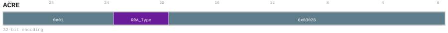

Encoding notes (informative)::
+
* ACRE - Request architecture context entry.

Operation (informative)::
+
[source]
----
EnterACR(rra_type)  // privileged ring transition (implementation-defined)
----

[[insndesc-execution-control-assert]]
===== ASSERT

Execution-control instruction used for debugging, ordering, or bring-up.

Catalog forms:: 1 form(s) (32 bits).

Assembly forms::
+
* `assert SrcL`

Encoding::
+
.`assert_32_f05d67874ae5` — `assert SrcL`

Encoding notes (informative)::
+
* ASSERT - Raise the architecture assertion trap when its condition fails.

Operation (informative)::
+
[source]
----
if (ECONFIG[3] && Read(SrcL) == 0): Trap(ASSERT_FAIL)
----

[[insndesc-execution-control-bse]]
===== BSE

Execution-control wait/event primitive (exact behavior is platform-defined).

Catalog forms:: 1 form(s) (32 bits).

Assembly forms::
+
* `bse SrcL`

Encoding::
+
.`bse_32_883b5167edbc` — `bse SrcL`
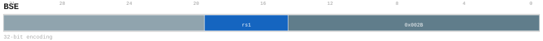

Encoding notes (informative)::
+
* BSE - Issue this mnemonic's architecture control request.

Operation (informative)::
+
[source]
----
BlockHint()  // front-end metadata; no architectural effect
----

[[insndesc-execution-control-bwe]]
===== BWE

Execution-control wait/event primitive (exact behavior is platform-defined).

Catalog forms:: 1 form(s) (32 bits).

Assembly forms::
+
* `bwe SrcL`

Encoding::
+
.`bwe_32_e5a5240bdf9b` — `bwe SrcL`
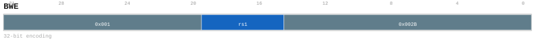

Encoding notes (informative)::
+
* BWE - Issue this mnemonic's architecture control request.

Operation (informative)::
+
[source]
----
BlockHint()  // front-end metadata; no architectural effect
----

[[insndesc-execution-control-bwi]]
===== BWI

Execution-control wait/event primitive (exact behavior is platform-defined).

Catalog forms:: 1 form(s) (32 bits).

Assembly forms::
+
* `bwi SrcL`

Encoding::
+
.`bwi_32_d9a0905cb31b` — `bwi SrcL`

Encoding notes (informative)::
+
* BWI - Issue this mnemonic's architecture control request.

Operation (informative)::
+
[source]
----
BlockHint()  // front-end metadata; no architectural effect
----

[[insndesc-execution-control-bwt]]
===== BWT

Requests the processor to sleep for a duration specified by the operand.

Catalog forms:: 1 form(s) (32 bits).

Assembly forms::
+
* `bwt SrcL`

Encoding::
+
.`bwt_32_5a0fe4a8e61f` — `bwt SrcL`

Encoding notes (informative)::
+
* BWT - Issue this mnemonic's architecture control request.

Operation (informative)::
+
[source]
----
BlockHint()  // front-end metadata; no architectural effect
----

[[insndesc-execution-control-ebreak]]
===== EBREAK

Execution-control instruction used for debugging, ordering, or bring-up.

Catalog forms:: 1 form(s) (32 bits).

Assembly forms::
+
* `ebreak imm`

Encoding::
+
.`ebreak_32_4f122d1e6be3` — `ebreak imm`
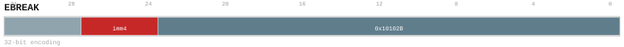

Encoding notes (informative)::
+
* EBREAK - Raise the software breakpoint exception.

Operation (informative)::
+
[source]
----
Trap(SW_BREAKPOINT)
----

[[insndesc-execution-control-fence-d]]
===== FENCE.D

Execution-control instruction used for debugging, ordering, or bring-up.

Catalog forms:: 1 form(s) (32 bits).

Assembly forms::
+
* `fence.d pred_imm, succ_imm`

Encoding::
+
.`fence_d_32_f4783f17d84d` — `fence.d pred_imm, succ_imm`
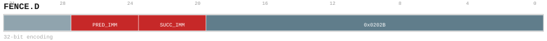

Encoding notes (informative)::
+
* FENCE.D - Order the selected predecessor and successor data-access classes.

Operation (informative)::
+
[source]
----
FenceD()  // data-cache fence
----

[[insndesc-execution-control-fence-i]]
===== FENCE.I

Execution-control instruction used for debugging, ordering, or bring-up.

Catalog forms:: 1 form(s) (32 bits).

Assembly forms::
+
* `fence.i`

Encoding::
+
.`fence_i_32_a321a2a186b1` — `fence.i`
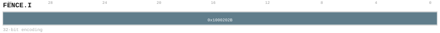

Encoding notes (informative)::
+
* FENCE.I - Synchronize instruction visibility after prior writes.

Operation (informative)::
+
[source]
----
FenceI()  // instruction-cache fence
----

[[insndesc-arithmetic-operation-64bit]]
==== Arithmetic Operation 64bit

[[insndesc-arithmetic-operation-64bit-add]]
===== ADD

Integer addition.

Catalog forms:: 1 form(s) (32 bits).

Assembly forms::
+
* `add SrcL, SrcR<{.sw,.uw,.neg}><<<shamt>, ->{t, u, Rd}`

Encoding::
+
.`add_32_d04202886d0a` — `add SrcL, SrcR<{.sw,.uw,.neg}><<<shamt>, ->{t, u, Rd}`
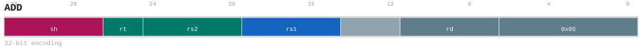

Encoding notes (informative)::
+
* ADD - Compute this mnemonic's binary scalar operation and write the selected destination.

Operation (informative)::
+
[source]
----
lhs = Read(SrcL)
rhs = Read(SrcR)  // apply modifiers/shift as encoded
result = lhs + rhs
Write(Dst, result)
----

[[insndesc-arithmetic-operation-64bit-addi]]
===== ADDI

Integer add-immediate.

Catalog forms:: 1 form(s) (32 bits).

Assembly forms::
+
* `addi SrcL, uimm, ->{t, u, Rd}`

Encoding::
+
.`addi_32_2decd0a93a0a` — `addi SrcL, uimm, ->{t, u, Rd}`
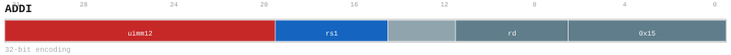

Encoding notes (informative)::
+
* ADDI - Compute this mnemonic's binary scalar operation and write the selected destination.

Operation (informative)::
+
[source]
----
lhs = Read(SrcL)
rhs = imm  // immediate as encoded
result = lhs + rhs
Write(Dst, result)
----

[[insndesc-arithmetic-operation-64bit-and]]
===== AND

Bitwise AND.

Catalog forms:: 1 form(s) (32 bits).

Assembly forms::
+
* `and SrcL, SrcR<{.sw,.uw,.not}><<<shamt>, ->{t, u, Rd}`

Encoding::
+
.`and_32_b6a903a3ec94` — `and SrcL, SrcR<{.sw,.uw,.not}><<<shamt>, ->{t, u, Rd}`
image::encodings/enc_and.svg[AND encoding form and_32_b6a903a3ec94,align="center"]

Encoding notes (informative)::
+
* AND - Compute this mnemonic's binary scalar operation and write the selected destination.

Operation (informative)::
+
[source]
----
lhs = Read(SrcL)
rhs = Read(SrcR)  // apply modifiers/shift as encoded
result = lhs & rhs
Write(Dst, result)
----

[[insndesc-arithmetic-operation-64bit-andi]]
===== ANDI

Bitwise AND (immediate).

Catalog forms:: 1 form(s) (32 bits).

Assembly forms::
+
* `andi SrcL, simm, ->{t, u, Rd}`

Encoding::
+
.`andi_32_1d9302e57d30` — `andi SrcL, simm, ->{t, u, Rd}`
image::encodings/enc_andi.svg[ANDI encoding form andi_32_1d9302e57d30,align="center"]

Encoding notes (informative)::
+
* ANDI - Compute this mnemonic's binary scalar operation and write the selected destination.

Operation (informative)::
+
[source]
----
a = Read(SrcL)
imm = SignExtend(simm12)
result = a & imm
Write(Dst, result)
----

[[insndesc-arithmetic-operation-64bit-hl-addi]]
===== HL.ADDI

This mnemonic has a 48-bit composed encoding (prefix + main). Integer add-immediate.

Catalog forms:: 1 form(s) (48 bits).

Assembly forms::
+
* `hl.addi SrcL, uimm, ->{t, u, Rd}`

Encoding::
+
.`hl_addi_48_9d3818bfbe64` — `hl.addi SrcL, uimm, ->{t, u, Rd}`
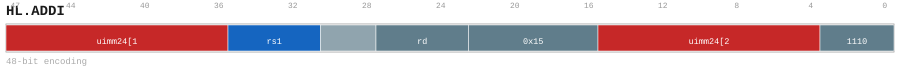

Encoding notes (informative)::
+
* HL.ADDI - Compute this mnemonic's binary scalar operation and write the selected destination.

Operation (informative)::
+
[source]
----
lhs = Read(SrcL)
rhs = imm  // immediate as encoded
result = lhs + rhs
Write(Dst, result)
----

[[insndesc-arithmetic-operation-64bit-hl-andi]]
===== HL.ANDI

This mnemonic has a 48-bit composed encoding (prefix + main). Bitwise AND (immediate).

Catalog forms:: 1 form(s) (48 bits).

Assembly forms::
+
* `hl.andi SrcL, simm, ->{t, u, Rd}`

Encoding::
+
.`hl_andi_48_fe11c7ebca41` — `hl.andi SrcL, simm, ->{t, u, Rd}`
image::encodings/enc_hl_andi.svg[HL.ANDI encoding form hl_andi_48_fe11c7ebca41,align="center"]

Encoding notes (informative)::
+
* HL.ANDI - Compute this mnemonic's binary scalar operation and write the selected destination.

Operation (informative)::
+
[source]
----
a = Read(SrcL)
imm = SignExtend(simm24)
result = a & imm
Write(Dst, result)
----

[[insndesc-arithmetic-operation-64bit-hl-ori]]
===== HL.ORI

This mnemonic has a 48-bit composed encoding (prefix + main). Bitwise OR (immediate).

Catalog forms:: 1 form(s) (48 bits).

Assembly forms::
+
* `hl.ori SrcL, simm, ->{t, u, Rd}`

Encoding::
+
.`hl_ori_48_c6d8ce28a78b` — `hl.ori SrcL, simm, ->{t, u, Rd}`
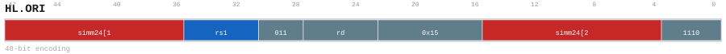

Encoding notes (informative)::
+
* HL.ORI - Compute this mnemonic's binary scalar operation and write the selected destination.

Operation (informative)::
+
[source]
----
a = Read(SrcL)
imm = SignExtend(simm24)
result = a | imm
Write(Dst, result)
----

[[insndesc-arithmetic-operation-64bit-hl-subi]]
===== HL.SUBI

This mnemonic has a 48-bit composed encoding (prefix + main). Integer subtract-immediate.

Catalog forms:: 1 form(s) (48 bits).

Assembly forms::
+
* `hl.subi SrcL, uimm, ->{t, u, Rd}`

Encoding::
+
.`hl_subi_48_e1f491a8aead` — `hl.subi SrcL, uimm, ->{t, u, Rd}`

Encoding notes (informative)::
+
* HL.SUBI - Compute this mnemonic's binary scalar operation and write the selected destination.

Operation (informative)::
+
[source]
----
lhs = Read(SrcL)
rhs = imm  // immediate as encoded
result = lhs - rhs
Write(Dst, result)
----

[[insndesc-arithmetic-operation-64bit-hl-xori]]
===== HL.XORI

This mnemonic has a 48-bit composed encoding (prefix + main). Bitwise XOR (immediate).

Catalog forms:: 1 form(s) (48 bits).

Assembly forms::
+
* `hl.xori SrcL, simm, ->{t, u, Rd}`

Encoding::
+
.`hl_xori_48_b4d85f91aad8` — `hl.xori SrcL, simm, ->{t, u, Rd}`
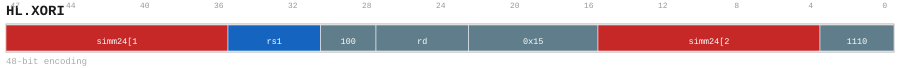

Encoding notes (informative)::
+
* HL.XORI - Compute this mnemonic's binary scalar operation and write the selected destination.

Operation (informative)::
+
[source]
----
a = Read(SrcL)
imm = SignExtend(simm24)
result = a ^ imm
Write(Dst, result)
----

[[insndesc-arithmetic-operation-64bit-or]]
===== OR

Bitwise OR.

Catalog forms:: 1 form(s) (32 bits).

Assembly forms::
+
* `or SrcL, SrcR<{.sw,.uw,.not}><<<shamt>, ->{t, u, Rd}`

Encoding::
+
.`or_32_a7fb80e78831` — `or SrcL, SrcR<{.sw,.uw,.not}><<<shamt>, ->{t, u, Rd}`

Encoding notes (informative)::
+
* OR - Compute this mnemonic's binary scalar operation and write the selected destination.

Operation (informative)::
+
[source]
----
lhs = Read(SrcL)
rhs = Read(SrcR)  // apply modifiers/shift as encoded
result = lhs | rhs
Write(Dst, result)
----

[[insndesc-arithmetic-operation-64bit-ori]]
===== ORI

Bitwise OR (immediate).

Catalog forms:: 1 form(s) (32 bits).

Assembly forms::
+
* `ori SrcL, simm, ->{t, u, Rd}`

Encoding::
+
.`ori_32_413a6cc76e9a` — `ori SrcL, simm, ->{t, u, Rd}`

Encoding notes (informative)::
+
* ORI - Compute this mnemonic's binary scalar operation and write the selected destination.

Operation (informative)::
+
[source]
----
a = Read(SrcL)
imm = SignExtend(simm12)
result = a | imm
Write(Dst, result)
----

[[insndesc-arithmetic-operation-64bit-sll]]
===== SLL

Logical left shift.

Catalog forms:: 1 form(s) (32 bits).

Assembly forms::
+
* `sll SrcL, SrcR, ->{t, u, Rd}`

Encoding::
+
.`sll_32_a100b8961e21` — `sll SrcL, SrcR, ->{t, u, Rd}`

Encoding notes (informative)::
+
* SLL - Compute this mnemonic's binary scalar operation and write the selected destination.

Operation (informative)::
+
[source]
----
a = Read(SrcL)
sh = Read(SrcR) & 63
result = a << sh
Write(Dst, result)
----

[[insndesc-arithmetic-operation-64bit-slli]]
===== SLLI

Logical left shift (immediate).

Catalog forms:: 1 form(s) (32 bits).

Assembly forms::
+
* `slli SrcL, shamt, ->{t, u, Rd}`

Encoding::
+
.`slli_32_b43ca2454e3a` — `slli SrcL, shamt, ->{t, u, Rd}`

Encoding notes (informative)::
+
* SLLI - Compute this mnemonic's binary scalar operation and write the selected destination.

Operation (informative)::
+
[source]
----
a = Read(SrcL)
sh = shamt
result = a << sh
Write(Dst, result)
----

[[insndesc-arithmetic-operation-64bit-sra]]
===== SRA

Arithmetic right shift.

Catalog forms:: 1 form(s) (32 bits).

Assembly forms::
+
* `sra SrcL, SrcR, ->{t, u, Rd}`

Encoding::
+
.`sra_32_ba03eea6386b` — `sra SrcL, SrcR, ->{t, u, Rd}`

Encoding notes (informative)::
+
* SRA - Compute this mnemonic's binary scalar operation and write the selected destination.

Operation (informative)::
+
[source]
----
a = Read(SrcL)
sh = Read(SrcR) & 63
result = a >> (arith) sh
Write(Dst, result)
----

[[insndesc-arithmetic-operation-64bit-srai]]
===== SRAI

Arithmetic right shift (immediate).

Catalog forms:: 1 form(s) (32 bits).

Assembly forms::
+
* `srai SrcL, shamt, ->{t, u, Rd}`

Encoding::
+
.`srai_32_e471ea84d4fd` — `srai SrcL, shamt, ->{t, u, Rd}`
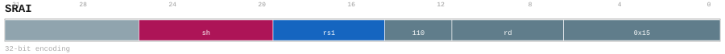

Encoding notes (informative)::
+
* SRAI - Compute this mnemonic's binary scalar operation and write the selected destination.

Operation (informative)::
+
[source]
----
a = Read(SrcL)
sh = shamt
result = a >> (arith) sh
Write(Dst, result)
----

[[insndesc-arithmetic-operation-64bit-srl]]
===== SRL

Logical right shift.

Catalog forms:: 1 form(s) (32 bits).

Assembly forms::
+
* `srl SrcL, SrcR, ->{t, u, Rd}`

Encoding::
+
.`srl_32_5cfca42c59f3` — `srl SrcL, SrcR, ->{t, u, Rd}`
image::encodings/enc_srl.svg[SRL encoding form srl_32_5cfca42c59f3,align="center"]

Encoding notes (informative)::
+
* SRL - Compute this mnemonic's binary scalar operation and write the selected destination.

Operation (informative)::
+
[source]
----
a = Read(SrcL)
sh = Read(SrcR) & 63
result = a >> sh
Write(Dst, result)
----

[[insndesc-arithmetic-operation-64bit-srli]]
===== SRLI

Logical right shift (immediate).

Catalog forms:: 1 form(s) (32 bits).

Assembly forms::
+
* `srli SrcL, shamt, ->{t, u, Rd}`

Encoding::
+
.`srli_32_dd29ca058cfe` — `srli SrcL, shamt, ->{t, u, Rd}`
image::encodings/enc_srli.svg[SRLI encoding form srli_32_dd29ca058cfe,align="center"]

Encoding notes (informative)::
+
* SRLI - Compute this mnemonic's binary scalar operation and write the selected destination.

Operation (informative)::
+
[source]
----
a = Read(SrcL)
sh = shamt
result = a >> sh
Write(Dst, result)
----

[[insndesc-arithmetic-operation-64bit-sub]]
===== SUB

Integer subtraction.

Catalog forms:: 1 form(s) (32 bits).

Assembly forms::
+
* `sub SrcL, SrcR<{.sw,.uw,.neg}><<<shamt>, ->{t, u, Rd}`

Encoding::
+
.`sub_32_af383d4a2b42` — `sub SrcL, SrcR<{.sw,.uw,.neg}><<<shamt>, ->{t, u, Rd}`

Encoding notes (informative)::
+
* SUB - Compute this mnemonic's binary scalar operation and write the selected destination.

Operation (informative)::
+
[source]
----
lhs = Read(SrcL)
rhs = Read(SrcR)  // apply modifiers/shift as encoded
result = lhs - rhs
Write(Dst, result)
----

[[insndesc-arithmetic-operation-64bit-subi]]
===== SUBI

Integer subtract-immediate.

Catalog forms:: 1 form(s) (32 bits).

Assembly forms::
+
* `subi SrcL, uimm, ->{t, u, Rd}`

Encoding::
+
.`subi_32_a0c87f5e7ac4` — `subi SrcL, uimm, ->{t, u, Rd}`

Encoding notes (informative)::
+
* SUBI - Compute this mnemonic's binary scalar operation and write the selected destination.

Operation (informative)::
+
[source]
----
lhs = Read(SrcL)
rhs = imm  // immediate as encoded
result = lhs - rhs
Write(Dst, result)
----

[[insndesc-arithmetic-operation-64bit-xor]]
===== XOR

Bitwise XOR.

Catalog forms:: 1 form(s) (32 bits).

Assembly forms::
+
* `xor SrcL, SrcR<{.sw,.uw,.not}><<<shamt>, ->{t, u, Rd}`

Encoding::
+
.`xor_32_33510860c585` — `xor SrcL, SrcR<{.sw,.uw,.not}><<<shamt>, ->{t, u, Rd}`

Encoding notes (informative)::
+
* XOR - Compute this mnemonic's binary scalar operation and write the selected destination.

Operation (informative)::
+
[source]
----
lhs = Read(SrcL)
rhs = Read(SrcR)  // apply modifiers/shift as encoded
result = lhs ^ rhs
Write(Dst, result)
----

[[insndesc-arithmetic-operation-64bit-xori]]
===== XORI

Bitwise XOR (immediate).

Catalog forms:: 1 form(s) (32 bits).

Assembly forms::
+
* `xori SrcL, simm, ->{t, u, Rd}`

Encoding::
+
.`xori_32_5cf7e5be17e7` — `xori SrcL, simm, ->{t, u, Rd}`

Encoding notes (informative)::
+
* XORI - Compute this mnemonic's binary scalar operation and write the selected destination.

Operation (informative)::
+
[source]
----
a = Read(SrcL)
imm = SignExtend(simm12)
result = a ^ imm
Write(Dst, result)
----

[[insndesc-arithmetic-operation-32bit]]
==== Arithmetic Operation 32bit

[[insndesc-arithmetic-operation-32bit-addiw]]
===== ADDIW

Word (32-bit) add-immediate.

Catalog forms:: 1 form(s) (32 bits).

Assembly forms::
+
* `addiw SrcL, uimm, ->{t, u, Rd}`

Encoding::
+
.`addiw_32_08cc89cd2689` — `addiw SrcL, uimm, ->{t, u, Rd}`

Encoding notes (informative)::
+
* ADDIW - Compute this mnemonic's 32-bit binary operation and sign-extend the result.

Operation (informative)::
+
[source]
----
Execute operation as selected by the mnemonic and encoded modifiers.
----

[[insndesc-arithmetic-operation-32bit-addw]]
===== ADDW

Word (32-bit) integer addition.

Catalog forms:: 1 form(s) (32 bits).

Assembly forms::
+
* `addw SrcL, SrcR<{.sw,.uw,.neg}><<<shamt>, ->{t, u, Rd}`

Encoding::
+
.`addw_32_a27109fe30fc` — `addw SrcL, SrcR<{.sw,.uw,.neg}><<<shamt>, ->{t, u, Rd}`

Encoding notes (informative)::
+
* ADDW - Compute this mnemonic's 32-bit binary operation and sign-extend the result.

Operation (informative)::
+
[source]
----
Execute operation as selected by the mnemonic and encoded modifiers.
----

[[insndesc-arithmetic-operation-32bit-andiw]]
===== ANDIW

Word (32-bit) AND-immediate.

Catalog forms:: 1 form(s) (32 bits).

Assembly forms::
+
* `andiw SrcL, simm, ->{t, u, Rd}`

Encoding::
+
.`andiw_32_9ec1f7343dbd` — `andiw SrcL, simm, ->{t, u, Rd}`

Encoding notes (informative)::
+
* ANDIW - Compute this mnemonic's 32-bit binary operation and sign-extend the result.

Operation (informative)::
+
[source]
----
a = Read(SrcL)[31:0]
imm = SignExtend(simm12)[31:0]
result32 = a & imm
result = SignExtend32(result32)
Write(Dst, result)
----

[[insndesc-arithmetic-operation-32bit-andw]]
===== ANDW

Word (32-bit) bitwise AND.

Catalog forms:: 1 form(s) (32 bits).

Assembly forms::
+
* `andw SrcL, SrcR<{.sw,.uw,.not}><<<shamt>, ->{t, u, Rd}`

Encoding::
+
.`andw_32_6907ed7cec90` — `andw SrcL, SrcR<{.sw,.uw,.not}><<<shamt>, ->{t, u, Rd}`
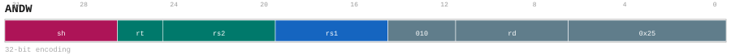

Encoding notes (informative)::
+
* ANDW - Compute this mnemonic's 32-bit binary operation and sign-extend the result.

Operation (informative)::
+
[source]
----
Execute operation as selected by the mnemonic and encoded modifiers.
----

[[insndesc-arithmetic-operation-32bit-hl-addiw]]
===== HL.ADDIW

This mnemonic has a 48-bit composed encoding (prefix + main). Word (32-bit) add-immediate.

Catalog forms:: 1 form(s) (48 bits).

Assembly forms::
+
* `hl.addiw SrcL, uimm, ->{t, u, Rd}`

Encoding::
+
.`hl_addiw_48_f6d7f5032964` — `hl.addiw SrcL, uimm, ->{t, u, Rd}`
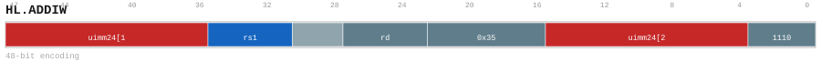

Encoding notes (informative)::
+
* HL.ADDIW - Compute this mnemonic's 32-bit binary operation and sign-extend the result.

Operation (informative)::
+
[source]
----
Execute operation as selected by the mnemonic and encoded modifiers.
----

[[insndesc-arithmetic-operation-32bit-hl-andiw]]
===== HL.ANDIW

This mnemonic has a 48-bit composed encoding (prefix + main). Word (32-bit) AND-immediate.

Catalog forms:: 1 form(s) (48 bits).

Assembly forms::
+
* `hl.andiw SrcL, simm, ->{t, u, Rd}`

Encoding::
+
.`hl_andiw_48_878c6594c6ff` — `hl.andiw SrcL, simm, ->{t, u, Rd}`

Encoding notes (informative)::
+
* HL.ANDIW - Compute this mnemonic's 32-bit binary operation and sign-extend the result.

Operation (informative)::
+
[source]
----
a = Read(SrcL)[31:0]
imm = SignExtend(simm24)[31:0]
result32 = a & imm
result = SignExtend32(result32)
Write(Dst, result)
----

[[insndesc-arithmetic-operation-32bit-hl-oriw]]
===== HL.ORIW

This mnemonic has a 48-bit composed encoding (prefix + main). Word (32-bit) OR-immediate.

Catalog forms:: 1 form(s) (48 bits).

Assembly forms::
+
* `hl.oriw SrcL, simm, ->{t, u, Rd}`

Encoding::
+
.`hl_oriw_48_17673d186249` — `hl.oriw SrcL, simm, ->{t, u, Rd}`

Encoding notes (informative)::
+
* HL.ORIW - Compute this mnemonic's 32-bit binary operation and sign-extend the result.

Operation (informative)::
+
[source]
----
a = Read(SrcL)[31:0]
imm = SignExtend(simm24)[31:0]
result32 = a | imm
result = SignExtend32(result32)
Write(Dst, result)
----

[[insndesc-arithmetic-operation-32bit-hl-subiw]]
===== HL.SUBIW

This mnemonic has a 48-bit composed encoding (prefix + main). Word (32-bit) subtract-immediate.

Catalog forms:: 1 form(s) (48 bits).

Assembly forms::
+
* `hl.subiw SrcL, uimm, ->{t, u, Rd}`

Encoding::
+
.`hl_subiw_48_adc7b127a2f8` — `hl.subiw SrcL, uimm, ->{t, u, Rd}`

Encoding notes (informative)::
+
* HL.SUBIW - Compute this mnemonic's 32-bit binary operation and sign-extend the result.

Operation (informative)::
+
[source]
----
Execute operation as selected by the mnemonic and encoded modifiers.
----

[[insndesc-arithmetic-operation-32bit-hl-xoriw]]
===== HL.XORIW

This mnemonic has a 48-bit composed encoding (prefix + main). Word (32-bit) XOR-immediate.

Catalog forms:: 1 form(s) (48 bits).

Assembly forms::
+
* `hl.xoriw SrcL, simm, ->{t, u, Rd}`

Encoding::
+
.`hl_xoriw_48_9a3edbd09746` — `hl.xoriw SrcL, simm, ->{t, u, Rd}`
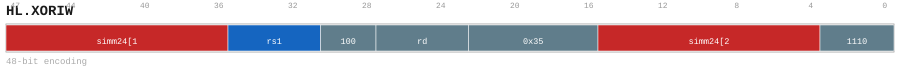

Encoding notes (informative)::
+
* HL.XORIW - Compute this mnemonic's 32-bit binary operation and sign-extend the result.

Operation (informative)::
+
[source]
----
a = Read(SrcL)[31:0]
imm = SignExtend(simm24)[31:0]
result32 = a ^ imm
result = SignExtend32(result32)
Write(Dst, result)
----

[[insndesc-arithmetic-operation-32bit-oriw]]
===== ORIW

Word (32-bit) OR-immediate.

Catalog forms:: 1 form(s) (32 bits).

Assembly forms::
+
* `oriw SrcL, simm, ->{t, u, Rd}`

Encoding::
+
.`oriw_32_91608caf1ba6` — `oriw SrcL, simm, ->{t, u, Rd}`
image::encodings/enc_oriw.svg[ORIW encoding form oriw_32_91608caf1ba6,align="center"]

Encoding notes (informative)::
+
* ORIW - Compute this mnemonic's 32-bit binary operation and sign-extend the result.

Operation (informative)::
+
[source]
----
a = Read(SrcL)[31:0]
imm = SignExtend(simm12)[31:0]
result32 = a | imm
result = SignExtend32(result32)
Write(Dst, result)
----

[[insndesc-arithmetic-operation-32bit-orw]]
===== ORW

Word (32-bit) bitwise OR.

Catalog forms:: 1 form(s) (32 bits).

Assembly forms::
+
* `orw SrcL, SrcR<{.sw,.uw,.not}><<<shamt>, ->{t, u, Rd}`

Encoding::
+
.`orw_32_84f7ac2ed68f` — `orw SrcL, SrcR<{.sw,.uw,.not}><<<shamt>, ->{t, u, Rd}`

Encoding notes (informative)::
+
* ORW - Compute this mnemonic's 32-bit binary operation and sign-extend the result.

Operation (informative)::
+
[source]
----
Execute operation as selected by the mnemonic and encoded modifiers.
----

[[insndesc-arithmetic-operation-32bit-slliw]]
===== SLLIW

Word (32-bit) logical left shift (immediate).

Catalog forms:: 1 form(s) (32 bits).

Assembly forms::
+
* `slliw SrcL, shamt, ->{t, u, Rd}`

Encoding::
+
.`slliw_32_c6bf463b97ae` — `slliw SrcL, shamt, ->{t, u, Rd}`

Encoding notes (informative)::
+
* SLLIW - Compute this mnemonic's 32-bit binary operation and sign-extend the result.

Operation (informative)::
+
[source]
----
a = Read(SrcL)[31:0]
sh = shamt
result32 = a << sh
result = SignExtend32(result32)
Write(Dst, result)
----

[[insndesc-arithmetic-operation-32bit-sllw]]
===== SLLW

Word (32-bit) logical left shift.

Catalog forms:: 1 form(s) (32 bits).

Assembly forms::
+
* `sllw SrcL, SrcR, ->{t, u, Rd}`

Encoding::
+
.`sllw_32_a37b63c16b27` — `sllw SrcL, SrcR, ->{t, u, Rd}`

Encoding notes (informative)::
+
* SLLW - Compute this mnemonic's 32-bit binary operation and sign-extend the result.

Operation (informative)::
+
[source]
----
a = Read(SrcL)[31:0]
sh = Read(SrcR) & 31
result32 = a << sh
result = SignExtend32(result32)
Write(Dst, result)
----

[[insndesc-arithmetic-operation-32bit-sraiw]]
===== SRAIW

Word (32-bit) arithmetic right shift (immediate).

Catalog forms:: 1 form(s) (32 bits).

Assembly forms::
+
* `sraiw SrcL, shamt, ->{t, u, Rd}`

Encoding::
+
.`sraiw_32_db04a6299504` — `sraiw SrcL, shamt, ->{t, u, Rd}`
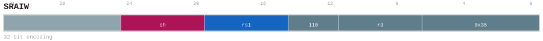

Encoding notes (informative)::
+
* SRAIW - Compute this mnemonic's 32-bit binary operation and sign-extend the result.

Operation (informative)::
+
[source]
----
a = Read(SrcL)[31:0]
sh = shamt
result32 = a >> (arith) sh
result = SignExtend32(result32)
Write(Dst, result)
----

[[insndesc-arithmetic-operation-32bit-sraw]]
===== SRAW

Word (32-bit) arithmetic right shift.

Catalog forms:: 1 form(s) (32 bits).

Assembly forms::
+
* `sraw SrcL, SrcR, ->{t, u, Rd}`

Encoding::
+
.`sraw_32_5baf37f34241` — `sraw SrcL, SrcR, ->{t, u, Rd}`
image::encodings/enc_sraw.svg[SRAW encoding form sraw_32_5baf37f34241,align="center"]

Encoding notes (informative)::
+
* SRAW - Compute this mnemonic's 32-bit binary operation and sign-extend the result.

Operation (informative)::
+
[source]
----
a = Read(SrcL)[31:0]
sh = Read(SrcR) & 31
result32 = a >> (arith) sh
result = SignExtend32(result32)
Write(Dst, result)
----

[[insndesc-arithmetic-operation-32bit-srliw]]
===== SRLIW

Word (32-bit) logical right shift (immediate).

Catalog forms:: 1 form(s) (32 bits).

Assembly forms::
+
* `srliw SrcL, shamt, ->{t, u, Rd}`

Encoding::
+
.`srliw_32_ef4aa650f46e` — `srliw SrcL, shamt, ->{t, u, Rd}`

Encoding notes (informative)::
+
* SRLIW - Compute this mnemonic's 32-bit binary operation and sign-extend the result.

Operation (informative)::
+
[source]
----
a = Read(SrcL)[31:0]
sh = shamt
result32 = a >> sh
result = SignExtend32(result32)
Write(Dst, result)
----

[[insndesc-arithmetic-operation-32bit-srlw]]
===== SRLW

Word (32-bit) logical right shift.

Catalog forms:: 1 form(s) (32 bits).

Assembly forms::
+
* `srlw SrcL, SrcR, ->{t, u, Rd}`

Encoding::
+
.`srlw_32_2c6458b2aadb` — `srlw SrcL, SrcR, ->{t, u, Rd}`
image::encodings/enc_srlw.svg[SRLW encoding form srlw_32_2c6458b2aadb,align="center"]

Encoding notes (informative)::
+
* SRLW - Compute this mnemonic's 32-bit binary operation and sign-extend the result.

Operation (informative)::
+
[source]
----
a = Read(SrcL)[31:0]
sh = Read(SrcR) & 31
result32 = a >> sh
result = SignExtend32(result32)
Write(Dst, result)
----

[[insndesc-arithmetic-operation-32bit-subiw]]
===== SUBIW

Word (32-bit) subtract-immediate.

Catalog forms:: 1 form(s) (32 bits).

Assembly forms::
+
* `subiw SrcL, uimm, ->{t, u, Rd}`

Encoding::
+
.`subiw_32_51019ff77d0a` — `subiw SrcL, uimm, ->{t, u, Rd}`
image::encodings/enc_subiw.svg[SUBIW encoding form subiw_32_51019ff77d0a,align="center"]

Encoding notes (informative)::
+
* SUBIW - Compute this mnemonic's 32-bit binary operation and sign-extend the result.

Operation (informative)::
+
[source]
----
Execute operation as selected by the mnemonic and encoded modifiers.
----

[[insndesc-arithmetic-operation-32bit-subw]]
===== SUBW

Word (32-bit) integer subtraction.

Catalog forms:: 1 form(s) (32 bits).

Assembly forms::
+
* `subw SrcL, SrcR<{.sw,.uw,.neg}><<<shamt>, ->{t, u, Rd}`

Encoding::
+
.`subw_32_3a8d45653c98` — `subw SrcL, SrcR<{.sw,.uw,.neg}><<<shamt>, ->{t, u, Rd}`
image::encodings/enc_subw.svg[SUBW encoding form subw_32_3a8d45653c98,align="center"]

Encoding notes (informative)::
+
* SUBW - Compute this mnemonic's 32-bit binary operation and sign-extend the result.

Operation (informative)::
+
[source]
----
Execute operation as selected by the mnemonic and encoded modifiers.
----

[[insndesc-arithmetic-operation-32bit-xoriw]]
===== XORIW

Word (32-bit) XOR-immediate.

Catalog forms:: 1 form(s) (32 bits).

Assembly forms::
+
* `xoriw SrcL, simm, ->{t, u, Rd}`

Encoding::
+
.`xoriw_32_1f8c6f43e2bd` — `xoriw SrcL, simm, ->{t, u, Rd}`
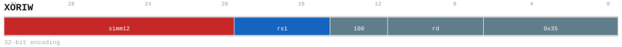

Encoding notes (informative)::
+
* XORIW - Compute this mnemonic's 32-bit binary operation and sign-extend the result.

Operation (informative)::
+
[source]
----
a = Read(SrcL)[31:0]
imm = SignExtend(simm12)[31:0]
result32 = a ^ imm
result = SignExtend32(result32)
Write(Dst, result)
----

[[insndesc-arithmetic-operation-32bit-xorw]]
===== XORW

Word (32-bit) bitwise XOR.

Catalog forms:: 1 form(s) (32 bits).

Assembly forms::
+
* `xorw SrcL, SrcR<{.sw,.uw,.not}><<<shamt>, ->{t, u, Rd}`

Encoding::
+
.`xorw_32_32282566e32d` — `xorw SrcL, SrcR<{.sw,.uw,.not}><<<shamt>, ->{t, u, Rd}`

Encoding notes (informative)::
+
* XORW - Compute this mnemonic's 32-bit binary operation and sign-extend the result.

Operation (informative)::
+
[source]
----
Execute operation as selected by the mnemonic and encoded modifiers.
----

[[insndesc-pc-relative]]
==== PC-Relative

[[insndesc-pc-relative-addtpc]]
===== ADDTPC

PC-relative addition (adds to the current PC/TPC).

Catalog forms:: 1 form(s) (32 bits).

Assembly forms::
+
* `addtpc simm, ->{t, u, Rd}`

Encoding::
+
.`addtpc_32_e5aa0f0abca3` — `addtpc simm, ->{t, u, Rd}`
image::encodings/enc_addtpc.svg[ADDTPC encoding form addtpc_32_e5aa0f0abca3,align="center"]

Encoding notes (informative)::
+
* ADDTPC - Add the encoded displacement to the program counter.

Operation (informative)::
+
[source]
----
base = CurrentPC()
off = (SignExtend(imm20) << 1)
Write(RegDst, base + off)
----

[[insndesc-pc-relative-hl-addtpc]]
===== HL.ADDTPC

This mnemonic has a 48-bit composed encoding (prefix + main). PC-relative addition (adds to the current PC/TPC).

Catalog forms:: 1 form(s) (48 bits).

Assembly forms::
+
* `hl.addtpc imm, ->{t, u, Rd}`

Encoding::
+
.`hl_addtpc_48_2e8e692eea09` — `hl.addtpc imm, ->{t, u, Rd}`
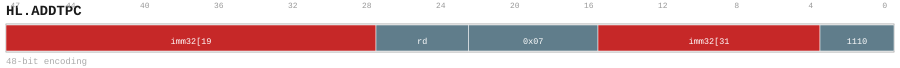

Encoding notes (informative)::
+
* HL.ADDTPC - Add the encoded displacement to the program counter.

Operation (informative)::
+
[source]
----
base = CurrentPC()
off = (SignExtend(imm32) << 1)
Write(RegDst, base + off)
----

[[insndesc-pc-relative-hl-setret]]
===== HL.SETRET

This mnemonic has a 48-bit composed encoding (prefix + main). Materializes a return address into `ra` using a PC-relative offset.

Catalog forms:: 1 form(s) (48 bits).

Assembly forms::
+
* `hl.setret imm, ->Ra`

Encoding::
+
.`hl_setret_48_302bb793a800` — `hl.setret imm, ->Ra`
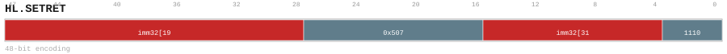

Encoding notes (informative)::
+
* HL.SETRET - Write the architectural return address.

Operation (informative)::
+
[source]
----
base = CurrentPC()
off = (ZeroExtend(imm32) << 1)
ra = base + off
----

[[insndesc-pc-relative-setret]]
===== SETRET

Materializes a return address into `ra` using a PC-relative offset.

Catalog forms:: 1 form(s) (32 bits).

Assembly forms::
+
* `setret uimm, ->Ra`

Encoding::
+
.`setret_32_72003dcf3b59` — `setret uimm, ->Ra`
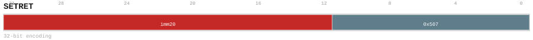

Encoding notes (informative)::
+
* SETRET - Write the architectural return address.

Operation (informative)::
+
[source]
----
base = CurrentPC()
off = (ZeroExtend(imm20) << 1)
ra = base + off
----

[[insndesc-bundle-control-attribute]]
==== Bundle Control Attribute

[[insndesc-bundle-control-attribute-b-catr]]
===== B.CATR

Performs the operation indicated by the mnemonic on the operands specified by the selected form. Operand-size, signedness, and addressing modifiers are encoded via suffixes and qualifiers in the assembly syntax.

Catalog forms:: 1 form(s) (32 bits).

Assembly forms::
+
* `B.CATR {trap, atomic, <aq, rl, aqrl>, far, dr}`

Encoding::
+
.`b_catr_32_18ebd8429b53` — `B.CATR {trap, atomic, <aq, rl, aqrl>, far, dr}`
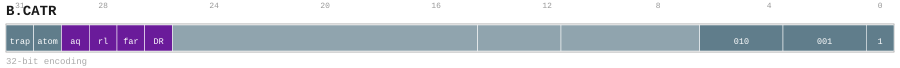

Encoding notes (informative)::
+
* Latches bundle control, trap, atomic, ordering, and address-class attributes.

Operation (informative)::
+
[source]
----
Execute operation as selected by the mnemonic and encoded modifiers.
----

[[insndesc-bundle-data-attribute]]
==== Bundle Data Attribute

[[insndesc-bundle-data-attribute-b-datr]]
===== B.DATR

Performs the operation indicated by the mnemonic on the operands specified by the selected form. Operand-size, signedness, and addressing modifiers are encoded via suffixes and qualifiers in the assembly syntax.

Catalog forms:: 1 form(s) (32 bits).

Assembly forms::
+
* `B.DATR {layout, datatype, padvalue_or_byteid, cmode, rmode, sat, canonicalize}`

Encoding::
+
.`b_datr_32_85918343b9b5` — `B.DATR {layout, datatype, padvalue_or_byteid, cmode, rmode, sat, canonicalize}`
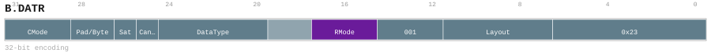

Encoding notes (informative)::
+
* Latches tile layout, data type, padding, conversion, rounding, and saturation attributes.

Operation (informative)::
+
[source]
----
Execute operation as selected by the mnemonic and encoded modifiers.
----

[[insndesc-bundle-argument]]
==== Bundle Argument

[[insndesc-bundle-argument-b-dim]]
===== B.DIM

Performs the operation indicated by the mnemonic on the operands specified by the selected form. Operand-size, signedness, and addressing modifiers are encoded via suffixes and qualifiers in the assembly syntax.

Catalog forms:: 3 form(s) (32 bits).

Assembly forms::
+
* `B.DIM RegSrc, uimm, ->LB1`
* `B.DIM RegSrc, uimm, ->LB0`
* `B.DIM RegSrc, uimm, ->LB2`

Encoding::
+
.`b_dim_32_570ae2178c51` — `B.DIM RegSrc, uimm, ->LB1`
image::encodings/enc_b_dim_32_570ae2178c51.svg[B.DIM encoding form b_dim_32_570ae2178c51,align="center"]
.`b_dim_32_a097166c338b` — `B.DIM RegSrc, uimm, ->LB0`
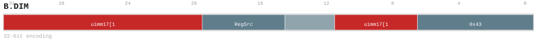
.`b_dim_32_f88715bdc6ea` — `B.DIM RegSrc, uimm, ->LB2`
image::encodings/enc_b_dim_32_f88715bdc6ea.svg[B.DIM encoding form b_dim_32_f88715bdc6ea,align="center"]

Encoding notes (informative)::
+
* Writes one of the three bundle-local dimension registers.

Operation (informative)::
+
[source]
----
Execute operation as selected by the mnemonic and encoded modifiers.
----

[[insndesc-branch]]
==== Branch

[[insndesc-branch-b-eq]]
===== B.EQ

Conditional branch. The branch is taken when the selected condition holds (equal).

Catalog forms:: 1 form(s) (32 bits).

Assembly forms::
+
* `b.eq SrcL, SrcR, label`

Encoding::
+
.`b_eq_32_41f00e5abd89` — `b.eq SrcL, SrcR, label`
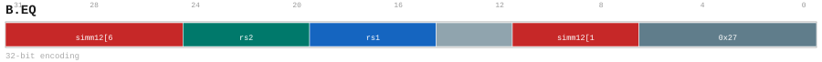

Encoding notes (informative)::
+
* B.EQ - Conditionally branch to the PC-relative target after comparing scalar operands.

Operation (informative)::
+
[source]
----
if (Read(SrcL) == Read(SrcR)):
  TPC = <target>
----

[[insndesc-branch-b-ge]]
===== B.GE

Conditional branch. The branch is taken when the selected condition holds (greater-or-equal (signed)).

Catalog forms:: 1 form(s) (32 bits).

Assembly forms::
+
* `b.ge SrcL, SrcR, label`

Encoding::
+
.`b_ge_32_7bd9050705dc` — `b.ge SrcL, SrcR, label`
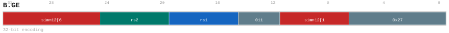

Encoding notes (informative)::
+
* B.GE - Conditionally branch to the PC-relative target after comparing scalar operands.

Operation (informative)::
+
[source]
----
if (Read(SrcL) >= Read(SrcR)  // signed):
  TPC = <target>
----

[[insndesc-branch-b-geu]]
===== B.GEU

Conditional branch. The branch is taken when the selected condition holds (greater-or-equal (unsigned)).

Catalog forms:: 1 form(s) (32 bits).

Assembly forms::
+
* `b.geu SrcL, SrcR, label`

Encoding::
+
.`b_geu_32_43a6e57dce55` — `b.geu SrcL, SrcR, label`

Encoding notes (informative)::
+
* B.GEU - Conditionally branch to the PC-relative target after comparing scalar operands.

Operation (informative)::
+
[source]
----
if (Read(SrcL) >= Read(SrcR)  // unsigned):
  TPC = <target>
----

[[insndesc-branch-b-lt]]
===== B.LT

Conditional branch. The branch is taken when the selected condition holds (less-than (signed)).

Catalog forms:: 1 form(s) (32 bits).

Assembly forms::
+
* `b.lt SrcL, SrcR, label`

Encoding::
+
.`b_lt_32_2ca5ecd25cfb` — `b.lt SrcL, SrcR, label`
image::encodings/enc_b_lt.svg[B.LT encoding form b_lt_32_2ca5ecd25cfb,align="center"]

Encoding notes (informative)::
+
* B.LT - Conditionally branch to the PC-relative target after comparing scalar operands.

Operation (informative)::
+
[source]
----
if (Read(SrcL) < Read(SrcR)  // signed):
  TPC = <target>
----

[[insndesc-branch-b-ltu]]
===== B.LTU

Conditional branch. The branch is taken when the selected condition holds (less-than (unsigned)).

Catalog forms:: 1 form(s) (32 bits).

Assembly forms::
+
* `b.ltu SrcL, SrcR, label`

Encoding::
+
.`b_ltu_32_f1ea7ad44e37` — `b.ltu SrcL, SrcR, label`

Encoding notes (informative)::
+
* B.LTU - Conditionally branch to the PC-relative target after comparing scalar operands.

Operation (informative)::
+
[source]
----
if (Read(SrcL) < Read(SrcR)  // unsigned):
  TPC = <target>
----

[[insndesc-branch-b-ne]]
===== B.NE

Conditional branch. The branch is taken when the selected condition holds (not equal).

Catalog forms:: 1 form(s) (32 bits).

Assembly forms::
+
* `b.ne SrcL, SrcR, label`

Encoding::
+
.`b_ne_32_831af6a36ff4` — `b.ne SrcL, SrcR, label`

Encoding notes (informative)::
+
* B.NE - Conditionally branch to the PC-relative target after comparing scalar operands.

Operation (informative)::
+
[source]
----
if (Read(SrcL) != Read(SrcR)):
  TPC = <target>
----

[[insndesc-branch-b-nz]]
===== B.NZ

Conditional branch. The branch is taken when the selected condition holds (non-zero).

Catalog forms:: 1 form(s) (32 bits).

Assembly forms::
+
* `b.nz label`

Encoding::
+
.`b_nz_32_0f583cdd8d4d` — `b.nz label`

Encoding notes (informative)::
+
* B.NZ - Conditionally branch to the PC-relative target after comparing scalar operands.

Operation (informative)::
+
[source]
----
if (branch condition holds (non-zero)):
  TPC = <target>
----

[[insndesc-branch-b-z]]
===== B.Z

Conditional branch. The branch is taken when the selected condition holds (zero).

Catalog forms:: 1 form(s) (32 bits).

Assembly forms::
+
* `b.z label`

Encoding::
+
.`b_z_32_753dd3b4fcb6` — `b.z label`
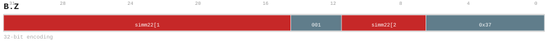

Encoding notes (informative)::
+
* B.Z - Conditionally branch to the PC-relative target after comparing scalar operands.

Operation (informative)::
+
[source]
----
if (branch condition holds (zero)):
  TPC = <target>
----

[[insndesc-branch-j]]
===== J

Unconditional PC-relative jump to `label`.

Catalog forms:: 1 form(s) (32 bits).

Assembly forms::
+
* `j label`

Encoding::
+
.`j_32_a303cf05af42` — `j label`
image::encodings/enc_j.svg[J encoding form j_32_a303cf05af42,align="center"]

Encoding notes (informative)::
+
* J - Jump to the PC-relative target.

Operation (informative)::
+
[source]
----
TPC = <target>
----

[[insndesc-branch-jr]]
===== JR

Jump to an address formed from a base register plus an immediate offset.

Catalog forms:: 1 form(s) (32 bits).

Assembly forms::
+
* `jr SrcL, label`

Encoding::
+
.`jr_32_c4128e843b05` — `jr SrcL, label`
image::encodings/enc_jr.svg[JR encoding form jr_32_c4128e843b05,align="center"]

Encoding notes (informative)::
+
* JR - Jump to the scalar-register target.

Operation (informative)::
+
[source]
----
TPC = <target>
----

[[insndesc-bundle-hint]]
==== Bundle Hint

[[insndesc-bundle-hint-b-hint]]
===== B.HINT

Performs the operation indicated by the mnemonic on the operands specified by the selected form. Operand-size, signedness, and addressing modifiers are encoded via suffixes and qualifiers in the assembly syntax.

Catalog forms:: 2 form(s) (32 bits).

Assembly forms::
+
* `B.HINT TRACE.{begin, end}`
* `B.HINT {BR.{likely, unlikely}, TEMP.{hot, warm, cool, none}, PRFSIZE}`

Encoding::
+
.`b_hint_32_67e2ad8dd981` — `B.HINT TRACE.{begin, end}`
image::encodings/enc_b_hint_32_67e2ad8dd981.svg[B.HINT encoding form b_hint_32_67e2ad8dd981,align="center"]
.`b_hint_32_b3e8a4e77930` — `B.HINT {BR.{likely, unlikely}, TEMP.{hot, warm, cool, none}, PRFSIZE}`
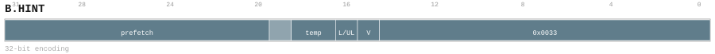

Encoding notes (informative)::
+
* Records non-functional branch, temperature, prefetch-size, or trace guidance.

Operation (informative)::
+
[source]
----
Execute operation as selected by the mnemonic and encoded modifiers.
----

[[insndesc-bundle-input-output]]
==== Bundle Input & Output

[[insndesc-bundle-input-output-b-ior]]
===== B.IOR

Loads a value from memory using the addressing form shown in the syntax and writes the result to the selected destination.

Catalog forms:: 1 form(s) (32 bits).

Assembly forms::
+
* `B.IOR [<gpr>[, <gpr>[, <gpr>]]][, -><gpr>]`

Encoding::
+
.`b_ior_32_df50a269be7c` — `B.IOR [<gpr>[, <gpr>[, <gpr>]]][, -><gpr>]`
image::encodings/enc_b_ior.svg[B.IOR encoding form b_ior_32_df50a269be7c,align="center"]

Encoding notes (informative)::
+
* Bind up to three absolute GPR inputs and one absolute GPR output; TLOAD/TSTORE use source zero as GM base and source one as logical row stride.

Operation (informative)::
+
[source]
----
Execute operation as selected by the mnemonic and encoded modifiers.
----

[[insndesc-bundle-input-output-b-ios]]
===== B.IOS

Performs the operation indicated by the mnemonic on the operands specified by the selected form. Operand-size, signedness, and addressing modifiers are encoded via suffixes and qualifiers in the assembly syntax.

Catalog forms:: 1 form(s) (32 bits).

Assembly forms::
+
* `B.IOS S<SharedTID>, mask=<PE_MASK> \| B.IOS mask=<PE_MASK>, ->S<SharedTID><TSize>`

Encoding::
+
.`b_ios_32_11ff57a2e635` — `B.IOS S<SharedTID>, mask=<PE_MASK> \| B.IOS mask=<PE_MASK>, ->S<SharedTID><TSize>`
image::encodings/enc_b_ios.svg[B.IOS encoding form b_ios_32_11ff57a2e635,align="center"]

Encoding notes (informative)::
+
* Binds one ordered absolute core-private Shared register S0..S255 with a per-PE source/destination size code and four-PE participation mask.

Operation (informative)::
+
[source]
----
Execute operation as selected by the mnemonic and encoded modifiers.
----

[[insndesc-bundle-input-output-b-iot]]
===== B.IOT

Performs the operation indicated by the mnemonic on the operands specified by the selected form. Operand-size, signedness, and addressing modifiers are encoded via suffixes and qualifiers in the assembly syntax.

Catalog forms:: 5 form(s) (32 bits).

Assembly forms::
+
* `B.IOT SrcTile0, SrcTile1, mask=PE_MASK, <last>`
* `B.IOT mask=PE_MASK, <last>, ->DstTile<TSize>`
* `B.IOT SrcTile0, mask=PE_MASK, <last>, ->DstTile<TSize>`
* `B.IOT SrcTile0, SrcTile1, mask=PE_MASK, <last>, ->DstTile<TSize>`
* `B.IOT SrcTile0, mask=PE_MASK, <last>`

Encoding::
+
.`b_iot_32_36792782e584` — `B.IOT SrcTile0, SrcTile1, mask=PE_MASK, <last>`
image::encodings/enc_b_iot_32_36792782e584.svg[B.IOT encoding form b_iot_32_36792782e584,align="center"]
.`b_iot_32_3a493c45ddfa` — `B.IOT mask=PE_MASK, <last>, ->DstTile<TSize>`
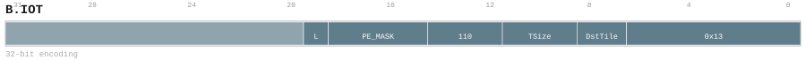
.`b_iot_32_437af312f86d` — `B.IOT SrcTile0, mask=PE_MASK, <last>, ->DstTile<TSize>`
image::encodings/enc_b_iot_32_437af312f86d.svg[B.IOT encoding form b_iot_32_437af312f86d,align="center"]
.`b_iot_32_84944b9c3d19` — `B.IOT SrcTile0, SrcTile1, mask=PE_MASK, <last>, ->DstTile<TSize>`
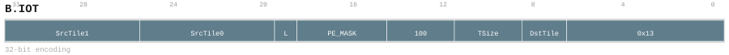
.`b_iot_32_f17390877416` — `B.IOT SrcTile0, mask=PE_MASK, <last>`
image::encodings/enc_b_iot_32_f17390877416.svg[B.IOT encoding form b_iot_32_f17390877416,align="center"]

Encoding notes (informative)::
+
* Binds v5 PE_MASK, ordered Local tile sources, last-use, and optional TSize/2-bit Local destination metadata; reuse bits do not exist.
* Binds a destination-only Local Tile operand with per-PE TSize, PE_MASK, and last-use metadata; PE_MASK=0000 is a strict no-op and there is no mask-only Shared companion form.

Operation (informative)::
+
[source]
----
Execute operation as selected by the mnemonic and encoded modifiers.
----

[[insndesc-bundle-offset]]
==== Bundle Offset

[[insndesc-bundle-offset-b-text]]
===== B.TEXT

Performs the operation indicated by the mnemonic on the operands specified by the selected form. Operand-size, signedness, and addressing modifiers are encoded via suffixes and qualifiers in the assembly syntax.

Catalog forms:: 1 form(s) (32 bits).

Assembly forms::
+
* `B.TEXT <label>`

Encoding::
+
.`b_text_32_6f2fe6f95841` — `B.TEXT <label>`
image::encodings/enc_b_text.svg[B.TEXT encoding form b_text_32_6f2fe6f95841,align="center"]

Encoding notes (informative)::
+
* Sets the out-of-line body entry address for a decoupled bundle.

Operation (informative)::
+
[source]
----
Execute operation as selected by the mnemonic and encoded modifiers.
----

[[insndesc-cache-maintain]]
==== Cache Maintain

[[insndesc-cache-maintain-bc-iall]]
===== BC.IALL

Branch cache/predictor maintenance operation, selected by the mnemonic suffix.

Catalog forms:: 1 form(s) (32 bits).

Assembly forms::
+
* `bc.iall`

Encoding::
+
.`bc_iall_32_fdceb48516a8` — `bc.iall`
image::encodings/enc_bc_iall.svg[BC.IALL encoding form bc_iall_32_fdceb48516a8,align="center"]

Encoding notes (informative)::
+
* BC.IALL - Perform this mnemonic's cache, TLB, or bundle maintenance operation.

Operation (informative)::
+
[source]
----
Maintain(op)
----

[[insndesc-cache-maintain-bc-iva]]
===== BC.IVA

Branch cache/predictor maintenance operation, selected by the mnemonic suffix.

Catalog forms:: 1 form(s) (32 bits).

Assembly forms::
+
* `bc.iva SrcL`

Encoding::
+
.`bc_iva_32_c166de534c98` — `bc.iva SrcL`

Encoding notes (informative)::
+
* BC.IVA - Perform this mnemonic's cache, TLB, or bundle maintenance operation.

Operation (informative)::
+
[source]
----
Maintain(op, address=Read(SrcL))
----

[[insndesc-cache-maintain-dc-cisw]]
===== DC.CISW

Data-cache maintenance operation (invalidate/clean/zero, by address or by set/way), selected by the mnemonic suffix.

Catalog forms:: 1 form(s) (32 bits).

Assembly forms::
+
* `dc.cisw SrcL`

Encoding::
+
.`dc_cisw_32_166b7135e3c1` — `dc.cisw SrcL`

Encoding notes (informative)::
+
* DC.CISW - Perform this mnemonic's cache, TLB, or bundle maintenance operation.

Operation (informative)::
+
[source]
----
Maintain(op, address=Read(SrcL))
----

[[insndesc-cache-maintain-dc-civa]]
===== DC.CIVA

Data-cache maintenance operation (invalidate/clean/zero, by address or by set/way), selected by the mnemonic suffix.

Catalog forms:: 1 form(s) (32 bits).

Assembly forms::
+
* `dc.civa SrcL`

Encoding::
+
.`dc_civa_32_265d686549c8` — `dc.civa SrcL`

Encoding notes (informative)::
+
* DC.CIVA - Perform this mnemonic's cache, TLB, or bundle maintenance operation.

Operation (informative)::
+
[source]
----
Maintain(op, address=Read(SrcL))
----

[[insndesc-cache-maintain-dc-csw]]
===== DC.CSW

Data-cache maintenance operation (invalidate/clean/zero, by address or by set/way), selected by the mnemonic suffix.

Catalog forms:: 1 form(s) (32 bits).

Assembly forms::
+
* `dc.csw SrcL`

Encoding::
+
.`dc_csw_32_2719115a9246` — `dc.csw SrcL`

Encoding notes (informative)::
+
* DC.CSW - Perform this mnemonic's cache, TLB, or bundle maintenance operation.

Operation (informative)::
+
[source]
----
Maintain(op, address=Read(SrcL))
----

[[insndesc-cache-maintain-dc-cva]]
===== DC.CVA

Data-cache maintenance operation (invalidate/clean/zero, by address or by set/way), selected by the mnemonic suffix.

Catalog forms:: 1 form(s) (32 bits).

Assembly forms::
+
* `dc.cva SrcL`

Encoding::
+
.`dc_cva_32_166d5a076f0e` — `dc.cva SrcL`

Encoding notes (informative)::
+
* DC.CVA - Perform this mnemonic's cache, TLB, or bundle maintenance operation.

Operation (informative)::
+
[source]
----
Maintain(op, address=Read(SrcL))
----

[[insndesc-cache-maintain-dc-iall]]
===== DC.IALL

Data-cache maintenance operation (invalidate/clean/zero, by address or by set/way), selected by the mnemonic suffix.

Catalog forms:: 1 form(s) (32 bits).

Assembly forms::
+
* `dc.iall`

Encoding::
+
.`dc_iall_32_3d61563dd077` — `dc.iall`
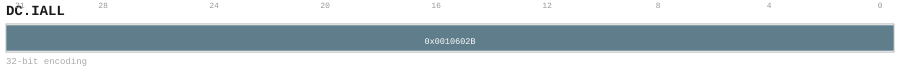

Encoding notes (informative)::
+
* DC.IALL - Perform this mnemonic's cache, TLB, or bundle maintenance operation.

Operation (informative)::
+
[source]
----
Maintain(op)
----

[[insndesc-cache-maintain-dc-isw]]
===== DC.ISW

Data-cache maintenance operation (invalidate/clean/zero, by address or by set/way), selected by the mnemonic suffix.

Catalog forms:: 1 form(s) (32 bits).

Assembly forms::
+
* `dc.isw SrcL`

Encoding::
+
.`dc_isw_32_7940273560b2` — `dc.isw SrcL`

Encoding notes (informative)::
+
* DC.ISW - Perform this mnemonic's cache, TLB, or bundle maintenance operation.

Operation (informative)::
+
[source]
----
Maintain(op, address=Read(SrcL))
----

[[insndesc-cache-maintain-dc-iva]]
===== DC.IVA

Data-cache maintenance operation (invalidate/clean/zero, by address or by set/way), selected by the mnemonic suffix.

Catalog forms:: 1 form(s) (32 bits).

Assembly forms::
+
* `dc.iva SrcL`

Encoding::
+
.`dc_iva_32_0131d0cf364f` — `dc.iva SrcL`

Encoding notes (informative)::
+
* DC.IVA - Perform this mnemonic's cache, TLB, or bundle maintenance operation.

Operation (informative)::
+
[source]
----
Maintain(op, address=Read(SrcL))
----

[[insndesc-cache-maintain-dc-zva]]
===== DC.ZVA

Data-cache maintenance operation (invalidate/clean/zero, by address or by set/way), selected by the mnemonic suffix.

Catalog forms:: 1 form(s) (32 bits).

Assembly forms::
+
* `dc.zva SrcL`

Encoding::
+
.`dc_zva_32_0859a1d7aa5b` — `dc.zva SrcL`
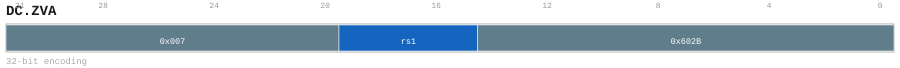

Encoding notes (informative)::
+
* DC.ZVA - Perform this mnemonic's cache, TLB, or bundle maintenance operation.

Operation (informative)::
+
[source]
----
Maintain(op, address=Read(SrcL))
----

[[insndesc-cache-maintain-ic-iall]]
===== IC.IALL

Instruction-cache maintenance operation (invalidate by address or invalidate all), selected by the mnemonic suffix.

Catalog forms:: 1 form(s) (32 bits).

Assembly forms::
+
* `ic.iall`

Encoding::
+
.`ic_iall_32_854f0d4d906a` — `ic.iall`
image::encodings/enc_ic_iall.svg[IC.IALL encoding form ic_iall_32_854f0d4d906a,align="center"]

Encoding notes (informative)::
+
* IC.IALL - Perform this mnemonic's cache, TLB, or bundle maintenance operation.

Operation (informative)::
+
[source]
----
Maintain(op)
----

[[insndesc-cache-maintain-ic-iva]]
===== IC.IVA

Instruction-cache maintenance operation (invalidate by address or invalidate all), selected by the mnemonic suffix.

Catalog forms:: 1 form(s) (32 bits).

Assembly forms::
+
* `ic.iva SrcL`

Encoding::
+
.`ic_iva_32_11b9a61dd8b5` — `ic.iva SrcL`

Encoding notes (informative)::
+
* IC.IVA - Perform this mnemonic's cache, TLB, or bundle maintenance operation.

Operation (informative)::
+
[source]
----
Maintain(op, address=Read(SrcL))
----

[[insndesc-cache-maintain-tlb-ia]]
===== TLB.IA

TLB maintenance operation, selected by the mnemonic suffix.

Catalog forms:: 1 form(s) (32 bits).

Assembly forms::
+
* `tlb.ia SrcL`

Encoding::
+
.`tlb_ia_32_e794d6bf347e` — `tlb.ia SrcL`

Encoding notes (informative)::
+
* TLB.IA - Perform this mnemonic's cache, TLB, or bundle maintenance operation.

Operation (informative)::
+
[source]
----
Maintain(op, address=Read(SrcL))
----

[[insndesc-cache-maintain-tlb-iall]]
===== TLB.IALL

TLB maintenance operation, selected by the mnemonic suffix.

Catalog forms:: 1 form(s) (32 bits).

Assembly forms::
+
* `tlb.iall`

Encoding::
+
.`tlb_iall_32_0fb421b85c88` — `tlb.iall`
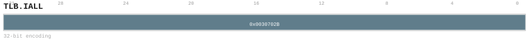

Encoding notes (informative)::
+
* TLB.IALL - Perform this mnemonic's cache, TLB, or bundle maintenance operation.

Operation (informative)::
+
[source]
----
Maintain(op)
----

[[insndesc-cache-maintain-tlb-iav]]
===== TLB.IAV

TLB maintenance operation, selected by the mnemonic suffix.

Catalog forms:: 1 form(s) (32 bits).

Assembly forms::
+
* `tlb.iav SrcL`

Encoding::
+
.`tlb_iav_32_95f4937d2917` — `tlb.iav SrcL`
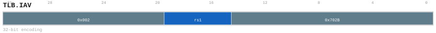

Encoding notes (informative)::
+
* TLB.IAV - Perform this mnemonic's cache, TLB, or bundle maintenance operation.

Operation (informative)::
+
[source]
----
Maintain(op, address=Read(SrcL))
----

[[insndesc-cache-maintain-tlb-iv]]
===== TLB.IV

TLB maintenance operation, selected by the mnemonic suffix.

Catalog forms:: 1 form(s) (32 bits).

Assembly forms::
+
* `tlb.iv SrcL`

Encoding::
+
.`tlb_iv_32_bf0a5d1ea211` — `tlb.iv SrcL`

Encoding notes (informative)::
+
* TLB.IV - Perform this mnemonic's cache, TLB, or bundle maintenance operation.

Operation (informative)::
+
[source]
----
Maintain(op, address=Read(SrcL))
----

[[insndesc-bit-operation]]
==== Bit Operation

[[insndesc-bit-operation-bcnt]]
===== BCNT

Population count (count set bits).

Catalog forms:: 1 form(s) (32 bits).

Assembly forms::
+
* `bcnt srcL, Nminus1, M, ->{t, u, Rd}`

Encoding::
+
.`bcnt_32_e0b06e436a5b` — `bcnt srcL, M, N, ->{t, u, Rd}`
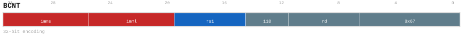

Encoding notes (informative)::
+
* BCNT - Count the selected bit property of the scalar source.

Operation (informative)::
+
[source]
----
Execute operation as selected by the mnemonic and encoded modifiers.
----

[[insndesc-bit-operation-bic]]
===== BIC

Bit clear / AND-NOT operation.

Catalog forms:: 1 form(s) (32 bits).

Assembly forms::
+
* `bic SrcL, Nminus1, M, ->{t, u, Rd}`

Encoding::
+
.`bic_32_3a10830a3a93` — `bic SrcL, M, N, ->{t, u, Rd}`

Encoding notes (informative)::
+
* BIC - Modify the selected scalar bitfield.

Operation (informative)::
+
[source]
----
Execute operation as selected by the mnemonic and encoded modifiers.
----

[[insndesc-bit-operation-bis]]
===== BIS

Bit set / OR operation.

Catalog forms:: 1 form(s) (32 bits).

Assembly forms::
+
* `bis SrcL, Nminus1, M, ->{t, u, Rd}`

Encoding::
+
.`bis_32_bca5d1a80f32` — `bis SrcL, M, N, ->{t, u, Rd}`

Encoding notes (informative)::
+
* BIS - Modify the selected scalar bitfield.

Operation (informative)::
+
[source]
----
Execute operation as selected by the mnemonic and encoded modifiers.
----

[[insndesc-bit-operation-bxs]]
===== BXS

Bit-field extract (signed).

Catalog forms:: 1 form(s) (32 bits).

Assembly forms::
+
* `bxs SrcL, Nminus1, M, ->{t, u, Rd}`

Encoding::
+
.`bxs_32_b1bb003c1703` — `bxs SrcL, M, N, ->{t, u, Rd}`
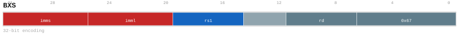

Encoding notes (informative)::
+
* BXS - Extract the selected scalar bitfield.

Operation (informative)::
+
[source]
----
Execute operation as selected by the mnemonic and encoded modifiers.
----

[[insndesc-bit-operation-bxu]]
===== BXU

Bit-field extract (unsigned).

Catalog forms:: 1 form(s) (32 bits).

Assembly forms::
+
* `bxu SrcL, Nminus1, M, ->{t, u, Rd}`

Encoding::
+
.`bxu_32_e9ea9715ba62` — `bxu SrcL, M, N, ->{t, u, Rd}`
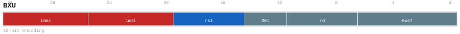

Encoding notes (informative)::
+
* BXU - Extract the selected scalar bitfield.

Operation (informative)::
+
[source]
----
Execute operation as selected by the mnemonic and encoded modifiers.
----

[[insndesc-bit-operation-clz]]
===== CLZ

Count leading zeros.

Catalog forms:: 1 form(s) (32 bits).

Assembly forms::
+
* `clz SrcL, Nminus1, M, ->{t, u, Rd}`

Encoding::
+
.`clz_32_f890415c15b6` — `clz SrcL, M, N, ->{t, u, Rd}`

Encoding notes (informative)::
+
* CLZ - Count the selected bit property of the scalar source.

Operation (informative)::
+
[source]
----
Execute operation as selected by the mnemonic and encoded modifiers.
----

[[insndesc-bit-operation-ctz]]
===== CTZ

Count trailing zeros.

Catalog forms:: 1 form(s) (32 bits).

Assembly forms::
+
* `ctz SrcL, Nminus1, M, ->{t, u, Rd}`

Encoding::
+
.`ctz_32_1761cbcc2a89` — `ctz SrcL, M, N, ->{t, u, Rd}`

Encoding notes (informative)::
+
* CTZ - Count the selected bit property of the scalar source.

Operation (informative)::
+
[source]
----
Execute operation as selected by the mnemonic and encoded modifiers.
----

[[insndesc-bit-operation-rev]]
===== REV

Bit-reversal operation.

Catalog forms:: 1 form(s) (32 bits).

Assembly forms::
+
* `rev SrcL, M, N, ->{t, u, Rd}`

Encoding::
+
.`rev_32_58badc109d49` — `rev SrcL, M, N, ->{t, u, Rd}`
image::encodings/enc_rev.svg[REV encoding form rev_32_58badc109d49,align="center"]

Encoding notes (informative)::
+
* REV - Reverse bytes within the selected scalar bitfield.

Operation (informative)::
+
[source]
----
Execute operation as selected by the mnemonic and encoded modifiers.
----

[[insndesc-bundle-split]]
==== Bundle Split

[[insndesc-bundle-split-bstart]]
===== BSTART

Terminates the current block and begins the next block, encoding both block type and transition kind.

Catalog forms:: 2 form(s) (32 bits).

Assembly forms::
+
* `BSTART {DIRECT, CALL}, <label>`
* `BSTART COND, <label>`

Encoding::
+
.`bstart_32_416bc417fc20` — `BSTART {DIRECT, CALL}, <label>`
image::encodings/enc_bstart_32_416bc417fc20.svg[BSTART encoding form bstart_32_416bc417fc20,align="center"]
.`bstart_32_7e66993d15d0` — `BSTART COND, <label>`
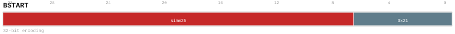

Encoding notes (informative)::
+
* Closes the current bundle, initializes the next bundle descriptor, and selects its transfer and execution kind.

Operation (informative)::
+
[source]
----
EndBlock()
BeginNextBlock(/* type/kind/target as encoded */)
----

[[insndesc-bundle-split-bstart-fp]]
===== BSTART.FP

Terminates the current block and begins the next block, encoding both block type and transition kind.

Catalog forms:: 7 form(s) (32 bits).

Assembly forms::
+
* `BSTART.FP FALL<, fixup_label>`
* `BSTART.FP ICALL`
* `BSTART.FP RET`
* `BSTART.FP DIRECT, <label>`
* `BSTART.FP IND`
* `BSTART.FP CALL, <label>`
* `BSTART.FP COND, <label>`

Encoding::
+
.`bstart_fp_32_494fe06e4fb2` — `BSTART.FP FALL<, fixup_label>`
image::encodings/enc_bstart_fp_32_494fe06e4fb2.svg[BSTART.FP encoding form bstart_fp_32_494fe06e4fb2,align="center"]
.`bstart_fp_32_69538a87dfb1` — `BSTART.FP ICALL`
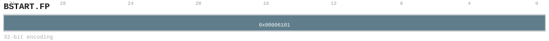
.`bstart_fp_32_82106bc72d98` — `BSTART.FP RET`
image::encodings/enc_bstart_fp_32_82106bc72d98.svg[BSTART.FP encoding form bstart_fp_32_82106bc72d98,align="center"]
.`bstart_fp_32_c6cf502b7ebd` — `BSTART.FP DIRECT, <label>`
image::encodings/enc_bstart_fp_32_c6cf502b7ebd.svg[BSTART.FP encoding form bstart_fp_32_c6cf502b7ebd,align="center"]
.`bstart_fp_32_dea7bdf4c480` — `BSTART.FP IND`

.`bstart_fp_32_eb33ff25b92a` — `BSTART.FP CALL, <label>`
image::encodings/enc_bstart_fp_32_eb33ff25b92a.svg[BSTART.FP encoding form bstart_fp_32_eb33ff25b92a,align="center"]
.`bstart_fp_32_ed54a0ac3b7a` — `BSTART.FP COND, <label>`

Encoding notes (informative)::
+
* Closes the current bundle, initializes the next bundle descriptor, and selects its transfer and execution kind.

Operation (informative)::
+
[source]
----
EndBlock()
BeginNextBlock(/* type/kind/target as encoded */)
----

[[insndesc-bundle-split-bstart-gmov]]
===== BSTART.GMOV

Terminates the current block and begins the next block, encoding both block type and transition kind.

Catalog forms:: 1 form(s) (32 bits).

Assembly forms::
+
* `BSTART.GMOV DataType`

Encoding::
+
.`bstart_gmov_32_ccfcf9904850` — `BSTART.GMOV DataType`
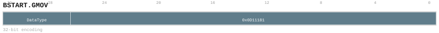

Encoding notes (informative)::
+
* Closes the current bundle, initializes the next bundle descriptor, and selects its transfer and execution kind.

Operation (informative)::
+
[source]
----
EndBlock()
BeginNextBlock(/* type/kind/target as encoded */)
----

[[insndesc-bundle-split-bstart-mgather]]
===== BSTART.MGATHER

Terminates the current block and begins the next block, encoding both block type and transition kind.

Catalog forms:: 1 form(s) (32 bits).

Assembly forms::
+
* `BSTART.MGATHER DataType`

Encoding::
+
.`bstart_mgather_32_477b2795765c` — `BSTART.MGATHER DataType`

Encoding notes (informative)::
+
* Closes the current bundle, initializes the next bundle descriptor, and selects its transfer and execution kind.

Operation (informative)::
+
[source]
----
EndBlock()
BeginNextBlock(/* type/kind/target as encoded */)
----

[[insndesc-bundle-split-bstart-mgather-cas]]
===== BSTART.MGATHER.CAS

Terminates the current block and begins the next block, encoding both block type and transition kind.

Catalog forms:: 1 form(s) (32 bits).

Assembly forms::
+
* `BSTART.MGATHER.CAS DataType`

Encoding::
+
.`bstart_mgather_cas_32_74d282c28e52` — `BSTART.MGATHER.CAS DataType`
image::encodings/enc_bstart_mgather_cas.svg[BSTART.MGATHER.CAS encoding form bstart_mgather_cas_32_74d282c28e52,align="center"]

Encoding notes (informative)::
+
* Closes the current bundle, initializes the next bundle descriptor, and selects its transfer and execution kind.

Operation (informative)::
+
[source]
----
EndBlock()
BeginNextBlock(/* type/kind/target as encoded */)
----

[[insndesc-bundle-split-bstart-mgather-mask]]
===== BSTART.MGATHER.MASK

Terminates the current block and begins the next block, encoding both block type and transition kind.

Catalog forms:: 1 form(s) (32 bits).

Assembly forms::
+
* `BSTART.MGATHER.MASK DataType`

Encoding::
+
.`bstart_mgather_mask_32_c53a0033eb26` — `BSTART.MGATHER.MASK DataType`
image::encodings/enc_bstart_mgather_mask.svg[BSTART.MGATHER.MASK encoding form bstart_mgather_mask_32_c53a0033eb26,align="center"]

Encoding notes (informative)::
+
* Closes the current bundle, initializes the next bundle descriptor, and selects its transfer and execution kind.

Operation (informative)::
+
[source]
----
EndBlock()
BeginNextBlock(/* type/kind/target as encoded */)
----

[[insndesc-bundle-split-bstart-mpar]]
===== BSTART.MPAR

Terminates the current block and begins the next block, encoding both block type and transition kind.

Catalog forms:: 1 form(s) (32 bits).

Assembly forms::
+
* `BSTART.MPAR <VS8, VS16>`

Encoding::
+
.`bstart_mpar_32_beccb0565e7d` — `BSTART.MPAR <VS8, VS16>`
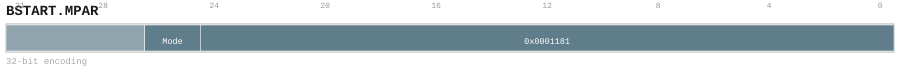

Encoding notes (informative)::
+
* Closes the current bundle, initializes the next bundle descriptor, and selects its transfer and execution kind.

Operation (informative)::
+
[source]
----
EndBlock()
BeginNextBlock(/* type/kind/target as encoded */)
----

[[insndesc-bundle-split-bstart-mscatter]]
===== BSTART.MSCATTER

Terminates the current block and begins the next block, encoding both block type and transition kind.

Catalog forms:: 1 form(s) (32 bits).

Assembly forms::
+
* `BSTART.MSCATTER DataType`

Encoding::
+
.`bstart_mscatter_32_7f76f632a75f` — `BSTART.MSCATTER DataType`
image::encodings/enc_bstart_mscatter.svg[BSTART.MSCATTER encoding form bstart_mscatter_32_7f76f632a75f,align="center"]

Encoding notes (informative)::
+
* Closes the current bundle, initializes the next bundle descriptor, and selects its transfer and execution kind.

Operation (informative)::
+
[source]
----
EndBlock()
BeginNextBlock(/* type/kind/target as encoded */)
----

[[insndesc-bundle-split-bstart-mscatter-mask]]
===== BSTART.MSCATTER.MASK

Terminates the current block and begins the next block, encoding both block type and transition kind.

Catalog forms:: 1 form(s) (32 bits).

Assembly forms::
+
* `BSTART.MSCATTER.MASK DataType`

Encoding::
+
.`bstart_mscatter_mask_32_6037e1cd885f` — `BSTART.MSCATTER.MASK DataType`

Encoding notes (informative)::
+
* Closes the current bundle, initializes the next bundle descriptor, and selects its transfer and execution kind.

Operation (informative)::
+
[source]
----
EndBlock()
BeginNextBlock(/* type/kind/target as encoded */)
----

[[insndesc-bundle-split-bstart-mseq]]
===== BSTART.MSEQ

Terminates the current block and begins the next block, encoding both block type and transition kind.

Catalog forms:: 1 form(s) (32 bits).

Assembly forms::
+
* `BSTART.MSEQ <VS8, VS16>`

Encoding::
+
.`bstart_mseq_32_2cdcceaf89d4` — `BSTART.MSEQ <VS8, VS16>`
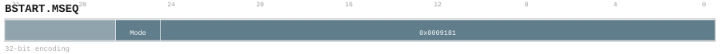

Encoding notes (informative)::
+
* Closes the current bundle, initializes the next bundle descriptor, and selects its transfer and execution kind.

Operation (informative)::
+
[source]
----
EndBlock()
BeginNextBlock(/* type/kind/target as encoded */)
----

[[insndesc-bundle-split-bstart-std]]
===== BSTART.STD

Terminates the current block and begins the next block, encoding both block type and transition kind.

Catalog forms:: 7 form(s) (32 bits).

Assembly forms::
+
* `BSTART.STD IND`
* `BSTART.STD COND, <label>`
* `BSTART.STD RET`
* `BSTART.STD CALL, <label>`
* `BSTART.STD FALL<, fixup_label>`
* `BSTART.STD ICALL`
* `BSTART.STD DIRECT, <label>`

Encoding::
+
.`bstart_std_32_49f2c6a8906f` — `BSTART.STD IND`
image::encodings/enc_bstart_std_32_49f2c6a8906f.svg[BSTART.STD encoding form bstart_std_32_49f2c6a8906f,align="center"]
.`bstart_std_32_696f98ac4bf1` — `BSTART.STD COND, <label>`
image::encodings/enc_bstart_std_32_696f98ac4bf1.svg[BSTART.STD encoding form bstart_std_32_696f98ac4bf1,align="center"]
.`bstart_std_32_7876537dce06` — `BSTART.STD RET`
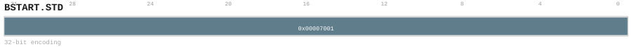
.`bstart_std_32_97d38b7be05e` — `BSTART.STD CALL, <label>`
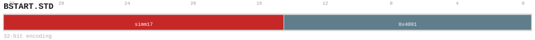
.`bstart_std_32_a5103b49e336` — `BSTART.STD FALL<, fixup_label>`

.`bstart_std_32_c386430b732a` — `BSTART.STD ICALL`

.`bstart_std_32_d3733f87964d` — `BSTART.STD DIRECT, <label>`
image::encodings/enc_bstart_std_32_d3733f87964d.svg[BSTART.STD encoding form bstart_std_32_d3733f87964d,align="center"]

Encoding notes (informative)::
+
* Closes the current bundle, initializes the next bundle descriptor, and selects its transfer and execution kind.

Operation (informative)::
+
[source]
----
EndBlock()
BeginNextBlock(/* type/kind/target as encoded */)
----

[[insndesc-bundle-split-bstart-sys]]
===== BSTART.SYS

Terminates the current block and begins the next block, encoding both block type and transition kind.

Catalog forms:: 1 form(s) (32 bits).

Assembly forms::
+
* `BSTART.SYS FALL<, fixup_label>`

Encoding::
+
.`bstart_sys_32_7220989624e7` — `BSTART.SYS FALL<, fixup_label>`
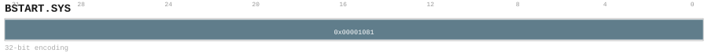

Encoding notes (informative)::
+
* Closes the current bundle, initializes the next bundle descriptor, and selects its transfer and execution kind.

Operation (informative)::
+
[source]
----
EndBlock()
BeginNextBlock(/* type/kind/target as encoded */)
----

[[insndesc-bundle-split-bstart-tepl]]
===== BSTART.TEPL

Terminates the current block and begins the next block, encoding both block type and transition kind.

Catalog forms:: 1 form(s) (32 bits).

Assembly forms::
+
* `BSTART.TEPL Mode, Function, DataType`

Encoding::
+
.`bstart_tepl_32_f0754cf51a8d` — `BSTART.TEPL Mode, Function, DataType`
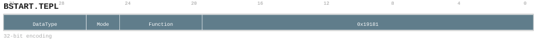

Encoding notes (informative)::
+
* Closes the current bundle, initializes the next bundle descriptor, and selects its transfer and execution kind.

Operation (informative)::
+
[source]
----
EndBlock()
BeginNextBlock(/* type/kind/target as encoded */)
----

[[insndesc-bundle-split-bstart-tgemv]]
===== BSTART.TGEMV

Terminates the current block and begins the next block, encoding both block type and transition kind.

Catalog forms:: 1 form(s) (32 bits).

Assembly forms::
+
* `BSTART.TGEMV DataType`

Encoding::
+
.`bstart_tgemv_32_5793d27aa023` — `BSTART.TGEMV DataType`
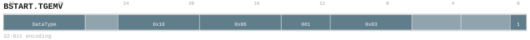

Encoding notes (informative)::
+
* Closes the current bundle, initializes the next bundle descriptor, and selects its transfer and execution kind.

Operation (informative)::
+
[source]
----
EndBlock()
BeginNextBlock(/* type/kind/target as encoded */)
----

[[insndesc-bundle-split-bstart-tgemv-acc]]
===== BSTART.TGEMV.ACC

Terminates the current block and begins the next block, encoding both block type and transition kind.

Catalog forms:: 1 form(s) (32 bits).

Assembly forms::
+
* `BSTART.TGEMV.ACC DataType`

Encoding::
+
.`bstart_tgemv_acc_32_d95ec8489341` — `BSTART.TGEMV.ACC DataType`

Encoding notes (informative)::
+
* Closes the current bundle, initializes the next bundle descriptor, and selects its transfer and execution kind.

Operation (informative)::
+
[source]
----
EndBlock()
BeginNextBlock(/* type/kind/target as encoded */)
----

[[insndesc-bundle-split-bstart-tgemv-bias]]
===== BSTART.TGEMV.BIAS

Terminates the current block and begins the next block, encoding both block type and transition kind.

Catalog forms:: 1 form(s) (32 bits).

Assembly forms::
+
* `BSTART.TGEMV.BIAS DataType`

Encoding::
+
.`bstart_tgemv_bias_32_98ff0e3b4e7b` — `BSTART.TGEMV.BIAS DataType`

Encoding notes (informative)::
+
* Closes the current bundle, initializes the next bundle descriptor, and selects its transfer and execution kind.

Operation (informative)::
+
[source]
----
EndBlock()
BeginNextBlock(/* type/kind/target as encoded */)
----

[[insndesc-bundle-split-bstart-tgemvmx]]
===== BSTART.TGEMVMX

Terminates the current block and begins the next block, encoding both block type and transition kind.

Catalog forms:: 1 form(s) (32 bits).

Assembly forms::
+
* `BSTART.TGEMVMX DataType`

Encoding::
+
.`bstart_tgemvmx_32_a6083394d51a` — `BSTART.TGEMVMX DataType`

Encoding notes (informative)::
+
* Closes the current bundle, initializes the next bundle descriptor, and selects its transfer and execution kind.

Operation (informative)::
+
[source]
----
EndBlock()
BeginNextBlock(/* type/kind/target as encoded */)
----

[[insndesc-bundle-split-bstart-tgemvmx-acc]]
===== BSTART.TGEMVMX.ACC

Terminates the current block and begins the next block, encoding both block type and transition kind.

Catalog forms:: 1 form(s) (32 bits).

Assembly forms::
+
* `BSTART.TGEMVMX.ACC DataType`

Encoding::
+
.`bstart_tgemvmx_acc_32_750196820fcf` — `BSTART.TGEMVMX.ACC DataType`

Encoding notes (informative)::
+
* Closes the current bundle, initializes the next bundle descriptor, and selects its transfer and execution kind.

Operation (informative)::
+
[source]
----
EndBlock()
BeginNextBlock(/* type/kind/target as encoded */)
----

[[insndesc-bundle-split-bstart-tgemvmx-bias]]
===== BSTART.TGEMVMX.BIAS

Terminates the current block and begins the next block, encoding both block type and transition kind.

Catalog forms:: 1 form(s) (32 bits).

Assembly forms::
+
* `BSTART.TGEMVMX.BIAS DataType`

Encoding::
+
.`bstart_tgemvmx_bias_32_efccafe36069` — `BSTART.TGEMVMX.BIAS DataType`
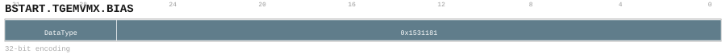

Encoding notes (informative)::
+
* Closes the current bundle, initializes the next bundle descriptor, and selects its transfer and execution kind.

Operation (informative)::
+
[source]
----
EndBlock()
BeginNextBlock(/* type/kind/target as encoded */)
----

[[insndesc-bundle-split-bstart-tload]]
===== BSTART.TLOAD

Terminates the current block and begins the next block, encoding both block type and transition kind.

Catalog forms:: 1 form(s) (32 bits).

Assembly forms::
+
* `BSTART.TLOAD DataType`

Encoding::
+
.`bstart_tload_32_5178a1794614` — `BSTART.TLOAD DataType`
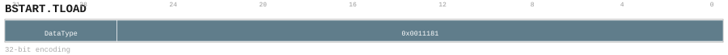

Encoding notes (informative)::
+
* Closes the current bundle, initializes the next bundle descriptor, and selects its transfer and execution kind.

Operation (informative)::
+
[source]
----
EndBlock()
BeginNextBlock(/* type/kind/target as encoded */)
----

[[insndesc-bundle-split-bstart-tmatmul]]
===== BSTART.TMATMUL

Terminates the current block and begins the next block, encoding both block type and transition kind.

Catalog forms:: 1 form(s) (32 bits).

Assembly forms::
+
* `BSTART.TMATMUL DataType`

Encoding::
+
.`bstart_tmatmul_32_3bb582723869` — `BSTART.TMATMUL DataType`

Encoding notes (informative)::
+
* Closes the current bundle, initializes the next bundle descriptor, and selects its transfer and execution kind.

Operation (informative)::
+
[source]
----
EndBlock()
BeginNextBlock(/* type/kind/target as encoded */)
----

[[insndesc-bundle-split-bstart-tmatmul-acc]]
===== BSTART.TMATMUL.ACC

Terminates the current block and begins the next block, encoding both block type and transition kind.

Catalog forms:: 1 form(s) (32 bits).

Assembly forms::
+
* `BSTART.TMATMUL.ACC DataType`

Encoding::
+
.`bstart_tmatmul_acc_32_e0bbf989304d` — `BSTART.TMATMUL.ACC DataType`
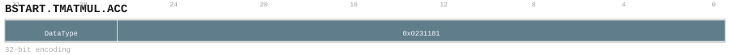

Encoding notes (informative)::
+
* Closes the current bundle, initializes the next bundle descriptor, and selects its transfer and execution kind.

Operation (informative)::
+
[source]
----
EndBlock()
BeginNextBlock(/* type/kind/target as encoded */)
----

[[insndesc-bundle-split-bstart-tmatmul-bias]]
===== BSTART.TMATMUL.BIAS

Terminates the current block and begins the next block, encoding both block type and transition kind.

Catalog forms:: 1 form(s) (32 bits).

Assembly forms::
+
* `BSTART.TMATMUL.BIAS DataType`

Encoding::
+
.`bstart_tmatmul_bias_32_82792b6c3b84` — `BSTART.TMATMUL.BIAS DataType`

Encoding notes (informative)::
+
* Closes the current bundle, initializes the next bundle descriptor, and selects its transfer and execution kind.

Operation (informative)::
+
[source]
----
EndBlock()
BeginNextBlock(/* type/kind/target as encoded */)
----

[[insndesc-bundle-split-bstart-tmatmulmx]]
===== BSTART.TMATMULMX

Terminates the current block and begins the next block, encoding both block type and transition kind.

Catalog forms:: 1 form(s) (32 bits).

Assembly forms::
+
* `BSTART.TMATMULMX DataType`

Encoding::
+
.`bstart_tmatmulmx_32_4df63f33e364` — `BSTART.TMATMULMX DataType`
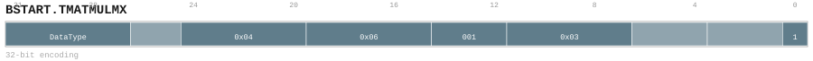

Encoding notes (informative)::
+
* Closes the current bundle, initializes the next bundle descriptor, and selects its transfer and execution kind.

Operation (informative)::
+
[source]
----
EndBlock()
BeginNextBlock(/* type/kind/target as encoded */)
----

[[insndesc-bundle-split-bstart-tmatmulmx-acc]]
===== BSTART.TMATMULMX.ACC

Terminates the current block and begins the next block, encoding both block type and transition kind.

Catalog forms:: 1 form(s) (32 bits).

Assembly forms::
+
* `BSTART.TMATMULMX.ACC DataType`

Encoding::
+
.`bstart_tmatmulmx_acc_32_3848afaeabdd` — `BSTART.TMATMULMX.ACC DataType`

Encoding notes (informative)::
+
* Closes the current bundle, initializes the next bundle descriptor, and selects its transfer and execution kind.

Operation (informative)::
+
[source]
----
EndBlock()
BeginNextBlock(/* type/kind/target as encoded */)
----

[[insndesc-bundle-split-bstart-tmatmulmx-bias]]
===== BSTART.TMATMULMX.BIAS

Terminates the current block and begins the next block, encoding both block type and transition kind.

Catalog forms:: 1 form(s) (32 bits).

Assembly forms::
+
* `BSTART.TMATMULMX.BIAS DataType`

Encoding::
+
.`bstart_tmatmulmx_bias_32_5b20d174f5d9` — `BSTART.TMATMULMX.BIAS DataType`

Encoding notes (informative)::
+
* Closes the current bundle, initializes the next bundle descriptor, and selects its transfer and execution kind.

Operation (informative)::
+
[source]
----
EndBlock()
BeginNextBlock(/* type/kind/target as encoded */)
----

[[insndesc-bundle-split-bstart-tmov]]
===== BSTART.TMOV

Terminates the current block and begins the next block, encoding both block type and transition kind.

Catalog forms:: 5 form(s) (32 bits).

Assembly forms::
+
* `BSTART.TMOV DataType`

Encoding::
+
.`bstart_tmov_32_3079328b98d6` — `BSTART.TMOV DataType`
image::encodings/enc_bstart_tmov_32_3079328b98d6.svg[BSTART.TMOV encoding form bstart_tmov_32_3079328b98d6,align="center"]
.`bstart_tmov_32_34d0ab432974` — `BSTART.TMOV DataType`
image::encodings/enc_bstart_tmov_32_34d0ab432974.svg[BSTART.TMOV encoding form bstart_tmov_32_34d0ab432974,align="center"]
.`bstart_tmov_32_472804576301` — `BSTART.TMOV DataType`

.`bstart_tmov_32_d96181e99f01` — `BSTART.TMOV DataType`

.`bstart_tmov_32_efe5c49fcb78` — `BSTART.TMOV DataType`
image::encodings/enc_bstart_tmov_32_efe5c49fcb78.svg[BSTART.TMOV encoding form bstart_tmov_32_efe5c49fcb78,align="center"]

Encoding notes (informative)::
+
* Closes the current bundle, initializes the next bundle descriptor, and selects its transfer and execution kind.

Operation (informative)::
+
[source]
----
EndBlock()
BeginNextBlock(/* type/kind/target as encoded */)
----

[[insndesc-bundle-split-bstart-tprefetch]]
===== BSTART.TPREFETCH

Terminates the current block and begins the next block, encoding both block type and transition kind.

Catalog forms:: 1 form(s) (32 bits).

Assembly forms::
+
* `BSTART.TPREFETCH DataType`

Encoding::
+
.`bstart_tprefetch_32_3c9e83c5a42f` — `BSTART.TPREFETCH DataType`

Encoding notes (informative)::
+
* Closes the current bundle, initializes the next bundle descriptor, and selects its transfer and execution kind.

Operation (informative)::
+
[source]
----
EndBlock()
BeginNextBlock(/* type/kind/target as encoded */)
----

[[insndesc-bundle-split-bstart-tstore]]
===== BSTART.TSTORE

Terminates the current block and begins the next block, encoding both block type and transition kind.

Catalog forms:: 2 form(s) (32 bits).

Assembly forms::
+
* `BSTART.TSTORE DataType`

Encoding::
+
.`bstart_tstore_32_6bed4bf0e415` — `BSTART.TSTORE DataType`

.`bstart_tstore_32_d592de9e15a8` — `BSTART.TSTORE DataType`
image::encodings/enc_bstart_tstore_32_d592de9e15a8.svg[BSTART.TSTORE encoding form bstart_tstore_32_d592de9e15a8,align="center"]

Encoding notes (informative)::
+
* Closes the current bundle, initializes the next bundle descriptor, and selects its transfer and execution kind.

Operation (informative)::
+
[source]
----
EndBlock()
BeginNextBlock(/* type/kind/target as encoded */)
----

[[insndesc-bundle-split-bstop]]
===== BSTOP

Terminates the current basic block.

Catalog forms:: 1 form(s) (32 bits).

Assembly forms::
+
* `BSTOP`

Encoding::
+
.`bstop_32_1c80341ebaa2` — `BSTOP`
image::encodings/enc_bstop.svg[BSTOP encoding form bstop_32_1c80341ebaa2,align="center"]

Encoding notes (informative)::
+
* Commits the current bundle and transfers to its selected continuation.

Operation (informative)::
+
[source]
----
EndBlock()
----

[[insndesc-bundle-split-c-bstart]]
===== C.BSTART

This mnemonic has a 16-bit compressed encoding. Terminates the current block and begins the next block, encoding both block type and transition kind.

Catalog forms:: 2 form(s) (16 bits).

Assembly forms::
+
* `C.BSTART DIRECT, label`
* `C.BSTART COND, label`

Encoding::
+
.`c_bstart_16_78ebf9b37d2d` — `C.BSTART DIRECT, label`

.`c_bstart_16_b82b9a0c292c` — `C.BSTART COND, label`

Encoding notes (informative)::
+
* Closes the current bundle, initializes the next bundle descriptor, and selects its transfer and execution kind.

Operation (informative)::
+
[source]
----
EndBlock()
BeginNextBlock(/* type/kind/target as encoded */)
----

[[insndesc-bundle-split-c-bstop]]
===== C.BSTOP

This mnemonic has a 16-bit compressed encoding. Terminates the current basic block.

Catalog forms:: 1 form(s) (16 bits).

Assembly forms::
+
* `C.BSTOP`

Encoding::
+
.`c_bstop_16_08a2ad84e04b` — `C.BSTOP`

Encoding notes (informative)::
+
* Commits the current bundle and transfers to its selected continuation.

Operation (informative)::
+
[source]
----
EndBlock()
----

[[insndesc-bundle-split-ercov]]
===== ERCOV

Loads a value from memory using the addressing form shown in the syntax and writes the result to the selected destination.

Catalog forms:: 1 form(s) (32 bits).

Assembly forms::
+
* `ERCOV [RegSrc0=BasePtr, RegSrc1=LenBytes, RegSrc2=Kind]`

Encoding::
+
.`ercov_32_9b0c74795df0` — `ERCOV [RegSrc0=BasePtr, RegSrc1=LenBytes, RegSrc2=Kind]`

Encoding notes (informative)::
+
* Recovers the encoded execution-context range from memory.

Operation (informative)::
+
[source]
----
Execute operation as selected by the mnemonic and encoded modifiers.
----

[[insndesc-bundle-split-esave]]
===== ESAVE

Loads a value from memory using the addressing form shown in the syntax and writes the result to the selected destination.

Catalog forms:: 1 form(s) (32 bits).

Assembly forms::
+
* `ESAVE [RegSrc0=BasePtr, RegSrc1=LenBytes, RegSrc2=Kind]`

Encoding::
+
.`esave_32_c85cb830dc0b` — `ESAVE [RegSrc0=BasePtr, RegSrc1=LenBytes, RegSrc2=Kind]`
image::encodings/enc_esave.svg[ESAVE encoding form esave_32_c85cb830dc0b,align="center"]

Encoding notes (informative)::
+
* Saves the encoded execution-context range to memory.

Operation (informative)::
+
[source]
----
Execute operation as selected by the mnemonic and encoded modifiers.
----

[[insndesc-bundle-split-fentry]]
===== FENTRY

Template-style function prologue/epilogue instruction for saving/restoring register ranges and adjusting the stack.

Catalog forms:: 1 form(s) (32 bits).

Assembly forms::
+
* `FENTRY [RegSrc0 ~ RegSrcn], sp!, uimm`

Encoding::
+
.`fentry_32_74a07f46d846` — `FENTRY [RegSrc0 ~ RegSrcn], sp!, uimm`
image::encodings/enc_fentry.svg[FENTRY encoding form fentry_32_74a07f46d846,align="center"]

Encoding notes (informative)::
+
* Atomically validates and creates a frame-template entry state.

Operation (informative)::
+
[source]
----
AdjustSPAndSaveRestoreRange(/* register range + uimm */)
----

[[insndesc-bundle-split-fexit]]
===== FEXIT

Template-style function prologue/epilogue instruction for saving/restoring register ranges and adjusting the stack.

Catalog forms:: 1 form(s) (32 bits).

Assembly forms::
+
* `FEXIT [RegDst0 ~ RegDstn], sp!, uimm`

Encoding::
+
.`fexit_32_6492f41b2239` — `FEXIT [RegDst0 ~ RegDstn], sp!, uimm`

Encoding notes (informative)::
+
* Atomically validates and commits a frame-template exit state.

Operation (informative)::
+
[source]
----
AdjustSPAndSaveRestoreRange(/* register range + uimm */)
----

[[insndesc-bundle-split-fret-ra]]
===== FRET.RA

Template-style function prologue/epilogue instruction for saving/restoring register ranges and adjusting the stack.

Catalog forms:: 1 form(s) (32 bits).

Assembly forms::
+
* `FRET.RA [RegDst0 ~ RegDstn], sp!, uimm`

Encoding::
+
.`fret_ra_32_b6f13adb3ea1` — `FRET.RA [RegDst0 ~ RegDstn], sp!, uimm`
image::encodings/enc_fret_ra.svg[FRET.RA encoding form fret_ra_32_b6f13adb3ea1,align="center"]

Encoding notes (informative)::
+
* Restores a frame and returns through the retained return-address target.

Operation (informative)::
+
[source]
----
AdjustSPAndSaveRestoreRange(/* register range + uimm */)
----

[[insndesc-bundle-split-fret-stk]]
===== FRET.STK

Template-style function prologue/epilogue instruction for saving/restoring register ranges and adjusting the stack.

Catalog forms:: 1 form(s) (32 bits).

Assembly forms::
+
* `FRET.STK [RegDst0 ~ RegDstn], sp!, uimm`

Encoding::
+
.`fret_stk_32_4522597d3ce0` — `FRET.STK [RegDst0 ~ RegDstn], sp!, uimm`
image::encodings/enc_fret_stk.svg[FRET.STK encoding form fret_stk_32_4522597d3ce0,align="center"]

Encoding notes (informative)::
+
* Restores a frame and returns through the validated stack target.

Operation (informative)::
+
[source]
----
AdjustSPAndSaveRestoreRange(/* register range + uimm */)
----

[[insndesc-bundle-split-mcopy]]
===== MCOPY

Performs a bulk memory operation as specified by the operands (copy or set).

Catalog forms:: 1 form(s) (32 bits).

Assembly forms::
+
* `MCOPY [RegSrc0, RegSrc1, RegSrc2]`

Encoding::
+
.`mcopy_32_10262506ace5` — `MCOPY [RegSrc0, RegSrc1, RegSrc2]`
image::encodings/enc_mcopy.svg[MCOPY encoding form mcopy_32_10262506ace5,align="center"]

Encoding notes (informative)::
+
* Copies an encoded memory range with instruction-atomic preflight and snapshot semantics.

Operation (informative)::
+
[source]
----
MemCopy(dst=RegSrc0, src=RegSrc1, size=RegSrc2)
----

[[insndesc-bundle-split-mset]]
===== MSET

Performs a bulk memory operation as specified by the operands (copy or set).

Catalog forms:: 1 form(s) (32 bits).

Assembly forms::
+
* `MSET [RegSrc0, RegSrc1, RegSrc2]`

Encoding::
+
.`mset_32_7a5f3c26ac6b` — `MSET [RegSrc0, RegSrc1, RegSrc2]`

Encoding notes (informative)::
+
* Fills an encoded memory range after complete access preflight.

Operation (informative)::
+
[source]
----
MemSet(dst=RegSrc0, value=RegSrc1, size=RegSrc2)
----

[[insndesc-bundle-split-xb]]
===== XB

Performs the operation indicated by the mnemonic on the operands specified by the selected form. Operand-size, signedness, and addressing modifiers are encoded via suffixes and qualifiers in the assembly syntax.

Catalog forms:: 1 form(s) (32 bits).

Assembly forms::
+
* `XB ACR-ID, C-ID`

Encoding::
+
.`xb_32_1c3043ef6fa8` — `XB ACR-ID, C-ID`

Encoding notes (informative)::
+
* Transfers the named context value to a target virtual core block.

Operation (informative)::
+
[source]
----
Execute operation as selected by the mnemonic and encoded modifiers.
----

[[insndesc-bstart]]
==== BSTART

[[insndesc-bstart-bstart-call]]
===== BSTART CALL

Terminates the current block and begins the next block, encoding both block type and transition kind.

Catalog forms:: 1 form(s) (32 bits).

Assembly forms::
+
* `BSTART.CALL <br_label>, <rt_label>, ->ra`

Exact operand contract (catalog-derived)::
+
* `bstart_call_32_d30ef065210c`: relocations `simm12` → `CBSTART12_PCREL`, `uimm5` → `CSETRET5_PCREL`; roles `<br_label>` → call_target (P), `<rt_label>` → return_target (P+2), `->ra` → link_destination (n/a).

Encoding::
+
.`bstart_call_32_d30ef065210c` — `BSTART.CALL <br_label>, <rt_label>, ->ra`

Encoding notes (informative)::
+
* Atomically closes the current bundle, computes the call target from the signed displacement and the return address from the independent unsigned displacement, writes ra, and transfers control to the call bundle.

Operation (informative)::
+
[source]
----
P = CurrentPC()
call_target = P + (SignExtend(simm12) << 1)
ra = (P + 2) + (ZeroExtend(uimm5) << 1)
AtomicCallTransfer(call_target, ra)
----

[[insndesc-bstart-hl-bstart-call]]
===== HL.BSTART CALL

This mnemonic has a 48-bit composed encoding (prefix + main). Terminates the current block and begins the next block, encoding both block type and transition kind.

Catalog forms:: 1 form(s) (48 bits).

Assembly forms::
+
* `HL.BSTART.CALL <br_label>, <rt_label>, ->ra`

Exact operand contract (catalog-derived)::
+
* `hl_bstart_call_48_d71cee46ab50`: relocations `simm25` → `B25_PCREL`, `uimm5` → `CSETRET5_PCREL`; roles `<br_label>` → call_target (P), `<rt_label>` → return_target (P+4), `->ra` → link_destination (n/a).

Encoding::
+
.`hl_bstart_call_48_d71cee46ab50` — `HL.BSTART.CALL <br_label>, <rt_label>, ->ra`
image::encodings/enc_hl_bstart_call.svg[HL.BSTART CALL encoding form hl_bstart_call_48_d71cee46ab50,align="center"]

Encoding notes (informative)::
+
* Atomically closes the current bundle, computes the call target from the signed displacement and the return address from the independent unsigned displacement, writes ra, and transfers control to the call bundle.

Operation (informative)::
+
[source]
----
P = CurrentPC()
call_target = P + (SignExtend(simm25) << 1)
ra = (P + 4) + (ZeroExtend(uimm5) << 1)
AtomicCallTransfer(call_target, ra)
----

[[insndesc-bstart-hl-bstart-fp]]
===== HL.BSTART.FP

This mnemonic has a 48-bit composed encoding (prefix + main). Terminates the current block and begins the next block, encoding both block type and transition kind.

Catalog forms:: 4 form(s) (48 bits).

Assembly forms::
+
* `HL.BSTART.FP FALL<, fixup_label>`
* `HL.BSTART.FP CALL, <label>`
* `HL.BSTART.FP DIRECT, <label>`
* `HL.BSTART.FP COND, <label>`

Encoding::
+
.`hl_bstart_fp_48_0368fb7424f4` — `HL.BSTART.FP FALL<, fixup_label>`
image::encodings/enc_hl_bstart_fp_48_0368fb7424f4.svg[HL.BSTART.FP encoding form hl_bstart_fp_48_0368fb7424f4,align="center"]
.`hl_bstart_fp_48_9955c1f823f6` — `HL.BSTART.FP CALL, <label>`
image::encodings/enc_hl_bstart_fp_48_9955c1f823f6.svg[HL.BSTART.FP encoding form hl_bstart_fp_48_9955c1f823f6,align="center"]
.`hl_bstart_fp_48_9a0544563449` — `HL.BSTART.FP DIRECT, <label>`

.`hl_bstart_fp_48_f074f1e2c089` — `HL.BSTART.FP COND, <label>`

Encoding notes (informative)::
+
* Closes the current bundle, initializes the next bundle descriptor, and selects its transfer and execution kind.

Operation (informative)::
+
[source]
----
EndBlock()
BeginNextBlock(/* type/kind/target as encoded */)
----

[[insndesc-bstart-hl-bstart-std]]
===== HL.BSTART.STD

This mnemonic has a 48-bit composed encoding (prefix + main). Terminates the current block and begins the next block, encoding both block type and transition kind.

Catalog forms:: 4 form(s) (48 bits).

Assembly forms::
+
* `HL.BSTART.STD FALL<, fixup_label>`
* `HL.BSTART.STD COND, <label>`
* `HL.BSTART.STD CALL, <label>`
* `HL.BSTART.STD DIRECT, <label>`

Encoding::
+
.`hl_bstart_std_48_170d04be4f7e` — `HL.BSTART.STD FALL<, fixup_label>`
image::encodings/enc_hl_bstart_std_48_170d04be4f7e.svg[HL.BSTART.STD encoding form hl_bstart_std_48_170d04be4f7e,align="center"]
.`hl_bstart_std_48_436ff4a95f39` — `HL.BSTART.STD COND, <label>`
image::encodings/enc_hl_bstart_std_48_436ff4a95f39.svg[HL.BSTART.STD encoding form hl_bstart_std_48_436ff4a95f39,align="center"]
.`hl_bstart_std_48_4eff98193028` — `HL.BSTART.STD CALL, <label>`
image::encodings/enc_hl_bstart_std_48_4eff98193028.svg[HL.BSTART.STD encoding form hl_bstart_std_48_4eff98193028,align="center"]
.`hl_bstart_std_48_c970f578674f` — `HL.BSTART.STD DIRECT, <label>`

Encoding notes (informative)::
+
* Closes the current bundle, initializes the next bundle descriptor, and selects its transfer and execution kind.

Operation (informative)::
+
[source]
----
EndBlock()
BeginNextBlock(/* type/kind/target as encoded */)
----

[[insndesc-bstart-hl-bstart-sys]]
===== HL.BSTART.SYS

This mnemonic has a 48-bit composed encoding (prefix + main). Terminates the current block and begins the next block, encoding both block type and transition kind.

Catalog forms:: 1 form(s) (48 bits).

Assembly forms::
+
* `HL.BSTART.SYS FALL<, fixup_label>`

Encoding::
+
.`hl_bstart_sys_48_54ff489122fe` — `HL.BSTART.SYS FALL<, fixup_label>`

Encoding notes (informative)::
+
* Closes the current bundle, initializes the next bundle descriptor, and selects its transfer and execution kind.

Operation (informative)::
+
[source]
----
EndBlock()
BeginNextBlock(/* type/kind/target as encoded */)
----

[[insndesc-bstart-l-bstart-fp]]
===== L.BSTART.FP

Performs the operation indicated by the mnemonic on the operands specified by the selected form. Operand-size, signedness, and addressing modifiers are encoded via suffixes and qualifiers in the assembly syntax.

Catalog forms:: 4 form(s) (64 bits).

Assembly forms::
+
* `L.BSTART.FP DIRECT, <label>`
* `L.BSTART.FP FALL<, fixup_label>`
* `L.BSTART.FP CALL, <label>`
* `L.BSTART.FP COND, <label>`

Encoding::
+
.`l_bstart_fp_64_52a1fd45d908` — `L.BSTART.FP DIRECT, <label>`

.`l_bstart_fp_64_59792b6f0002` — `L.BSTART.FP FALL<, fixup_label>`
image::encodings/enc_l_bstart_fp_64_59792b6f0002.svg[L.BSTART.FP encoding form l_bstart_fp_64_59792b6f0002,align="center"]
.`l_bstart_fp_64_9673fedb498b` — `L.BSTART.FP CALL, <label>`
image::encodings/enc_l_bstart_fp_64_9673fedb498b.svg[L.BSTART.FP encoding form l_bstart_fp_64_9673fedb498b,align="center"]
.`l_bstart_fp_64_b27a4726298b` — `L.BSTART.FP COND, <label>`

Encoding notes (informative)::
+
* Closes the current bundle, initializes the next bundle descriptor, and selects its transfer and execution kind.

Operation (informative)::
+
[source]
----
Execute operation as selected by the mnemonic and encoded modifiers.
----

[[insndesc-bstart-l-bstart-std]]
===== L.BSTART.STD

Performs the operation indicated by the mnemonic on the operands specified by the selected form. Operand-size, signedness, and addressing modifiers are encoded via suffixes and qualifiers in the assembly syntax.

Catalog forms:: 4 form(s) (64 bits).

Assembly forms::
+
* `L.BSTART.STD COND, <label>`
* `L.BSTART.STD DIRECT, <label>`
* `L.BSTART.STD CALL, <label>`
* `L.BSTART.STD FALL<, fixup_label>`

Encoding::
+
.`l_bstart_std_64_40bf385dbbff` — `L.BSTART.STD COND, <label>`

.`l_bstart_std_64_49b7cf990e62` — `L.BSTART.STD DIRECT, <label>`

.`l_bstart_std_64_9a6081ab8f08` — `L.BSTART.STD CALL, <label>`

.`l_bstart_std_64_ed61315d3418` — `L.BSTART.STD FALL<, fixup_label>`
image::encodings/enc_l_bstart_std_64_ed61315d3418.svg[L.BSTART.STD encoding form l_bstart_std_64_ed61315d3418,align="center"]

Encoding notes (informative)::
+
* Closes the current bundle, initializes the next bundle descriptor, and selects its transfer and execution kind.

Operation (informative)::
+
[source]
----
Execute operation as selected by the mnemonic and encoded modifiers.
----

[[insndesc-bstart-l-bstart-sys]]
===== L.BSTART.SYS

Performs the operation indicated by the mnemonic on the operands specified by the selected form. Operand-size, signedness, and addressing modifiers are encoded via suffixes and qualifiers in the assembly syntax.

Catalog forms:: 1 form(s) (64 bits).

Assembly forms::
+
* `L.BSTART.SYS FALL<, fixup_label>`

Encoding::
+
.`l_bstart_sys_64_3e3b45c148bc` — `L.BSTART.SYS FALL<, fixup_label>`

Encoding notes (informative)::
+
* Closes the current bundle, initializes the next bundle descriptor, and selects its transfer and execution kind.

Operation (informative)::
+
[source]
----
Execute operation as selected by the mnemonic and encoded modifiers.
----

[[insndesc-block-split]]
==== Block Split

[[insndesc-block-split-bstart-vpar]]
===== BSTART.VPAR

Terminates the current block and begins the next block, encoding both block type and transition kind.

Catalog forms:: 1 form(s) (32 bits).

Assembly forms::
+
* `BSTART.VPAR <VS8, VS16>`

Encoding::
+
.`bstart_vpar_32_8998d3fa51f8` — `BSTART.VPAR <VS8, VS16>`

Encoding notes (informative)::
+
* TVEC-equivalent parallel SIMT header; requires B.TEXT body target in decoupled form.

Operation (informative)::
+
[source]
----
EndBlock()
BeginNextBlock(/* type/kind/target as encoded */)
----

[[insndesc-block-split-bstart-vseq]]
===== BSTART.VSEQ

Terminates the current block and begins the next block, encoding both block type and transition kind.

Catalog forms:: 1 form(s) (32 bits).

Assembly forms::
+
* `BSTART.VSEQ <VS8, VS16>`

Encoding::
+
.`bstart_vseq_32_9324064902ae` — `BSTART.VSEQ <VS8, VS16>`

Encoding notes (informative)::
+
* TVEC-equivalent sequential SIMT header; requires B.TEXT body target in decoupled form.

Operation (informative)::
+
[source]
----
EndBlock()
BeginNextBlock(/* type/kind/target as encoded */)
----

[[insndesc-arithmetic-operation]]
==== Arithmetic Operation

[[insndesc-arithmetic-operation-c-add]]
===== C.ADD

This mnemonic has a 16-bit compressed encoding. Integer addition.

Catalog forms:: 1 form(s) (16 bits).

Assembly forms::
+
* `c.add srcL, srcR, ->t`

Encoding::
+
.`c_add_16_85136d1e4904` — `c.add srcL, srcR, ->t`

Encoding notes (informative)::
+
* C.ADD - Compute this mnemonic's binary scalar operation and write the selected destination.

Operation (informative)::
+
[source]
----
lhs = Read(SrcL)
rhs = Read(SrcR)  // apply modifiers/shift as encoded
result = lhs + rhs
Write(Dst, result)
----

[[insndesc-arithmetic-operation-c-and]]
===== C.AND

This mnemonic has a 16-bit compressed encoding. Bitwise AND.

Catalog forms:: 1 form(s) (16 bits).

Assembly forms::
+
* `c.and srcL, srcR, ->t`

Encoding::
+
.`c_and_16_379e5bed3352` — `c.and srcL, srcR, ->t`

Encoding notes (informative)::
+
* C.AND - Compute this mnemonic's binary scalar operation and write the selected destination.

Operation (informative)::
+
[source]
----
lhs = Read(SrcL)
rhs = Read(SrcR)  // apply modifiers/shift as encoded
result = lhs & rhs
Write(Dst, result)
----

[[insndesc-arithmetic-operation-c-or]]
===== C.OR

This mnemonic has a 16-bit compressed encoding. Bitwise OR.

Catalog forms:: 1 form(s) (16 bits).

Assembly forms::
+
* `c.or srcL, srcR, ->t`

Encoding::
+
.`c_or_16_90864d13a661` — `c.or srcL, srcR, ->t`

Encoding notes (informative)::
+
* C.OR - Compute this mnemonic's binary scalar operation and write the selected destination.

Operation (informative)::
+
[source]
----
lhs = Read(SrcL)
rhs = Read(SrcR)  // apply modifiers/shift as encoded
result = lhs | rhs
Write(Dst, result)
----

[[insndesc-arithmetic-operation-c-sub]]
===== C.SUB

This mnemonic has a 16-bit compressed encoding. Integer subtraction.

Catalog forms:: 1 form(s) (16 bits).

Assembly forms::
+
* `c.sub srcL, srcR, ->t`

Encoding::
+
.`c_sub_16_ff0056ac7053` — `c.sub srcL, srcR, ->t`

Encoding notes (informative)::
+
* C.SUB - Compute this mnemonic's binary scalar operation and write the selected destination.

Operation (informative)::
+
[source]
----
lhs = Read(SrcL)
rhs = Read(SrcR)  // apply modifiers/shift as encoded
result = lhs - rhs
Write(Dst, result)
----

[[insndesc-arithmetic-operation-v-add]]
===== V.ADD

This mnemonic has a 64-bit vector encoding (prefix + main). Integer addition.

Catalog forms:: 1 form(s) (64 bits).

Assembly forms::
+
* `v.add SrcL, SrcR<.neg><<<shamt>, ->Dst`

Encoding::
+
.`v_add_64_394294cc5946` — `v.add SrcL, SrcR<.neg><<<shamt>, ->Dst`

Operation (informative)::
+
[source]
----
lhs = Read(SrcL)
rhs = Read(SrcR)  // apply modifiers/shift as encoded
result = lhs + rhs
Write(Dst, result)
----

[[insndesc-arithmetic-operation-v-addi]]
===== V.ADDI

This mnemonic has a 64-bit vector encoding (prefix + main). Integer add-immediate.

Catalog forms:: 1 form(s) (64 bits).

Assembly forms::
+
* `v.addi SrcL, uimm, ->Dst`

Encoding::
+
.`v_addi_64_2b2209683a13` — `v.addi SrcL, uimm, ->Dst`

Operation (informative)::
+
[source]
----
lhs = Read(SrcL)
rhs = imm  // immediate as encoded
result = lhs + rhs
Write(Dst, result)
----

[[insndesc-arithmetic-operation-v-and]]
===== V.AND

This mnemonic has a 64-bit vector encoding (prefix + main). Bitwise AND.

Catalog forms:: 1 form(s) (64 bits).

Assembly forms::
+
* `v.and SrcL, SrcR<.not><<<shamt>, ->Dst`

Encoding::
+
.`v_and_64_1ecd348ef07b` — `v.and SrcL, SrcR<.not><<<shamt>, ->Dst`

Operation (informative)::
+
[source]
----
lhs = Read(SrcL)
rhs = Read(SrcR)  // apply modifiers/shift as encoded
result = lhs & rhs
Write(Dst, result)
----

[[insndesc-arithmetic-operation-v-andi]]
===== V.ANDI

This mnemonic has a 64-bit vector encoding (prefix + main). Bitwise AND (immediate).

Catalog forms:: 1 form(s) (64 bits).

Assembly forms::
+
* `v.andi SrcL, simm, ->Dst`

Encoding::
+
.`v_andi_64_169f397546d5` — `v.andi SrcL, simm, ->Dst`

Operation (informative)::
+
[source]
----
a = Read(SrcL)
imm = SignExtend(simm12)
result = a & imm
Write(Dst, result)
----

[[insndesc-arithmetic-operation-v-or]]
===== V.OR

This mnemonic has a 64-bit vector encoding (prefix + main). Bitwise OR.

Catalog forms:: 1 form(s) (64 bits).

Assembly forms::
+
* `v.or SrcL, SrcR<.not><<<shamt>, ->Dst`

Encoding::
+
.`v_or_64_78638ca1ae6f` — `v.or SrcL, SrcR<.not><<<shamt>, ->Dst`

Operation (informative)::
+
[source]
----
lhs = Read(SrcL)
rhs = Read(SrcR)  // apply modifiers/shift as encoded
result = lhs | rhs
Write(Dst, result)
----

[[insndesc-arithmetic-operation-v-ori]]
===== V.ORI

This mnemonic has a 64-bit vector encoding (prefix + main). Bitwise OR (immediate).

Catalog forms:: 1 form(s) (64 bits).

Assembly forms::
+
* `v.ori SrcL, simm, ->Dst`

Encoding::
+
.`v_ori_64_291c8721af33` — `v.ori SrcL, simm, ->Dst`

Operation (informative)::
+
[source]
----
a = Read(SrcL)
imm = SignExtend(simm12)
result = a | imm
Write(Dst, result)
----

[[insndesc-arithmetic-operation-v-sll]]
===== V.SLL

This mnemonic has a 64-bit vector encoding (prefix + main). Logical left shift.

Catalog forms:: 1 form(s) (64 bits).

Assembly forms::
+
* `v.sll SrcL, SrcR, ->Dst`

Encoding::
+
.`v_sll_64_4d67efb816b8` — `v.sll SrcL, SrcR, ->Dst`

Operation (informative)::
+
[source]
----
a = Read(SrcL)
sh = Read(SrcR) & 63
result = a << sh
Write(Dst, result)
----

[[insndesc-arithmetic-operation-v-slli]]
===== V.SLLI

This mnemonic has a 64-bit vector encoding (prefix + main). Logical left shift (immediate).

Catalog forms:: 1 form(s) (64 bits).

Assembly forms::
+
* `v.slli SrcL, shamt, ->Dst`

Encoding::
+
.`v_slli_64_1b2532001de6` — `v.slli SrcL, shamt, ->Dst`

Operation (informative)::
+
[source]
----
a = Read(SrcL)
sh = shamt
result = a << sh
Write(Dst, result)
----

[[insndesc-arithmetic-operation-v-sra]]
===== V.SRA

This mnemonic has a 64-bit vector encoding (prefix + main). Arithmetic right shift.

Catalog forms:: 1 form(s) (64 bits).

Assembly forms::
+
* `v.sra SrcL, SrcR, ->Dst`

Encoding::
+
.`v_sra_64_068f59a0b708` — `v.sra SrcL, SrcR, ->Dst`

Operation (informative)::
+
[source]
----
a = Read(SrcL)
sh = Read(SrcR) & 63
result = a >> (arith) sh
Write(Dst, result)
----

[[insndesc-arithmetic-operation-v-srai]]
===== V.SRAI

This mnemonic has a 64-bit vector encoding (prefix + main). Arithmetic right shift (immediate).

Catalog forms:: 1 form(s) (64 bits).

Assembly forms::
+
* `v.srai SrcL, shamt, ->Dst`

Encoding::
+
.`v_srai_64_cf7be1dfb701` — `v.srai SrcL, shamt, ->Dst`

Operation (informative)::
+
[source]
----
a = Read(SrcL)
sh = shamt
result = a >> (arith) sh
Write(Dst, result)
----

[[insndesc-arithmetic-operation-v-srl]]
===== V.SRL

This mnemonic has a 64-bit vector encoding (prefix + main). Logical right shift.

Catalog forms:: 1 form(s) (64 bits).

Assembly forms::
+
* `v.srl SrcL, SrcR, ->Dst`

Encoding::
+
.`v_srl_64_889ad1b7ceb9` — `v.srl SrcL, SrcR, ->Dst`

Operation (informative)::
+
[source]
----
a = Read(SrcL)
sh = Read(SrcR) & 63
result = a >> sh
Write(Dst, result)
----

[[insndesc-arithmetic-operation-v-srli]]
===== V.SRLI

This mnemonic has a 64-bit vector encoding (prefix + main). Logical right shift (immediate).

Catalog forms:: 1 form(s) (64 bits).

Assembly forms::
+
* `v.srli SrcL, shamt, ->Dst`

Encoding::
+
.`v_srli_64_cdec0ca1c073` — `v.srli SrcL, shamt, ->Dst`

Operation (informative)::
+
[source]
----
a = Read(SrcL)
sh = shamt
result = a >> sh
Write(Dst, result)
----

[[insndesc-arithmetic-operation-v-sub]]
===== V.SUB

This mnemonic has a 64-bit vector encoding (prefix + main). Integer subtraction.

Catalog forms:: 1 form(s) (64 bits).

Assembly forms::
+
* `v.sub SrcL, SrcR<.neg><<<shamt>, ->Dst`

Encoding::
+
.`v_sub_64_3c88cf0158f8` — `v.sub SrcL, SrcR<.neg><<<shamt>, ->Dst`

Operation (informative)::
+
[source]
----
lhs = Read(SrcL)
rhs = Read(SrcR)  // apply modifiers/shift as encoded
result = lhs - rhs
Write(Dst, result)
----

[[insndesc-arithmetic-operation-v-subi]]
===== V.SUBI

This mnemonic has a 64-bit vector encoding (prefix + main). Integer subtract-immediate.

Catalog forms:: 1 form(s) (64 bits).

Assembly forms::
+
* `v.subi SrcL, uimm, ->Dst`

Encoding::
+
.`v_subi_64_0226b3e654bf` — `v.subi SrcL, uimm, ->Dst`

Operation (informative)::
+
[source]
----
lhs = Read(SrcL)
rhs = imm  // immediate as encoded
result = lhs - rhs
Write(Dst, result)
----

[[insndesc-arithmetic-operation-v-xor]]
===== V.XOR

This mnemonic has a 64-bit vector encoding (prefix + main). Bitwise XOR.

Catalog forms:: 1 form(s) (64 bits).

Assembly forms::
+
* `v.xor SrcL, SrcR<.not><<<shamt>, ->Dst`

Encoding::
+
.`v_xor_64_d6d77c14a0be` — `v.xor SrcL, SrcR<.not><<<shamt>, ->Dst`

Operation (informative)::
+
[source]
----
lhs = Read(SrcL)
rhs = Read(SrcR)  // apply modifiers/shift as encoded
result = lhs ^ rhs
Write(Dst, result)
----

[[insndesc-arithmetic-operation-v-xori]]
===== V.XORI

This mnemonic has a 64-bit vector encoding (prefix + main). Bitwise XOR (immediate).

Catalog forms:: 1 form(s) (64 bits).

Assembly forms::
+
* `v.xori SrcL, simm, ->Dst`

Encoding::
+
.`v_xori_64_16519d21b271` — `v.xori SrcL, simm, ->Dst`

Operation (informative)::
+
[source]
----
a = Read(SrcL)
imm = SignExtend(simm12)
result = a ^ imm
Write(Dst, result)
----

[[insndesc-arithmetic]]
==== Arithmetic

[[insndesc-arithmetic-c-addi]]
===== C.ADDI

This mnemonic has a 16-bit compressed encoding. Integer add-immediate.

Catalog forms:: 1 form(s) (16 bits).

Assembly forms::
+
* `c.addi srcL, simm, ->t`

Encoding::
+
.`c_addi_16_3050744f2322` — `c.addi srcL, simm, ->t`
image::encodings/enc_c_addi.svg[C.ADDI encoding form c_addi_16_3050744f2322,align="center"]

Encoding notes (informative)::
+
* C.ADDI - Compute this mnemonic's binary scalar operation and write the selected destination.

Operation (informative)::
+
[source]
----
lhs = Read(SrcL)
rhs = imm  // immediate as encoded
result = lhs + rhs
Write(Dst, result)
----

[[insndesc-bundle-dimension]]
==== Bundle Dimension

[[insndesc-bundle-dimension-c-b-dimi]]
===== C.B.DIMI

This mnemonic has a 16-bit compressed encoding. Performs the operation indicated by the mnemonic on the operands specified by the selected form. Operand-size, signedness, and addressing modifiers are encoded via suffixes and qualifiers in the assembly syntax.

Catalog forms:: 1 form(s) (16 bits).

Assembly forms::
+
* `C.B.DIMI imm, ->{LB0, LB1, LB2}`

Encoding::
+
.`c_b_dimi_16_f5bd6ae22b96` — `C.B.DIMI imm, ->{LB0, LB1, LB2}`

Encoding notes (informative)::
+
* Writes one of the three bundle-local dimension registers.

Operation (informative)::
+
[source]
----
Execute operation as selected by the mnemonic and encoded modifiers.
----

[[insndesc-c-bstart]]
==== C.BSTART

[[insndesc-c-bstart-c-bstart-fp]]
===== C.BSTART.FP

This mnemonic has a 16-bit compressed encoding. Terminates the current block and begins the next block, encoding both block type and transition kind.

Catalog forms:: 1 form(s) (16 bits).

Assembly forms::
+
* `C.BSTART.FP BrType`

Encoding::
+
.`c_bstart_fp_16_9581dfc6187e` — `C.BSTART.FP BrType`

Encoding notes (informative)::
+
* Closes the current bundle, initializes the next bundle descriptor, and selects its transfer and execution kind.

Operation (informative)::
+
[source]
----
EndBlock()
BeginNextBlock(/* type/kind/target as encoded */)
----

[[insndesc-c-bstart-c-bstart-mpar]]
===== C.BSTART.MPAR

This mnemonic has a 16-bit compressed encoding. Terminates the current block and begins the next block, encoding both block type and transition kind.

Catalog forms:: 1 form(s) (16 bits).

Assembly forms::
+
* `C.BSTART.MPAR FALL`

Encoding::
+
.`c_bstart_mpar_16_44b1572333b1` — `C.BSTART.MPAR FALL`

Encoding notes (informative)::
+
* Closes the current bundle, initializes the next bundle descriptor, and selects its transfer and execution kind.

Operation (informative)::
+
[source]
----
EndBlock()
BeginNextBlock(/* type/kind/target as encoded */)
----

[[insndesc-c-bstart-c-bstart-mseq]]
===== C.BSTART.MSEQ

This mnemonic has a 16-bit compressed encoding. Terminates the current block and begins the next block, encoding both block type and transition kind.

Catalog forms:: 1 form(s) (16 bits).

Assembly forms::
+
* `C.BSTART.MSEQ FALL`

Encoding::
+
.`c_bstart_mseq_16_190877b09b0a` — `C.BSTART.MSEQ FALL`

Encoding notes (informative)::
+
* Closes the current bundle, initializes the next bundle descriptor, and selects its transfer and execution kind.

Operation (informative)::
+
[source]
----
EndBlock()
BeginNextBlock(/* type/kind/target as encoded */)
----

[[insndesc-c-bstart-c-bstart-std]]
===== C.BSTART.STD

This mnemonic has a 16-bit compressed encoding. Terminates the current block and begins the next block, encoding both block type and transition kind.

Catalog forms:: 1 form(s) (16 bits).

Assembly forms::
+
* `C.BSTART.STD BrType`

Encoding::
+
.`c_bstart_std_16_f98cb0206cb1` — `C.BSTART.STD BrType`
image::encodings/enc_c_bstart_std.svg[C.BSTART.STD encoding form c_bstart_std_16_f98cb0206cb1,align="center"]

Encoding notes (informative)::
+
* Closes the current bundle, initializes the next bundle descriptor, and selects its transfer and execution kind.

Operation (informative)::
+
[source]
----
EndBlock()
BeginNextBlock(/* type/kind/target as encoded */)
----

[[insndesc-c-bstart-c-bstart-sys]]
===== C.BSTART.SYS

This mnemonic has a 16-bit compressed encoding. Terminates the current block and begins the next block, encoding both block type and transition kind.

Catalog forms:: 1 form(s) (16 bits).

Assembly forms::
+
* `C.BSTART.SYS FALL`

Encoding::
+
.`c_bstart_sys_16_1c7558ab7fe7` — `C.BSTART.SYS FALL`

Encoding notes (informative)::
+
* Closes the current bundle, initializes the next bundle descriptor, and selects its transfer and execution kind.

Operation (informative)::
+
[source]
----
EndBlock()
BeginNextBlock(/* type/kind/target as encoded */)
----

[[insndesc-c-bstart-c-bstart-vpar]]
===== C.BSTART.VPAR

This mnemonic has a 16-bit compressed encoding. Terminates the current block and begins the next block, encoding both block type and transition kind.

Catalog forms:: 1 form(s) (16 bits).

Assembly forms::
+
* `C.BSTART.VPAR FALL`

Encoding::
+
.`c_bstart_vpar_16_c4d89efc71ea` — `C.BSTART.VPAR FALL`

Operation (informative)::
+
[source]
----
EndBlock()
BeginNextBlock(/* type/kind/target as encoded */)
----

[[insndesc-c-bstart-c-bstart-vseq]]
===== C.BSTART.VSEQ

This mnemonic has a 16-bit compressed encoding. Terminates the current block and begins the next block, encoding both block type and transition kind.

Catalog forms:: 1 form(s) (16 bits).

Assembly forms::
+
* `C.BSTART.VSEQ FALL`

Encoding::
+
.`c_bstart_vseq_16_50d70de3f84f` — `C.BSTART.VSEQ FALL`

Operation (informative)::
+
[source]
----
EndBlock()
BeginNextBlock(/* type/kind/target as encoded */)
----

[[insndesc-c-tinst]]
==== C.TINST

[[insndesc-c-tinst-c-cmp-eqi]]
===== C.CMP.EQI

This mnemonic has a 16-bit compressed encoding. Performs a comparison as selected by the mnemonic and writes a boolean result to the selected destination.

Catalog forms:: 1 form(s) (16 bits).

Assembly forms::
+
* `c.cmp.eqi t#1, simm, ->t`

Encoding::
+
.`c_cmp_eqi_16_e34367883ba1` — `c.cmp.eqi t#1, simm, ->t`

Encoding notes (informative)::
+
* C.CMP.EQI - Compare scalar operands and write the encoded boolean result.

Operation (informative)::
+
[source]
----
imm = SignExtend(simm)
result = (Read(SrcL) == imm) ? 1 : 0
Write(Dst, result)
----

[[insndesc-c-tinst-c-cmp-nei]]
===== C.CMP.NEI

This mnemonic has a 16-bit compressed encoding. Performs a comparison as selected by the mnemonic and writes a boolean result to the selected destination.

Catalog forms:: 1 form(s) (16 bits).

Assembly forms::
+
* `c.cmp.nei t#1, simm, ->t`

Encoding::
+
.`c_cmp_nei_16_35d1f02063e2` — `c.cmp.nei t#1, simm, ->t`

Encoding notes (informative)::
+
* C.CMP.NEI - Compare scalar operands and write the encoded boolean result.

Operation (informative)::
+
[source]
----
imm = SignExtend(simm)
result = (Read(SrcL) != imm) ? 1 : 0
Write(Dst, result)
----

[[insndesc-c-tinst-c-ebreak]]
===== C.EBREAK

This mnemonic has a 16-bit compressed encoding. Execution-control instruction used for debugging, ordering, or bring-up.

Catalog forms:: 1 form(s) (16 bits).

Assembly forms::
+
* `c.break imm`

Encoding::
+
.`c_ebreak_16_7f9c245fa13c` — `c.break imm`

Encoding notes (informative)::
+
* C.EBREAK - Raise the software breakpoint exception.

Operation (informative)::
+
[source]
----
Trap(SW_BREAKPOINT)
----

[[insndesc-c-tinst-c-slli]]
===== C.SLLI

This mnemonic has a 16-bit compressed encoding. Logical left shift (immediate).

Catalog forms:: 1 form(s) (16 bits).

Assembly forms::
+
* `c.slli t#1, uimm, ->t`

Encoding::
+
.`c_slli_16_958a14dc4058` — `c.slli t#1, uimm, ->t`

Encoding notes (informative)::
+
* C.SLLI - Compute this mnemonic's binary scalar operation and write the selected destination.

Operation (informative)::
+
[source]
----
a = Read(SrcL)
sh = shamt
result = a << sh
Write(Dst, result)
----

[[insndesc-c-tinst-c-srli]]
===== C.SRLI

This mnemonic has a 16-bit compressed encoding. Logical right shift (immediate).

Catalog forms:: 1 form(s) (16 bits).

Assembly forms::
+
* `c.srli t#1, uimm, ->t`

Encoding::
+
.`c_srli_16_b411862f7820` — `c.srli t#1, uimm, ->t`

Encoding notes (informative)::
+
* C.SRLI - Compute this mnemonic's binary scalar operation and write the selected destination.

Operation (informative)::
+
[source]
----
a = Read(SrcL)
sh = shamt
result = a >> sh
Write(Dst, result)
----

[[insndesc-c-tinst-c-ssrget]]
===== C.SSRGET

This mnemonic has a 16-bit compressed encoding. Reads a system register identified by the ID operand and writes the value to the selected destination.

Catalog forms:: 1 form(s) (16 bits).

Assembly forms::
+
* `c.ssrget SSR-ID, ->t`

Encoding::
+
.`c_ssrget_16_9d83a6f2749a` — `c.ssrget SSR-ID, ->t`
image::encodings/enc_c_ssrget.svg[C.SSRGET encoding form c_ssrget_16_9d83a6f2749a,align="center"]

Encoding notes (informative)::
+
* C.SSRGET - Read the compressed-form system register.

Operation (informative)::
+
[source]
----
value = ReadSystemRegister(ID)
Write(Dst, value)
----

[[insndesc-load-immediate-offset]]
==== Load Immediate Offset

[[insndesc-load-immediate-offset-c-ldi]]
===== C.LDI

This mnemonic has a 16-bit compressed encoding. Loads a 64-bit value from memory using immediate-offset addressing and writes the result to the selected destination.

Catalog forms:: 1 form(s) (16 bits).

Assembly forms::
+
* `c.ldi [srcL, simm], ->t`

Encoding::
+
.`c_ldi_16_973f42d37f29` — `c.ldi [srcL, simm], ->t`

Encoding notes (informative)::
+
* C.LDI - Load scalar data using this mnemonic's width, signedness, and address-update form.

Operation (informative)::
+
[source]
----
addr = ComputeAddress(/* per syntax */)
value = Load64(addr)
Write(Dst, value)
----

[[insndesc-load-immediate-offset-c-lwi]]
===== C.LWI

This mnemonic has a 16-bit compressed encoding. Loads a signed 32-bit value from memory using immediate-offset addressing and writes the result to the selected destination.

Catalog forms:: 1 form(s) (16 bits).

Assembly forms::
+
* `c.lwi [srcL, simm], ->t`

Encoding::
+
.`c_lwi_16_b224525971da` — `c.lwi [srcL, simm], ->t`
image::encodings/enc_c_lwi.svg[C.LWI encoding form c_lwi_16_b224525971da,align="center"]

Encoding notes (informative)::
+
* C.LWI - Load scalar data using this mnemonic's width, signedness, and address-update form.

Operation (informative)::
+
[source]
----
addr = ComputeAddress(/* per syntax */)
value = Load32(addr)
value = SignExtend(value)
Write(Dst, value)
----

[[insndesc-load-immediate-offset-lbi]]
===== LBI

Loads a signed 8-bit value from memory using immediate-offset addressing and writes the result to the selected destination.

Catalog forms:: 1 form(s) (32 bits).

Assembly forms::
+
* `lbi [SrcL, simm], ->{t, u, Rd}`

Encoding::
+
.`lbi_32_9af2cdbeb38f` — `lbi [SrcL, simm], ->{t, u, Rd}`

Encoding notes (informative)::
+
* LBI - Load scalar data using this mnemonic's width, signedness, and address - update form.

Operation (informative)::
+
[source]
----
addr = ComputeAddress(/* per syntax */)
value = Load8(addr)
value = SignExtend(value)
Write(Dst, value)
----

[[insndesc-load-immediate-offset-lbui]]
===== LBUI

Loads an unsigned 8-bit value from memory using immediate-offset addressing and writes the result to the selected destination.

Catalog forms:: 1 form(s) (32 bits).

Assembly forms::
+
* `lbui [SrcL, simm], ->{t, u, Rd}`

Encoding::
+
.`lbui_32_c39b9aa11f02` — `lbui [SrcL, simm], ->{t, u, Rd}`

Encoding notes (informative)::
+
* LBUI - Load scalar data using this mnemonic's width, signedness, and address - update form.

Operation (informative)::
+
[source]
----
addr = ComputeAddress(/* per syntax */)
value = Load8(addr)
value = ZeroExtend(value)
Write(Dst, value)
----

[[insndesc-load-immediate-offset-ldi]]
===== LDI

Loads a 64-bit value from memory using immediate-offset addressing and writes the result to the selected destination.

Catalog forms:: 1 form(s) (32 bits).

Assembly forms::
+
* `ldi [SrcL, simm], ->{t, u, Rd}`

Encoding::
+
.`ldi_32_d82a643f7a2b` — `ldi [SrcL, simm], ->{t, u, Rd}`

Encoding notes (informative)::
+
* LDI - Load scalar data using this mnemonic's width, signedness, and address-update form.

Operation (informative)::
+
[source]
----
addr = ComputeAddress(/* per syntax */)
value = Load64(addr)
Write(Dst, value)
----

[[insndesc-load-immediate-offset-lhi]]
===== LHI

Loads a signed 16-bit value from memory using immediate-offset addressing and writes the result to the selected destination.

Catalog forms:: 1 form(s) (32 bits).

Assembly forms::
+
* `lhi [SrcL, simm], ->{t, u, Rd}`

Encoding::
+
.`lhi_32_46a45ec7074d` — `lhi [SrcL, simm], ->{t, u, Rd}`

Encoding notes (informative)::
+
* LHI - Load scalar data using this mnemonic's width, signedness, and address-update form.

Operation (informative)::
+
[source]
----
addr = ComputeAddress(/* per syntax */)
value = Load16(addr)
value = SignExtend(value)
Write(Dst, value)
----

[[insndesc-load-immediate-offset-lhui]]
===== LHUI

Loads an unsigned 16-bit value from memory using immediate-offset addressing and writes the result to the selected destination.

Catalog forms:: 1 form(s) (32 bits).

Assembly forms::
+
* `lhui [SrcL, simm], ->{t, u, Rd}`

Encoding::
+
.`lhui_32_6da39bba900b` — `lhui [SrcL, simm], ->{t, u, Rd}`

Encoding notes (informative)::
+
* LHUI - Load scalar data using this mnemonic's width, signedness, and address-update form.

Operation (informative)::
+
[source]
----
addr = ComputeAddress(/* per syntax */)
value = Load16(addr)
value = ZeroExtend(value)
Write(Dst, value)
----

[[insndesc-load-immediate-offset-lwi]]
===== LWI

Loads a signed 32-bit value from memory using immediate-offset addressing and writes the result to the selected destination.

Catalog forms:: 1 form(s) (32 bits).

Assembly forms::
+
* `lwi [SrcL, simm], ->{t, u, Rd}`

Encoding::
+
.`lwi_32_7085c98058fa` — `lwi [SrcL, simm], ->{t, u, Rd}`

Encoding notes (informative)::
+
* LWI - Load scalar data using this mnemonic's width, signedness, and address-update form.

Operation (informative)::
+
[source]
----
addr = ComputeAddress(/* per syntax */)
value = Load32(addr)
value = SignExtend(value)
Write(Dst, value)
----

[[insndesc-load-immediate-offset-lwui]]
===== LWUI

Loads an unsigned 32-bit value from memory using immediate-offset addressing and writes the result to the selected destination.

Catalog forms:: 1 form(s) (32 bits).

Assembly forms::
+
* `lwui [SrcL, simm], ->{t, u, Rd}`

Encoding::
+
.`lwui_32_b435f946eb71` — `lwui [SrcL, simm], ->{t, u, Rd}`

Encoding notes (informative)::
+
* LWUI - Load scalar data using this mnemonic's width, signedness, and address-update form.

Operation (informative)::
+
[source]
----
addr = ComputeAddress(/* per syntax */)
value = Load32(addr)
value = ZeroExtend(value)
Write(Dst, value)
----

[[insndesc-load-immediate-offset-v-lbi]]
===== V.LBI

This mnemonic has a 64-bit vector encoding (prefix + main). Loads a signed 8-bit value from memory using immediate-offset addressing and writes the result to the selected destination.

Catalog forms:: 1 form(s) (64 bits).

Assembly forms::
+
* `v.lbi<.local> [SrcL, <lc0>, simm], ->Dst`

Encoding::
+
.`v_lbi_64_5338c0a4b01c` — `v.lbi<.local> [SrcL, <lc0>, simm], ->Dst`

Operation (informative)::
+
[source]
----
addr = ComputeAddress(/* per syntax */)
value = Load8(addr)
value = SignExtend(value)
Write(Dst, value)
----

[[insndesc-load-immediate-offset-v-lbi-brg]]
===== V.LBI.BRG

This mnemonic has a 64-bit vector encoding (prefix + main). Loads a signed 8-bit value from memory using immediate-offset addressing and writes the result to the selected destination.

Catalog forms:: 1 form(s) (64 bits).

Assembly forms::
+
* `v.lbi.brg<.local> [SrcL, <lc0>, simm], ->Dst`

Encoding::
+
.`v_lbi_brg_64_5223a985d13b` — `v.lbi.brg<.local> [SrcL, <lc0>, simm], ->Dst`

Operation (informative)::
+
[source]
----
addr = ComputeAddress(/* per syntax */)
value = Load8(addr)
value = SignExtend(value)
Write(Dst, value)
----

[[insndesc-load-immediate-offset-v-lbui]]
===== V.LBUI

This mnemonic has a 64-bit vector encoding (prefix + main). Loads an unsigned 8-bit value from memory using immediate-offset addressing and writes the result to the selected destination.

Catalog forms:: 1 form(s) (64 bits).

Assembly forms::
+
* `v.lbui<.local> [SrcL, <lc0>, simm], ->Dst`

Encoding::
+
.`v_lbui_64_129c6d28d8fa` — `v.lbui<.local> [SrcL, <lc0>, simm], ->Dst`

Operation (informative)::
+
[source]
----
addr = ComputeAddress(/* per syntax */)
value = Load8(addr)
value = ZeroExtend(value)
Write(Dst, value)
----

[[insndesc-load-immediate-offset-v-lbui-brg]]
===== V.LBUI.BRG

This mnemonic has a 64-bit vector encoding (prefix + main). Loads an unsigned 8-bit value from memory using immediate-offset addressing and writes the result to the selected destination.

Catalog forms:: 1 form(s) (64 bits).

Assembly forms::
+
* `v.lbui.brg<.local> [SrcL, <lc0>, simm], ->Dst`

Encoding::
+
.`v_lbui_brg_64_0d4264b0b4fe` — `v.lbui.brg<.local> [SrcL, <lc0>, simm], ->Dst`

Operation (informative)::
+
[source]
----
addr = ComputeAddress(/* per syntax */)
value = Load8(addr)
value = ZeroExtend(value)
Write(Dst, value)
----

[[insndesc-load-immediate-offset-v-ldi]]
===== V.LDI

This mnemonic has a 64-bit vector encoding (prefix + main). Loads a 64-bit value from memory using immediate-offset addressing and writes the result to the selected destination.

Catalog forms:: 1 form(s) (64 bits).

Assembly forms::
+
* `v.ldi<.local> [SrcL, <lc0<<3>, simm], ->Dst`

Encoding::
+
.`v_ldi_64_c2dd6f17ebd3` — `v.ldi<.local> [SrcL, <lc0<<3>, simm], ->Dst`

Operation (informative)::
+
[source]
----
addr = ComputeAddress(/* per syntax */)
value = Load64(addr)
Write(Dst, value)
----

[[insndesc-load-immediate-offset-v-ldi-brg]]
===== V.LDI.BRG

This mnemonic has a 64-bit vector encoding (prefix + main). Loads a 64-bit value from memory using immediate-offset addressing and writes the result to the selected destination.

Catalog forms:: 1 form(s) (64 bits).

Assembly forms::
+
* `v.ldi.brg<.local> [SrcL, <lc0<<3>, simm], ->Dst`

Encoding::
+
.`v_ldi_brg_64_1696b123572b` — `v.ldi.brg<.local> [SrcL, <lc0<<3>, simm], ->Dst`

Operation (informative)::
+
[source]
----
addr = ComputeAddress(/* per syntax */)
value = Load64(addr)
Write(Dst, value)
----

[[insndesc-load-immediate-offset-v-lhi]]
===== V.LHI

This mnemonic has a 64-bit vector encoding (prefix + main). Loads a signed 16-bit value from memory using immediate-offset addressing and writes the result to the selected destination.

Catalog forms:: 1 form(s) (64 bits).

Assembly forms::
+
* `v.lhi<.local> [SrcL, <lc0<<1>, simm], ->Dst`

Encoding::
+
.`v_lhi_64_66ae52eb7684` — `v.lhi<.local> [SrcL, <lc0<<1>, simm], ->Dst`

Operation (informative)::
+
[source]
----
addr = ComputeAddress(/* per syntax */)
value = Load16(addr)
value = SignExtend(value)
Write(Dst, value)
----

[[insndesc-load-immediate-offset-v-lhi-brg]]
===== V.LHI.BRG

This mnemonic has a 64-bit vector encoding (prefix + main). Loads a signed 16-bit value from memory using immediate-offset addressing and writes the result to the selected destination.

Catalog forms:: 1 form(s) (64 bits).

Assembly forms::
+
* `v.lhi.brg<.local> [SrcL, <lc0<<1>, simm], ->Dst`

Encoding::
+
.`v_lhi_brg_64_d3af43d94f66` — `v.lhi.brg<.local> [SrcL, <lc0<<1>, simm], ->Dst`

Operation (informative)::
+
[source]
----
addr = ComputeAddress(/* per syntax */)
value = Load16(addr)
value = SignExtend(value)
Write(Dst, value)
----

[[insndesc-load-immediate-offset-v-lhui]]
===== V.LHUI

This mnemonic has a 64-bit vector encoding (prefix + main). Loads an unsigned 16-bit value from memory using immediate-offset addressing and writes the result to the selected destination.

Catalog forms:: 1 form(s) (64 bits).

Assembly forms::
+
* `v.lhui<.local> [SrcL, <lc0<<1>, simm], ->Dst`

Encoding::
+
.`v_lhui_64_0d3046ae3eb8` — `v.lhui<.local> [SrcL, <lc0<<1>, simm], ->Dst`

Operation (informative)::
+
[source]
----
addr = ComputeAddress(/* per syntax */)
value = Load16(addr)
value = ZeroExtend(value)
Write(Dst, value)
----

[[insndesc-load-immediate-offset-v-lhui-brg]]
===== V.LHUI.BRG

This mnemonic has a 64-bit vector encoding (prefix + main). Loads an unsigned 16-bit value from memory using immediate-offset addressing and writes the result to the selected destination.

Catalog forms:: 1 form(s) (64 bits).

Assembly forms::
+
* `v.lhui.brg<.local> [SrcL, <lc0<<1>, simm], ->Dst`

Encoding::
+
.`v_lhui_brg_64_e3dba0cc2fea` — `v.lhui.brg<.local> [SrcL, <lc0<<1>, simm], ->Dst`

Operation (informative)::
+
[source]
----
addr = ComputeAddress(/* per syntax */)
value = Load16(addr)
value = ZeroExtend(value)
Write(Dst, value)
----

[[insndesc-load-immediate-offset-v-lwi]]
===== V.LWI

This mnemonic has a 64-bit vector encoding (prefix + main). Loads a signed 32-bit value from memory using immediate-offset addressing and writes the result to the selected destination.

Catalog forms:: 1 form(s) (64 bits).

Assembly forms::
+
* `v.lwi<.local> [SrcL, <lc0<<2>, simm], ->Dst`

Encoding::
+
.`v_lwi_64_4170735058bc` — `v.lwi<.local> [SrcL, <lc0<<2>, simm], ->Dst`

Operation (informative)::
+
[source]
----
addr = ComputeAddress(/* per syntax */)
value = Load32(addr)
value = SignExtend(value)
Write(Dst, value)
----

[[insndesc-load-immediate-offset-v-lwi-brg]]
===== V.LWI.BRG

This mnemonic has a 64-bit vector encoding (prefix + main). Loads a signed 32-bit value from memory using immediate-offset addressing and writes the result to the selected destination.

Catalog forms:: 1 form(s) (64 bits).

Assembly forms::
+
* `v.lwi.brg<.local> [SrcL, <lc0<<2>, simm], ->Dst`

Encoding::
+
.`v_lwi_brg_64_3932bb713dc5` — `v.lwi.brg<.local> [SrcL, <lc0<<2>, simm], ->Dst`

Operation (informative)::
+
[source]
----
addr = ComputeAddress(/* per syntax */)
value = Load32(addr)
value = SignExtend(value)
Write(Dst, value)
----

[[insndesc-load-immediate-offset-v-lwui]]
===== V.LWUI

This mnemonic has a 64-bit vector encoding (prefix + main). Loads an unsigned 32-bit value from memory using immediate-offset addressing and writes the result to the selected destination.

Catalog forms:: 1 form(s) (64 bits).

Assembly forms::
+
* `v.lwui<.local> [SrcL, <lc0<<2>, simm], ->Dst`

Encoding::
+
.`v_lwui_64_f96d1ab639ad` — `v.lwui<.local> [SrcL, <lc0<<2>, simm], ->Dst`

Operation (informative)::
+
[source]
----
addr = ComputeAddress(/* per syntax */)
value = Load32(addr)
value = ZeroExtend(value)
Write(Dst, value)
----

[[insndesc-load-immediate-offset-v-lwui-brg]]
===== V.LWUI.BRG

This mnemonic has a 64-bit vector encoding (prefix + main). Loads an unsigned 32-bit value from memory using immediate-offset addressing and writes the result to the selected destination.

Catalog forms:: 1 form(s) (64 bits).

Assembly forms::
+
* `v.lwui.brg<.local> [SrcL, <lc0<<2>, simm], ->Dst`

Encoding::
+
.`v_lwui_brg_64_340c2e2b1ddb` — `v.lwui.brg<.local> [SrcL, <lc0<<2>, simm], ->Dst`

Operation (informative)::
+
[source]
----
addr = ComputeAddress(/* per syntax */)
value = Load32(addr)
value = ZeroExtend(value)
Write(Dst, value)
----

[[insndesc-move]]
==== Move

[[insndesc-move-c-movi]]
===== C.MOVI

This mnemonic has a 16-bit compressed encoding. Moves an immediate or register value into the selected destination (GPR or queue push).

Catalog forms:: 1 form(s) (16 bits).

Assembly forms::
+
* `c.movi simm, ->{t, u, Rd}`

Encoding::
+
.`c_movi_16_2c84faf1bc72` — `c.movi simm, ->{t, u, Rd}`

Encoding notes (informative)::
+
* C.MOVI - Move the scalar source to the selected destination.

Operation (informative)::
+
[source]
----
Execute operation as selected by the mnemonic and encoded modifiers.
----

[[insndesc-move-c-movr]]
===== C.MOVR

This mnemonic has a 16-bit compressed encoding. Moves an immediate or register value into the selected destination (GPR or queue push).

Catalog forms:: 1 form(s) (16 bits).

Assembly forms::
+
* `c.movr SrcL, ->{t, u, Rd}`

Encoding::
+
.`c_movr_16_80d2b5f3580b` — `c.movr SrcL, ->{t, u, Rd}`

Encoding notes (informative)::
+
* C.MOVR - Move the scalar source to the selected destination.

Operation (informative)::
+
[source]
----
Execute operation as selected by the mnemonic and encoded modifiers.
----

[[insndesc-move-c-setret]]
===== C.SETRET

This mnemonic has a 16-bit compressed encoding. Materializes a return address into `ra` using a PC-relative offset.

Catalog forms:: 1 form(s) (16 bits).

Assembly forms::
+
* `c.setret uimm, ->Ra`

Encoding::
+
.`c_setret_16_335651ef6c27` — `c.setret uimm, ->Ra`

Encoding notes (informative)::
+
* C.SETRET - Write the architectural return address.

Operation (informative)::
+
[source]
----
base = CurrentPC()
off = (ZeroExtend(uimm5) << 1)
ra = base + off
----

[[insndesc-store-immediate-offset]]
==== Store Immediate Offset

[[insndesc-store-immediate-offset-c-sdi]]
===== C.SDI

This mnemonic has a 16-bit compressed encoding. Stores a 64-bit value to memory using immediate-offset addressing.

Catalog forms:: 1 form(s) (16 bits).

Assembly forms::
+
* `c.sdi t#1, [srcL, simm]`

Encoding::
+
.`c_sdi_16_bbec69bcfd5d` — `c.sdi t#1, [srcL, simm]`
image::encodings/enc_c_sdi.svg[C.SDI encoding form c_sdi_16_bbec69bcfd5d,align="center"]

Encoding notes (informative)::
+
* C.SDI - Store scalar data using this mnemonic's width and address-update form.

Operation (informative)::
+
[source]
----
addr = ComputeAddress(/* per syntax */)
Store64(addr, Read(SrcL))
----

[[insndesc-store-immediate-offset-c-swi]]
===== C.SWI

This mnemonic has a 16-bit compressed encoding. Stores a 32-bit value to memory using immediate-offset addressing.

Catalog forms:: 1 form(s) (16 bits).

Assembly forms::
+
* `c.swi t#1, [srcL, simm]`

Encoding::
+
.`c_swi_16_ca6c111163e5` — `c.swi t#1, [srcL, simm]`

Encoding notes (informative)::
+
* C.SWI - Store scalar data using this mnemonic's width and address-update form.

Operation (informative)::
+
[source]
----
addr = ComputeAddress(/* per syntax */)
Store32(addr, Read(SrcL))
----

[[insndesc-store-immediate-offset-sbi]]
===== SBI

Stores a 8-bit value to memory using immediate-offset addressing.

Catalog forms:: 1 form(s) (32 bits).

Assembly forms::
+
* `sbi SrcL, [SrcR, simm]`

Encoding::
+
.`sbi_32_f3c6b796f0d9` — `sbi SrcL, [SrcR, simm]`
image::encodings/enc_sbi.svg[SBI encoding form sbi_32_f3c6b796f0d9,align="center"]

Encoding notes (informative)::
+
* SBI - Store scalar data using this mnemonic's width and address-update form.

Operation (informative)::
+
[source]
----
addr = ComputeAddress(/* per syntax */)
Store8(addr, Read(SrcL))
----

[[insndesc-store-immediate-offset-sdi]]
===== SDI

Stores a 64-bit value to memory using immediate-offset addressing.

Catalog forms:: 1 form(s) (32 bits).

Assembly forms::
+
* `sdi SrcL, [SrcR, simm]`

Encoding::
+
.`sdi_32_fab563230a66` — `sdi SrcL, [SrcR, simm]`

Encoding notes (informative)::
+
* SDI - Store scalar data using this mnemonic's width and address-update form.

Operation (informative)::
+
[source]
----
addr = ComputeAddress(/* per syntax */)
Store64(addr, Read(SrcL))
----

[[insndesc-store-immediate-offset-sdi-u]]
===== SDI.U

Stores a 64-bit value to memory using unscaled immediate-offset addressing.

Catalog forms:: 1 form(s) (32 bits).

Assembly forms::
+
* `sdi.u SrcL, [SrcR, simm]`

Encoding::
+
.`sdi_u_32_cba5a4a04e7b` — `sdi.u SrcL, [SrcR, simm]`

Encoding notes (informative)::
+
* SDI.U - Store scalar data using this mnemonic's width and address-update form.

Operation (informative)::
+
[source]
----
addr = ComputeAddress(/* per syntax */)
Store64(addr, Read(SrcL))
----

[[insndesc-store-immediate-offset-shi]]
===== SHI

Stores a 16-bit value to memory using immediate-offset addressing.

Catalog forms:: 1 form(s) (32 bits).

Assembly forms::
+
* `shi SrcL, [SrcR, simm]`

Encoding::
+
.`shi_32_21351c202204` — `shi SrcL, [SrcR, simm]`

Encoding notes (informative)::
+
* SHI - Store scalar data using this mnemonic's width and address-update form.

Operation (informative)::
+
[source]
----
addr = ComputeAddress(/* per syntax */)
Store16(addr, Read(SrcL))
----

[[insndesc-store-immediate-offset-shi-u]]
===== SHI.U

Stores a 16-bit value to memory using unscaled immediate-offset addressing.

Catalog forms:: 1 form(s) (32 bits).

Assembly forms::
+
* `shi.u SrcL, [SrcR, simm]`

Encoding::
+
.`shi_u_32_caaf3ed72a8f` — `shi.u SrcL, [SrcR, simm]`

Encoding notes (informative)::
+
* SHI.U - Store scalar data using this mnemonic's width and address-update form.

Operation (informative)::
+
[source]
----
addr = ComputeAddress(/* per syntax */)
Store16(addr, Read(SrcL))
----

[[insndesc-store-immediate-offset-swi]]
===== SWI

Stores a 32-bit value to memory using immediate-offset addressing.

Catalog forms:: 1 form(s) (32 bits).

Assembly forms::
+
* `swi SrcL, [SrcR, simm]`

Encoding::
+
.`swi_32_147e55489c41` — `swi SrcL, [SrcR, simm]`

Encoding notes (informative)::
+
* SWI - Store scalar data using this mnemonic's width and address-update form.

Operation (informative)::
+
[source]
----
addr = ComputeAddress(/* per syntax */)
Store32(addr, Read(SrcL))
----

[[insndesc-store-immediate-offset-swi-u]]
===== SWI.U

Stores a 32-bit value to memory using unscaled immediate-offset addressing.

Catalog forms:: 1 form(s) (32 bits).

Assembly forms::
+
* `swi.u SrcL, [SrcR, simm]`

Encoding::
+
.`swi_u_32_1630e926da1a` — `swi.u SrcL, [SrcR, simm]`

Encoding notes (informative)::
+
* SWI.U - Store scalar data using this mnemonic's width and address-update form.

Operation (informative)::
+
[source]
----
addr = ComputeAddress(/* per syntax */)
Store32(addr, Read(SrcL))
----

[[insndesc-set-commit-argument]]
==== Set Commit Argument

[[insndesc-set-commit-argument-c-setc-eq]]
===== C.SETC.EQ

This mnemonic has a 16-bit compressed encoding. Sets the block-commit condition/argument consumed by subsequent conditional block transitions.

Catalog forms:: 1 form(s) (16 bits).

Assembly forms::
+
* `c.setc.eq srcL, srcR`

Encoding::
+
.`c_setc_eq_16_03e6b07a3699` — `c.setc.eq srcL, srcR`

Encoding notes (informative)::
+
* C.SETC.EQ - Compare scalar operands and update the bundle commit condition.

Operation (informative)::
+
[source]
----
commit_arg = (Read(SrcL) == Read(SrcR)) ? 1 : 0
SetCommitArgument(commit_arg)
----

[[insndesc-set-commit-argument-c-setc-ne]]
===== C.SETC.NE

This mnemonic has a 16-bit compressed encoding. Sets the block-commit condition/argument consumed by subsequent conditional block transitions.

Catalog forms:: 1 form(s) (16 bits).

Assembly forms::
+
* `c.setc.ne srcL, srcR`

Encoding::
+
.`c_setc_ne_16_e9092e487e98` — `c.setc.ne srcL, srcR`

Encoding notes (informative)::
+
* C.SETC.NE - Compare scalar operands and update the bundle commit condition.

Operation (informative)::
+
[source]
----
commit_arg = (Read(SrcL) != Read(SrcR)) ? 1 : 0
SetCommitArgument(commit_arg)
----

[[insndesc-set-commit-argument-hl-setc-andi]]
===== HL.SETC.ANDI

This mnemonic has a 48-bit composed encoding (prefix + main). Sets the block-commit condition/argument consumed by subsequent conditional block transitions.

Catalog forms:: 1 form(s) (48 bits).

Assembly forms::
+
* `hl.setc.andi SrcL, simm`

Encoding::
+
.`hl_setc_andi_48_f27796612fb3` — `hl.setc.andi SrcL, simm`

Encoding notes (informative)::
+
* HL.SETC.ANDI - Combine scalar comparison results and update the bundle commit condition.

Operation (informative)::
+
[source]
----
lhs = Read(SrcL)
imm = (SignExtend(simm) << shamt)
commit_arg = ((lhs & imm) != 0) ? 1 : 0
SetCommitArgument(commit_arg)
----

[[insndesc-set-commit-argument-hl-setc-eqi]]
===== HL.SETC.EQI

This mnemonic has a 48-bit composed encoding (prefix + main). Sets the block-commit condition/argument consumed by subsequent conditional block transitions.

Catalog forms:: 1 form(s) (48 bits).

Assembly forms::
+
* `hl.setc.eqi SrcL, simm`

Encoding::
+
.`hl_setc_eqi_48_0fe891fb0890` — `hl.setc.eqi SrcL, simm`

Encoding notes (informative)::
+
* HL.SETC.EQI - Compare scalar operands and update the bundle commit condition.

Operation (informative)::
+
[source]
----
imm = (SignExtend(simm) << shamt)
commit_arg = (Read(SrcL) == imm) ? 1 : 0
SetCommitArgument(commit_arg)
----

[[insndesc-set-commit-argument-hl-setc-gei]]
===== HL.SETC.GEI

This mnemonic has a 48-bit composed encoding (prefix + main). Sets the block-commit condition/argument consumed by subsequent conditional block transitions.

Catalog forms:: 1 form(s) (48 bits).

Assembly forms::
+
* `hl.setc.gei SrcL, simm`

Encoding::
+
.`hl_setc_gei_48_9563d6395d06` — `hl.setc.gei SrcL, simm`

Encoding notes (informative)::
+
* HL.SETC.GEI - Compare scalar operands and update the bundle commit condition.

Operation (informative)::
+
[source]
----
imm = (SignExtend(simm) << shamt)
commit_arg = (Read(SrcL) >= imm  // signed) ? 1 : 0
SetCommitArgument(commit_arg)
----

[[insndesc-set-commit-argument-hl-setc-geui]]
===== HL.SETC.GEUI

This mnemonic has a 48-bit composed encoding (prefix + main). Sets the block-commit condition/argument consumed by subsequent conditional block transitions.

Catalog forms:: 1 form(s) (48 bits).

Assembly forms::
+
* `hl.setc.geui SrcL, uimm`

Encoding::
+
.`hl_setc_geui_48_2390319baf54` — `hl.setc.geui SrcL, uimm`

Encoding notes (informative)::
+
* HL.SETC.GEUI - Compare scalar operands and update the bundle commit condition.

Operation (informative)::
+
[source]
----
imm = (ZeroExtend(uimm) << shamt)
commit_arg = (Read(SrcL) >= imm  // unsigned) ? 1 : 0
SetCommitArgument(commit_arg)
----

[[insndesc-set-commit-argument-hl-setc-lti]]
===== HL.SETC.LTI

This mnemonic has a 48-bit composed encoding (prefix + main). Sets the block-commit condition/argument consumed by subsequent conditional block transitions.

Catalog forms:: 1 form(s) (48 bits).

Assembly forms::
+
* `hl.setc.lti SrcL, simm`

Encoding::
+
.`hl_setc_lti_48_ad4ffebe877c` — `hl.setc.lti SrcL, simm`

Encoding notes (informative)::
+
* HL.SETC.LTI - Compare scalar operands and update the bundle commit condition.

Operation (informative)::
+
[source]
----
imm = (SignExtend(simm) << shamt)
commit_arg = (Read(SrcL) < imm  // signed) ? 1 : 0
SetCommitArgument(commit_arg)
----

[[insndesc-set-commit-argument-hl-setc-ltui]]
===== HL.SETC.LTUI

This mnemonic has a 48-bit composed encoding (prefix + main). Sets the block-commit condition/argument consumed by subsequent conditional block transitions.

Catalog forms:: 1 form(s) (48 bits).

Assembly forms::
+
* `hl.setc.ltui SrcL, uimm`

Encoding::
+
.`hl_setc_ltui_48_cb7a12ba6ead` — `hl.setc.ltui SrcL, uimm`

Encoding notes (informative)::
+
* HL.SETC.LTUI - Compare scalar operands and update the bundle commit condition.

Operation (informative)::
+
[source]
----
imm = (ZeroExtend(uimm) << shamt)
commit_arg = (Read(SrcL) < imm  // unsigned) ? 1 : 0
SetCommitArgument(commit_arg)
----

[[insndesc-set-commit-argument-hl-setc-nei]]
===== HL.SETC.NEI

This mnemonic has a 48-bit composed encoding (prefix + main). Sets the block-commit condition/argument consumed by subsequent conditional block transitions.

Catalog forms:: 1 form(s) (48 bits).

Assembly forms::
+
* `hl.setc.nei SrcL, simm`

Encoding::
+
.`hl_setc_nei_48_f0bcf6586274` — `hl.setc.nei SrcL, simm`

Encoding notes (informative)::
+
* HL.SETC.NEI - Compare scalar operands and update the bundle commit condition.

Operation (informative)::
+
[source]
----
imm = (SignExtend(simm) << shamt)
commit_arg = (Read(SrcL) != imm) ? 1 : 0
SetCommitArgument(commit_arg)
----

[[insndesc-set-commit-argument-hl-setc-ori]]
===== HL.SETC.ORI

This mnemonic has a 48-bit composed encoding (prefix + main). Sets the block-commit condition/argument consumed by subsequent conditional block transitions.

Catalog forms:: 1 form(s) (48 bits).

Assembly forms::
+
* `hl.setc.ori SrcL, simm`

Encoding::
+
.`hl_setc_ori_48_137bce8aeb04` — `hl.setc.ori SrcL, simm`

Encoding notes (informative)::
+
* HL.SETC.ORI - Combine scalar comparison results and update the bundle commit condition.

Operation (informative)::
+
[source]
----
lhs = Read(SrcL)
imm = (SignExtend(simm) << shamt)
commit_arg = ((lhs | imm) != 0) ? 1 : 0
SetCommitArgument(commit_arg)
----

[[insndesc-set-commit-argument-setc-and]]
===== SETC.AND

Sets the block-commit condition/argument consumed by subsequent conditional block transitions.

Catalog forms:: 1 form(s) (32 bits).

Assembly forms::
+
* `setc.and SrcL, SrcR<.sw, .uw, .not>`

Encoding::
+
.`setc_and_32_90b4e93ef9d4` — `setc.and SrcL, SrcR<.sw, .uw, .not>`

Encoding notes (informative)::
+
* SETC.AND - Combine scalar comparison results and update the bundle commit condition.

Operation (informative)::
+
[source]
----
lhs = Read(SrcL)
rhs = Read(SrcR)  // apply SrcRType modifiers (.sw/.uw/.not) as encoded
commit_arg = ((lhs & rhs) != 0) ? 1 : 0
SetCommitArgument(commit_arg)
----

[[insndesc-set-commit-argument-setc-andi]]
===== SETC.ANDI

Sets the block-commit condition/argument consumed by subsequent conditional block transitions.

Catalog forms:: 1 form(s) (32 bits).

Assembly forms::
+
* `setc.andi SrcL, simm`

Encoding::
+
.`setc_andi_32_32fe61c0559b` — `setc.andi SrcL, simm`

Encoding notes (informative)::
+
* SETC.ANDI - Combine scalar comparison results and update the bundle commit condition.

Operation (informative)::
+
[source]
----
lhs = Read(SrcL)
imm = (SignExtend(simm) << shamt)
commit_arg = ((lhs & imm) != 0) ? 1 : 0
SetCommitArgument(commit_arg)
----

[[insndesc-set-commit-argument-setc-eq]]
===== SETC.EQ

Sets the block-commit condition/argument consumed by subsequent conditional block transitions.

Catalog forms:: 1 form(s) (32 bits).

Assembly forms::
+
* `setc.eq SrcL, SrcR<{.sw, .uw}>`

Encoding::
+
.`setc_eq_32_fb06e1dddc5c` — `setc.eq SrcL, SrcR<{.sw, .uw}>`

Encoding notes (informative)::
+
* SETC.EQ - Compare scalar operands and update the bundle commit condition.

Operation (informative)::
+
[source]
----
commit_arg = (Read(SrcL) == Read(SrcR)) ? 1 : 0
SetCommitArgument(commit_arg)
----

[[insndesc-set-commit-argument-setc-eqi]]
===== SETC.EQI

Sets the block-commit condition/argument consumed by subsequent conditional block transitions.

Catalog forms:: 1 form(s) (32 bits).

Assembly forms::
+
* `setc.eqi SrcL, simm`

Encoding::
+
.`setc_eqi_32_5b2366a4e55d` — `setc.eqi SrcL, simm`

Encoding notes (informative)::
+
* SETC.EQI - Compare scalar operands and update the bundle commit condition.

Operation (informative)::
+
[source]
----
imm = (SignExtend(simm) << shamt)
commit_arg = (Read(SrcL) == imm) ? 1 : 0
SetCommitArgument(commit_arg)
----

[[insndesc-set-commit-argument-setc-ge]]
===== SETC.GE

Sets the block-commit condition/argument consumed by subsequent conditional block transitions.

Catalog forms:: 1 form(s) (32 bits).

Assembly forms::
+
* `setc.ge SrcL, SrcR<{.sw, .uw}>`

Encoding::
+
.`setc_ge_32_56a2b539b072` — `setc.ge SrcL, SrcR<{.sw, .uw}>`
image::encodings/enc_setc_ge.svg[SETC.GE encoding form setc_ge_32_56a2b539b072,align="center"]

Encoding notes (informative)::
+
* SETC.GE - Compare scalar operands and update the bundle commit condition.

Operation (informative)::
+
[source]
----
commit_arg = (Read(SrcL) >= Read(SrcR)  // signed) ? 1 : 0
SetCommitArgument(commit_arg)
----

[[insndesc-set-commit-argument-setc-gei]]
===== SETC.GEI

Sets the block-commit condition/argument consumed by subsequent conditional block transitions.

Catalog forms:: 1 form(s) (32 bits).

Assembly forms::
+
* `setc.gei SrcL, simm`

Encoding::
+
.`setc_gei_32_c3f4fdc4adcc` — `setc.gei SrcL, simm`

Encoding notes (informative)::
+
* SETC.GEI - Compare scalar operands and update the bundle commit condition.

Operation (informative)::
+
[source]
----
imm = (SignExtend(simm) << shamt)
commit_arg = (Read(SrcL) >= imm  // signed) ? 1 : 0
SetCommitArgument(commit_arg)
----

[[insndesc-set-commit-argument-setc-geu]]
===== SETC.GEU

Sets the block-commit condition/argument consumed by subsequent conditional block transitions.

Catalog forms:: 1 form(s) (32 bits).

Assembly forms::
+
* `setc.geu SrcL, SrcR<{.sw, .uw}>`

Encoding::
+
.`setc_geu_32_494f1f79099e` — `setc.geu SrcL, SrcR<{.sw, .uw}>`

Encoding notes (informative)::
+
* SETC.GEU - Compare scalar operands and update the bundle commit condition.

Operation (informative)::
+
[source]
----
commit_arg = (Read(SrcL) >= Read(SrcR)  // unsigned) ? 1 : 0
SetCommitArgument(commit_arg)
----

[[insndesc-set-commit-argument-setc-geui]]
===== SETC.GEUI

Sets the block-commit condition/argument consumed by subsequent conditional block transitions.

Catalog forms:: 1 form(s) (32 bits).

Assembly forms::
+
* `setc.geui SrcL, uimm`

Encoding::
+
.`setc_geui_32_6c34bc4ad314` — `setc.geui SrcL, uimm`

Encoding notes (informative)::
+
* SETC.GEUI - Compare scalar operands and update the bundle commit condition.

Operation (informative)::
+
[source]
----
imm = (ZeroExtend(uimm) << shamt)
commit_arg = (Read(SrcL) >= imm  // unsigned) ? 1 : 0
SetCommitArgument(commit_arg)
----

[[insndesc-set-commit-argument-setc-lt]]
===== SETC.LT

Sets the block-commit condition/argument consumed by subsequent conditional block transitions.

Catalog forms:: 1 form(s) (32 bits).

Assembly forms::
+
* `setc.lt SrcL, SrcR<{.sw, .uw}>`

Encoding::
+
.`setc_lt_32_10de99f3ad6a` — `setc.lt SrcL, SrcR<{.sw, .uw}>`

Encoding notes (informative)::
+
* SETC.LT - Compare scalar operands and update the bundle commit condition.

Operation (informative)::
+
[source]
----
commit_arg = (Read(SrcL) < Read(SrcR)  // signed) ? 1 : 0
SetCommitArgument(commit_arg)
----

[[insndesc-set-commit-argument-setc-lti]]
===== SETC.LTI

Sets the block-commit condition/argument consumed by subsequent conditional block transitions.

Catalog forms:: 1 form(s) (32 bits).

Assembly forms::
+
* `setc.lti SrcL, simm`

Encoding::
+
.`setc_lti_32_89d74d948b74` — `setc.lti SrcL, simm`

Encoding notes (informative)::
+
* SETC.LTI - Compare scalar operands and update the bundle commit condition.

Operation (informative)::
+
[source]
----
imm = (SignExtend(simm) << shamt)
commit_arg = (Read(SrcL) < imm  // signed) ? 1 : 0
SetCommitArgument(commit_arg)
----

[[insndesc-set-commit-argument-setc-ltu]]
===== SETC.LTU

Sets the block-commit condition/argument consumed by subsequent conditional block transitions.

Catalog forms:: 1 form(s) (32 bits).

Assembly forms::
+
* `setc.ltu SrcL, SrcR<{.sw, .uw}>`

Encoding::
+
.`setc_ltu_32_4a1ff65ecafb` — `setc.ltu SrcL, SrcR<{.sw, .uw}>`

Encoding notes (informative)::
+
* SETC.LTU - Compare scalar operands and update the bundle commit condition.

Operation (informative)::
+
[source]
----
commit_arg = (Read(SrcL) < Read(SrcR)  // unsigned) ? 1 : 0
SetCommitArgument(commit_arg)
----

[[insndesc-set-commit-argument-setc-ltui]]
===== SETC.LTUI

Sets the block-commit condition/argument consumed by subsequent conditional block transitions.

Catalog forms:: 1 form(s) (32 bits).

Assembly forms::
+
* `setc.ltui SrcL, uimm`

Encoding::
+
.`setc_ltui_32_7908d25901c6` — `setc.ltui SrcL, uimm`

Encoding notes (informative)::
+
* SETC.LTUI - Compare scalar operands and update the bundle commit condition.

Operation (informative)::
+
[source]
----
imm = (ZeroExtend(uimm) << shamt)
commit_arg = (Read(SrcL) < imm  // unsigned) ? 1 : 0
SetCommitArgument(commit_arg)
----

[[insndesc-set-commit-argument-setc-ne]]
===== SETC.NE

Sets the block-commit condition/argument consumed by subsequent conditional block transitions.

Catalog forms:: 1 form(s) (32 bits).

Assembly forms::
+
* `setc.ne SrcL, SrcR<{.sw, .uw}>`

Encoding::
+
.`setc_ne_32_77576a5c690c` — `setc.ne SrcL, SrcR<{.sw, .uw}>`

Encoding notes (informative)::
+
* SETC.NE - Compare scalar operands and update the bundle commit condition.

Operation (informative)::
+
[source]
----
commit_arg = (Read(SrcL) != Read(SrcR)) ? 1 : 0
SetCommitArgument(commit_arg)
----

[[insndesc-set-commit-argument-setc-nei]]
===== SETC.NEI

Sets the block-commit condition/argument consumed by subsequent conditional block transitions.

Catalog forms:: 1 form(s) (32 bits).

Assembly forms::
+
* `setc.nei SrcL, simm`

Encoding::
+
.`setc_nei_32_fa01e973ab76` — `setc.nei SrcL, simm`

Encoding notes (informative)::
+
* SETC.NEI - Compare scalar operands and update the bundle commit condition.

Operation (informative)::
+
[source]
----
imm = (SignExtend(simm) << shamt)
commit_arg = (Read(SrcL) != imm) ? 1 : 0
SetCommitArgument(commit_arg)
----

[[insndesc-set-commit-argument-setc-or]]
===== SETC.OR

Sets the block-commit condition/argument consumed by subsequent conditional block transitions.

Catalog forms:: 1 form(s) (32 bits).

Assembly forms::
+
* `setc.or SrcL, SrcR<.sw, .uw, .not>`

Encoding::
+
.`setc_or_32_740134c709d2` — `setc.or SrcL, SrcR<.sw, .uw, .not>`

Encoding notes (informative)::
+
* SETC.OR - Combine scalar comparison results and update the bundle commit condition.

Operation (informative)::
+
[source]
----
lhs = Read(SrcL)
rhs = Read(SrcR)  // apply SrcRType modifiers (.sw/.uw/.not) as encoded
commit_arg = ((lhs | rhs) != 0) ? 1 : 0
SetCommitArgument(commit_arg)
----

[[insndesc-set-commit-argument-setc-ori]]
===== SETC.ORI

Sets the block-commit condition/argument consumed by subsequent conditional block transitions.

Catalog forms:: 1 form(s) (32 bits).

Assembly forms::
+
* `setc.ori SrcL, simm`

Encoding::
+
.`setc_ori_32_183dc15fad54` — `setc.ori SrcL, simm`

Encoding notes (informative)::
+
* SETC.ORI - Combine scalar comparison results and update the bundle commit condition.

Operation (informative)::
+
[source]
----
lhs = Read(SrcL)
imm = (SignExtend(simm) << shamt)
commit_arg = ((lhs | imm) != 0) ? 1 : 0
SetCommitArgument(commit_arg)
----

[[insndesc-c-unary]]
==== C.UNARY

[[insndesc-c-unary-c-setc-tgt]]
===== C.SETC.TGT

This mnemonic has a 16-bit compressed encoding. Sets the block-commit condition/argument consumed by subsequent conditional block transitions.

Catalog forms:: 1 form(s) (16 bits).

Assembly forms::
+
* `c.setc.tgt srcL`

Encoding::
+
.`c_setc_tgt_16_736be9cada01` — `c.setc.tgt srcL`
image::encodings/enc_c_setc_tgt.svg[C.SETC.TGT encoding form c_setc_tgt_16_736be9cada01,align="center"]

Encoding notes (informative)::
+
* C.SETC.TGT - Write the bundle commit target.

Operation (informative)::
+
[source]
----
SetCommitTarget(Read(SrcL))
----

[[insndesc-c-unary-c-sext-b]]
===== C.SEXT.B

This mnemonic has a 16-bit compressed encoding. Performs the operation indicated by the mnemonic on the operands specified by the selected form. Operand-size, signedness, and addressing modifiers are encoded via suffixes and qualifiers in the assembly syntax.

Catalog forms:: 1 form(s) (16 bits).

Assembly forms::
+
* `c.sext.b srcL, ->t`

Encoding::
+
.`c_sext_b_16_8ffd07d15409` — `c.sext.b srcL, ->t`

Encoding notes (informative)::
+
* C.SEXT.B - Sign-extend or zero-extend the selected scalar subword.

Operation (informative)::
+
[source]
----
Execute operation as selected by the mnemonic and encoded modifiers.
----

[[insndesc-c-unary-c-sext-h]]
===== C.SEXT.H

This mnemonic has a 16-bit compressed encoding. Performs the operation indicated by the mnemonic on the operands specified by the selected form. Operand-size, signedness, and addressing modifiers are encoded via suffixes and qualifiers in the assembly syntax.

Catalog forms:: 1 form(s) (16 bits).

Assembly forms::
+
* `c.sext.h srcL, ->t`

Encoding::
+
.`c_sext_h_16_90cb7ea36bd3` — `c.sext.h srcL, ->t`

Encoding notes (informative)::
+
* C.SEXT.H - Sign-extend or zero-extend the selected scalar subword.

Operation (informative)::
+
[source]
----
Execute operation as selected by the mnemonic and encoded modifiers.
----

[[insndesc-c-unary-c-sext-w]]
===== C.SEXT.W

This mnemonic has a 16-bit compressed encoding. Performs the operation indicated by the mnemonic on the operands specified by the selected form. Operand-size, signedness, and addressing modifiers are encoded via suffixes and qualifiers in the assembly syntax.

Catalog forms:: 1 form(s) (16 bits).

Assembly forms::
+
* `c.sext.w srcL, ->t`

Encoding::
+
.`c_sext_w_16_f2bb13f0797b` — `c.sext.w srcL, ->t`

Encoding notes (informative)::
+
* C.SEXT.W - Sign-extend or zero-extend the selected scalar subword.

Operation (informative)::
+
[source]
----
Execute operation as selected by the mnemonic and encoded modifiers.
----

[[insndesc-c-unary-c-zext-b]]
===== C.ZEXT.B

This mnemonic has a 16-bit compressed encoding. Performs the operation indicated by the mnemonic on the operands specified by the selected form. Operand-size, signedness, and addressing modifiers are encoded via suffixes and qualifiers in the assembly syntax.

Catalog forms:: 1 form(s) (16 bits).

Assembly forms::
+
* `c.zext.b srcL, ->t`

Encoding::
+
.`c_zext_b_16_7ea1a59fa2da` — `c.zext.b srcL, ->t`

Encoding notes (informative)::
+
* C.ZEXT.B - Sign-extend or zero-extend the selected scalar subword.

Operation (informative)::
+
[source]
----
Execute operation as selected by the mnemonic and encoded modifiers.
----

[[insndesc-c-unary-c-zext-h]]
===== C.ZEXT.H

This mnemonic has a 16-bit compressed encoding. Performs the operation indicated by the mnemonic on the operands specified by the selected form. Operand-size, signedness, and addressing modifiers are encoded via suffixes and qualifiers in the assembly syntax.

Catalog forms:: 1 form(s) (16 bits).

Assembly forms::
+
* `c.zext.h srcL, ->t`

Encoding::
+
.`c_zext_h_16_4c0976791cbc` — `c.zext.h srcL, ->t`

Encoding notes (informative)::
+
* C.ZEXT.H - Sign-extend or zero-extend the selected scalar subword.

Operation (informative)::
+
[source]
----
Execute operation as selected by the mnemonic and encoded modifiers.
----

[[insndesc-c-unary-c-zext-w]]
===== C.ZEXT.W

This mnemonic has a 16-bit compressed encoding. Performs the operation indicated by the mnemonic on the operands specified by the selected form. Operand-size, signedness, and addressing modifiers are encoded via suffixes and qualifiers in the assembly syntax.

Catalog forms:: 1 form(s) (16 bits).

Assembly forms::
+
* `c.zext.w srcL, ->t`

Encoding::
+
.`c_zext_w_16_e8bc051c7e8c` — `c.zext.w srcL, ->t`

Encoding notes (informative)::
+
* C.ZEXT.W - Sign-extend or zero-extend the selected scalar subword.

Operation (informative)::
+
[source]
----
Execute operation as selected by the mnemonic and encoded modifiers.
----

[[insndesc-atomic-operation]]
==== Atomic Operation

[[insndesc-atomic-operation-casb]]
===== CASB

Atomic memory operation.

Catalog forms:: 1 form(s) (32 bits).

Assembly forms::
+
* `casb<.{aq, rl, aqrl}> [SrcL], SrcR, SrcD, ->{t, u, Rd}`

Encoding::
+
.`casb_32_7e529b871832` — `casb<.{aq, rl, aqrl}> [SrcL], SrcR, SrcD, ->{t, u, Rd}`

Encoding notes (informative)::
+
* CASB - Atomically compare the scalar memory value and conditionally store the replacement.

Operation (informative)::
+
[source]
----
Execute operation as selected by the mnemonic and encoded modifiers.
----

[[insndesc-atomic-operation-casd]]
===== CASD

Atomic memory operation.

Catalog forms:: 1 form(s) (32 bits).

Assembly forms::
+
* `casd<.{aq, rl, aqrl}> [SrcL], SrcR, SrcD, ->{t, u, Rd}`

Encoding::
+
.`casd_32_5852c57277a6` — `casd<.{aq, rl, aqrl}> [SrcL], SrcR, SrcD, ->{t, u, Rd}`
image::encodings/enc_casd.svg[CASD encoding form casd_32_5852c57277a6,align="center"]

Encoding notes (informative)::
+
* CASD - Atomically compare the scalar memory value and conditionally store the replacement.

Operation (informative)::
+
[source]
----
Execute operation as selected by the mnemonic and encoded modifiers.
----

[[insndesc-atomic-operation-cash]]
===== CASH

Atomic memory operation.

Catalog forms:: 1 form(s) (32 bits).

Assembly forms::
+
* `cash<.{aq, rl, aqrl}> [SrcL], SrcR, SrcD, ->{t, u, Rd}`

Encoding::
+
.`cash_32_cb1315ff6cb5` — `cash<.{aq, rl, aqrl}> [SrcL], SrcR, SrcD, ->{t, u, Rd}`
image::encodings/enc_cash.svg[CASH encoding form cash_32_cb1315ff6cb5,align="center"]

Encoding notes (informative)::
+
* CASH - Atomically compare the scalar memory value and conditionally store the replacement.

Operation (informative)::
+
[source]
----
Execute operation as selected by the mnemonic and encoded modifiers.
----

[[insndesc-atomic-operation-casw]]
===== CASW

Atomic memory operation.

Catalog forms:: 1 form(s) (32 bits).

Assembly forms::
+
* `casw<.{aq, rl, aqrl}> [SrcL], SrcR, SrcD, ->{t, u, Rd}`

Encoding::
+
.`casw_32_cb29e4287223` — `casw<.{aq, rl, aqrl}> [SrcL], SrcR, SrcD, ->{t, u, Rd}`

Encoding notes (informative)::
+
* CASW - Atomically compare the scalar memory value and conditionally store the replacement.

Operation (informative)::
+
[source]
----
Execute operation as selected by the mnemonic and encoded modifiers.
----

[[insndesc-atomic-operation-ld-add]]
===== LD.ADD

Atomic read-modify-write operation that returns the original memory value.

Catalog forms:: 1 form(s) (32 bits).

Assembly forms::
+
* `ld.add<.{aq, rl, f, aqrl, aqf, rlf, aqrlf}> [SrcL], SrcR, { ->t, ->u, ->Rd}`

Encoding::
+
.`ld_add_32_a4038a6c7e86` — `ld.add<.{aq, rl, f, aqrl, aqf, rlf, aqrlf}> [SrcL], SrcR, { ->t, ->u, ->Rd}`

Encoding notes (informative)::
+
* LD.ADD - Atomically read, apply this mnemonic's named operation, and write the scalar memory location.

Operation (informative)::
+
[source]
----
addr = Read(SrcL)
old = AtomicLoad64(addr)
new = old + Read(SrcR)
AtomicStore64(addr, new)
Write(Dst, old)
----

[[insndesc-atomic-operation-ld-and]]
===== LD.AND

Atomic read-modify-write operation that returns the original memory value.

Catalog forms:: 1 form(s) (32 bits).

Assembly forms::
+
* `ld.and<.{aq, rl, f, aqrl, aqf, rlf, aqrlf}> [SrcL], SrcR, { ->t, ->u, ->Rd}`

Encoding::
+
.`ld_and_32_2a46b3003480` — `ld.and<.{aq, rl, f, aqrl, aqf, rlf, aqrlf}> [SrcL], SrcR, { ->t, ->u, ->Rd}`

Encoding notes (informative)::
+
* LD.AND - Atomically read, apply this mnemonic's named operation, and write the scalar memory location.

Operation (informative)::
+
[source]
----
addr = Read(SrcL)
old = AtomicLoad64(addr)
new = old & Read(SrcR)
AtomicStore64(addr, new)
Write(Dst, old)
----

[[insndesc-atomic-operation-ld-or]]
===== LD.OR

Atomic read-modify-write operation that returns the original memory value.

Catalog forms:: 1 form(s) (32 bits).

Assembly forms::
+
* `ld.or<.{aq, rl, f, aqrl, aqf, rlf, aqrlf}> [SrcL], SrcR, { ->t, ->u, ->Rd}`

Encoding::
+
.`ld_or_32_456d270cfc7d` — `ld.or<.{aq, rl, f, aqrl, aqf, rlf, aqrlf}> [SrcL], SrcR, { ->t, ->u, ->Rd}`

Encoding notes (informative)::
+
* LD.OR - Atomically read, apply this mnemonic's named operation, and write the scalar memory location.

Operation (informative)::
+
[source]
----
addr = Read(SrcL)
old = AtomicLoad64(addr)
new = old | Read(SrcR)
AtomicStore64(addr, new)
Write(Dst, old)
----

[[insndesc-atomic-operation-ld-smax]]
===== LD.SMAX

Atomic read-modify-write operation that returns the original memory value.

Catalog forms:: 1 form(s) (32 bits).

Assembly forms::
+
* `ld.smax<.{aq, rl, f, aqrl, aqf, rlf, aqrlf}> [SrcL], SrcR, { ->t, ->u, ->Rd}`

Encoding::
+
.`ld_smax_32_a3aad6120226` — `ld.smax<.{aq, rl, f, aqrl, aqf, rlf, aqrlf}> [SrcL], SrcR, { ->t, ->u, ->Rd}`

Encoding notes (informative)::
+
* LD.SMAX - Atomically read, apply this mnemonic's named operation, and write the scalar memory location.

Operation (informative)::
+
[source]
----
addr = Read(SrcL)
old = AtomicLoad64(addr)
new = smax(old, Read(SrcR))
AtomicStore64(addr, new)
Write(Dst, old)
----

[[insndesc-atomic-operation-ld-smin]]
===== LD.SMIN

Atomic read-modify-write operation that returns the original memory value.

Catalog forms:: 1 form(s) (32 bits).

Assembly forms::
+
* `ld.smin<.{aq, rl, f, aqrl, aqf, rlf, aqrlf}> [SrcL], SrcR, { ->t, ->u, ->Rd}`

Encoding::
+
.`ld_smin_32_9461d345718f` — `ld.smin<.{aq, rl, f, aqrl, aqf, rlf, aqrlf}> [SrcL], SrcR, { ->t, ->u, ->Rd}`

Encoding notes (informative)::
+
* LD.SMIN - Atomically read, apply this mnemonic's named operation, and write the scalar memory location.

Operation (informative)::
+
[source]
----
addr = Read(SrcL)
old = AtomicLoad64(addr)
new = smin(old, Read(SrcR))
AtomicStore64(addr, new)
Write(Dst, old)
----

[[insndesc-atomic-operation-ld-umax]]
===== LD.UMAX

Atomic read-modify-write operation that returns the original memory value.

Catalog forms:: 1 form(s) (32 bits).

Assembly forms::
+
* `ld.umax<.{aq, rl, f, aqrl, aqf, rlf, aqrlf}> [SrcL], SrcR, { ->t, ->u, ->Rd}`

Encoding::
+
.`ld_umax_32_a84af75745d9` — `ld.umax<.{aq, rl, f, aqrl, aqf, rlf, aqrlf}> [SrcL], SrcR, { ->t, ->u, ->Rd}`
image::encodings/enc_ld_umax.svg[LD.UMAX encoding form ld_umax_32_a84af75745d9,align="center"]

Encoding notes (informative)::
+
* LD.UMAX - Atomically read, apply this mnemonic's named operation, and write the scalar memory location.

Operation (informative)::
+
[source]
----
addr = Read(SrcL)
old = AtomicLoad64(addr)
new = umax(old, Read(SrcR))
AtomicStore64(addr, new)
Write(Dst, old)
----

[[insndesc-atomic-operation-ld-umin]]
===== LD.UMIN

Atomic read-modify-write operation that returns the original memory value.

Catalog forms:: 1 form(s) (32 bits).

Assembly forms::
+
* `ld.umin<.{aq, rl, f, aqrl, aqf, rlf, aqrlf}> [SrcL], SrcR, { ->t, ->u, ->Rd}`

Encoding::
+
.`ld_umin_32_4bf2f357eff3` — `ld.umin<.{aq, rl, f, aqrl, aqf, rlf, aqrlf}> [SrcL], SrcR, { ->t, ->u, ->Rd}`

Encoding notes (informative)::
+
* LD.UMIN - Atomically read, apply this mnemonic's named operation, and write the scalar memory location.

Operation (informative)::
+
[source]
----
addr = Read(SrcL)
old = AtomicLoad64(addr)
new = umin(old, Read(SrcR))
AtomicStore64(addr, new)
Write(Dst, old)
----

[[insndesc-atomic-operation-ld-xor]]
===== LD.XOR

Atomic read-modify-write operation that returns the original memory value.

Catalog forms:: 1 form(s) (32 bits).

Assembly forms::
+
* `ld.xor<.{aq, rl, f, aqrl, aqf, rlf, aqrlf}> [SrcL], SrcR, { ->t, ->u, ->Rd}`

Encoding::
+
.`ld_xor_32_33072c0fde61` — `ld.xor<.{aq, rl, f, aqrl, aqf, rlf, aqrlf}> [SrcL], SrcR, { ->t, ->u, ->Rd}`

Encoding notes (informative)::
+
* LD.XOR - Atomically read, apply this mnemonic's named operation, and write the scalar memory location.

Operation (informative)::
+
[source]
----
addr = Read(SrcL)
old = AtomicLoad64(addr)
new = old ^ Read(SrcR)
AtomicStore64(addr, new)
Write(Dst, old)
----

[[insndesc-atomic-operation-lr-b]]
===== LR.B

Load-reserved: performs an atomic load and establishes a reservation for a subsequent store-conditional.

Catalog forms:: 1 form(s) (32 bits).

Assembly forms::
+
* `lr.b<.{aq, rl, f, aqrl, aqf, rlf, aqrlf}> [SrcL], { ->t, ->u, ->Rd}`

Encoding::
+
.`lr_b_32_cf80903a761a` — `lr.b<.{aq, rl, f, aqrl, aqf, rlf, aqrlf}> [SrcL], { ->t, ->u, ->Rd}`
image::encodings/enc_lr_b.svg[LR.B encoding form lr_b_32_cf80903a761a,align="center"]

Encoding notes (informative)::
+
* LR.B - Load the scalar memory value and establish a matching reservation.

Operation (informative)::
+
[source]
----
addr = Read(SrcL)
value = LoadReserved8 (addr)
Write(Dst, value)
----

[[insndesc-atomic-operation-lr-d]]
===== LR.D

Load-reserved: performs an atomic load and establishes a reservation for a subsequent store-conditional.

Catalog forms:: 1 form(s) (32 bits).

Assembly forms::
+
* `lr.d<.{aq, rl, f, aqrl, aqf, rlf, aqrlf}> [SrcL], { ->t, ->u, ->Rd}`

Encoding::
+
.`lr_d_32_84d21a553dc1` — `lr.d<.{aq, rl, f, aqrl, aqf, rlf, aqrlf}> [SrcL], { ->t, ->u, ->Rd}`

Encoding notes (informative)::
+
* LR.D - Load the scalar memory value and establish a matching reservation.

Operation (informative)::
+
[source]
----
addr = Read(SrcL)
value = LoadReserved64 (addr)
Write(Dst, value)
----

[[insndesc-atomic-operation-lr-h]]
===== LR.H

Load-reserved: performs an atomic load and establishes a reservation for a subsequent store-conditional.

Catalog forms:: 1 form(s) (32 bits).

Assembly forms::
+
* `lr.h<.{aq, rl, f, aqrl, aqf, rlf, aqrlf}> [SrcL], { ->t, ->u, ->Rd}`

Encoding::
+
.`lr_h_32_f936df218d63` — `lr.h<.{aq, rl, f, aqrl, aqf, rlf, aqrlf}> [SrcL], { ->t, ->u, ->Rd}`

Encoding notes (informative)::
+
* LR.H - Load the scalar memory value and establish a matching reservation.

Operation (informative)::
+
[source]
----
addr = Read(SrcL)
value = LoadReserved16 (addr)
Write(Dst, value)
----

[[insndesc-atomic-operation-lr-w]]
===== LR.W

Load-reserved: performs an atomic load and establishes a reservation for a subsequent store-conditional.

Catalog forms:: 1 form(s) (32 bits).

Assembly forms::
+
* `lr.w<.{aq, rl, f, aqrl, aqf, rlf, aqrlf}> [SrcL], { ->t, ->u, ->Rd}`

Encoding::
+
.`lr_w_32_efecc735bb75` — `lr.w<.{aq, rl, f, aqrl, aqf, rlf, aqrlf}> [SrcL], { ->t, ->u, ->Rd}`

Encoding notes (informative)::
+
* LR.W - Load the scalar memory value and establish a matching reservation.

Operation (informative)::
+
[source]
----
addr = Read(SrcL)
value = LoadReserved32 (addr)
Write(Dst, value)
----

[[insndesc-atomic-operation-lw-add]]
===== LW.ADD

Atomic read-modify-write operation that returns the original memory value.

Catalog forms:: 1 form(s) (32 bits).

Assembly forms::
+
* `lw.add<.{aq, rl, f, aqrl, aqf, rlf, aqrlf}> [SrcL], SrcR, { ->t, ->u, ->Rd}`

Encoding::
+
.`lw_add_32_5be3ad1ad081` — `lw.add<.{aq, rl, f, aqrl, aqf, rlf, aqrlf}> [SrcL], SrcR, { ->t, ->u, ->Rd}`

Encoding notes (informative)::
+
* LW.ADD - Atomically read, apply this mnemonic's named operation, and write the scalar memory location.

Operation (informative)::
+
[source]
----
addr = Read(SrcL)
old = AtomicLoad32(addr)
new = old + Read(SrcR)
AtomicStore32(addr, new)
Write(Dst, old)
----

[[insndesc-atomic-operation-lw-and]]
===== LW.AND

Atomic read-modify-write operation that returns the original memory value.

Catalog forms:: 1 form(s) (32 bits).

Assembly forms::
+
* `lw.and<.{aq, rl, f, aqrl, aqf, rlf, aqrlf}> [SrcL], SrcR, { ->t, ->u, ->Rd}`

Encoding::
+
.`lw_and_32_f8dd9866b069` — `lw.and<.{aq, rl, f, aqrl, aqf, rlf, aqrlf}> [SrcL], SrcR, { ->t, ->u, ->Rd}`

Encoding notes (informative)::
+
* LW.AND - Atomically read, apply this mnemonic's named operation, and write the scalar memory location.

Operation (informative)::
+
[source]
----
addr = Read(SrcL)
old = AtomicLoad32(addr)
new = old & Read(SrcR)
AtomicStore32(addr, new)
Write(Dst, old)
----

[[insndesc-atomic-operation-lw-or]]
===== LW.OR

Atomic read-modify-write operation that returns the original memory value.

Catalog forms:: 1 form(s) (32 bits).

Assembly forms::
+
* `lw.or<.{aq, rl, f, aqrl, aqf, rlf, aqrlf}> [SrcL], SrcR, { ->t, ->u, ->Rd}`

Encoding::
+
.`lw_or_32_d6d2f87706fd` — `lw.or<.{aq, rl, f, aqrl, aqf, rlf, aqrlf}> [SrcL], SrcR, { ->t, ->u, ->Rd}`

Encoding notes (informative)::
+
* LW.OR - Atomically read, apply this mnemonic's named operation, and write the scalar memory location.

Operation (informative)::
+
[source]
----
addr = Read(SrcL)
old = AtomicLoad32(addr)
new = old | Read(SrcR)
AtomicStore32(addr, new)
Write(Dst, old)
----

[[insndesc-atomic-operation-lw-smax]]
===== LW.SMAX

Atomic read-modify-write operation that returns the original memory value.

Catalog forms:: 1 form(s) (32 bits).

Assembly forms::
+
* `lw.smax<.{aq, rl, f, aqrl, aqf, rlf, aqrlf}> [SrcL], SrcR, { ->t, ->u, ->Rd}`

Encoding::
+
.`lw_smax_32_838b8c673c91` — `lw.smax<.{aq, rl, f, aqrl, aqf, rlf, aqrlf}> [SrcL], SrcR, { ->t, ->u, ->Rd}`

Encoding notes (informative)::
+
* LW.SMAX - Atomically read, apply this mnemonic's named operation, and write the scalar memory location.

Operation (informative)::
+
[source]
----
addr = Read(SrcL)
old = AtomicLoad32(addr)
new = smax(old, Read(SrcR))
AtomicStore32(addr, new)
Write(Dst, old)
----

[[insndesc-atomic-operation-lw-smin]]
===== LW.SMIN

Atomic read-modify-write operation that returns the original memory value.

Catalog forms:: 1 form(s) (32 bits).

Assembly forms::
+
* `lw.smin<.{aq, rl, f, aqrl, aqf, rlf, aqrlf}> [SrcL], SrcR, { ->t, ->u, ->Rd}`

Encoding::
+
.`lw_smin_32_44452ae44d02` — `lw.smin<.{aq, rl, f, aqrl, aqf, rlf, aqrlf}> [SrcL], SrcR, { ->t, ->u, ->Rd}`

Encoding notes (informative)::
+
* LW.SMIN - Atomically read, apply this mnemonic's named operation, and write the scalar memory location.

Operation (informative)::
+
[source]
----
addr = Read(SrcL)
old = AtomicLoad32(addr)
new = smin(old, Read(SrcR))
AtomicStore32(addr, new)
Write(Dst, old)
----

[[insndesc-atomic-operation-lw-umax]]
===== LW.UMAX

Atomic read-modify-write operation that returns the original memory value.

Catalog forms:: 1 form(s) (32 bits).

Assembly forms::
+
* `lw.umax<.{aq, rl, f, aqrl, aqf, rlf, aqrlf}> [SrcL], SrcR, { ->t, ->u, ->Rd}`

Encoding::
+
.`lw_umax_32_3c6a5a534674` — `lw.umax<.{aq, rl, f, aqrl, aqf, rlf, aqrlf}> [SrcL], SrcR, { ->t, ->u, ->Rd}`

Encoding notes (informative)::
+
* LW.UMAX - Atomically read, apply this mnemonic's named operation, and write the scalar memory location.

Operation (informative)::
+
[source]
----
addr = Read(SrcL)
old = AtomicLoad32(addr)
new = umax(old, Read(SrcR))
AtomicStore32(addr, new)
Write(Dst, old)
----

[[insndesc-atomic-operation-lw-umin]]
===== LW.UMIN

Atomic read-modify-write operation that returns the original memory value.

Catalog forms:: 1 form(s) (32 bits).

Assembly forms::
+
* `lw.umin<.{aq, rl, f, aqrl, aqf, rlf, aqrlf}> [SrcL], SrcR, { ->t, ->u, ->Rd}`

Encoding::
+
.`lw_umin_32_fd9b7bb538a3` — `lw.umin<.{aq, rl, f, aqrl, aqf, rlf, aqrlf}> [SrcL], SrcR, { ->t, ->u, ->Rd}`

Encoding notes (informative)::
+
* LW.UMIN - Atomically read, apply this mnemonic's named operation, and write the scalar memory location.

Operation (informative)::
+
[source]
----
addr = Read(SrcL)
old = AtomicLoad32(addr)
new = umin(old, Read(SrcR))
AtomicStore32(addr, new)
Write(Dst, old)
----

[[insndesc-atomic-operation-lw-xor]]
===== LW.XOR

Atomic read-modify-write operation that returns the original memory value.

Catalog forms:: 1 form(s) (32 bits).

Assembly forms::
+
* `lw.xor<.{aq, rl, f, aqrl, aqf, rlf, aqrlf}> [SrcL], SrcR, { ->t, ->u, ->Rd}`

Encoding::
+
.`lw_xor_32_4d4aa82c676a` — `lw.xor<.{aq, rl, f, aqrl, aqf, rlf, aqrlf}> [SrcL], SrcR, { ->t, ->u, ->Rd}`

Encoding notes (informative)::
+
* LW.XOR - Atomically read, apply this mnemonic's named operation, and write the scalar memory location.

Operation (informative)::
+
[source]
----
addr = Read(SrcL)
old = AtomicLoad32(addr)
new = old ^ Read(SrcR)
AtomicStore32(addr, new)
Write(Dst, old)
----

[[insndesc-atomic-operation-sc-b]]
===== SC.B

Store-conditional: attempts an atomic store that succeeds only if the reservation is still valid; returns a status code.

Catalog forms:: 1 form(s) (32 bits).

Assembly forms::
+
* `sc.b<.{aq, rl, f, aqrl, aqf, rlf, aqrlf}> SrcL, [SrcR], { ->t, ->u, ->Rd}`

Encoding::
+
.`sc_b_32_baf609e1d5c3` — `sc.b<.{aq, rl, f, aqrl, aqf, rlf, aqrlf}> SrcL, [SrcR], { ->t, ->u, ->Rd}`

Encoding notes (informative)::
+
* SC.B - Conditionally store the scalar value when the matching reservation remains valid.

Operation (informative)::
+
[source]
----
addr = Read(SrcR)
status = StoreConditional8(addr, Read(SrcL))
Write(Dst, status)
----

[[insndesc-atomic-operation-sc-d]]
===== SC.D

Store-conditional: attempts an atomic store that succeeds only if the reservation is still valid; returns a status code.

Catalog forms:: 1 form(s) (32 bits).

Assembly forms::
+
* `sc.d<.{aq, rl, f, aqrl, aqf, rlf, aqrlf}> SrcL, [SrcR], { ->t, ->u, ->Rd}`

Encoding::
+
.`sc_d_32_2e714149031c` — `sc.d<.{aq, rl, f, aqrl, aqf, rlf, aqrlf}> SrcL, [SrcR], { ->t, ->u, ->Rd}`

Encoding notes (informative)::
+
* SC.D - Conditionally store the scalar value when the matching reservation remains valid.

Operation (informative)::
+
[source]
----
addr = Read(SrcR)
status = StoreConditional64(addr, Read(SrcL))
Write(Dst, status)
----

[[insndesc-atomic-operation-sc-h]]
===== SC.H

Store-conditional: attempts an atomic store that succeeds only if the reservation is still valid; returns a status code.

Catalog forms:: 1 form(s) (32 bits).

Assembly forms::
+
* `sc.h<.{aq, rl, f, aqrl, aqf, rlf, aqrlf}> SrcL, [SrcR], { ->t, ->u, ->Rd}`

Encoding::
+
.`sc_h_32_108941eabac6` — `sc.h<.{aq, rl, f, aqrl, aqf, rlf, aqrlf}> SrcL, [SrcR], { ->t, ->u, ->Rd}`

Encoding notes (informative)::
+
* SC.H - Conditionally store the scalar value when the matching reservation remains valid.

Operation (informative)::
+
[source]
----
addr = Read(SrcR)
status = StoreConditional16(addr, Read(SrcL))
Write(Dst, status)
----

[[insndesc-atomic-operation-sc-w]]
===== SC.W

Store-conditional: attempts an atomic store that succeeds only if the reservation is still valid; returns a status code.

Catalog forms:: 1 form(s) (32 bits).

Assembly forms::
+
* `sc.w<.{aq, rl, f, aqrl, aqf, rlf, aqrlf}> SrcL, [SrcR], { ->t, ->u, ->Rd}`

Encoding::
+
.`sc_w_32_14b238f02bfd` — `sc.w<.{aq, rl, f, aqrl, aqf, rlf, aqrlf}> SrcL, [SrcR], { ->t, ->u, ->Rd}`

Encoding notes (informative)::
+
* SC.W - Conditionally store the scalar value when the matching reservation remains valid.

Operation (informative)::
+
[source]
----
addr = Read(SrcR)
status = StoreConditional32(addr, Read(SrcL))
Write(Dst, status)
----

[[insndesc-atomic-operation-sd-add]]
===== SD.ADD

Atomic read-modify-write operation that updates memory without returning a value.

Catalog forms:: 1 form(s) (32 bits).

Assembly forms::
+
* `sd.add<.{rl, f, rlf}> [SrcL], SrcR`

Encoding::
+
.`sd_add_32_2a55ae1228bd` — `sd.add<.{rl, f, rlf}> [SrcL], SrcR`

Encoding notes (informative)::
+
* SD.ADD - Atomically read, apply this mnemonic's named operation, and write the scalar memory location.

Operation (informative)::
+
[source]
----
addr = Read(SrcL)
old = AtomicLoad64(addr)
new = old + Read(SrcR)
AtomicStore64(addr, new)
----

[[insndesc-atomic-operation-sd-and]]
===== SD.AND

Atomic read-modify-write operation that updates memory without returning a value.

Catalog forms:: 1 form(s) (32 bits).

Assembly forms::
+
* `sd.and<.{rl, f, rlf}> [SrcL], SrcR`

Encoding::
+
.`sd_and_32_71963e1769c2` — `sd.and<.{rl, f, rlf}> [SrcL], SrcR`

Encoding notes (informative)::
+
* SD.AND - Atomically read, apply this mnemonic's named operation, and write the scalar memory location.

Operation (informative)::
+
[source]
----
addr = Read(SrcL)
old = AtomicLoad64(addr)
new = old & Read(SrcR)
AtomicStore64(addr, new)
----

[[insndesc-atomic-operation-sd-or]]
===== SD.OR

Atomic read-modify-write operation that updates memory without returning a value.

Catalog forms:: 1 form(s) (32 bits).

Assembly forms::
+
* `sd.or<.{rl, f, rlf}> [SrcL], SrcR`

Encoding::
+
.`sd_or_32_2a65eedfae0f` — `sd.or<.{rl, f, rlf}> [SrcL], SrcR`

Encoding notes (informative)::
+
* SD.OR - Atomically read, apply this mnemonic's named operation, and write the scalar memory location.

Operation (informative)::
+
[source]
----
addr = Read(SrcL)
old = AtomicLoad64(addr)
new = old | Read(SrcR)
AtomicStore64(addr, new)
----

[[insndesc-atomic-operation-sd-smax]]
===== SD.SMAX

Atomic read-modify-write operation that updates memory without returning a value.

Catalog forms:: 1 form(s) (32 bits).

Assembly forms::
+
* `sd.smax<.{rl, f, rlf}> [SrcL], SrcR`

Encoding::
+
.`sd_smax_32_e59bf90b50c3` — `sd.smax<.{rl, f, rlf}> [SrcL], SrcR`

Encoding notes (informative)::
+
* SD.SMAX - Atomically read, apply this mnemonic's named operation, and write the scalar memory location.

Operation (informative)::
+
[source]
----
addr = Read(SrcL)
old = AtomicLoad64(addr)
new = smax(old, Read(SrcR))
AtomicStore64(addr, new)
----

[[insndesc-atomic-operation-sd-smin]]
===== SD.SMIN

Atomic read-modify-write operation that updates memory without returning a value.

Catalog forms:: 1 form(s) (32 bits).

Assembly forms::
+
* `sd.smin<.{rl, f, rlf}> [SrcL], SrcR`

Encoding::
+
.`sd_smin_32_188d93125032` — `sd.smin<.{rl, f, rlf}> [SrcL], SrcR`

Encoding notes (informative)::
+
* SD.SMIN - Atomically read, apply this mnemonic's named operation, and write the scalar memory location.

Operation (informative)::
+
[source]
----
addr = Read(SrcL)
old = AtomicLoad64(addr)
new = smin(old, Read(SrcR))
AtomicStore64(addr, new)
----

[[insndesc-atomic-operation-sd-umax]]
===== SD.UMAX

Atomic read-modify-write operation that updates memory without returning a value.

Catalog forms:: 1 form(s) (32 bits).

Assembly forms::
+
* `sd.umax<.{rl, f, rlf}> [SrcL], SrcR`

Encoding::
+
.`sd_umax_32_89c5ec42be68` — `sd.umax<.{rl, f, rlf}> [SrcL], SrcR`

Encoding notes (informative)::
+
* SD.UMAX - Atomically read, apply this mnemonic's named operation, and write the scalar memory location.

Operation (informative)::
+
[source]
----
addr = Read(SrcL)
old = AtomicLoad64(addr)
new = umax(old, Read(SrcR))
AtomicStore64(addr, new)
----

[[insndesc-atomic-operation-sd-umin]]
===== SD.UMIN

Atomic read-modify-write operation that updates memory without returning a value.

Catalog forms:: 1 form(s) (32 bits).

Assembly forms::
+
* `sd.umin<.{rl, f, rlf}> [SrcL], SrcR`

Encoding::
+
.`sd_umin_32_2388cbb378ac` — `sd.umin<.{rl, f, rlf}> [SrcL], SrcR`

Encoding notes (informative)::
+
* SD.UMIN - Atomically read, apply this mnemonic's named operation, and write the scalar memory location.

Operation (informative)::
+
[source]
----
addr = Read(SrcL)
old = AtomicLoad64(addr)
new = umin(old, Read(SrcR))
AtomicStore64(addr, new)
----

[[insndesc-atomic-operation-sd-xor]]
===== SD.XOR

Atomic read-modify-write operation that updates memory without returning a value.

Catalog forms:: 1 form(s) (32 bits).

Assembly forms::
+
* `sd.xor<.{rl, f, rlf}> [SrcL], SrcR`

Encoding::
+
.`sd_xor_32_7655ceaf9497` — `sd.xor<.{rl, f, rlf}> [SrcL], SrcR`

Encoding notes (informative)::
+
* SD.XOR - Atomically read, apply this mnemonic's named operation, and write the scalar memory location.

Operation (informative)::
+
[source]
----
addr = Read(SrcL)
old = AtomicLoad64(addr)
new = old ^ Read(SrcR)
AtomicStore64(addr, new)
----

[[insndesc-atomic-operation-sw-add]]
===== SW.ADD

Atomic read-modify-write operation that updates memory without returning a value.

Catalog forms:: 1 form(s) (32 bits).

Assembly forms::
+
* `sw.add<.{rl, f, rlf}> [SrcL], SrcR`

Encoding::
+
.`sw_add_32_3dca755552cb` — `sw.add<.{rl, f, rlf}> [SrcL], SrcR`

Encoding notes (informative)::
+
* SW.ADD - Atomically read, apply this mnemonic's named operation, and write the scalar memory location.

Operation (informative)::
+
[source]
----
addr = Read(SrcL)
old = AtomicLoad32(addr)
new = old + Read(SrcR)
AtomicStore32(addr, new)
----

[[insndesc-atomic-operation-sw-and]]
===== SW.AND

Atomic read-modify-write operation that updates memory without returning a value.

Catalog forms:: 1 form(s) (32 bits).

Assembly forms::
+
* `sw.and<.{rl, f, rlf}> [SrcL], SrcR`

Encoding::
+
.`sw_and_32_7ef0872d5502` — `sw.and<.{rl, f, rlf}> [SrcL], SrcR`

Encoding notes (informative)::
+
* SW.AND - Atomically read, apply this mnemonic's named operation, and write the scalar memory location.

Operation (informative)::
+
[source]
----
addr = Read(SrcL)
old = AtomicLoad32(addr)
new = old & Read(SrcR)
AtomicStore32(addr, new)
----

[[insndesc-atomic-operation-sw-or]]
===== SW.OR

Atomic read-modify-write operation that updates memory without returning a value.

Catalog forms:: 1 form(s) (32 bits).

Assembly forms::
+
* `sw.or<.{rl, f, rlf}> [SrcL], SrcR`

Encoding::
+
.`sw_or_32_354579538c4e` — `sw.or<.{rl, f, rlf}> [SrcL], SrcR`

Encoding notes (informative)::
+
* SW.OR - Atomically read, apply this mnemonic's named operation, and write the scalar memory location.

Operation (informative)::
+
[source]
----
addr = Read(SrcL)
old = AtomicLoad32(addr)
new = old | Read(SrcR)
AtomicStore32(addr, new)
----

[[insndesc-atomic-operation-sw-smax]]
===== SW.SMAX

Atomic read-modify-write operation that updates memory without returning a value.

Catalog forms:: 1 form(s) (32 bits).

Assembly forms::
+
* `sw.smax<.{rl, f, rlf}> [SrcL], SrcR`

Encoding::
+
.`sw_smax_32_8bab38a878d7` — `sw.smax<.{rl, f, rlf}> [SrcL], SrcR`

Encoding notes (informative)::
+
* SW.SMAX - Atomically read, apply this mnemonic's named operation, and write the scalar memory location.

Operation (informative)::
+
[source]
----
addr = Read(SrcL)
old = AtomicLoad32(addr)
new = smax(old, Read(SrcR))
AtomicStore32(addr, new)
----

[[insndesc-atomic-operation-sw-smin]]
===== SW.SMIN

Atomic read-modify-write operation that updates memory without returning a value.

Catalog forms:: 1 form(s) (32 bits).

Assembly forms::
+
* `sw.smin<.{rl, f, rlf}> [SrcL], SrcR`

Encoding::
+
.`sw_smin_32_773e7d83b011` — `sw.smin<.{rl, f, rlf}> [SrcL], SrcR`

Encoding notes (informative)::
+
* SW.SMIN - Atomically read, apply this mnemonic's named operation, and write the scalar memory location.

Operation (informative)::
+
[source]
----
addr = Read(SrcL)
old = AtomicLoad32(addr)
new = smin(old, Read(SrcR))
AtomicStore32(addr, new)
----

[[insndesc-atomic-operation-sw-umax]]
===== SW.UMAX

Atomic read-modify-write operation that updates memory without returning a value.

Catalog forms:: 1 form(s) (32 bits).

Assembly forms::
+
* `sw.umax<.{rl, f, rlf}> [SrcL], SrcR`

Encoding::
+
.`sw_umax_32_5530dfa23323` — `sw.umax<.{rl, f, rlf}> [SrcL], SrcR`

Encoding notes (informative)::
+
* SW.UMAX - Atomically read, apply this mnemonic's named operation, and write the scalar memory location.

Operation (informative)::
+
[source]
----
addr = Read(SrcL)
old = AtomicLoad32(addr)
new = umax(old, Read(SrcR))
AtomicStore32(addr, new)
----

[[insndesc-atomic-operation-sw-umin]]
===== SW.UMIN

Atomic read-modify-write operation that updates memory without returning a value.

Catalog forms:: 1 form(s) (32 bits).

Assembly forms::
+
* `sw.umin<.{rl, f, rlf}> [SrcL], SrcR`

Encoding::
+
.`sw_umin_32_3ce114819cfc` — `sw.umin<.{rl, f, rlf}> [SrcL], SrcR`

Encoding notes (informative)::
+
* SW.UMIN - Atomically read, apply this mnemonic's named operation, and write the scalar memory location.

Operation (informative)::
+
[source]
----
addr = Read(SrcL)
old = AtomicLoad32(addr)
new = umin(old, Read(SrcR))
AtomicStore32(addr, new)
----

[[insndesc-atomic-operation-sw-xor]]
===== SW.XOR

Atomic read-modify-write operation that updates memory without returning a value.

Catalog forms:: 1 form(s) (32 bits).

Assembly forms::
+
* `sw.xor<.{rl, f, rlf}> [SrcL], SrcR`

Encoding::
+
.`sw_xor_32_874c32572226` — `sw.xor<.{rl, f, rlf}> [SrcL], SrcR`

Encoding notes (informative)::
+
* SW.XOR - Atomically read, apply this mnemonic's named operation, and write the scalar memory location.

Operation (informative)::
+
[source]
----
addr = Read(SrcL)
old = AtomicLoad32(addr)
new = old ^ Read(SrcR)
AtomicStore32(addr, new)
----

[[insndesc-atomic-operation-swapb]]
===== SWAPB

Atomic swap: atomically exchanges a memory value with a register value and returns the old value.

Catalog forms:: 1 form(s) (32 bits).

Assembly forms::
+
* `swapb<.{aq, rl, f, aqrl, aqf, rlf, aqrlf}> [SrcL], SrcR, { ->t, ->u, ->Rd}`

Encoding::
+
.`swapb_32_80733f03b77f` — `swapb<.{aq, rl, f, aqrl, aqf, rlf, aqrlf}> [SrcL], SrcR, { ->t, ->u, ->Rd}`
image::encodings/enc_swapb.svg[SWAPB encoding form swapb_32_80733f03b77f,align="center"]

Encoding notes (informative)::
+
* SWAPB - Atomically read, apply this mnemonic's named operation, and write the scalar memory location.

Operation (informative)::
+
[source]
----
addr = Read(SrcL)
old = AtomicSwap8(addr, Read(SrcR))
Write(Dst, old)
----

[[insndesc-atomic-operation-swapd]]
===== SWAPD

Atomic swap: atomically exchanges a memory value with a register value and returns the old value.

Catalog forms:: 1 form(s) (32 bits).

Assembly forms::
+
* `swapd<.{aq, rl, f, aqrl, aqf, rlf, aqrlf}> [SrcL], SrcR, { ->t, ->u, ->Rd}`

Encoding::
+
.`swapd_32_cd31ccde2303` — `swapd<.{aq, rl, f, aqrl, aqf, rlf, aqrlf}> [SrcL], SrcR, { ->t, ->u, ->Rd}`

Encoding notes (informative)::
+
* SWAPD - Atomically read, apply this mnemonic's named operation, and write the scalar memory location.

Operation (informative)::
+
[source]
----
addr = Read(SrcL)
old = AtomicSwap64(addr, Read(SrcR))
Write(Dst, old)
----

[[insndesc-atomic-operation-swaph]]
===== SWAPH

Atomic swap: atomically exchanges a memory value with a register value and returns the old value.

Catalog forms:: 1 form(s) (32 bits).

Assembly forms::
+
* `swaph<.{aq, rl, f, aqrl, aqf, rlf, aqrlf}> [SrcL], SrcR, { ->t, ->u, ->Rd}`

Encoding::
+
.`swaph_32_8c2d4a28bf25` — `swaph<.{aq, rl, f, aqrl, aqf, rlf, aqrlf}> [SrcL], SrcR, { ->t, ->u, ->Rd}`

Encoding notes (informative)::
+
* SWAPH - Atomically read, apply this mnemonic's named operation, and write the scalar memory location.

Operation (informative)::
+
[source]
----
addr = Read(SrcL)
old = AtomicSwap16(addr, Read(SrcR))
Write(Dst, old)
----

[[insndesc-atomic-operation-swapw]]
===== SWAPW

Atomic swap: atomically exchanges a memory value with a register value and returns the old value.

Catalog forms:: 1 form(s) (32 bits).

Assembly forms::
+
* `swapw<.{aq, rl, f, aqrl, aqf, rlf, aqrlf}> [SrcL], SrcR, { ->t, ->u, ->Rd}`

Encoding::
+
.`swapw_32_ef15c3ebac33` — `swapw<.{aq, rl, f, aqrl, aqf, rlf, aqrlf}> [SrcL], SrcR, { ->t, ->u, ->Rd}`

Encoding notes (informative)::
+
* SWAPW - Atomically read, apply this mnemonic's named operation, and write the scalar memory location.

Operation (informative)::
+
[source]
----
addr = Read(SrcL)
old = AtomicSwap32(addr, Read(SrcR))
Write(Dst, old)
----

[[insndesc-atomic-operation-v-ld-add]]
===== V.LD.ADD

This mnemonic has a 64-bit vector encoding (prefix + main). Atomic read-modify-write operation that returns the original memory value.

Catalog forms:: 1 form(s) (64 bits).

Assembly forms::
+
* `v.ld.add<.{aq, rl, f, aqrl, aqf, rlf, aqrlf}> [SrcL], SrcR, ->Dst`

Encoding::
+
.`v_ld_add_64_b880252ca4af` — `v.ld.add<.{aq, rl, f, aqrl, aqf, rlf, aqrlf}> [SrcL], SrcR, ->Dst`

Operation (informative)::
+
[source]
----
for each active element:
addr = Read(SrcL)
old = AtomicLoad64(addr)
new = old + Read(SrcR)
AtomicStore64(addr, new)
Write(Dst, old)
----

[[insndesc-atomic-operation-v-ld-and]]
===== V.LD.AND

This mnemonic has a 64-bit vector encoding (prefix + main). Atomic read-modify-write operation that returns the original memory value.

Catalog forms:: 1 form(s) (64 bits).

Assembly forms::
+
* `v.ld.and<.{aq, rl, f, aqrl, aqf, rlf, aqrlf}> [SrcL], SrcR, ->Dst`

Encoding::
+
.`v_ld_and_64_18248e48be84` — `v.ld.and<.{aq, rl, f, aqrl, aqf, rlf, aqrlf}> [SrcL], SrcR, ->Dst`

Operation (informative)::
+
[source]
----
for each active element:
addr = Read(SrcL)
old = AtomicLoad64(addr)
new = old & Read(SrcR)
AtomicStore64(addr, new)
Write(Dst, old)
----

[[insndesc-atomic-operation-v-ld-max]]
===== V.LD.MAX

This mnemonic has a 64-bit vector encoding (prefix + main). Atomic read-modify-write operation that returns the original memory value.

Catalog forms:: 1 form(s) (64 bits).

Assembly forms::
+
* `v.ld.max<.{aq, rl, f, aqrl, aqf, rlf, aqrlf}> [SrcL], SrcR, ->Dst`

Encoding::
+
.`v_ld_max_64_e35d8e7957c3` — `v.ld.max<.{aq, rl, f, aqrl, aqf, rlf, aqrlf}> [SrcL], SrcR, ->Dst`

Operation (informative)::
+
[source]
----
for each active element:
addr = Read(SrcL)
old = AtomicLoad64(addr)
new = max(old, Read(SrcR))
AtomicStore64(addr, new)
Write(Dst, old)
----

[[insndesc-atomic-operation-v-ld-min]]
===== V.LD.MIN

This mnemonic has a 64-bit vector encoding (prefix + main). Atomic read-modify-write operation that returns the original memory value.

Catalog forms:: 1 form(s) (64 bits).

Assembly forms::
+
* `v.ld.min<.{aq, rl, f, aqrl, aqf, rlf, aqrlf}> [SrcL], SrcR, ->Dst`

Encoding::
+
.`v_ld_min_64_71f54b9b61ae` — `v.ld.min<.{aq, rl, f, aqrl, aqf, rlf, aqrlf}> [SrcL], SrcR, ->Dst`

Operation (informative)::
+
[source]
----
for each active element:
addr = Read(SrcL)
old = AtomicLoad64(addr)
new = min(old, Read(SrcR))
AtomicStore64(addr, new)
Write(Dst, old)
----

[[insndesc-atomic-operation-v-ld-or]]
===== V.LD.OR

This mnemonic has a 64-bit vector encoding (prefix + main). Atomic read-modify-write operation that returns the original memory value.

Catalog forms:: 1 form(s) (64 bits).

Assembly forms::
+
* `v.ld.or<.{aq, rl, f, aqrl, aqf, rlf, aqrlf}> [SrcL], SrcR, ->Dst`

Encoding::
+
.`v_ld_or_64_4568b99c9e57` — `v.ld.or<.{aq, rl, f, aqrl, aqf, rlf, aqrlf}> [SrcL], SrcR, ->Dst`

Operation (informative)::
+
[source]
----
for each active element:
addr = Read(SrcL)
old = AtomicLoad64(addr)
new = old | Read(SrcR)
AtomicStore64(addr, new)
Write(Dst, old)
----

[[insndesc-atomic-operation-v-ld-xor]]
===== V.LD.XOR

This mnemonic has a 64-bit vector encoding (prefix + main). Atomic read-modify-write operation that returns the original memory value.

Catalog forms:: 1 form(s) (64 bits).

Assembly forms::
+
* `v.ld.xor<.{aq, rl, f, aqrl, aqf, rlf, aqrlf}> [SrcL], SrcR, ->Dst`

Encoding::
+
.`v_ld_xor_64_c7a54911a5fa` — `v.ld.xor<.{aq, rl, f, aqrl, aqf, rlf, aqrlf}> [SrcL], SrcR, ->Dst`

Operation (informative)::
+
[source]
----
for each active element:
addr = Read(SrcL)
old = AtomicLoad64(addr)
new = old ^ Read(SrcR)
AtomicStore64(addr, new)
Write(Dst, old)
----

[[insndesc-atomic-operation-v-lw-add]]
===== V.LW.ADD

This mnemonic has a 64-bit vector encoding (prefix + main). Atomic read-modify-write operation that returns the original memory value.

Catalog forms:: 1 form(s) (64 bits).

Assembly forms::
+
* `v.lw.add<.{aq, rl, f, aqrl, aqf, rlf, aqrlf}> [SrcL], SrcR, ->Dst`

Encoding::
+
.`v_lw_add_64_d603802b2bed` — `v.lw.add<.{aq, rl, f, aqrl, aqf, rlf, aqrlf}> [SrcL], SrcR, ->Dst`

Operation (informative)::
+
[source]
----
for each active element:
addr = Read(SrcL)
old = AtomicLoad32(addr)
new = old + Read(SrcR)
AtomicStore32(addr, new)
Write(Dst, old)
----

[[insndesc-atomic-operation-v-lw-and]]
===== V.LW.AND

This mnemonic has a 64-bit vector encoding (prefix + main). Atomic read-modify-write operation that returns the original memory value.

Catalog forms:: 1 form(s) (64 bits).

Assembly forms::
+
* `v.lw.and<.{aq, rl, f, aqrl, aqf, rlf, aqrlf}> [SrcL], SrcR, ->Dst`

Encoding::
+
.`v_lw_and_64_c511f6c6aad9` — `v.lw.and<.{aq, rl, f, aqrl, aqf, rlf, aqrlf}> [SrcL], SrcR, ->Dst`

Operation (informative)::
+
[source]
----
for each active element:
addr = Read(SrcL)
old = AtomicLoad32(addr)
new = old & Read(SrcR)
AtomicStore32(addr, new)
Write(Dst, old)
----

[[insndesc-atomic-operation-v-lw-max]]
===== V.LW.MAX

This mnemonic has a 64-bit vector encoding (prefix + main). Atomic read-modify-write operation that returns the original memory value.

Catalog forms:: 1 form(s) (64 bits).

Assembly forms::
+
* `v.lw.max<.{aq, rl, f, aqrl, aqf, rlf, aqrlf}> [SrcL], SrcR, ->Dst`

Encoding::
+
.`v_lw_max_64_c7e26075c749` — `v.lw.max<.{aq, rl, f, aqrl, aqf, rlf, aqrlf}> [SrcL], SrcR, ->Dst`

Operation (informative)::
+
[source]
----
for each active element:
addr = Read(SrcL)
old = AtomicLoad32(addr)
new = max(old, Read(SrcR))
AtomicStore32(addr, new)
Write(Dst, old)
----

[[insndesc-atomic-operation-v-lw-min]]
===== V.LW.MIN

This mnemonic has a 64-bit vector encoding (prefix + main). Atomic read-modify-write operation that returns the original memory value.

Catalog forms:: 1 form(s) (64 bits).

Assembly forms::
+
* `v.lw.min<.{aq, rl, f, aqrl, aqf, rlf, aqrlf}> [SrcL], SrcR, ->Dst`

Encoding::
+
.`v_lw_min_64_24160fd76a35` — `v.lw.min<.{aq, rl, f, aqrl, aqf, rlf, aqrlf}> [SrcL], SrcR, ->Dst`

Operation (informative)::
+
[source]
----
for each active element:
addr = Read(SrcL)
old = AtomicLoad32(addr)
new = min(old, Read(SrcR))
AtomicStore32(addr, new)
Write(Dst, old)
----

[[insndesc-atomic-operation-v-lw-or]]
===== V.LW.OR

This mnemonic has a 64-bit vector encoding (prefix + main). Atomic read-modify-write operation that returns the original memory value.

Catalog forms:: 1 form(s) (64 bits).

Assembly forms::
+
* `v.lw.or<.{aq, rl, f, aqrl, aqf, rlf, aqrlf}> [SrcL], SrcR, ->Dst`

Encoding::
+
.`v_lw_or_64_baf9868390da` — `v.lw.or<.{aq, rl, f, aqrl, aqf, rlf, aqrlf}> [SrcL], SrcR, ->Dst`

Operation (informative)::
+
[source]
----
for each active element:
addr = Read(SrcL)
old = AtomicLoad32(addr)
new = old | Read(SrcR)
AtomicStore32(addr, new)
Write(Dst, old)
----

[[insndesc-atomic-operation-v-lw-xor]]
===== V.LW.XOR

This mnemonic has a 64-bit vector encoding (prefix + main). Atomic read-modify-write operation that returns the original memory value.

Catalog forms:: 1 form(s) (64 bits).

Assembly forms::
+
* `v.lw.xor<.{aq, rl, f, aqrl, aqf, rlf, aqrlf}> [SrcL], SrcR, ->Dst`

Encoding::
+
.`v_lw_xor_64_a520a467a6d4` — `v.lw.xor<.{aq, rl, f, aqrl, aqf, rlf, aqrlf}> [SrcL], SrcR, ->Dst`

Operation (informative)::
+
[source]
----
for each active element:
addr = Read(SrcL)
old = AtomicLoad32(addr)
new = old ^ Read(SrcR)
AtomicStore32(addr, new)
Write(Dst, old)
----

[[insndesc-atomic-operation-v-sd-add]]
===== V.SD.ADD

This mnemonic has a 64-bit vector encoding (prefix + main). Atomic read-modify-write operation that updates memory without returning a value.

Catalog forms:: 1 form(s) (64 bits).

Assembly forms::
+
* `v.sd.add<.{rl, f, rd, rlf, rdf, rlrd, rlrdf}> [SrcL], SrcR`

Encoding::
+
.`v_sd_add_64_9d01cd1060a2` — `v.sd.add<.{rl, f, rd, rlf, rdf, rlrd, rlrdf}> [SrcL], SrcR`

Operation (informative)::
+
[source]
----
for each active element:
addr = Read(SrcL)
old = AtomicLoad64(addr)
new = old + Read(SrcR)
AtomicStore64(addr, new)
----

[[insndesc-atomic-operation-v-sd-and]]
===== V.SD.AND

This mnemonic has a 64-bit vector encoding (prefix + main). Atomic read-modify-write operation that updates memory without returning a value.

Catalog forms:: 1 form(s) (64 bits).

Assembly forms::
+
* `v.sd.and<.{rl, f, rd, rlf, rdf, rlrd, rlrdf}> [SrcL], SrcR`

Encoding::
+
.`v_sd_and_64_bd9bc82be46e` — `v.sd.and<.{rl, f, rd, rlf, rdf, rlrd, rlrdf}> [SrcL], SrcR`

Operation (informative)::
+
[source]
----
for each active element:
addr = Read(SrcL)
old = AtomicLoad64(addr)
new = old & Read(SrcR)
AtomicStore64(addr, new)
----

[[insndesc-atomic-operation-v-sd-max]]
===== V.SD.MAX

This mnemonic has a 64-bit vector encoding (prefix + main). Atomic read-modify-write operation that updates memory without returning a value.

Catalog forms:: 1 form(s) (64 bits).

Assembly forms::
+
* `v.sd.max<.{rl, f, rd, rlf, rdf, rlrd, rlrdf}> [SrcL], SrcR`

Encoding::
+
.`v_sd_max_64_498ca2576e7c` — `v.sd.max<.{rl, f, rd, rlf, rdf, rlrd, rlrdf}> [SrcL], SrcR`

Operation (informative)::
+
[source]
----
for each active element:
addr = Read(SrcL)
old = AtomicLoad64(addr)
new = max(old, Read(SrcR))
AtomicStore64(addr, new)
----

[[insndesc-atomic-operation-v-sd-min]]
===== V.SD.MIN

This mnemonic has a 64-bit vector encoding (prefix + main). Atomic read-modify-write operation that updates memory without returning a value.

Catalog forms:: 1 form(s) (64 bits).

Assembly forms::
+
* `v.sd.min<.{rl, f, rd, rlf, rdf, rlrd, rlrdf}> [SrcL], SrcR`

Encoding::
+
.`v_sd_min_64_0cd2fc3707d5` — `v.sd.min<.{rl, f, rd, rlf, rdf, rlrd, rlrdf}> [SrcL], SrcR`

Operation (informative)::
+
[source]
----
for each active element:
addr = Read(SrcL)
old = AtomicLoad64(addr)
new = min(old, Read(SrcR))
AtomicStore64(addr, new)
----

[[insndesc-atomic-operation-v-sd-or]]
===== V.SD.OR

This mnemonic has a 64-bit vector encoding (prefix + main). Atomic read-modify-write operation that updates memory without returning a value.

Catalog forms:: 1 form(s) (64 bits).

Assembly forms::
+
* `v.sd.or<.{rl, f, rd, rlf, rdf, rlrd, rlrdf}> [SrcL], SrcR`

Encoding::
+
.`v_sd_or_64_67395fafaca6` — `v.sd.or<.{rl, f, rd, rlf, rdf, rlrd, rlrdf}> [SrcL], SrcR`

Operation (informative)::
+
[source]
----
for each active element:
addr = Read(SrcL)
old = AtomicLoad64(addr)
new = old | Read(SrcR)
AtomicStore64(addr, new)
----

[[insndesc-atomic-operation-v-sd-xor]]
===== V.SD.XOR

This mnemonic has a 64-bit vector encoding (prefix + main). Atomic read-modify-write operation that updates memory without returning a value.

Catalog forms:: 1 form(s) (64 bits).

Assembly forms::
+
* `v.sd.xor<.{rl, f, rd, rlf, rdf, rlrd, rlrdf}> [SrcL], SrcR`

Encoding::
+
.`v_sd_xor_64_8549b91dcf30` — `v.sd.xor<.{rl, f, rd, rlf, rdf, rlrd, rlrdf}> [SrcL], SrcR`

Operation (informative)::
+
[source]
----
for each active element:
addr = Read(SrcL)
old = AtomicLoad64(addr)
new = old ^ Read(SrcR)
AtomicStore64(addr, new)
----

[[insndesc-atomic-operation-v-sw-add]]
===== V.SW.ADD

This mnemonic has a 64-bit vector encoding (prefix + main). Atomic read-modify-write operation that updates memory without returning a value.

Catalog forms:: 1 form(s) (64 bits).

Assembly forms::
+
* `v.sw.add<.{rl, f, rd, rlf, rdf, rlrd, rlrdf}> [SrcL], SrcR`

Encoding::
+
.`v_sw_add_64_559073c4e3f7` — `v.sw.add<.{rl, f, rd, rlf, rdf, rlrd, rlrdf}> [SrcL], SrcR`

Operation (informative)::
+
[source]
----
for each active element:
addr = Read(SrcL)
old = AtomicLoad32(addr)
new = old + Read(SrcR)
AtomicStore32(addr, new)
----

[[insndesc-atomic-operation-v-sw-and]]
===== V.SW.AND

This mnemonic has a 64-bit vector encoding (prefix + main). Atomic read-modify-write operation that updates memory without returning a value.

Catalog forms:: 1 form(s) (64 bits).

Assembly forms::
+
* `v.sw.and<.{rl, f, rd, rlf, rdf, rlrd, rlrdf}> [SrcL], SrcR`

Encoding::
+
.`v_sw_and_64_9773aef54030` — `v.sw.and<.{rl, f, rd, rlf, rdf, rlrd, rlrdf}> [SrcL], SrcR`

Operation (informative)::
+
[source]
----
for each active element:
addr = Read(SrcL)
old = AtomicLoad32(addr)
new = old & Read(SrcR)
AtomicStore32(addr, new)
----

[[insndesc-atomic-operation-v-sw-max]]
===== V.SW.MAX

This mnemonic has a 64-bit vector encoding (prefix + main). Atomic read-modify-write operation that updates memory without returning a value.

Catalog forms:: 1 form(s) (64 bits).

Assembly forms::
+
* `v.sw.max<.{rl, f, rd, rlf, rdf, rlrd, rlrdf}> [SrcL], SrcR`

Encoding::
+
.`v_sw_max_64_2404ff65efac` — `v.sw.max<.{rl, f, rd, rlf, rdf, rlrd, rlrdf}> [SrcL], SrcR`

Operation (informative)::
+
[source]
----
for each active element:
addr = Read(SrcL)
old = AtomicLoad32(addr)
new = max(old, Read(SrcR))
AtomicStore32(addr, new)
----

[[insndesc-atomic-operation-v-sw-min]]
===== V.SW.MIN

This mnemonic has a 64-bit vector encoding (prefix + main). Atomic read-modify-write operation that updates memory without returning a value.

Catalog forms:: 1 form(s) (64 bits).

Assembly forms::
+
* `v.sw.min<.{rl, f, rd, rlf, rdf, rlrd, rlrdf}> [SrcL], SrcR`

Encoding::
+
.`v_sw_min_64_1ee3543106bd` — `v.sw.min<.{rl, f, rd, rlf, rdf, rlrd, rlrdf}> [SrcL], SrcR`

Operation (informative)::
+
[source]
----
for each active element:
addr = Read(SrcL)
old = AtomicLoad32(addr)
new = min(old, Read(SrcR))
AtomicStore32(addr, new)
----

[[insndesc-atomic-operation-v-sw-or]]
===== V.SW.OR

This mnemonic has a 64-bit vector encoding (prefix + main). Atomic read-modify-write operation that updates memory without returning a value.

Catalog forms:: 1 form(s) (64 bits).

Assembly forms::
+
* `v.sw.or<.{rl, f, rd, rlf, rdf, rlrd, rlrdf}> [SrcL], SrcR`

Encoding::
+
.`v_sw_or_64_c82ad77db84c` — `v.sw.or<.{rl, f, rd, rlf, rdf, rlrd, rlrdf}> [SrcL], SrcR`

Operation (informative)::
+
[source]
----
for each active element:
addr = Read(SrcL)
old = AtomicLoad32(addr)
new = old | Read(SrcR)
AtomicStore32(addr, new)
----

[[insndesc-atomic-operation-v-sw-xor]]
===== V.SW.XOR

This mnemonic has a 64-bit vector encoding (prefix + main). Atomic read-modify-write operation that updates memory without returning a value.

Catalog forms:: 1 form(s) (64 bits).

Assembly forms::
+
* `v.sw.xor<.{rl, f, rd, rlf, rdf, rlrd, rlrdf}> [SrcL], SrcR`

Encoding::
+
.`v_sw_xor_64_db3db9f0dce5` — `v.sw.xor<.{rl, f, rd, rlf, rdf, rlrd, rlrdf}> [SrcL], SrcR`

Operation (informative)::
+
[source]
----
for each active element:
addr = Read(SrcL)
old = AtomicLoad32(addr)
new = old ^ Read(SrcR)
AtomicStore32(addr, new)
----

[[insndesc-compare-instruction]]
==== Compare Instruction

[[insndesc-compare-instruction-cmp-and]]
===== CMP.AND

Performs a comparison as selected by the mnemonic and writes a boolean result to the selected destination.

Catalog forms:: 1 form(s) (32 bits).

Assembly forms::
+
* `cmp.and SrcL, SrcR<.sw, .uw, .not>, ->{t, u, Rd}`

Encoding::
+
.`cmp_and_32_036813a12ae8` — `cmp.and SrcL, SrcR<.sw, .uw, .not>, ->{t, u, Rd}`

Encoding notes (informative)::
+
* CMP.AND - Combine scalar comparison results with the encoded logical operation.

Operation (informative)::
+
[source]
----
lhs = Read(SrcL)
rhs = Read(SrcR)  // apply SrcRType modifiers (.sw/.uw/.not) as encoded
result = ((lhs & rhs) != 0) ? 1 : 0
Write(Dst, result)
----

[[insndesc-compare-instruction-cmp-andi]]
===== CMP.ANDI

Performs a comparison as selected by the mnemonic and writes a boolean result to the selected destination.

Catalog forms:: 1 form(s) (32 bits).

Assembly forms::
+
* `cmp.andi SrcL, simm, ->{t, u, Rd}`

Encoding::
+
.`cmp_andi_32_da7a5391738d` — `cmp.andi SrcL, simm, ->{t, u, Rd}`

Encoding notes (informative)::
+
* CMP.ANDI - Combine scalar comparison results with the encoded logical operation.

Operation (informative)::
+
[source]
----
lhs = Read(SrcL)
imm = SignExtend(simm)
result = ((lhs & imm) != 0) ? 1 : 0
Write(Dst, result)
----

[[insndesc-compare-instruction-cmp-eq]]
===== CMP.EQ

Performs a comparison as selected by the mnemonic and writes a boolean result to the selected destination.

Catalog forms:: 1 form(s) (32 bits).

Assembly forms::
+
* `cmp.eq SrcL, SrcR<{.sw, .uw}>, ->{t, u, Rd}`

Encoding::
+
.`cmp_eq_32_6af7c8f41300` — `cmp.eq SrcL, SrcR<{.sw, .uw}>, ->{t, u, Rd}`

Encoding notes (informative)::
+
* CMP.EQ - Compare scalar operands and write the encoded boolean result.

Operation (informative)::
+
[source]
----
result = (Read(SrcL) == Read(SrcR)) ? 1 : 0
Write(Dst, result)
----

[[insndesc-compare-instruction-cmp-eqi]]
===== CMP.EQI

Performs a comparison as selected by the mnemonic and writes a boolean result to the selected destination.

Catalog forms:: 1 form(s) (32 bits).

Assembly forms::
+
* `cmp.eqi SrcL, simm, ->{t, u, Rd}`

Encoding::
+
.`cmp_eqi_32_252943516dca` — `cmp.eqi SrcL, simm, ->{t, u, Rd}`

Encoding notes (informative)::
+
* CMP.EQI - Compare scalar operands and write the encoded boolean result.

Operation (informative)::
+
[source]
----
imm = SignExtend(simm)
result = (Read(SrcL) == imm) ? 1 : 0
Write(Dst, result)
----

[[insndesc-compare-instruction-cmp-ge]]
===== CMP.GE

Performs a comparison as selected by the mnemonic and writes a boolean result to the selected destination.

Catalog forms:: 1 form(s) (32 bits).

Assembly forms::
+
* `cmp.ge SrcL, SrcR<{.sw, .uw}>, ->{t, u, Rd}`

Encoding::
+
.`cmp_ge_32_d88e3a1cfff4` — `cmp.ge SrcL, SrcR<{.sw, .uw}>, ->{t, u, Rd}`

Encoding notes (informative)::
+
* CMP.GE - Compare scalar operands and write the encoded boolean result.

Operation (informative)::
+
[source]
----
result = (Read(SrcL) >= Read(SrcR)  // signed) ? 1 : 0
Write(Dst, result)
----

[[insndesc-compare-instruction-cmp-gei]]
===== CMP.GEI

Performs a comparison as selected by the mnemonic and writes a boolean result to the selected destination.

Catalog forms:: 1 form(s) (32 bits).

Assembly forms::
+
* `cmp.gei SrcL, simm, ->{t, u, Rd}`

Encoding::
+
.`cmp_gei_32_48bf7ea50737` — `cmp.gei SrcL, simm, ->{t, u, Rd}`
image::encodings/enc_cmp_gei.svg[CMP.GEI encoding form cmp_gei_32_48bf7ea50737,align="center"]

Encoding notes (informative)::
+
* CMP.GEI - Compare scalar operands and write the encoded boolean result.

Operation (informative)::
+
[source]
----
imm = SignExtend(simm)
result = (Read(SrcL) >= imm  // signed) ? 1 : 0
Write(Dst, result)
----

[[insndesc-compare-instruction-cmp-geu]]
===== CMP.GEU

Performs a comparison as selected by the mnemonic and writes a boolean result to the selected destination.

Catalog forms:: 1 form(s) (32 bits).

Assembly forms::
+
* `cmp.geu SrcL, SrcR<{.sw, .uw}>, ->{t, u, Rd}`

Encoding::
+
.`cmp_geu_32_0c002dc415ef` — `cmp.geu SrcL, SrcR<{.sw, .uw}>, ->{t, u, Rd}`

Encoding notes (informative)::
+
* CMP.GEU - Compare scalar operands and write the encoded boolean result.

Operation (informative)::
+
[source]
----
result = (Read(SrcL) >= Read(SrcR)  // unsigned) ? 1 : 0
Write(Dst, result)
----

[[insndesc-compare-instruction-cmp-geui]]
===== CMP.GEUI

Performs a comparison as selected by the mnemonic and writes a boolean result to the selected destination.

Catalog forms:: 1 form(s) (32 bits).

Assembly forms::
+
* `cmp.geui SrcL, uimm, ->{t, u, Rd}`

Encoding::
+
.`cmp_geui_32_69ec7b908f5d` — `cmp.geui SrcL, uimm, ->{t, u, Rd}`

Encoding notes (informative)::
+
* CMP.GEUI - Compare scalar operands and write the encoded boolean result.

Operation (informative)::
+
[source]
----
imm = ZeroExtend(uimm)
result = (Read(SrcL) >= imm  // unsigned) ? 1 : 0
Write(Dst, result)
----

[[insndesc-compare-instruction-cmp-lt]]
===== CMP.LT

Performs a comparison as selected by the mnemonic and writes a boolean result to the selected destination.

Catalog forms:: 1 form(s) (32 bits).

Assembly forms::
+
* `cmp.lt SrcL, SrcR<{.sw, .uw}>, ->{t, u, Rd}`

Encoding::
+
.`cmp_lt_32_c0b8cc320f12` — `cmp.lt SrcL, SrcR<{.sw, .uw}>, ->{t, u, Rd}`

Encoding notes (informative)::
+
* CMP.LT - Compare scalar operands and write the encoded boolean result.

Operation (informative)::
+
[source]
----
result = (Read(SrcL) < Read(SrcR)  // signed) ? 1 : 0
Write(Dst, result)
----

[[insndesc-compare-instruction-cmp-lti]]
===== CMP.LTI

Performs a comparison as selected by the mnemonic and writes a boolean result to the selected destination.

Catalog forms:: 1 form(s) (32 bits).

Assembly forms::
+
* `cmp.lti SrcL, simm, ->{t, u, Rd}`

Encoding::
+
.`cmp_lti_32_02d3081d120b` — `cmp.lti SrcL, simm, ->{t, u, Rd}`

Encoding notes (informative)::
+
* CMP.LTI - Compare scalar operands and write the encoded boolean result.

Operation (informative)::
+
[source]
----
imm = SignExtend(simm)
result = (Read(SrcL) < imm  // signed) ? 1 : 0
Write(Dst, result)
----

[[insndesc-compare-instruction-cmp-ltu]]
===== CMP.LTU

Performs a comparison as selected by the mnemonic and writes a boolean result to the selected destination.

Catalog forms:: 1 form(s) (32 bits).

Assembly forms::
+
* `cmp.ltu SrcL, SrcR<{.sw, .uw}>, ->{t, u, Rd}`

Encoding::
+
.`cmp_ltu_32_4377481baebc` — `cmp.ltu SrcL, SrcR<{.sw, .uw}>, ->{t, u, Rd}`

Encoding notes (informative)::
+
* CMP.LTU - Compare scalar operands and write the encoded boolean result.

Operation (informative)::
+
[source]
----
result = (Read(SrcL) < Read(SrcR)  // unsigned) ? 1 : 0
Write(Dst, result)
----

[[insndesc-compare-instruction-cmp-ltui]]
===== CMP.LTUI

Performs a comparison as selected by the mnemonic and writes a boolean result to the selected destination.

Catalog forms:: 1 form(s) (32 bits).

Assembly forms::
+
* `cmp.ltui SrcL, uimm, ->{t, u, Rd}`

Encoding::
+
.`cmp_ltui_32_8676c7bfd797` — `cmp.ltui SrcL, uimm, ->{t, u, Rd}`

Encoding notes (informative)::
+
* CMP.LTUI - Compare scalar operands and write the encoded boolean result.

Operation (informative)::
+
[source]
----
imm = ZeroExtend(uimm)
result = (Read(SrcL) < imm  // unsigned) ? 1 : 0
Write(Dst, result)
----

[[insndesc-compare-instruction-cmp-ne]]
===== CMP.NE

Performs a comparison as selected by the mnemonic and writes a boolean result to the selected destination.

Catalog forms:: 1 form(s) (32 bits).

Assembly forms::
+
* `cmp.ne SrcL, SrcR<{.sw, .uw}>, ->{t, u, Rd}`

Encoding::
+
.`cmp_ne_32_fc47fbb1a0de` — `cmp.ne SrcL, SrcR<{.sw, .uw}>, ->{t, u, Rd}`

Encoding notes (informative)::
+
* CMP.NE - Compare scalar operands and write the encoded boolean result.

Operation (informative)::
+
[source]
----
result = (Read(SrcL) != Read(SrcR)) ? 1 : 0
Write(Dst, result)
----

[[insndesc-compare-instruction-cmp-nei]]
===== CMP.NEI

Performs a comparison as selected by the mnemonic and writes a boolean result to the selected destination.

Catalog forms:: 1 form(s) (32 bits).

Assembly forms::
+
* `cmp.nei SrcL, simm, ->{t, u, Rd}`

Encoding::
+
.`cmp_nei_32_00abf831b572` — `cmp.nei SrcL, simm, ->{t, u, Rd}`

Encoding notes (informative)::
+
* CMP.NEI - Compare scalar operands and write the encoded boolean result.

Operation (informative)::
+
[source]
----
imm = SignExtend(simm)
result = (Read(SrcL) != imm) ? 1 : 0
Write(Dst, result)
----

[[insndesc-compare-instruction-cmp-or]]
===== CMP.OR

Performs a comparison as selected by the mnemonic and writes a boolean result to the selected destination.

Catalog forms:: 1 form(s) (32 bits).

Assembly forms::
+
* `cmp.or SrcL, SrcR<.sw, .uw, .not>, ->{t, u, Rd}`

Encoding::
+
.`cmp_or_32_75e1fa54ba94` — `cmp.or SrcL, SrcR<.sw, .uw, .not>, ->{t, u, Rd}`

Encoding notes (informative)::
+
* CMP.OR - Combine scalar comparison results with the encoded logical operation.

Operation (informative)::
+
[source]
----
lhs = Read(SrcL)
rhs = Read(SrcR)  // apply SrcRType modifiers (.sw/.uw/.not) as encoded
result = ((lhs | rhs) != 0) ? 1 : 0
Write(Dst, result)
----

[[insndesc-compare-instruction-cmp-ori]]
===== CMP.ORI

Performs a comparison as selected by the mnemonic and writes a boolean result to the selected destination.

Catalog forms:: 1 form(s) (32 bits).

Assembly forms::
+
* `cmp.ori SrcL, simm, ->{t, u, Rd}`

Encoding::
+
.`cmp_ori_32_6d3efbc3d093` — `cmp.ori SrcL, simm, ->{t, u, Rd}`

Encoding notes (informative)::
+
* CMP.ORI - Combine scalar comparison results with the encoded logical operation.

Operation (informative)::
+
[source]
----
lhs = Read(SrcL)
imm = SignExtend(simm)
result = ((lhs | imm) != 0) ? 1 : 0
Write(Dst, result)
----

[[insndesc-compare-instruction-hl-cmp-andi]]
===== HL.CMP.ANDI

This mnemonic has a 48-bit composed encoding (prefix + main). Performs a comparison as selected by the mnemonic and writes a boolean result to the selected destination.

Catalog forms:: 1 form(s) (48 bits).

Assembly forms::
+
* `hl.cmp.andi SrcL, simm, ->{t, u, Rd}`

Encoding::
+
.`hl_cmp_andi_48_de2aae3f4516` — `hl.cmp.andi SrcL, simm, ->{t, u, Rd}`

Encoding notes (informative)::
+
* HL.CMP.ANDI - Combine scalar comparison results with the encoded logical operation.

Operation (informative)::
+
[source]
----
lhs = Read(SrcL)
imm = SignExtend(simm)
result = ((lhs & imm) != 0) ? 1 : 0
Write(Dst, result)
----

[[insndesc-compare-instruction-hl-cmp-eqi]]
===== HL.CMP.EQI

This mnemonic has a 48-bit composed encoding (prefix + main). Performs a comparison as selected by the mnemonic and writes a boolean result to the selected destination.

Catalog forms:: 1 form(s) (48 bits).

Assembly forms::
+
* `hl.cmp.eqi SrcL, simm, ->{t, u, Rd}`

Encoding::
+
.`hl_cmp_eqi_48_887accd218b1` — `hl.cmp.eqi SrcL, simm, ->{t, u, Rd}`

Encoding notes (informative)::
+
* HL.CMP.EQI - Compare scalar operands and write the encoded boolean result.

Operation (informative)::
+
[source]
----
imm = SignExtend(simm)
result = (Read(SrcL) == imm) ? 1 : 0
Write(Dst, result)
----

[[insndesc-compare-instruction-hl-cmp-gei]]
===== HL.CMP.GEI

This mnemonic has a 48-bit composed encoding (prefix + main). Performs a comparison as selected by the mnemonic and writes a boolean result to the selected destination.

Catalog forms:: 1 form(s) (48 bits).

Assembly forms::
+
* `hl.cmp.gei SrcL, simm, ->{t, u, Rd}`

Encoding::
+
.`hl_cmp_gei_48_b3703d4c4619` — `hl.cmp.gei SrcL, simm, ->{t, u, Rd}`

Encoding notes (informative)::
+
* HL.CMP.GEI - Compare scalar operands and write the encoded boolean result.

Operation (informative)::
+
[source]
----
imm = SignExtend(simm)
result = (Read(SrcL) >= imm  // signed) ? 1 : 0
Write(Dst, result)
----

[[insndesc-compare-instruction-hl-cmp-geui]]
===== HL.CMP.GEUI

This mnemonic has a 48-bit composed encoding (prefix + main). Performs a comparison as selected by the mnemonic and writes a boolean result to the selected destination.

Catalog forms:: 1 form(s) (48 bits).

Assembly forms::
+
* `hl.cmp.geui SrcL, uimm, ->{t, u, Rd}`

Encoding::
+
.`hl_cmp_geui_48_c71f4fb29e6b` — `hl.cmp.geui SrcL, uimm, ->{t, u, Rd}`

Encoding notes (informative)::
+
* HL.CMP.GEUI - Compare scalar operands and write the encoded boolean result.

Operation (informative)::
+
[source]
----
imm = ZeroExtend(uimm)
result = (Read(SrcL) >= imm  // unsigned) ? 1 : 0
Write(Dst, result)
----

[[insndesc-compare-instruction-hl-cmp-lti]]
===== HL.CMP.LTI

This mnemonic has a 48-bit composed encoding (prefix + main). Performs a comparison as selected by the mnemonic and writes a boolean result to the selected destination.

Catalog forms:: 1 form(s) (48 bits).

Assembly forms::
+
* `hl.cmp.lti SrcL, simm, ->{t, u, Rd}`

Encoding::
+
.`hl_cmp_lti_48_bec21b77021a` — `hl.cmp.lti SrcL, simm, ->{t, u, Rd}`

Encoding notes (informative)::
+
* HL.CMP.LTI - Compare scalar operands and write the encoded boolean result.

Operation (informative)::
+
[source]
----
imm = SignExtend(simm)
result = (Read(SrcL) < imm  // signed) ? 1 : 0
Write(Dst, result)
----

[[insndesc-compare-instruction-hl-cmp-ltui]]
===== HL.CMP.LTUI

This mnemonic has a 48-bit composed encoding (prefix + main). Performs a comparison as selected by the mnemonic and writes a boolean result to the selected destination.

Catalog forms:: 1 form(s) (48 bits).

Assembly forms::
+
* `hl.cmp.ltui SrcL, uimm, ->{t, u, Rd}`

Encoding::
+
.`hl_cmp_ltui_48_d12167277d58` — `hl.cmp.ltui SrcL, uimm, ->{t, u, Rd}`

Encoding notes (informative)::
+
* HL.CMP.LTUI - Compare scalar operands and write the encoded boolean result.

Operation (informative)::
+
[source]
----
imm = ZeroExtend(uimm)
result = (Read(SrcL) < imm  // unsigned) ? 1 : 0
Write(Dst, result)
----

[[insndesc-compare-instruction-hl-cmp-nei]]
===== HL.CMP.NEI

This mnemonic has a 48-bit composed encoding (prefix + main). Performs a comparison as selected by the mnemonic and writes a boolean result to the selected destination.

Catalog forms:: 1 form(s) (48 bits).

Assembly forms::
+
* `hl.cmp.nei SrcL, simm, ->{t, u, Rd}`

Encoding::
+
.`hl_cmp_nei_48_e77da507704a` — `hl.cmp.nei SrcL, simm, ->{t, u, Rd}`
image::encodings/enc_hl_cmp_nei.svg[HL.CMP.NEI encoding form hl_cmp_nei_48_e77da507704a,align="center"]

Encoding notes (informative)::
+
* HL.CMP.NEI - Compare scalar operands and write the encoded boolean result.

Operation (informative)::
+
[source]
----
imm = SignExtend(simm)
result = (Read(SrcL) != imm) ? 1 : 0
Write(Dst, result)
----

[[insndesc-compare-instruction-hl-cmp-ori]]
===== HL.CMP.ORI

This mnemonic has a 48-bit composed encoding (prefix + main). Performs a comparison as selected by the mnemonic and writes a boolean result to the selected destination.

Catalog forms:: 1 form(s) (48 bits).

Assembly forms::
+
* `hl.cmp.ori SrcL, simm, ->{t, u, Rd}`

Encoding::
+
.`hl_cmp_ori_48_4167568cb50b` — `hl.cmp.ori SrcL, simm, ->{t, u, Rd}`

Encoding notes (informative)::
+
* HL.CMP.ORI - Combine scalar comparison results with the encoded logical operation.

Operation (informative)::
+
[source]
----
lhs = Read(SrcL)
imm = SignExtend(simm)
result = ((lhs | imm) != 0) ? 1 : 0
Write(Dst, result)
----

[[insndesc-compare-instruction-v-cmp-and]]
===== V.CMP.AND

This mnemonic has a 64-bit vector encoding (prefix + main). Performs a comparison as selected by the mnemonic and writes a boolean result to the selected destination.

Catalog forms:: 1 form(s) (64 bits).

Assembly forms::
+
* `v.cmp.and SrcL, SrcR, ->Dst`

Encoding::
+
.`v_cmp_and_64_5b3efc0f7b0a` — `v.cmp.and SrcL, SrcR, ->Dst`

Operation (informative)::
+
[source]
----
lhs = Read(SrcL)
rhs = Read(SrcR)  // apply SrcRType modifiers (.sw/.uw/.not) as encoded
result = ((lhs & rhs) != 0) ? 1 : 0
Write(Dst, result)
----

[[insndesc-compare-instruction-v-cmp-andi]]
===== V.CMP.ANDI

This mnemonic has a 64-bit vector encoding (prefix + main). Performs a comparison as selected by the mnemonic and writes a boolean result to the selected destination.

Catalog forms:: 1 form(s) (64 bits).

Assembly forms::
+
* `v.cmp.andi SrcL, simm, ->Dst`

Encoding::
+
.`v_cmp_andi_64_84769d4e8fa2` — `v.cmp.andi SrcL, simm, ->Dst`

Operation (informative)::
+
[source]
----
lhs = Read(SrcL)
imm = SignExtend(simm)
result = ((lhs & imm) != 0) ? 1 : 0
Write(Dst, result)
----

[[insndesc-compare-instruction-v-cmp-eq]]
===== V.CMP.EQ

This mnemonic has a 64-bit vector encoding (prefix + main). Performs a comparison as selected by the mnemonic and writes a boolean result to the selected destination.

Catalog forms:: 1 form(s) (64 bits).

Assembly forms::
+
* `v.cmp.eq SrcL, SrcR, ->Dst`

Encoding::
+
.`v_cmp_eq_64_81fb556b62ca` — `v.cmp.eq SrcL, SrcR, ->Dst`

Operation (informative)::
+
[source]
----
result = (Read(SrcL) == Read(SrcR)) ? 1 : 0
Write(Dst, result)
----

[[insndesc-compare-instruction-v-cmp-eqi]]
===== V.CMP.EQI

This mnemonic has a 64-bit vector encoding (prefix + main). Performs a comparison as selected by the mnemonic and writes a boolean result to the selected destination.

Catalog forms:: 1 form(s) (64 bits).

Assembly forms::
+
* `v.cmp.eqi SrcL, simm, ->Dst`

Encoding::
+
.`v_cmp_eqi_64_e6769858459e` — `v.cmp.eqi SrcL, simm, ->Dst`

Operation (informative)::
+
[source]
----
imm = SignExtend(simm)
result = (Read(SrcL) == imm) ? 1 : 0
Write(Dst, result)
----

[[insndesc-compare-instruction-v-cmp-ge]]
===== V.CMP.GE

This mnemonic has a 64-bit vector encoding (prefix + main). Performs a comparison as selected by the mnemonic and writes a boolean result to the selected destination.

Catalog forms:: 1 form(s) (64 bits).

Assembly forms::
+
* `v.cmp.ge SrcL, SrcR, ->Dst`

Encoding::
+
.`v_cmp_ge_64_77301f1e67a9` — `v.cmp.ge SrcL, SrcR, ->Dst`

Operation (informative)::
+
[source]
----
result = (Read(SrcL) >= Read(SrcR)  // signed) ? 1 : 0
Write(Dst, result)
----

[[insndesc-compare-instruction-v-cmp-gei]]
===== V.CMP.GEI

This mnemonic has a 64-bit vector encoding (prefix + main). Performs a comparison as selected by the mnemonic and writes a boolean result to the selected destination.

Catalog forms:: 1 form(s) (64 bits).

Assembly forms::
+
* `v.cmp.gei SrcL, simm, ->Dst`

Encoding::
+
.`v_cmp_gei_64_f226c4f0d640` — `v.cmp.gei SrcL, simm, ->Dst`

Operation (informative)::
+
[source]
----
imm = SignExtend(simm)
result = (Read(SrcL) >= imm  // signed) ? 1 : 0
Write(Dst, result)
----

[[insndesc-compare-instruction-v-cmp-geu]]
===== V.CMP.GEU

This mnemonic has a 64-bit vector encoding (prefix + main). Performs a comparison as selected by the mnemonic and writes a boolean result to the selected destination.

Catalog forms:: 1 form(s) (64 bits).

Assembly forms::
+
* `v.cmp.geu SrcL, SrcR, ->Dst`

Encoding::
+
.`v_cmp_geu_64_5f66721154a8` — `v.cmp.geu SrcL, SrcR, ->Dst`

Operation (informative)::
+
[source]
----
result = (Read(SrcL) >= Read(SrcR)  // unsigned) ? 1 : 0
Write(Dst, result)
----

[[insndesc-compare-instruction-v-cmp-geui]]
===== V.CMP.GEUI

This mnemonic has a 64-bit vector encoding (prefix + main). Performs a comparison as selected by the mnemonic and writes a boolean result to the selected destination.

Catalog forms:: 1 form(s) (64 bits).

Assembly forms::
+
* `v.cmp.geui SrcL, uimm, ->Dst`

Encoding::
+
.`v_cmp_geui_64_ae111c2828e9` — `v.cmp.geui SrcL, uimm, ->Dst`

Operation (informative)::
+
[source]
----
imm = ZeroExtend(uimm)
result = (Read(SrcL) >= imm  // unsigned) ? 1 : 0
Write(Dst, result)
----

[[insndesc-compare-instruction-v-cmp-lt]]
===== V.CMP.LT

This mnemonic has a 64-bit vector encoding (prefix + main). Performs a comparison as selected by the mnemonic and writes a boolean result to the selected destination.

Catalog forms:: 1 form(s) (64 bits).

Assembly forms::
+
* `v.cmp.lt SrcL, SrcR, ->Dst`

Encoding::
+
.`v_cmp_lt_64_3ef2162a77ba` — `v.cmp.lt SrcL, SrcR, ->Dst`

Operation (informative)::
+
[source]
----
result = (Read(SrcL) < Read(SrcR)  // signed) ? 1 : 0
Write(Dst, result)
----

[[insndesc-compare-instruction-v-cmp-lti]]
===== V.CMP.LTI

This mnemonic has a 64-bit vector encoding (prefix + main). Performs a comparison as selected by the mnemonic and writes a boolean result to the selected destination.

Catalog forms:: 1 form(s) (64 bits).

Assembly forms::
+
* `v.cmp.lti SrcL, simm, ->Dst`

Encoding::
+
.`v_cmp_lti_64_75af9c62bdfe` — `v.cmp.lti SrcL, simm, ->Dst`

Operation (informative)::
+
[source]
----
imm = SignExtend(simm)
result = (Read(SrcL) < imm  // signed) ? 1 : 0
Write(Dst, result)
----

[[insndesc-compare-instruction-v-cmp-ltu]]
===== V.CMP.LTU

This mnemonic has a 64-bit vector encoding (prefix + main). Performs a comparison as selected by the mnemonic and writes a boolean result to the selected destination.

Catalog forms:: 1 form(s) (64 bits).

Assembly forms::
+
* `v.cmp.ltu SrcL, SrcR, ->Dst`

Encoding::
+
.`v_cmp_ltu_64_48ae80b99c15` — `v.cmp.ltu SrcL, SrcR, ->Dst`

Operation (informative)::
+
[source]
----
result = (Read(SrcL) < Read(SrcR)  // unsigned) ? 1 : 0
Write(Dst, result)
----

[[insndesc-compare-instruction-v-cmp-ltui]]
===== V.CMP.LTUI

This mnemonic has a 64-bit vector encoding (prefix + main). Performs a comparison as selected by the mnemonic and writes a boolean result to the selected destination.

Catalog forms:: 1 form(s) (64 bits).

Assembly forms::
+
* `v.cmp.ltui SrcL, uimm, ->Dst`

Encoding::
+
.`v_cmp_ltui_64_d1b1db22be04` — `v.cmp.ltui SrcL, uimm, ->Dst`

Operation (informative)::
+
[source]
----
imm = ZeroExtend(uimm)
result = (Read(SrcL) < imm  // unsigned) ? 1 : 0
Write(Dst, result)
----

[[insndesc-compare-instruction-v-cmp-ne]]
===== V.CMP.NE

This mnemonic has a 64-bit vector encoding (prefix + main). Performs a comparison as selected by the mnemonic and writes a boolean result to the selected destination.

Catalog forms:: 1 form(s) (64 bits).

Assembly forms::
+
* `v.cmp.ne SrcL, SrcR, ->Dst`

Encoding::
+
.`v_cmp_ne_64_84c9e143b8b1` — `v.cmp.ne SrcL, SrcR, ->Dst`

Operation (informative)::
+
[source]
----
result = (Read(SrcL) != Read(SrcR)) ? 1 : 0
Write(Dst, result)
----

[[insndesc-compare-instruction-v-cmp-nei]]
===== V.CMP.NEI

This mnemonic has a 64-bit vector encoding (prefix + main). Performs a comparison as selected by the mnemonic and writes a boolean result to the selected destination.

Catalog forms:: 1 form(s) (64 bits).

Assembly forms::
+
* `v.cmp.nei SrcL, simm, ->Dst`

Encoding::
+
.`v_cmp_nei_64_56b66e30a15d` — `v.cmp.nei SrcL, simm, ->Dst`

Operation (informative)::
+
[source]
----
imm = SignExtend(simm)
result = (Read(SrcL) != imm) ? 1 : 0
Write(Dst, result)
----

[[insndesc-compare-instruction-v-cmp-or]]
===== V.CMP.OR

This mnemonic has a 64-bit vector encoding (prefix + main). Performs a comparison as selected by the mnemonic and writes a boolean result to the selected destination.

Catalog forms:: 1 form(s) (64 bits).

Assembly forms::
+
* `v.cmp.or SrcL, SrcR, ->Dst`

Encoding::
+
.`v_cmp_or_64_c3444f939f6f` — `v.cmp.or SrcL, SrcR, ->Dst`

Operation (informative)::
+
[source]
----
lhs = Read(SrcL)
rhs = Read(SrcR)  // apply SrcRType modifiers (.sw/.uw/.not) as encoded
result = ((lhs | rhs) != 0) ? 1 : 0
Write(Dst, result)
----

[[insndesc-compare-instruction-v-cmp-ori]]
===== V.CMP.ORI

This mnemonic has a 64-bit vector encoding (prefix + main). Performs a comparison as selected by the mnemonic and writes a boolean result to the selected destination.

Catalog forms:: 1 form(s) (64 bits).

Assembly forms::
+
* `v.cmp.ori SrcL, simm, ->Dst`

Encoding::
+
.`v_cmp_ori_64_2e06ef6e16e7` — `v.cmp.ori SrcL, simm, ->Dst`

Operation (informative)::
+
[source]
----
lhs = Read(SrcL)
imm = SignExtend(simm)
result = ((lhs | imm) != 0) ? 1 : 0
Write(Dst, result)
----

[[insndesc-compound-operation]]
==== Compound Operation

[[insndesc-compound-operation-csel]]
===== CSEL

Conditional select.

Catalog forms:: 1 form(s) (32 bits).

Assembly forms::
+
* `csel SrcP, SrcL, SrcR<.neg>, ->{t, u, Rd}`

Encoding::
+
.`csel_32_ba77cbad3c99` — `csel SrcP, SrcL, SrcR<.neg>, ->{t, u, Rd}`

Encoding notes (informative)::
+
* CSEL - Select one of two scalar inputs under the encoded condition.

Operation (informative)::
+
[source]
----
p = Read(SrcP)
lhs = Read(SrcL)
rhs = Read(SrcR)  // apply optional .neg as encoded
result = (p != 0) ? lhs : rhs
Write(Dst, result)
----

[[insndesc-multi-cycle-alu]]
==== Multi-Cycle ALU

[[insndesc-multi-cycle-alu-div]]
===== DIV

Integer division (signed).

Catalog forms:: 1 form(s) (32 bits).

Assembly forms::
+
* `div SrcL, SrcR, ->{t, u, Rd}`

Encoding::
+
.`div_32_a6efe85f8662` — `div SrcL, SrcR, ->{t, u, Rd}`

Encoding notes (informative)::
+
* DIV - Compute signed scalar quotient.

Operation (informative)::
+
[source]
----
a = Read(SrcL)
b = Read(SrcR)
if (b == 0):
  result = 0
else:
  // signed overflow: MIN_INT / -1
  result = TruncTowardZeroDiv(a, b)
Write(Dst, result)
----

[[insndesc-multi-cycle-alu-divu]]
===== DIVU

Integer division (unsigned).

Catalog forms:: 1 form(s) (32 bits).

Assembly forms::
+
* `divu SrcL, SrcR, ->{t, u, Rd}`

Encoding::
+
.`divu_32_cfbc0d1760e4` — `divu SrcL, SrcR, ->{t, u, Rd}`

Encoding notes (informative)::
+
* DIVU - Compute unsigned scalar quotient.

Operation (informative)::
+
[source]
----
a = Read(SrcL)
b = Read(SrcR)
if (b == 0):
  result = 0
else:
  result = TruncTowardZeroDiv(a, b)
Write(Dst, result)
----

[[insndesc-multi-cycle-alu-divuw]]
===== DIVUW

Word (32-bit) integer division (unsigned).

Catalog forms:: 1 form(s) (32 bits).

Assembly forms::
+
* `divuw SrcL, SrcR, ->{t, u, Rd}`

Encoding::
+
.`divuw_32_9c9470ef8982` — `divuw SrcL, SrcR, ->{t, u, Rd}`

Encoding notes (informative)::
+
* DIVUW - Compute unsigned 32-bit quotient and sign-extend it.

Operation (informative)::
+
[source]
----
a = Read(SrcL)[31:0]
b = Read(SrcR)[31:0]
if (b == 0):
  result = 0
else:
  result = TruncTowardZeroDiv(a, b)
  result = SignExtend32(result)
Write(Dst, result)
----

[[insndesc-multi-cycle-alu-divw]]
===== DIVW

Word (32-bit) integer division (signed).

Catalog forms:: 1 form(s) (32 bits).

Assembly forms::
+
* `divw SrcL, SrcR, ->{t, u, Rd}`

Encoding::
+
.`divw_32_b6366c50ac8c` — `divw SrcL, SrcR, ->{t, u, Rd}`

Encoding notes (informative)::
+
* DIVW - Compute signed 32-bit quotient and sign-extend it.

Operation (informative)::
+
[source]
----
a = Read(SrcL)[31:0]
b = Read(SrcR)[31:0]
if (b == 0):
  result = 0
else:
  // signed overflow: MIN_INT / -1
  result = TruncTowardZeroDiv(a, b)
  result = SignExtend32(result)
Write(Dst, result)
----

[[insndesc-multi-cycle-alu-hl-div]]
===== HL.DIV

This mnemonic has a 48-bit composed encoding (prefix + main). Integer division (signed).

Catalog forms:: 1 form(s) (48 bits).

Assembly forms::
+
* `hl.div SrcL, SrcR, ->Dst0, Dst1`

Encoding::
+
.`hl_div_48_e8ff1fc1cb98` — `hl.div SrcL, SrcR, ->Dst0, Dst1`

Encoding notes (informative)::
+
* HL.DIV - Compute quotient and remainder as a scalar result pair.

Operation (informative)::
+
[source]
----
a = Read(SrcL)
b = Read(SrcR)
if (b == 0):
  q = 0
  r = a
else:
  // signed overflow: MIN_INT / -1
  q = TruncTowardZeroDiv(a, b)
  r = a - q*b
Write(Dst0, q)
Write(Dst1, r)
----

[[insndesc-multi-cycle-alu-hl-divu]]
===== HL.DIVU

This mnemonic has a 48-bit composed encoding (prefix + main). Integer division (unsigned).

Catalog forms:: 1 form(s) (48 bits).

Assembly forms::
+
* `hl.divu SrcL, SrcR, ->Dst0, Dst1`

Encoding::
+
.`hl_divu_48_597acda29e08` — `hl.divu SrcL, SrcR, ->Dst0, Dst1`

Encoding notes (informative)::
+
* HL.DIVU - Compute quotient and remainder as a scalar result pair.

Operation (informative)::
+
[source]
----
a = Read(SrcL)
b = Read(SrcR)
if (b == 0):
  q = 0
  r = a
else:
  q = TruncTowardZeroDiv(a, b)
  r = a - q*b
Write(Dst0, q)
Write(Dst1, r)
----

[[insndesc-multi-cycle-alu-hl-divuw]]
===== HL.DIVUW

This mnemonic has a 48-bit composed encoding (prefix + main). Word (32-bit) integer division (unsigned).

Catalog forms:: 1 form(s) (48 bits).

Assembly forms::
+
* `hl.divuw SrcL, SrcR, ->Dst0, Dst1`

Encoding::
+
.`hl_divuw_48_9ebe516091b8` — `hl.divuw SrcL, SrcR, ->Dst0, Dst1`

Encoding notes (informative)::
+
* HL.DIVUW - Compute 32-bit quotient and remainder as a sign-extended result pair.

Operation (informative)::
+
[source]
----
a = Read(SrcL)[31:0]
b = Read(SrcR)[31:0]
if (b == 0):
  q = 0
  r = a
else:
  q = TruncTowardZeroDiv(a, b)
  r = a - q*b
  q = SignExtend32(q)
  r = SignExtend32(r)
Write(Dst0, q)
Write(Dst1, r)
----

[[insndesc-multi-cycle-alu-hl-divw]]
===== HL.DIVW

This mnemonic has a 48-bit composed encoding (prefix + main). Word (32-bit) integer division (signed).

Catalog forms:: 1 form(s) (48 bits).

Assembly forms::
+
* `hl.divw SrcL, SrcR, ->Dst0, Dst1`

Encoding::
+
.`hl_divw_48_9048cdb3b22f` — `hl.divw SrcL, SrcR, ->Dst0, Dst1`

Encoding notes (informative)::
+
* HL.DIVW - Compute 32-bit quotient and remainder as a sign-extended result pair.

Operation (informative)::
+
[source]
----
a = Read(SrcL)[31:0]
b = Read(SrcR)[31:0]
if (b == 0):
  q = 0
  r = a
else:
  // signed overflow: MIN_INT / -1
  q = TruncTowardZeroDiv(a, b)
  r = a - q*b
  q = SignExtend32(q)
  r = SignExtend32(r)
Write(Dst0, q)
Write(Dst1, r)
----

[[insndesc-multi-cycle-alu-hl-madd]]
===== HL.MADD

This mnemonic has a 48-bit composed encoding (prefix + main). Multiply-add (three-source).

Catalog forms:: 1 form(s) (48 bits).

Assembly forms::
+
* `hl.madd SrcL, SrcR, SrcD, ->Dst0, Dst1`

Encoding::
+
.`hl_madd_48_b062d741fd99` — `hl.madd SrcL, SrcR, SrcD, ->Dst0, Dst1`
image::encodings/enc_hl_madd.svg[HL.MADD encoding form hl_madd_48_b062d741fd99,align="center"]

Encoding notes (informative)::
+
* HL.MADD - Compute multiply-add and return the scalar result pair.

Operation (informative)::
+
[source]
----
a = Read(SrcL)
b = Read(SrcR)
d = Read(SrcD)
acc = FullProduct(a, b) + SignExtend(d)
lo = acc[63:0]
hi = acc[127:64]
Write(Dst0, lo)
Write(Dst1, hi)
----

[[insndesc-multi-cycle-alu-hl-maddw]]
===== HL.MADDW

This mnemonic has a 48-bit composed encoding (prefix + main). Word (32-bit) multiply-add (three-source).

Catalog forms:: 1 form(s) (48 bits).

Assembly forms::
+
* `hl.maddw SrcL, SrcR, SrcD, ->Dst0, Dst1`

Encoding::
+
.`hl_maddw_48_6fac897f0264` — `hl.maddw SrcL, SrcR, SrcD, ->Dst0, Dst1`

Encoding notes (informative)::
+
* HL.MADDW - Compute multiply-add and return the scalar result pair.

Operation (informative)::
+
[source]
----
a = Read(SrcL)[31:0]
b = Read(SrcR)[31:0]
d = Read(SrcD)[31:0]
acc = FullProduct(a, b) + SignExtend(d)
lo = acc[63:0]
hi = acc[127:64]
Write(Dst0, lo)
Write(Dst1, hi)
----

[[insndesc-multi-cycle-alu-hl-mul]]
===== HL.MUL

This mnemonic has a 48-bit composed encoding (prefix + main). Integer multiply.

Catalog forms:: 1 form(s) (48 bits).

Assembly forms::
+
* `hl.mul SrcL, SrcR, ->Dst0, Dst1`

Encoding::
+
.`hl_mul_48_0d059ff178fb` — `hl.mul SrcL, SrcR, ->Dst0, Dst1`

Encoding notes (informative)::
+
* HL.MUL - Compute the full-width scalar product as a result pair.

Operation (informative)::
+
[source]
----
a = Read(SrcL)
b = Read(SrcR)
acc = FullProduct(a, b)
lo = acc[63:0]
hi = acc[127:64]
Write(Dst0, lo)
Write(Dst1, hi)
----

[[insndesc-multi-cycle-alu-hl-mulu]]
===== HL.MULU

This mnemonic has a 48-bit composed encoding (prefix + main). Integer multiply (unsigned).

Catalog forms:: 1 form(s) (48 bits).

Assembly forms::
+
* `hl.mulu SrcL, SrcR, ->Dst0, Dst1`

Encoding::
+
.`hl_mulu_48_85efdc81e8fc` — `hl.mulu SrcL, SrcR, ->Dst0, Dst1`

Encoding notes (informative)::
+
* HL.MULU - Compute the full-width scalar product as a result pair.

Operation (informative)::
+
[source]
----
a = Read(SrcL)
b = Read(SrcR)
acc = FullProduct(a, b)
lo = acc[63:0]
hi = acc[127:64]
Write(Dst0, lo)
Write(Dst1, hi)
----

[[insndesc-multi-cycle-alu-hl-rem]]
===== HL.REM

This mnemonic has a 48-bit composed encoding (prefix + main). Integer remainder (signed).

Catalog forms:: 1 form(s) (48 bits).

Assembly forms::
+
* `hl.rem SrcL, SrcR, ->Dst0, Dst1`

Encoding::
+
.`hl_rem_48_3c13e08615aa` — `hl.rem SrcL, SrcR, ->Dst0, Dst1`

Encoding notes (informative)::
+
* HL.REM - Compute quotient and remainder as a scalar result pair.

Operation (informative)::
+
[source]
----
a = Read(SrcL)
b = Read(SrcR)
if (b == 0):
  q = 0
  r = a
else:
  // signed overflow: MIN_INT / -1
  q = TruncTowardZeroDiv(a, b)
  r = a - q*b
Write(Dst0, q)
Write(Dst1, r)
----

[[insndesc-multi-cycle-alu-hl-remu]]
===== HL.REMU

This mnemonic has a 48-bit composed encoding (prefix + main). Integer remainder (unsigned).

Catalog forms:: 1 form(s) (48 bits).

Assembly forms::
+
* `hl.remu SrcL, SrcR, ->Dst0, Dst1`

Encoding::
+
.`hl_remu_48_3bf4e5a663c1` — `hl.remu SrcL, SrcR, ->Dst0, Dst1`

Encoding notes (informative)::
+
* HL.REMU - Compute quotient and remainder as a scalar result pair.

Operation (informative)::
+
[source]
----
a = Read(SrcL)
b = Read(SrcR)
if (b == 0):
  q = 0
  r = a
else:
  q = TruncTowardZeroDiv(a, b)
  r = a - q*b
Write(Dst0, q)
Write(Dst1, r)
----

[[insndesc-multi-cycle-alu-hl-remuw]]
===== HL.REMUW

This mnemonic has a 48-bit composed encoding (prefix + main). Word (32-bit) integer remainder (unsigned).

Catalog forms:: 1 form(s) (48 bits).

Assembly forms::
+
* `hl.remuw SrcL, SrcR, ->Dst0, Dst1`

Encoding::
+
.`hl_remuw_48_26ea6e70f2fc` — `hl.remuw SrcL, SrcR, ->Dst0, Dst1`

Encoding notes (informative)::
+
* HL.REMUW - Compute 32-bit quotient and remainder as a sign-extended result pair.

Operation (informative)::
+
[source]
----
a = Read(SrcL)[31:0]
b = Read(SrcR)[31:0]
if (b == 0):
  q = 0
  r = a
else:
  q = TruncTowardZeroDiv(a, b)
  r = a - q*b
  q = SignExtend32(q)
  r = SignExtend32(r)
Write(Dst0, q)
Write(Dst1, r)
----

[[insndesc-multi-cycle-alu-hl-remw]]
===== HL.REMW

This mnemonic has a 48-bit composed encoding (prefix + main). Word (32-bit) integer remainder (signed).

Catalog forms:: 1 form(s) (48 bits).

Assembly forms::
+
* `hl.remw SrcL, SrcR, ->Dst0, Dst1`

Encoding::
+
.`hl_remw_48_3acb485d39a7` — `hl.remw SrcL, SrcR, ->Dst0, Dst1`

Encoding notes (informative)::
+
* HL.REMW - Compute 32-bit quotient and remainder as a sign-extended result pair.

Operation (informative)::
+
[source]
----
a = Read(SrcL)[31:0]
b = Read(SrcR)[31:0]
if (b == 0):
  q = 0
  r = a
else:
  // signed overflow: MIN_INT / -1
  q = TruncTowardZeroDiv(a, b)
  r = a - q*b
  q = SignExtend32(q)
  r = SignExtend32(r)
Write(Dst0, q)
Write(Dst1, r)
----

[[insndesc-multi-cycle-alu-madd]]
===== MADD

Multiply-add (three-source).

Catalog forms:: 1 form(s) (32 bits).

Assembly forms::
+
* `madd SrcL, SrcR, SrcD, ->{t, u, Rd}`

Encoding::
+
.`madd_32_6208e8e59303` — `madd SrcL, SrcR, SrcD, ->{t, u, Rd}`

Encoding notes (informative)::
+
* MADD - Compute scalar multiply-add.

Operation (informative)::
+
[source]
----
a = Read(SrcL)
b = Read(SrcR)
d = Read(SrcD)
result = LowProduct(a, b) + d
Write(Dst, result)
----

[[insndesc-multi-cycle-alu-maddw]]
===== MADDW

Word (32-bit) multiply-add (three-source).

Catalog forms:: 1 form(s) (32 bits).

Assembly forms::
+
* `maddw SrcL, SrcR, SrcD, ->{t, u, Rd}`

Encoding::
+
.`maddw_32_9f922b15e674` — `maddw SrcL, SrcR, SrcD, ->{t, u, Rd}`

Encoding notes (informative)::
+
* MADDW - Compute 32-bit multiply-add and sign-extend it.

Operation (informative)::
+
[source]
----
a = Read(SrcL)[31:0]
b = Read(SrcR)[31:0]
d = Read(SrcD)[31:0]
result = LowProduct(a, b) + d
result = SignExtend32(result)
Write(Dst, result)
----

[[insndesc-multi-cycle-alu-mul]]
===== MUL

Integer multiply.

Catalog forms:: 1 form(s) (32 bits).

Assembly forms::
+
* `mul SrcL, SrcR, ->{t, u, Rd}`

Encoding::
+
.`mul_32_9f2affd8efb8` — `mul SrcL, SrcR, ->{t, u, Rd}`

Encoding notes (informative)::
+
* MUL - Compute the scalar product.

Operation (informative)::
+
[source]
----
a = Read(SrcL)
b = Read(SrcR)
result = LowProduct(a, b)
Write(Dst, result)
----

[[insndesc-multi-cycle-alu-mulu]]
===== MULU

Integer multiply (unsigned).

Catalog forms:: 1 form(s) (32 bits).

Assembly forms::
+
* `mulu SrcL, SrcR, ->{t, u, Rd}`

Encoding::
+
.`mulu_32_10b9d1936631` — `mulu SrcL, SrcR, ->{t, u, Rd}`

Encoding notes (informative)::
+
* MULU - Compute the scalar product.

Operation (informative)::
+
[source]
----
a = Read(SrcL)
b = Read(SrcR)
result = LowProduct(a, b)
Write(Dst, result)
----

[[insndesc-multi-cycle-alu-muluw]]
===== MULUW

Word (32-bit) integer multiply (unsigned).

Catalog forms:: 1 form(s) (32 bits).

Assembly forms::
+
* `muluw SrcL, SrcR, ->{t, u, Rd}`

Encoding::
+
.`muluw_32_8f52b3d45e53` — `muluw SrcL, SrcR, ->{t, u, Rd}`

Encoding notes (informative)::
+
* MULUW - Compute the 32-bit product and sign-extend it.

Operation (informative)::
+
[source]
----
a = Read(SrcL)[31:0]
b = Read(SrcR)[31:0]
result = LowProduct(a, b)
result = SignExtend32(result)
Write(Dst, result)
----

[[insndesc-multi-cycle-alu-mulw]]
===== MULW

Word (32-bit) integer multiply.

Catalog forms:: 1 form(s) (32 bits).

Assembly forms::
+
* `mulw SrcL, SrcR, ->{t, u, Rd}`

Encoding::
+
.`mulw_32_b90cb6a30a23` — `mulw SrcL, SrcR, ->{t, u, Rd}`

Encoding notes (informative)::
+
* MULW - Compute the 32-bit product and sign-extend it.

Operation (informative)::
+
[source]
----
a = Read(SrcL)[31:0]
b = Read(SrcR)[31:0]
result = LowProduct(a, b)
result = SignExtend32(result)
Write(Dst, result)
----

[[insndesc-multi-cycle-alu-rem]]
===== REM

Integer remainder (signed).

Catalog forms:: 1 form(s) (32 bits).

Assembly forms::
+
* `rem SrcL, SrcR, ->{t, u, Rd}`

Encoding::
+
.`rem_32_0abbd6a3b865` — `rem SrcL, SrcR, ->{t, u, Rd}`

Encoding notes (informative)::
+
* REM - Compute signed scalar remainder.

Operation (informative)::
+
[source]
----
a = Read(SrcL)
b = Read(SrcR)
if (b == 0):
  result = a
else:
  // signed overflow: MIN_INT / -1
  q = TruncTowardZeroDiv(a, b)
  result = a - q*b
Write(Dst, result)
----

[[insndesc-multi-cycle-alu-remu]]
===== REMU

Integer remainder (unsigned).

Catalog forms:: 1 form(s) (32 bits).

Assembly forms::
+
* `remu SrcL, SrcR, ->{t, u, Rd}`

Encoding::
+
.`remu_32_d7a5d1ebbbf5` — `remu SrcL, SrcR, ->{t, u, Rd}`

Encoding notes (informative)::
+
* REMU - Compute unsigned scalar remainder.

Operation (informative)::
+
[source]
----
a = Read(SrcL)
b = Read(SrcR)
if (b == 0):
  result = a
else:
  q = TruncTowardZeroDiv(a, b)
  result = a - q*b
Write(Dst, result)
----

[[insndesc-multi-cycle-alu-remuw]]
===== REMUW

Word (32-bit) integer remainder (unsigned).

Catalog forms:: 1 form(s) (32 bits).

Assembly forms::
+
* `remuw SrcL, SrcR, ->{t, u, Rd}`

Encoding::
+
.`remuw_32_f10ade2f5ccb` — `remuw SrcL, SrcR, ->{t, u, Rd}`

Encoding notes (informative)::
+
* REMUW - Compute unsigned 32-bit remainder and sign-extend it.

Operation (informative)::
+
[source]
----
a = Read(SrcL)[31:0]
b = Read(SrcR)[31:0]
if (b == 0):
  result = a
else:
  q = TruncTowardZeroDiv(a, b)
  result = a - q*b
  result = SignExtend32(result)
Write(Dst, result)
----

[[insndesc-multi-cycle-alu-remw]]
===== REMW

Word (32-bit) integer remainder (signed).

Catalog forms:: 1 form(s) (32 bits).

Assembly forms::
+
* `remw SrcL, SrcR, ->{t, u, Rd}`

Encoding::
+
.`remw_32_22659af46ec0` — `remw SrcL, SrcR, ->{t, u, Rd}`

Encoding notes (informative)::
+
* REMW - Compute signed 32-bit remainder and sign-extend it.

Operation (informative)::
+
[source]
----
a = Read(SrcL)[31:0]
b = Read(SrcR)[31:0]
if (b == 0):
  result = a
else:
  // signed overflow: MIN_INT / -1
  q = TruncTowardZeroDiv(a, b)
  result = a - q*b
  result = SignExtend32(result)
Write(Dst, result)
----

[[insndesc-multi-cycle-alu-v-madd]]
===== V.MADD

This mnemonic has a 64-bit vector encoding (prefix + main). Multiply-add (three-source).

Catalog forms:: 1 form(s) (64 bits).

Assembly forms::
+
* `v.madd SrcL, SrcR, SrcD, ->Dst`

Encoding::
+
.`v_madd_64_2f35316993e7` — `v.madd SrcL, SrcR, SrcD, ->Dst`

Operation (informative)::
+
[source]
----
a = Read(SrcL)
b = Read(SrcR)
d = Read(SrcD)
result = LowProduct(a, b) + d
Write(Dst, result)
----

[[insndesc-multi-cycle-alu-v-mul]]
===== V.MUL

This mnemonic has a 64-bit vector encoding (prefix + main). Integer multiply.

Catalog forms:: 1 form(s) (64 bits).

Assembly forms::
+
* `v.mul SrcL, SrcR, ->Dst`

Encoding::
+
.`v_mul_64_06ac4ba10daf` — `v.mul SrcL, SrcR, ->Dst`

Operation (informative)::
+
[source]
----
a = Read(SrcL)
b = Read(SrcR)
result = LowProduct(a, b)
Write(Dst, result)
----

[[insndesc-dma-operation]]
==== DMA Operation

[[insndesc-dma-operation-dma]]
===== DMA

Loads a value from memory using the addressing form shown in the syntax and writes the result to the selected destination.

Catalog forms:: 1 form(s) (32 bits).

Assembly forms::
+
* `dma [SrcL], SrcR`

Encoding::
+
.`dma_32_a168aeca5fa5` — `dma [SrcL], SrcR`
image::encodings/enc_dma.svg[DMA encoding form dma_32_a168aeca5fa5,align="center"]

Encoding notes (informative)::
+
* Copies exactly one 64-byte region from the SrcL address to the SrcR address; validates both ranges before effects, snapshots the source so overlap has memmove semantics, and guarantees that a fault leaves memory unchanged.

Operation (informative)::
+
[source]
----
Execute operation as selected by the mnemonic and encoded modifiers.
----

[[insndesc-floating-point-arithmetic]]
==== Floating-point Arithmetic

[[insndesc-floating-point-arithmetic-fabs]]
===== FABS

Performs a floating-point operation as selected by the mnemonic and operand type qualifiers.

Catalog forms:: 1 form(s) (32 bits).

Assembly forms::
+
* `fabs.{T} SrcL, ->{t, u, Rd}`

Encoding::
+
.`fabs_32_9515e008bf17` — `fabs.{T} SrcL, ->{t, u, Rd}`

Encoding notes (informative)::
+
* FABS - Compute this mnemonic's unary floating-point operation.

Operation (informative)::
+
[source]
----
a = Read(SrcL)
// clear sign bit (fd: bit63; fs: bit31 in low word)
result = Abs(a)
Write(Dst, result)
----

[[insndesc-floating-point-arithmetic-fadd]]
===== FADD

Performs a floating-point operation as selected by the mnemonic and operand type qualifiers.

Catalog forms:: 1 form(s) (32 bits).

Assembly forms::
+
* `fadd.{T} SrcL, SrcR, ->{t, u, Rd}`

Encoding::
+
.`fadd_32_b78b658e6740` — `fadd.{T} SrcL, SrcR, ->{t, u, Rd}`
image::encodings/enc_fadd.svg[FADD encoding form fadd_32_b78b658e6740,align="center"]

Encoding notes (informative)::
+
* FADD - Compute this mnemonic's binary floating-point operation.

Operation (informative)::
+
[source]
----
Execute operation as selected by the mnemonic and encoded modifiers.
----

[[insndesc-floating-point-arithmetic-fdiv]]
===== FDIV

Performs a floating-point operation as selected by the mnemonic and operand type qualifiers.

Catalog forms:: 1 form(s) (32 bits).

Assembly forms::
+
* `fdiv.{T} SrcL, SrcR, ->{t, u, Rd}`

Encoding::
+
.`fdiv_32_04a5bb6ab56f` — `fdiv.{T} SrcL, SrcR, ->{t, u, Rd}`

Encoding notes (informative)::
+
* FDIV - Compute this mnemonic's binary floating-point operation.

Operation (informative)::
+
[source]
----
Execute operation as selected by the mnemonic and encoded modifiers.
----

[[insndesc-floating-point-arithmetic-fexp]]
===== FEXP

Performs a floating-point operation as selected by the mnemonic and operand type qualifiers.

Catalog forms:: 1 form(s) (32 bits).

Assembly forms::
+
* `fexp.{T} SrcL, ->{t, u, Rd}`

Encoding::
+
.`fexp_32_592ef5288c7d` — `fexp.{T} SrcL, ->{t, u, Rd}`

Encoding notes (informative)::
+
* FEXP - Compute this mnemonic's unary floating-point operation.

Operation (informative)::
+
[source]
----
Execute operation as selected by the mnemonic and encoded modifiers.
----

[[insndesc-floating-point-arithmetic-fmadd]]
===== FMADD

Performs a floating-point operation as selected by the mnemonic and operand type qualifiers.

Catalog forms:: 1 form(s) (32 bits).

Assembly forms::
+
* `fmadd.{T} SrcL, SrcR, SrcA, ->{t, u, Rd}`

Encoding::
+
.`fmadd_32_c616a17bcb12` — `fmadd.{T} SrcL, SrcR, SrcA, ->{t, u, Rd}`

Encoding notes (informative)::
+
* FMADD - Compute this mnemonic's fused floating-point operation.

Operation (informative)::
+
[source]
----
Execute operation as selected by the mnemonic and encoded modifiers.
----

[[insndesc-floating-point-arithmetic-fmsub]]
===== FMSUB

Performs a floating-point operation as selected by the mnemonic and operand type qualifiers.

Catalog forms:: 1 form(s) (32 bits).

Assembly forms::
+
* `fmsub.{T} SrcL, SrcR, SrcA, ->{t, u, Rd}`

Encoding::
+
.`fmsub_32_b83012b83148` — `fmsub.{T} SrcL, SrcR, SrcA, ->{t, u, Rd}`

Encoding notes (informative)::
+
* FMSUB - Compute this mnemonic's fused floating-point operation.

Operation (informative)::
+
[source]
----
Execute operation as selected by the mnemonic and encoded modifiers.
----

[[insndesc-floating-point-arithmetic-fmul]]
===== FMUL

Performs a floating-point operation as selected by the mnemonic and operand type qualifiers.

Catalog forms:: 1 form(s) (32 bits).

Assembly forms::
+
* `fmul.{T} SrcL, SrcR, ->{t, u, Rd}`

Encoding::
+
.`fmul_32_7d521d9d65e7` — `fmul.{T} SrcL, SrcR, ->{t, u, Rd}`

Encoding notes (informative)::
+
* FMUL - Compute this mnemonic's binary floating-point operation.

Operation (informative)::
+
[source]
----
Execute operation as selected by the mnemonic and encoded modifiers.
----

[[insndesc-floating-point-arithmetic-fnmadd]]
===== FNMADD

Performs a floating-point operation as selected by the mnemonic and operand type qualifiers.

Catalog forms:: 1 form(s) (32 bits).

Assembly forms::
+
* `fnmadd.{T} SrcL, SrcR, SrcA, ->{t, u, Rd}`

Encoding::
+
.`fnmadd_32_7f45e606d299` — `fnmadd.{T} SrcL, SrcR, SrcA, ->{t, u, Rd}`

Encoding notes (informative)::
+
* FNMADD - Compute this mnemonic's fused floating-point operation.

Operation (informative)::
+
[source]
----
Execute operation as selected by the mnemonic and encoded modifiers.
----

[[insndesc-floating-point-arithmetic-fnmsub]]
===== FNMSUB

Performs a floating-point operation as selected by the mnemonic and operand type qualifiers.

Catalog forms:: 1 form(s) (32 bits).

Assembly forms::
+
* `fnmsub.{T} SrcL, SrcR, SrcA, ->{t, u, Rd}`

Encoding::
+
.`fnmsub_32_6542d56665b3` — `fnmsub.{T} SrcL, SrcR, SrcA, ->{t, u, Rd}`
image::encodings/enc_fnmsub.svg[FNMSUB encoding form fnmsub_32_6542d56665b3,align="center"]

Encoding notes (informative)::
+
* FNMSUB - Compute this mnemonic's fused floating-point operation.

Operation (informative)::
+
[source]
----
Execute operation as selected by the mnemonic and encoded modifiers.
----

[[insndesc-floating-point-arithmetic-frecip]]
===== FRECIP

Performs a floating-point operation as selected by the mnemonic and operand type qualifiers.

Catalog forms:: 1 form(s) (32 bits).

Assembly forms::
+
* `frecip.{T} SrcL, ->{t, u, Rd}`

Encoding::
+
.`frecip_32_3d51f4f727ea` — `frecip.{T} SrcL, ->{t, u, Rd}`

Encoding notes (informative)::
+
* FRECIP - Compute this mnemonic's unary floating-point operation.

Operation (informative)::
+
[source]
----
Execute operation as selected by the mnemonic and encoded modifiers.
----

[[insndesc-floating-point-arithmetic-fsqrt]]
===== FSQRT

Performs a floating-point operation as selected by the mnemonic and operand type qualifiers.

Catalog forms:: 1 form(s) (32 bits).

Assembly forms::
+
* `fsqrt.{T} SrcL, ->{t, u, Rd}`

Encoding::
+
.`fsqrt_32_84b3495cc6c7` — `fsqrt.{T} SrcL, ->{t, u, Rd}`

Encoding notes (informative)::
+
* FSQRT - Compute this mnemonic's unary floating-point operation.

Operation (informative)::
+
[source]
----
Execute operation as selected by the mnemonic and encoded modifiers.
----

[[insndesc-floating-point-arithmetic-fsub]]
===== FSUB

Performs a floating-point operation as selected by the mnemonic and operand type qualifiers.

Catalog forms:: 1 form(s) (32 bits).

Assembly forms::
+
* `fsub.{T} SrcL, SrcR, ->{t, u, Rd}`

Encoding::
+
.`fsub_32_a4479d0d4276` — `fsub.{T} SrcL, SrcR, ->{t, u, Rd}`

Encoding notes (informative)::
+
* FSUB - Compute this mnemonic's binary floating-point operation.

Operation (informative)::
+
[source]
----
Execute operation as selected by the mnemonic and encoded modifiers.
----

[[insndesc-format-convert]]
==== Format Convert

[[insndesc-format-convert-fcvt]]
===== FCVT

Performs a floating-point operation as selected by the mnemonic and operand type qualifiers.

Catalog forms:: 1 form(s) (32 bits).

Assembly forms::
+
* `fcvt.{srcT2dstT} SrcL, ->{t, u, Rd}`

Encoding::
+
.`fcvt_32_1102f5aeeda9` — `fcvt.{srcT2dstT} SrcL, ->{t, u, Rd}`
image::encodings/enc_fcvt.svg[FCVT encoding form fcvt_32_1102f5aeeda9,align="center"]

Encoding notes (informative)::
+
* FCVT - Convert between the encoded scalar numeric formats.

Operation (informative)::
+
[source]
----
Execute operation as selected by the mnemonic and encoded modifiers.
----

[[insndesc-format-convert-fcvta]]
===== FCVTA

Performs a floating-point operation as selected by the mnemonic and operand type qualifiers.

Catalog forms:: 1 form(s) (32 bits).

Assembly forms::
+
* `fcvta.{srcT2dstT} SrcL, ->{t, u, Rd}`

Encoding::
+
.`fcvta_32_010837b9acbd` — `fcvta.{srcT2dstT} SrcL, ->{t, u, Rd}`

Encoding notes (informative)::
+
* FCVTA - Convert between the encoded scalar numeric formats.

Operation (informative)::
+
[source]
----
Execute operation as selected by the mnemonic and encoded modifiers.
----

[[insndesc-format-convert-fcvtm]]
===== FCVTM

Performs a floating-point operation as selected by the mnemonic and operand type qualifiers.

Catalog forms:: 1 form(s) (32 bits).

Assembly forms::
+
* `fcvtm.{srcT2dstT} SrcL, ->{t, u, Rd}`

Encoding::
+
.`fcvtm_32_8801f1562870` — `fcvtm.{srcT2dstT} SrcL, ->{t, u, Rd}`

Encoding notes (informative)::
+
* FCVTM - Convert between the encoded scalar numeric formats.

Operation (informative)::
+
[source]
----
Execute operation as selected by the mnemonic and encoded modifiers.
----

[[insndesc-format-convert-fcvtn]]
===== FCVTN

Performs a floating-point operation as selected by the mnemonic and operand type qualifiers.

Catalog forms:: 1 form(s) (32 bits).

Assembly forms::
+
* `fcvtn.{srcT2dstT} SrcL, ->{t, u, Rd}`

Encoding::
+
.`fcvtn_32_8714ba358d80` — `fcvtn.{srcT2dstT} SrcL, ->{t, u, Rd}`

Encoding notes (informative)::
+
* FCVTN - Convert between the encoded scalar numeric formats.

Operation (informative)::
+
[source]
----
Execute operation as selected by the mnemonic and encoded modifiers.
----

[[insndesc-format-convert-fcvtp]]
===== FCVTP

Performs a floating-point operation as selected by the mnemonic and operand type qualifiers.

Catalog forms:: 1 form(s) (32 bits).

Assembly forms::
+
* `fcvtp.{srcT2dstT} SrcL, ->{t, u, Rd}`

Encoding::
+
.`fcvtp_32_84354a7aa6b1` — `fcvtp.{srcT2dstT} SrcL, ->{t, u, Rd}`

Encoding notes (informative)::
+
* FCVTP - Convert between the encoded scalar numeric formats.

Operation (informative)::
+
[source]
----
Execute operation as selected by the mnemonic and encoded modifiers.
----

[[insndesc-format-convert-fcvtz]]
===== FCVTZ

Performs a floating-point operation as selected by the mnemonic and operand type qualifiers.

Catalog forms:: 1 form(s) (32 bits).

Assembly forms::
+
* `fcvtz.{srcT2dstT} SrcL, ->{t, u, Rd}`

Encoding::
+
.`fcvtz_32_bee01d31217c` — `fcvtz.{srcT2dstT} SrcL, ->{t, u, Rd}`

Encoding notes (informative)::
+
* FCVTZ - Convert between the encoded scalar numeric formats.

Operation (informative)::
+
[source]
----
Execute operation as selected by the mnemonic and encoded modifiers.
----

[[insndesc-format-convert-scvtf]]
===== SCVTF

Performs the operation indicated by the mnemonic on the operands specified by the selected form. Operand-size, signedness, and addressing modifiers are encoded via suffixes and qualifiers in the assembly syntax.

Catalog forms:: 1 form(s) (32 bits).

Assembly forms::
+
* `scvtf.{srcT2dstT} SrcL, ->{t, u, Rd}`

Encoding::
+
.`scvtf_32_01861bbd5ef2` — `scvtf.{srcT2dstT} SrcL, ->{t, u, Rd}`

Encoding notes (informative)::
+
* SCVTF - Convert between the encoded scalar numeric formats.

Operation (informative)::
+
[source]
----
Execute operation as selected by the mnemonic and encoded modifiers.
----

[[insndesc-format-convert-ucvtf]]
===== UCVTF

Performs the operation indicated by the mnemonic on the operands specified by the selected form. Operand-size, signedness, and addressing modifiers are encoded via suffixes and qualifiers in the assembly syntax.

Catalog forms:: 1 form(s) (32 bits).

Assembly forms::
+
* `ucvtf.{srcT2dstT} SrcL, ->{t, u, Rd}`

Encoding::
+
.`ucvtf_32_987f4e019c32` — `ucvtf.{srcT2dstT} SrcL, ->{t, u, Rd}`

Encoding notes (informative)::
+
* UCVTF - Convert between the encoded scalar numeric formats.

Operation (informative)::
+
[source]
----
Execute operation as selected by the mnemonic and encoded modifiers.
----

[[insndesc-format-convert-v-fcvt]]
===== V.FCVT

This mnemonic has a 64-bit vector encoding (prefix + main). Performs a floating-point operation as selected by the mnemonic and operand type qualifiers.

Catalog forms:: 1 form(s) (64 bits).

Assembly forms::
+
* `v.fcvt.{st2dt} SrcL, ->Dst`

Encoding::
+
.`v_fcvt_64_da9f59421cae` — `v.fcvt.{st2dt} SrcL, ->Dst`

Operation (informative)::
+
[source]
----
Execute operation as selected by the mnemonic and encoded modifiers.
----

[[insndesc-format-convert-v-fcvti]]
===== V.FCVTI

This mnemonic has a 64-bit vector encoding (prefix + main). Performs a floating-point operation as selected by the mnemonic and operand type qualifiers.

Catalog forms:: 1 form(s) (64 bits).

Assembly forms::
+
* `v.fcvti.{st2dt} SrcL, ->Dst`

Encoding::
+
.`v_fcvti_64_00dd1644b48d` — `v.fcvti.{st2dt} SrcL, ->Dst`

Operation (informative)::
+
[source]
----
Execute operation as selected by the mnemonic and encoded modifiers.
----

[[insndesc-format-convert-v-icvt]]
===== V.ICVT

This mnemonic has a 64-bit vector encoding (prefix + main). Performs the operation indicated by the mnemonic on the operands specified by the selected form. Operand-size, signedness, and addressing modifiers are encoded via suffixes and qualifiers in the assembly syntax.

Catalog forms:: 1 form(s) (64 bits).

Assembly forms::
+
* `v.icvt.{st2dt} SrcL, ->Dst`

Encoding::
+
.`v_icvt_64_c8fd1bad81c1` — `v.icvt.{st2dt} SrcL, ->Dst`

Operation (informative)::
+
[source]
----
Execute operation as selected by the mnemonic and encoded modifiers.
----

[[insndesc-format-convert-v-icvtf]]
===== V.ICVTF

This mnemonic has a 64-bit vector encoding (prefix + main). Performs the operation indicated by the mnemonic on the operands specified by the selected form. Operand-size, signedness, and addressing modifiers are encoded via suffixes and qualifiers in the assembly syntax.

Catalog forms:: 1 form(s) (64 bits).

Assembly forms::
+
* `v.icvtf.{st2dt} SrcL, ->Dst`

Encoding::
+
.`v_icvtf_64_a0f027af74bd` — `v.icvtf.{st2dt} SrcL, ->Dst`

Operation (informative)::
+
[source]
----
Execute operation as selected by the mnemonic and encoded modifiers.
----

[[insndesc-floating-point-compare]]
==== Floating-point Compare

[[insndesc-floating-point-compare-feq]]
===== FEQ

Performs a comparison as selected by the mnemonic and writes a boolean result to the selected destination.

Catalog forms:: 1 form(s) (32 bits).

Assembly forms::
+
* `feq.{T} SrcL, SrcR, ->{t, u, Rd}`

Encoding::
+
.`feq_32_9435d6959c3c` — `feq.{T} SrcL, SrcR, ->{t, u, Rd}`

Encoding notes (informative)::
+
* FEQ - Compare floating-point operands and produce the encoded result.

Operation (informative)::
+
[source]
----
a = Read(SrcL)  // fd: full 64b; fs: low 32b
b = Read(SrcR)
// SrcType selects fd/fs; NaNs make predicate false
result = OrderedEq(a, b) ? 1 : 0
Write(Dst, result)
----

[[insndesc-floating-point-compare-feqs]]
===== FEQS

Performs a comparison as selected by the mnemonic and writes a boolean result to the selected destination.

Catalog forms:: 1 form(s) (32 bits).

Assembly forms::
+
* `feqs.{T} SrcL, SrcR, ->{t, u, Rd}`

Encoding::
+
.`feqs_32_1d3011890fa8` — `feqs.{T} SrcL, SrcR, ->{t, u, Rd}`

Encoding notes (informative)::
+
* FEQS - Compare floating-point operands and produce the encoded result.

Operation (informative)::
+
[source]
----
a = Read(SrcL)  // fd: full 64b; fs: low 32b
b = Read(SrcR)
// SrcType selects fd/fs; NaNs make predicate false
result = OrderedEq(a, b) ? 1 : 0
Write(Dst, result)
----

[[insndesc-floating-point-compare-fge]]
===== FGE

Performs a comparison as selected by the mnemonic and writes a boolean result to the selected destination.

Catalog forms:: 1 form(s) (32 bits).

Assembly forms::
+
* `fge.{T} SrcL, SrcR, ->{t, u, Rd}`

Encoding::
+
.`fge_32_b3244b2ffa89` — `fge.{T} SrcL, SrcR, ->{t, u, Rd}`

Encoding notes (informative)::
+
* FGE - Compare floating-point operands and produce the encoded result.

Operation (informative)::
+
[source]
----
a = Read(SrcL)  // fd: full 64b; fs: low 32b
b = Read(SrcR)
// SrcType selects fd/fs; NaNs make predicate false
result = OrderedGe(a, b) ? 1 : 0
Write(Dst, result)
----

[[insndesc-floating-point-compare-fges]]
===== FGES

Performs a comparison as selected by the mnemonic and writes a boolean result to the selected destination.

Catalog forms:: 1 form(s) (32 bits).

Assembly forms::
+
* `fges.{T} SrcL, SrcR, ->{t, u, Rd}`

Encoding::
+
.`fges_32_e0301fcee743` — `fges.{T} SrcL, SrcR, ->{t, u, Rd}`

Encoding notes (informative)::
+
* FGES - Compare floating-point operands and produce the encoded result.

Operation (informative)::
+
[source]
----
a = Read(SrcL)  // fd: full 64b; fs: low 32b
b = Read(SrcR)
// SrcType selects fd/fs; NaNs make predicate false
result = OrderedGe(a, b) ? 1 : 0
Write(Dst, result)
----

[[insndesc-floating-point-compare-flt]]
===== FLT

Performs a comparison as selected by the mnemonic and writes a boolean result to the selected destination.

Catalog forms:: 1 form(s) (32 bits).

Assembly forms::
+
* `flt.{T} SrcL, SrcR, ->{t, u, Rd}`

Encoding::
+
.`flt_32_1c09549d8d3f` — `flt.{T} SrcL, SrcR, ->{t, u, Rd}`

Encoding notes (informative)::
+
* FLT - Compare floating-point operands and produce the encoded result.

Operation (informative)::
+
[source]
----
a = Read(SrcL)  // fd: full 64b; fs: low 32b
b = Read(SrcR)
// SrcType selects fd/fs; NaNs make predicate false
result = OrderedLt(a, b) ? 1 : 0
Write(Dst, result)
----

[[insndesc-floating-point-compare-flts]]
===== FLTS

Performs a comparison as selected by the mnemonic and writes a boolean result to the selected destination.

Catalog forms:: 1 form(s) (32 bits).

Assembly forms::
+
* `flts.{T} SrcL, SrcR, ->{t, u, Rd}`

Encoding::
+
.`flts_32_c744c874e6a2` — `flts.{T} SrcL, SrcR, ->{t, u, Rd}`

Encoding notes (informative)::
+
* FLTS - Compare floating-point operands and produce the encoded result.

Operation (informative)::
+
[source]
----
a = Read(SrcL)  // fd: full 64b; fs: low 32b
b = Read(SrcR)
// SrcType selects fd/fs; NaNs make predicate false
result = OrderedLt(a, b) ? 1 : 0
Write(Dst, result)
----

[[insndesc-floating-point-compare-fne]]
===== FNE

Performs a comparison as selected by the mnemonic and writes a boolean result to the selected destination.

Catalog forms:: 1 form(s) (32 bits).

Assembly forms::
+
* `fne.{T} SrcL, SrcR, ->{t, u, Rd}`

Encoding::
+
.`fne_32_822c18caca3b` — `fne.{T} SrcL, SrcR, ->{t, u, Rd}`

Encoding notes (informative)::
+
* FNE - Compare floating-point operands and produce the encoded result.

Operation (informative)::
+
[source]
----
a = Read(SrcL)  // fd: full 64b; fs: low 32b
b = Read(SrcR)
// SrcType selects fd/fs; NaNs make predicate false
result = OrderedNe(a, b) ? 1 : 0
Write(Dst, result)
----

[[insndesc-floating-point-compare-fnes]]
===== FNES

Performs a comparison as selected by the mnemonic and writes a boolean result to the selected destination.

Catalog forms:: 1 form(s) (32 bits).

Assembly forms::
+
* `fnes.{T} SrcL, SrcR, ->{t, u, Rd}`

Encoding::
+
.`fnes_32_9b4b5a493783` — `fnes.{T} SrcL, SrcR, ->{t, u, Rd}`

Encoding notes (informative)::
+
* FNES - Compare floating-point operands and produce the encoded result.

Operation (informative)::
+
[source]
----
a = Read(SrcL)  // fd: full 64b; fs: low 32b
b = Read(SrcR)
// SrcType selects fd/fs; NaNs make predicate false
result = OrderedNe(a, b) ? 1 : 0
Write(Dst, result)
----

[[insndesc-max-min]]
==== Max-Min

[[insndesc-max-min-fmax]]
===== FMAX

Performs a floating-point operation as selected by the mnemonic and operand type qualifiers.

Catalog forms:: 1 form(s) (32 bits).

Assembly forms::
+
* `fmax.{T} SrcL, SrcR, ->{t, u, Rd}`

Encoding::
+
.`fmax_32_eaf3880d7739` — `fmax.{T} SrcL, SrcR, ->{t, u, Rd}`

Encoding notes (informative)::
+
* FMAX - Compute this mnemonic's binary floating-point operation.

Operation (informative)::
+
[source]
----
a = Read(SrcL)  // fd: full 64b; fs: low 32b
b = Read(SrcR)
// maxNum/minNum: one NaN => other; both NaN => canonical qNaN
result = FPMaxNum(a, b)
Write(Dst, result)
----

[[insndesc-max-min-fmin]]
===== FMIN

Performs a floating-point operation as selected by the mnemonic and operand type qualifiers.

Catalog forms:: 1 form(s) (32 bits).

Assembly forms::
+
* `fmin.{T} SrcL, SrcR, ->{t, u, Rd}`

Encoding::
+
.`fmin_32_b5c106e5cd7e` — `fmin.{T} SrcL, SrcR, ->{t, u, Rd}`

Encoding notes (informative)::
+
* FMIN - Compute this mnemonic's binary floating-point operation.

Operation (informative)::
+
[source]
----
a = Read(SrcL)  // fd: full 64b; fs: low 32b
b = Read(SrcR)
// maxNum/minNum: one NaN => other; both NaN => canonical qNaN
result = FPMinNum(a, b)
Write(Dst, result)
----

[[insndesc-max-min-max]]
===== MAX

Performs the operation indicated by the mnemonic on the operands specified by the selected form. Operand-size, signedness, and addressing modifiers are encoded via suffixes and qualifiers in the assembly syntax.

Catalog forms:: 1 form(s) (32 bits).

Assembly forms::
+
* `max SrcL, SrcR, ->{t, u, Rd}`

Encoding::
+
.`max_32_9166468a1db7` — `max SrcL, SrcR, ->{t, u, Rd}`

Encoding notes (informative)::
+
* MAX - Compute this mnemonic's binary scalar operation and write the selected destination.

Operation (informative)::
+
[source]
----
a = Read(SrcL)
b = Read(SrcR)
result = (signed(a) >= signed(b)) ? a : b
Write(Dst, result)
----

[[insndesc-max-min-maxu]]
===== MAXU

Performs the operation indicated by the mnemonic on the operands specified by the selected form. Operand-size, signedness, and addressing modifiers are encoded via suffixes and qualifiers in the assembly syntax.

Catalog forms:: 1 form(s) (32 bits).

Assembly forms::
+
* `maxu SrcL, SrcR, ->{t, u, Rd}`

Encoding::
+
.`maxu_32_b8789571339d` — `maxu SrcL, SrcR, ->{t, u, Rd}`

Encoding notes (informative)::
+
* MAXU - Compute this mnemonic's binary scalar operation and write the selected destination.

Operation (informative)::
+
[source]
----
a = Read(SrcL)
b = Read(SrcR)
result = (unsigned(a) >= unsigned(b)) ? a : b
Write(Dst, result)
----

[[insndesc-max-min-min]]
===== MIN

Performs the operation indicated by the mnemonic on the operands specified by the selected form. Operand-size, signedness, and addressing modifiers are encoded via suffixes and qualifiers in the assembly syntax.

Catalog forms:: 1 form(s) (32 bits).

Assembly forms::
+
* `min SrcL, SrcR, ->{t, u, Rd}`

Encoding::
+
.`min_32_25692b799267` — `min SrcL, SrcR, ->{t, u, Rd}`

Encoding notes (informative)::
+
* MIN - Compute this mnemonic's binary scalar operation and write the selected destination.

Operation (informative)::
+
[source]
----
a = Read(SrcL)
b = Read(SrcR)
result = (signed(a) <= signed(b)) ? a : b
Write(Dst, result)
----

[[insndesc-max-min-minu]]
===== MINU

Performs the operation indicated by the mnemonic on the operands specified by the selected form. Operand-size, signedness, and addressing modifiers are encoded via suffixes and qualifiers in the assembly syntax.

Catalog forms:: 1 form(s) (32 bits).

Assembly forms::
+
* `minu SrcL, SrcR, ->{t, u, Rd}`

Encoding::
+
.`minu_32_9bdb71ef7b19` — `minu SrcL, SrcR, ->{t, u, Rd}`
image::encodings/enc_minu.svg[MINU encoding form minu_32_9bdb71ef7b19,align="center"]

Encoding notes (informative)::
+
* MINU - Compute this mnemonic's binary scalar operation and write the selected destination.

Operation (informative)::
+
[source]
----
a = Read(SrcL)
b = Read(SrcR)
result = (unsigned(a) <= unsigned(b)) ? a : b
Write(Dst, result)
----

[[insndesc-reserve]]
==== RESERVE

[[insndesc-reserve-hl-bfi]]
===== HL.BFI

This mnemonic has a 48-bit composed encoding (prefix + main). Bit-field insert.

Catalog forms:: 1 form(s) (48 bits).

Assembly forms::
+
* `hl.bfi SrcL, SrcR, M, N, ->{t, u, Rd}`

Encoding::
+
.`hl_bfi_48_8adfd476aacc` — `hl.bfi SrcL, SrcR, M, N, ->{t, u, Rd}`

Encoding notes (informative)::
+
* HL.BFI - Insert one scalar bitfield into another.

Operation (informative)::
+
[source]
----
Execute operation as selected by the mnemonic and encoded modifiers.
----

[[insndesc-reserve-hl-miadd]]
===== HL.MIADD

This mnemonic has a 48-bit composed encoding (prefix + main). Performs the operation indicated by the mnemonic on the operands specified by the selected form. Operand-size, signedness, and addressing modifiers are encoded via suffixes and qualifiers in the assembly syntax.

Catalog forms:: 1 form(s) (48 bits).

Assembly forms::
+
* `hl.miadd SrcL, SrcR, uimm, ->{t, u, Rd}`

Encoding::
+
.`hl_miadd_48_ec5127b6dfd6` — `hl.miadd SrcL, SrcR, uimm, ->{t, u, Rd}`

Encoding notes (informative)::
+
* HL.MIADD - Multiply by the encoded immediate and add the scalar source.

Operation (informative)::
+
[source]
----
Execute operation as selected by the mnemonic and encoded modifiers.
----

[[insndesc-reserve-hl-misub]]
===== HL.MISUB

This mnemonic has a 48-bit composed encoding (prefix + main). Performs the operation indicated by the mnemonic on the operands specified by the selected form. Operand-size, signedness, and addressing modifiers are encoded via suffixes and qualifiers in the assembly syntax.

Catalog forms:: 1 form(s) (48 bits).

Assembly forms::
+
* `hl.misub SrcL, SrcR, uimm, ->{t, u, Rd}`

Encoding::
+
.`hl_misub_48_e9e4c7b23479` — `hl.misub SrcL, SrcR, uimm, ->{t, u, Rd}`
image::encodings/enc_hl_misub.svg[HL.MISUB encoding form hl_misub_48_e9e4c7b23479,align="center"]

Encoding notes (informative)::
+
* HL.MISUB - Multiply by the encoded immediate and add the scalar source.

Operation (informative)::
+
[source]
----
Execute operation as selected by the mnemonic and encoded modifiers.
----

[[insndesc-atomic]]
==== Atomic

[[insndesc-atomic-hl-casb]]
===== HL.CASB

This mnemonic has a 48-bit composed encoding (prefix + main). Atomic memory operation.

Catalog forms:: 1 form(s) (48 bits).

Assembly forms::
+
* `hl.casb<.{aq, rl, f, aqrl, aqf, rlf, aqrlf}> [SrcL], SrcR, SrcD, ->{t, u, Rd}`

Encoding::
+
.`hl_casb_48_21fb578617a8` — `hl.casb<.{aq, rl, f, aqrl, aqf, rlf, aqrlf}> [SrcL], SrcR, SrcD, ->{t, u, Rd}`

Encoding notes (informative)::
+
* HL.CASB - Atomically compare the scalar memory value and conditionally store the replacement.

Operation (informative)::
+
[source]
----
Execute operation as selected by the mnemonic and encoded modifiers.
----

[[insndesc-atomic-hl-casd]]
===== HL.CASD

This mnemonic has a 48-bit composed encoding (prefix + main). Atomic memory operation.

Catalog forms:: 1 form(s) (48 bits).

Assembly forms::
+
* `hl.casd<.{aq, rl, f, aqrl, aqf, rlf, aqrlf}> [SrcL], SrcR, SrcD, ->{t, u, Rd}`

Encoding::
+
.`hl_casd_48_fbb5c4256d30` — `hl.casd<.{aq, rl, f, aqrl, aqf, rlf, aqrlf}> [SrcL], SrcR, SrcD, ->{t, u, Rd}`

Encoding notes (informative)::
+
* HL.CASD - Atomically compare the scalar memory value and conditionally store the replacement.

Operation (informative)::
+
[source]
----
Execute operation as selected by the mnemonic and encoded modifiers.
----

[[insndesc-atomic-hl-cash]]
===== HL.CASH

This mnemonic has a 48-bit composed encoding (prefix + main). Atomic memory operation.

Catalog forms:: 1 form(s) (48 bits).

Assembly forms::
+
* `hl.cash<.{aq, rl, f, aqrl, aqf, rlf, aqrlf}> [SrcL], SrcR, SrcD, ->{t, u, Rd}`

Encoding::
+
.`hl_cash_48_eee12c324d97` — `hl.cash<.{aq, rl, f, aqrl, aqf, rlf, aqrlf}> [SrcL], SrcR, SrcD, ->{t, u, Rd}`
image::encodings/enc_hl_cash.svg[HL.CASH encoding form hl_cash_48_eee12c324d97,align="center"]

Encoding notes (informative)::
+
* HL.CASH - Atomically compare the scalar memory value and conditionally store the replacement.

Operation (informative)::
+
[source]
----
Execute operation as selected by the mnemonic and encoded modifiers.
----

[[insndesc-atomic-hl-casw]]
===== HL.CASW

This mnemonic has a 48-bit composed encoding (prefix + main). Atomic memory operation.

Catalog forms:: 1 form(s) (48 bits).

Assembly forms::
+
* `hl.casw<.{aq, rl, f, aqrl, aqf, rlf, aqrlf}> [SrcL], SrcR, SrcD, ->{t, u, Rd}`

Encoding::
+
.`hl_casw_48_a89b3d58d8f0` — `hl.casw<.{aq, rl, f, aqrl, aqf, rlf, aqrlf}> [SrcL], SrcR, SrcD, ->{t, u, Rd}`

Encoding notes (informative)::
+
* HL.CASW - Atomically compare the scalar memory value and conditionally store the replacement.

Operation (informative)::
+
[source]
----
Execute operation as selected by the mnemonic and encoded modifiers.
----

[[insndesc-concat]]
==== Concat

[[insndesc-concat-hl-ccat]]
===== HL.CCAT

This mnemonic has a 48-bit composed encoding (prefix + main). Performs the operation indicated by the mnemonic on the operands specified by the selected form. Operand-size, signedness, and addressing modifiers are encoded via suffixes and qualifiers in the assembly syntax.

Catalog forms:: 1 form(s) (48 bits).

Assembly forms::
+
* `hl.ccat SrcL, SrcR, shamt, ->Dst0, Dst1`

Encoding::
+
.`hl_ccat_48_a1200d8bf5ac` — `hl.ccat SrcL, SrcR, shamt, ->Dst0, Dst1`

Encoding notes (informative)::
+
* HL.CCAT - Concatenate two scalar values into a result pair.

Operation (informative)::
+
[source]
----
Execute operation as selected by the mnemonic and encoded modifiers.
----

[[insndesc-concat-hl-ccatw]]
===== HL.CCATW

This mnemonic has a 48-bit composed encoding (prefix + main). Performs the operation indicated by the mnemonic on the operands specified by the selected form. Operand-size, signedness, and addressing modifiers are encoded via suffixes and qualifiers in the assembly syntax.

Catalog forms:: 1 form(s) (48 bits).

Assembly forms::
+
* `hl.ccatw SrcL, SrcR, shamt, ->Dst0, Dst1`

Encoding::
+
.`hl_ccatw_48_24a85ea4659c` — `hl.ccatw SrcL, SrcR, shamt, ->Dst0, Dst1`
image::encodings/enc_hl_ccatw.svg[HL.CCATW encoding form hl_ccatw_48_24a85ea4659c,align="center"]

Encoding notes (informative)::
+
* HL.CCATW - Concatenate two 32-bit values into a sign-extended result pair.

Operation (informative)::
+
[source]
----
Execute operation as selected by the mnemonic and encoded modifiers.
----

[[insndesc-load-pc-relative]]
==== Load PC-Relative

[[insndesc-load-pc-relative-hl-lb-pcr]]
===== HL.LB.PCR

This mnemonic has a 48-bit composed encoding (prefix + main). Loads a signed 8-bit value from memory using PC-relative/symbol addressing and writes the result to the selected destination.

Catalog forms:: 1 form(s) (48 bits).

Assembly forms::
+
* `hl.lb.pcr [<symbol>], ->{t, u, Rd}`

Encoding::
+
.`hl_lb_pcr_48_c0ba9a54c8e0` — `hl.lb.pcr [<symbol>], ->{t, u, Rd}`

Encoding notes (informative)::
+
* HL.LB.PCR - Load scalar data using this mnemonic's width, signedness, and address-update form.

Operation (informative)::
+
[source]
----
addr = ComputeAddress(/* per syntax */)
value = Load8(addr)
value = SignExtend(value)
Write(Dst, value)
----

[[insndesc-load-pc-relative-hl-lbu-pcr]]
===== HL.LBU.PCR

This mnemonic has a 48-bit composed encoding (prefix + main). Loads an unsigned 8-bit value from memory using PC-relative/symbol addressing and writes the result to the selected destination.

Catalog forms:: 1 form(s) (48 bits).

Assembly forms::
+
* `hl.lbu.pcr [<symbol>], ->{t, u, Rd}`

Encoding::
+
.`hl_lbu_pcr_48_504b34c0ec9d` — `hl.lbu.pcr [<symbol>], ->{t, u, Rd}`

Encoding notes (informative)::
+
* HL.LBU.PCR - Load scalar data using this mnemonic's width, signedness, and address-update form.

Operation (informative)::
+
[source]
----
addr = ComputeAddress(/* per syntax */)
value = Load8(addr)
value = ZeroExtend(value)
Write(Dst, value)
----

[[insndesc-load-pc-relative-hl-ld-pcr]]
===== HL.LD.PCR

This mnemonic has a 48-bit composed encoding (prefix + main). Loads a 64-bit value from memory using PC-relative/symbol addressing and writes the result to the selected destination.

Catalog forms:: 1 form(s) (48 bits).

Assembly forms::
+
* `hl.ld.pcr [<symbol>], ->{t, u, Rd}`

Encoding::
+
.`hl_ld_pcr_48_703673c266da` — `hl.ld.pcr [<symbol>], ->{t, u, Rd}`

Encoding notes (informative)::
+
* HL.LD.PCR - Load scalar data using this mnemonic's width, signedness, and address-update form.

Operation (informative)::
+
[source]
----
addr = ComputeAddress(/* per syntax */)
value = Load64(addr)
Write(Dst, value)
----

[[insndesc-load-pc-relative-hl-lh-pcr]]
===== HL.LH.PCR

This mnemonic has a 48-bit composed encoding (prefix + main). Loads a signed 16-bit value from memory using PC-relative/symbol addressing and writes the result to the selected destination.

Catalog forms:: 1 form(s) (48 bits).

Assembly forms::
+
* `hl.lh.pcr [<symbol>], ->{t, u, Rd}`

Encoding::
+
.`hl_lh_pcr_48_37df3cfe0d6e` — `hl.lh.pcr [<symbol>], ->{t, u, Rd}`

Encoding notes (informative)::
+
* HL.LH.PCR - Load scalar data using this mnemonic's width, signedness, and address-update form.

Operation (informative)::
+
[source]
----
addr = ComputeAddress(/* per syntax */)
value = Load16(addr)
value = SignExtend(value)
Write(Dst, value)
----

[[insndesc-load-pc-relative-hl-lhu-pcr]]
===== HL.LHU.PCR

This mnemonic has a 48-bit composed encoding (prefix + main). Loads an unsigned 16-bit value from memory using PC-relative/symbol addressing and writes the result to the selected destination.

Catalog forms:: 1 form(s) (48 bits).

Assembly forms::
+
* `hl.lhu.pcr [<symbol>], ->{t, u, Rd}`

Encoding::
+
.`hl_lhu_pcr_48_444cb4ddde1d` — `hl.lhu.pcr [<symbol>], ->{t, u, Rd}`

Encoding notes (informative)::
+
* HL.LHU.PCR - Load scalar data using this mnemonic's width, signedness, and address-update form.

Operation (informative)::
+
[source]
----
addr = ComputeAddress(/* per syntax */)
value = Load16(addr)
value = ZeroExtend(value)
Write(Dst, value)
----

[[insndesc-load-pc-relative-hl-lw-pcr]]
===== HL.LW.PCR

This mnemonic has a 48-bit composed encoding (prefix + main). Loads a signed 32-bit value from memory using PC-relative/symbol addressing and writes the result to the selected destination.

Catalog forms:: 1 form(s) (48 bits).

Assembly forms::
+
* `hl.lw.pcr [<symbol>], ->{t, u, Rd}`

Encoding::
+
.`hl_lw_pcr_48_00cf25e2ac36` — `hl.lw.pcr [<symbol>], ->{t, u, Rd}`

Encoding notes (informative)::
+
* HL.LW.PCR - Load scalar data using this mnemonic's width, signedness, and address-update form.

Operation (informative)::
+
[source]
----
addr = ComputeAddress(/* per syntax */)
value = Load32(addr)
value = SignExtend(value)
Write(Dst, value)
----

[[insndesc-load-pc-relative-hl-lwu-pcr]]
===== HL.LWU.PCR

This mnemonic has a 48-bit composed encoding (prefix + main). Loads an unsigned 32-bit value from memory using PC-relative/symbol addressing and writes the result to the selected destination.

Catalog forms:: 1 form(s) (48 bits).

Assembly forms::
+
* `hl.lwu.pcr [<symbol>], ->{t, u, Rd}`

Encoding::
+
.`hl_lwu_pcr_48_95ba33b7b68c` — `hl.lwu.pcr [<symbol>], ->{t, u, Rd}`

Encoding notes (informative)::
+
* HL.LWU.PCR - Load scalar data using this mnemonic's width, signedness, and address-update form.

Operation (informative)::
+
[source]
----
addr = ComputeAddress(/* per syntax */)
value = Load32(addr)
value = ZeroExtend(value)
Write(Dst, value)
----

[[insndesc-load-post-index]]
==== Load Post-Index

[[insndesc-load-post-index-hl-lb-po]]
===== HL.LB.PO

This mnemonic has a 48-bit composed encoding (prefix + main). Loads a signed 8-bit value from memory using post-index addressing with writeback and writes the result to the selected destination.

Catalog forms:: 1 form(s) (48 bits).

Assembly forms::
+
* `hl.lb.po [SrcL, SrcR<{.sw,.uw,.neg}><<<shamt>], ->Dst0, Dst1`

Encoding::
+
.`hl_lb_po_48_5c7f5c82b186` — `hl.lb.po [SrcL, SrcR<{.sw,.uw,.neg}><<<shamt>], ->Dst0, Dst1`

Encoding notes (informative)::
+
* HL.LB.PO - Load scalar data using this mnemonic's width, signedness, and address-update form.

Operation (informative)::
+
[source]
----
base = Read(SrcL)
value = Load8(base)
updated = ComputeAddress(/* per syntax */)
Write(Dst0, value)
Write(Dst1, updated)
----

[[insndesc-load-post-index-hl-lbi-po]]
===== HL.LBI.PO

This mnemonic has a 48-bit composed encoding (prefix + main). Loads a signed 8-bit value from memory using post-index addressing with writeback and writes the result to the selected destination.

Catalog forms:: 1 form(s) (48 bits).

Assembly forms::
+
* `hl.lbi.po [SrcL, simm], ->Dst0, Dst1`

Encoding::
+
.`hl_lbi_po_48_afbc00c48aba` — `hl.lbi.po [SrcL, simm], ->Dst0, Dst1`

Encoding notes (informative)::
+
* HL.LBI.PO - Load scalar data using this mnemonic's width, signedness, and address-update form.

Operation (informative)::
+
[source]
----
base = Read(SrcL)
value = Load8(base)
updated = ComputeAddress(/* per syntax */)
Write(Dst0, value)
Write(Dst1, updated)
----

[[insndesc-load-post-index-hl-lbu-po]]
===== HL.LBU.PO

This mnemonic has a 48-bit composed encoding (prefix + main). Loads an unsigned 8-bit value from memory using post-index addressing with writeback and writes the result to the selected destination.

Catalog forms:: 1 form(s) (48 bits).

Assembly forms::
+
* `hl.lbu.po [SrcL, SrcR<{.sw,.uw,.neg}><<<shamt>], ->Dst0, Dst1`

Encoding::
+
.`hl_lbu_po_48_5c8a5b39e6c5` — `hl.lbu.po [SrcL, SrcR<{.sw,.uw,.neg}><<<shamt>], ->Dst0, Dst1`

Encoding notes (informative)::
+
* HL.LBU.PO - Load scalar data using this mnemonic's width, signedness, and address-update form.

Operation (informative)::
+
[source]
----
base = Read(SrcL)
value = Load8(base)
updated = ComputeAddress(/* per syntax */)
Write(Dst0, value)
Write(Dst1, updated)
----

[[insndesc-load-post-index-hl-lbui-po]]
===== HL.LBUI.PO

This mnemonic has a 48-bit composed encoding (prefix + main). Loads an unsigned 8-bit value from memory using post-index addressing with writeback and writes the result to the selected destination.

Catalog forms:: 1 form(s) (48 bits).

Assembly forms::
+
* `hl.lbui.po [SrcL, simm], ->Dst0, Dst1`

Encoding::
+
.`hl_lbui_po_48_c889b4445022` — `hl.lbui.po [SrcL, simm], ->Dst0, Dst1`

Encoding notes (informative)::
+
* HL.LBUI.PO - Load scalar data using this mnemonic's width, signedness, and address-update form.

Operation (informative)::
+
[source]
----
base = Read(SrcL)
value = Load8(base)
updated = ComputeAddress(/* per syntax */)
Write(Dst0, value)
Write(Dst1, updated)
----

[[insndesc-load-post-index-hl-ld-po]]
===== HL.LD.PO

This mnemonic has a 48-bit composed encoding (prefix + main). Loads a 64-bit value from memory using post-index addressing with writeback and writes the result to the selected destination.

Catalog forms:: 1 form(s) (48 bits).

Assembly forms::
+
* `hl.ld.po [SrcL, SrcR<{.sw,.uw,.neg}><<<shamt>], ->Dst0, Dst1`

Encoding::
+
.`hl_ld_po_48_870e30995d10` — `hl.ld.po [SrcL, SrcR<{.sw,.uw,.neg}><<<shamt>], ->Dst0, Dst1`

Encoding notes (informative)::
+
* HL.LD.PO - Load scalar data using this mnemonic's width, signedness, and address-update form.

Operation (informative)::
+
[source]
----
base = Read(SrcL)
value = Load64(base)
updated = ComputeAddress(/* per syntax */)
Write(Dst0, value)
Write(Dst1, updated)
----

[[insndesc-load-post-index-hl-ldi-po]]
===== HL.LDI.PO

This mnemonic has a 48-bit composed encoding (prefix + main). Loads a 64-bit value from memory using post-index addressing with writeback and writes the result to the selected destination.

Catalog forms:: 1 form(s) (48 bits).

Assembly forms::
+
* `hl.ldi.po [SrcL, simm], ->Dst0, Dst1`

Encoding::
+
.`hl_ldi_po_48_0cc539e6798d` — `hl.ldi.po [SrcL, simm], ->Dst0, Dst1`

Encoding notes (informative)::
+
* HL.LDI.PO - Load scalar data using this mnemonic's width, signedness, and address-update form.

Operation (informative)::
+
[source]
----
base = Read(SrcL)
value = Load64(base)
updated = ComputeAddress(/* per syntax */)
Write(Dst0, value)
Write(Dst1, updated)
----

[[insndesc-load-post-index-hl-ldi-upo]]
===== HL.LDI.UPO

This mnemonic has a 48-bit composed encoding (prefix + main). Loads a 64-bit value from memory using unscaled post-index addressing with writeback and writes the result to the selected destination.

Catalog forms:: 1 form(s) (48 bits).

Assembly forms::
+
* `hl.ldi.upo [SrcL, simm], ->Dst0, Dst1`

Encoding::
+
.`hl_ldi_upo_48_5126b735cfe8` — `hl.ldi.upo [SrcL, simm], ->Dst0, Dst1`

Encoding notes (informative)::
+
* HL.LDI.UPO - Load scalar data using this mnemonic's width, signedness, and address-update form.

Operation (informative)::
+
[source]
----
base = Read(SrcL)
value = Load64(base)
updated = ComputeAddress(/* per syntax */)
Write(Dst0, value)
Write(Dst1, updated)
----

[[insndesc-load-post-index-hl-lh-po]]
===== HL.LH.PO

This mnemonic has a 48-bit composed encoding (prefix + main). Loads a signed 16-bit value from memory using post-index addressing with writeback and writes the result to the selected destination.

Catalog forms:: 1 form(s) (48 bits).

Assembly forms::
+
* `hl.lh.po [SrcL, SrcR<{.sw,.uw,.neg}><<<shamt>], ->Dst0, Dst1`

Encoding::
+
.`hl_lh_po_48_7ca3e8b77906` — `hl.lh.po [SrcL, SrcR<{.sw,.uw,.neg}><<<shamt>], ->Dst0, Dst1`

Encoding notes (informative)::
+
* HL.LH.PO - Load scalar data using this mnemonic's width, signedness, and address-update form.

Operation (informative)::
+
[source]
----
base = Read(SrcL)
value = Load16(base)
updated = ComputeAddress(/* per syntax */)
Write(Dst0, value)
Write(Dst1, updated)
----

[[insndesc-load-post-index-hl-lhi-po]]
===== HL.LHI.PO

This mnemonic has a 48-bit composed encoding (prefix + main). Loads a signed 16-bit value from memory using post-index addressing with writeback and writes the result to the selected destination.

Catalog forms:: 1 form(s) (48 bits).

Assembly forms::
+
* `hl.lhi.po [SrcL, simm], ->Dst0, Dst1`

Encoding::
+
.`hl_lhi_po_48_aa393747abda` — `hl.lhi.po [SrcL, simm], ->Dst0, Dst1`

Encoding notes (informative)::
+
* HL.LHI.PO - Load scalar data using this mnemonic's width, signedness, and address-update form.

Operation (informative)::
+
[source]
----
base = Read(SrcL)
value = Load16(base)
updated = ComputeAddress(/* per syntax */)
Write(Dst0, value)
Write(Dst1, updated)
----

[[insndesc-load-post-index-hl-lhi-upo]]
===== HL.LHI.UPO

This mnemonic has a 48-bit composed encoding (prefix + main). Loads a signed 16-bit value from memory using unscaled post-index addressing with writeback and writes the result to the selected destination.

Catalog forms:: 1 form(s) (48 bits).

Assembly forms::
+
* `hl.lhi.upo [SrcL, simm], ->Dst0, Dst1`

Encoding::
+
.`hl_lhi_upo_48_81c796b13b12` — `hl.lhi.upo [SrcL, simm], ->Dst0, Dst1`

Encoding notes (informative)::
+
* HL.LHI.UPO - Load scalar data using this mnemonic's width, signedness, and address-update form.

Operation (informative)::
+
[source]
----
base = Read(SrcL)
value = Load16(base)
updated = ComputeAddress(/* per syntax */)
Write(Dst0, value)
Write(Dst1, updated)
----

[[insndesc-load-post-index-hl-lhu-po]]
===== HL.LHU.PO

This mnemonic has a 48-bit composed encoding (prefix + main). Loads an unsigned 16-bit value from memory using post-index addressing with writeback and writes the result to the selected destination.

Catalog forms:: 1 form(s) (48 bits).

Assembly forms::
+
* `hl.lhu.po [SrcL, SrcR<{.sw,.uw,.neg}><<<shamt>], ->Dst0, Dst1`

Encoding::
+
.`hl_lhu_po_48_c57c3b4a74e8` — `hl.lhu.po [SrcL, SrcR<{.sw,.uw,.neg}><<<shamt>], ->Dst0, Dst1`

Encoding notes (informative)::
+
* HL.LHU.PO - Load scalar data using this mnemonic's width, signedness, and address-update form.

Operation (informative)::
+
[source]
----
base = Read(SrcL)
value = Load16(base)
updated = ComputeAddress(/* per syntax */)
Write(Dst0, value)
Write(Dst1, updated)
----

[[insndesc-load-post-index-hl-lhui-po]]
===== HL.LHUI.PO

This mnemonic has a 48-bit composed encoding (prefix + main). Loads an unsigned 16-bit value from memory using post-index addressing with writeback and writes the result to the selected destination.

Catalog forms:: 1 form(s) (48 bits).

Assembly forms::
+
* `hl.lhui.po [SrcL, simm], ->Dst0, Dst1`

Encoding::
+
.`hl_lhui_po_48_16db8d40eee8` — `hl.lhui.po [SrcL, simm], ->Dst0, Dst1`

Encoding notes (informative)::
+
* HL.LHUI.PO - Load scalar data using this mnemonic's width, signedness, and address-update form.

Operation (informative)::
+
[source]
----
base = Read(SrcL)
value = Load16(base)
updated = ComputeAddress(/* per syntax */)
Write(Dst0, value)
Write(Dst1, updated)
----

[[insndesc-load-post-index-hl-lhui-upo]]
===== HL.LHUI.UPO

This mnemonic has a 48-bit composed encoding (prefix + main). Loads an unsigned 16-bit value from memory using unscaled post-index addressing with writeback and writes the result to the selected destination.

Catalog forms:: 1 form(s) (48 bits).

Assembly forms::
+
* `hl.lhui.upo [SrcL, simm], ->Dst0, Dst1`

Encoding::
+
.`hl_lhui_upo_48_7f2c3eae793e` — `hl.lhui.upo [SrcL, simm], ->Dst0, Dst1`

Encoding notes (informative)::
+
* HL.LHUI.UPO - Load scalar data using this mnemonic's width, signedness, and address-update form.

Operation (informative)::
+
[source]
----
base = Read(SrcL)
value = Load16(base)
updated = ComputeAddress(/* per syntax */)
Write(Dst0, value)
Write(Dst1, updated)
----

[[insndesc-load-post-index-hl-lw-po]]
===== HL.LW.PO

This mnemonic has a 48-bit composed encoding (prefix + main). Loads a signed 32-bit value from memory using post-index addressing with writeback and writes the result to the selected destination.

Catalog forms:: 1 form(s) (48 bits).

Assembly forms::
+
* `hl.lw.po [SrcL, SrcR<{.sw,.uw,.neg}><<<shamt>], ->Dst0, Dst1`

Encoding::
+
.`hl_lw_po_48_ff2c6de58064` — `hl.lw.po [SrcL, SrcR<{.sw,.uw,.neg}><<<shamt>], ->Dst0, Dst1`

Encoding notes (informative)::
+
* HL.LW.PO - Load scalar data using this mnemonic's width, signedness, and address-update form.

Operation (informative)::
+
[source]
----
base = Read(SrcL)
value = Load32(base)
updated = ComputeAddress(/* per syntax */)
Write(Dst0, value)
Write(Dst1, updated)
----

[[insndesc-load-post-index-hl-lwi-po]]
===== HL.LWI.PO

This mnemonic has a 48-bit composed encoding (prefix + main). Loads a signed 32-bit value from memory using post-index addressing with writeback and writes the result to the selected destination.

Catalog forms:: 1 form(s) (48 bits).

Assembly forms::
+
* `hl.lwi.po [SrcL, simm], ->Dst0, Dst1`

Encoding::
+
.`hl_lwi_po_48_2dc642d88d9d` — `hl.lwi.po [SrcL, simm], ->Dst0, Dst1`

Encoding notes (informative)::
+
* HL.LWI.PO - Load scalar data using this mnemonic's width, signedness, and address-update form.

Operation (informative)::
+
[source]
----
base = Read(SrcL)
value = Load32(base)
updated = ComputeAddress(/* per syntax */)
Write(Dst0, value)
Write(Dst1, updated)
----

[[insndesc-load-post-index-hl-lwi-upo]]
===== HL.LWI.UPO

This mnemonic has a 48-bit composed encoding (prefix + main). Loads a signed 32-bit value from memory using unscaled post-index addressing with writeback and writes the result to the selected destination.

Catalog forms:: 1 form(s) (48 bits).

Assembly forms::
+
* `hl.lwi.upo [SrcL, simm], ->Dst0, Dst1`

Encoding::
+
.`hl_lwi_upo_48_1c25d6266934` — `hl.lwi.upo [SrcL, simm], ->Dst0, Dst1`

Encoding notes (informative)::
+
* HL.LWI.UPO - Load scalar data using this mnemonic's width, signedness, and address-update form.

Operation (informative)::
+
[source]
----
base = Read(SrcL)
value = Load32(base)
updated = ComputeAddress(/* per syntax */)
Write(Dst0, value)
Write(Dst1, updated)
----

[[insndesc-load-post-index-hl-lwu-po]]
===== HL.LWU.PO

This mnemonic has a 48-bit composed encoding (prefix + main). Loads an unsigned 32-bit value from memory using post-index addressing with writeback and writes the result to the selected destination.

Catalog forms:: 1 form(s) (48 bits).

Assembly forms::
+
* `hl.lwu.po [SrcL, SrcR<{.sw,.uw,.neg}><<<shamt>], ->Dst0, Dst1`

Encoding::
+
.`hl_lwu_po_48_98730d2ddead` — `hl.lwu.po [SrcL, SrcR<{.sw,.uw,.neg}><<<shamt>], ->Dst0, Dst1`

Encoding notes (informative)::
+
* HL.LWU.PO - Load scalar data using this mnemonic's width, signedness, and address-update form.

Operation (informative)::
+
[source]
----
base = Read(SrcL)
value = Load32(base)
updated = ComputeAddress(/* per syntax */)
Write(Dst0, value)
Write(Dst1, updated)
----

[[insndesc-load-post-index-hl-lwui-po]]
===== HL.LWUI.PO

This mnemonic has a 48-bit composed encoding (prefix + main). Loads an unsigned 32-bit value from memory using post-index addressing with writeback and writes the result to the selected destination.

Catalog forms:: 1 form(s) (48 bits).

Assembly forms::
+
* `hl.lwui.po [SrcL, simm], ->Dst0, Dst1`

Encoding::
+
.`hl_lwui_po_48_09a75b628dc4` — `hl.lwui.po [SrcL, simm], ->Dst0, Dst1`

Encoding notes (informative)::
+
* HL.LWUI.PO - Load scalar data using this mnemonic's width, signedness, and address-update form.

Operation (informative)::
+
[source]
----
base = Read(SrcL)
value = Load32(base)
updated = ComputeAddress(/* per syntax */)
Write(Dst0, value)
Write(Dst1, updated)
----

[[insndesc-load-post-index-hl-lwui-upo]]
===== HL.LWUI.UPO

This mnemonic has a 48-bit composed encoding (prefix + main). Loads an unsigned 32-bit value from memory using unscaled post-index addressing with writeback and writes the result to the selected destination.

Catalog forms:: 1 form(s) (48 bits).

Assembly forms::
+
* `hl.lwui.upo [SrcL, simm], ->Dst0, Dst1`

Encoding::
+
.`hl_lwui_upo_48_33260eb06a2c` — `hl.lwui.upo [SrcL, simm], ->Dst0, Dst1`

Encoding notes (informative)::
+
* HL.LWUI.UPO - Load scalar data using this mnemonic's width, signedness, and address-update form.

Operation (informative)::
+
[source]
----
base = Read(SrcL)
value = Load32(base)
updated = ComputeAddress(/* per syntax */)
Write(Dst0, value)
Write(Dst1, updated)
----

[[insndesc-load-pre-index]]
==== Load Pre-Index

[[insndesc-load-pre-index-hl-lb-pr]]
===== HL.LB.PR

This mnemonic has a 48-bit composed encoding (prefix + main). Loads a signed 8-bit value from memory using pre-index addressing with writeback and writes the result to the selected destination.

Catalog forms:: 1 form(s) (48 bits).

Assembly forms::
+
* `hl.lb.pr [SrcL, SrcR<{.sw,.uw,.neg}><<<shamt>], ->Dst0, Dst1`

Encoding::
+
.`hl_lb_pr_48_cf73675cad50` — `hl.lb.pr [SrcL, SrcR<{.sw,.uw,.neg}><<<shamt>], ->Dst0, Dst1`
image::encodings/enc_hl_lb_pr.svg[HL.LB.PR encoding form hl_lb_pr_48_cf73675cad50,align="center"]

Encoding notes (informative)::
+
* HL.LB.PR - Load scalar data using this mnemonic's width, signedness, and address-update form.

Operation (informative)::
+
[source]
----
updated = ComputeAddress(/* per syntax */)
value = Load8(updated)
Write(Dst0, value)
Write(Dst1, updated)
----

[[insndesc-load-pre-index-hl-lbi-pr]]
===== HL.LBI.PR

This mnemonic has a 48-bit composed encoding (prefix + main). Loads a signed 8-bit value from memory using pre-index addressing with writeback and writes the result to the selected destination.

Catalog forms:: 1 form(s) (48 bits).

Assembly forms::
+
* `hl.lbi.pr [SrcL, simm], ->Dst0, Dst1`

Encoding::
+
.`hl_lbi_pr_48_b4bdbd29f859` — `hl.lbi.pr [SrcL, simm], ->Dst0, Dst1`

Encoding notes (informative)::
+
* HL.LBI.PR - Load scalar data using this mnemonic's width, signedness, and address-update form.

Operation (informative)::
+
[source]
----
updated = ComputeAddress(/* per syntax */)
value = Load8(updated)
Write(Dst0, value)
Write(Dst1, updated)
----

[[insndesc-load-pre-index-hl-lbu-pr]]
===== HL.LBU.PR

This mnemonic has a 48-bit composed encoding (prefix + main). Loads an unsigned 8-bit value from memory using pre-index addressing with writeback and writes the result to the selected destination.

Catalog forms:: 1 form(s) (48 bits).

Assembly forms::
+
* `hl.lbu.pr [SrcL, SrcR<{.sw,.uw,.neg}><<<shamt>], ->Dst0, Dst1`

Encoding::
+
.`hl_lbu_pr_48_bf9a0ea4b0db` — `hl.lbu.pr [SrcL, SrcR<{.sw,.uw,.neg}><<<shamt>], ->Dst0, Dst1`

Encoding notes (informative)::
+
* HL.LBU.PR - Load scalar data using this mnemonic's width, signedness, and address-update form.

Operation (informative)::
+
[source]
----
updated = ComputeAddress(/* per syntax */)
value = Load8(updated)
Write(Dst0, value)
Write(Dst1, updated)
----

[[insndesc-load-pre-index-hl-lbui-pr]]
===== HL.LBUI.PR

This mnemonic has a 48-bit composed encoding (prefix + main). Loads an unsigned 8-bit value from memory using pre-index addressing with writeback and writes the result to the selected destination.

Catalog forms:: 1 form(s) (48 bits).

Assembly forms::
+
* `hl.lbui.pr [SrcL, simm], ->Dst0, Dst1`

Encoding::
+
.`hl_lbui_pr_48_78a81538a7fa` — `hl.lbui.pr [SrcL, simm], ->Dst0, Dst1`

Encoding notes (informative)::
+
* HL.LBUI.PR - Load scalar data using this mnemonic's width, signedness, and address-update form.

Operation (informative)::
+
[source]
----
updated = ComputeAddress(/* per syntax */)
value = Load8(updated)
Write(Dst0, value)
Write(Dst1, updated)
----

[[insndesc-load-pre-index-hl-ld-pr]]
===== HL.LD.PR

This mnemonic has a 48-bit composed encoding (prefix + main). Loads a 64-bit value from memory using pre-index addressing with writeback and writes the result to the selected destination.

Catalog forms:: 1 form(s) (48 bits).

Assembly forms::
+
* `hl.ld.pr [SrcL, SrcR<{.sw,.uw,.neg}><<<shamt>], ->Dst0, Dst1`

Encoding::
+
.`hl_ld_pr_48_7ec4111b123b` — `hl.ld.pr [SrcL, SrcR<{.sw,.uw,.neg}><<<shamt>], ->Dst0, Dst1`

Encoding notes (informative)::
+
* HL.LD.PR - Load scalar data using this mnemonic's width, signedness, and address-update form.

Operation (informative)::
+
[source]
----
updated = ComputeAddress(/* per syntax */)
value = Load64(updated)
Write(Dst0, value)
Write(Dst1, updated)
----

[[insndesc-load-pre-index-hl-ldi-pr]]
===== HL.LDI.PR

This mnemonic has a 48-bit composed encoding (prefix + main). Loads a 64-bit value from memory using pre-index addressing with writeback and writes the result to the selected destination.

Catalog forms:: 1 form(s) (48 bits).

Assembly forms::
+
* `hl.ldi.pr [SrcL, simm], ->Dst0, Dst1`

Encoding::
+
.`hl_ldi_pr_48_d07cced5a281` — `hl.ldi.pr [SrcL, simm], ->Dst0, Dst1`

Encoding notes (informative)::
+
* HL.LDI.PR - Load scalar data using this mnemonic's width, signedness, and address-update form.

Operation (informative)::
+
[source]
----
updated = ComputeAddress(/* per syntax */)
value = Load64(updated)
Write(Dst0, value)
Write(Dst1, updated)
----

[[insndesc-load-pre-index-hl-ldi-upr]]
===== HL.LDI.UPR

This mnemonic has a 48-bit composed encoding (prefix + main). Loads a 64-bit value from memory using unscaled pre-index addressing with writeback and writes the result to the selected destination.

Catalog forms:: 1 form(s) (48 bits).

Assembly forms::
+
* `hl.ldi.upr [SrcL, simm], ->Dst0, Dst1`

Encoding::
+
.`hl_ldi_upr_48_7a8e2794526f` — `hl.ldi.upr [SrcL, simm], ->Dst0, Dst1`

Encoding notes (informative)::
+
* HL.LDI.UPR - Load scalar data using this mnemonic's width, signedness, and address-update form.

Operation (informative)::
+
[source]
----
updated = ComputeAddress(/* per syntax */)
value = Load64(updated)
Write(Dst0, value)
Write(Dst1, updated)
----

[[insndesc-load-pre-index-hl-lh-pr]]
===== HL.LH.PR

This mnemonic has a 48-bit composed encoding (prefix + main). Loads a signed 16-bit value from memory using pre-index addressing with writeback and writes the result to the selected destination.

Catalog forms:: 1 form(s) (48 bits).

Assembly forms::
+
* `hl.lh.pr [SrcL, SrcR<{.sw,.uw,.neg}><<<shamt>], ->Dst0, Dst1`

Encoding::
+
.`hl_lh_pr_48_d59f64cde1dc` — `hl.lh.pr [SrcL, SrcR<{.sw,.uw,.neg}><<<shamt>], ->Dst0, Dst1`

Encoding notes (informative)::
+
* HL.LH.PR - Load scalar data using this mnemonic's width, signedness, and address-update form.

Operation (informative)::
+
[source]
----
updated = ComputeAddress(/* per syntax */)
value = Load16(updated)
Write(Dst0, value)
Write(Dst1, updated)
----

[[insndesc-load-pre-index-hl-lhi-pr]]
===== HL.LHI.PR

This mnemonic has a 48-bit composed encoding (prefix + main). Loads a signed 16-bit value from memory using pre-index addressing with writeback and writes the result to the selected destination.

Catalog forms:: 1 form(s) (48 bits).

Assembly forms::
+
* `hl.lhi.pr [SrcL, simm], ->Dst0, Dst1`

Encoding::
+
.`hl_lhi_pr_48_9ec8198594ad` — `hl.lhi.pr [SrcL, simm], ->Dst0, Dst1`

Encoding notes (informative)::
+
* HL.LHI.PR - Load scalar data using this mnemonic's width, signedness, and address-update form.

Operation (informative)::
+
[source]
----
updated = ComputeAddress(/* per syntax */)
value = Load16(updated)
Write(Dst0, value)
Write(Dst1, updated)
----

[[insndesc-load-pre-index-hl-lhi-upr]]
===== HL.LHI.UPR

This mnemonic has a 48-bit composed encoding (prefix + main). Loads a signed 16-bit value from memory using unscaled pre-index addressing with writeback and writes the result to the selected destination.

Catalog forms:: 1 form(s) (48 bits).

Assembly forms::
+
* `hl.lhi.upr [SrcL, simm], ->Dst0, Dst1`

Encoding::
+
.`hl_lhi_upr_48_2a7c09d4b645` — `hl.lhi.upr [SrcL, simm], ->Dst0, Dst1`

Encoding notes (informative)::
+
* HL.LHI.UPR - Load scalar data using this mnemonic's width, signedness, and address-update form.

Operation (informative)::
+
[source]
----
updated = ComputeAddress(/* per syntax */)
value = Load16(updated)
Write(Dst0, value)
Write(Dst1, updated)
----

[[insndesc-load-pre-index-hl-lhu-pr]]
===== HL.LHU.PR

This mnemonic has a 48-bit composed encoding (prefix + main). Loads an unsigned 16-bit value from memory using pre-index addressing with writeback and writes the result to the selected destination.

Catalog forms:: 1 form(s) (48 bits).

Assembly forms::
+
* `hl.lhu.pr [SrcL, SrcR<{.sw,.uw,.neg}><<<shamt>], ->Dst0, Dst1`

Encoding::
+
.`hl_lhu_pr_48_f874b126e29c` — `hl.lhu.pr [SrcL, SrcR<{.sw,.uw,.neg}><<<shamt>], ->Dst0, Dst1`

Encoding notes (informative)::
+
* HL.LHU.PR - Load scalar data using this mnemonic's width, signedness, and address-update form.

Operation (informative)::
+
[source]
----
updated = ComputeAddress(/* per syntax */)
value = Load16(updated)
Write(Dst0, value)
Write(Dst1, updated)
----

[[insndesc-load-pre-index-hl-lhui-pr]]
===== HL.LHUI.PR

This mnemonic has a 48-bit composed encoding (prefix + main). Loads an unsigned 16-bit value from memory using pre-index addressing with writeback and writes the result to the selected destination.

Catalog forms:: 1 form(s) (48 bits).

Assembly forms::
+
* `hl.lhui.pr [SrcL, simm], ->Dst0, Dst1`

Encoding::
+
.`hl_lhui_pr_48_6a99a2b99298` — `hl.lhui.pr [SrcL, simm], ->Dst0, Dst1`

Encoding notes (informative)::
+
* HL.LHUI.PR - Load scalar data using this mnemonic's width, signedness, and address-update form.

Operation (informative)::
+
[source]
----
updated = ComputeAddress(/* per syntax */)
value = Load16(updated)
Write(Dst0, value)
Write(Dst1, updated)
----

[[insndesc-load-pre-index-hl-lhui-upr]]
===== HL.LHUI.UPR

This mnemonic has a 48-bit composed encoding (prefix + main). Loads an unsigned 16-bit value from memory using unscaled pre-index addressing with writeback and writes the result to the selected destination.

Catalog forms:: 1 form(s) (48 bits).

Assembly forms::
+
* `hl.lhui.upr [SrcL, simm], ->Dst0, Dst1`

Encoding::
+
.`hl_lhui_upr_48_7e66aaf61701` — `hl.lhui.upr [SrcL, simm], ->Dst0, Dst1`

Encoding notes (informative)::
+
* HL.LHUI.UPR - Load scalar data using this mnemonic's width, signedness, and address-update form.

Operation (informative)::
+
[source]
----
updated = ComputeAddress(/* per syntax */)
value = Load16(updated)
Write(Dst0, value)
Write(Dst1, updated)
----

[[insndesc-load-pre-index-hl-lw-pr]]
===== HL.LW.PR

This mnemonic has a 48-bit composed encoding (prefix + main). Loads a signed 32-bit value from memory using pre-index addressing with writeback and writes the result to the selected destination.

Catalog forms:: 1 form(s) (48 bits).

Assembly forms::
+
* `hl.lw.pr [SrcL, SrcR<{.sw,.uw,.neg}><<<shamt>], ->Dst0, Dst1`

Encoding::
+
.`hl_lw_pr_48_2b0d62d28b57` — `hl.lw.pr [SrcL, SrcR<{.sw,.uw,.neg}><<<shamt>], ->Dst0, Dst1`

Encoding notes (informative)::
+
* HL.LW.PR - Load scalar data using this mnemonic's width, signedness, and address-update form.

Operation (informative)::
+
[source]
----
updated = ComputeAddress(/* per syntax */)
value = Load32(updated)
Write(Dst0, value)
Write(Dst1, updated)
----

[[insndesc-load-pre-index-hl-lwi-pr]]
===== HL.LWI.PR

This mnemonic has a 48-bit composed encoding (prefix + main). Loads a signed 32-bit value from memory using pre-index addressing with writeback and writes the result to the selected destination.

Catalog forms:: 1 form(s) (48 bits).

Assembly forms::
+
* `hl.lwi.pr [SrcL, simm], ->Dst0, Dst1`

Encoding::
+
.`hl_lwi_pr_48_3b5e1524de1b` — `hl.lwi.pr [SrcL, simm], ->Dst0, Dst1`

Encoding notes (informative)::
+
* HL.LWI.PR - Load scalar data using this mnemonic's width, signedness, and address-update form.

Operation (informative)::
+
[source]
----
updated = ComputeAddress(/* per syntax */)
value = Load32(updated)
Write(Dst0, value)
Write(Dst1, updated)
----

[[insndesc-load-pre-index-hl-lwi-upr]]
===== HL.LWI.UPR

This mnemonic has a 48-bit composed encoding (prefix + main). Loads a signed 32-bit value from memory using unscaled pre-index addressing with writeback and writes the result to the selected destination.

Catalog forms:: 1 form(s) (48 bits).

Assembly forms::
+
* `hl.lwi.upr [SrcL, simm], ->Dst0, Dst1`

Encoding::
+
.`hl_lwi_upr_48_03b5f7994b14` — `hl.lwi.upr [SrcL, simm], ->Dst0, Dst1`

Encoding notes (informative)::
+
* HL.LWI.UPR - Load scalar data using this mnemonic's width, signedness, and address-update form.

Operation (informative)::
+
[source]
----
updated = ComputeAddress(/* per syntax */)
value = Load32(updated)
Write(Dst0, value)
Write(Dst1, updated)
----

[[insndesc-load-pre-index-hl-lwu-pr]]
===== HL.LWU.PR

This mnemonic has a 48-bit composed encoding (prefix + main). Loads an unsigned 32-bit value from memory using pre-index addressing with writeback and writes the result to the selected destination.

Catalog forms:: 1 form(s) (48 bits).

Assembly forms::
+
* `hl.lwu.pr [SrcL, SrcR<{.sw,.uw,.neg}><<<shamt>], ->Dst0, Dst1`

Encoding::
+
.`hl_lwu_pr_48_f105cacec36c` — `hl.lwu.pr [SrcL, SrcR<{.sw,.uw,.neg}><<<shamt>], ->Dst0, Dst1`

Encoding notes (informative)::
+
* HL.LWU.PR - Load scalar data using this mnemonic's width, signedness, and address-update form.

Operation (informative)::
+
[source]
----
updated = ComputeAddress(/* per syntax */)
value = Load32(updated)
Write(Dst0, value)
Write(Dst1, updated)
----

[[insndesc-load-pre-index-hl-lwui-pr]]
===== HL.LWUI.PR

This mnemonic has a 48-bit composed encoding (prefix + main). Loads an unsigned 32-bit value from memory using pre-index addressing with writeback and writes the result to the selected destination.

Catalog forms:: 1 form(s) (48 bits).

Assembly forms::
+
* `hl.lwui.pr [SrcL, simm], ->Dst0, Dst1`

Encoding::
+
.`hl_lwui_pr_48_32de19a508f0` — `hl.lwui.pr [SrcL, simm], ->Dst0, Dst1`

Encoding notes (informative)::
+
* HL.LWUI.PR - Load scalar data using this mnemonic's width, signedness, and address-update form.

Operation (informative)::
+
[source]
----
updated = ComputeAddress(/* per syntax */)
value = Load32(updated)
Write(Dst0, value)
Write(Dst1, updated)
----

[[insndesc-load-pre-index-hl-lwui-upr]]
===== HL.LWUI.UPR

This mnemonic has a 48-bit composed encoding (prefix + main). Loads an unsigned 32-bit value from memory using unscaled pre-index addressing with writeback and writes the result to the selected destination.

Catalog forms:: 1 form(s) (48 bits).

Assembly forms::
+
* `hl.lwui.upr [SrcL, simm], ->Dst0, Dst1`

Encoding::
+
.`hl_lwui_upr_48_998a98c46469` — `hl.lwui.upr [SrcL, simm], ->Dst0, Dst1`
image::encodings/enc_hl_lwui_upr.svg[HL.LWUI.UPR encoding form hl_lwui_upr_48_998a98c46469,align="center"]

Encoding notes (informative)::
+
* HL.LWUI.UPR - Load scalar data using this mnemonic's width, signedness, and address-update form.

Operation (informative)::
+
[source]
----
updated = ComputeAddress(/* per syntax */)
value = Load32(updated)
Write(Dst0, value)
Write(Dst1, updated)
----

[[insndesc-load-long-offset]]
==== Load Long Offset

[[insndesc-load-long-offset-hl-lbi]]
===== HL.LBI

This mnemonic has a 48-bit composed encoding (prefix + main). Loads a signed 8-bit value from memory using extended immediate-offset addressing and writes the result to the selected destination.

Catalog forms:: 1 form(s) (48 bits).

Assembly forms::
+
* `hl.lbi [SrcL, simm], ->{t, u, Rd}`

Encoding::
+
.`hl_lbi_48_250803040cc8` — `hl.lbi [SrcL, simm], ->{t, u, Rd}`

Encoding notes (informative)::
+
* HL.LBI - Load scalar data using this mnemonic's width, signedness, and address-update form.

Operation (informative)::
+
[source]
----
addr = ComputeAddress(/* per syntax */)
value = Load8(addr)
value = SignExtend(value)
Write(Dst, value)
----

[[insndesc-load-long-offset-hl-lbui]]
===== HL.LBUI

This mnemonic has a 48-bit composed encoding (prefix + main). Loads an unsigned 8-bit value from memory using extended immediate-offset addressing and writes the result to the selected destination.

Catalog forms:: 1 form(s) (48 bits).

Assembly forms::
+
* `hl.lbui [SrcL, simm], ->{t, u, Rd}`

Encoding::
+
.`hl_lbui_48_50579e3558f4` — `hl.lbui [SrcL, simm], ->{t, u, Rd}`

Encoding notes (informative)::
+
* HL.LBUI - Load scalar data using this mnemonic's width, signedness, and address-update form.

Operation (informative)::
+
[source]
----
addr = ComputeAddress(/* per syntax */)
value = Load8(addr)
value = ZeroExtend(value)
Write(Dst, value)
----

[[insndesc-load-long-offset-hl-ldi]]
===== HL.LDI

This mnemonic has a 48-bit composed encoding (prefix + main). Loads a 64-bit value from memory using extended immediate-offset addressing and writes the result to the selected destination.

Catalog forms:: 1 form(s) (48 bits).

Assembly forms::
+
* `hl.ldi [SrcL, simm], ->{t, u, Rd}`

Encoding::
+
.`hl_ldi_48_088e69e45b37` — `hl.ldi [SrcL, simm], ->{t, u, Rd}`

Encoding notes (informative)::
+
* HL.LDI - Load scalar data using this mnemonic's width, signedness, and address-update form.

Operation (informative)::
+
[source]
----
addr = ComputeAddress(/* per syntax */)
value = Load64(addr)
Write(Dst, value)
----

[[insndesc-load-long-offset-hl-ldi-u]]
===== HL.LDI.U

This mnemonic has a 48-bit composed encoding (prefix + main). Loads a 64-bit value from memory using unscaled extended immediate-offset addressing and writes the result to the selected destination.

Catalog forms:: 1 form(s) (48 bits).

Assembly forms::
+
* `hl.ldi.u [SrcL, simm], ->{t, u, Rd}`

Encoding::
+
.`hl_ldi_u_48_894d02c12dcc` — `hl.ldi.u [SrcL, simm], ->{t, u, Rd}`

Encoding notes (informative)::
+
* HL.LDI.U - Load scalar data using this mnemonic's width, signedness, and address-update form.

Operation (informative)::
+
[source]
----
addr = ComputeAddress(/* per syntax */)
value = Load64(addr)
Write(Dst, value)
----

[[insndesc-load-long-offset-hl-lhi]]
===== HL.LHI

This mnemonic has a 48-bit composed encoding (prefix + main). Loads a signed 16-bit value from memory using extended immediate-offset addressing and writes the result to the selected destination.

Catalog forms:: 1 form(s) (48 bits).

Assembly forms::
+
* `hl.lhi [SrcL, simm], ->{t, u, Rd}`

Encoding::
+
.`hl_lhi_48_6d94cb04aeac` — `hl.lhi [SrcL, simm], ->{t, u, Rd}`

Encoding notes (informative)::
+
* HL.LHI - Load scalar data using this mnemonic's width, signedness, and address-update form.

Operation (informative)::
+
[source]
----
addr = ComputeAddress(/* per syntax */)
value = Load16(addr)
value = SignExtend(value)
Write(Dst, value)
----

[[insndesc-load-long-offset-hl-lhi-u]]
===== HL.LHI.U

This mnemonic has a 48-bit composed encoding (prefix + main). Loads a signed 16-bit value from memory using unscaled extended immediate-offset addressing and writes the result to the selected destination.

Catalog forms:: 1 form(s) (48 bits).

Assembly forms::
+
* `hl.lhi.u [SrcL, simm], ->{t, u, Rd}`

Encoding::
+
.`hl_lhi_u_48_4d4b89e63c98` — `hl.lhi.u [SrcL, simm], ->{t, u, Rd}`

Encoding notes (informative)::
+
* HL.LHI.U - Load scalar data using this mnemonic's width, signedness, and address-update form.

Operation (informative)::
+
[source]
----
addr = ComputeAddress(/* per syntax */)
value = Load16(addr)
value = SignExtend(value)
Write(Dst, value)
----

[[insndesc-load-long-offset-hl-lhui]]
===== HL.LHUI

This mnemonic has a 48-bit composed encoding (prefix + main). Loads an unsigned 16-bit value from memory using extended immediate-offset addressing and writes the result to the selected destination.

Catalog forms:: 1 form(s) (48 bits).

Assembly forms::
+
* `hl.lhui [SrcL, simm], ->{t, u, Rd}`

Encoding::
+
.`hl_lhui_48_6450dca3aad9` — `hl.lhui [SrcL, simm], ->{t, u, Rd}`

Encoding notes (informative)::
+
* HL.LHUI - Load scalar data using this mnemonic's width, signedness, and address-update form.

Operation (informative)::
+
[source]
----
addr = ComputeAddress(/* per syntax */)
value = Load16(addr)
value = ZeroExtend(value)
Write(Dst, value)
----

[[insndesc-load-long-offset-hl-lhui-u]]
===== HL.LHUI.U

This mnemonic has a 48-bit composed encoding (prefix + main). Loads an unsigned 16-bit value from memory using unscaled extended immediate-offset addressing and writes the result to the selected destination.

Catalog forms:: 1 form(s) (48 bits).

Assembly forms::
+
* `hl.lhui.u [SrcL, simm], ->{t, u, Rd}`

Encoding::
+
.`hl_lhui_u_48_d75649bac1c7` — `hl.lhui.u [SrcL, simm], ->{t, u, Rd}`

Encoding notes (informative)::
+
* HL.LHUI.U - Load scalar data using this mnemonic's width, signedness, and address-update form.

Operation (informative)::
+
[source]
----
addr = ComputeAddress(/* per syntax */)
value = Load16(addr)
value = ZeroExtend(value)
Write(Dst, value)
----

[[insndesc-load-long-offset-hl-lwi]]
===== HL.LWI

This mnemonic has a 48-bit composed encoding (prefix + main). Loads a signed 32-bit value from memory using extended immediate-offset addressing and writes the result to the selected destination.

Catalog forms:: 1 form(s) (48 bits).

Assembly forms::
+
* `hl.lwi [SrcL, simm], ->{t, u, Rd}`

Encoding::
+
.`hl_lwi_48_549c666c56fd` — `hl.lwi [SrcL, simm], ->{t, u, Rd}`

Encoding notes (informative)::
+
* HL.LWI - Load scalar data using this mnemonic's width, signedness, and address-update form.

Operation (informative)::
+
[source]
----
addr = ComputeAddress(/* per syntax */)
value = Load32(addr)
value = SignExtend(value)
Write(Dst, value)
----

[[insndesc-load-long-offset-hl-lwi-u]]
===== HL.LWI.U

This mnemonic has a 48-bit composed encoding (prefix + main). Loads a signed 32-bit value from memory using unscaled extended immediate-offset addressing and writes the result to the selected destination.

Catalog forms:: 1 form(s) (48 bits).

Assembly forms::
+
* `hl.lwi.u [SrcL, simm], ->{t, u, Rd}`

Encoding::
+
.`hl_lwi_u_48_267e0f4a6222` — `hl.lwi.u [SrcL, simm], ->{t, u, Rd}`

Encoding notes (informative)::
+
* HL.LWI.U - Load scalar data using this mnemonic's width, signedness, and address-update form.

Operation (informative)::
+
[source]
----
addr = ComputeAddress(/* per syntax */)
value = Load32(addr)
value = SignExtend(value)
Write(Dst, value)
----

[[insndesc-load-long-offset-hl-lwui]]
===== HL.LWUI

This mnemonic has a 48-bit composed encoding (prefix + main). Loads an unsigned 32-bit value from memory using extended immediate-offset addressing and writes the result to the selected destination.

Catalog forms:: 1 form(s) (48 bits).

Assembly forms::
+
* `hl.lwui [SrcL, simm], ->{t, u, Rd}`

Encoding::
+
.`hl_lwui_48_eeb551f8269d` — `hl.lwui [SrcL, simm], ->{t, u, Rd}`

Encoding notes (informative)::
+
* HL.LWUI - Load scalar data using this mnemonic's width, signedness, and address-update form.

Operation (informative)::
+
[source]
----
addr = ComputeAddress(/* per syntax */)
value = Load32(addr)
value = ZeroExtend(value)
Write(Dst, value)
----

[[insndesc-load-long-offset-hl-lwui-u]]
===== HL.LWUI.U

This mnemonic has a 48-bit composed encoding (prefix + main). Loads an unsigned 32-bit value from memory using unscaled extended immediate-offset addressing and writes the result to the selected destination.

Catalog forms:: 1 form(s) (48 bits).

Assembly forms::
+
* `hl.lwui.u [SrcL, simm], ->{t, u, Rd}`

Encoding::
+
.`hl_lwui_u_48_4570cc517629` — `hl.lwui.u [SrcL, simm], ->{t, u, Rd}`

Encoding notes (informative)::
+
* HL.LWUI.U - Load scalar data using this mnemonic's width, signedness, and address-update form.

Operation (informative)::
+
[source]
----
addr = ComputeAddress(/* per syntax */)
value = Load32(addr)
value = ZeroExtend(value)
Write(Dst, value)
----

[[insndesc-load-pair]]
==== Load Pair

[[insndesc-load-pair-hl-lbip]]
===== HL.LBIP

This mnemonic has a 48-bit composed encoding (prefix + main). Loads a signed 8-bit value from memory using paired access (two values) with the addressing form shown in the syntax and writes the result to the selected destination.

Catalog forms:: 1 form(s) (48 bits).

Assembly forms::
+
* `hl.lbip [SrcL, simm], ->Dst0, Dst1`

Encoding::
+
.`hl_lbip_48_70a5767aff16` — `hl.lbip [SrcL, simm], ->Dst0, Dst1`

Encoding notes (informative)::
+
* HL.LBIP - Load a scalar register pair using this mnemonic's address-update form.

Operation (informative)::
+
[source]
----
addr = ComputeAddress(/* per syntax */)
val0 = Load8(addr)
val1 = Load8(addr + 1)
Write(Dst0, val0)
Write(Dst1, val1)
----

[[insndesc-load-pair-hl-lbp]]
===== HL.LBP

This mnemonic has a 48-bit composed encoding (prefix + main). Loads a signed 8-bit value from memory using paired access (two values) with the addressing form shown in the syntax and writes the result to the selected destination.

Catalog forms:: 1 form(s) (48 bits).

Assembly forms::
+
* `hl.lbp [SrcL, SrcR<{.sw,.uw,.neg}><<<shamt>], ->Dst0, Dst1`

Encoding::
+
.`hl_lbp_48_9d1fd0b3105b` — `hl.lbp [SrcL, SrcR<{.sw,.uw,.neg}><<<shamt>], ->Dst0, Dst1`

Encoding notes (informative)::
+
* HL.LBP - Load a scalar register pair using this mnemonic's address-update form.

Operation (informative)::
+
[source]
----
addr = ComputeAddress(/* per syntax */)
val0 = Load8(addr)
val1 = Load8(addr + 1)
Write(Dst0, val0)
Write(Dst1, val1)
----

[[insndesc-load-pair-hl-lbuip]]
===== HL.LBUIP

This mnemonic has a 48-bit composed encoding (prefix + main). Loads an unsigned 8-bit value from memory using paired access (two values) with the addressing form shown in the syntax and writes the result to the selected destination.

Catalog forms:: 1 form(s) (48 bits).

Assembly forms::
+
* `hl.lbuip [SrcL, simm], ->Dst0, Dst1`

Encoding::
+
.`hl_lbuip_48_ad419fc474c0` — `hl.lbuip [SrcL, simm], ->Dst0, Dst1`

Encoding notes (informative)::
+
* HL.LBUIP - Load a scalar register pair using this mnemonic's address-update form.

Operation (informative)::
+
[source]
----
addr = ComputeAddress(/* per syntax */)
val0 = Load8(addr)
val1 = Load8(addr + 1)
Write(Dst0, val0)
Write(Dst1, val1)
----

[[insndesc-load-pair-hl-lbup]]
===== HL.LBUP

This mnemonic has a 48-bit composed encoding (prefix + main). Loads an unsigned 8-bit value from memory using paired access (two values) with the addressing form shown in the syntax and writes the result to the selected destination.

Catalog forms:: 1 form(s) (48 bits).

Assembly forms::
+
* `hl.lbup [SrcL, SrcR<{.sw,.uw,.neg}><<<shamt>], ->Dst0, Dst1`

Encoding::
+
.`hl_lbup_48_c9598658dde4` — `hl.lbup [SrcL, SrcR<{.sw,.uw,.neg}><<<shamt>], ->Dst0, Dst1`

Encoding notes (informative)::
+
* HL.LBUP - Load a scalar register pair using this mnemonic's address-update form.

Operation (informative)::
+
[source]
----
addr = ComputeAddress(/* per syntax */)
val0 = Load8(addr)
val1 = Load8(addr + 1)
Write(Dst0, val0)
Write(Dst1, val1)
----

[[insndesc-load-pair-hl-ldip]]
===== HL.LDIP

This mnemonic has a 48-bit composed encoding (prefix + main). Loads a 64-bit value from memory using paired access (two values) with the addressing form shown in the syntax and writes the result to the selected destination.

Catalog forms:: 1 form(s) (48 bits).

Assembly forms::
+
* `hl.ldip [SrcL, simm], ->Dst0, Dst1`

Encoding::
+
.`hl_ldip_48_60afa6423d39` — `hl.ldip [SrcL, simm], ->Dst0, Dst1`

Encoding notes (informative)::
+
* HL.LDIP - Load a scalar register pair using this mnemonic's address-update form.

Operation (informative)::
+
[source]
----
addr = ComputeAddress(/* per syntax */)
val0 = Load64(addr)
val1 = Load64(addr + 8)
Write(Dst0, val0)
Write(Dst1, val1)
----

[[insndesc-load-pair-hl-ldip-u]]
===== HL.LDIP.U

This mnemonic has a 48-bit composed encoding (prefix + main). Loads a 64-bit value from memory using unscaled paired access (two values) with the addressing form shown in the syntax and writes the result to the selected destination.

Catalog forms:: 1 form(s) (48 bits).

Assembly forms::
+
* `hl.ldip.u [SrcL, simm], ->Dst0, Dst1`

Encoding::
+
.`hl_ldip_u_48_6813f4fdce5c` — `hl.ldip.u [SrcL, simm], ->Dst0, Dst1`

Encoding notes (informative)::
+
* HL.LDIP.U - Load a scalar register pair using this mnemonic's address-update form.

Operation (informative)::
+
[source]
----
addr = ComputeAddress(/* per syntax */)
val0 = Load64(addr)
val1 = Load64(addr + 8)
Write(Dst0, val0)
Write(Dst1, val1)
----

[[insndesc-load-pair-hl-ldp]]
===== HL.LDP

This mnemonic has a 48-bit composed encoding (prefix + main). Loads a 64-bit value from memory using paired access (two values) with the addressing form shown in the syntax and writes the result to the selected destination.

Catalog forms:: 1 form(s) (48 bits).

Assembly forms::
+
* `hl.ldp [SrcL, SrcR<{.sw,.uw,.neg}><<<shamt>], ->Dst0, Dst1`

Encoding::
+
.`hl_ldp_48_a7a45a43dff9` — `hl.ldp [SrcL, SrcR<{.sw,.uw,.neg}><<<shamt>], ->Dst0, Dst1`

Encoding notes (informative)::
+
* HL.LDP - Load a scalar register pair using this mnemonic's address-update form.

Operation (informative)::
+
[source]
----
addr = ComputeAddress(/* per syntax */)
val0 = Load64(addr)
val1 = Load64(addr + 8)
Write(Dst0, val0)
Write(Dst1, val1)
----

[[insndesc-load-pair-hl-lhip]]
===== HL.LHIP

This mnemonic has a 48-bit composed encoding (prefix + main). Loads a signed 16-bit value from memory using paired access (two values) with the addressing form shown in the syntax and writes the result to the selected destination.

Catalog forms:: 1 form(s) (48 bits).

Assembly forms::
+
* `hl.lhip [SrcL, simm], ->Dst0, Dst1`

Encoding::
+
.`hl_lhip_48_2c664751c537` — `hl.lhip [SrcL, simm], ->Dst0, Dst1`

Encoding notes (informative)::
+
* HL.LHIP - Load a scalar register pair using this mnemonic's address-update form.

Operation (informative)::
+
[source]
----
addr = ComputeAddress(/* per syntax */)
val0 = Load16(addr)
val1 = Load16(addr + 2)
Write(Dst0, val0)
Write(Dst1, val1)
----

[[insndesc-load-pair-hl-lhip-u]]
===== HL.LHIP.U

This mnemonic has a 48-bit composed encoding (prefix + main). Loads a signed 16-bit value from memory using unscaled paired access (two values) with the addressing form shown in the syntax and writes the result to the selected destination.

Catalog forms:: 1 form(s) (48 bits).

Assembly forms::
+
* `hl.lhip.u [SrcL, simm], ->Dst0, Dst1`

Encoding::
+
.`hl_lhip_u_48_e37e98d63bfd` — `hl.lhip.u [SrcL, simm], ->Dst0, Dst1`
image::encodings/enc_hl_lhip_u.svg[HL.LHIP.U encoding form hl_lhip_u_48_e37e98d63bfd,align="center"]

Encoding notes (informative)::
+
* HL.LHIP.U - Load a scalar register pair using this mnemonic's address-update form.

Operation (informative)::
+
[source]
----
addr = ComputeAddress(/* per syntax */)
val0 = Load16(addr)
val1 = Load16(addr + 2)
Write(Dst0, val0)
Write(Dst1, val1)
----

[[insndesc-load-pair-hl-lhp]]
===== HL.LHP

This mnemonic has a 48-bit composed encoding (prefix + main). Loads a signed 16-bit value from memory using paired access (two values) with the addressing form shown in the syntax and writes the result to the selected destination.

Catalog forms:: 1 form(s) (48 bits).

Assembly forms::
+
* `hl.lhp [SrcL, SrcR<{.sw,.uw,.neg}><<<shamt>], ->Dst0, Dst1`

Encoding::
+
.`hl_lhp_48_128eb429101f` — `hl.lhp [SrcL, SrcR<{.sw,.uw,.neg}><<<shamt>], ->Dst0, Dst1`

Encoding notes (informative)::
+
* HL.LHP - Load a scalar register pair using this mnemonic's address-update form.

Operation (informative)::
+
[source]
----
addr = ComputeAddress(/* per syntax */)
val0 = Load16(addr)
val1 = Load16(addr + 2)
Write(Dst0, val0)
Write(Dst1, val1)
----

[[insndesc-load-pair-hl-lhuip]]
===== HL.LHUIP

This mnemonic has a 48-bit composed encoding (prefix + main). Loads an unsigned 16-bit value from memory using paired access (two values) with the addressing form shown in the syntax and writes the result to the selected destination.

Catalog forms:: 1 form(s) (48 bits).

Assembly forms::
+
* `hl.lhuip [SrcL, simm], ->Dst0, Dst1`

Encoding::
+
.`hl_lhuip_48_0b0ef5bd2405` — `hl.lhuip [SrcL, simm], ->Dst0, Dst1`

Encoding notes (informative)::
+
* HL.LHUIP - Load a scalar register pair using this mnemonic's address-update form.

Operation (informative)::
+
[source]
----
addr = ComputeAddress(/* per syntax */)
val0 = Load16(addr)
val1 = Load16(addr + 2)
Write(Dst0, val0)
Write(Dst1, val1)
----

[[insndesc-load-pair-hl-lhuip-u]]
===== HL.LHUIP.U

This mnemonic has a 48-bit composed encoding (prefix + main). Loads an unsigned 16-bit value from memory using unscaled paired access (two values) with the addressing form shown in the syntax and writes the result to the selected destination.

Catalog forms:: 1 form(s) (48 bits).

Assembly forms::
+
* `hl.lhuip.u [SrcL, simm], ->Dst0, Dst1`

Encoding::
+
.`hl_lhuip_u_48_11a0e580caf1` — `hl.lhuip.u [SrcL, simm], ->Dst0, Dst1`

Encoding notes (informative)::
+
* HL.LHUIP.U - Load a scalar register pair using this mnemonic's address-update form.

Operation (informative)::
+
[source]
----
addr = ComputeAddress(/* per syntax */)
val0 = Load16(addr)
val1 = Load16(addr + 2)
Write(Dst0, val0)
Write(Dst1, val1)
----

[[insndesc-load-pair-hl-lhup]]
===== HL.LHUP

This mnemonic has a 48-bit composed encoding (prefix + main). Loads an unsigned 16-bit value from memory using paired access (two values) with the addressing form shown in the syntax and writes the result to the selected destination.

Catalog forms:: 1 form(s) (48 bits).

Assembly forms::
+
* `hl.lhup [SrcL, SrcR<{.sw,.uw,.neg}><<<shamt>], ->Dst0, Dst1`

Encoding::
+
.`hl_lhup_48_ea24f978b27a` — `hl.lhup [SrcL, SrcR<{.sw,.uw,.neg}><<<shamt>], ->Dst0, Dst1`

Encoding notes (informative)::
+
* HL.LHUP - Load a scalar register pair using this mnemonic's address-update form.

Operation (informative)::
+
[source]
----
addr = ComputeAddress(/* per syntax */)
val0 = Load16(addr)
val1 = Load16(addr + 2)
Write(Dst0, val0)
Write(Dst1, val1)
----

[[insndesc-load-pair-hl-lwip]]
===== HL.LWIP

This mnemonic has a 48-bit composed encoding (prefix + main). Loads a signed 32-bit value from memory using paired access (two values) with the addressing form shown in the syntax and writes the result to the selected destination.

Catalog forms:: 1 form(s) (48 bits).

Assembly forms::
+
* `hl.lwip [SrcL, simm], ->Dst0, Dst1`

Encoding::
+
.`hl_lwip_48_e459297b8b7c` — `hl.lwip [SrcL, simm], ->Dst0, Dst1`

Encoding notes (informative)::
+
* HL.LWIP - Load a scalar register pair using this mnemonic's address-update form.

Operation (informative)::
+
[source]
----
addr = ComputeAddress(/* per syntax */)
val0 = Load32(addr)
val1 = Load32(addr + 4)
Write(Dst0, val0)
Write(Dst1, val1)
----

[[insndesc-load-pair-hl-lwip-u]]
===== HL.LWIP.U

This mnemonic has a 48-bit composed encoding (prefix + main). Loads a signed 32-bit value from memory using unscaled paired access (two values) with the addressing form shown in the syntax and writes the result to the selected destination.

Catalog forms:: 1 form(s) (48 bits).

Assembly forms::
+
* `hl.lwip.u [SrcL, simm], ->Dst0, Dst1`

Encoding::
+
.`hl_lwip_u_48_c9aca369eab2` — `hl.lwip.u [SrcL, simm], ->Dst0, Dst1`

Encoding notes (informative)::
+
* HL.LWIP.U - Load a scalar register pair using this mnemonic's address-update form.

Operation (informative)::
+
[source]
----
addr = ComputeAddress(/* per syntax */)
val0 = Load32(addr)
val1 = Load32(addr + 4)
Write(Dst0, val0)
Write(Dst1, val1)
----

[[insndesc-load-pair-hl-lwp]]
===== HL.LWP

This mnemonic has a 48-bit composed encoding (prefix + main). Loads a signed 32-bit value from memory using paired access (two values) with the addressing form shown in the syntax and writes the result to the selected destination.

Catalog forms:: 1 form(s) (48 bits).

Assembly forms::
+
* `hl.lwp [SrcL, SrcR<{.sw,.uw,.neg}><<<shamt>], ->Dst0, Dst1`

Encoding::
+
.`hl_lwp_48_10fe25c62553` — `hl.lwp [SrcL, SrcR<{.sw,.uw,.neg}><<<shamt>], ->Dst0, Dst1`

Encoding notes (informative)::
+
* HL.LWP - Load a scalar register pair using this mnemonic's address-update form.

Operation (informative)::
+
[source]
----
addr = ComputeAddress(/* per syntax */)
val0 = Load32(addr)
val1 = Load32(addr + 4)
Write(Dst0, val0)
Write(Dst1, val1)
----

[[insndesc-load-pair-hl-lwuip]]
===== HL.LWUIP

This mnemonic has a 48-bit composed encoding (prefix + main). Loads an unsigned 32-bit value from memory using paired access (two values) with the addressing form shown in the syntax and writes the result to the selected destination.

Catalog forms:: 1 form(s) (48 bits).

Assembly forms::
+
* `hl.lwuip [SrcL, simm], ->Dst0, Dst1`

Encoding::
+
.`hl_lwuip_48_2a5d6d8f3b70` — `hl.lwuip [SrcL, simm], ->Dst0, Dst1`

Encoding notes (informative)::
+
* HL.LWUIP - Load a scalar register pair using this mnemonic's address-update form.

Operation (informative)::
+
[source]
----
addr = ComputeAddress(/* per syntax */)
val0 = Load32(addr)
val1 = Load32(addr + 4)
Write(Dst0, val0)
Write(Dst1, val1)
----

[[insndesc-load-pair-hl-lwuip-u]]
===== HL.LWUIP.U

This mnemonic has a 48-bit composed encoding (prefix + main). Loads an unsigned 32-bit value from memory using unscaled paired access (two values) with the addressing form shown in the syntax and writes the result to the selected destination.

Catalog forms:: 1 form(s) (48 bits).

Assembly forms::
+
* `hl.lwuip.u [SrcL, simm], ->Dst0, Dst1`

Encoding::
+
.`hl_lwuip_u_48_0fed3b8c43b6` — `hl.lwuip.u [SrcL, simm], ->Dst0, Dst1`

Encoding notes (informative)::
+
* HL.LWUIP.U - Load a scalar register pair using this mnemonic's address-update form.

Operation (informative)::
+
[source]
----
addr = ComputeAddress(/* per syntax */)
val0 = Load32(addr)
val1 = Load32(addr + 4)
Write(Dst0, val0)
Write(Dst1, val1)
----

[[insndesc-load-pair-hl-lwup]]
===== HL.LWUP

This mnemonic has a 48-bit composed encoding (prefix + main). Loads an unsigned 32-bit value from memory using paired access (two values) with the addressing form shown in the syntax and writes the result to the selected destination.

Catalog forms:: 1 form(s) (48 bits).

Assembly forms::
+
* `hl.lwup [SrcL, SrcR<{.sw,.uw,.neg}><<<shamt>], ->Dst0, Dst1`

Encoding::
+
.`hl_lwup_48_30f20380c354` — `hl.lwup [SrcL, SrcR<{.sw,.uw,.neg}><<<shamt>], ->Dst0, Dst1`

Encoding notes (informative)::
+
* HL.LWUP - Load a scalar register pair using this mnemonic's address-update form.

Operation (informative)::
+
[source]
----
addr = ComputeAddress(/* per syntax */)
val0 = Load32(addr)
val1 = Load32(addr + 4)
Write(Dst0, val0)
Write(Dst1, val1)
----

[[insndesc-long-immediate]]
==== Long Immediate

[[insndesc-long-immediate-hl-lis]]
===== HL.LIS

This mnemonic has a 48-bit composed encoding (prefix + main). Performs the operation indicated by the mnemonic on the operands specified by the selected form. Operand-size, signedness, and addressing modifiers are encoded via suffixes and qualifiers in the assembly syntax.

Catalog forms:: 1 form(s) (48 bits).

Assembly forms::
+
* `hl.lis simm, ->{t, u, Rd}`

Encoding::
+
.`hl_lis_48_908853d6ef87` — `hl.lis simm, ->{t, u, Rd}`

Encoding notes (informative)::
+
* HL.LIS - Materialize the encoded signed long immediate.

Operation (informative)::
+
[source]
----
imm = SignExtend(imm32)
Write(RegDst, imm)
----

[[insndesc-long-immediate-hl-liu]]
===== HL.LIU

This mnemonic has a 48-bit composed encoding (prefix + main). Performs the operation indicated by the mnemonic on the operands specified by the selected form. Operand-size, signedness, and addressing modifiers are encoded via suffixes and qualifiers in the assembly syntax.

Catalog forms:: 1 form(s) (48 bits).

Assembly forms::
+
* `hl.liu uimm, ->{t, u, Rd}`

Encoding::
+
.`hl_liu_48_9dd207ce3aea` — `hl.liu uimm, ->{t, u, Rd}`

Encoding notes (informative)::
+
* HL.LIU - Materialize the encoded unsigned long immediate.

Operation (informative)::
+
[source]
----
imm = ZeroExtend(imm32)
Write(RegDst, imm)
----

[[insndesc-immediate]]
==== Immediate

[[insndesc-immediate-hl-lui]]
===== HL.LUI

This mnemonic has a 48-bit composed encoding (prefix + main). Load upper immediate (constant materialization).

Catalog forms:: 1 form(s) (48 bits).

Assembly forms::
+
* `hl.lui imm, ->{t, u, Rd}`

Encoding::
+
.`hl_lui_48_255991889818` — `hl.lui imm, ->{t, u, Rd}`
image::encodings/enc_hl_lui.svg[HL.LUI encoding form hl_lui_48_255991889818,align="center"]

Encoding notes (informative)::
+
* HL.LUI - Materialize the encoded signed long immediate.

Operation (informative)::
+
[source]
----
imm = SignExtend(imm32)
Write(RegDst, imm)
----

[[insndesc-immediate-lui]]
===== LUI

Load upper immediate (constant materialization).

Catalog forms:: 1 form(s) (32 bits).

Assembly forms::
+
* `lui simm, ->{t, u, Rd}`

Encoding::
+
.`lui_32_982113b541d6` — `lui simm, ->{t, u, Rd}`

Encoding notes (informative)::
+
* LUI - Materialize the upper immediate.

Operation (informative)::
+
[source]
----
imm = (SignExtend(imm20) << 12)
Write(RegDst, imm)
----

[[insndesc-prefetch]]
==== Prefetch

[[insndesc-prefetch-hl-prf]]
===== HL.PRF

This mnemonic has a 48-bit composed encoding (prefix + main). Issues a prefetch request for the address computed by the selected addressing form.

Catalog forms:: 1 form(s) (48 bits).

Assembly forms::
+
* `hl.prf{.l1,.l2,.l3} [SrcL, SrcR<{.sw,.uw,.neg}><<<shamt>]`

Encoding::
+
.`hl_prf_48_39641863bb21` — `hl.prf{.l1,.l2,.l3} [SrcL, SrcR<{.sw,.uw,.neg}><<<shamt>]`

Encoding notes (informative)::
+
* HL.PRF - Issue a scalar prefetch using this mnemonic's addressing form.

Operation (informative)::
+
[source]
----
EA = Read(SrcL) + (ApplySrcRType(SrcRType, Read(SrcR)) << shamt)
PrefetchHint(EA)  // non-faulting
----

[[insndesc-prefetch-hl-prf-a]]
===== HL.PRF.A

This mnemonic has a 48-bit composed encoding (prefix + main). Issues a prefetch request for the address computed by the selected addressing form.

Catalog forms:: 1 form(s) (48 bits).

Assembly forms::
+
* `hl.prf.a{.l1,.l2,.l3} [SrcL, SrcR<{.sw,.uw,.neg}><<<shamt>], ->{t, u, Rd}`

Encoding::
+
.`hl_prf_a_48_267dc57d14f4` — `hl.prf.a{.l1,.l2,.l3} [SrcL, SrcR<{.sw,.uw,.neg}><<<shamt>], ->{t, u, Rd}`
image::encodings/enc_hl_prf_a.svg[HL.PRF.A encoding form hl_prf_a_48_267dc57d14f4,align="center"]

Encoding notes (informative)::
+
* HL.PRF.A - Issue a scalar prefetch using this mnemonic's addressing form.

Operation (informative)::
+
[source]
----
EA = Read(SrcL) + (ApplySrcRType(SrcRType, Read(SrcR)) << shamt)
PrefetchHint(EA)  // non-faulting
Write(Dst, EA)
----

[[insndesc-prefetch-hl-prfi-u]]
===== HL.PRFI.U

This mnemonic has a 48-bit composed encoding (prefix + main). Issues a prefetch request for the address computed by the selected addressing form.

Catalog forms:: 1 form(s) (48 bits).

Assembly forms::
+
* `hl.prfi.u{.l1,.l2,.l3} [SrcL, simm]`

Encoding::
+
.`hl_prfi_u_48_be73891e376e` — `hl.prfi.u{.l1,.l2,.l3} [SrcL, simm]`

Encoding notes (informative)::
+
* HL.PRFI.U - Issue a scalar prefetch using this mnemonic's addressing form.

Operation (informative)::
+
[source]
----
EA = Read(SrcL) + SignExtend(simm17)
PrefetchHint(EA)  // non-faulting
----

[[insndesc-prefetch-hl-prfi-ua]]
===== HL.PRFI.UA

This mnemonic has a 48-bit composed encoding (prefix + main). Issues a prefetch request for the address computed by the selected addressing form.

Catalog forms:: 1 form(s) (48 bits).

Assembly forms::
+
* `hl.prfi.ua{.l1,.l2,.l3} [SrcL, simm], ->{t, u, Rd}`

Encoding::
+
.`hl_prfi_ua_48_c37fb30ecb0f` — `hl.prfi.ua{.l1,.l2,.l3} [SrcL, simm], ->{t, u, Rd}`

Encoding notes (informative)::
+
* HL.PRFI.UA - Issue a scalar prefetch using this mnemonic's addressing form.

Operation (informative)::
+
[source]
----
EA = Read(SrcL) + SignExtend(simm17)
PrefetchHint(EA)  // non-faulting
Write(Dst, EA)
----

[[insndesc-general]]
==== General

[[insndesc-general-hl-qmt]]
===== HL.QMT

This mnemonic has a 48-bit composed encoding (prefix + main). Performs the operation indicated by the mnemonic on the operands specified by the selected form. Operand-size, signedness, and addressing modifiers are encoded via suffixes and qualifiers in the assembly syntax.

Catalog forms:: 1 form(s) (48 bits).

Assembly forms::
+
* `hl.qmt.{i,e,s,r,ie,is,ir,es,er,ies,ier} SrcL, SrcR, ->{t, u}`

Encoding::
+
.`hl_qmt_48_e99d838fab5c` — `hl.qmt.{i,e,s,r,ie,is,ir,es,er,ies,ier} SrcL, SrcR, ->{t, u}`
image::encodings/enc_hl_qmt.svg[HL.QMT encoding form hl_qmt_48_e99d838fab5c,align="center"]

Encoding notes (informative)::
+
* Moves values between scalar temporary queues according to encoded queue controls.

Operation (informative)::
+
[source]
----
Execute operation as selected by the mnemonic and encoded modifiers.
----

[[insndesc-general-hl-qpop]]
===== HL.QPOP

This mnemonic has a 48-bit composed encoding (prefix + main). Performs the operation indicated by the mnemonic on the operands specified by the selected form. Operand-size, signedness, and addressing modifiers are encoded via suffixes and qualifiers in the assembly syntax.

Catalog forms:: 1 form(s) (48 bits).

Assembly forms::
+
* `hl.qpop.{e,r,er} SrcL, ->Dst0, Dst1`

Encoding::
+
.`hl_qpop_48_15aeb8bc347e` — `hl.qpop.{e,r,er} SrcL, ->Dst0, Dst1`

Encoding notes (informative)::
+
* Pops selected scalar queue values into encoded destinations.

Operation (informative)::
+
[source]
----
Execute operation as selected by the mnemonic and encoded modifiers.
----

[[insndesc-general-hl-qpush]]
===== HL.QPUSH

This mnemonic has a 48-bit composed encoding (prefix + main). Performs the operation indicated by the mnemonic on the operands specified by the selected form. Operand-size, signedness, and addressing modifiers are encoded via suffixes and qualifiers in the assembly syntax.

Catalog forms:: 1 form(s) (48 bits).

Assembly forms::
+
* `hl.qpush.{h,e,r,he,hr,er,her} SrcL, SrcR, ->{t, u}`

Encoding::
+
.`hl_qpush_48_6183db9ebfd4` — `hl.qpush.{h,e,r,he,hr,er,her} SrcL, SrcR, ->{t, u}`

Encoding notes (informative)::
+
* Pushes the encoded scalar values to the selected temporary queue.

Operation (informative)::
+
[source]
----
Execute operation as selected by the mnemonic and encoded modifiers.
----

[[insndesc-store-pc-relative]]
==== Store PC-Relative

[[insndesc-store-pc-relative-hl-sb-pcr]]
===== HL.SB.PCR

This mnemonic has a 48-bit composed encoding (prefix + main). Stores a 8-bit value to memory using PC-relative/symbol addressing.

Catalog forms:: 1 form(s) (48 bits).

Assembly forms::
+
* `hl.sb.pcr SrcL, [<symbol>]`

Encoding::
+
.`hl_sb_pcr_48_d0ba4b6e0f54` — `hl.sb.pcr SrcL, [<symbol>]`

Encoding notes (informative)::
+
* HL.SB.PCR - Store scalar data using this mnemonic's width and address-update form.

Operation (informative)::
+
[source]
----
addr = ComputeAddress(/* per syntax */)
Store8(addr, Read(SrcL))
----

[[insndesc-store-pc-relative-hl-sd-pcr]]
===== HL.SD.PCR

This mnemonic has a 48-bit composed encoding (prefix + main). Stores a 64-bit value to memory using PC-relative/symbol addressing.

Catalog forms:: 1 form(s) (48 bits).

Assembly forms::
+
* `hl.sd.pcr SrcL, [<symbol>]`

Encoding::
+
.`hl_sd_pcr_48_8ed6bb942a78` — `hl.sd.pcr SrcL, [<symbol>]`

Encoding notes (informative)::
+
* HL.SD.PCR - Store scalar data using this mnemonic's width and address-update form.

Operation (informative)::
+
[source]
----
addr = ComputeAddress(/* per syntax */)
Store64(addr, Read(SrcL))
----

[[insndesc-store-pc-relative-hl-sh-pcr]]
===== HL.SH.PCR

This mnemonic has a 48-bit composed encoding (prefix + main). Stores a 16-bit value to memory using PC-relative/symbol addressing.

Catalog forms:: 1 form(s) (48 bits).

Assembly forms::
+
* `hl.sh.pcr SrcL, [<symbol>]`

Encoding::
+
.`hl_sh_pcr_48_705ea4062d0b` — `hl.sh.pcr SrcL, [<symbol>]`
image::encodings/enc_hl_sh_pcr.svg[HL.SH.PCR encoding form hl_sh_pcr_48_705ea4062d0b,align="center"]

Encoding notes (informative)::
+
* HL.SH.PCR - Store scalar data using this mnemonic's width and address-update form.

Operation (informative)::
+
[source]
----
addr = ComputeAddress(/* per syntax */)
Store16(addr, Read(SrcL))
----

[[insndesc-store-pc-relative-hl-sw-pcr]]
===== HL.SW.PCR

This mnemonic has a 48-bit composed encoding (prefix + main). Stores a 32-bit value to memory using PC-relative/symbol addressing.

Catalog forms:: 1 form(s) (48 bits).

Assembly forms::
+
* `hl.sw.pcr SrcL, [<symbol>]`

Encoding::
+
.`hl_sw_pcr_48_8f8900dfac6b` — `hl.sw.pcr SrcL, [<symbol>]`

Encoding notes (informative)::
+
* HL.SW.PCR - Store scalar data using this mnemonic's width and address-update form.

Operation (informative)::
+
[source]
----
addr = ComputeAddress(/* per syntax */)
Store32(addr, Read(SrcL))
----

[[insndesc-store-post-index]]
==== Store Post-Index

[[insndesc-store-post-index-hl-sb-po]]
===== HL.SB.PO

This mnemonic has a 48-bit composed encoding (prefix + main). Stores a 8-bit value to memory using post-index addressing with writeback.

Catalog forms:: 1 form(s) (48 bits).

Assembly forms::
+
* `hl.sb.po SrcD, [SrcL, SrcR<{.sw,.uw,.neg}>], ->{t, u, Rd}`

Encoding::
+
.`hl_sb_po_48_c21837f2c14d` — `hl.sb.po SrcD, [SrcL, SrcR<{.sw,.uw,.neg}>], ->{t, u, Rd}`

Encoding notes (informative)::
+
* HL.SB.PO - Store scalar data using this mnemonic's width and address-update form.

Operation (informative)::
+
[source]
----
base = Read(SrcL)
Store8(base, Read(SrcD))
updated = ComputeAddress(/* per syntax */)
Write(Dst, updated)  // when a destination is present
----

[[insndesc-store-post-index-hl-sbi-po]]
===== HL.SBI.PO

This mnemonic has a 48-bit composed encoding (prefix + main). Stores a 8-bit value to memory using post-index addressing with writeback.

Catalog forms:: 1 form(s) (48 bits).

Assembly forms::
+
* `hl.sbi.po SrcD, [SrcR, simm], ->{t, u, Rd}`

Encoding::
+
.`hl_sbi_po_48_493d9c8b27eb` — `hl.sbi.po SrcD, [SrcR, simm], ->{t, u, Rd}`

Encoding notes (informative)::
+
* HL.SBI.PO - Store scalar data using this mnemonic's width and address-update form.

Operation (informative)::
+
[source]
----
base = Read(SrcL)
Store8(base, Read(SrcD))
updated = ComputeAddress(/* per syntax */)
Write(Dst, updated)  // when a destination is present
----

[[insndesc-store-post-index-hl-sd-po]]
===== HL.SD.PO

This mnemonic has a 48-bit composed encoding (prefix + main). Stores a 64-bit value to memory using post-index addressing with writeback.

Catalog forms:: 1 form(s) (48 bits).

Assembly forms::
+
* `hl.sd.po SrcD, [SrcL, SrcR<{.sw,.uw,.neg}><<3], ->{t, u, Rd}`

Encoding::
+
.`hl_sd_po_48_9ced722101a8` — `hl.sd.po SrcD, [SrcL, SrcR<{.sw,.uw,.neg}><<3], ->{t, u, Rd}`

Encoding notes (informative)::
+
* HL.SD.PO - Store scalar data using this mnemonic's width and address-update form.

Operation (informative)::
+
[source]
----
base = Read(SrcL)
Store64(base, Read(SrcD))
updated = ComputeAddress(/* per syntax */)
Write(Dst, updated)  // when a destination is present
----

[[insndesc-store-post-index-hl-sd-upo]]
===== HL.SD.UPO

This mnemonic has a 48-bit composed encoding (prefix + main). Stores a 64-bit value to memory using unscaled post-index addressing with writeback.

Catalog forms:: 1 form(s) (48 bits).

Assembly forms::
+
* `hl.sd.upo SrcD, [SrcL, SrcR<{.sw,.uw,.neg}>], ->{t, u, Rd}`

Encoding::
+
.`hl_sd_upo_48_ba930fbec5c7` — `hl.sd.upo SrcD, [SrcL, SrcR<{.sw,.uw,.neg}>], ->{t, u, Rd}`

Encoding notes (informative)::
+
* HL.SD.UPO - Store scalar data using this mnemonic's width and address-update form.

Operation (informative)::
+
[source]
----
base = Read(SrcL)
Store64(base, Read(SrcD))
updated = ComputeAddress(/* per syntax */)
Write(Dst, updated)  // when a destination is present
----

[[insndesc-store-post-index-hl-sdi-po]]
===== HL.SDI.PO

This mnemonic has a 48-bit composed encoding (prefix + main). Stores a 64-bit value to memory using post-index addressing with writeback.

Catalog forms:: 1 form(s) (48 bits).

Assembly forms::
+
* `hl.sdi.po SrcD, [SrcR, simm], ->{t, u, Rd}`

Encoding::
+
.`hl_sdi_po_48_4b6af4b433bb` — `hl.sdi.po SrcD, [SrcR, simm], ->{t, u, Rd}`

Encoding notes (informative)::
+
* HL.SDI.PO - Store scalar data using this mnemonic's width and address-update form.

Operation (informative)::
+
[source]
----
base = Read(SrcL)
Store64(base, Read(SrcD))
updated = ComputeAddress(/* per syntax */)
Write(Dst, updated)  // when a destination is present
----

[[insndesc-store-post-index-hl-sdi-upo]]
===== HL.SDI.UPO

This mnemonic has a 48-bit composed encoding (prefix + main). Stores a 64-bit value to memory using unscaled post-index addressing with writeback.

Catalog forms:: 1 form(s) (48 bits).

Assembly forms::
+
* `hl.sdi.upo SrcD, [SrcR, simm], ->{t, u, Rd}`

Encoding::
+
.`hl_sdi_upo_48_0ceed9e5fdb0` — `hl.sdi.upo SrcD, [SrcR, simm], ->{t, u, Rd}`

Encoding notes (informative)::
+
* HL.SDI.UPO - Store scalar data using this mnemonic's width and address-update form.

Operation (informative)::
+
[source]
----
base = Read(SrcL)
Store64(base, Read(SrcD))
updated = ComputeAddress(/* per syntax */)
Write(Dst, updated)  // when a destination is present
----

[[insndesc-store-post-index-hl-sh-po]]
===== HL.SH.PO

This mnemonic has a 48-bit composed encoding (prefix + main). Stores a 16-bit value to memory using post-index addressing with writeback.

Catalog forms:: 1 form(s) (48 bits).

Assembly forms::
+
* `hl.sh.po SrcD, [SrcL, SrcR<{.sw,.uw,.neg}><<1], ->{t, u, Rd}`

Encoding::
+
.`hl_sh_po_48_e0b543d5b724` — `hl.sh.po SrcD, [SrcL, SrcR<{.sw,.uw,.neg}><<1], ->{t, u, Rd}`

Encoding notes (informative)::
+
* HL.SH.PO - Store scalar data using this mnemonic's width and address-update form.

Operation (informative)::
+
[source]
----
base = Read(SrcL)
Store16(base, Read(SrcD))
updated = ComputeAddress(/* per syntax */)
Write(Dst, updated)  // when a destination is present
----

[[insndesc-store-post-index-hl-sh-upo]]
===== HL.SH.UPO

This mnemonic has a 48-bit composed encoding (prefix + main). Stores a 16-bit value to memory using unscaled post-index addressing with writeback.

Catalog forms:: 1 form(s) (48 bits).

Assembly forms::
+
* `hl.sh.upo SrcD, [SrcL, SrcR<{.sw,.uw,.neg}>], ->{t, u, Rd}`

Encoding::
+
.`hl_sh_upo_48_5bfb8ea0c992` — `hl.sh.upo SrcD, [SrcL, SrcR<{.sw,.uw,.neg}>], ->{t, u, Rd}`

Encoding notes (informative)::
+
* HL.SH.UPO - Store scalar data using this mnemonic's width and address-update form.

Operation (informative)::
+
[source]
----
base = Read(SrcL)
Store16(base, Read(SrcD))
updated = ComputeAddress(/* per syntax */)
Write(Dst, updated)  // when a destination is present
----

[[insndesc-store-post-index-hl-shi-po]]
===== HL.SHI.PO

This mnemonic has a 48-bit composed encoding (prefix + main). Stores a 16-bit value to memory using post-index addressing with writeback.

Catalog forms:: 1 form(s) (48 bits).

Assembly forms::
+
* `hl.shi.po SrcD, [SrcR, simm], ->{t, u, Rd}`

Encoding::
+
.`hl_shi_po_48_636fea832c7b` — `hl.shi.po SrcD, [SrcR, simm], ->{t, u, Rd}`

Encoding notes (informative)::
+
* HL.SHI.PO - Store scalar data using this mnemonic's width and address-update form.

Operation (informative)::
+
[source]
----
base = Read(SrcL)
Store16(base, Read(SrcD))
updated = ComputeAddress(/* per syntax */)
Write(Dst, updated)  // when a destination is present
----

[[insndesc-store-post-index-hl-shi-upo]]
===== HL.SHI.UPO

This mnemonic has a 48-bit composed encoding (prefix + main). Stores a 16-bit value to memory using unscaled post-index addressing with writeback.

Catalog forms:: 1 form(s) (48 bits).

Assembly forms::
+
* `hl.shi.upo SrcD, [SrcR, simm], ->{t, u, Rd}`

Encoding::
+
.`hl_shi_upo_48_de81eed370cf` — `hl.shi.upo SrcD, [SrcR, simm], ->{t, u, Rd}`

Encoding notes (informative)::
+
* HL.SHI.UPO - Store scalar data using this mnemonic's width and address-update form.

Operation (informative)::
+
[source]
----
base = Read(SrcL)
Store16(base, Read(SrcD))
updated = ComputeAddress(/* per syntax */)
Write(Dst, updated)  // when a destination is present
----

[[insndesc-store-post-index-hl-sw-po]]
===== HL.SW.PO

This mnemonic has a 48-bit composed encoding (prefix + main). Stores a 32-bit value to memory using post-index addressing with writeback.

Catalog forms:: 1 form(s) (48 bits).

Assembly forms::
+
* `hl.sw.po SrcD, [SrcL, SrcR<{.sw,.uw,.neg}><<2], ->{t, u, Rd}`

Encoding::
+
.`hl_sw_po_48_84cf0cd97fde` — `hl.sw.po SrcD, [SrcL, SrcR<{.sw,.uw,.neg}><<2], ->{t, u, Rd}`

Encoding notes (informative)::
+
* HL.SW.PO - Store scalar data using this mnemonic's width and address-update form.

Operation (informative)::
+
[source]
----
base = Read(SrcL)
Store32(base, Read(SrcD))
updated = ComputeAddress(/* per syntax */)
Write(Dst, updated)  // when a destination is present
----

[[insndesc-store-post-index-hl-sw-upo]]
===== HL.SW.UPO

This mnemonic has a 48-bit composed encoding (prefix + main). Stores a 32-bit value to memory using unscaled post-index addressing with writeback.

Catalog forms:: 1 form(s) (48 bits).

Assembly forms::
+
* `hl.sw.upo SrcD, [SrcL, SrcR<{.sw,.uw,.neg}>], ->{t, u, Rd}`

Encoding::
+
.`hl_sw_upo_48_59be7b468f8a` — `hl.sw.upo SrcD, [SrcL, SrcR<{.sw,.uw,.neg}>], ->{t, u, Rd}`

Encoding notes (informative)::
+
* HL.SW.UPO - Store scalar data using this mnemonic's width and address-update form.

Operation (informative)::
+
[source]
----
base = Read(SrcL)
Store32(base, Read(SrcD))
updated = ComputeAddress(/* per syntax */)
Write(Dst, updated)  // when a destination is present
----

[[insndesc-store-post-index-hl-swi-po]]
===== HL.SWI.PO

This mnemonic has a 48-bit composed encoding (prefix + main). Stores a 32-bit value to memory using post-index addressing with writeback.

Catalog forms:: 1 form(s) (48 bits).

Assembly forms::
+
* `hl.swi.po SrcD, [SrcR, simm], ->{t, u, Rd}`

Encoding::
+
.`hl_swi_po_48_66a80d0fa7f5` — `hl.swi.po SrcD, [SrcR, simm], ->{t, u, Rd}`

Encoding notes (informative)::
+
* HL.SWI.PO - Store scalar data using this mnemonic's width and address-update form.

Operation (informative)::
+
[source]
----
base = Read(SrcL)
Store32(base, Read(SrcD))
updated = ComputeAddress(/* per syntax */)
Write(Dst, updated)  // when a destination is present
----

[[insndesc-store-post-index-hl-swi-upo]]
===== HL.SWI.UPO

This mnemonic has a 48-bit composed encoding (prefix + main). Stores a 32-bit value to memory using unscaled post-index addressing with writeback.

Catalog forms:: 1 form(s) (48 bits).

Assembly forms::
+
* `hl.swi.upo SrcD, [SrcR, simm], ->{t, u, Rd}`

Encoding::
+
.`hl_swi_upo_48_243d3c38cd1a` — `hl.swi.upo SrcD, [SrcR, simm], ->{t, u, Rd}`

Encoding notes (informative)::
+
* HL.SWI.UPO - Store scalar data using this mnemonic's width and address-update form.

Operation (informative)::
+
[source]
----
base = Read(SrcL)
Store32(base, Read(SrcD))
updated = ComputeAddress(/* per syntax */)
Write(Dst, updated)  // when a destination is present
----

[[insndesc-store-pre-index]]
==== Store Pre-Index

[[insndesc-store-pre-index-hl-sb-pr]]
===== HL.SB.PR

This mnemonic has a 48-bit composed encoding (prefix + main). Stores a 8-bit value to memory using pre-index addressing with writeback.

Catalog forms:: 1 form(s) (48 bits).

Assembly forms::
+
* `hl.sb.pr SrcD, [SrcL, SrcR<{.sw,.uw,.neg}>], ->{t, u, Rd}`

Encoding::
+
.`hl_sb_pr_48_40eae4513905` — `hl.sb.pr SrcD, [SrcL, SrcR<{.sw,.uw,.neg}>], ->{t, u, Rd}`

Encoding notes (informative)::
+
* HL.SB.PR - Store scalar data using this mnemonic's width and address-update form.

Operation (informative)::
+
[source]
----
updated = ComputeAddress(/* per syntax */)
Store8(updated, Read(SrcD))
Write(Dst, updated)  // when a destination is present
----

[[insndesc-store-pre-index-hl-sbi-pr]]
===== HL.SBI.PR

This mnemonic has a 48-bit composed encoding (prefix + main). Stores a 8-bit value to memory using pre-index addressing with writeback.

Catalog forms:: 1 form(s) (48 bits).

Assembly forms::
+
* `hl.sbi.pr SrcD, [SrcR, simm], ->{t, u, Rd}`

Encoding::
+
.`hl_sbi_pr_48_d6f48429cca5` — `hl.sbi.pr SrcD, [SrcR, simm], ->{t, u, Rd}`

Encoding notes (informative)::
+
* HL.SBI.PR - Store scalar data using this mnemonic's width and address-update form.

Operation (informative)::
+
[source]
----
updated = ComputeAddress(/* per syntax */)
Store8(updated, Read(SrcD))
Write(Dst, updated)  // when a destination is present
----

[[insndesc-store-pre-index-hl-sd-pr]]
===== HL.SD.PR

This mnemonic has a 48-bit composed encoding (prefix + main). Stores a 64-bit value to memory using pre-index addressing with writeback.

Catalog forms:: 1 form(s) (48 bits).

Assembly forms::
+
* `hl.sd.pr SrcD, [SrcL, SrcR<{.sw,.uw,.neg}><<3], ->{t, u, Rd}`

Encoding::
+
.`hl_sd_pr_48_4f96249f5efe` — `hl.sd.pr SrcD, [SrcL, SrcR<{.sw,.uw,.neg}><<3], ->{t, u, Rd}`

Encoding notes (informative)::
+
* HL.SD.PR - Store scalar data using this mnemonic's width and address-update form.

Operation (informative)::
+
[source]
----
updated = ComputeAddress(/* per syntax */)
Store64(updated, Read(SrcD))
Write(Dst, updated)  // when a destination is present
----

[[insndesc-store-pre-index-hl-sd-upr]]
===== HL.SD.UPR

This mnemonic has a 48-bit composed encoding (prefix + main). Stores a 64-bit value to memory using unscaled pre-index addressing with writeback.

Catalog forms:: 1 form(s) (48 bits).

Assembly forms::
+
* `hl.sd.upr SrcD, [SrcL, SrcR<{.sw,.uw,.neg}>], ->{t, u, Rd}`

Encoding::
+
.`hl_sd_upr_48_af7118270a90` — `hl.sd.upr SrcD, [SrcL, SrcR<{.sw,.uw,.neg}>], ->{t, u, Rd}`

Encoding notes (informative)::
+
* HL.SD.UPR - Store scalar data using this mnemonic's width and address-update form.

Operation (informative)::
+
[source]
----
updated = ComputeAddress(/* per syntax */)
Store64(updated, Read(SrcD))
Write(Dst, updated)  // when a destination is present
----

[[insndesc-store-pre-index-hl-sdi-pr]]
===== HL.SDI.PR

This mnemonic has a 48-bit composed encoding (prefix + main). Stores a 64-bit value to memory using pre-index addressing with writeback.

Catalog forms:: 1 form(s) (48 bits).

Assembly forms::
+
* `hl.sdi.pr SrcD, [SrcR, simm], ->{t, u, Rd}`

Encoding::
+
.`hl_sdi_pr_48_8b2688251991` — `hl.sdi.pr SrcD, [SrcR, simm], ->{t, u, Rd}`

Encoding notes (informative)::
+
* HL.SDI.PR - Store scalar data using this mnemonic's width and address-update form.

Operation (informative)::
+
[source]
----
updated = ComputeAddress(/* per syntax */)
Store64(updated, Read(SrcD))
Write(Dst, updated)  // when a destination is present
----

[[insndesc-store-pre-index-hl-sdi-upr]]
===== HL.SDI.UPR

This mnemonic has a 48-bit composed encoding (prefix + main). Stores a 64-bit value to memory using unscaled pre-index addressing with writeback.

Catalog forms:: 1 form(s) (48 bits).

Assembly forms::
+
* `hl.sdi.upr SrcD, [SrcR, simm], ->{t, u, Rd}`

Encoding::
+
.`hl_sdi_upr_48_f8aba43b65d5` — `hl.sdi.upr SrcD, [SrcR, simm], ->{t, u, Rd}`

Encoding notes (informative)::
+
* HL.SDI.UPR - Store scalar data using this mnemonic's width and address-update form.

Operation (informative)::
+
[source]
----
updated = ComputeAddress(/* per syntax */)
Store64(updated, Read(SrcD))
Write(Dst, updated)  // when a destination is present
----

[[insndesc-store-pre-index-hl-sh-pr]]
===== HL.SH.PR

This mnemonic has a 48-bit composed encoding (prefix + main). Stores a 16-bit value to memory using pre-index addressing with writeback.

Catalog forms:: 1 form(s) (48 bits).

Assembly forms::
+
* `hl.sh.pr SrcD, [SrcL, SrcR<{.sw,.uw,.neg}><<1], ->{t, u, Rd}`

Encoding::
+
.`hl_sh_pr_48_40ab17f5a580` — `hl.sh.pr SrcD, [SrcL, SrcR<{.sw,.uw,.neg}><<1], ->{t, u, Rd}`

Encoding notes (informative)::
+
* HL.SH.PR - Store scalar data using this mnemonic's width and address-update form.

Operation (informative)::
+
[source]
----
updated = ComputeAddress(/* per syntax */)
Store16(updated, Read(SrcD))
Write(Dst, updated)  // when a destination is present
----

[[insndesc-store-pre-index-hl-sh-upr]]
===== HL.SH.UPR

This mnemonic has a 48-bit composed encoding (prefix + main). Stores a 16-bit value to memory using unscaled pre-index addressing with writeback.

Catalog forms:: 1 form(s) (48 bits).

Assembly forms::
+
* `hl.sh.upr SrcD, [SrcL, SrcR<{.sw,.uw,.neg}>], ->{t, u, Rd}`

Encoding::
+
.`hl_sh_upr_48_719102d66e45` — `hl.sh.upr SrcD, [SrcL, SrcR<{.sw,.uw,.neg}>], ->{t, u, Rd}`

Encoding notes (informative)::
+
* HL.SH.UPR - Store scalar data using this mnemonic's width and address-update form.

Operation (informative)::
+
[source]
----
updated = ComputeAddress(/* per syntax */)
Store16(updated, Read(SrcD))
Write(Dst, updated)  // when a destination is present
----

[[insndesc-store-pre-index-hl-shi-pr]]
===== HL.SHI.PR

This mnemonic has a 48-bit composed encoding (prefix + main). Stores a 16-bit value to memory using pre-index addressing with writeback.

Catalog forms:: 1 form(s) (48 bits).

Assembly forms::
+
* `hl.shi.pr SrcD, [SrcR, simm], ->{t, u, Rd}`

Encoding::
+
.`hl_shi_pr_48_1020eb4dff56` — `hl.shi.pr SrcD, [SrcR, simm], ->{t, u, Rd}`

Encoding notes (informative)::
+
* HL.SHI.PR - Store scalar data using this mnemonic's width and address-update form.

Operation (informative)::
+
[source]
----
updated = ComputeAddress(/* per syntax */)
Store16(updated, Read(SrcD))
Write(Dst, updated)  // when a destination is present
----

[[insndesc-store-pre-index-hl-shi-upr]]
===== HL.SHI.UPR

This mnemonic has a 48-bit composed encoding (prefix + main). Stores a 16-bit value to memory using unscaled pre-index addressing with writeback.

Catalog forms:: 1 form(s) (48 bits).

Assembly forms::
+
* `hl.shi.upr SrcD, [SrcR, simm], ->{t, u, Rd}`

Encoding::
+
.`hl_shi_upr_48_ca9f1acbb1b2` — `hl.shi.upr SrcD, [SrcR, simm], ->{t, u, Rd}`

Encoding notes (informative)::
+
* HL.SHI.UPR - Store scalar data using this mnemonic's width and address-update form.

Operation (informative)::
+
[source]
----
updated = ComputeAddress(/* per syntax */)
Store16(updated, Read(SrcD))
Write(Dst, updated)  // when a destination is present
----

[[insndesc-store-pre-index-hl-sw-pr]]
===== HL.SW.PR

This mnemonic has a 48-bit composed encoding (prefix + main). Stores a 32-bit value to memory using pre-index addressing with writeback.

Catalog forms:: 1 form(s) (48 bits).

Assembly forms::
+
* `hl.sw.pr SrcD, [SrcL, SrcR<{.sw,.uw,.neg}><<2], ->{t, u, Rd}`

Encoding::
+
.`hl_sw_pr_48_d80424b0a9cb` — `hl.sw.pr SrcD, [SrcL, SrcR<{.sw,.uw,.neg}><<2], ->{t, u, Rd}`

Encoding notes (informative)::
+
* HL.SW.PR - Store scalar data using this mnemonic's width and address-update form.

Operation (informative)::
+
[source]
----
updated = ComputeAddress(/* per syntax */)
Store32(updated, Read(SrcD))
Write(Dst, updated)  // when a destination is present
----

[[insndesc-store-pre-index-hl-sw-upr]]
===== HL.SW.UPR

This mnemonic has a 48-bit composed encoding (prefix + main). Stores a 32-bit value to memory using unscaled pre-index addressing with writeback.

Catalog forms:: 1 form(s) (48 bits).

Assembly forms::
+
* `hl.sw.upr SrcD, [SrcL, SrcR<{.sw,.uw,.neg}>], ->{t, u, Rd}`

Encoding::
+
.`hl_sw_upr_48_d4ccb513944a` — `hl.sw.upr SrcD, [SrcL, SrcR<{.sw,.uw,.neg}>], ->{t, u, Rd}`

Encoding notes (informative)::
+
* HL.SW.UPR - Store scalar data using this mnemonic's width and address-update form.

Operation (informative)::
+
[source]
----
updated = ComputeAddress(/* per syntax */)
Store32(updated, Read(SrcD))
Write(Dst, updated)  // when a destination is present
----

[[insndesc-store-pre-index-hl-swi-pr]]
===== HL.SWI.PR

This mnemonic has a 48-bit composed encoding (prefix + main). Stores a 32-bit value to memory using pre-index addressing with writeback.

Catalog forms:: 1 form(s) (48 bits).

Assembly forms::
+
* `hl.swi.pr SrcD, [SrcR, simm], ->{t, u, Rd}`

Encoding::
+
.`hl_swi_pr_48_68b9003e0421` — `hl.swi.pr SrcD, [SrcR, simm], ->{t, u, Rd}`

Encoding notes (informative)::
+
* HL.SWI.PR - Store scalar data using this mnemonic's width and address-update form.

Operation (informative)::
+
[source]
----
updated = ComputeAddress(/* per syntax */)
Store32(updated, Read(SrcD))
Write(Dst, updated)  // when a destination is present
----

[[insndesc-store-pre-index-hl-swi-upr]]
===== HL.SWI.UPR

This mnemonic has a 48-bit composed encoding (prefix + main). Stores a 32-bit value to memory using unscaled pre-index addressing with writeback.

Catalog forms:: 1 form(s) (48 bits).

Assembly forms::
+
* `hl.swi.upr SrcD, [SrcR, simm], ->{t, u, Rd}`

Encoding::
+
.`hl_swi_upr_48_15c2fb96aab0` — `hl.swi.upr SrcD, [SrcR, simm], ->{t, u, Rd}`
image::encodings/enc_hl_swi_upr.svg[HL.SWI.UPR encoding form hl_swi_upr_48_15c2fb96aab0,align="center"]

Encoding notes (informative)::
+
* HL.SWI.UPR - Store scalar data using this mnemonic's width and address-update form.

Operation (informative)::
+
[source]
----
updated = ComputeAddress(/* per syntax */)
Store32(updated, Read(SrcD))
Write(Dst, updated)  // when a destination is present
----

[[insndesc-store-long-offset]]
==== Store Long Offset

[[insndesc-store-long-offset-hl-sbi]]
===== HL.SBI

This mnemonic has a 48-bit composed encoding (prefix + main). Stores a 8-bit value to memory using extended immediate-offset addressing.

Catalog forms:: 1 form(s) (48 bits).

Assembly forms::
+
* `hl.sbi SrcD, [SrcR, simm]`

Encoding::
+
.`hl_sbi_48_3504e6935382` — `hl.sbi SrcD, [SrcR, simm]`

Encoding notes (informative)::
+
* HL.SBI - Store scalar data using this mnemonic's width and address-update form.

Operation (informative)::
+
[source]
----
addr = ComputeAddress(/* per syntax */)
Store8(addr, Read(SrcD))
----

[[insndesc-store-long-offset-hl-sdi]]
===== HL.SDI

This mnemonic has a 48-bit composed encoding (prefix + main). Stores a 64-bit value to memory using extended immediate-offset addressing.

Catalog forms:: 1 form(s) (48 bits).

Assembly forms::
+
* `hl.sdi SrcD, [SrcR, simm]`

Encoding::
+
.`hl_sdi_48_3203094081da` — `hl.sdi SrcD, [SrcR, simm]`

Encoding notes (informative)::
+
* HL.SDI - Store scalar data using this mnemonic's width and address-update form.

Operation (informative)::
+
[source]
----
addr = ComputeAddress(/* per syntax */)
Store64(addr, Read(SrcD))
----

[[insndesc-store-long-offset-hl-sdi-u]]
===== HL.SDI.U

This mnemonic has a 48-bit composed encoding (prefix + main). Stores a 64-bit value to memory using unscaled extended immediate-offset addressing.

Catalog forms:: 1 form(s) (48 bits).

Assembly forms::
+
* `hl.sdi.u SrcD, [SrcR, simm]`

Encoding::
+
.`hl_sdi_u_48_d9597eeba6b4` — `hl.sdi.u SrcD, [SrcR, simm]`

Encoding notes (informative)::
+
* HL.SDI.U - Store scalar data using this mnemonic's width and address-update form.

Operation (informative)::
+
[source]
----
addr = ComputeAddress(/* per syntax */)
Store64(addr, Read(SrcD))
----

[[insndesc-store-long-offset-hl-shi]]
===== HL.SHI

This mnemonic has a 48-bit composed encoding (prefix + main). Stores a 16-bit value to memory using extended immediate-offset addressing.

Catalog forms:: 1 form(s) (48 bits).

Assembly forms::
+
* `hl.shi SrcD, [SrcR, simm]`

Encoding::
+
.`hl_shi_48_38ea3f0a4f08` — `hl.shi SrcD, [SrcR, simm]`

Encoding notes (informative)::
+
* HL.SHI - Store scalar data using this mnemonic's width and address-update form.

Operation (informative)::
+
[source]
----
addr = ComputeAddress(/* per syntax */)
Store16(addr, Read(SrcD))
----

[[insndesc-store-long-offset-hl-shi-u]]
===== HL.SHI.U

This mnemonic has a 48-bit composed encoding (prefix + main). Stores a 16-bit value to memory using unscaled extended immediate-offset addressing.

Catalog forms:: 1 form(s) (48 bits).

Assembly forms::
+
* `hl.shi.u SrcD, [SrcR, simm]`

Encoding::
+
.`hl_shi_u_48_79dbaa14d2c2` — `hl.shi.u SrcD, [SrcR, simm]`

Encoding notes (informative)::
+
* HL.SHI.U - Store scalar data using this mnemonic's width and address-update form.

Operation (informative)::
+
[source]
----
addr = ComputeAddress(/* per syntax */)
Store16(addr, Read(SrcD))
----

[[insndesc-store-long-offset-hl-swi]]
===== HL.SWI

This mnemonic has a 48-bit composed encoding (prefix + main). Stores a 32-bit value to memory using extended immediate-offset addressing.

Catalog forms:: 1 form(s) (48 bits).

Assembly forms::
+
* `hl.swi SrcD, [SrcR, simm]`

Encoding::
+
.`hl_swi_48_13deb2849df5` — `hl.swi SrcD, [SrcR, simm]`

Encoding notes (informative)::
+
* HL.SWI - Store scalar data using this mnemonic's width and address-update form.

Operation (informative)::
+
[source]
----
addr = ComputeAddress(/* per syntax */)
Store32(addr, Read(SrcD))
----

[[insndesc-store-long-offset-hl-swi-u]]
===== HL.SWI.U

This mnemonic has a 48-bit composed encoding (prefix + main). Stores a 32-bit value to memory using unscaled extended immediate-offset addressing.

Catalog forms:: 1 form(s) (48 bits).

Assembly forms::
+
* `hl.swi.u SrcD, [SrcR, simm]`

Encoding::
+
.`hl_swi_u_48_fac636330fd6` — `hl.swi.u SrcD, [SrcR, simm]`

Encoding notes (informative)::
+
* HL.SWI.U - Store scalar data using this mnemonic's width and address-update form.

Operation (informative)::
+
[source]
----
addr = ComputeAddress(/* per syntax */)
Store32(addr, Read(SrcD))
----

[[insndesc-store-pair]]
==== Store Pair

[[insndesc-store-pair-hl-sbip]]
===== HL.SBIP

This mnemonic has a 48-bit composed encoding (prefix + main). Stores a 8-bit value to memory using paired access (two values) with the addressing form shown in the syntax.

Catalog forms:: 1 form(s) (48 bits).

Assembly forms::
+
* `hl.sbip SrcD, SrcD1, [SrcR, simm]`

Encoding::
+
.`hl_sbip_48_48a212ee655e` — `hl.sbip SrcD, SrcD1, [SrcR, simm]`

Encoding notes (informative)::
+
* HL.SBIP - Store a scalar register pair using this mnemonic's address-update form.

Operation (informative)::
+
[source]
----
addr = ComputeAddress(/* per syntax */)
Store8(addr, Read(SrcD))
Store8(addr + 1, Read(SrcD1))
----

[[insndesc-store-pair-hl-sbp]]
===== HL.SBP

This mnemonic has a 48-bit composed encoding (prefix + main). Stores a 8-bit value to memory using paired access (two values) with the addressing form shown in the syntax.

Catalog forms:: 1 form(s) (48 bits).

Assembly forms::
+
* `hl.sbp SrcD, SrcD1, [SrcL, SrcR<{.sw,.uw,.neg}>]`

Encoding::
+
.`hl_sbp_48_12e03c011f0a` — `hl.sbp SrcD, SrcD1, [SrcL, SrcR<{.sw,.uw,.neg}>]`

Encoding notes (informative)::
+
* HL.SBP - Store a scalar register pair using this mnemonic's address-update form.

Operation (informative)::
+
[source]
----
addr = ComputeAddress(/* per syntax */)
Store8(addr, Read(SrcD))
Store8(addr + 1, Read(SrcD1))
----

[[insndesc-store-pair-hl-sdip]]
===== HL.SDIP

This mnemonic has a 48-bit composed encoding (prefix + main). Stores a 64-bit value to memory using paired access (two values) with the addressing form shown in the syntax.

Catalog forms:: 1 form(s) (48 bits).

Assembly forms::
+
* `hl.sdip SrcD, SrcD1, [SrcR, simm]`

Encoding::
+
.`hl_sdip_48_6d622cf167ca` — `hl.sdip SrcD, SrcD1, [SrcR, simm]`

Encoding notes (informative)::
+
* HL.SDIP - Store a scalar register pair using this mnemonic's address-update form.

Operation (informative)::
+
[source]
----
addr = ComputeAddress(/* per syntax */)
Store64(addr, Read(SrcD))
Store64(addr + 8, Read(SrcD1))
----

[[insndesc-store-pair-hl-sdip-u]]
===== HL.SDIP.U

This mnemonic has a 48-bit composed encoding (prefix + main). Stores a 64-bit value to memory using unscaled paired access (two values) with the addressing form shown in the syntax.

Catalog forms:: 1 form(s) (48 bits).

Assembly forms::
+
* `hl.sdip.u SrcD, SrcD1, [SrcR, simm]`

Encoding::
+
.`hl_sdip_u_48_3260b03bb762` — `hl.sdip.u SrcD, SrcD1, [SrcR, simm]`

Encoding notes (informative)::
+
* HL.SDIP.U - Store a scalar register pair using this mnemonic's address-update form.

Operation (informative)::
+
[source]
----
addr = ComputeAddress(/* per syntax */)
Store64(addr, Read(SrcD))
Store64(addr + 8, Read(SrcD1))
----

[[insndesc-store-pair-hl-sdp]]
===== HL.SDP

This mnemonic has a 48-bit composed encoding (prefix + main). Stores a 64-bit value to memory using paired access (two values) with the addressing form shown in the syntax.

Catalog forms:: 1 form(s) (48 bits).

Assembly forms::
+
* `hl.sdp SrcD, SrcD1, [SrcL, SrcR<{.sw,.uw,.neg}><<3]`

Encoding::
+
.`hl_sdp_48_5884c49a7e55` — `hl.sdp SrcD, SrcD1, [SrcL, SrcR<{.sw,.uw,.neg}><<3]`

Encoding notes (informative)::
+
* HL.SDP - Store a scalar register pair using this mnemonic's address-update form.

Operation (informative)::
+
[source]
----
addr = ComputeAddress(/* per syntax */)
Store64(addr, Read(SrcD))
Store64(addr + 8, Read(SrcD1))
----

[[insndesc-store-pair-hl-sdp-u]]
===== HL.SDP.U

This mnemonic has a 48-bit composed encoding (prefix + main). Stores a 64-bit value to memory using unscaled paired access (two values) with the addressing form shown in the syntax.

Catalog forms:: 1 form(s) (48 bits).

Assembly forms::
+
* `hl.sdp.u SrcD, SrcD1, [SrcL, SrcR<{.sw,.uw,.neg}>]`

Encoding::
+
.`hl_sdp_u_48_66de58724f2f` — `hl.sdp.u SrcD, SrcD1, [SrcL, SrcR<{.sw,.uw,.neg}>]`

Encoding notes (informative)::
+
* HL.SDP.U - Store a scalar register pair using this mnemonic's address-update form.

Operation (informative)::
+
[source]
----
addr = ComputeAddress(/* per syntax */)
Store64(addr, Read(SrcD))
Store64(addr + 8, Read(SrcD1))
----

[[insndesc-store-pair-hl-ship]]
===== HL.SHIP

This mnemonic has a 48-bit composed encoding (prefix + main). Stores a 16-bit value to memory using paired access (two values) with the addressing form shown in the syntax.

Catalog forms:: 1 form(s) (48 bits).

Assembly forms::
+
* `hl.ship SrcD, SrcD1, [SrcR, simm]`

Encoding::
+
.`hl_ship_48_156afe74f95b` — `hl.ship SrcD, SrcD1, [SrcR, simm]`

Encoding notes (informative)::
+
* HL.SHIP - Store a scalar register pair using this mnemonic's address-update form.

Operation (informative)::
+
[source]
----
addr = ComputeAddress(/* per syntax */)
Store16(addr, Read(SrcD))
Store16(addr + 2, Read(SrcD1))
----

[[insndesc-store-pair-hl-ship-u]]
===== HL.SHIP.U

This mnemonic has a 48-bit composed encoding (prefix + main). Stores a 16-bit value to memory using unscaled paired access (two values) with the addressing form shown in the syntax.

Catalog forms:: 1 form(s) (48 bits).

Assembly forms::
+
* `hl.ship.u SrcD, SrcD1, [SrcR, simm]`

Encoding::
+
.`hl_ship_u_48_fa5e1d981a8a` — `hl.ship.u SrcD, SrcD1, [SrcR, simm]`

Encoding notes (informative)::
+
* HL.SHIP.U - Store a scalar register pair using this mnemonic's address-update form.

Operation (informative)::
+
[source]
----
addr = ComputeAddress(/* per syntax */)
Store16(addr, Read(SrcD))
Store16(addr + 2, Read(SrcD1))
----

[[insndesc-store-pair-hl-shp]]
===== HL.SHP

This mnemonic has a 48-bit composed encoding (prefix + main). Stores a 16-bit value to memory using paired access (two values) with the addressing form shown in the syntax.

Catalog forms:: 1 form(s) (48 bits).

Assembly forms::
+
* `hl.shp SrcD, SrcD1, [SrcL, SrcR<{.sw,.uw,.neg}><<1]`

Encoding::
+
.`hl_shp_48_ccc507e71a27` — `hl.shp SrcD, SrcD1, [SrcL, SrcR<{.sw,.uw,.neg}><<1]`

Encoding notes (informative)::
+
* HL.SHP - Store a scalar register pair using this mnemonic's address-update form.

Operation (informative)::
+
[source]
----
addr = ComputeAddress(/* per syntax */)
Store16(addr, Read(SrcD))
Store16(addr + 2, Read(SrcD1))
----

[[insndesc-store-pair-hl-shp-u]]
===== HL.SHP.U

This mnemonic has a 48-bit composed encoding (prefix + main). Stores a 16-bit value to memory using unscaled paired access (two values) with the addressing form shown in the syntax.

Catalog forms:: 1 form(s) (48 bits).

Assembly forms::
+
* `hl.shp.u SrcD, SrcD1, [SrcL, SrcR<{.sw,.uw,.neg}>]`

Encoding::
+
.`hl_shp_u_48_232b2200b7b9` — `hl.shp.u SrcD, SrcD1, [SrcL, SrcR<{.sw,.uw,.neg}>]`

Encoding notes (informative)::
+
* HL.SHP.U - Store a scalar register pair using this mnemonic's address-update form.

Operation (informative)::
+
[source]
----
addr = ComputeAddress(/* per syntax */)
Store16(addr, Read(SrcD))
Store16(addr + 2, Read(SrcD1))
----

[[insndesc-store-pair-hl-swip]]
===== HL.SWIP

This mnemonic has a 48-bit composed encoding (prefix + main). Stores a 32-bit value to memory using paired access (two values) with the addressing form shown in the syntax.

Catalog forms:: 1 form(s) (48 bits).

Assembly forms::
+
* `hl.swip SrcD, SrcD1, [SrcR, simm]`

Encoding::
+
.`hl_swip_48_e2fca8cde001` — `hl.swip SrcD, SrcD1, [SrcR, simm]`

Encoding notes (informative)::
+
* HL.SWIP - Store a scalar register pair using this mnemonic's address-update form.

Operation (informative)::
+
[source]
----
addr = ComputeAddress(/* per syntax */)
Store32(addr, Read(SrcD))
Store32(addr + 4, Read(SrcD1))
----

[[insndesc-store-pair-hl-swip-u]]
===== HL.SWIP.U

This mnemonic has a 48-bit composed encoding (prefix + main). Stores a 32-bit value to memory using unscaled paired access (two values) with the addressing form shown in the syntax.

Catalog forms:: 1 form(s) (48 bits).

Assembly forms::
+
* `hl.swip.u SrcD, SrcD1, [SrcR, simm]`

Encoding::
+
.`hl_swip_u_48_e2dc917c8505` — `hl.swip.u SrcD, SrcD1, [SrcR, simm]`

Encoding notes (informative)::
+
* HL.SWIP.U - Store a scalar register pair using this mnemonic's address-update form.

Operation (informative)::
+
[source]
----
addr = ComputeAddress(/* per syntax */)
Store32(addr, Read(SrcD))
Store32(addr + 4, Read(SrcD1))
----

[[insndesc-store-pair-hl-swp]]
===== HL.SWP

This mnemonic has a 48-bit composed encoding (prefix + main). Stores a 32-bit value to memory using paired access (two values) with the addressing form shown in the syntax.

Catalog forms:: 1 form(s) (48 bits).

Assembly forms::
+
* `hl.swp SrcD, SrcD1, [SrcL, SrcR<{.sw,.uw,.neg}><<2]`

Encoding::
+
.`hl_swp_48_d0efe96e09f0` — `hl.swp SrcD, SrcD1, [SrcL, SrcR<{.sw,.uw,.neg}><<2]`

Encoding notes (informative)::
+
* HL.SWP - Store a scalar register pair using this mnemonic's address-update form.

Operation (informative)::
+
[source]
----
addr = ComputeAddress(/* per syntax */)
Store32(addr, Read(SrcD))
Store32(addr + 4, Read(SrcD1))
----

[[insndesc-store-pair-hl-swp-u]]
===== HL.SWP.U

This mnemonic has a 48-bit composed encoding (prefix + main). Stores a 32-bit value to memory using unscaled paired access (two values) with the addressing form shown in the syntax.

Catalog forms:: 1 form(s) (48 bits).

Assembly forms::
+
* `hl.swp.u SrcD, SrcD1, [SrcL, SrcR<{.sw,.uw,.neg}>]`

Encoding::
+
.`hl_swp_u_48_c244a576be8e` — `hl.swp.u SrcD, SrcD1, [SrcL, SrcR<{.sw,.uw,.neg}>]`

Encoding notes (informative)::
+
* HL.SWP.U - Store a scalar register pair using this mnemonic's address-update form.

Operation (informative)::
+
[source]
----
addr = ComputeAddress(/* per syntax */)
Store32(addr, Read(SrcD))
Store32(addr + 4, Read(SrcD1))
----

[[insndesc-ssr-access]]
==== SSR Access

[[insndesc-ssr-access-hl-ssrget]]
===== HL.SSRGET

This mnemonic has a 48-bit composed encoding (prefix + main). Reads a system register identified by the ID operand and writes the value to the selected destination.

Catalog forms:: 1 form(s) (48 bits).

Assembly forms::
+
* `hl.ssrget SSR_ID, ->{t, u, Rd}`

Encoding::
+
.`hl_ssrget_48_fde37e58a3c4` — `hl.ssrget SSR_ID, ->{t, u, Rd}`
image::encodings/enc_hl_ssrget.svg[HL.SSRGET encoding form hl_ssrget_48_fde37e58a3c4,align="center"]

Encoding notes (informative)::
+
* HL.SSRGET - Read the addressed system register.

Operation (informative)::
+
[source]
----
value = ReadSystemRegister(ID)
Write(Dst, value)
----

[[insndesc-ssr-access-hl-ssrset]]
===== HL.SSRSET

This mnemonic has a 48-bit composed encoding (prefix + main). Writes a system register identified by the ID operand with the provided value.

Catalog forms:: 1 form(s) (48 bits).

Assembly forms::
+
* `hl.ssrset SrcL, SSR_ID`

Encoding::
+
.`hl_ssrset_48_dd25753307c2` — `hl.ssrset SrcL, SSR_ID`

Encoding notes (informative)::
+
* HL.SSRSET - Write the addressed system register.

Operation (informative)::
+
[source]
----
WriteSystemRegister(ID, Read(SrcL))
----

[[insndesc-ssr-access-lsrget]]
===== LSRGET

Reads a system register identified by the ID operand and writes the value to the selected destination.

Catalog forms:: 1 form(s) (32 bits).

Assembly forms::
+
* `lsrget LSR_ID, ->{t, u, Rd}`

Encoding::
+
.`lsrget_32_448b17d7c20a` — `lsrget LSR_ID, ->{t, u, Rd}`

Encoding notes (informative)::
+
* LSRGET - Read the addressed system register.

Operation (informative)::
+
[source]
----
value = ReadSystemRegister(ID)
Write(Dst, value)
----

[[insndesc-ssr-access-setc-tgt]]
===== SETC.TGT

Sets the block-commit condition/argument consumed by subsequent conditional block transitions.

Catalog forms:: 1 form(s) (32 bits).

Assembly forms::
+
* `setc.tgt SrcL`

Encoding::
+
.`setc_tgt_32_c02656d3a2b8` — `setc.tgt SrcL`
image::encodings/enc_setc_tgt.svg[SETC.TGT encoding form setc_tgt_32_c02656d3a2b8,align="center"]

Encoding notes (informative)::
+
* SETC.TGT - Write the bundle commit target.

Operation (informative)::
+
[source]
----
SetCommitTarget(Read(SrcL))
----

[[insndesc-ssr-access-ssrget]]
===== SSRGET

Reads a system register identified by the ID operand and writes the value to the selected destination.

Catalog forms:: 1 form(s) (32 bits).

Assembly forms::
+
* `ssrget SSR_ID, ->{t, u, Rd}`

Encoding::
+
.`ssrget_32_959957ab6b75` — `ssrget SSR_ID, ->{t, u, Rd}`
image::encodings/enc_ssrget.svg[SSRGET encoding form ssrget_32_959957ab6b75,align="center"]

Encoding notes (informative)::
+
* SSRGET - Read the addressed system register.

Operation (informative)::
+
[source]
----
value = ReadSystemRegister(ID)
Write(Dst, value)
----

[[insndesc-ssr-access-ssrset]]
===== SSRSET

Writes a system register identified by the ID operand with the provided value.

Catalog forms:: 1 form(s) (32 bits).

Assembly forms::
+
* `ssrset SrcL, SSR_ID`

Encoding::
+
.`ssrset_32_4dd3b71802c6` — `ssrset SrcL, SSR_ID`

Encoding notes (informative)::
+
* SSRSET - Write the addressed system register.

Operation (informative)::
+
[source]
----
WriteSystemRegister(ID, Read(SrcL))
----

[[insndesc-ssr-access-ssrswap]]
===== SSRSWAP

Atomically swaps a system register value with the provided value.

Catalog forms:: 1 form(s) (32 bits).

Assembly forms::
+
* `ssrswap SrcL, SSR_ID, ->{t, u, Rd}`

Encoding::
+
.`ssrswap_32_a01c7e2c7c29` — `ssrswap SrcL, SSR_ID, ->{t, u, Rd}`
image::encodings/enc_ssrswap.svg[SSRSWAP encoding form ssrswap_32_a01c7e2c7c29,align="center"]

Encoding notes (informative)::
+
* SSRSWAP - Atomically exchange the addressed system register and scalar value.

Operation (informative)::
+
[source]
----
old = ReadSystemRegister(ID)
WriteSystemRegister(ID, Read(SrcL))
Write(Dst, old)
----

[[insndesc-load-register-offset]]
==== Load Register Offset

[[insndesc-load-register-offset-lb]]
===== LB

Loads a signed 8-bit value from memory using register-offset addressing and writes the result to the selected destination.

Catalog forms:: 1 form(s) (32 bits).

Assembly forms::
+
* `lb [SrcL, SrcR<{.sw,.uw,.neg}><<<shamt>], ->{t, u, Rd}`

Encoding::
+
.`lb_32_b718aa88e28f` — `lb [SrcL, SrcR<{.sw,.uw,.neg}><<<shamt>], ->{t, u, Rd}`

Encoding notes (informative)::
+
* LB - Load scalar data using this mnemonic's width, signedness, and address - update form.

Operation (informative)::
+
[source]
----
addr = ComputeAddress(/* per syntax */)
value = Load8(addr)
value = SignExtend(value)
Write(Dst, value)
----

[[insndesc-load-register-offset-lbu]]
===== LBU

Loads an unsigned 8-bit value from memory using register-offset addressing and writes the result to the selected destination.

Catalog forms:: 1 form(s) (32 bits).

Assembly forms::
+
* `lbu [SrcL, SrcR<{.sw,.uw,.neg}><<<shamt>], ->{t, u, Rd}`

Encoding::
+
.`lbu_32_a9a58ab4ea22` — `lbu [SrcL, SrcR<{.sw,.uw,.neg}><<<shamt>], ->{t, u, Rd}`

Encoding notes (informative)::
+
* LBU - Load scalar data using this mnemonic's width, signedness, and address - update form.

Operation (informative)::
+
[source]
----
addr = ComputeAddress(/* per syntax */)
value = Load8(addr)
value = ZeroExtend(value)
Write(Dst, value)
----

[[insndesc-load-register-offset-ld]]
===== LD

Loads a 64-bit value from memory using register-offset addressing and writes the result to the selected destination.

Catalog forms:: 1 form(s) (32 bits).

Assembly forms::
+
* `ld [SrcL, SrcR<{.sw,.uw,.neg}><<<shamt>], ->{t, u, Rd}`

Encoding::
+
.`ld_32_7c48838bc4e6` — `ld [SrcL, SrcR<{.sw,.uw,.neg}><<<shamt>], ->{t, u, Rd}`

Encoding notes (informative)::
+
* LD - Load scalar data using this mnemonic's width, signedness, and address-update form.

Operation (informative)::
+
[source]
----
addr = ComputeAddress(/* per syntax */)
value = Load64(addr)
Write(Dst, value)
----

[[insndesc-load-register-offset-lh]]
===== LH

Loads a signed 16-bit value from memory using register-offset addressing and writes the result to the selected destination.

Catalog forms:: 1 form(s) (32 bits).

Assembly forms::
+
* `lh [SrcL, SrcR<{.sw,.uw,.neg}><<<shamt>], ->{t, u, Rd}`

Encoding::
+
.`lh_32_d0f04d7d7696` — `lh [SrcL, SrcR<{.sw,.uw,.neg}><<<shamt>], ->{t, u, Rd}`

Encoding notes (informative)::
+
* LH - Load scalar data using this mnemonic's width, signedness, and address-update form.

Operation (informative)::
+
[source]
----
addr = ComputeAddress(/* per syntax */)
value = Load16(addr)
value = SignExtend(value)
Write(Dst, value)
----

[[insndesc-load-register-offset-lhu]]
===== LHU

Loads an unsigned 16-bit value from memory using register-offset addressing and writes the result to the selected destination.

Catalog forms:: 1 form(s) (32 bits).

Assembly forms::
+
* `lhu [SrcL, SrcR<{.sw,.uw,.neg}><<<shamt>], ->{t, u, Rd}`

Encoding::
+
.`lhu_32_730caf67ecd1` — `lhu [SrcL, SrcR<{.sw,.uw,.neg}><<<shamt>], ->{t, u, Rd}`

Encoding notes (informative)::
+
* LHU - Load scalar data using this mnemonic's width, signedness, and address-update form.

Operation (informative)::
+
[source]
----
addr = ComputeAddress(/* per syntax */)
value = Load16(addr)
value = ZeroExtend(value)
Write(Dst, value)
----

[[insndesc-load-register-offset-lw]]
===== LW

Loads a signed 32-bit value from memory using register-offset addressing and writes the result to the selected destination.

Catalog forms:: 1 form(s) (32 bits).

Assembly forms::
+
* `lw [SrcL, SrcR<{.sw,.uw,.neg}><<<shamt>], ->{t, u, Rd}`

Encoding::
+
.`lw_32_3a77ffafcb34` — `lw [SrcL, SrcR<{.sw,.uw,.neg}><<<shamt>], ->{t, u, Rd}`
image::encodings/enc_lw.svg[LW encoding form lw_32_3a77ffafcb34,align="center"]

Encoding notes (informative)::
+
* LW - Load scalar data using this mnemonic's width, signedness, and address-update form.

Operation (informative)::
+
[source]
----
addr = ComputeAddress(/* per syntax */)
value = Load32(addr)
value = SignExtend(value)
Write(Dst, value)
----

[[insndesc-load-register-offset-lwu]]
===== LWU

Loads an unsigned 32-bit value from memory using register-offset addressing and writes the result to the selected destination.

Catalog forms:: 1 form(s) (32 bits).

Assembly forms::
+
* `lwu [SrcL, SrcR<{.sw,.uw,.neg}><<<shamt>], ->{t, u, Rd}`

Encoding::
+
.`lwu_32_678935925636` — `lwu [SrcL, SrcR<{.sw,.uw,.neg}><<<shamt>], ->{t, u, Rd}`

Encoding notes (informative)::
+
* LWU - Load scalar data using this mnemonic's width, signedness, and address-update form.

Operation (informative)::
+
[source]
----
addr = ComputeAddress(/* per syntax */)
value = Load32(addr)
value = ZeroExtend(value)
Write(Dst, value)
----

[[insndesc-load-register-offset-prf]]
===== PRF

Issues a prefetch request for the address computed by the selected addressing form.

Catalog forms:: 1 form(s) (32 bits).

Assembly forms::
+
* `prf [SrcL, SrcR<{.sw,.uw,.neg}><<<shamt>]`

Encoding::
+
.`prf_32_30e6dfe4e3ce` — `prf [SrcL, SrcR<{.sw,.uw,.neg}><<<shamt>]`

Encoding notes (informative)::
+
* PRF - Issue a scalar prefetch using this mnemonic's addressing form.

Operation (informative)::
+
[source]
----
EA = Read(SrcL) + (ApplySrcRType(SrcRType, Read(SrcR)) << shamt)
PrefetchHint(EA)  // non-faulting
----

[[insndesc-load-register-offset-v-lb]]
===== V.LB

This mnemonic has a 64-bit vector encoding (prefix + main). Loads a signed 8-bit value from memory using register-offset addressing and writes the result to the selected destination.

Catalog forms:: 1 form(s) (64 bits).

Assembly forms::
+
* `v.lb<.local> [SrcL, <lc0>, SrcR<<<shamt>], ->Dst`

Encoding::
+
.`v_lb_64_67d7ec296657` — `v.lb<.local> [SrcL, <lc0>, SrcR<<<shamt>], ->Dst`

Operation (informative)::
+
[source]
----
addr = ComputeAddress(/* per syntax */)
value = Load8(addr)
value = SignExtend(value)
Write(Dst, value)
----

[[insndesc-load-register-offset-v-lb-brg]]
===== V.LB.BRG

This mnemonic has a 64-bit vector encoding (prefix + main). Loads a signed 8-bit value from memory using register-offset addressing and writes the result to the selected destination.

Catalog forms:: 1 form(s) (64 bits).

Assembly forms::
+
* `v.lb.brg<.local> [SrcL, <lc0>, SrcR<<<shamt>], ->Dst`

Encoding::
+
.`v_lb_brg_64_8766090710da` — `v.lb.brg<.local> [SrcL, <lc0>, SrcR<<<shamt>], ->Dst`

Operation (informative)::
+
[source]
----
addr = ComputeAddress(/* per syntax */)
value = Load8(addr)
value = SignExtend(value)
Write(Dst, value)
----

[[insndesc-load-register-offset-v-lbu]]
===== V.LBU

This mnemonic has a 64-bit vector encoding (prefix + main). Loads an unsigned 8-bit value from memory using register-offset addressing and writes the result to the selected destination.

Catalog forms:: 1 form(s) (64 bits).

Assembly forms::
+
* `v.lbu<.local> [SrcL, <lc0>, SrcR<<<shamt>], ->Dst`

Encoding::
+
.`v_lbu_64_08cfacc47e8b` — `v.lbu<.local> [SrcL, <lc0>, SrcR<<<shamt>], ->Dst`

Operation (informative)::
+
[source]
----
addr = ComputeAddress(/* per syntax */)
value = Load8(addr)
value = ZeroExtend(value)
Write(Dst, value)
----

[[insndesc-load-register-offset-v-lbu-brg]]
===== V.LBU.BRG

This mnemonic has a 64-bit vector encoding (prefix + main). Loads an unsigned 8-bit value from memory using register-offset addressing and writes the result to the selected destination.

Catalog forms:: 1 form(s) (64 bits).

Assembly forms::
+
* `v.lbu.brg<.local> [SrcL, <lc0>, SrcR<<<shamt>], ->Dst`

Encoding::
+
.`v_lbu_brg_64_8981c96ac2c4` — `v.lbu.brg<.local> [SrcL, <lc0>, SrcR<<<shamt>], ->Dst`

Operation (informative)::
+
[source]
----
addr = ComputeAddress(/* per syntax */)
value = Load8(addr)
value = ZeroExtend(value)
Write(Dst, value)
----

[[insndesc-load-register-offset-v-ld]]
===== V.LD

This mnemonic has a 64-bit vector encoding (prefix + main). Loads a 64-bit value from memory using register-offset addressing and writes the result to the selected destination.

Catalog forms:: 1 form(s) (64 bits).

Assembly forms::
+
* `v.ld<.local> [SrcL, <lc0<<3>, SrcR<<<shamt>], ->Dst`

Encoding::
+
.`v_ld_64_0bb4e0cd9760` — `v.ld<.local> [SrcL, <lc0<<3>, SrcR<<<shamt>], ->Dst`

Operation (informative)::
+
[source]
----
addr = ComputeAddress(/* per syntax */)
value = Load64(addr)
Write(Dst, value)
----

[[insndesc-load-register-offset-v-ld-brg]]
===== V.LD.BRG

This mnemonic has a 64-bit vector encoding (prefix + main). Loads a 64-bit value from memory using register-offset addressing and writes the result to the selected destination.

Catalog forms:: 1 form(s) (64 bits).

Assembly forms::
+
* `v.ld.brg<.local> [SrcL, <lc0<<3>, SrcR<<<shamt>], ->Dst`

Encoding::
+
.`v_ld_brg_64_44d932c2c42b` — `v.ld.brg<.local> [SrcL, <lc0<<3>, SrcR<<<shamt>], ->Dst`

Operation (informative)::
+
[source]
----
addr = ComputeAddress(/* per syntax */)
value = Load64(addr)
Write(Dst, value)
----

[[insndesc-load-register-offset-v-lh]]
===== V.LH

This mnemonic has a 64-bit vector encoding (prefix + main). Loads a signed 16-bit value from memory using register-offset addressing and writes the result to the selected destination.

Catalog forms:: 1 form(s) (64 bits).

Assembly forms::
+
* `v.lh<.local> [SrcL, <lc0<<1>, SrcR<<<shamt>], ->Dst`

Encoding::
+
.`v_lh_64_4cc8701b698e` — `v.lh<.local> [SrcL, <lc0<<1>, SrcR<<<shamt>], ->Dst`

Operation (informative)::
+
[source]
----
addr = ComputeAddress(/* per syntax */)
value = Load16(addr)
value = SignExtend(value)
Write(Dst, value)
----

[[insndesc-load-register-offset-v-lh-brg]]
===== V.LH.BRG

This mnemonic has a 64-bit vector encoding (prefix + main). Loads a signed 16-bit value from memory using register-offset addressing and writes the result to the selected destination.

Catalog forms:: 1 form(s) (64 bits).

Assembly forms::
+
* `v.lh.brg<.local> [SrcL, <lc0<<1>, SrcR<<<shamt>], ->Dst`

Encoding::
+
.`v_lh_brg_64_dc8629a69767` — `v.lh.brg<.local> [SrcL, <lc0<<1>, SrcR<<<shamt>], ->Dst`

Operation (informative)::
+
[source]
----
addr = ComputeAddress(/* per syntax */)
value = Load16(addr)
value = SignExtend(value)
Write(Dst, value)
----

[[insndesc-load-register-offset-v-lhu]]
===== V.LHU

This mnemonic has a 64-bit vector encoding (prefix + main). Loads an unsigned 16-bit value from memory using register-offset addressing and writes the result to the selected destination.

Catalog forms:: 1 form(s) (64 bits).

Assembly forms::
+
* `v.lhu<.local> [SrcL, <lc0<<1>, SrcR<<<shamt>], ->Dst`

Encoding::
+
.`v_lhu_64_83e59201d9ae` — `v.lhu<.local> [SrcL, <lc0<<1>, SrcR<<<shamt>], ->Dst`

Operation (informative)::
+
[source]
----
addr = ComputeAddress(/* per syntax */)
value = Load16(addr)
value = ZeroExtend(value)
Write(Dst, value)
----

[[insndesc-load-register-offset-v-lhu-brg]]
===== V.LHU.BRG

This mnemonic has a 64-bit vector encoding (prefix + main). Loads an unsigned 16-bit value from memory using register-offset addressing and writes the result to the selected destination.

Catalog forms:: 1 form(s) (64 bits).

Assembly forms::
+
* `v.lhu.brg<.local> [SrcL, <lc0<<1>, SrcR<<<shamt>], ->Dst`

Encoding::
+
.`v_lhu_brg_64_5e9d77a562d0` — `v.lhu.brg<.local> [SrcL, <lc0<<1>, SrcR<<<shamt>], ->Dst`

Operation (informative)::
+
[source]
----
addr = ComputeAddress(/* per syntax */)
value = Load16(addr)
value = ZeroExtend(value)
Write(Dst, value)
----

[[insndesc-load-register-offset-v-lw]]
===== V.LW

This mnemonic has a 64-bit vector encoding (prefix + main). Loads a signed 32-bit value from memory using register-offset addressing and writes the result to the selected destination.

Catalog forms:: 1 form(s) (64 bits).

Assembly forms::
+
* `v.lw<.local> [SrcL, <lc0<<2>, SrcR<<<shamt>], ->Dst`

Encoding::
+
.`v_lw_64_5a07f2297805` — `v.lw<.local> [SrcL, <lc0<<2>, SrcR<<<shamt>], ->Dst`

Operation (informative)::
+
[source]
----
addr = ComputeAddress(/* per syntax */)
value = Load32(addr)
value = SignExtend(value)
Write(Dst, value)
----

[[insndesc-load-register-offset-v-lw-brg]]
===== V.LW.BRG

This mnemonic has a 64-bit vector encoding (prefix + main). Loads a signed 32-bit value from memory using register-offset addressing and writes the result to the selected destination.

Catalog forms:: 1 form(s) (64 bits).

Assembly forms::
+
* `v.lw.brg<.local> [SrcL, <lc0<<2>, SrcR<<<shamt>], ->Dst`

Encoding::
+
.`v_lw_brg_64_6163b7a621fc` — `v.lw.brg<.local> [SrcL, <lc0<<2>, SrcR<<<shamt>], ->Dst`

Operation (informative)::
+
[source]
----
addr = ComputeAddress(/* per syntax */)
value = Load32(addr)
value = SignExtend(value)
Write(Dst, value)
----

[[insndesc-load-register-offset-v-lwu]]
===== V.LWU

This mnemonic has a 64-bit vector encoding (prefix + main). Loads an unsigned 32-bit value from memory using register-offset addressing and writes the result to the selected destination.

Catalog forms:: 1 form(s) (64 bits).

Assembly forms::
+
* `v.lwu<.local> [SrcL, <lc0<<2>, SrcR<<<shamt>], ->Dst`

Encoding::
+
.`v_lwu_64_aa72372808ed` — `v.lwu<.local> [SrcL, <lc0<<2>, SrcR<<<shamt>], ->Dst`

Operation (informative)::
+
[source]
----
addr = ComputeAddress(/* per syntax */)
value = Load32(addr)
value = ZeroExtend(value)
Write(Dst, value)
----

[[insndesc-load-register-offset-v-lwu-brg]]
===== V.LWU.BRG

This mnemonic has a 64-bit vector encoding (prefix + main). Loads an unsigned 32-bit value from memory using register-offset addressing and writes the result to the selected destination.

Catalog forms:: 1 form(s) (64 bits).

Assembly forms::
+
* `v.lwu.brg<.local> [SrcL, <lc0<<2>, SrcR<<<shamt>], ->Dst`

Encoding::
+
.`v_lwu_brg_64_c457e812a9a5` — `v.lwu.brg<.local> [SrcL, <lc0<<2>, SrcR<<<shamt>], ->Dst`

Operation (informative)::
+
[source]
----
addr = ComputeAddress(/* per syntax */)
value = Load32(addr)
value = ZeroExtend(value)
Write(Dst, value)
----

[[insndesc-load-symbol]]
==== Load Symbol

[[insndesc-load-symbol-lb-pcr]]
===== LB.PCR

Loads a signed 8-bit value from memory using PC-relative/symbol addressing and writes the result to the selected destination.

Catalog forms:: 1 form(s) (32 bits).

Assembly forms::
+
* `lb.pcr [symbol], ->{t, u, Rd}`

Encoding::
+
.`lb_pcr_32_3fa2540b22d0` — `lb.pcr [symbol], ->{t, u, Rd}`

Encoding notes (informative)::
+
* LB.PCR - Load scalar data using this mnemonic's width, signedness, and address - update form.

Operation (informative)::
+
[source]
----
addr = ComputeAddress(/* per syntax */)
value = Load8(addr)
value = SignExtend(value)
Write(Dst, value)
----

[[insndesc-load-symbol-lbu-pcr]]
===== LBU.PCR

Loads an unsigned 8-bit value from memory using PC-relative/symbol addressing and writes the result to the selected destination.

Catalog forms:: 1 form(s) (32 bits).

Assembly forms::
+
* `lbu.pcr [symbol], ->{t, u, Rd}`

Encoding::
+
.`lbu_pcr_32_5b571b0c8dc2` — `lbu.pcr [symbol], ->{t, u, Rd}`

Encoding notes (informative)::
+
* LBU.PCR - Load scalar data using this mnemonic's width, signedness, and address - update form.

Operation (informative)::
+
[source]
----
addr = ComputeAddress(/* per syntax */)
value = Load8(addr)
value = ZeroExtend(value)
Write(Dst, value)
----

[[insndesc-load-symbol-ld-pcr]]
===== LD.PCR

Loads a 64-bit value from memory using PC-relative/symbol addressing and writes the result to the selected destination.

Catalog forms:: 1 form(s) (32 bits).

Assembly forms::
+
* `ld.pcr [symbol], ->{t, u, Rd}`

Encoding::
+
.`ld_pcr_32_99bc3d2d487b` — `ld.pcr [symbol], ->{t, u, Rd}`

Encoding notes (informative)::
+
* LD.PCR - Load scalar data using this mnemonic's width, signedness, and address-update form.

Operation (informative)::
+
[source]
----
addr = ComputeAddress(/* per syntax */)
value = Load64(addr)
Write(Dst, value)
----

[[insndesc-load-symbol-lh-pcr]]
===== LH.PCR

Loads a signed 16-bit value from memory using PC-relative/symbol addressing and writes the result to the selected destination.

Catalog forms:: 1 form(s) (32 bits).

Assembly forms::
+
* `lh.pcr [symbol], ->{t, u, Rd}`

Encoding::
+
.`lh_pcr_32_aabf46d21e49` — `lh.pcr [symbol], ->{t, u, Rd}`

Encoding notes (informative)::
+
* LH.PCR - Load scalar data using this mnemonic's width, signedness, and address-update form.

Operation (informative)::
+
[source]
----
addr = ComputeAddress(/* per syntax */)
value = Load16(addr)
value = SignExtend(value)
Write(Dst, value)
----

[[insndesc-load-symbol-lhu-pcr]]
===== LHU.PCR

Loads an unsigned 16-bit value from memory using PC-relative/symbol addressing and writes the result to the selected destination.

Catalog forms:: 1 form(s) (32 bits).

Assembly forms::
+
* `lhu.pcr [symbol], ->{t, u, Rd}`

Encoding::
+
.`lhu_pcr_32_9f4a1c04f258` — `lhu.pcr [symbol], ->{t, u, Rd}`

Encoding notes (informative)::
+
* LHU.PCR - Load scalar data using this mnemonic's width, signedness, and address-update form.

Operation (informative)::
+
[source]
----
addr = ComputeAddress(/* per syntax */)
value = Load16(addr)
value = ZeroExtend(value)
Write(Dst, value)
----

[[insndesc-load-symbol-lw-pcr]]
===== LW.PCR

Loads a signed 32-bit value from memory using PC-relative/symbol addressing and writes the result to the selected destination.

Catalog forms:: 1 form(s) (32 bits).

Assembly forms::
+
* `lw.pcr [symbol], ->{t, u, Rd}`

Encoding::
+
.`lw_pcr_32_d135a1aa4ffb` — `lw.pcr [symbol], ->{t, u, Rd}`
image::encodings/enc_lw_pcr.svg[LW.PCR encoding form lw_pcr_32_d135a1aa4ffb,align="center"]

Encoding notes (informative)::
+
* LW.PCR - Load scalar data using this mnemonic's width, signedness, and address-update form.

Operation (informative)::
+
[source]
----
addr = ComputeAddress(/* per syntax */)
value = Load32(addr)
value = SignExtend(value)
Write(Dst, value)
----

[[insndesc-load-symbol-lwu-pcr]]
===== LWU.PCR

Loads an unsigned 32-bit value from memory using PC-relative/symbol addressing and writes the result to the selected destination.

Catalog forms:: 1 form(s) (32 bits).

Assembly forms::
+
* `lwu.pcr [symbol], ->{t, u, Rd}`

Encoding::
+
.`lwu_pcr_32_df27ea51c564` — `lwu.pcr [symbol], ->{t, u, Rd}`

Encoding notes (informative)::
+
* LWU.PCR - Load scalar data using this mnemonic's width, signedness, and address-update form.

Operation (informative)::
+
[source]
----
addr = ComputeAddress(/* per syntax */)
value = Load32(addr)
value = ZeroExtend(value)
Write(Dst, value)
----

[[insndesc-load-unscaled]]
==== Load UnScaled

[[insndesc-load-unscaled-ldi-u]]
===== LDI.U

Loads a 64-bit value from memory using unscaled immediate-offset addressing and writes the result to the selected destination.

Catalog forms:: 1 form(s) (32 bits).

Assembly forms::
+
* `ldi.u [SrcL, simm], ->{t, u, Rd}`

Encoding::
+
.`ldi_u_32_111bb521a439` — `ldi.u [SrcL, simm], ->{t, u, Rd}`

Encoding notes (informative)::
+
* LDI.U - Load scalar data using this mnemonic's width, signedness, and address-update form.

Operation (informative)::
+
[source]
----
addr = ComputeAddress(/* per syntax */)
value = Load64(addr)
Write(Dst, value)
----

[[insndesc-load-unscaled-lhi-u]]
===== LHI.U

Loads a signed 16-bit value from memory using unscaled immediate-offset addressing and writes the result to the selected destination.

Catalog forms:: 1 form(s) (32 bits).

Assembly forms::
+
* `lhi.u [SrcL, simm], ->{t, u, Rd}`

Encoding::
+
.`lhi_u_32_bb0c81c6e61d` — `lhi.u [SrcL, simm], ->{t, u, Rd}`

Encoding notes (informative)::
+
* LHI.U - Load scalar data using this mnemonic's width, signedness, and address-update form.

Operation (informative)::
+
[source]
----
addr = ComputeAddress(/* per syntax */)
value = Load16(addr)
value = SignExtend(value)
Write(Dst, value)
----

[[insndesc-load-unscaled-lhui-u]]
===== LHUI.U

Loads an unsigned 16-bit value from memory using unscaled immediate-offset addressing and writes the result to the selected destination.

Catalog forms:: 1 form(s) (32 bits).

Assembly forms::
+
* `lhui.u [SrcL, simm], ->{t, u, Rd}`

Encoding::
+
.`lhui_u_32_748b15cd2ced` — `lhui.u [SrcL, simm], ->{t, u, Rd}`

Encoding notes (informative)::
+
* LHUI.U - Load scalar data using this mnemonic's width, signedness, and address-update form.

Operation (informative)::
+
[source]
----
addr = ComputeAddress(/* per syntax */)
value = Load16(addr)
value = ZeroExtend(value)
Write(Dst, value)
----

[[insndesc-load-unscaled-lwi-u]]
===== LWI.U

Loads a signed 32-bit value from memory using unscaled immediate-offset addressing and writes the result to the selected destination.

Catalog forms:: 1 form(s) (32 bits).

Assembly forms::
+
* `lwi.u [SrcL, simm], ->{t, u, Rd}`

Encoding::
+
.`lwi_u_32_4a7426a70f10` — `lwi.u [SrcL, simm], ->{t, u, Rd}`

Encoding notes (informative)::
+
* LWI.U - Load scalar data using this mnemonic's width, signedness, and address-update form.

Operation (informative)::
+
[source]
----
addr = ComputeAddress(/* per syntax */)
value = Load32(addr)
value = SignExtend(value)
Write(Dst, value)
----

[[insndesc-load-unscaled-lwui-u]]
===== LWUI.U

Loads an unsigned 32-bit value from memory using unscaled immediate-offset addressing and writes the result to the selected destination.

Catalog forms:: 1 form(s) (32 bits).

Assembly forms::
+
* `lwui.u [SrcL, simm], ->{t, u, Rd}`

Encoding::
+
.`lwui_u_32_1fcbb98df571` — `lwui.u [SrcL, simm], ->{t, u, Rd}`

Encoding notes (informative)::
+
* LWUI.U - Load scalar data using this mnemonic's width, signedness, and address-update form.

Operation (informative)::
+
[source]
----
addr = ComputeAddress(/* per syntax */)
value = Load32(addr)
value = ZeroExtend(value)
Write(Dst, value)
----

[[insndesc-load-unscaled-prfi-u]]
===== PRFI.U

Issues a prefetch request for the address computed by the selected addressing form.

Catalog forms:: 1 form(s) (32 bits).

Assembly forms::
+
* `prfi.u [SrcL, simm]`

Encoding::
+
.`prfi_u_32_167b42882547` — `prfi.u [SrcL, simm]`

Encoding notes (informative)::
+
* PRFI.U - Issue a scalar prefetch using this mnemonic's addressing form.

Operation (informative)::
+
[source]
----
EA = Read(SrcL) + SignExtend(simm12)
PrefetchHint(EA)  // non-faulting
----

[[insndesc-load-unscaled-v-ldi-u]]
===== V.LDI.U

This mnemonic has a 64-bit vector encoding (prefix + main). Loads a 64-bit value from memory using unscaled immediate-offset addressing and writes the result to the selected destination.

Catalog forms:: 1 form(s) (64 bits).

Assembly forms::
+
* `v.ldi.u<.local> [SrcL, <lc0<<3>, simm], ->Dst`

Encoding::
+
.`v_ldi_u_64_35ef4d60d802` — `v.ldi.u<.local> [SrcL, <lc0<<3>, simm], ->Dst`

Operation (informative)::
+
[source]
----
addr = ComputeAddress(/* per syntax */)
value = Load64(addr)
Write(Dst, value)
----

[[insndesc-load-unscaled-v-ldi-u-brg]]
===== V.LDI.U.BRG

This mnemonic has a 64-bit vector encoding (prefix + main). Loads a 64-bit value from memory using unscaled immediate-offset addressing and writes the result to the selected destination.

Catalog forms:: 1 form(s) (64 bits).

Assembly forms::
+
* `v.ldi.u.brg<.local> [SrcL, <lc0<<3>, simm], ->Dst`

Encoding::
+
.`v_ldi_u_brg_64_d8020ef56426` — `v.ldi.u.brg<.local> [SrcL, <lc0<<3>, simm], ->Dst`

Operation (informative)::
+
[source]
----
addr = ComputeAddress(/* per syntax */)
value = Load64(addr)
Write(Dst, value)
----

[[insndesc-load-unscaled-v-lhi-u]]
===== V.LHI.U

This mnemonic has a 64-bit vector encoding (prefix + main). Loads a signed 16-bit value from memory using unscaled immediate-offset addressing and writes the result to the selected destination.

Catalog forms:: 1 form(s) (64 bits).

Assembly forms::
+
* `v.lhi.u<.local> [SrcL, <lc0<<1>, simm], ->Dst`

Encoding::
+
.`v_lhi_u_64_17c014a96651` — `v.lhi.u<.local> [SrcL, <lc0<<1>, simm], ->Dst`

Operation (informative)::
+
[source]
----
addr = ComputeAddress(/* per syntax */)
value = Load16(addr)
value = SignExtend(value)
Write(Dst, value)
----

[[insndesc-load-unscaled-v-lhi-u-brg]]
===== V.LHI.U.BRG

This mnemonic has a 64-bit vector encoding (prefix + main). Loads a signed 16-bit value from memory using unscaled immediate-offset addressing and writes the result to the selected destination.

Catalog forms:: 1 form(s) (64 bits).

Assembly forms::
+
* `v.lhi.u.brg<.local> [SrcL, <lc0<<1>, simm], ->Dst`

Encoding::
+
.`v_lhi_u_brg_64_97603a7ac88f` — `v.lhi.u.brg<.local> [SrcL, <lc0<<1>, simm], ->Dst`

Operation (informative)::
+
[source]
----
addr = ComputeAddress(/* per syntax */)
value = Load16(addr)
value = SignExtend(value)
Write(Dst, value)
----

[[insndesc-load-unscaled-v-lhui-u]]
===== V.LHUI.U

This mnemonic has a 64-bit vector encoding (prefix + main). Loads an unsigned 16-bit value from memory using unscaled immediate-offset addressing and writes the result to the selected destination.

Catalog forms:: 1 form(s) (64 bits).

Assembly forms::
+
* `v.lhui.u<.local> [SrcL, <lc0<<1>, simm], ->Dst`

Encoding::
+
.`v_lhui_u_64_85625cdca25f` — `v.lhui.u<.local> [SrcL, <lc0<<1>, simm], ->Dst`

Operation (informative)::
+
[source]
----
addr = ComputeAddress(/* per syntax */)
value = Load16(addr)
value = ZeroExtend(value)
Write(Dst, value)
----

[[insndesc-load-unscaled-v-lhui-u-brg]]
===== V.LHUI.U.BRG

This mnemonic has a 64-bit vector encoding (prefix + main). Loads an unsigned 16-bit value from memory using unscaled immediate-offset addressing and writes the result to the selected destination.

Catalog forms:: 1 form(s) (64 bits).

Assembly forms::
+
* `v.lhui.u.brg<.local> [SrcL, <lc0<<1>, simm], ->Dst`

Encoding::
+
.`v_lhui_u_brg_64_3d2e899ff00f` — `v.lhui.u.brg<.local> [SrcL, <lc0<<1>, simm], ->Dst`

Operation (informative)::
+
[source]
----
addr = ComputeAddress(/* per syntax */)
value = Load16(addr)
value = ZeroExtend(value)
Write(Dst, value)
----

[[insndesc-load-unscaled-v-lwi-u]]
===== V.LWI.U

This mnemonic has a 64-bit vector encoding (prefix + main). Loads a signed 32-bit value from memory using unscaled immediate-offset addressing and writes the result to the selected destination.

Catalog forms:: 1 form(s) (64 bits).

Assembly forms::
+
* `v.lwi.u<.local> [SrcL, <lc0<<2>, simm], ->Dst`

Encoding::
+
.`v_lwi_u_64_d1beea8b7141` — `v.lwi.u<.local> [SrcL, <lc0<<2>, simm], ->Dst`

Operation (informative)::
+
[source]
----
addr = ComputeAddress(/* per syntax */)
value = Load32(addr)
value = SignExtend(value)
Write(Dst, value)
----

[[insndesc-load-unscaled-v-lwi-u-brg]]
===== V.LWI.U.BRG

This mnemonic has a 64-bit vector encoding (prefix + main). Loads a signed 32-bit value from memory using unscaled immediate-offset addressing and writes the result to the selected destination.

Catalog forms:: 1 form(s) (64 bits).

Assembly forms::
+
* `v.lwi.u.brg<.local> [SrcL, <lc0<<2>, simm], ->Dst`

Encoding::
+
.`v_lwi_u_brg_64_b45d0f75f04f` — `v.lwi.u.brg<.local> [SrcL, <lc0<<2>, simm], ->Dst`

Operation (informative)::
+
[source]
----
addr = ComputeAddress(/* per syntax */)
value = Load32(addr)
value = SignExtend(value)
Write(Dst, value)
----

[[insndesc-load-unscaled-v-lwui-u]]
===== V.LWUI.U

This mnemonic has a 64-bit vector encoding (prefix + main). Loads an unsigned 32-bit value from memory using unscaled immediate-offset addressing and writes the result to the selected destination.

Catalog forms:: 1 form(s) (64 bits).

Assembly forms::
+
* `v.lwui.u<.local> [SrcL, <lc0<<2>, simm], ->Dst`

Encoding::
+
.`v_lwui_u_64_88aa7700d8b1` — `v.lwui.u<.local> [SrcL, <lc0<<2>, simm], ->Dst`

Operation (informative)::
+
[source]
----
addr = ComputeAddress(/* per syntax */)
value = Load32(addr)
value = ZeroExtend(value)
Write(Dst, value)
----

[[insndesc-load-unscaled-v-lwui-u-brg]]
===== V.LWUI.U.BRG

This mnemonic has a 64-bit vector encoding (prefix + main). Loads an unsigned 32-bit value from memory using unscaled immediate-offset addressing and writes the result to the selected destination.

Catalog forms:: 1 form(s) (64 bits).

Assembly forms::
+
* `v.lwui.u.brg<.local> [SrcL, <lc0<<2>, simm], ->Dst`

Encoding::
+
.`v_lwui_u_brg_64_2b7c4722c62c` — `v.lwui.u.brg<.local> [SrcL, <lc0<<2>, simm], ->Dst`

Operation (informative)::
+
[source]
----
addr = ComputeAddress(/* per syntax */)
value = Load32(addr)
value = ZeroExtend(value)
Write(Dst, value)
----

[[insndesc-store-register-offset]]
==== Store Register Offset

[[insndesc-store-register-offset-sb]]
===== SB

Stores a 8-bit value to memory using register-offset addressing.

Catalog forms:: 1 form(s) (32 bits).

Assembly forms::
+
* `sb SrcD, [SrcL, SrcR<{.sw,.uw,.neg}>]`

Encoding::
+
.`sb_32_43c106ae3749` — `sb SrcD, [SrcL, SrcR<{.sw,.uw,.neg}>]`

Encoding notes (informative)::
+
* SB - Store scalar data using this mnemonic's width and address-update form.

Operation (informative)::
+
[source]
----
addr = ComputeAddress(/* per syntax */)
Store8(addr, Read(SrcD))
----

[[insndesc-store-register-offset-sd]]
===== SD

Stores a 64-bit value to memory using register-offset addressing.

Catalog forms:: 1 form(s) (32 bits).

Assembly forms::
+
* `sd SrcD, [SrcL, SrcR<{.sw,.uw,.neg}><<3]`

Encoding::
+
.`sd_32_9dbc40328653` — `sd SrcD, [SrcL, SrcR<{.sw,.uw,.neg}><<3]`

Encoding notes (informative)::
+
* SD - Store scalar data using this mnemonic's width and address-update form.

Operation (informative)::
+
[source]
----
addr = ComputeAddress(/* per syntax */)
Store64(addr, Read(SrcD))
----

[[insndesc-store-register-offset-sd-u]]
===== SD.U

Stores a 64-bit value to memory using unscaled register-offset addressing.

Catalog forms:: 1 form(s) (32 bits).

Assembly forms::
+
* `sd.u SrcD, [SrcL, SrcR<{.sw,.uw,.neg}>]`

Encoding::
+
.`sd_u_32_1602c58c2031` — `sd.u SrcD, [SrcL, SrcR<{.sw,.uw,.neg}>]`

Encoding notes (informative)::
+
* SD.U - Store scalar data using this mnemonic's width and address-update form.

Operation (informative)::
+
[source]
----
addr = ComputeAddress(/* per syntax */)
Store64(addr, Read(SrcD))
----

[[insndesc-store-register-offset-sh]]
===== SH

Stores a 16-bit value to memory using register-offset addressing.

Catalog forms:: 1 form(s) (32 bits).

Assembly forms::
+
* `sh SrcD, [SrcL, SrcR<{.sw,.uw,.neg}><<1]`

Encoding::
+
.`sh_32_bc7d4a7dea28` — `sh SrcD, [SrcL, SrcR<{.sw,.uw,.neg}><<1]`

Encoding notes (informative)::
+
* SH - Store scalar data using this mnemonic's width and address-update form.

Operation (informative)::
+
[source]
----
addr = ComputeAddress(/* per syntax */)
Store16(addr, Read(SrcD))
----

[[insndesc-store-register-offset-sh-u]]
===== SH.U

Stores a 16-bit value to memory using unscaled register-offset addressing.

Catalog forms:: 1 form(s) (32 bits).

Assembly forms::
+
* `sh.u SrcD, [SrcL, SrcR<{.sw,.uw,.neg}>]`

Encoding::
+
.`sh_u_32_fa87afbf8f24` — `sh.u SrcD, [SrcL, SrcR<{.sw,.uw,.neg}>]`

Encoding notes (informative)::
+
* SH.U - Store scalar data using this mnemonic's width and address-update form.

Operation (informative)::
+
[source]
----
addr = ComputeAddress(/* per syntax */)
Store16(addr, Read(SrcD))
----

[[insndesc-store-register-offset-sw]]
===== SW

Stores a 32-bit value to memory using register-offset addressing.

Catalog forms:: 1 form(s) (32 bits).

Assembly forms::
+
* `sw SrcD, [SrcL, SrcR<{.sw,.uw,.neg}><<2]`

Encoding::
+
.`sw_32_28ad317b1b41` — `sw SrcD, [SrcL, SrcR<{.sw,.uw,.neg}><<2]`

Encoding notes (informative)::
+
* SW - Store scalar data using this mnemonic's width and address-update form.

Operation (informative)::
+
[source]
----
addr = ComputeAddress(/* per syntax */)
Store32(addr, Read(SrcD))
----

[[insndesc-store-register-offset-sw-u]]
===== SW.U

Stores a 32-bit value to memory using unscaled register-offset addressing.

Catalog forms:: 1 form(s) (32 bits).

Assembly forms::
+
* `sw.u SrcD, [SrcL, SrcR<{.sw,.uw,.neg}>]`

Encoding::
+
.`sw_u_32_718a61f75d33` — `sw.u SrcD, [SrcL, SrcR<{.sw,.uw,.neg}>]`

Encoding notes (informative)::
+
* SW.U - Store scalar data using this mnemonic's width and address-update form.

Operation (informative)::
+
[source]
----
addr = ComputeAddress(/* per syntax */)
Store32(addr, Read(SrcD))
----

[[insndesc-store-register-offset-v-sb]]
===== V.SB

This mnemonic has a 64-bit vector encoding (prefix + main). Stores a 8-bit value to memory using register-offset addressing.

Catalog forms:: 1 form(s) (64 bits).

Assembly forms::
+
* `v.sb<.local> SrcD.<T1>, [SrcL, <lc0>, SrcR.<T2><<<shamt>]`

Encoding::
+
.`v_sb_64_271c7fb69b1d` — `v.sb<.local> SrcD.<T1>, [SrcL, <lc0>, SrcR.<T2><<<shamt>]`

Operation (informative)::
+
[source]
----
addr = ComputeAddress(/* per syntax */)
Store8(addr, Read(SrcD))
----

[[insndesc-store-register-offset-v-sb-brg]]
===== V.SB.BRG

This mnemonic has a 64-bit vector encoding (prefix + main). Stores a 8-bit value to memory using register-offset addressing.

Catalog forms:: 1 form(s) (64 bits).

Assembly forms::
+
* `v.sb.brg<.local> SrcD.<T1>, [SrcL, <lc0>, SrcR.<T2><<<shamt>]`

Encoding::
+
.`v_sb_brg_64_e267665cc8e1` — `v.sb.brg<.local> SrcD.<T1>, [SrcL, <lc0>, SrcR.<T2><<<shamt>]`

Operation (informative)::
+
[source]
----
addr = ComputeAddress(/* per syntax */)
Store8(addr, Read(SrcD))
----

[[insndesc-store-register-offset-v-sd]]
===== V.SD

This mnemonic has a 64-bit vector encoding (prefix + main). Stores a 64-bit value to memory using register-offset addressing.

Catalog forms:: 1 form(s) (64 bits).

Assembly forms::
+
* `v.sd<.local> SrcD.<T1>, [SrcL, <lc0<<3>, SrcR.<T2><<(3+shamt)]`

Encoding::
+
.`v_sd_64_babe74d4ce5e` — `v.sd<.local> SrcD.<T1>, [SrcL, <lc0<<3>, SrcR.<T2><<(3+shamt)]`

Operation (informative)::
+
[source]
----
addr = ComputeAddress(/* per syntax */)
Store64(addr, Read(SrcD))
----

[[insndesc-store-register-offset-v-sd-brg]]
===== V.SD.BRG

This mnemonic has a 64-bit vector encoding (prefix + main). Stores a 64-bit value to memory using register-offset addressing.

Catalog forms:: 1 form(s) (64 bits).

Assembly forms::
+
* `v.sd.brg<.local> SrcD.<T1>, [SrcL, <lc0<<3>, SrcR.<T2><<(3+shamt)]`

Encoding::
+
.`v_sd_brg_64_e63e61e10a94` — `v.sd.brg<.local> SrcD.<T1>, [SrcL, <lc0<<3>, SrcR.<T2><<(3+shamt)]`

Operation (informative)::
+
[source]
----
addr = ComputeAddress(/* per syntax */)
Store64(addr, Read(SrcD))
----

[[insndesc-store-register-offset-v-sd-u]]
===== V.SD.U

This mnemonic has a 64-bit vector encoding (prefix + main). Stores a 64-bit value to memory using unscaled register-offset addressing.

Catalog forms:: 1 form(s) (64 bits).

Assembly forms::
+
* `v.sd.u<.local> SrcD.<T1>, [SrcL, <lc0<<3>, SrcR.<T2><<<shamt>]`

Encoding::
+
.`v_sd_u_64_69b8bc4ab948` — `v.sd.u<.local> SrcD.<T1>, [SrcL, <lc0<<3>, SrcR.<T2><<<shamt>]`

Operation (informative)::
+
[source]
----
addr = ComputeAddress(/* per syntax */)
Store64(addr, Read(SrcD))
----

[[insndesc-store-register-offset-v-sd-u-brg]]
===== V.SD.U.BRG

This mnemonic has a 64-bit vector encoding (prefix + main). Stores a 64-bit value to memory using unscaled register-offset addressing.

Catalog forms:: 1 form(s) (64 bits).

Assembly forms::
+
* `v.sd.u.brg<.local> SrcD.<T1>, [SrcL, <lc0<<3>, SrcR.<T2><<<shamt>]`

Encoding::
+
.`v_sd_u_brg_64_08efd0674013` — `v.sd.u.brg<.local> SrcD.<T1>, [SrcL, <lc0<<3>, SrcR.<T2><<<shamt>]`

Operation (informative)::
+
[source]
----
addr = ComputeAddress(/* per syntax */)
Store64(addr, Read(SrcD))
----

[[insndesc-store-register-offset-v-sh]]
===== V.SH

This mnemonic has a 64-bit vector encoding (prefix + main). Stores a 16-bit value to memory using register-offset addressing.

Catalog forms:: 1 form(s) (64 bits).

Assembly forms::
+
* `v.sh<.local> SrcD.<T1>, [SrcL, <lc0<<1>, SrcR.<T2><<(1+shamt)]`

Encoding::
+
.`v_sh_64_06aa6975e679` — `v.sh<.local> SrcD.<T1>, [SrcL, <lc0<<1>, SrcR.<T2><<(1+shamt)]`

Operation (informative)::
+
[source]
----
addr = ComputeAddress(/* per syntax */)
Store16(addr, Read(SrcD))
----

[[insndesc-store-register-offset-v-sh-brg]]
===== V.SH.BRG

This mnemonic has a 64-bit vector encoding (prefix + main). Stores a 16-bit value to memory using register-offset addressing.

Catalog forms:: 1 form(s) (64 bits).

Assembly forms::
+
* `v.sh.brg<.local> SrcD.<T1>, [SrcL, <lc0<<1>, SrcR.<T2><<(1+shamt)]`

Encoding::
+
.`v_sh_brg_64_755523148db8` — `v.sh.brg<.local> SrcD.<T1>, [SrcL, <lc0<<1>, SrcR.<T2><<(1+shamt)]`

Operation (informative)::
+
[source]
----
addr = ComputeAddress(/* per syntax */)
Store16(addr, Read(SrcD))
----

[[insndesc-store-register-offset-v-sh-u]]
===== V.SH.U

This mnemonic has a 64-bit vector encoding (prefix + main). Stores a 16-bit value to memory using unscaled register-offset addressing.

Catalog forms:: 1 form(s) (64 bits).

Assembly forms::
+
* `v.sh.u<.local> SrcD.<T1>, [SrcL, <lc0<<1>, SrcR.<T2><<<shamt>]`

Encoding::
+
.`v_sh_u_64_7944c8319265` — `v.sh.u<.local> SrcD.<T1>, [SrcL, <lc0<<1>, SrcR.<T2><<<shamt>]`

Operation (informative)::
+
[source]
----
addr = ComputeAddress(/* per syntax */)
Store16(addr, Read(SrcD))
----

[[insndesc-store-register-offset-v-sh-u-brg]]
===== V.SH.U.BRG

This mnemonic has a 64-bit vector encoding (prefix + main). Stores a 16-bit value to memory using unscaled register-offset addressing.

Catalog forms:: 1 form(s) (64 bits).

Assembly forms::
+
* `v.sh.u.brg<.local> SrcD.<T1>, [SrcL, <lc0<<1>, SrcR.<T2><<<shamt>]`

Encoding::
+
.`v_sh_u_brg_64_fd1b68d36363` — `v.sh.u.brg<.local> SrcD.<T1>, [SrcL, <lc0<<1>, SrcR.<T2><<<shamt>]`

Operation (informative)::
+
[source]
----
addr = ComputeAddress(/* per syntax */)
Store16(addr, Read(SrcD))
----

[[insndesc-store-register-offset-v-sw]]
===== V.SW

This mnemonic has a 64-bit vector encoding (prefix + main). Stores a 32-bit value to memory using register-offset addressing.

Catalog forms:: 1 form(s) (64 bits).

Assembly forms::
+
* `v.sw<.local> SrcD.<T1>, [SrcL, <lc0<<2>, SrcR.<T2><<(2+shamt)]`

Encoding::
+
.`v_sw_64_47af61b44300` — `v.sw<.local> SrcD.<T1>, [SrcL, <lc0<<2>, SrcR.<T2><<(2+shamt)]`

Operation (informative)::
+
[source]
----
addr = ComputeAddress(/* per syntax */)
Store32(addr, Read(SrcD))
----

[[insndesc-store-register-offset-v-sw-brg]]
===== V.SW.BRG

This mnemonic has a 64-bit vector encoding (prefix + main). Stores a 32-bit value to memory using register-offset addressing.

Catalog forms:: 1 form(s) (64 bits).

Assembly forms::
+
* `v.sw.brg<.local> SrcD.<T1>, [SrcL, <lc0<<2>, SrcR.<T2><<(2+shamt)]`

Encoding::
+
.`v_sw_brg_64_d78368c708bd` — `v.sw.brg<.local> SrcD.<T1>, [SrcL, <lc0<<2>, SrcR.<T2><<(2+shamt)]`

Operation (informative)::
+
[source]
----
addr = ComputeAddress(/* per syntax */)
Store32(addr, Read(SrcD))
----

[[insndesc-store-register-offset-v-sw-u]]
===== V.SW.U

This mnemonic has a 64-bit vector encoding (prefix + main). Stores a 32-bit value to memory using unscaled register-offset addressing.

Catalog forms:: 1 form(s) (64 bits).

Assembly forms::
+
* `v.sw.u<.local> SrcD.<T1>, [SrcL, <lc0<<2>, SrcR.<T2><<<shamt>]`

Encoding::
+
.`v_sw_u_64_0cf3ad373367` — `v.sw.u<.local> SrcD.<T1>, [SrcL, <lc0<<2>, SrcR.<T2><<<shamt>]`

Operation (informative)::
+
[source]
----
addr = ComputeAddress(/* per syntax */)
Store32(addr, Read(SrcD))
----

[[insndesc-store-register-offset-v-sw-u-brg]]
===== V.SW.U.BRG

This mnemonic has a 64-bit vector encoding (prefix + main). Stores a 32-bit value to memory using unscaled register-offset addressing.

Catalog forms:: 1 form(s) (64 bits).

Assembly forms::
+
* `v.sw.u.brg<.local> SrcD.<T1>, [SrcL, <lc0<<2>, SrcR.<T2><<<shamt>]`

Encoding::
+
.`v_sw_u_brg_64_702c78da59f4` — `v.sw.u.brg<.local> SrcD.<T1>, [SrcL, <lc0<<2>, SrcR.<T2><<<shamt>]`

Operation (informative)::
+
[source]
----
addr = ComputeAddress(/* per syntax */)
Store32(addr, Read(SrcD))
----

[[insndesc-store-symbol]]
==== Store Symbol

[[insndesc-store-symbol-sb-pcr]]
===== SB.PCR

Stores a 8-bit value to memory using PC-relative/symbol addressing.

Catalog forms:: 1 form(s) (32 bits).

Assembly forms::
+
* `sb.pcr SrcL, [symbol]`

Encoding::
+
.`sb_pcr_32_7625a9a24c59` — `sb.pcr SrcL, [symbol]`
image::encodings/enc_sb_pcr.svg[SB.PCR encoding form sb_pcr_32_7625a9a24c59,align="center"]

Encoding notes (informative)::
+
* SB.PCR - Store scalar data using this mnemonic's width and address-update form.

Operation (informative)::
+
[source]
----
addr = ComputeAddress(/* per syntax */)
Store8(addr, Read(SrcL))
----

[[insndesc-store-symbol-sd-pcr]]
===== SD.PCR

Stores a 64-bit value to memory using PC-relative/symbol addressing.

Catalog forms:: 1 form(s) (32 bits).

Assembly forms::
+
* `sd.pcr SrcL, [symbol]`

Encoding::
+
.`sd_pcr_32_2340e0085413` — `sd.pcr SrcL, [symbol]`

Encoding notes (informative)::
+
* SD.PCR - Store scalar data using this mnemonic's width and address-update form.

Operation (informative)::
+
[source]
----
addr = ComputeAddress(/* per syntax */)
Store64(addr, Read(SrcL))
----

[[insndesc-store-symbol-sh-pcr]]
===== SH.PCR

Stores a 16-bit value to memory using PC-relative/symbol addressing.

Catalog forms:: 1 form(s) (32 bits).

Assembly forms::
+
* `sh.pcr SrcL, [symbol]`

Encoding::
+
.`sh_pcr_32_14ba505eb3c2` — `sh.pcr SrcL, [symbol]`

Encoding notes (informative)::
+
* SH.PCR - Store scalar data using this mnemonic's width and address-update form.

Operation (informative)::
+
[source]
----
addr = ComputeAddress(/* per syntax */)
Store16(addr, Read(SrcL))
----

[[insndesc-store-symbol-sw-pcr]]
===== SW.PCR

Stores a 32-bit value to memory using PC-relative/symbol addressing.

Catalog forms:: 1 form(s) (32 bits).

Assembly forms::
+
* `sw.pcr SrcL, [symbol]`

Encoding::
+
.`sw_pcr_32_436677679523` — `sw.pcr SrcL, [symbol]`
image::encodings/enc_sw_pcr.svg[SW.PCR encoding form sw_pcr_32_436677679523,align="center"]

Encoding notes (informative)::
+
* SW.PCR - Store scalar data using this mnemonic's width and address-update form.

Operation (informative)::
+
[source]
----
addr = ComputeAddress(/* per syntax */)
Store32(addr, Read(SrcL))
----

[[insndesc-bit-manipulation]]
==== Bit Manipulation

[[insndesc-bit-manipulation-v-bcnt]]
===== V.BCNT

This mnemonic has a 64-bit vector encoding (prefix + main). Population count (count set bits).

Catalog forms:: 1 form(s) (64 bits).

Assembly forms::
+
* `v.bcnt SrcL, Nminus1, M, ->Dst`

Encoding::
+
.`v_bcnt_64_42c09bd34fa3` — `v.bcnt SrcL, M, N, ->Dst`

Operation (informative)::
+
[source]
----
Execute operation as selected by the mnemonic and encoded modifiers.
----

[[insndesc-bit-manipulation-v-bic]]
===== V.BIC

This mnemonic has a 64-bit vector encoding (prefix + main). Bit clear / AND-NOT operation.

Catalog forms:: 1 form(s) (64 bits).

Assembly forms::
+
* `v.bic SrcL, Nminus1, M, ->Dst`

Encoding::
+
.`v_bic_64_e87942a9adfa` — `v.bic SrcL, M, N, ->Dst`

Operation (informative)::
+
[source]
----
Execute operation as selected by the mnemonic and encoded modifiers.
----

[[insndesc-bit-manipulation-v-bis]]
===== V.BIS

This mnemonic has a 64-bit vector encoding (prefix + main). Bit set / OR operation.

Catalog forms:: 1 form(s) (64 bits).

Assembly forms::
+
* `v.bis SrcL, Nminus1, M, ->Dst`

Encoding::
+
.`v_bis_64_cefe4375764b` — `v.bis SrcL, M, N, ->Dst`

Operation (informative)::
+
[source]
----
Execute operation as selected by the mnemonic and encoded modifiers.
----

[[insndesc-bit-manipulation-v-bxs]]
===== V.BXS

This mnemonic has a 64-bit vector encoding (prefix + main). Bit-field extract (signed).

Catalog forms:: 1 form(s) (64 bits).

Assembly forms::
+
* `v.bxs SrcL, Nminus1, M, ->Dst`

Encoding::
+
.`v_bxs_64_6227f276c17d` — `v.bxs SrcL, M, N, ->Dst`

Operation (informative)::
+
[source]
----
Execute operation as selected by the mnemonic and encoded modifiers.
----

[[insndesc-bit-manipulation-v-bxu]]
===== V.BXU

This mnemonic has a 64-bit vector encoding (prefix + main). Bit-field extract (unsigned).

Catalog forms:: 1 form(s) (64 bits).

Assembly forms::
+
* `v.bxu SrcL, Nminus1, M, ->Dst`

Encoding::
+
.`v_bxu_64_c8bf73694717` — `v.bxu SrcL, M, N, ->Dst`

Operation (informative)::
+
[source]
----
Execute operation as selected by the mnemonic and encoded modifiers.
----

[[insndesc-bit-manipulation-v-clz]]
===== V.CLZ

This mnemonic has a 64-bit vector encoding (prefix + main). Count leading zeros.

Catalog forms:: 1 form(s) (64 bits).

Assembly forms::
+
* `v.clz SrcL, Nminus1, M, ->Dst`

Encoding::
+
.`v_clz_64_193df5d3df15` — `v.clz SrcL, M, N, ->Dst`

Operation (informative)::
+
[source]
----
Execute operation as selected by the mnemonic and encoded modifiers.
----

[[insndesc-bit-manipulation-v-ctz]]
===== V.CTZ

This mnemonic has a 64-bit vector encoding (prefix + main). Count trailing zeros.

Catalog forms:: 1 form(s) (64 bits).

Assembly forms::
+
* `v.ctz SrcL, Nminus1, M, ->Dst`

Encoding::
+
.`v_ctz_64_7be9efa90a00` — `v.ctz SrcL, M, N, ->Dst`

Operation (informative)::
+
[source]
----
Execute operation as selected by the mnemonic and encoded modifiers.
----

[[insndesc-bit-manipulation-v-rev]]
===== V.REV

This mnemonic has a 64-bit vector encoding (prefix + main). Bit-reversal operation.

Catalog forms:: 1 form(s) (64 bits).

Assembly forms::
+
* `v.rev SrcL, M, N, ->Dst`

Encoding::
+
.`v_rev_64_3670c780708d` — `v.rev SrcL, M, N, ->Dst`

Operation (informative)::
+
[source]
----
Execute operation as selected by the mnemonic and encoded modifiers.
----

[[insndesc-three-source-integer]]
==== Three Source Integer

[[insndesc-three-source-integer-v-csel]]
===== V.CSEL

This mnemonic has a 64-bit vector encoding (prefix + main). Conditional select.

Catalog forms:: 1 form(s) (64 bits).

Assembly forms::
+
* `v.csel SrcP, SrcL, SrcR<.neg>, ->Dst`

Encoding::
+
.`v_csel_64_791e57f8ff22` — `v.csel SrcP, SrcL, SrcR<.neg>, ->Dst`

Operation (informative)::
+
[source]
----
p = Read(SrcP)
lhs = Read(SrcL)
rhs = Read(SrcR)  // apply optional .neg as encoded
result = (p != 0) ? lhs : rhs
Write(Dst, result)
----

[[insndesc-three-source-integer-v-psel]]
===== V.PSEL

This mnemonic has a 64-bit vector encoding (prefix + main). Performs the operation indicated by the mnemonic on the operands specified by the selected form. Operand-size, signedness, and addressing modifiers are encoded via suffixes and qualifiers in the assembly syntax.

Catalog forms:: 1 form(s) (64 bits).

Assembly forms::
+
* `v.psel SrcP, SrcL, SrcR<.neg>, ->Dst`

Encoding::
+
.`v_psel_64_81ba051be364` — `v.psel SrcP, SrcL, SrcR<.neg>, ->Dst`

Operation (informative)::
+
[source]
----
p = Read(SrcP)  // vector predicate lane values
lhs = Read(SrcL)
rhs = Read(SrcR)  // apply optional .neg as encoded
// lane-wise select: p[i] != 0 chooses lhs[i]
result = (p != 0) ? lhs : rhs
Write(Dst, result)
----

[[insndesc-division]]
==== Division

[[insndesc-division-v-div]]
===== V.DIV

This mnemonic has a 64-bit vector encoding (prefix + main). Integer division (signed).

Catalog forms:: 1 form(s) (64 bits).

Assembly forms::
+
* `v.div SrcL, SrcR, ->Dst`

Encoding::
+
.`v_div_64_74152b35b49c` — `v.div SrcL, SrcR, ->Dst`

Operation (informative)::
+
[source]
----
a = Read(SrcL)
b = Read(SrcR)
if (b == 0):
  result = 0
else:
  // signed overflow: MIN_INT / -1
  result = TruncTowardZeroDiv(a, b)
Write(Dst, result)
----

[[insndesc-division-v-rem]]
===== V.REM

This mnemonic has a 64-bit vector encoding (prefix + main). Integer remainder (signed).

Catalog forms:: 1 form(s) (64 bits).

Assembly forms::
+
* `v.rem SrcL, SrcR, ->Dst`

Encoding::
+
.`v_rem_64_b3ed504ae3f4` — `v.rem SrcL, SrcR, ->Dst`

Operation (informative)::
+
[source]
----
a = Read(SrcL)
b = Read(SrcR)
if (b == 0):
  result = a
else:
  // signed overflow: MIN_INT / -1
  q = TruncTowardZeroDiv(a, b)
  result = a - q*b
Write(Dst, result)
----

[[insndesc-floating-point-arithmetic-2]]
==== Floating Point Arithmetic

[[insndesc-floating-point-arithmetic-2-v-fabs]]
===== V.FABS

This mnemonic has a 64-bit vector encoding (prefix + main). Performs a floating-point operation as selected by the mnemonic and operand type qualifiers.

Catalog forms:: 1 form(s) (64 bits).

Assembly forms::
+
* `v.fabs SrcL, ->Dst`

Encoding::
+
.`v_fabs_64_cd9c01ef8cc4` — `v.fabs SrcL, ->Dst`

Operation (informative)::
+
[source]
----
a = Read(SrcL)
// clear sign bit (fd: bit63; fs: bit31 in low word)
result = Abs(a)
Write(Dst, result)
----

[[insndesc-floating-point-arithmetic-2-v-fclass]]
===== V.FCLASS

This mnemonic has a 64-bit vector encoding (prefix + main). Performs a floating-point operation as selected by the mnemonic and operand type qualifiers.

Catalog forms:: 1 form(s) (64 bits).

Assembly forms::
+
* `v.fclass SrcL, ->Dst`

Encoding::
+
.`v_fclass_64_628ee3eaf4ba` — `v.fclass SrcL, ->Dst`

Operation (informative)::
+
[source]
----
Execute operation as selected by the mnemonic and encoded modifiers.
----

[[insndesc-floating-point-arithmetic-2-v-fexp]]
===== V.FEXP

This mnemonic has a 64-bit vector encoding (prefix + main). Performs a floating-point operation as selected by the mnemonic and operand type qualifiers.

Catalog forms:: 1 form(s) (64 bits).

Assembly forms::
+
* `v.fexp SrcL, ->Dst`

Encoding::
+
.`v_fexp_64_9fb55afd6ae9` — `v.fexp SrcL, ->Dst`

Operation (informative)::
+
[source]
----
Execute operation as selected by the mnemonic and encoded modifiers.
----

[[insndesc-floating-point-arithmetic-2-v-frecip]]
===== V.FRECIP

This mnemonic has a 64-bit vector encoding (prefix + main). Performs a floating-point operation as selected by the mnemonic and operand type qualifiers.

Catalog forms:: 1 form(s) (64 bits).

Assembly forms::
+
* `v.frecip SrcL, ->Dst`

Encoding::
+
.`v_frecip_64_2d3f96b8d7db` — `v.frecip SrcL, ->Dst`

Operation (informative)::
+
[source]
----
Execute operation as selected by the mnemonic and encoded modifiers.
----

[[insndesc-floating-point-arithmetic-2-v-fsqrt]]
===== V.FSQRT

This mnemonic has a 64-bit vector encoding (prefix + main). Performs a floating-point operation as selected by the mnemonic and operand type qualifiers.

Catalog forms:: 1 form(s) (64 bits).

Assembly forms::
+
* `v.fsqrt SrcL, ->Dst`

Encoding::
+
.`v_fsqrt_64_80e65f8380da` — `v.fsqrt SrcL, ->Dst`

Operation (informative)::
+
[source]
----
Execute operation as selected by the mnemonic and encoded modifiers.
----

[[insndesc-three-source-floating-point]]
==== Three-Source Floating Point

[[insndesc-three-source-floating-point-v-fadd]]
===== V.FADD

This mnemonic has a 64-bit vector encoding (prefix + main). Performs a floating-point operation as selected by the mnemonic and operand type qualifiers.

Catalog forms:: 1 form(s) (64 bits).

Assembly forms::
+
* `v.fadd SrcL, SrcR, ->Dst`

Encoding::
+
.`v_fadd_64_c5c08b2ac830` — `v.fadd SrcL, SrcR, ->Dst`

Operation (informative)::
+
[source]
----
Execute operation as selected by the mnemonic and encoded modifiers.
----

[[insndesc-three-source-floating-point-v-fdiv]]
===== V.FDIV

This mnemonic has a 64-bit vector encoding (prefix + main). Performs a floating-point operation as selected by the mnemonic and operand type qualifiers.

Catalog forms:: 1 form(s) (64 bits).

Assembly forms::
+
* `v.fdiv SrcL, SrcR, ->Dst`

Encoding::
+
.`v_fdiv_64_0e6eb42a8167` — `v.fdiv SrcL, SrcR, ->Dst`

Operation (informative)::
+
[source]
----
Execute operation as selected by the mnemonic and encoded modifiers.
----

[[insndesc-three-source-floating-point-v-fmadd]]
===== V.FMADD

This mnemonic has a 64-bit vector encoding (prefix + main). Performs a floating-point operation as selected by the mnemonic and operand type qualifiers.

Catalog forms:: 1 form(s) (64 bits).

Assembly forms::
+
* `v.fmadd SrcL, SrcR, SrcA, ->Dst`

Encoding::
+
.`v_fmadd_64_813d061de8ca` — `v.fmadd SrcL, SrcR, SrcA, ->Dst`

Operation (informative)::
+
[source]
----
Execute operation as selected by the mnemonic and encoded modifiers.
----

[[insndesc-three-source-floating-point-v-fmsub]]
===== V.FMSUB

This mnemonic has a 64-bit vector encoding (prefix + main). Performs a floating-point operation as selected by the mnemonic and operand type qualifiers.

Catalog forms:: 1 form(s) (64 bits).

Assembly forms::
+
* `v.fmsub SrcL, SrcR, SrcA, ->Dst`

Encoding::
+
.`v_fmsub_64_19c6d15b8a1d` — `v.fmsub SrcL, SrcR, SrcA, ->Dst`

Operation (informative)::
+
[source]
----
Execute operation as selected by the mnemonic and encoded modifiers.
----

[[insndesc-three-source-floating-point-v-fmul]]
===== V.FMUL

This mnemonic has a 64-bit vector encoding (prefix + main). Performs a floating-point operation as selected by the mnemonic and operand type qualifiers.

Catalog forms:: 1 form(s) (64 bits).

Assembly forms::
+
* `v.fmul SrcL, SrcR, ->Dst`

Encoding::
+
.`v_fmul_64_3e2b1576cbfe` — `v.fmul SrcL, SrcR, ->Dst`

Operation (informative)::
+
[source]
----
Execute operation as selected by the mnemonic and encoded modifiers.
----

[[insndesc-three-source-floating-point-v-fnmadd]]
===== V.FNMADD

This mnemonic has a 64-bit vector encoding (prefix + main). Performs a floating-point operation as selected by the mnemonic and operand type qualifiers.

Catalog forms:: 1 form(s) (64 bits).

Assembly forms::
+
* `v.fnmadd SrcL, SrcR, SrcA, ->Dst`

Encoding::
+
.`v_fnmadd_64_81449b1d3451` — `v.fnmadd SrcL, SrcR, SrcA, ->Dst`

Operation (informative)::
+
[source]
----
Execute operation as selected by the mnemonic and encoded modifiers.
----

[[insndesc-three-source-floating-point-v-fnmsub]]
===== V.FNMSUB

This mnemonic has a 64-bit vector encoding (prefix + main). Performs a floating-point operation as selected by the mnemonic and operand type qualifiers.

Catalog forms:: 1 form(s) (64 bits).

Assembly forms::
+
* `v.fnmsub SrcL, SrcR, SrcA, ->Dst`

Encoding::
+
.`v_fnmsub_64_837584633904` — `v.fnmsub SrcL, SrcR, SrcA, ->Dst`

Operation (informative)::
+
[source]
----
Execute operation as selected by the mnemonic and encoded modifiers.
----

[[insndesc-three-source-floating-point-v-fsub]]
===== V.FSUB

This mnemonic has a 64-bit vector encoding (prefix + main). Performs a floating-point operation as selected by the mnemonic and operand type qualifiers.

Catalog forms:: 1 form(s) (64 bits).

Assembly forms::
+
* `v.fsub SrcL, SrcR, ->Dst`

Encoding::
+
.`v_fsub_64_09953704a14a` — `v.fsub SrcL, SrcR, ->Dst`

Operation (informative)::
+
[source]
----
Execute operation as selected by the mnemonic and encoded modifiers.
----

[[insndesc-two-source-floating-point]]
==== Two-Source Floating Point

[[insndesc-two-source-floating-point-v-feq]]
===== V.FEQ

This mnemonic has a 64-bit vector encoding (prefix + main). Performs a comparison as selected by the mnemonic and writes a boolean result to the selected destination.

Catalog forms:: 1 form(s) (64 bits).

Assembly forms::
+
* `v.feq SrcL, SrcR, ->Dst`

Encoding::
+
.`v_feq_64_310fa4a0c71c` — `v.feq SrcL, SrcR, ->Dst`

Operation (informative)::
+
[source]
----
a = Read(SrcL)  // fd: full 64b; fs: low 32b
b = Read(SrcR)
// SrcType selects fd/fs; NaNs make predicate false
result = OrderedEq(a, b) ? 1 : 0
Write(Dst, result)
----

[[insndesc-two-source-floating-point-v-feqs]]
===== V.FEQS

This mnemonic has a 64-bit vector encoding (prefix + main). Performs a floating-point operation as selected by the mnemonic and operand type qualifiers.

Catalog forms:: 1 form(s) (64 bits).

Assembly forms::
+
* `v.feqs SrcL, SrcR, ->Dst`

Encoding::
+
.`v_feqs_64_fa03903879d5` — `v.feqs SrcL, SrcR, ->Dst`

Operation (informative)::
+
[source]
----
a = Read(SrcL)  // fd: full 64b; fs: low 32b
b = Read(SrcR)
// SrcType selects fd/fs; NaNs make predicate false
result = OrderedEq(a, b) ? 1 : 0
Write(Dst, result)
----

[[insndesc-two-source-floating-point-v-fge]]
===== V.FGE

This mnemonic has a 64-bit vector encoding (prefix + main). Performs a comparison as selected by the mnemonic and writes a boolean result to the selected destination.

Catalog forms:: 1 form(s) (64 bits).

Assembly forms::
+
* `v.fge SrcL, SrcR, ->Dst`

Encoding::
+
.`v_fge_64_6472fe8862ea` — `v.fge SrcL, SrcR, ->Dst`

Operation (informative)::
+
[source]
----
a = Read(SrcL)  // fd: full 64b; fs: low 32b
b = Read(SrcR)
// SrcType selects fd/fs; NaNs make predicate false
result = OrderedGe(a, b) ? 1 : 0
Write(Dst, result)
----

[[insndesc-two-source-floating-point-v-fges]]
===== V.FGES

This mnemonic has a 64-bit vector encoding (prefix + main). Performs a floating-point operation as selected by the mnemonic and operand type qualifiers.

Catalog forms:: 1 form(s) (64 bits).

Assembly forms::
+
* `v.fges SrcL, SrcR, ->Dst`

Encoding::
+
.`v_fges_64_6cad59141271` — `v.fges SrcL, SrcR, ->Dst`

Operation (informative)::
+
[source]
----
a = Read(SrcL)  // fd: full 64b; fs: low 32b
b = Read(SrcR)
// SrcType selects fd/fs; NaNs make predicate false
result = OrderedGe(a, b) ? 1 : 0
Write(Dst, result)
----

[[insndesc-two-source-floating-point-v-flt]]
===== V.FLT

This mnemonic has a 64-bit vector encoding (prefix + main). Performs a comparison as selected by the mnemonic and writes a boolean result to the selected destination.

Catalog forms:: 1 form(s) (64 bits).

Assembly forms::
+
* `v.flt SrcL, SrcR, ->Dst`

Encoding::
+
.`v_flt_64_1f2a82b04cd1` — `v.flt SrcL, SrcR, ->Dst`

Operation (informative)::
+
[source]
----
a = Read(SrcL)  // fd: full 64b; fs: low 32b
b = Read(SrcR)
// SrcType selects fd/fs; NaNs make predicate false
result = OrderedLt(a, b) ? 1 : 0
Write(Dst, result)
----

[[insndesc-two-source-floating-point-v-flts]]
===== V.FLTS

This mnemonic has a 64-bit vector encoding (prefix + main). Performs a floating-point operation as selected by the mnemonic and operand type qualifiers.

Catalog forms:: 1 form(s) (64 bits).

Assembly forms::
+
* `v.flts SrcL, SrcR, ->Dst`

Encoding::
+
.`v_flts_64_d39b1c33de29` — `v.flts SrcL, SrcR, ->Dst`

Operation (informative)::
+
[source]
----
a = Read(SrcL)  // fd: full 64b; fs: low 32b
b = Read(SrcR)
// SrcType selects fd/fs; NaNs make predicate false
result = OrderedLt(a, b) ? 1 : 0
Write(Dst, result)
----

[[insndesc-two-source-floating-point-v-fmax]]
===== V.FMAX

This mnemonic has a 64-bit vector encoding (prefix + main). Performs a floating-point operation as selected by the mnemonic and operand type qualifiers.

Catalog forms:: 1 form(s) (64 bits).

Assembly forms::
+
* `v.fmax SrcL, SrcR, ->Dst`

Encoding::
+
.`v_fmax_64_b170fb3ede0f` — `v.fmax SrcL, SrcR, ->Dst`

Operation (informative)::
+
[source]
----
a = Read(SrcL)  // fd: full 64b; fs: low 32b
b = Read(SrcR)
// maxNum/minNum: one NaN => other; both NaN => canonical qNaN
result = FPMaxNum(a, b)
Write(Dst, result)
----

[[insndesc-two-source-floating-point-v-fmin]]
===== V.FMIN

This mnemonic has a 64-bit vector encoding (prefix + main). Performs a floating-point operation as selected by the mnemonic and operand type qualifiers.

Catalog forms:: 1 form(s) (64 bits).

Assembly forms::
+
* `v.fmin SrcL, SrcR, ->Dst`

Encoding::
+
.`v_fmin_64_86ba368048a2` — `v.fmin SrcL, SrcR, ->Dst`

Operation (informative)::
+
[source]
----
a = Read(SrcL)  // fd: full 64b; fs: low 32b
b = Read(SrcR)
// maxNum/minNum: one NaN => other; both NaN => canonical qNaN
result = FPMinNum(a, b)
Write(Dst, result)
----

[[insndesc-two-source-floating-point-v-fne]]
===== V.FNE

This mnemonic has a 64-bit vector encoding (prefix + main). Performs a comparison as selected by the mnemonic and writes a boolean result to the selected destination.

Catalog forms:: 1 form(s) (64 bits).

Assembly forms::
+
* `v.fne SrcL, SrcR, ->Dst`

Encoding::
+
.`v_fne_64_10a12315c34e` — `v.fne SrcL, SrcR, ->Dst`

Operation (informative)::
+
[source]
----
a = Read(SrcL)  // fd: full 64b; fs: low 32b
b = Read(SrcR)
// SrcType selects fd/fs; NaNs make predicate false
result = OrderedNe(a, b) ? 1 : 0
Write(Dst, result)
----

[[insndesc-two-source-floating-point-v-fnes]]
===== V.FNES

This mnemonic has a 64-bit vector encoding (prefix + main). Performs a floating-point operation as selected by the mnemonic and operand type qualifiers.

Catalog forms:: 1 form(s) (64 bits).

Assembly forms::
+
* `v.fnes SrcL, SrcR, ->Dst`

Encoding::
+
.`v_fnes_64_ae92608cb0ea` — `v.fnes SrcL, SrcR, ->Dst`

Operation (informative)::
+
[source]
----
a = Read(SrcL)  // fd: full 64b; fs: low 32b
b = Read(SrcR)
// SrcType selects fd/fs; NaNs make predicate false
result = OrderedNe(a, b) ? 1 : 0
Write(Dst, result)
----

[[insndesc-two-source-floating-point-v-max]]
===== V.MAX

This mnemonic has a 64-bit vector encoding (prefix + main). Performs a floating-point operation as selected by the mnemonic and operand type qualifiers.

Catalog forms:: 1 form(s) (64 bits).

Assembly forms::
+
* `v.max SrcL, SrcR, ->Dst`

Encoding::
+
.`v_max_64_55094376ca8f` — `v.max SrcL, SrcR, ->Dst`

Operation (informative)::
+
[source]
----
a = Read(SrcL)
b = Read(SrcR)
result = (signed(a) >= signed(b)) ? a : b
Write(Dst, result)
----

[[insndesc-two-source-floating-point-v-min]]
===== V.MIN

This mnemonic has a 64-bit vector encoding (prefix + main). Performs a floating-point operation as selected by the mnemonic and operand type qualifiers.

Catalog forms:: 1 form(s) (64 bits).

Assembly forms::
+
* `v.min SrcL, SrcR, ->Dst`

Encoding::
+
.`v_min_64_12f02fa489a3` — `v.min SrcL, SrcR, ->Dst`

Operation (informative)::
+
[source]
----
a = Read(SrcL)
b = Read(SrcR)
result = (signed(a) <= signed(b)) ? a : b
Write(Dst, result)
----

[[insndesc-general-manager]]
==== General Manager

[[insndesc-general-manager-v-qpop]]
===== V.QPOP

This mnemonic has a 64-bit vector encoding (prefix + main). Performs the operation indicated by the mnemonic on the operands specified by the selected form. Operand-size, signedness, and addressing modifiers are encoded via suffixes and qualifiers in the assembly syntax.

Catalog forms:: 1 form(s) (64 bits).

Assembly forms::
+
* `v.qpop SrcL.ud, ->Dst`

Encoding::
+
.`v_qpop_64_7938584b79ed` — `v.qpop SrcL.ud, ->Dst`

Operation (informative)::
+
[source]
----
Execute operation as selected by the mnemonic and encoded modifiers.
----

[[insndesc-general-manager-v-qpush]]
===== V.QPUSH

This mnemonic has a 64-bit vector encoding (prefix + main). Performs the operation indicated by the mnemonic on the operands specified by the selected form. Operand-size, signedness, and addressing modifiers are encoded via suffixes and qualifiers in the assembly syntax.

Catalog forms:: 1 form(s) (64 bits).

Assembly forms::
+
* `v.qpush SrcL.ud, SrcR.ud, ->Dst`

Encoding::
+
.`v_qpush_64_b1e840184b4c` — `v.qpush SrcL.ud, SrcR.ud, ->Dst`

Operation (informative)::
+
[source]
----
Execute operation as selected by the mnemonic and encoded modifiers.
----

[[insndesc-reduce-operation-with-register]]
==== Reduce Operation with Register

[[insndesc-reduce-operation-with-register-v-rdadd]]
===== V.RDADD

This mnemonic has a 64-bit vector encoding (prefix + main). Performs the operation indicated by the mnemonic on the operands specified by the selected form. Operand-size, signedness, and addressing modifiers are encoded via suffixes and qualifiers in the assembly syntax.

Catalog forms:: 1 form(s) (64 bits).

Assembly forms::
+
* `v.rdadd SrcL, ->Dst`

Encoding::
+
.`v_rdadd_64_63d092ba608e` — `v.rdadd SrcL, ->Dst`

Operation (informative)::
+
[source]
----
Execute operation as selected by the mnemonic and encoded modifiers.
----

[[insndesc-reduce-operation-with-register-v-rdand]]
===== V.RDAND

This mnemonic has a 64-bit vector encoding (prefix + main). Performs the operation indicated by the mnemonic on the operands specified by the selected form. Operand-size, signedness, and addressing modifiers are encoded via suffixes and qualifiers in the assembly syntax.

Catalog forms:: 1 form(s) (64 bits).

Assembly forms::
+
* `v.rdand SrcL, ->Dst`

Encoding::
+
.`v_rdand_64_fe7c23ec9e7d` — `v.rdand SrcL, ->Dst`

Operation (informative)::
+
[source]
----
Execute operation as selected by the mnemonic and encoded modifiers.
----

[[insndesc-reduce-operation-with-register-v-rdfadd]]
===== V.RDFADD

This mnemonic has a 64-bit vector encoding (prefix + main). Performs the operation indicated by the mnemonic on the operands specified by the selected form. Operand-size, signedness, and addressing modifiers are encoded via suffixes and qualifiers in the assembly syntax.

Catalog forms:: 1 form(s) (64 bits).

Assembly forms::
+
* `v.rdfadd SrcL, ->Dst`

Encoding::
+
.`v_rdfadd_64_bc0fe646d243` — `v.rdfadd SrcL, ->Dst`

Operation (informative)::
+
[source]
----
Execute operation as selected by the mnemonic and encoded modifiers.
----

[[insndesc-reduce-operation-with-register-v-rdfmax]]
===== V.RDFMAX

This mnemonic has a 64-bit vector encoding (prefix + main). Performs the operation indicated by the mnemonic on the operands specified by the selected form. Operand-size, signedness, and addressing modifiers are encoded via suffixes and qualifiers in the assembly syntax.

Catalog forms:: 1 form(s) (64 bits).

Assembly forms::
+
* `v.rdfmax SrcL, ->Dst`

Encoding::
+
.`v_rdfmax_64_ca8b0184cd49` — `v.rdfmax SrcL, ->Dst`

Operation (informative)::
+
[source]
----
Execute operation as selected by the mnemonic and encoded modifiers.
----

[[insndesc-reduce-operation-with-register-v-rdfmin]]
===== V.RDFMIN

This mnemonic has a 64-bit vector encoding (prefix + main). Performs the operation indicated by the mnemonic on the operands specified by the selected form. Operand-size, signedness, and addressing modifiers are encoded via suffixes and qualifiers in the assembly syntax.

Catalog forms:: 1 form(s) (64 bits).

Assembly forms::
+
* `v.rdfmin SrcL, ->Dst`

Encoding::
+
.`v_rdfmin_64_f5219d0eca5d` — `v.rdfmin SrcL, ->Dst`

Operation (informative)::
+
[source]
----
Execute operation as selected by the mnemonic and encoded modifiers.
----

[[insndesc-reduce-operation-with-register-v-rdmax]]
===== V.RDMAX

This mnemonic has a 64-bit vector encoding (prefix + main). Performs the operation indicated by the mnemonic on the operands specified by the selected form. Operand-size, signedness, and addressing modifiers are encoded via suffixes and qualifiers in the assembly syntax.

Catalog forms:: 1 form(s) (64 bits).

Assembly forms::
+
* `v.rdmax SrcL, ->Dst`

Encoding::
+
.`v_rdmax_64_97dc8ada3b96` — `v.rdmax SrcL, ->Dst`

Operation (informative)::
+
[source]
----
Execute operation as selected by the mnemonic and encoded modifiers.
----

[[insndesc-reduce-operation-with-register-v-rdmin]]
===== V.RDMIN

This mnemonic has a 64-bit vector encoding (prefix + main). Performs the operation indicated by the mnemonic on the operands specified by the selected form. Operand-size, signedness, and addressing modifiers are encoded via suffixes and qualifiers in the assembly syntax.

Catalog forms:: 1 form(s) (64 bits).

Assembly forms::
+
* `v.rdmin SrcL, ->Dst`

Encoding::
+
.`v_rdmin_64_5b3c823f5a19` — `v.rdmin SrcL, ->Dst`

Operation (informative)::
+
[source]
----
Execute operation as selected by the mnemonic and encoded modifiers.
----

[[insndesc-reduce-operation-with-register-v-rdor]]
===== V.RDOR

This mnemonic has a 64-bit vector encoding (prefix + main). Performs the operation indicated by the mnemonic on the operands specified by the selected form. Operand-size, signedness, and addressing modifiers are encoded via suffixes and qualifiers in the assembly syntax.

Catalog forms:: 1 form(s) (64 bits).

Assembly forms::
+
* `v.rdor SrcL, ->Dst`

Encoding::
+
.`v_rdor_64_ef5693869e58` — `v.rdor SrcL, ->Dst`

Operation (informative)::
+
[source]
----
Execute operation as selected by the mnemonic and encoded modifiers.
----

[[insndesc-reduce-operation-with-register-v-rdxor]]
===== V.RDXOR

This mnemonic has a 64-bit vector encoding (prefix + main). Performs the operation indicated by the mnemonic on the operands specified by the selected form. Operand-size, signedness, and addressing modifiers are encoded via suffixes and qualifiers in the assembly syntax.

Catalog forms:: 1 form(s) (64 bits).

Assembly forms::
+
* `v.rdxor SrcL, ->Dst`

Encoding::
+
.`v_rdxor_64_6d27d9e02c62` — `v.rdxor SrcL, ->Dst`

Operation (informative)::
+
[source]
----
Execute operation as selected by the mnemonic and encoded modifiers.
----

[[insndesc-store-offset]]
==== Store Offset

[[insndesc-store-offset-v-sbi]]
===== V.SBI

This mnemonic has a 64-bit vector encoding (prefix + main). Stores a 8-bit value to memory using the addressing form shown in the syntax.

Catalog forms:: 1 form(s) (64 bits).

Assembly forms::
+
* `v.sbi<.local> SrcL, [SrcR, <lc0>, simm]`

Encoding::
+
.`v_sbi_64_7ee65c84adb3` — `v.sbi<.local> SrcL, [SrcR, <lc0>, simm]`

Operation (informative)::
+
[source]
----
addr = ComputeAddress(/* per syntax */)
Store8(addr, Read(SrcL))
----

[[insndesc-store-offset-v-sbi-brg]]
===== V.SBI.BRG

This mnemonic has a 64-bit vector encoding (prefix + main). Stores a 8-bit value to memory using the addressing form shown in the syntax.

Catalog forms:: 1 form(s) (64 bits).

Assembly forms::
+
* `v.sbi.brg<.local> SrcL, [SrcR, <lc0>, simm]`

Encoding::
+
.`v_sbi_brg_64_2c1623f8e7ec` — `v.sbi.brg<.local> SrcL, [SrcR, <lc0>, simm]`

Operation (informative)::
+
[source]
----
addr = ComputeAddress(/* per syntax */)
Store8(addr, Read(SrcL))
----

[[insndesc-store-offset-v-sdi]]
===== V.SDI

This mnemonic has a 64-bit vector encoding (prefix + main). Stores a 64-bit value to memory using the addressing form shown in the syntax.

Catalog forms:: 1 form(s) (64 bits).

Assembly forms::
+
* `v.sdi<.local> SrcL, [SrcR, <lc0<3>, simm]`

Encoding::
+
.`v_sdi_64_f297b9d43bbe` — `v.sdi<.local> SrcL, [SrcR, <lc0<3>, simm]`

Operation (informative)::
+
[source]
----
addr = ComputeAddress(/* per syntax */)
Store64(addr, Read(SrcL))
----

[[insndesc-store-offset-v-sdi-brg]]
===== V.SDI.BRG

This mnemonic has a 64-bit vector encoding (prefix + main). Stores a 64-bit value to memory using the addressing form shown in the syntax.

Catalog forms:: 1 form(s) (64 bits).

Assembly forms::
+
* `v.sdi.brg<.local> SrcL, [SrcR, <lc0<<3>, simm]`

Encoding::
+
.`v_sdi_brg_64_dccd7436a506` — `v.sdi.brg<.local> SrcL, [SrcR, <lc0<<3>, simm]`

Operation (informative)::
+
[source]
----
addr = ComputeAddress(/* per syntax */)
Store64(addr, Read(SrcL))
----

[[insndesc-store-offset-v-sdi-u]]
===== V.SDI.U

This mnemonic has a 64-bit vector encoding (prefix + main). Stores a 64-bit value to memory using unscaled the addressing form shown in the syntax.

Catalog forms:: 1 form(s) (64 bits).

Assembly forms::
+
* `v.sdi.u<.local> SrcL, [SrcR, <lc0<<3>, simm]`

Encoding::
+
.`v_sdi_u_64_b26a79626935` — `v.sdi.u<.local> SrcL, [SrcR, <lc0<<3>, simm]`

Operation (informative)::
+
[source]
----
addr = ComputeAddress(/* per syntax */)
Store64(addr, Read(SrcL))
----

[[insndesc-store-offset-v-sdi-u-brg]]
===== V.SDI.U.BRG

This mnemonic has a 64-bit vector encoding (prefix + main). Stores a 64-bit value to memory using unscaled the addressing form shown in the syntax.

Catalog forms:: 1 form(s) (64 bits).

Assembly forms::
+
* `v.sdi.u.brg<.local> SrcL, [SrcR, <lc0<<3>, simm]`

Encoding::
+
.`v_sdi_u_brg_64_0473fe6671f7` — `v.sdi.u.brg<.local> SrcL, [SrcR, <lc0<<3>, simm]`

Operation (informative)::
+
[source]
----
addr = ComputeAddress(/* per syntax */)
Store64(addr, Read(SrcL))
----

[[insndesc-store-offset-v-shi]]
===== V.SHI

This mnemonic has a 64-bit vector encoding (prefix + main). Stores a 16-bit value to memory using the addressing form shown in the syntax.

Catalog forms:: 1 form(s) (64 bits).

Assembly forms::
+
* `v.shi<.local> SrcL, [SrcR, <lc0<<1>, simm]`

Encoding::
+
.`v_shi_64_fb4b951ffd01` — `v.shi<.local> SrcL, [SrcR, <lc0<<1>, simm]`

Operation (informative)::
+
[source]
----
addr = ComputeAddress(/* per syntax */)
Store16(addr, Read(SrcL))
----

[[insndesc-store-offset-v-shi-brg]]
===== V.SHI.BRG

This mnemonic has a 64-bit vector encoding (prefix + main). Stores a 16-bit value to memory using the addressing form shown in the syntax.

Catalog forms:: 1 form(s) (64 bits).

Assembly forms::
+
* `v.shi.brg<.local> SrcL, [SrcR, <lc0<<1>, simm]`

Encoding::
+
.`v_shi_brg_64_df38ab889894` — `v.shi.brg<.local> SrcL, [SrcR, <lc0<<1>, simm]`

Operation (informative)::
+
[source]
----
addr = ComputeAddress(/* per syntax */)
Store16(addr, Read(SrcL))
----

[[insndesc-store-offset-v-shi-u]]
===== V.SHI.U

This mnemonic has a 64-bit vector encoding (prefix + main). Stores a 16-bit value to memory using unscaled the addressing form shown in the syntax.

Catalog forms:: 1 form(s) (64 bits).

Assembly forms::
+
* `v.shi.u<.local> SrcL, [SrcR, <lc0<<1>, simm]`

Encoding::
+
.`v_shi_u_64_b6cdb14d38de` — `v.shi.u<.local> SrcL, [SrcR, <lc0<<1>, simm]`

Operation (informative)::
+
[source]
----
addr = ComputeAddress(/* per syntax */)
Store16(addr, Read(SrcL))
----

[[insndesc-store-offset-v-shi-u-brg]]
===== V.SHI.U.BRG

This mnemonic has a 64-bit vector encoding (prefix + main). Stores a 16-bit value to memory using unscaled the addressing form shown in the syntax.

Catalog forms:: 1 form(s) (64 bits).

Assembly forms::
+
* `v.shi.u.brg<.local> SrcL, [SrcR, <lc0<<1>, simm]`

Encoding::
+
.`v_shi_u_brg_64_74e1295ffdda` — `v.shi.u.brg<.local> SrcL, [SrcR, <lc0<<1>, simm]`

Operation (informative)::
+
[source]
----
addr = ComputeAddress(/* per syntax */)
Store16(addr, Read(SrcL))
----

[[insndesc-store-offset-v-swi]]
===== V.SWI

This mnemonic has a 64-bit vector encoding (prefix + main). Stores a 32-bit value to memory using the addressing form shown in the syntax.

Catalog forms:: 1 form(s) (64 bits).

Assembly forms::
+
* `v.swi<.local> SrcL, [SrcR, <lc0<<2>, simm]`

Encoding::
+
.`v_swi_64_da10b8e7bf20` — `v.swi<.local> SrcL, [SrcR, <lc0<<2>, simm]`

Operation (informative)::
+
[source]
----
addr = ComputeAddress(/* per syntax */)
Store32(addr, Read(SrcL))
----

[[insndesc-store-offset-v-swi-brg]]
===== V.SWI.BRG

This mnemonic has a 64-bit vector encoding (prefix + main). Stores a 32-bit value to memory using the addressing form shown in the syntax.

Catalog forms:: 1 form(s) (64 bits).

Assembly forms::
+
* `v.swi.brg<.local> SrcL, [SrcR, <lc0<<2>, simm]`

Encoding::
+
.`v_swi_brg_64_a9cdf55c0d1b` — `v.swi.brg<.local> SrcL, [SrcR, <lc0<<2>, simm]`

Operation (informative)::
+
[source]
----
addr = ComputeAddress(/* per syntax */)
Store32(addr, Read(SrcL))
----

[[insndesc-store-offset-v-swi-u]]
===== V.SWI.U

This mnemonic has a 64-bit vector encoding (prefix + main). Stores a 32-bit value to memory using unscaled the addressing form shown in the syntax.

Catalog forms:: 1 form(s) (64 bits).

Assembly forms::
+
* `v.swi.u<.local> SrcL, [SrcR, <lc0<<2>, simm]`

Encoding::
+
.`v_swi_u_64_ff93f1677aa7` — `v.swi.u<.local> SrcL, [SrcR, <lc0<<2>, simm]`

Operation (informative)::
+
[source]
----
addr = ComputeAddress(/* per syntax */)
Store32(addr, Read(SrcL))
----

[[insndesc-store-offset-v-swi-u-brg]]
===== V.SWI.U.BRG

This mnemonic has a 64-bit vector encoding (prefix + main). Stores a 32-bit value to memory using unscaled the addressing form shown in the syntax.

Catalog forms:: 1 form(s) (64 bits).

Assembly forms::
+
* `v.swi.u.brg<.local> SrcL, [SrcR, <lc0<<2>, simm]`

Encoding::
+
.`v_swi_u_brg_64_5b46ac2ed36c` — `v.swi.u.brg<.local> SrcL, [SrcR, <lc0<<2>, simm]`

Operation (informative)::
+
[source]
----
addr = ComputeAddress(/* per syntax */)
Store32(addr, Read(SrcL))
----

[[insndesc-shuffle]]
==== Shuffle

[[insndesc-shuffle-v-shfl-bfly]]
===== V.SHFL.BFLY

This mnemonic has a 64-bit vector encoding (prefix + main). Performs the operation indicated by the mnemonic on the operands specified by the selected form. Operand-size, signedness, and addressing modifiers are encoded via suffixes and qualifiers in the assembly syntax.

Catalog forms:: 1 form(s) (64 bits).

Assembly forms::
+
* `v.shfl.bfly SrcL, SrcP, ->Dst`

Encoding::
+
.`v_shfl_bfly_64_3ebce3493a01` — `v.shfl.bfly SrcL, SrcP, ->Dst`

Operation (informative)::
+
[source]
----
Execute operation as selected by the mnemonic and encoded modifiers.
----

[[insndesc-shuffle-v-shfl-down]]
===== V.SHFL.DOWN

This mnemonic has a 64-bit vector encoding (prefix + main). Performs the operation indicated by the mnemonic on the operands specified by the selected form. Operand-size, signedness, and addressing modifiers are encoded via suffixes and qualifiers in the assembly syntax.

Catalog forms:: 1 form(s) (64 bits).

Assembly forms::
+
* `v.shfl.down SrcL, SrcR, SrcP, ->Dst`

Encoding::
+
.`v_shfl_down_64_7b9a1851d32c` — `v.shfl.down SrcL, SrcR, SrcP, ->Dst`

Operation (informative)::
+
[source]
----
Execute operation as selected by the mnemonic and encoded modifiers.
----

[[insndesc-shuffle-v-shfl-idx]]
===== V.SHFL.IDX

This mnemonic has a 64-bit vector encoding (prefix + main). Performs the operation indicated by the mnemonic on the operands specified by the selected form. Operand-size, signedness, and addressing modifiers are encoded via suffixes and qualifiers in the assembly syntax.

Catalog forms:: 1 form(s) (64 bits).

Assembly forms::
+
* `v.shfl.idx SrcL, SrcR, SrcP, ->Dst`

Encoding::
+
.`v_shfl_idx_64_f2e31314195c` — `v.shfl.idx SrcL, SrcR, SrcP, ->Dst`

Operation (informative)::
+
[source]
----
Execute operation as selected by the mnemonic and encoded modifiers.
----

[[insndesc-shuffle-v-shfl-up]]
===== V.SHFL.UP

This mnemonic has a 64-bit vector encoding (prefix + main). Performs the operation indicated by the mnemonic on the operands specified by the selected form. Operand-size, signedness, and addressing modifiers are encoded via suffixes and qualifiers in the assembly syntax.

Catalog forms:: 1 form(s) (64 bits).

Assembly forms::
+
* `v.shfl.up SrcL, SrcR, SrcP, ->Dst`

Encoding::
+
.`v_shfl_up_64_05a2a5b0d9c5` — `v.shfl.up SrcL, SrcR, SrcP, ->Dst`

Operation (informative)::
+
[source]
----
Execute operation as selected by the mnemonic and encoded modifiers.
----

[[insndesc-shuffle-v-shfli-bfly]]
===== V.SHFLI.BFLY

This mnemonic has a 64-bit vector encoding (prefix + main). Performs the operation indicated by the mnemonic on the operands specified by the selected form. Operand-size, signedness, and addressing modifiers are encoded via suffixes and qualifiers in the assembly syntax.

Catalog forms:: 1 form(s) (64 bits).

Assembly forms::
+
* `v.shfli.bfly SrcL, imm, ->Dst`

Encoding::
+
.`v_shfli_bfly_64_6d0ac980b3e9` — `v.shfli.bfly SrcL, imm, ->Dst`

Operation (informative)::
+
[source]
----
Execute operation as selected by the mnemonic and encoded modifiers.
----

[[insndesc-shuffle-v-shfli-down]]
===== V.SHFLI.DOWN

This mnemonic has a 64-bit vector encoding (prefix + main). Performs the operation indicated by the mnemonic on the operands specified by the selected form. Operand-size, signedness, and addressing modifiers are encoded via suffixes and qualifiers in the assembly syntax.

Catalog forms:: 1 form(s) (64 bits).

Assembly forms::
+
* `v.shfli.down SrcL, SrcR, imm, ->Dst`

Encoding::
+
.`v_shfli_down_64_95a67c6ded00` — `v.shfli.down SrcL, SrcR, imm, ->Dst`

Operation (informative)::
+
[source]
----
Execute operation as selected by the mnemonic and encoded modifiers.
----

[[insndesc-shuffle-v-shfli-idx]]
===== V.SHFLI.IDX

This mnemonic has a 64-bit vector encoding (prefix + main). Performs the operation indicated by the mnemonic on the operands specified by the selected form. Operand-size, signedness, and addressing modifiers are encoded via suffixes and qualifiers in the assembly syntax.

Catalog forms:: 1 form(s) (64 bits).

Assembly forms::
+
* `v.shfli.idx SrcL, SrcR, imm, ->Dst`

Encoding::
+
.`v_shfli_idx_64_468726b85bf8` — `v.shfli.idx SrcL, SrcR, imm, ->Dst`

Operation (informative)::
+
[source]
----
Execute operation as selected by the mnemonic and encoded modifiers.
----

[[insndesc-shuffle-v-shfli-up]]
===== V.SHFLI.UP

This mnemonic has a 64-bit vector encoding (prefix + main). Performs the operation indicated by the mnemonic on the operands specified by the selected form. Operand-size, signedness, and addressing modifiers are encoded via suffixes and qualifiers in the assembly syntax.

Catalog forms:: 1 form(s) (64 bits).

Assembly forms::
+
* `v.shfli.up SrcL, SrcR, imm, ->Dst`

Encoding::
+
.`v_shfli_up_64_6fa557b5a93d` — `v.shfli.up SrcL, SrcR, imm, ->Dst`

Operation (informative)::
+
[source]
----
Execute operation as selected by the mnemonic and encoded modifiers.
----
