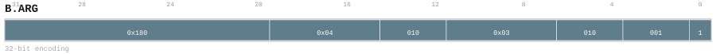

---
// Auto-generated instruction documentation
// Do not edit by hand

[[inst_b_arg]]
==== B.ARG

*Description:* Block block argument: B.ARG.

[[inst_b_arg_32_374ec956affe]]
===== Form `b_arg_32_374ec956affe`

*Syntax:* B.ARG NORM.normal

*Encoding:*

image::../encodings/enc_b_arg_32_374ec956affe.svg[B.ARG encoding form b_arg_32_374ec956affe,width=800]

*Compression:* L32 (len=32)

[[inst_b_arg_32_47e8ac50ac96]]
===== Form `b_arg_32_47e8ac50ac96`

*Syntax:* B.ARG format

*Encoding:*

image::../encodings/enc_b_arg_32_47e8ac50ac96.svg[B.ARG encoding form b_arg_32_47e8ac50ac96,width=800]

*Compression:* L32 (len=32)

[[inst_b_arg_32_5c8bfa662370]]
===== Form `b_arg_32_5c8bfa662370`

*Syntax:* B.ARG NZ2DN.canon

*Encoding:*

image::../encodings/enc_b_arg_32_5c8bfa662370.svg[B.ARG encoding form b_arg_32_5c8bfa662370,width=800]

*Compression:* L32 (len=32)

[[inst_b_arg_32_95152c29a268]]
===== Form `b_arg_32_95152c29a268`

*Syntax:* B.ARG ND2ZN.normal, FP16, Null

*Encoding:*

*Compression:* L32 (len=32)

[[inst_b_arg_32_c6d5c49a4ad7]]
===== Form `b_arg_32_c6d5c49a4ad7`

*Syntax:* B.ARG DN2ZN.normal, FP16, Null

*Encoding:*

image::../encodings/enc_b_arg_32_c6d5c49a4ad7.svg[B.ARG encoding form b_arg_32_c6d5c49a4ad7,width=800]

*Compression:* L32 (len=32)

[[inst_b_arg_32_f19d18f2126b]]
===== Form `b_arg_32_f19d18f2126b`

*Syntax:* B.ARG DN2NZ.normal, FP32, Null

*Encoding:*

image::../encodings/enc_b_arg_32_f19d18f2126b.svg[B.ARG encoding form b_arg_32_f19d18f2126b,width=800]

*Compression:* L32 (len=32)

*Uop-Class:* CMD

*Uop-Class payload:* `{"cmd_kind": "BLOCK_ARGUMENT", "note": "User confirmed A", "source": "group_rule", "uop_kind": "CMD"}`
