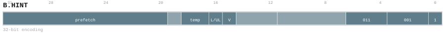

---
// Auto-generated instruction documentation
// Do not edit by hand

[[inst_b_hint]]
==== B.HINT

*Description:* Block block hint: B.HINT.

[[inst_b_hint_32_69d942ff1583]]
===== Form `b_hint_32_69d942ff1583`

*Syntax:* B.HINT {BR.{likely, unlikely}, TEMP.{hot, warm, cool, none}, PRFSIZE}

*Encoding:*

*Compression:* L32 (len=32)

[[inst_b_hint_32_f7d01d734925]]
===== Form `b_hint_32_f7d01d734925`

*Syntax:* B.HINT TRACE.{begin, end}

*Encoding:*

image::../encodings/enc_b_hint_32_f7d01d734925.svg[B.HINT encoding form b_hint_32_f7d01d734925,width=800]

*Compression:* L32 (len=32)

*Uop-Class:* CMD

*Uop-Class payload:* `{"cmd_kind": "DESC_B_HINT", "note": "User confirmed A", "source": "group_rule", "uop_kind": "CMD"}`
