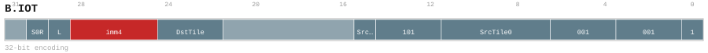

---
// Auto-generated instruction documentation
// Do not edit by hand

[[inst_b_iot]]
==== B.IOT

*Description:* v0.56 one-input immediate-size tile descriptor; function=101 means only SrcTile0 is valid.

[[inst_b_iot_32_10db6db84f5d]]
===== Form `b_iot_32_10db6db84f5d`

*Syntax:* B.IOT SrcTile0<.reuse>, <last>, ->DstTile<Size>

*Encoding:*

*Compression:* L32 (len=32)

[[inst_b_iot_32_8b8bce6bffe8]]
===== Form `b_iot_32_8b8bce6bffe8`

*Syntax:* B.IOT SrcTile0<.reuse>, SrcTile1<.reuse>, <last>, ->DstTile<Size>

*Encoding:*

image::../encodings/enc_b_iot_32_8b8bce6bffe8.svg[B.IOT encoding form b_iot_32_8b8bce6bffe8,width=800]

*Compression:* L32 (len=32)

[[inst_b_iot_32_efa0fe3fe49a]]
===== Form `b_iot_32_efa0fe3fe49a`

*Syntax:* B.IOT <last>, ->DstTile<Size>

*Encoding:*

image::../encodings/enc_b_iot_32_efa0fe3fe49a.svg[B.IOT encoding form b_iot_32_efa0fe3fe49a,width=800]

*Compression:* L32 (len=32)

*Uop-Class:* CMD

*Uop-Class payload:* `{"cmd_kind": "BLOCK_IO", "note": "User confirmed A", "source": "group_rule", "uop_kind": "CMD"}`
