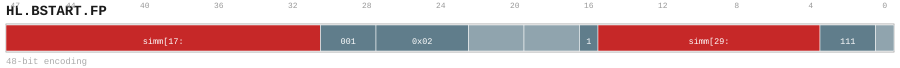

---
// Auto-generated instruction documentation
// Do not edit by hand

[[inst_hl_bstart_fp]]
==== HL.BSTART.FP

*Description:* Long 48-bit instruction encoding (prefix + 32-bit main form).

[[inst_hl_bstart_fp_48_038e2e96cf64]]
===== Form `hl_bstart_fp_48_038e2e96cf64`

*Syntax:* HL.BSTART.FP COND, <label>

*Encoding:*

image::../encodings/enc_hl_bstart_fp_48_038e2e96cf64.svg[HL.BSTART.FP encoding form hl_bstart_fp_48_038e2e96cf64,width=800]

*Compression:* HL48 (len=48)

[[inst_hl_bstart_fp_48_43530d2ebfae]]
===== Form `hl_bstart_fp_48_43530d2ebfae`

*Syntax:* HL.BSTART.FP FALL<, fixup_label>

*Encoding:*

*Compression:* HL48 (len=48)

[[inst_hl_bstart_fp_48_81b457553844]]
===== Form `hl_bstart_fp_48_81b457553844`

*Syntax:* HL.BSTART.FP CALL, <label>

*Encoding:*

image::../encodings/enc_hl_bstart_fp_48_81b457553844.svg[HL.BSTART.FP encoding form hl_bstart_fp_48_81b457553844,width=800]

*Compression:* HL48 (len=48)

[[inst_hl_bstart_fp_48_eb938e9200eb]]
===== Form `hl_bstart_fp_48_eb938e9200eb`

*Syntax:* HL.BSTART.FP DIRECT, <label>

*Encoding:*

*Compression:* HL48 (len=48)

*Uop-Class:* BBD

*Uop-Class payload:* `{"bbd_kind": "BSTART", "note": "User confirmed A", "source": "group_rule", "uop_kind": "BBD"}`
