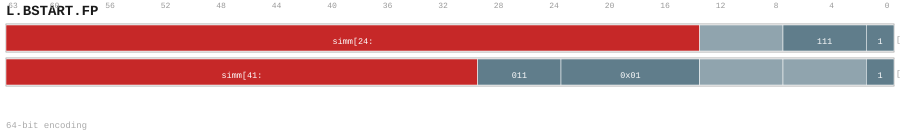

---
// Auto-generated instruction documentation
// Do not edit by hand

[[inst_l_bstart_fp]]
==== L.BSTART.FP

*Description:* BSTART: L.BSTART.FP operation.

[[inst_l_bstart_fp_64_098e57019d7b]]
===== Form `l_bstart_fp_64_098e57019d7b`

*Syntax:* L.BSTART.FP COND, <label>

*Encoding:*

*Compression:* L64 (len=64)

[[inst_l_bstart_fp_64_0cac9941f7d4]]
===== Form `l_bstart_fp_64_0cac9941f7d4`

*Syntax:* L.BSTART.FP DIRECT, <label>

*Encoding:*

*Compression:* L64 (len=64)

[[inst_l_bstart_fp_64_2067ad6667ed]]
===== Form `l_bstart_fp_64_2067ad6667ed`

*Syntax:* L.BSTART.FP CALL, <label>

*Encoding:*

image::../encodings/enc_l_bstart_fp_64_2067ad6667ed.svg[L.BSTART.FP encoding form l_bstart_fp_64_2067ad6667ed,width=800]

*Compression:* L64 (len=64)

[[inst_l_bstart_fp_64_8115c042ef26]]
===== Form `l_bstart_fp_64_8115c042ef26`

*Syntax:* L.BSTART.FP FALL<, fixup_label>

*Encoding:*

*Compression:* L64 (len=64)

*Uop-Class:* BBD

*Uop-Class payload:* `{"bbd_kind": "BSTART", "note": "Canonical 64-bit long-range block start", "source": "group_rule", "uop_kind": "BBD"}`
