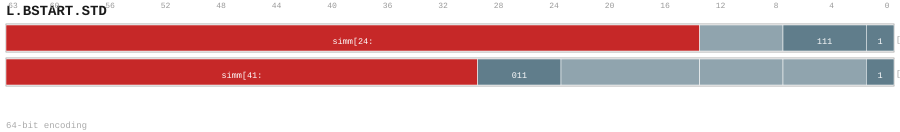

---
// Auto-generated instruction documentation
// Do not edit by hand

[[inst_l_bstart_std]]
==== L.BSTART.STD

*Description:* BSTART: L.BSTART.STD operation.

[[inst_l_bstart_std_64_37e84068ce61]]
===== Form `l_bstart_std_64_37e84068ce61`

*Syntax:* L.BSTART.STD DIRECT, <label>

*Encoding:*

image::../encodings/enc_l_bstart_std_64_37e84068ce61.svg[L.BSTART.STD encoding form l_bstart_std_64_37e84068ce61,width=800]

*Compression:* L64 (len=64)

[[inst_l_bstart_std_64_463a1567da91]]
===== Form `l_bstart_std_64_463a1567da91`

*Syntax:* L.BSTART.STD CALL, <label>

*Encoding:*

image::../encodings/enc_l_bstart_std_64_463a1567da91.svg[L.BSTART.STD encoding form l_bstart_std_64_463a1567da91,width=800]

*Compression:* L64 (len=64)

[[inst_l_bstart_std_64_72d502fcd30d]]
===== Form `l_bstart_std_64_72d502fcd30d`

*Syntax:* L.BSTART.STD COND, <label>

*Encoding:*

*Compression:* L64 (len=64)

[[inst_l_bstart_std_64_899592f9c5bc]]
===== Form `l_bstart_std_64_899592f9c5bc`

*Syntax:* L.BSTART.STD FALL<, fixup_label>

*Encoding:*

image::../encodings/enc_l_bstart_std_64_899592f9c5bc.svg[L.BSTART.STD encoding form l_bstart_std_64_899592f9c5bc,width=800]

*Compression:* L64 (len=64)

*Uop-Class:* BBD

*Uop-Class payload:* `{"bbd_kind": "BSTART", "note": "Canonical 64-bit long-range block start", "source": "group_rule", "uop_kind": "BBD"}`
