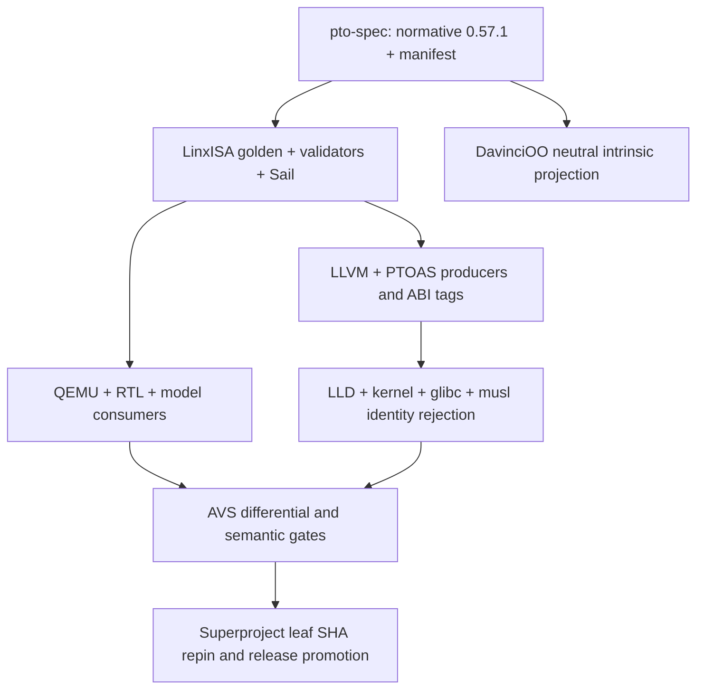

# PTO ISA 0.57.1 upgrade plan

> Historical, non-normative archive. Do not use this page for current ISA or implementation decisions.

Status: accepted implementation plan

Decision date: 2026-07-30

## Authority and release identity

[`PTO-ISA/pto-spec`](https://github.com/PTO-ISA/pto-spec) is the sole
normative source for PTO ISA 0.57.1. LinxISA and DavinciOO are projections and
implementations of the locked pto-spec release manifest; neither repository may
override an encoding, operation signature, fault rule, or conformance vector.

The upgrade starts from these fetched upstream commits:

| Repository | Baseline |
| --- | --- |
| `PTO-ISA/pto-spec` | `8054a21fc7f98318f936b1dff9d2132b2aa990be` |
| `LinxISA/linx-isa` | `98c08198a83ca03a832514b2b5cca27d4c30fa6d` |
| `hengliao1972/DavinciOO` | `da1c1f7bf276b223fc49acf7027a46409620e017` |

PTO ISA 0.57.1 is an encoding-ABI break despite the patch release number. An
object or executable must carry the architecture release and canonical
encoding-manifest identity. Producers, linkers, loaders, and bare-metal launch
manifests reject missing, old, mixed, or mismatched identities. There is no
untagged dual decoder; legacy source is reassembled or recompiled.

ELF identity uses `.note.pto.isa` with owner bytes `PTO\0`, owner-local note
type `1` (`PTO_NT_ISA_IDENTITY`), and four-byte alignment. Its descriptor is
the canonical compact JSON identity object without a trailing NUL byte. These
wire details come from the locked pto-spec release manifest and are shared by
LLVM, LLD, the kernel, and dynamic loaders.

## Frozen architecture delta

### Direct operations

The base inventory is exactly 120 operations: 98 TEPL, 9 TMA, and 13 CUBE,
with zero optional direct operations.

- Delete and reserve `TFMA`, `TFMOD`, `TFMODS`, `TADDC`, `TSUBC`, `TADDSC`,
  `TSUBSC`, `TLRELU`, and `TRANDOM`.
- Use canonical `TTRANS` and `TSORT`; `TTRANSPOSE` and `TSORT32` are
  source-migration aliases only.
- Add `TPARTARGMAX`, `TPARTARGMIN`, `TRESHAPE`, `TDEINTERLEAVE`,
  `TINTERLEAVE`, `TPUSH`, `TPOP`, `TALLOC`, and `TFREE` at Mode 3 Functions
  21 through 29.
- TMA Functions 0 through 8 are `TLOAD`, `TSTORE`, `TMOV`, `TPREFETCH`,
  `MGATHER`, `MSCATTER`, `MGATHER.MASK`, `MSCATTER.MASK`, and `MGATHER.CAS`.
- All 13 CUBE functions are base identities. ACC access is selected by the
  CUBE function, not by a B.IOT operand.

### Raw command formats

| Form | 0.57.1 contract |
| --- | --- |
| `BSTART.TEPL` | `DataType[31:27]`, `Mode[26:25]`, `Function[24:20]`, fixed low pattern `0x00019181`; mask `0x000fffff` |
| `B.IOT` | `Src1[31:26]`, `Src0[25:20]`, `L[19]`, `imm4[18:15]`, `S1R[11]`, `S0R[10]`, `Dst[9:7]` |
| `B.DATR` | `CMode[31:29]`, `PadValueOrByteId[28:27]`, `Sat[26]`, `Canonicalize[25]`, `DataType[24:20]`, `RMode[17:15]`, `Layout[11:7]` |
| `B.CATR` | `DR[26]`, `trap[19]`, `far[18]`, `atom[17]`, `aq[16]`, `rl[15]`; all other dynamic high fields zero |

The TEPL logical selector is `(Mode << 5) | Function`. All 128 selector
positions are classified as one of 98 accepted or 30 reserved positions.
DataType code 31 is illegal. Complete `DataType × Mode × Function` evidence
must classify all 4096 header values without collision or fallback.

The retired legacy Tile descriptor header, generic public `BSTART.TLSU`,
generic unallocated `BSTART.CUBE`, and
`BSTART.FIXP` are not executable 0.57.1 forms. Typed
`BSTART.<TMA-operation> DataType` is canonical. TMA descriptors are owned by
the operation schema plus B.IOR, B.DATR, and applicable B.DIM fields, not by
the six legacy TMA-oriented B.ARG forms.

### State and completion

- CELL is 128 bytes; each PE exposes exactly 2048 CELL, or 256 KiB, of Tile
  capacity. B.IOT size codes 3 through 9 mean 128 B through 8 KiB. Resource
  exhaustion is a precise allocation fault; no silent eviction or spill is
  architectural.
- `reuse=0` releases a source only after successful consumer commit;
  `reuse=1` retains it. Fault, retry, and squash preserve source lifetime.
- ACC is implicit architectural state. B.IOT destination codes 4 through 6
  remain reserved and 7 is illegal. Ordinary/BIAS CUBE functions initialize
  ACC, `.ACC` functions read/write it, and ACCCVT publishes a Tile and releases
  ACC only after successful commit. Trap context includes ACC.
- NORM layout is mandatory. ND/DN/ZN/NZ conversion codes are capability
  gated; an unsupported accepted layout faults precisely before effects.
- A false mask lane performs no access or fault check. Masked gather writes
  B.DATR PadValue to inactive destination lanes. Multi-access operations
  preflight all active accesses and commit no partial state on failure.
- Non-atomic duplicate-address scatter has an unspecified winning active lane
  after complete successful preflight. PTO-TSO and B.CATR define ordering;
  dependency metadata is not a fence.
- The hardware conformance profile is IEEE-754 with canonical quiet NaN and
  IEEE signed zero. The deterministic raw-carrier model remains a separately
  identified reference-test profile.
- TSORT is stable over 32-element groups and produces values plus U32 original
  indices. NaNs follow numeric values while retaining input order.

### Numeric and matrix conformance

The hardware numeric identity is
`pto-hardware-numeric-0.57.1-ieee-v1`. The release lock freezes both the
hardware profile and its executable vectors; sharing only the encoding hash is
not a conformance claim.

- The assigned low-precision formats are the exact OCP `E4M3`, `E5M2`,
  `E3M2`, `E2M3`, `E2M1`, and `E8M0` encodings. `HiF8` uses the Ascend
  dynamic Dot/Exponent/Mantissa encoding. `HiF4X2` uses the public E1M2 value
  table but remains a distinct DataType identity from `E1M2X2`.
- Packed DataTypes use logical lanes: lane `2*i` is the low nibble and lane
  `2*i+1` is the high nibble. Shape, matrix, and scale dimensions count these
  logical lanes, not carrier bytes.
- Ordinary matrix operations accept the 24 assigned non-`E8M0` DataTypes with
  identical left, right, header, and logical bias types. Physical ACC is FP64
  for FP64, FP32 for other floating formats, S64 for signed integer formats,
  and U64 for unsigned integer formats.
- MX accepts all four ordered pairs over `E4M3`/`E5M2` and all four ordered
  pairs over `E2M1X2`/`HiF4X2`. Header, ACC, and bias are FP32; both scale
  inputs are E8M0. One scale covers 32 logical K elements, with ScaleA shape
  `M x ceil(K/32)` and ScaleB shape `ceil(K/32) x N`, and scaling occurs before
  each fused multiply-add.
- BIAS is added after the complete dot product in the logical result type;
  MX BIAS is FP32. `.ACC` starts from the old ACC and adds the newly scaled
  product. ACCCVT publishes the complete rounded Tile before releasing ACC.
- Invalid float-to-signed conversion produces the destination minimum; invalid
  float-to-unsigned conversion produces the destination maximum. Packed lanes
  convert independently. RHB means nearest with exact ties toward positive
  infinity.

## Baseline differences that must close

### pto-spec

The baseline already has the right 98/9/13 names, but 80 of 98 TEPL selectors
use the old 10-bit layout. B.IOT, B.DATR, and B.CATR are also old. Raw BSTART
decode is not connected to direct Tile execution; reuse fields have no commit
effect; capacity is 512 KiB; ACC and layout capabilities are absent; masked
gather preserves stale destination data; and binary closure omits Tile/catalog
and semantic content. The release PR must close those behaviors in ASL, not
only update catalog rows.

### LinxISA

The baseline golden release is 0.57.0. `pto_ops.json` still derives 111 rows
from the old workbook, while `engine_ops.json` has 120 names but 55 pending
semantic records and the old raw ABI. Sail reports zero PTO operations as
architecturally complete. LLVM, PTOAS, QEMU, LinxCore, the C++ models, kernel,
glibc, and musl have independent copies of encodings or ABI assumptions.

### DavinciOO

The latest `isa/intrinsic` tree has no delta between its local intrinsic commit
and fetched `origin/main`, but its workbook contains only 87 TEPL, 5 TMA, and
8 CUBE rows. It includes deleted operations, misses retained PTO operations,
contains a duplicate/wrong TSEL assignment, and describes a retired Tile
descriptor header,
TPREFETCH, ACC, layout, and descriptor rules. Nearly all authored and generated
intrinsic content contains Linx branding, and generation has neither a locked
pto-spec input nor an exact-file-set check.

## PR dependency graph

The normative pto-spec PR merges first. Every downstream PR locks its exact
commit and manifest hash. The LinxISA superproject repins only leaf commits
whose local gates passed; it never points at unmerged or unverified semantic
work.

## Repository ownership and gates

| Lane | Required output | Blocking evidence |
| --- | --- | --- |
| pto-spec | ADR, catalogs, executable ASL, requirements, release manifest, vectors | repository checks, strict ASL typecheck/tests, 4096 totality, zero pending, stable regeneration |
| Linx golden/Sail | locked pto manifest, 0.57.1 golden, decode and architectural semantics | golden validator, 120 raw positives, retired negatives, Sail typecheck/tests |
| LLVM/PTOAS | canonical assembly/IR lowering, release/hash ELF attribute | MC roundtrip, CodeGen, mixed/missing ABI link rejection |
| QEMU | exact decode, preflight/commit, ACC/lifetime/mask behavior | AVS QEMU Tile suites and pto-spec vector parity |
| LinxCore/models | generated identifiers and commit/fault interfaces | unit tests plus QEMU/model differential vectors |
| kernel/libc loaders | release/hash enforcement | matching acceptance and missing/old/mixed/hash-mismatch rejection |
| DavinciOO | neutral locked projection, 120 pages/rows, deterministic site/workbook | exact owned set, zero Linx token including XLSX, selector/vector parity |
| superproject | verified submodule SHAs and run manifest | layout check, pin/external lanes, full benchmark/QEMU/Linux flow |

## Submodule synchronization matrix

The following leaf repositories contain an ISA producer, consumer, loader, or
conformance surface and require a reviewed commit before final repin:

| Submodule | Upgrade responsibility |
| --- | --- |
| `compiler/llvm` | assembler, disassembler, MC/CodeGen, ELF attribute, LLD checks, MLIR PTO dialect |
| `compiler/ptoas` | PTO IR/bytecode identities, typed TMA lowering, manifest gate |
| `emulator/qemu` | decode and executable Tile semantics |
| `rtl/LinxCore` | generated decode/catalog and precise commit/fault interface |
| `tools/model` | generated tables and architectural reference state |
| `tools/LinxCoreModel` | remove D operations and ACC-as-B.IOT assumptions |
| `kernel/linux` | ELF loader identity rejection and trap/context ABI |
| `lib/glibc` | dynamic-loader identity check |
| `lib/musl` | dynamic-loader identity check |
| `workloads/pto_kernels` | recompile and semantic parity vectors |

`tools/pyCircuit`, `workloads/SuperNPUBench`, and other workload/RTL-facing
submodules are repinned only if their generated artifacts or rebuild evidence
changes. Existing user-owned submodule worktrees are never overwritten by the
upgrade branch.

## Completion criteria

The release is complete only when all of the following hold:

1. All three top-level repositories report the same pto-spec commit, release,
   encoding ABI ID, and canonical content hash.
2. The 120 base operations have machine-readable operands, legality, effects,
   faults, restart, state-access, semantic handler, and executable evidence;
   pending and optional counts are zero.
3. Accepted, reserved, illegal, deleted, old-ABI, and six semantic-collision
   raw words are covered by positive or negative evidence without heuristic
   decode.
4. Fault/retry/squash preserve Tile lifetime and ACC, and multi-access faults
   produce no partial effects.
5. Compiler, assembler, linker, loader, QEMU, RTL/model, Sail, and DavinciOO
   projections agree byte-for-byte or effect-for-effect with pto-spec vectors.
6. Generated source, documentation, workbook, and site checks are stable on a
   second run and reject extra stale files.
7. DavinciOO public intrinsic content contains no Linx ISA branding, including
   compressed XLSX strings.
8. Every required leaf PR is merged or pinned to an explicitly reviewed commit,
   the superproject layout gate passes, and the benchmark/QEMU/Linux bring-up
   manifest records the final SHA set.
