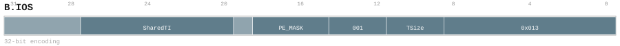

# B.IOS

## Purpose

`B.IOS` binds one absolute Core-private Shared tile register for a block
operation. Each core owns `S0` through `S63`; its four PEs share that bank. The
same name in another core refers to another bank.

The generated instruction page at [`B.IOS`](/isa/instructions/b_ios/) and the
machine-readable catalog are the encoding and legality authority. This page
explains the Shared-register model without defining a second instruction
contract.

## Assembly

```asm
B.IOS S<SharedTileID>, mask=<PE_MASK>
B.IOS mask=<PE_MASK>, ->S<SharedTileID><SizeCode>
```

`SharedTileID` is an absolute 6-bit index. Canonical names are `S0` through
`S63`; relative spellings such as `S#1` are not accepted.

## Encoding identity



| Bits | Field | Meaning |
| --- | --- | --- |
| 31:26 | fixed zero | Reserved fixed bits |
| 25:20 | `SharedTileID` | Absolute `S0` through `S63` index |
| 19 | fixed zero | Reserved fixed bit |
| 18:15 | `SizeCode` | Source role or complete Shared-object capacity |
| 14:12 | fixed `001` | Function selector |
| 11:9 | `PEMode` | Fixed four-PE participation mode |
| 8:0 | fixed `000010011` | Minor encoding |

The decode mask is `0xfc0871ff` and the match is `0x00001013`. The PTO source
form is `b_ios_32_4ba5ef98fdaa`; the compiled Linx form is
`b_ios_32_2f2d1ab83761`.

`PEMode` maps codes 0 through 7 to semantic masks `0000`, `1000`, `0100`,
`0010`, `0001`, `1100`, `1110`, and `1111`. `PEMode=000` is a strict no-effect
path before placement, duplicate, schema, allocation, descriptor, memory, and
fault checks.

`SizeCode=0` selects a source. Destination codes `SizeCode=1` through
`SizeCode=12` select 128 B,
256 B, 512 B, 1 KiB, 2 KiB, 4 KiB, 8 KiB, 16 KiB, 32 KiB, 64 KiB, 128 KiB, or
256 KiB for the complete Core-wide Shared object. Codes `13..15` are illegal.
The capacity is not multiplied by the number of participating PEs.

## State behavior

A source binding is read-only and does not change the Shared descriptor,
allocation mask, initialized mask, or payload. An uninitialized read produces
an undefined-register value.

A singleton destination publishes the complete Shared parent atomically. A
multi-PE destination uses `B.ASSEMBLE` to provide explicit non-overlapping
ranges and publishes only on `LAST`. Schema, capacity, range, readiness, and
allocation checks complete before visible descriptor or payload effects.

The architecture defines no order between conflicting PE accesses beyond the
atomic publication rule. Software prevents conflicting accesses or establishes
separate synchronization.

## Examples

```asm
B.IOS S7, mask=1100
B.IOS mask=1111, ->S23<0001>
B.IOS S7, mask=0000
```

`B.IOT` remains the Local tile binding and does not name the Shared `S0`
through `S63` bank.
