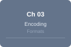

# LinxISA Instruction Reference

<!-- Hero Banner -->

**ISA Version:** v0.58.5 &nbsp;·&nbsp; **754 instruction forms** &nbsp;·&nbsp; **55 groups** &nbsp;·&nbsp; **4 encoding formats**

---

Browse by chapter, instruction group, or search by mnemonic. Each instruction page includes its encoding diagram, assembly syntax, and description.

**Jump to:** [Encoding Formats](encoding.md) · [Groups Index](groups/index.md) · [A–Z Index](instructions/index.md)

---

## Browse by Chapter

The LinxISA manual is organized into 12 chapters covering distinct functional units. Click any chapter to jump to its first instruction group.

[{: style="width:120px;height:80px"} **Ch 03 — Encoding Formats**{.chapter-card style="--ch03-color:#64748b"}
: Bit numbering, instruction lengths, decode tags, field colour key

[{: style="width:120px;height:80px"} **Ch 04 — Block ISA**{.chapter-card style="--ch04-color:#8b5cf6"}
: BSTART, BSTOP, B.DATR, B.DIM, B.IOT, tile/SIMT control flow

[{: style="width:120px;height:80px"} **Ch 11 — AGU**{.chapter-card style="--ch11-color:#059669"}
: Loads, stores, prefetch, all addressing modes

[{: style="width:120px;height:80px"} **Ch 12 — ALU**{.chapter-card style="--ch12-color:#0891b2"}
: ADD, SUB, MUL, DIV, shifts, bit manip, LUI, CSEL

[{: style="width:120px;height:80px"} **Ch 13 — FSU**{.chapter-card style="--ch13-color:#0ea5e9"}
: Floating-point arithmetic, FMA, format conversion

[{: style="width:120px;height:80px"} **Ch 14 — AMO**{.chapter-card style="--ch14-color:#e11d48"}
: LR/SC, atomic fetch-op, CAS

[{: style="width:120px;height:80px"} **Ch 15 — BBD**{.chapter-card style="--ch15-color:#8b5cf6"}
: C.BSTART, C.BSTOP, block delimiters

[{: style="width:120px;height:80px"} **Ch 16 — BRU**{.chapter-card style="--ch16-color:#7c3aed"}
: Branches, CMP, SETC, SETRET, ADDTPC

[{: style="width:120px;height:80px"} **Ch 17 — CMD**{.chapter-card style="--ch17-color:#6366f1"}
: B.CATR, B.DATR, B.HINT, block attributes

[{: style="width:120px;height:80px"} **Ch 18 — RSV**{.chapter-card style="--ch18-color:#a16207"}
: HL.BFI, HL.MIADD, HL.MISUB

[{: style="width:120px;height:80px"} **Ch 19 — SYS**{.chapter-card style="--ch19-color:#dc2626"}
: FENCE, barriers, EBREAK, ACR*, cache/TLB maintenance

[{: style="width:120px;height:80px"} **Ch 20 — VEC**{.chapter-card style="--ch20-color:#2563eb"}
: V.* vector forms, shuffles, reductions, division

---

## Browse by Group

[ALU (107)](groups/alu.md){.group-card} [AMO (53)](groups/amo.md){.group-card} [Arithmetic Operation (16)](groups/arithmetic_operation.md){.group-card} [Atomic Operation (24)](groups/atomic_operation.md){.group-card}
[BRU (58)](groups/bru.md){.group-card} [BSTART (21)](groups/bstart.md){.group-card} [Bit Manipulation (8)](groups/bit_manipulation.md){.group-card} [Block Split (2)](groups/block_split.md){.group-card}
[Bundle Argument (3)](groups/bundle_argument.md){.group-card} [Bundle Control Attribute (1)](groups/bundle_control_attribute.md){.group-card} [Bundle Data Attribute (1)](groups/bundle_data_attribute.md){.group-card} [Bundle Dimension (1)](groups/bundle_dimension.md){.group-card}
[Bundle Fixed-Point PostProcess Attribute (1)](groups/bundle_fixed_point_postprocess_attribute.md){.group-card} [Bundle Hint (2)](groups/bundle_hint.md){.group-card} [Bundle Input & Output (7)](groups/bundle_input_output.md){.group-card} [Bundle Offset (1)](groups/bundle_offset.md){.group-card}
[Bundle Range Modifier (2)](groups/bundle_range_modifier.md){.group-card} [Bundle Split (52)](groups/bundle_split.md){.group-card} [C.BSTART (7)](groups/c_bstart.md){.group-card} [Compare Instruction (16)](groups/compare_instruction.md){.group-card}
[Division (2)](groups/division.md){.group-card} [FSU (30)](groups/fsu.md){.group-card} [Floating Point Arithmetic (5)](groups/floating_point_arithmetic.md){.group-card} [Format Convert (4)](groups/format_convert.md){.group-card}
[General (3)](groups/general.md){.group-card} [General Manager (2)](groups/general_manager.md){.group-card} [LDA (11)](groups/lda.md){.group-card} [LDA/BASE_IMM (9)](groups/lda_base_imm.md){.group-card}
[LDA/BASE_REG (8)](groups/lda_base_reg.md){.group-card} [LDA/LONG (12)](groups/lda_long.md){.group-card} [LDA/PAIR (19)](groups/lda_pair.md){.group-card} [LDA/PC_REL (7)](groups/lda_pc_rel.md){.group-card}
[LDA/POST_INDEX (19)](groups/lda_post_index.md){.group-card} [LDA/PRE_INDEX (19)](groups/lda_pre_index.md){.group-card} [LDA/UNSCALED (6)](groups/lda_unscaled.md){.group-card} [Load Immediate Offset (14)](groups/load_immediate_offset.md){.group-card}
[Load Register Offset (14)](groups/load_register_offset.md){.group-card} [Load UnScaled (10)](groups/load_unscaled.md){.group-card} [Multi-Cycle ALU (2)](groups/multi_cycle_alu.md){.group-card} [Reduce Operation with Register (9)](groups/reduce_operation_with_register.md){.group-card}
[STA (4)](groups/sta.md){.group-card} [STA/BASE_IMM (9)](groups/sta_base_imm.md){.group-card} [STA/BASE_REG (7)](groups/sta_base_reg.md){.group-card} [STA/LONG (7)](groups/sta_long.md){.group-card}
[STA/PAIR (14)](groups/sta_pair.md){.group-card} [STA/PC_REL (4)](groups/sta_pc_rel.md){.group-card} [STA/POST_INDEX (14)](groups/sta_post_index.md){.group-card} [STA/PRE_INDEX (14)](groups/sta_pre_index.md){.group-card}
[SYS (35)](groups/sys.md){.group-card} [Shuffle (8)](groups/shuffle.md){.group-card} [Store Offset (14)](groups/store_offset.md){.group-card} [Store Register Offset (14)](groups/store_register_offset.md){.group-card}
[Three Source Integer (2)](groups/three_source_integer.md){.group-card} [Three-Source Floating Point (8)](groups/three_source_floating_point.md){.group-card} [Two-Source Floating Point (12)](groups/two_source_floating_point.md){.group-card}

See also: [Groups Index (detailed)](groups/index.md) · [All Instructions A–Z](instructions/index.md)

---

## Instruction Quick Index

Use **Ctrl+F** / **Cmd+F** to search, or browse the [full alphabetical list](instructions/index.md).

| Mnemonic | Group | Bits | Description |
|----------|-------|------|-------------|

| [ACRC](instructions/acrc.md) | sys | 32 | Architectural control (ring call). Calls an implementation-defined ACR. |
| [ACRE](instructions/acre.md) | sys | 32 | Architectural control (ring entry). Enters an implementation-defined ACR. |
| [ASSERT](instructions/assert.md) | sys | 32 | Architectural assertion. Traps if the condition register is zero. |
| [BC.IALL](instructions/bc_iall.md) | sys | 32 | Branch-predictor cache invalidate all entries. |
| [BC.IVA](instructions/bc_iva.md) | sys | 32 | Branch-predictor cache invalidate by address. |
| [ADD](instructions/add.md) | alu | 32 | Integer addition. Writes the sum of two registers to the destination. |
| [ADDI](instructions/addi.md) | alu | 32 | Integer add-immediate. Adds a sign-extended 12-bit immediate to a register. |
| [ADDIW](instructions/addiw.md) | alu | 32 | 32-bit word add-immediate. |
| [ADDW](instructions/addw.md) | alu | 32 | 32-bit word integer addition. |
| [AND](instructions/and.md) | alu | 32 | Bitwise AND of two registers. |
| [ADDTPC](instructions/addtpc.md) | bru | 32 | PC-relative addition. Adds an immediate to the current PC/TPC and writes the result. |
| [C.CMP.EQI](instructions/c_cmp_eqi.md) | bru | 16 | C.CMP.EQI - Compare scalar operands and write the encoded boolean result. |
| [C.CMP.NEI](instructions/c_cmp_nei.md) | bru | 16 | C.CMP.NEI - Compare scalar operands and write the encoded boolean result. |
| [C.SETC.EQ](instructions/c_setc_eq.md) | bru | 16 | [16-bit C.] Sets the block-commit condition. |
| [C.SETC.NE](instructions/c_setc_ne.md) | bru | 16 | [16-bit C.] Sets the block-commit condition. |
| [B.ASSEMBLE](instructions/b_assemble.md) | bundle_range_modifier | 32 | Decodes one destination-range assemble modifier and retains its XLEN-wrapped derived offset in the immediately preceding binder group. |
| [B.SUBVIEW](instructions/b_subview.md) | bundle_range_modifier | 32 | Decodes one source-range subview modifier and retains its XLEN-wrapped derived offset in the immediately preceding binder group. |
| [B.CATR](instructions/b_catr.md) | bundle_control_attribute | 32 | Defines one optional block control record for post-commit trap, transactional visibility, acquire/release ordering, remote execution, and dimension-reduction mode. |
| [B.DATR](instructions/b_datr.md) | bundle_data_attribute | 32 | Latches the optional per-block tile layout, data type, padding, comparison, rounding, saturation, and canonicalization attributes. |
| [B.DIM](instructions/b_dim.md) | bundle_argument | 32 | Writes zero-extend((GPR[RegSrc] + uimm17)[15:0]) to the selected bundle-local LB register exactly once. |
| [B.FPATR](instructions/b_fpatr.md) | bundle_fixed_point_postprocess_attribute | 32 | Latches complete-bundle matrix post-processing mode, reduction enables, and fixed-point descriptor controls. |
| [B.HINT](instructions/b_hint.md) | bundle_hint | 32 | Records one optional per-block branch, temperature, prefetch-size, or trace-boundary hint without changing functional results. |
| [B.IOR](instructions/b_ior.md) | bundle_input_output | 32 | Bind up to three absolute GPR inputs and one absolute GPR output; regular TLSU uses source one as row stride and indexed TLSU uses it as GM row stride in elements. |
| [B.IOS](instructions/b_ios.md) | bundle_input_output | 32 | Binds one ordered absolute Core-private Shared register S0..S63 as a source or destination with a common four-PE participation mode decoded to a fixed mask. |
| [B.IOT](instructions/b_iot.md) | bundle_input_output | 32 | Bind ordered relative Local Tile sources and renamed destinations; each T/U/M/N #1 source names the newest published generation of that hand. |
| [B.TEXT](instructions/b_text.md) | bundle_offset | 32 | Sets the out-of-line body entry address for a decoupled bundle. |
| [BSTART](instructions/bstart.md) | bundle_split | 32 | Block split marker. Terminates the current basic block and begins the next. Encodes block type and transition kind. |
| [BSTART.FP](instructions/bstart_fp.md) | bundle_split | 32 | Terminates the current block and begins the next. |
| [BSTART.GMOV](instructions/bstart_gmov.md) | bundle_split | 32 | Terminates the current block and begins the next. |
| [BSTART.MGATHER](instructions/bstart_mgather.md) | bundle_split | 32 | Terminates the current block and begins the next. |
| [BSTART.MGATHER.CAS](instructions/bstart_mgather_cas.md) | bundle_split | 32 | Terminates the current block and begins the next. |
| [BSTART.CALL](instructions/bstart_call.md) | bstart | 32 | Atomic fused call with independent call-target and return-target fields; transfers to the call block and writes `ra`. This exact aggregate is distinct from the generic bare-call form, which preserves `ra` and requires an adjacent `SETRET` or `C.SETRET`. |
| [BSTART.ICALL](instructions/bstart_icall.md) | bstart | 32 | Terminates the current block and begins the next. |
| [HL.BSTART CALL](instructions/hl_bstart_call.md) | bstart | 48 | [48-bit HL.] Atomic fused call with independent call-target and return-target fields; transfers to the call block and writes `ra`. This exact aggregate is distinct from the generic bare-call form, which preserves `ra` and requires an adjacent `SETRET` or `C.SETRET`. |
| [HL.BSTART.FP](instructions/hl_bstart_fp.md) | bstart | 48 | [48-bit HL.] Terminates the current block and begins the next. |
| [HL.BSTART.STD](instructions/hl_bstart_std.md) | bstart | 48 | [48-bit HL.] Terminates the current block and begins the next. |
| [BSTART.VPAR](instructions/bstart_vpar.md) | block_split | 32 | Terminates the current block and begins the next. |
| [BSTART.VSEQ](instructions/bstart_vseq.md) | block_split | 32 | Terminates the current block and begins the next. |
| [C.B.DIMI](instructions/c_b_dimi.md) | bundle_dimension | 16 | Zero-extends imm8 and writes one selected bundle-local LB exactly once. |
| [C.BSTART.FP](instructions/c_bstart_fp.md) | c_bstart | 16 | [16-bit C.] Terminates the current block and begins the next. |
| [C.BSTART.MPAR](instructions/c_bstart_mpar.md) | c_bstart | 16 | [16-bit C.] Terminates the current block and begins the next. |
| [C.BSTART.MSEQ](instructions/c_bstart_mseq.md) | c_bstart | 16 | [16-bit C.] Terminates the current block and begins the next. |
| [C.BSTART.STD](instructions/c_bstart_std.md) | c_bstart | 16 | [16-bit C.] Terminates the current block and begins the next. |
| [C.BSTART.SYS](instructions/c_bstart_sys.md) | c_bstart | 16 | [16-bit C.] Terminates the current block and begins the next. |
| [C.LDI](instructions/c_ldi.md) | lda_base_imm | 16 | C.LDI snapshots its scalar sources, forms its encoded address, and loads one aligned little-endian 8-byte value. |
| [C.LWI](instructions/c_lwi.md) | lda_base_imm | 16 | C.LWI snapshots its scalar sources, forms its encoded address, and loads one aligned little-endian 4-byte value. |
| [LBI](instructions/lbi.md) | lda_base_imm | 32 | LBI snapshots its scalar sources, forms its encoded address, and loads one aligned little-endian 1-byte value. |
| [LBUI](instructions/lbui.md) | lda_base_imm | 32 | LBUI snapshots its scalar sources, forms its encoded address, and loads one aligned little-endian 1-byte value. |
| [LDI](instructions/ldi.md) | lda_base_imm | 32 | LDI snapshots its scalar sources, forms its encoded address, and loads one aligned little-endian 8-byte value. |
| [C.SDI](instructions/c_sdi.md) | sta_base_imm | 16 | C.SDI snapshots its scalar sources, forms its encoded address, and stores one aligned little-endian 8-byte value. |
| [C.SWI](instructions/c_swi.md) | sta_base_imm | 16 | C.SWI snapshots its scalar sources, forms its encoded address, and stores one aligned little-endian 4-byte value. |
| [SBI](instructions/sbi.md) | sta_base_imm | 32 | SBI snapshots its scalar sources, forms its encoded address, and stores one aligned little-endian 1-byte value. |
| [SDI](instructions/sdi.md) | sta_base_imm | 32 | SDI snapshots its scalar sources, forms its encoded address, and stores one aligned little-endian 8-byte value. |
| [SDI.U](instructions/sdi_u.md) | sta_base_imm | 32 | SDI.U snapshots its scalar sources, forms its encoded address, and stores one aligned little-endian 8-byte value. |
| [CASB](instructions/casb.md) | amo | 32 | CASB atomically compares and conditionally replaces one byte, then publishes the prior value. |
| [CASD](instructions/casd.md) | amo | 32 | CASD atomically compares and conditionally replaces one doubleword, then publishes the prior value. |
| [CASH](instructions/cash.md) | amo | 32 | CASH atomically compares and conditionally replaces one halfword, then publishes the prior value. |
| [CASW](instructions/casw.md) | amo | 32 | CASW atomically compares and conditionally replaces one word, then publishes the prior value. |
| [DMA](instructions/dma.md) | amo | 32 | DMA performs an exact 64-byte copy, validates both ranges before effects, snapshots the source so overlap has memmove semantics, and guarantees that any fault leaves memory unchanged for precise full reissue. |
| [FABS](instructions/fabs.md) | fsu | 32 | Floating-point absolute value. |
| [FADD](instructions/fadd.md) | fsu | 32 | Floating-point addition. |
| [FCVT](instructions/fcvt.md) | fsu | 32 | Floating-point format conversion. |
| [FCVTA](instructions/fcvta.md) | fsu | 32 | FCVTA converts an FP64, FP32, FP16, or E4M3 source to U64/U32/U16/U8 or S64/S32/S16/S8 with fixed round-away mode. |
| [FCVTM](instructions/fcvtm.md) | fsu | 32 | FCVTM converts an FP64, FP32, FP16, or E4M3 source to U64/U32/U16/U8 or S64/S32/S16/S8 with fixed round-down mode. |
| [HL.LB.PCR](instructions/hl_lb_pcr.md) | lda_pc_rel | 48 | HL.LB.PCR snapshots its scalar sources, forms its encoded address, and loads one aligned little-endian 1-byte value. |
| [HL.LBU.PCR](instructions/hl_lbu_pcr.md) | lda_pc_rel | 48 | HL.LBU.PCR snapshots its scalar sources, forms its encoded address, and loads one aligned little-endian 1-byte value. |
| [HL.LD.PCR](instructions/hl_ld_pcr.md) | lda_pc_rel | 48 | HL.LD.PCR snapshots its scalar sources, forms its encoded address, and loads one aligned little-endian 8-byte value. |
| [HL.LH.PCR](instructions/hl_lh_pcr.md) | lda_pc_rel | 48 | HL.LH.PCR snapshots its scalar sources, forms its encoded address, and loads one aligned little-endian 2-byte value. |
| [HL.LHU.PCR](instructions/hl_lhu_pcr.md) | lda_pc_rel | 48 | HL.LHU.PCR snapshots its scalar sources, forms its encoded address, and loads one aligned little-endian 2-byte value. |
| [HL.LB.PO](instructions/hl_lb_po.md) | lda_post_index | 48 | HL.LB.PO snapshots its scalar sources, forms its encoded address, and loads one aligned little-endian 1-byte value. |
| [HL.LBI.PO](instructions/hl_lbi_po.md) | lda_post_index | 48 | HL.LBI.PO snapshots its scalar sources, forms its encoded address, and loads one aligned little-endian 1-byte value. |
| [HL.LBU.PO](instructions/hl_lbu_po.md) | lda_post_index | 48 | HL.LBU.PO snapshots its scalar sources, forms its encoded address, and loads one aligned little-endian 1-byte value. |
| [HL.LBUI.PO](instructions/hl_lbui_po.md) | lda_post_index | 48 | HL.LBUI.PO snapshots its scalar sources, forms its encoded address, and loads one aligned little-endian 1-byte value. |
| [HL.LD.PO](instructions/hl_ld_po.md) | lda_post_index | 48 | HL.LD.PO snapshots its scalar sources, forms its encoded address, and loads one aligned little-endian 8-byte value. |
| [HL.LB.PR](instructions/hl_lb_pr.md) | lda_pre_index | 48 | HL.LB.PR snapshots its scalar sources, forms its encoded address, and loads one aligned little-endian 1-byte value. |
| [HL.LBI.PR](instructions/hl_lbi_pr.md) | lda_pre_index | 48 | HL.LBI.PR snapshots its scalar sources, forms its encoded address, and loads one aligned little-endian 1-byte value. |
| [HL.LBU.PR](instructions/hl_lbu_pr.md) | lda_pre_index | 48 | HL.LBU.PR snapshots its scalar sources, forms its encoded address, and loads one aligned little-endian 1-byte value. |
| [HL.LBUI.PR](instructions/hl_lbui_pr.md) | lda_pre_index | 48 | HL.LBUI.PR snapshots its scalar sources, forms its encoded address, and loads one aligned little-endian 1-byte value. |
| [HL.LD.PR](instructions/hl_ld_pr.md) | lda_pre_index | 48 | HL.LD.PR snapshots its scalar sources, forms its encoded address, and loads one aligned little-endian 8-byte value. |
| [HL.LBI](instructions/hl_lbi.md) | lda_long | 48 | HL.LBI snapshots its scalar sources, forms its encoded address, and loads one aligned little-endian 1-byte value. |
| [HL.LBUI](instructions/hl_lbui.md) | lda_long | 48 | HL.LBUI snapshots its scalar sources, forms its encoded address, and loads one aligned little-endian 1-byte value. |
| [HL.LDI](instructions/hl_ldi.md) | lda_long | 48 | HL.LDI snapshots its scalar sources, forms its encoded address, and loads one aligned little-endian 8-byte value. |
| [HL.LDI.U](instructions/hl_ldi_u.md) | lda_long | 48 | HL.LDI.U snapshots its scalar sources, forms its encoded address, and loads one aligned little-endian 8-byte value. |
| [HL.LHI](instructions/hl_lhi.md) | lda_long | 48 | HL.LHI snapshots its scalar sources, forms its encoded address, and loads one aligned little-endian 2-byte value. |
| [HL.LBIP](instructions/hl_lbip.md) | lda_pair | 48 | HL.LBIP snapshots its scalar sources, forms its encoded address, and loads two adjacent aligned little-endian 1-byte values. |
| [HL.LBP](instructions/hl_lbp.md) | lda_pair | 48 | HL.LBP snapshots its scalar sources, forms its encoded address, and loads two adjacent aligned little-endian 1-byte values. |
| [HL.LBUIP](instructions/hl_lbuip.md) | lda_pair | 48 | HL.LBUIP snapshots its scalar sources, forms its encoded address, and loads two adjacent aligned little-endian 1-byte values. |
| [HL.LBUP](instructions/hl_lbup.md) | lda_pair | 48 | HL.LBUP snapshots its scalar sources, forms its encoded address, and loads two adjacent aligned little-endian 1-byte values. |
| [HL.LDIP](instructions/hl_ldip.md) | lda_pair | 48 | HL.LDIP snapshots its scalar sources, forms its encoded address, and loads two adjacent aligned little-endian 8-byte values. |
| [HL.PRF](instructions/hl_prf.md) | lda | 48 | HL.PRF snapshots its scalar sources, forms its encoded address, and issues a non-binding 1-byte-granularity prefetch hint with no destination effect. |
| [HL.PRF.A](instructions/hl_prf_a.md) | lda | 48 | HL.PRF.A snapshots its scalar sources, forms its encoded address, and issues a non-binding 1-byte-granularity prefetch hint and publishes the effective address. |
| [HL.PRFI.U](instructions/hl_prfi_u.md) | lda | 48 | HL.PRFI.U snapshots its scalar sources, forms its encoded address, and issues a non-binding 1-byte-granularity prefetch hint with no destination effect. |
| [HL.PRFI.UA](instructions/hl_prfi_ua.md) | lda | 48 | HL.PRFI.UA snapshots its scalar sources, forms its encoded address, and issues a non-binding 1-byte-granularity prefetch hint and publishes the effective address. |
| [LB.PCR](instructions/lb_pcr.md) | lda | 32 | LB.PCR snapshots its scalar sources, forms its encoded address, and loads one aligned little-endian 1-byte value. |
| [HL.QMT](instructions/hl_qmt.md) | general | 48 | Queries, initializes, notifies, suspends, or restores one General Queue Management queue. |
| [HL.QPOP](instructions/hl_qpop.md) | general | 48 | Atomically pops one 64-bit head entry from a General Queue Management queue. |
| [HL.QPUSH](instructions/hl_qpush.md) | general | 48 | Atomically pushes one 64-bit entry at the tail or head of a General Queue Management queue. |
| [HL.SB.PCR](instructions/hl_sb_pcr.md) | sta_pc_rel | 48 | HL.SB.PCR snapshots its scalar sources, forms its encoded address, and stores one aligned little-endian 1-byte value. |
| [HL.SD.PCR](instructions/hl_sd_pcr.md) | sta_pc_rel | 48 | HL.SD.PCR snapshots its scalar sources, forms its encoded address, and stores one aligned little-endian 8-byte value. |
| [HL.SH.PCR](instructions/hl_sh_pcr.md) | sta_pc_rel | 48 | HL.SH.PCR snapshots its scalar sources, forms its encoded address, and stores one aligned little-endian 2-byte value. |
| [HL.SW.PCR](instructions/hl_sw_pcr.md) | sta_pc_rel | 48 | HL.SW.PCR snapshots its scalar sources, forms its encoded address, and stores one aligned little-endian 4-byte value. |
| [HL.SB.PO](instructions/hl_sb_po.md) | sta_post_index | 48 | HL.SB.PO snapshots its scalar sources, forms its encoded address, and stores one aligned little-endian 1-byte value. |
| [HL.SBI.PO](instructions/hl_sbi_po.md) | sta_post_index | 48 | HL.SBI.PO snapshots its scalar sources, forms its encoded address, and stores one aligned little-endian 1-byte value. |
| [HL.SD.PO](instructions/hl_sd_po.md) | sta_post_index | 48 | HL.SD.PO snapshots its scalar sources, forms its encoded address, and stores one aligned little-endian 8-byte value. |
| [HL.SD.UPO](instructions/hl_sd_upo.md) | sta_post_index | 48 | HL.SD.UPO snapshots its scalar sources, forms its encoded address, and stores one aligned little-endian 8-byte value. |
| [HL.SDI.PO](instructions/hl_sdi_po.md) | sta_post_index | 48 | HL.SDI.PO snapshots its scalar sources, forms its encoded address, and stores one aligned little-endian 8-byte value. |
| [HL.SB.PR](instructions/hl_sb_pr.md) | sta_pre_index | 48 | HL.SB.PR snapshots its scalar sources, forms its encoded address, and stores one aligned little-endian 1-byte value. |
| [HL.SBI.PR](instructions/hl_sbi_pr.md) | sta_pre_index | 48 | HL.SBI.PR snapshots its scalar sources, forms its encoded address, and stores one aligned little-endian 1-byte value. |
| [HL.SD.PR](instructions/hl_sd_pr.md) | sta_pre_index | 48 | HL.SD.PR snapshots its scalar sources, forms its encoded address, and stores one aligned little-endian 8-byte value. |
| [HL.SD.UPR](instructions/hl_sd_upr.md) | sta_pre_index | 48 | HL.SD.UPR snapshots its scalar sources, forms its encoded address, and stores one aligned little-endian 8-byte value. |
| [HL.SDI.PR](instructions/hl_sdi_pr.md) | sta_pre_index | 48 | HL.SDI.PR snapshots its scalar sources, forms its encoded address, and stores one aligned little-endian 8-byte value. |
| [HL.SBI](instructions/hl_sbi.md) | sta_long | 48 | HL.SBI snapshots its scalar sources, forms its encoded address, and stores one aligned little-endian 1-byte value. |
| [HL.SDI](instructions/hl_sdi.md) | sta_long | 48 | HL.SDI snapshots its scalar sources, forms its encoded address, and stores one aligned little-endian 8-byte value. |
| [HL.SDI.U](instructions/hl_sdi_u.md) | sta_long | 48 | HL.SDI.U snapshots its scalar sources, forms its encoded address, and stores one aligned little-endian 8-byte value. |
| [HL.SHI](instructions/hl_shi.md) | sta_long | 48 | HL.SHI snapshots its scalar sources, forms its encoded address, and stores one aligned little-endian 2-byte value. |
| [HL.SHI.U](instructions/hl_shi_u.md) | sta_long | 48 | HL.SHI.U snapshots its scalar sources, forms its encoded address, and stores one aligned little-endian 2-byte value. |
| [HL.SBIP](instructions/hl_sbip.md) | sta_pair | 48 | HL.SBIP snapshots its scalar sources, forms its encoded address, and stores two adjacent aligned little-endian 1-byte values. |
| [HL.SBP](instructions/hl_sbp.md) | sta_pair | 48 | HL.SBP snapshots its scalar sources, forms its encoded address, and stores two adjacent aligned little-endian 1-byte values. |
| [HL.SDIP](instructions/hl_sdip.md) | sta_pair | 48 | HL.SDIP snapshots its scalar sources, forms its encoded address, and stores two adjacent aligned little-endian 8-byte values. |
| [HL.SDIP.U](instructions/hl_sdip_u.md) | sta_pair | 48 | HL.SDIP.U snapshots its scalar sources, forms its encoded address, and stores two adjacent aligned little-endian 8-byte values. |
| [HL.SDP](instructions/hl_sdp.md) | sta_pair | 48 | HL.SDP snapshots its scalar sources, forms its encoded address, and stores two adjacent aligned little-endian 8-byte values. |
| [LB](instructions/lb.md) | lda_base_reg | 32 | LB snapshots its scalar sources, forms its encoded address, and loads one aligned little-endian 1-byte value. |
| [LBU](instructions/lbu.md) | lda_base_reg | 32 | LBU snapshots its scalar sources, forms its encoded address, and loads one aligned little-endian 1-byte value. |
| [LD](instructions/ld.md) | lda_base_reg | 32 | LD snapshots its scalar sources, forms its encoded address, and loads one aligned little-endian 8-byte value. |
| [LH](instructions/lh.md) | lda_base_reg | 32 | LH snapshots its scalar sources, forms its encoded address, and loads one aligned little-endian 2-byte value. |
| [LHU](instructions/lhu.md) | lda_base_reg | 32 | LHU snapshots its scalar sources, forms its encoded address, and loads one aligned little-endian 2-byte value. |
| [LDI.U](instructions/ldi_u.md) | lda_unscaled | 32 | LDI.U snapshots its scalar sources, forms its encoded address, and loads one aligned little-endian 8-byte value. |
| [LHI.U](instructions/lhi_u.md) | lda_unscaled | 32 | LHI.U snapshots its scalar sources, forms its encoded address, and loads one aligned little-endian 2-byte value. |
| [LHUI.U](instructions/lhui_u.md) | lda_unscaled | 32 | LHUI.U snapshots its scalar sources, forms its encoded address, and loads one aligned little-endian 2-byte value. |
| [LWI.U](instructions/lwi_u.md) | lda_unscaled | 32 | LWI.U snapshots its scalar sources, forms its encoded address, and loads one aligned little-endian 4-byte value. |
| [LWUI.U](instructions/lwui_u.md) | lda_unscaled | 32 | LWUI.U snapshots its scalar sources, forms its encoded address, and loads one aligned little-endian 4-byte value. |
| [SB](instructions/sb.md) | sta_base_reg | 32 | SB snapshots its scalar sources, forms its encoded address, and stores one aligned little-endian 1-byte value. |
| [SD](instructions/sd.md) | sta_base_reg | 32 | SD snapshots its scalar sources, forms its encoded address, and stores one aligned little-endian 8-byte value. |
| [SD.U](instructions/sd_u.md) | sta_base_reg | 32 | SD.U snapshots its scalar sources, forms its encoded address, and stores one aligned little-endian 8-byte value. |
| [SH](instructions/sh.md) | sta_base_reg | 32 | SH snapshots its scalar sources, forms its encoded address, and stores one aligned little-endian 2-byte value. |
| [SH.U](instructions/sh_u.md) | sta_base_reg | 32 | SH.U snapshots its scalar sources, forms its encoded address, and stores one aligned little-endian 2-byte value. |
| [SB.PCR](instructions/sb_pcr.md) | sta | 32 | SB.PCR snapshots its scalar sources, forms its encoded address, and stores one aligned little-endian 1-byte value. |
| [SD.PCR](instructions/sd_pcr.md) | sta | 32 | SD.PCR snapshots its scalar sources, forms its encoded address, and stores one aligned little-endian 8-byte value. |
| [SH.PCR](instructions/sh_pcr.md) | sta | 32 | SH.PCR snapshots its scalar sources, forms its encoded address, and stores one aligned little-endian 2-byte value. |
| [SW.PCR](instructions/sw_pcr.md) | sta | 32 | SW.PCR snapshots its scalar sources, forms its encoded address, and stores one aligned little-endian 4-byte value. |
| [V.ADD](instructions/v_add.md) | arithmetic_operation | 64 | [64-bit V.] Integer addition. |
| [V.ADDI](instructions/v_addi.md) | arithmetic_operation | 64 | [64-bit V.] Instruction from the Arithmetic Operation group. |
| [V.AND](instructions/v_and.md) | arithmetic_operation | 64 | [64-bit V.] Bitwise AND. |
| [V.ANDI](instructions/v_andi.md) | arithmetic_operation | 64 | [64-bit V.] Instruction from the Arithmetic Operation group. |
| [V.OR](instructions/v_or.md) | arithmetic_operation | 64 | [64-bit V.] Bitwise OR. |
| [V.BCNT](instructions/v_bcnt.md) | bit_manipulation | 64 | [64-bit V.] Population count. |
| [V.BIC](instructions/v_bic.md) | bit_manipulation | 64 | [64-bit V.] Bit clear. |
| [V.BIS](instructions/v_bis.md) | bit_manipulation | 64 | [64-bit V.] Bit set. |
| [V.BXS](instructions/v_bxs.md) | bit_manipulation | 64 | [64-bit V.] Bit-field extract signed. |
| [V.BXU](instructions/v_bxu.md) | bit_manipulation | 64 | [64-bit V.] Bit-field extract unsigned. |
| [V.CMP.AND](instructions/v_cmp_and.md) | compare_instruction | 64 | [64-bit V.] Instruction from the Compare Instruction group. |
| [V.CMP.ANDI](instructions/v_cmp_andi.md) | compare_instruction | 64 | [64-bit V.] Instruction from the Compare Instruction group. |
| [V.CMP.EQ](instructions/v_cmp_eq.md) | compare_instruction | 64 | [64-bit V.] Instruction from the Compare Instruction group. |
| [V.CMP.EQI](instructions/v_cmp_eqi.md) | compare_instruction | 64 | [64-bit V.] Instruction from the Compare Instruction group. |
| [V.CMP.GE](instructions/v_cmp_ge.md) | compare_instruction | 64 | [64-bit V.] Instruction from the Compare Instruction group. |
| [V.CSEL](instructions/v_csel.md) | three_source_integer | 64 | [64-bit V.] Conditional select. |
| [V.PSEL](instructions/v_psel.md) | three_source_integer | 64 | [64-bit V.] Instruction from the Three Source Integer group. |
| [V.DIV](instructions/v_div.md) | division | 64 | [64-bit V.] Signed integer division. |
| [V.REM](instructions/v_rem.md) | division | 64 | [64-bit V.] Signed integer remainder. |
| [V.FABS](instructions/v_fabs.md) | floating_point_arithmetic | 64 | [64-bit V.] Instruction from the Floating Point Arithmetic group. |
| [V.FCLASS](instructions/v_fclass.md) | floating_point_arithmetic | 64 | [64-bit V.] Instruction from the Floating Point Arithmetic group. |
| [V.FEXP](instructions/v_fexp.md) | floating_point_arithmetic | 64 | [64-bit V.] Instruction from the Floating Point Arithmetic group. |
| [V.FRECIP](instructions/v_frecip.md) | floating_point_arithmetic | 64 | [64-bit V.] Instruction from the Floating Point Arithmetic group. |
| [V.FSQRT](instructions/v_fsqrt.md) | floating_point_arithmetic | 64 | [64-bit V.] Instruction from the Floating Point Arithmetic group. |
| [V.FADD](instructions/v_fadd.md) | three_source_floating_point | 64 | [64-bit V.] Instruction from the Three-Source Floating Point group. |
| [V.FDIV](instructions/v_fdiv.md) | three_source_floating_point | 64 | [64-bit V.] Instruction from the Three-Source Floating Point group. |
| [V.FMADD](instructions/v_fmadd.md) | three_source_floating_point | 64 | [64-bit V.] Instruction from the Three-Source Floating Point group. |
| [V.FMSUB](instructions/v_fmsub.md) | three_source_floating_point | 64 | [64-bit V.] Instruction from the Three-Source Floating Point group. |
| [V.FMUL](instructions/v_fmul.md) | three_source_floating_point | 64 | [64-bit V.] Instruction from the Three-Source Floating Point group. |
| [V.FCVT](instructions/v_fcvt.md) | format_convert | 64 | [64-bit V.] Instruction from the Format Convert group. |
| [V.FCVTI](instructions/v_fcvti.md) | format_convert | 64 | [64-bit V.] Instruction from the Format Convert group. |
| [V.ICVT](instructions/v_icvt.md) | format_convert | 64 | [64-bit V.] Instruction from the Format Convert group. |
| [V.ICVTF](instructions/v_icvtf.md) | format_convert | 64 | [64-bit V.] Instruction from the Format Convert group. |
| [V.FEQ](instructions/v_feq.md) | two_source_floating_point | 64 | [64-bit V.] Instruction from the Two-Source Floating Point group. |
| [V.FEQS](instructions/v_feqs.md) | two_source_floating_point | 64 | [64-bit V.] Instruction from the Two-Source Floating Point group. |
| [V.FGE](instructions/v_fge.md) | two_source_floating_point | 64 | [64-bit V.] Instruction from the Two-Source Floating Point group. |
| [V.FGES](instructions/v_fges.md) | two_source_floating_point | 64 | [64-bit V.] Instruction from the Two-Source Floating Point group. |
| [V.FLT](instructions/v_flt.md) | two_source_floating_point | 64 | [64-bit V.] Instruction from the Two-Source Floating Point group. |
| [V.LB](instructions/v_lb.md) | load_register_offset | 64 | [64-bit V.] Loads a signed 8-bit value from memory. |
| [V.LB.BRG](instructions/v_lb_brg.md) | load_register_offset | 64 | [64-bit V.] Loads a value from memory into a register. |
| [V.LBU](instructions/v_lbu.md) | load_register_offset | 64 | [64-bit V.] Loads a 8-bit value from memory. |
| [V.LBU.BRG](instructions/v_lbu_brg.md) | load_register_offset | 64 | [64-bit V.] Loads a value from memory into a register. |
| [V.LD](instructions/v_ld.md) | load_register_offset | 64 | [64-bit V.] Loads a 64-bit value from memory. |
| [V.LBI](instructions/v_lbi.md) | load_immediate_offset | 64 | [64-bit V.] Loads a value from memory into a register. |
| [V.LBI.BRG](instructions/v_lbi_brg.md) | load_immediate_offset | 64 | [64-bit V.] Loads a value from memory into a register. |
| [V.LBUI](instructions/v_lbui.md) | load_immediate_offset | 64 | [64-bit V.] Loads a value from memory into a register. |
| [V.LBUI.BRG](instructions/v_lbui_brg.md) | load_immediate_offset | 64 | [64-bit V.] Loads a value from memory into a register. |
| [V.LDI](instructions/v_ldi.md) | load_immediate_offset | 64 | [64-bit V.] Loads a value from memory into a register. |
| [V.LD.ADD](instructions/v_ld_add.md) | atomic_operation | 64 | [64-bit V.] Atomic memory read-modify-write operation. |
| [V.LD.AND](instructions/v_ld_and.md) | atomic_operation | 64 | [64-bit V.] Atomic memory read-modify-write operation. |
| [V.LD.MAX](instructions/v_ld_max.md) | atomic_operation | 64 | [64-bit V.] Atomic memory read-modify-write operation. |
| [V.LD.MIN](instructions/v_ld_min.md) | atomic_operation | 64 | [64-bit V.] Atomic memory read-modify-write operation. |
| [V.LD.OR](instructions/v_ld_or.md) | atomic_operation | 64 | [64-bit V.] Atomic memory read-modify-write operation. |
| [V.LDI.U](instructions/v_ldi_u.md) | load_unscaled | 64 | [64-bit V.] Loads a value from memory into a register. |
| [V.LDI.U.BRG](instructions/v_ldi_u_brg.md) | load_unscaled | 64 | [64-bit V.] Loads a value from memory into a register. |
| [V.LHI.U](instructions/v_lhi_u.md) | load_unscaled | 64 | [64-bit V.] Loads a value from memory into a register. |
| [V.LHI.U.BRG](instructions/v_lhi_u_brg.md) | load_unscaled | 64 | [64-bit V.] Loads a value from memory into a register. |
| [V.LHUI.U](instructions/v_lhui_u.md) | load_unscaled | 64 | [64-bit V.] Loads a value from memory into a register. |
| [V.MADD](instructions/v_madd.md) | multi_cycle_alu | 64 | [64-bit V.] Instruction from the Multi-Cycle ALU group. |
| [V.MUL](instructions/v_mul.md) | multi_cycle_alu | 64 | [64-bit V.] Integer multiply. |
| [V.QPOP](instructions/v_qpop.md) | general_manager | 64 | [64-bit V.] Instruction from the General Manager group. |
| [V.QPUSH](instructions/v_qpush.md) | general_manager | 64 | [64-bit V.] Instruction from the General Manager group. |
| [V.RDADD](instructions/v_rdadd.md) | reduce_operation_with_register | 64 | [64-bit V.] Instruction from the Reduce Operation with Register group. |
| [V.RDAND](instructions/v_rdand.md) | reduce_operation_with_register | 64 | [64-bit V.] Instruction from the Reduce Operation with Register group. |
| [V.RDFADD](instructions/v_rdfadd.md) | reduce_operation_with_register | 64 | [64-bit V.] Instruction from the Reduce Operation with Register group. |
| [V.RDFMAX](instructions/v_rdfmax.md) | reduce_operation_with_register | 64 | [64-bit V.] Instruction from the Reduce Operation with Register group. |
| [V.RDFMIN](instructions/v_rdfmin.md) | reduce_operation_with_register | 64 | [64-bit V.] Instruction from the Reduce Operation with Register group. |
| [V.SB](instructions/v_sb.md) | store_register_offset | 64 | [64-bit V.] Stores a register value to memory. |
| [V.SB.BRG](instructions/v_sb_brg.md) | store_register_offset | 64 | [64-bit V.] Stores a register value to memory. |
| [V.SD](instructions/v_sd.md) | store_register_offset | 64 | [64-bit V.] Stores a register value to memory. |
| [V.SD.BRG](instructions/v_sd_brg.md) | store_register_offset | 64 | [64-bit V.] Stores a register value to memory. |
| [V.SD.U](instructions/v_sd_u.md) | store_register_offset | 64 | [64-bit V.] Stores a register value to memory. |
| [V.SBI](instructions/v_sbi.md) | store_offset | 64 | [64-bit V.] Stores a register value to memory. |
| [V.SBI.BRG](instructions/v_sbi_brg.md) | store_offset | 64 | [64-bit V.] Stores a register value to memory. |
| [V.SDI](instructions/v_sdi.md) | store_offset | 64 | [64-bit V.] Stores a register value to memory. |
| [V.SDI.BRG](instructions/v_sdi_brg.md) | store_offset | 64 | [64-bit V.] Stores a register value to memory. |
| [V.SDI.U](instructions/v_sdi_u.md) | store_offset | 64 | [64-bit V.] Stores a register value to memory. |
| [V.SHFL.BFLY](instructions/v_shfl_bfly.md) | shuffle | 64 | [64-bit V.] Instruction from the Shuffle group. |
| [V.SHFL.DOWN](instructions/v_shfl_down.md) | shuffle | 64 | [64-bit V.] Instruction from the Shuffle group. |
| [V.SHFL.IDX](instructions/v_shfl_idx.md) | shuffle | 64 | [64-bit V.] Instruction from the Shuffle group. |
| [V.SHFL.UP](instructions/v_shfl_up.md) | shuffle | 64 | [64-bit V.] Instruction from the Shuffle group. |
| [V.SHFLI.BFLY](instructions/v_shfli_bfly.md) | shuffle | 64 | [64-bit V.] Instruction from the Shuffle group. |

[View all 754 instruction forms →](instructions/index.md)
