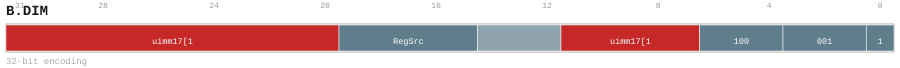
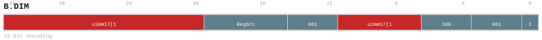

# B.DIM

<div class="insn-header">

<span class="badge-32">32-bit Base</span> **Group:** <a href="../groups/block_argument.md">Block Argument</a> &nbsp;|&nbsp;
<span class="ch-tag ch-tag-04">Ch 04</span>
&nbsp; <strong>Block ISA — Block-structured Control Flow</strong> &nbsp;|&nbsp;
**Length:** <code>32</code> &nbsp;|&nbsp; **Decode:** <code>—</code>

</div>

## Assembly Syntax

- `B.DIM RegSrc, uimm, ->LB2`
- `B.DIM RegSrc, uimm, ->LB0`
- `B.DIM RegSrc, uimm, ->LB1`

## Encoding

<div class="enc-diagram">

<figure id="encoding-b_dim_32_1caa1aa2944a">

<figcaption><code>b_dim_32_1caa1aa2944a</code> — <code>B.DIM RegSrc, uimm, ->LB2</code>. MSB is on the left, LSB is on the right.</figcaption>
</figure>

<figure id="encoding-b_dim_32_27602ab68929">

<figcaption><code>b_dim_32_27602ab68929</code> — <code>B.DIM RegSrc, uimm, ->LB0</code>. MSB is on the left, LSB is on the right.</figcaption>
</figure>

<figure id="encoding-b_dim_32_4191099a5f4d">

<figcaption><code>b_dim_32_4191099a5f4d</code> — <code>B.DIM RegSrc, uimm, ->LB1</code>. MSB is on the left, LSB is on the right.</figcaption>
</figure>

</div>

## Description

Instruction from the Block Argument group.

## Pseudocode (informative)

```c
// Execute B.DIM as defined by the Block Argument semantics.
```

## Encoding Notes

_No additional encoding notes._

## Full Catalog Forms

| Form ID | Assembly | Length | Decode | Encoding |
|---------|----------|--------|--------|----------|
| `b_dim_32_1caa1aa2944a` | `B.DIM RegSrc, uimm, ->LB2` | 32 | — | [SVG](../wavedrom/enc_b_dim_32_1caa1aa2944a.svg) |
| `b_dim_32_27602ab68929` | `B.DIM RegSrc, uimm, ->LB0` | 32 | — | [SVG](../wavedrom/enc_b_dim_32_27602ab68929.svg) |
| `b_dim_32_4191099a5f4d` | `B.DIM RegSrc, uimm, ->LB1` | 32 | — | [SVG](../wavedrom/enc_b_dim_32_4191099a5f4d.svg) |

<div class="insn-nav">

← [Block Argument](../groups/block_argument.md) &nbsp;&nbsp; [Index](../index.md) &nbsp;&nbsp; [All instructions](index.md) →

</div>
