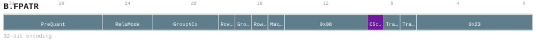

# B.FPATR

<div class="insn-header">

<span class="badge-32">32-bit Base</span> **Group:** <a href="../groups/bundle_fixed_point_postprocess_attribute.md">Bundle Fixed-Point PostProcess Attribute</a> &nbsp;|&nbsp;
<span class="ch-tag ch-tag-17">Ch 17</span>
&nbsp; <strong>CMD — Command and Control</strong> &nbsp;|&nbsp;
**Length:** <code>32</code> &nbsp;|&nbsp; **Decode:** <code>—</code>

</div>

## Assembly Syntax

- `B.FPATR PreQuantMode, ReluMode, GroupNCode, RowMaxEn, GroupMaxEn, RowMaxInit, MaxAbsEn`

## Encoding

<div class="enc-diagram">

<figure>

<figcaption>Bitfield encoding diagram. MSB is on the left, LSB on the right.</figcaption>
</figure>

</div>

## Description

Latches complete-bundle matrix post-processing mode, reduction enables, and fixed-point descriptor controls.

## Pseudocode (informative)

```c
// Execute B.FPATR as defined by the Bundle Fixed-Point PostProcess Attribute semantics.
```

## Encoding Notes

- `Latches complete-bundle matrix post-processing mode, reduction enables, and fixed-point descriptor controls.`

## Full Catalog Forms

| Assembly | Length | Decode |
|----------|--------|--------|
| `B.FPATR PreQuantMode, ReluMode, GroupNCode, RowMaxEn, GroupMaxEn, RowMaxInit, MaxAbsEn` | 32 | — |

<div class="insn-nav">

← [Bundle Fixed-Point PostProcess Attribute](../groups/bundle_fixed_point_postprocess_attribute.md) &nbsp;&nbsp; [Index](../index.md) &nbsp;&nbsp; [All instructions](index.md) →

</div>
