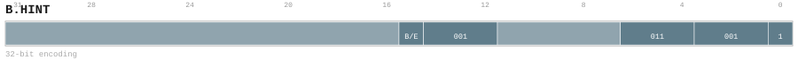

# B.HINT

<div class="insn-header">

<span class="badge-32">32-bit Base</span> **Group:** <a href="../groups/block_hint.md">Block Hint</a> &nbsp;|&nbsp;
<span class="ch-tag ch-tag-17">Ch 17</span>
&nbsp; <strong>CMD — Command and Control</strong> &nbsp;|&nbsp;
**Length:** <code>32</code> &nbsp;|&nbsp; **Decode:** <code>—</code>

</div>

## Assembly Syntax

- `B.HINT {BR.{likely, unlikely}, TEMP.{hot, warm, cool, none}, PRFSIZE}`
- `B.HINT TRACE.{begin, end}`

## Encoding

<div class="enc-diagram">

<figure id="encoding-b_hint_32_69d942ff1583">

<figcaption><code>b_hint_32_69d942ff1583</code> — <code>B.HINT {BR.{likely, unlikely}, TEMP.{hot, warm, cool, none}, PRFSIZE}</code>. MSB is on the left, LSB is on the right.</figcaption>
</figure>

<figure id="encoding-b_hint_32_f7d01d734925">

<figcaption><code>b_hint_32_f7d01d734925</code> — <code>B.HINT TRACE.{begin, end}</code>. MSB is on the left, LSB is on the right.</figcaption>
</figure>

</div>

## Description

Instruction from the Block Hint group.

## Pseudocode (informative)

```c
// Execute B.HINT as defined by the Block Hint semantics.
```

## Encoding Notes

- `Bits 31:16 are reserved zero.`

## Full Catalog Forms

| Form ID | Assembly | Length | Decode | Encoding |
|---------|----------|--------|--------|----------|
| `b_hint_32_69d942ff1583` | `B.HINT {BR.{likely, unlikely}, TEMP.{hot, warm, cool, none}, PRFSIZE}` | 32 | — | [SVG](../wavedrom/enc_b_hint_32_69d942ff1583.svg) |
| `b_hint_32_f7d01d734925` | `B.HINT TRACE.{begin, end}` | 32 | — | [SVG](../wavedrom/enc_b_hint_32_f7d01d734925.svg) |

<div class="insn-nav">

← [Block Hint](../groups/block_hint.md) &nbsp;&nbsp; [Index](../index.md) &nbsp;&nbsp; [All instructions](index.md) →

</div>
