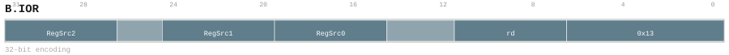

# B.IOR

<div class="insn-header">

<span class="badge-32">32-bit Base</span> **Group:** <a href="../groups/bundle_input_output.md">Bundle Input & Output</a> &nbsp;|&nbsp;
<span class="ch-tag ch-tag-04">Ch 04</span>
&nbsp; <strong>Block ISA — Block-structured Control Flow</strong> &nbsp;|&nbsp;
**Length:** <code>32</code> &nbsp;|&nbsp; **Decode:** <code>—</code>

</div>

## Assembly Syntax

- `B.IOR [<gpr>[, <gpr>[, <gpr>]]][, -><gpr>]`

## Encoding

<div class="enc-diagram">

<figure>

<figcaption>Bitfield encoding diagram. MSB is on the left, LSB on the right.</figcaption>
</figure>

</div>

## Description

Bind up to three absolute GPR inputs and one absolute GPR output; TLOAD/TSTORE use source zero as GM base and source one as logical row stride.

## Pseudocode (informative)

```c
// Execute B.IOR as defined by the Bundle Input & Output semantics.
```

## Encoding Notes

- `Bind up to three absolute GPR inputs and one absolute GPR output; TLOAD/TSTORE use source zero as GM base and source one as logical row stride.`

## Full Catalog Forms

| Assembly | Length | Decode |
|----------|--------|--------|
| `B.IOR [<gpr>[, <gpr>[, <gpr>]]][, -><gpr>]` | 32 | — |

<div class="insn-nav">

← [Bundle Input & Output](../groups/bundle_input_output.md) &nbsp;&nbsp; [Index](../index.md) &nbsp;&nbsp; [All instructions](index.md) →

</div>
