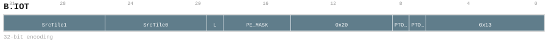
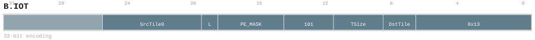
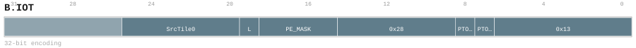

# B.IOT

<div class="insn-header">

<span class="badge-32">32-bit Base</span> **Group:** <a href="../groups/bundle_input_output.md">Bundle Input & Output</a> &nbsp;|&nbsp;
<span class="ch-tag ch-tag-00">Ch 00</span>
&nbsp; <strong>ISA Manual</strong> &nbsp;|&nbsp;
**Length:** <code>32</code> &nbsp;|&nbsp; **Decode:** <code>—</code>

</div>

## Assembly Syntax

- `B.IOT SrcTile0, SrcTile1, mask=PE_MASK, <last>`
- `B.IOT mask=PE_MASK, <last> <, ->DstTile<TSize>>`
- `B.IOT SrcTile0, mask=PE_MASK, <last>, ->DstTile<TSize>`
- `B.IOT SrcTile0, SrcTile1, mask=PE_MASK, <last>, ->DstTile<TSize>`
- `B.IOT SrcTile0, mask=PE_MASK, <last>`

## Encoding

<div class="enc-diagram">

<figure id="encoding-b_iot_32_36792782e584">

<figcaption><code>b_iot_32_36792782e584</code> — <code>B.IOT SrcTile0, SrcTile1, mask=PE_MASK, <last></code>. MSB is on the left, LSB is on the right.</figcaption>
</figure>

<figure id="encoding-b_iot_32_3a493c45ddfa">

<figcaption><code>b_iot_32_3a493c45ddfa</code> — <code>B.IOT mask=PE_MASK, <last> <, ->DstTile<TSize>></code>. MSB is on the left, LSB is on the right.</figcaption>
</figure>

<figure id="encoding-b_iot_32_437af312f86d">

<figcaption><code>b_iot_32_437af312f86d</code> — <code>B.IOT SrcTile0, mask=PE_MASK, <last>, ->DstTile<TSize></code>. MSB is on the left, LSB is on the right.</figcaption>
</figure>

<figure id="encoding-b_iot_32_84944b9c3d19">

<figcaption><code>b_iot_32_84944b9c3d19</code> — <code>B.IOT SrcTile0, SrcTile1, mask=PE_MASK, <last>, ->DstTile<TSize></code>. MSB is on the left, LSB is on the right.</figcaption>
</figure>

<figure id="encoding-b_iot_32_f17390877416">

<figcaption><code>b_iot_32_f17390877416</code> — <code>B.IOT SrcTile0, mask=PE_MASK, <last></code>. MSB is on the left, LSB is on the right.</figcaption>
</figure>

</div>

## Description

Instruction from the Bundle Input & Output group.

## Pseudocode (informative)

```c
// Execute B.IOT as defined by the Bundle Input & Output semantics.
```

## Encoding Notes

- `Binds v5 PE_MASK, ordered Local tile sources, last-use, and optional TSize/2-bit Local destination metadata; reuse bits do not exist.`
- `Binds v5 PE_MASK, ordered Local tile sources, last-use, and optional TSize/2-bit Local destination metadata; TSize=DstTile=0 is the mask-only Shared TLOAD/TSTORE companion and PE_MASK=0000 is a legal no-op.`

## Full Catalog Forms

| Form ID | Assembly | Length | Decode | Encoding |
|---------|----------|--------|--------|----------|
| `b_iot_32_36792782e584` | `B.IOT SrcTile0, SrcTile1, mask=PE_MASK, <last>` | 32 | — | [SVG](../wavedrom/enc_b_iot_32_36792782e584.svg) |
| `b_iot_32_3a493c45ddfa` | `B.IOT mask=PE_MASK, <last> <, ->DstTile<TSize>>` | 32 | — | [SVG](../wavedrom/enc_b_iot_32_3a493c45ddfa.svg) |
| `b_iot_32_437af312f86d` | `B.IOT SrcTile0, mask=PE_MASK, <last>, ->DstTile<TSize>` | 32 | — | [SVG](../wavedrom/enc_b_iot_32_437af312f86d.svg) |
| `b_iot_32_84944b9c3d19` | `B.IOT SrcTile0, SrcTile1, mask=PE_MASK, <last>, ->DstTile<TSize>` | 32 | — | [SVG](../wavedrom/enc_b_iot_32_84944b9c3d19.svg) |
| `b_iot_32_f17390877416` | `B.IOT SrcTile0, mask=PE_MASK, <last>` | 32 | — | [SVG](../wavedrom/enc_b_iot_32_f17390877416.svg) |

<div class="insn-nav">

← [Bundle Input & Output](../groups/bundle_input_output.md) &nbsp;&nbsp; [Index](../index.md) &nbsp;&nbsp; [All instructions](index.md) →

</div>
