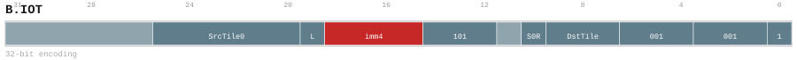
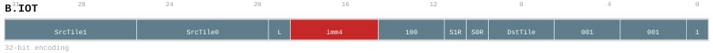
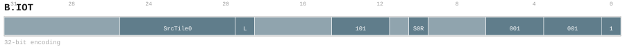
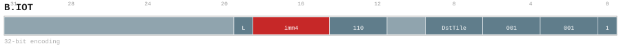
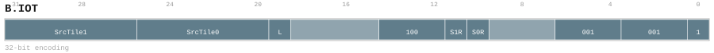

# B.IOT

<div class="insn-header">

<span class="badge-32">32-bit Base</span> **Group:** <a href="../groups/block_input_output.md">Block Input & Output</a> &nbsp;|&nbsp;
<span class="ch-tag ch-tag-04">Ch 04</span>
&nbsp; <strong>Block ISA — Block-structured Control Flow</strong> &nbsp;|&nbsp;
**Length:** <code>32</code> &nbsp;|&nbsp; **Decode:** <code>—</code>

</div>

## Assembly Syntax

- `B.IOT SrcTile0<.reuse>, <last>, ->DstTile<Size>`
- `B.IOT SrcTile0<.reuse>, SrcTile1<.reuse>, <last>, ->DstTile<Size>`
- `B.IOT SrcTile0<.reuse>, <last>`
- `B.IOT <last>, ->DstTile<Size>`
- `B.IOT SrcTile0<.reuse>, SrcTile1<.reuse>, <last>`

## Encoding

<div class="enc-diagram">

<figure id="encoding-b_iot_32_0f23e46d6176">

<figcaption><code>b_iot_32_0f23e46d6176</code> — <code>B.IOT SrcTile0<.reuse>, <last>, ->DstTile<Size></code>. MSB is on the left, LSB is on the right.</figcaption>
</figure>

<figure id="encoding-b_iot_32_3a6945dec034">

<figcaption><code>b_iot_32_3a6945dec034</code> — <code>B.IOT SrcTile0<.reuse>, SrcTile1<.reuse>, <last>, ->DstTile<Size></code>. MSB is on the left, LSB is on the right.</figcaption>
</figure>

<figure id="encoding-b_iot_32_778f84340400">

<figcaption><code>b_iot_32_778f84340400</code> — <code>B.IOT SrcTile0<.reuse>, <last></code>. MSB is on the left, LSB is on the right.</figcaption>
</figure>

<figure id="encoding-b_iot_32_a06b9b6c1965">

<figcaption><code>b_iot_32_a06b9b6c1965</code> — <code>B.IOT <last>, ->DstTile<Size></code>. MSB is on the left, LSB is on the right.</figcaption>
</figure>

<figure id="encoding-b_iot_32_f1ca66bbcce1">

<figcaption><code>b_iot_32_f1ca66bbcce1</code> — <code>B.IOT SrcTile0<.reuse>, SrcTile1<.reuse>, <last></code>. MSB is on the left, LSB is on the right.</figcaption>
</figure>

</div>

## Description

Instruction from the Block Input & Output group.

## Pseudocode (informative)

```c
// Execute B.IOT as defined by the Block Input & Output semantics.
```

## Encoding Notes

- `PTO ISA 0.57.1 one-source descriptor. Inactive source and reuse fields encode zero.`
- `PTO ISA 0.57.1 two-source descriptor. imm4 3..9 selects 128B..8KiB; ACC is never encoded as DstTile.`
- `PTO ISA 0.57.1 one-source destination-free descriptor. All inapplicable fields encode zero.`
- `PTO ISA 0.57.1 zero-source destination descriptor. Inactive source and reuse fields encode zero.`
- `PTO ISA 0.57.1 two-source destination-free descriptor. DstTile and imm4 encode zero; zero does not name an output.`

## Full Catalog Forms

| Form ID | Assembly | Length | Decode | Encoding |
|---------|----------|--------|--------|----------|
| `b_iot_32_0f23e46d6176` | `B.IOT SrcTile0<.reuse>, <last>, ->DstTile<Size>` | 32 | — | [SVG](../wavedrom/enc_b_iot_32_0f23e46d6176.svg) |
| `b_iot_32_3a6945dec034` | `B.IOT SrcTile0<.reuse>, SrcTile1<.reuse>, <last>, ->DstTile<Size>` | 32 | — | [SVG](../wavedrom/enc_b_iot_32_3a6945dec034.svg) |
| `b_iot_32_778f84340400` | `B.IOT SrcTile0<.reuse>, <last>` | 32 | — | [SVG](../wavedrom/enc_b_iot_32_778f84340400.svg) |
| `b_iot_32_a06b9b6c1965` | `B.IOT <last>, ->DstTile<Size>` | 32 | — | [SVG](../wavedrom/enc_b_iot_32_a06b9b6c1965.svg) |
| `b_iot_32_f1ca66bbcce1` | `B.IOT SrcTile0<.reuse>, SrcTile1<.reuse>, <last>` | 32 | — | [SVG](../wavedrom/enc_b_iot_32_f1ca66bbcce1.svg) |

<div class="insn-nav">

← [Block Input & Output](../groups/block_input_output.md) &nbsp;&nbsp; [Index](../index.md) &nbsp;&nbsp; [All instructions](index.md) →

</div>
