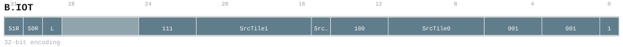
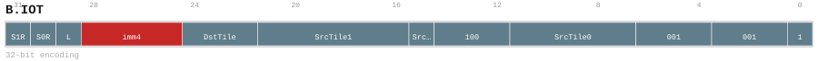
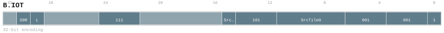
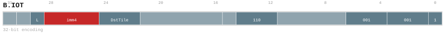

# B.IOT

<div class="insn-header">

<span class="badge-32">32-bit Base</span> **Group:** <a href="../groups/block_input_output.md">Block Input & Output</a> &nbsp;|&nbsp;
<span class="ch-tag ch-tag-04">Ch 04</span>
&nbsp; <strong>Block ISA — Block-structured Control Flow</strong> &nbsp;|&nbsp;
**Length:** <code>32</code> &nbsp;|&nbsp; **Decode:** <code>—</code>

</div>

## Assembly Syntax

- `B.IOT SrcTile0<.reuse>, <last>, ->DstTile<Size>`
- `B.IOT SrcTile0<.reuse>, SrcTile1<.reuse>, <last>`
- `B.IOT SrcTile0<.reuse>, SrcTile1<.reuse>, <last>, ->DstTile<Size>`
- `B.IOT SrcTile0<.reuse>, <last>`
- `B.IOT <last>, ->DstTile<Size>`

## Encoding

<div class="enc-diagram">

<figure id="encoding-b_iot_32_10db6db84f5d">

<figcaption><code>b_iot_32_10db6db84f5d</code> — <code>B.IOT SrcTile0<.reuse>, <last>, ->DstTile<Size></code>. MSB is on the left, LSB is on the right.</figcaption>
</figure>

<figure id="encoding-b_iot_32_2c07e7177fad">

<figcaption><code>b_iot_32_2c07e7177fad</code> — <code>B.IOT SrcTile0<.reuse>, SrcTile1<.reuse>, <last></code>. MSB is on the left, LSB is on the right.</figcaption>
</figure>

<figure id="encoding-b_iot_32_8b8bce6bffe8">

<figcaption><code>b_iot_32_8b8bce6bffe8</code> — <code>B.IOT SrcTile0<.reuse>, SrcTile1<.reuse>, <last>, ->DstTile<Size></code>. MSB is on the left, LSB is on the right.</figcaption>
</figure>

<figure id="encoding-b_iot_32_c11eb189dd83">

<figcaption><code>b_iot_32_c11eb189dd83</code> — <code>B.IOT SrcTile0<.reuse>, <last></code>. MSB is on the left, LSB is on the right.</figcaption>
</figure>

<figure id="encoding-b_iot_32_efa0fe3fe49a">

<figcaption><code>b_iot_32_efa0fe3fe49a</code> — <code>B.IOT <last>, ->DstTile<Size></code>. MSB is on the left, LSB is on the right.</figcaption>
</figure>

</div>

## Description

Instruction from the Block Input & Output group.

## Pseudocode (informative)

```c
// Execute B.IOT as defined by the Block Input & Output semantics.
```

## Encoding Notes

- `canonical one-input immediate-size tile descriptor; function=101 means only SrcTile0 is valid. v0.57 excludes DstTile=111 from this destination-producing form.`
- `v0.57 two-input source-only tile descriptor required by multi-descriptor PTO expansions. DstTile=111 denotes no output and the unused size field is canonically zero.`
- `canonical two-input immediate-size tile descriptor. SrcTile0/1 are independent 6-bit fields; imm4 encodes 0B..512KB. v0.57 excludes DstTile=111 from this destination-producing form.`
- `v0.57 one-input source-only tile descriptor required by multi-descriptor PTO expansions. DstTile=111 denotes no output and the unused size field is canonically zero.`
- `canonical no-input immediate-size tile descriptor; function=110 means only the destination allocation is valid.`

## Full Catalog Forms

| Form ID | Assembly | Length | Decode | Encoding |
|---------|----------|--------|--------|----------|
| `b_iot_32_10db6db84f5d` | `B.IOT SrcTile0<.reuse>, <last>, ->DstTile<Size>` | 32 | — | [SVG](../wavedrom/enc_b_iot_32_10db6db84f5d.svg) |
| `b_iot_32_2c07e7177fad` | `B.IOT SrcTile0<.reuse>, SrcTile1<.reuse>, <last>` | 32 | — | [SVG](../wavedrom/enc_b_iot_32_2c07e7177fad.svg) |
| `b_iot_32_8b8bce6bffe8` | `B.IOT SrcTile0<.reuse>, SrcTile1<.reuse>, <last>, ->DstTile<Size>` | 32 | — | [SVG](../wavedrom/enc_b_iot_32_8b8bce6bffe8.svg) |
| `b_iot_32_c11eb189dd83` | `B.IOT SrcTile0<.reuse>, <last>` | 32 | — | [SVG](../wavedrom/enc_b_iot_32_c11eb189dd83.svg) |
| `b_iot_32_efa0fe3fe49a` | `B.IOT <last>, ->DstTile<Size>` | 32 | — | [SVG](../wavedrom/enc_b_iot_32_efa0fe3fe49a.svg) |

<div class="insn-nav">

← [Block Input & Output](../groups/block_input_output.md) &nbsp;&nbsp; [Index](../index.md) &nbsp;&nbsp; [All instructions](index.md) →

</div>
