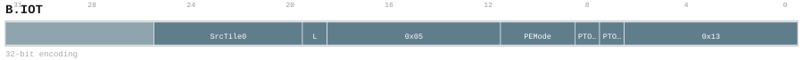

# B.IOT

<div class="insn-header">

<span class="badge-32">32-bit Base</span> **Group:** <a href="../groups/bundle_input_output.md">Bundle Input & Output</a> &nbsp;|&nbsp;
<span class="ch-tag ch-tag-04">Ch 04</span>
&nbsp; <strong>Block ISA — Block-structured Control Flow</strong> &nbsp;|&nbsp;
**Length:** <code>32</code> &nbsp;|&nbsp; **Decode:** <code>—</code>

</div>

## Assembly Syntax

- `B.IOT SrcTile0, mask=PE_MASK, <last>`
- `B.IOT SrcTile0, mask=PE_MASK, <last>, ->DstTile<SizeCode>`
- `B.IOT SrcTile0, SrcTile1, mask=PE_MASK, <last>`
- `B.IOT mask=PE_MASK, <last>, ->DstTile<SizeCode>`
- `B.IOT SrcTile0, SrcTile1, mask=PE_MASK, <last>, ->DstTile<SizeCode>`

## Encoding

<div class="enc-diagram">

<figure id="encoding-b_iot_32_21bee57b65c0">

<figcaption><code>b_iot_32_21bee57b65c0</code> — <code>B.IOT SrcTile0, mask=PE_MASK, <last></code>. MSB is on the left, LSB is on the right.</figcaption>
</figure>

<figure id="encoding-b_iot_32_3bc48b48fea2">

<figcaption><code>b_iot_32_3bc48b48fea2</code> — <code>B.IOT SrcTile0, mask=PE_MASK, <last>, ->DstTile<SizeCode></code>. MSB is on the left, LSB is on the right.</figcaption>
</figure>

<figure id="encoding-b_iot_32_53c1ffc02364">

<figcaption><code>b_iot_32_53c1ffc02364</code> — <code>B.IOT SrcTile0, SrcTile1, mask=PE_MASK, <last></code>. MSB is on the left, LSB is on the right.</figcaption>
</figure>

<figure id="encoding-b_iot_32_7d0899202df1">

<figcaption><code>b_iot_32_7d0899202df1</code> — <code>B.IOT mask=PE_MASK, <last>, ->DstTile<SizeCode></code>. MSB is on the left, LSB is on the right.</figcaption>
</figure>

<figure id="encoding-b_iot_32_cd6ec8181a49">

<figcaption><code>b_iot_32_cd6ec8181a49</code> — <code>B.IOT SrcTile0, SrcTile1, mask=PE_MASK, <last>, ->DstTile<SizeCode></code>. MSB is on the left, LSB is on the right.</figcaption>
</figure>

</div>

## Description

Binds an ordered Local Tile source/destination sequence with one common four-PE participation mode decoded to a fixed mask; L terminates only that sequence and never releases a source.

## Pseudocode (informative)

```c
// Execute B.IOT as defined by the Bundle Input & Output semantics.
```

## Encoding Notes

- `Binds an ordered Local Tile source/destination sequence with one common four-PE participation mode decoded to a fixed mask; L terminates only that sequence and never releases a source.`

## Full Catalog Forms

| Form ID | Assembly | Length | Decode | Encoding |
|---------|----------|--------|--------|----------|
| `b_iot_32_21bee57b65c0` | `B.IOT SrcTile0, mask=PE_MASK, <last>` | 32 | — | [SVG](../wavedrom/enc_b_iot_32_21bee57b65c0.svg) |
| `b_iot_32_3bc48b48fea2` | `B.IOT SrcTile0, mask=PE_MASK, <last>, ->DstTile<SizeCode>` | 32 | — | [SVG](../wavedrom/enc_b_iot_32_3bc48b48fea2.svg) |
| `b_iot_32_53c1ffc02364` | `B.IOT SrcTile0, SrcTile1, mask=PE_MASK, <last>` | 32 | — | [SVG](../wavedrom/enc_b_iot_32_53c1ffc02364.svg) |
| `b_iot_32_7d0899202df1` | `B.IOT mask=PE_MASK, <last>, ->DstTile<SizeCode>` | 32 | — | [SVG](../wavedrom/enc_b_iot_32_7d0899202df1.svg) |
| `b_iot_32_cd6ec8181a49` | `B.IOT SrcTile0, SrcTile1, mask=PE_MASK, <last>, ->DstTile<SizeCode>` | 32 | — | [SVG](../wavedrom/enc_b_iot_32_cd6ec8181a49.svg) |

<div class="insn-nav">

← [Bundle Input & Output](../groups/bundle_input_output.md) &nbsp;&nbsp; [Index](../index.md) &nbsp;&nbsp; [All instructions](index.md) →

</div>
