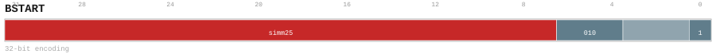

# BSTART

<div class="insn-header">

<span class="badge-32">32-bit Base</span> **Group:** <a href="../groups/block_split.md">Block Split</a> &nbsp;|&nbsp;
<span class="ch-tag ch-tag-04">Ch 04</span>
&nbsp; <strong>Block ISA — Block-structured Control Flow</strong> &nbsp;|&nbsp;
**Length:** <code>32</code> &nbsp;|&nbsp; **Decode:** <code>—</code>

</div>

## Assembly Syntax

- `BSTART {DIRECT, CALL}, <label>`
- `BSTART COND, <label>`

## Encoding

<div class="enc-diagram">

<figure id="encoding-bstart_32_7eb93b649748">

<figcaption><code>bstart_32_7eb93b649748</code> — <code>BSTART {DIRECT, CALL}, <label></code>. MSB is on the left, LSB is on the right.</figcaption>
</figure>

<figure id="encoding-bstart_32_e11e678a32ac">

<figcaption><code>bstart_32_e11e678a32ac</code> — <code>BSTART COND, <label></code>. MSB is on the left, LSB is on the right.</figcaption>
</figure>

</div>

## Description

Block split marker. Terminates the current basic block and begins the next. Encodes block type and transition kind.

## Pseudocode (informative)

```c
EndBlock(); BeginNextBlock(/* kind */);
```

## Encoding Notes

_No additional encoding notes._

## Full Catalog Forms

| Form ID | Assembly | Length | Decode | Encoding |
|---------|----------|--------|--------|----------|
| `bstart_32_7eb93b649748` | `BSTART {DIRECT, CALL}, <label>` | 32 | — | [SVG](../wavedrom/enc_bstart_32_7eb93b649748.svg) |
| `bstart_32_e11e678a32ac` | `BSTART COND, <label>` | 32 | — | [SVG](../wavedrom/enc_bstart_32_e11e678a32ac.svg) |

<div class="insn-nav">

← [Block Split](../groups/block_split.md) &nbsp;&nbsp; [Index](../index.md) &nbsp;&nbsp; [All instructions](index.md) →

</div>
