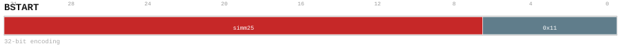

# BSTART

<div class="insn-header">

<span class="badge-32">32-bit Base</span> **Group:** <a href="../groups/bundle_split.md">Bundle Split</a> &nbsp;|&nbsp;
<span class="ch-tag ch-tag-04">Ch 04</span>
&nbsp; <strong>Block ISA — Block-structured Control Flow</strong> &nbsp;|&nbsp;
**Length:** <code>32</code> &nbsp;|&nbsp; **Decode:** <code>—</code>

</div>

## Assembly Syntax

- `BSTART DIRECT, <label>`
- `BSTART COND, <label>`

## Encoding

<div class="enc-diagram">

<figure id="encoding-bstart_32_416bc417fc20">

<figcaption><code>bstart_32_416bc417fc20</code> — <code>BSTART DIRECT, <label></code>. MSB is on the left, LSB is on the right.</figcaption>
</figure>

<figure id="encoding-bstart_32_7e66993d15d0">

<figcaption><code>bstart_32_7e66993d15d0</code> — <code>BSTART COND, <label></code>. MSB is on the left, LSB is on the right.</figcaption>
</figure>

</div>

## Description

Block split marker. Terminates the current basic block and begins the next. Encodes block type and transition kind.

## Pseudocode (informative)

```c
EndBlock(); BeginNextBlock(/* kind */);
```

## Encoding Notes

- `Initializes the single BARG continuation record after any retiring block commits successfully.`

## Full Catalog Forms

| Form ID | Assembly | Length | Decode | Encoding |
|---------|----------|--------|--------|----------|
| `bstart_32_416bc417fc20` | `BSTART DIRECT, <label>` | 32 | — | [SVG](../wavedrom/enc_bstart_32_416bc417fc20.svg) |
| `bstart_32_7e66993d15d0` | `BSTART COND, <label>` | 32 | — | [SVG](../wavedrom/enc_bstart_32_7e66993d15d0.svg) |

<div class="insn-nav">

← [Bundle Split](../groups/bundle_split.md) &nbsp;&nbsp; [Index](../index.md) &nbsp;&nbsp; [All instructions](index.md) →

</div>
