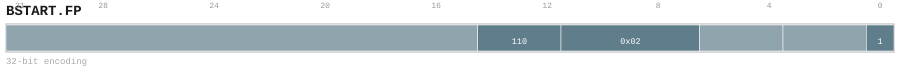
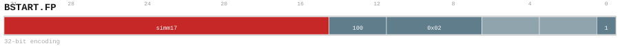

# BSTART.FP

<div class="insn-header">

<span class="badge-32">32-bit Base</span> **Group:** <a href="../groups/block_split.md">Block Split</a> &nbsp;|&nbsp;
<span class="ch-tag ch-tag-04">Ch 04</span>
&nbsp; <strong>Block ISA — Block-structured Control Flow</strong> &nbsp;|&nbsp;
**Length:** <code>32</code> &nbsp;|&nbsp; **Decode:** <code>—</code>

</div>

## Assembly Syntax

- `BSTART.FP RET`
- `BSTART.FP ICALL`
- `BSTART.FP COND, <label>`
- `BSTART.FP IND`
- `BSTART.FP DIRECT, <label>`
- `BSTART.FP CALL, <label>`
- `BSTART.FP FALL<, fixup_label>`

## Encoding

<div class="enc-diagram">

<figure id="encoding-bstart_fp_32_0c671a644214">

<figcaption><code>bstart_fp_32_0c671a644214</code> — <code>BSTART.FP RET</code>. MSB is on the left, LSB is on the right.</figcaption>
</figure>

<figure id="encoding-bstart_fp_32_24db3966d6ba">

<figcaption><code>bstart_fp_32_24db3966d6ba</code> — <code>BSTART.FP ICALL</code>. MSB is on the left, LSB is on the right.</figcaption>
</figure>

<figure id="encoding-bstart_fp_32_58ad7954fb49">

<figcaption><code>bstart_fp_32_58ad7954fb49</code> — <code>BSTART.FP COND, <label></code>. MSB is on the left, LSB is on the right.</figcaption>
</figure>

<figure id="encoding-bstart_fp_32_7978795a29a1">

<figcaption><code>bstart_fp_32_7978795a29a1</code> — <code>BSTART.FP IND</code>. MSB is on the left, LSB is on the right.</figcaption>
</figure>

<figure id="encoding-bstart_fp_32_d00a708a81f0">

<figcaption><code>bstart_fp_32_d00a708a81f0</code> — <code>BSTART.FP DIRECT, <label></code>. MSB is on the left, LSB is on the right.</figcaption>
</figure>

<figure id="encoding-bstart_fp_32_dd7bc8dd694c">

<figcaption><code>bstart_fp_32_dd7bc8dd694c</code> — <code>BSTART.FP CALL, <label></code>. MSB is on the left, LSB is on the right.</figcaption>
</figure>

<figure id="encoding-bstart_fp_32_face4f238d84">

<figcaption><code>bstart_fp_32_face4f238d84</code> — <code>BSTART.FP FALL<, fixup_label></code>. MSB is on the left, LSB is on the right.</figcaption>
</figure>

</div>

## Description

Terminates the current block and begins the next.

## Pseudocode (informative)

```c
EndBlock(); BeginNextBlock(/* kind */);
```

## Encoding Notes

- `Bits 31:15 are reserved zero.`

## Full Catalog Forms

| Form ID | Assembly | Length | Decode | Encoding |
|---------|----------|--------|--------|----------|
| `bstart_fp_32_0c671a644214` | `BSTART.FP RET` | 32 | — | [SVG](../wavedrom/enc_bstart_fp_32_0c671a644214.svg) |
| `bstart_fp_32_24db3966d6ba` | `BSTART.FP ICALL` | 32 | — | [SVG](../wavedrom/enc_bstart_fp_32_24db3966d6ba.svg) |
| `bstart_fp_32_58ad7954fb49` | `BSTART.FP COND, <label>` | 32 | — | [SVG](../wavedrom/enc_bstart_fp_32_58ad7954fb49.svg) |
| `bstart_fp_32_7978795a29a1` | `BSTART.FP IND` | 32 | — | [SVG](../wavedrom/enc_bstart_fp_32_7978795a29a1.svg) |
| `bstart_fp_32_d00a708a81f0` | `BSTART.FP DIRECT, <label>` | 32 | — | [SVG](../wavedrom/enc_bstart_fp_32_d00a708a81f0.svg) |
| `bstart_fp_32_dd7bc8dd694c` | `BSTART.FP CALL, <label>` | 32 | — | [SVG](../wavedrom/enc_bstart_fp_32_dd7bc8dd694c.svg) |
| `bstart_fp_32_face4f238d84` | `BSTART.FP FALL<, fixup_label>` | 32 | — | [SVG](../wavedrom/enc_bstart_fp_32_face4f238d84.svg) |

<div class="insn-nav">

← [Block Split](../groups/block_split.md) &nbsp;&nbsp; [Index](../index.md) &nbsp;&nbsp; [All instructions](index.md) →

</div>
