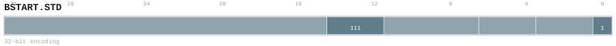
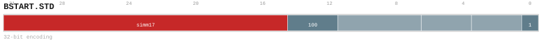

# BSTART.STD

<div class="insn-header">

<span class="badge-32">32-bit Base</span> **Group:** <a href="../groups/block_split.md">Block Split</a> &nbsp;|&nbsp;
<span class="ch-tag ch-tag-04">Ch 04</span>
&nbsp; <strong>Block ISA — Block-structured Control Flow</strong> &nbsp;|&nbsp;
**Length:** <code>32</code> &nbsp;|&nbsp; **Decode:** <code>—</code>

</div>

## Assembly Syntax

- `BSTART.STD COND, <label>`
- `BSTART.STD ICALL`
- `BSTART.STD FALL<, fixup_label>`
- `BSTART.STD RET`
- `BSTART.STD IND`
- `BSTART.STD CALL, <label>`
- `BSTART.STD DIRECT, <label>`

## Encoding

<div class="enc-diagram">

<figure id="encoding-bstart_std_32_1ef99c4cedcb">

<figcaption><code>bstart_std_32_1ef99c4cedcb</code> — <code>BSTART.STD COND, <label></code>. MSB is on the left, LSB is on the right.</figcaption>
</figure>

<figure id="encoding-bstart_std_32_3f6980d013f7">

<figcaption><code>bstart_std_32_3f6980d013f7</code> — <code>BSTART.STD ICALL</code>. MSB is on the left, LSB is on the right.</figcaption>
</figure>

<figure id="encoding-bstart_std_32_441ad677fffe">

<figcaption><code>bstart_std_32_441ad677fffe</code> — <code>BSTART.STD FALL<, fixup_label></code>. MSB is on the left, LSB is on the right.</figcaption>
</figure>

<figure id="encoding-bstart_std_32_816dfa76cc4a">

<figcaption><code>bstart_std_32_816dfa76cc4a</code> — <code>BSTART.STD RET</code>. MSB is on the left, LSB is on the right.</figcaption>
</figure>

<figure id="encoding-bstart_std_32_986b7ee2cf6a">

<figcaption><code>bstart_std_32_986b7ee2cf6a</code> — <code>BSTART.STD IND</code>. MSB is on the left, LSB is on the right.</figcaption>
</figure>

<figure id="encoding-bstart_std_32_b05390d367cf">

<figcaption><code>bstart_std_32_b05390d367cf</code> — <code>BSTART.STD CALL, <label></code>. MSB is on the left, LSB is on the right.</figcaption>
</figure>

<figure id="encoding-bstart_std_32_c1de85e06878">

<figcaption><code>bstart_std_32_c1de85e06878</code> — <code>BSTART.STD DIRECT, <label></code>. MSB is on the left, LSB is on the right.</figcaption>
</figure>

</div>

## Description

Terminates the current block and begins the next.

## Pseudocode (informative)

```c
EndBlock(); BeginNextBlock(/* kind */);
```

## Encoding Notes

- `Bits 31:15 are reserved zero.`

## Full Catalog Forms

| Form ID | Assembly | Length | Decode | Encoding |
|---------|----------|--------|--------|----------|
| `bstart_std_32_1ef99c4cedcb` | `BSTART.STD COND, <label>` | 32 | — | [SVG](../wavedrom/enc_bstart_std_32_1ef99c4cedcb.svg) |
| `bstart_std_32_3f6980d013f7` | `BSTART.STD ICALL` | 32 | — | [SVG](../wavedrom/enc_bstart_std_32_3f6980d013f7.svg) |
| `bstart_std_32_441ad677fffe` | `BSTART.STD FALL<, fixup_label>` | 32 | — | [SVG](../wavedrom/enc_bstart_std_32_441ad677fffe.svg) |
| `bstart_std_32_816dfa76cc4a` | `BSTART.STD RET` | 32 | — | [SVG](../wavedrom/enc_bstart_std_32_816dfa76cc4a.svg) |
| `bstart_std_32_986b7ee2cf6a` | `BSTART.STD IND` | 32 | — | [SVG](../wavedrom/enc_bstart_std_32_986b7ee2cf6a.svg) |
| `bstart_std_32_b05390d367cf` | `BSTART.STD CALL, <label>` | 32 | — | [SVG](../wavedrom/enc_bstart_std_32_b05390d367cf.svg) |
| `bstart_std_32_c1de85e06878` | `BSTART.STD DIRECT, <label>` | 32 | — | [SVG](../wavedrom/enc_bstart_std_32_c1de85e06878.svg) |

<div class="insn-nav">

← [Block Split](../groups/block_split.md) &nbsp;&nbsp; [Index](../index.md) &nbsp;&nbsp; [All instructions](index.md) →

</div>
