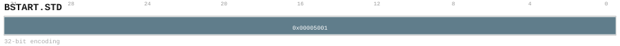

# BSTART.STD

<div class="insn-header">

<span class="badge-32">32-bit Base</span> **Group:** <a href="../groups/bundle_split.md">Bundle Split</a> &nbsp;|&nbsp;
<span class="ch-tag ch-tag-04">Ch 04</span>
&nbsp; <strong>Block ISA — Block-structured Control Flow</strong> &nbsp;|&nbsp;
**Length:** <code>32</code> &nbsp;|&nbsp; **Decode:** <code>—</code>

</div>

## Assembly Syntax

- `BSTART.STD FALL`
- `BSTART.STD IND`
- `BSTART.STD COND, <label>`
- `BSTART.STD RET`
- `BSTART.STD DIRECT, <label>`

## Encoding

<div class="enc-diagram">

<figure id="encoding-bstart_std_32_185f13d8e302">

<figcaption><code>bstart_std_32_185f13d8e302</code> — <code>BSTART.STD FALL</code>. MSB is on the left, LSB is on the right.</figcaption>
</figure>

<figure id="encoding-bstart_std_32_49f2c6a8906f">

<figcaption><code>bstart_std_32_49f2c6a8906f</code> — <code>BSTART.STD IND</code>. MSB is on the left, LSB is on the right.</figcaption>
</figure>

<figure id="encoding-bstart_std_32_696f98ac4bf1">

<figcaption><code>bstart_std_32_696f98ac4bf1</code> — <code>BSTART.STD COND, <label></code>. MSB is on the left, LSB is on the right.</figcaption>
</figure>

<figure id="encoding-bstart_std_32_7876537dce06">

<figcaption><code>bstart_std_32_7876537dce06</code> — <code>BSTART.STD RET</code>. MSB is on the left, LSB is on the right.</figcaption>
</figure>

<figure id="encoding-bstart_std_32_d3733f87964d">

<figcaption><code>bstart_std_32_d3733f87964d</code> — <code>BSTART.STD DIRECT, <label></code>. MSB is on the left, LSB is on the right.</figcaption>
</figure>

</div>

## Description

Terminates the current block and begins the next.

## Pseudocode (informative)

```c
EndBlock(); BeginNextBlock(/* kind */);
```

## Encoding Notes

- `Closes the current bundle, initializes the next bundle descriptor, and selects its transfer and execution kind.`

## Full Catalog Forms

| Form ID | Assembly | Length | Decode | Encoding |
|---------|----------|--------|--------|----------|
| `bstart_std_32_185f13d8e302` | `BSTART.STD FALL` | 32 | — | [SVG](../wavedrom/enc_bstart_std_32_185f13d8e302.svg) |
| `bstart_std_32_49f2c6a8906f` | `BSTART.STD IND` | 32 | — | [SVG](../wavedrom/enc_bstart_std_32_49f2c6a8906f.svg) |
| `bstart_std_32_696f98ac4bf1` | `BSTART.STD COND, <label>` | 32 | — | [SVG](../wavedrom/enc_bstart_std_32_696f98ac4bf1.svg) |
| `bstart_std_32_7876537dce06` | `BSTART.STD RET` | 32 | — | [SVG](../wavedrom/enc_bstart_std_32_7876537dce06.svg) |
| `bstart_std_32_d3733f87964d` | `BSTART.STD DIRECT, <label>` | 32 | — | [SVG](../wavedrom/enc_bstart_std_32_d3733f87964d.svg) |

<div class="insn-nav">

← [Bundle Split](../groups/bundle_split.md) &nbsp;&nbsp; [Index](../index.md) &nbsp;&nbsp; [All instructions](index.md) →

</div>
