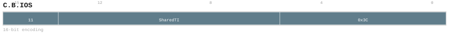

# C.B.IOS

<div class="insn-header">

<span class="badge-16">16-bit C.</span> **Group:** <a href="../groups/bundle_shared_operand_binding.md">Bundle Shared Operand Binding</a> &nbsp;|&nbsp;
<span class="ch-tag ch-tag-00">Ch 00</span>
&nbsp; <strong>ISA Manual</strong> &nbsp;|&nbsp;
**Length:** <code>16</code> &nbsp;|&nbsp; **Decode:** <code>—</code>

</div>

## Assembly Syntax

- `C.B.IOS S<SharedTID> | C.B.IOS -> S<SharedTID>`

## Encoding

<div class="enc-diagram">

<figure>

<figcaption>Bitfield encoding diagram. MSB is on the left, LSB on the right.</figcaption>
</figure>

</div>

## Description

[16-bit C.] Instruction from the Bundle Shared Operand Binding group.

## Pseudocode (informative)

```c
// Execute C.B.IOS as defined by the Bundle Shared Operand Binding semantics.
```

## Encoding Notes

- `Binds one absolute core-private Shared register S0..S255; source or destination role is derived from the surrounding BSTART schema and the binder is consumed once.`

## Full Catalog Forms

| Assembly | Length | Decode |
|----------|--------|--------|
| `C.B.IOS S<SharedTID> | C.B.IOS -> S<SharedTID>` | 16 | — |

<div class="insn-nav">

← [Bundle Shared Operand Binding](../groups/bundle_shared_operand_binding.md) &nbsp;&nbsp; [Index](../index.md) &nbsp;&nbsp; [All instructions](index.md) →

</div>
