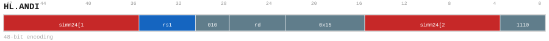

# HL.ANDI

<div class="insn-header">

<span class="badge-48">48-bit HL.</span> **Group:** <a href="../groups/arithmetic_operation_64bit.md">Arithmetic Operation 64bit</a> &nbsp;|&nbsp;
<span class="ch-tag ch-tag-12">Ch 12</span>
&nbsp; <strong>ALU — Arithmetic Logic Unit</strong> &nbsp;|&nbsp;
**Length:** <code>48</code> &nbsp;|&nbsp; **Decode:** <code>—</code>

</div>

## Assembly Syntax

- `hl.andi SrcL, simm, ->{t, u, Rd}`

## Encoding

<div class="enc-diagram">

<figure>

<figcaption>Bitfield encoding diagram. MSB is on the left, LSB on the right.</figcaption>
</figure>

</div>

## Description

HL.ANDI - Compute this mnemonic's binary scalar operation and write the selected destination.

## Pseudocode (informative)

```c
rd = rs1 & SignExtend(imm12);
```

## Encoding Notes

- `HL.ANDI - Compute this mnemonic's binary scalar operation and write the selected destination.`

## Full Catalog Forms

| Assembly | Length | Decode |
|----------|--------|--------|
| `hl.andi SrcL, simm, ->{t, u, Rd}` | 48 | — |

<div class="insn-nav">

← [Arithmetic Operation 64bit](../groups/arithmetic_operation_64bit.md) &nbsp;&nbsp; [Index](../index.md) &nbsp;&nbsp; [All instructions](index.md) →

</div>
