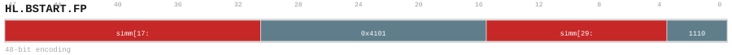

# HL.BSTART.FP

<div class="insn-header">

<span class="badge-48">48-bit HL.</span> **Group:** <a href="../groups/bstart.md">BSTART</a> &nbsp;|&nbsp;
<span class="ch-tag ch-tag-04">Ch 04</span>
&nbsp; <strong>Block ISA — Block-structured Control Flow</strong> &nbsp;|&nbsp;
**Length:** <code>48</code> &nbsp;|&nbsp; **Decode:** <code>—</code>

</div>

## Assembly Syntax

- `HL.BSTART.FP FALL<, fixup_label>`
- `HL.BSTART.FP CALL, <label>`
- `HL.BSTART.FP DIRECT, <label>`
- `HL.BSTART.FP COND, <label>`

## Encoding

<div class="enc-diagram">

<figure id="encoding-hl_bstart_fp_48_0368fb7424f4">

<figcaption><code>hl_bstart_fp_48_0368fb7424f4</code> — <code>HL.BSTART.FP FALL<, fixup_label></code>. MSB is on the left, LSB is on the right.</figcaption>
</figure>

<figure id="encoding-hl_bstart_fp_48_9955c1f823f6">

<figcaption><code>hl_bstart_fp_48_9955c1f823f6</code> — <code>HL.BSTART.FP CALL, <label></code>. MSB is on the left, LSB is on the right.</figcaption>
</figure>

<figure id="encoding-hl_bstart_fp_48_9a0544563449">

<figcaption><code>hl_bstart_fp_48_9a0544563449</code> — <code>HL.BSTART.FP DIRECT, <label></code>. MSB is on the left, LSB is on the right.</figcaption>
</figure>

<figure id="encoding-hl_bstart_fp_48_f074f1e2c089">

<figcaption><code>hl_bstart_fp_48_f074f1e2c089</code> — <code>HL.BSTART.FP COND, <label></code>. MSB is on the left, LSB is on the right.</figcaption>
</figure>

</div>

## Description

[48-bit HL.] Terminates the current block and begins the next.

## Pseudocode (informative)

```c
EndBlock(); BeginNextBlock(/* kind */);
```

## Encoding Notes

- `Closes the current bundle, initializes the next bundle descriptor, and selects its transfer and execution kind.`

## Full Catalog Forms

| Form ID | Assembly | Length | Decode | Encoding |
|---------|----------|--------|--------|----------|
| `hl_bstart_fp_48_0368fb7424f4` | `HL.BSTART.FP FALL<, fixup_label>` | 48 | — | [SVG](../wavedrom/enc_hl_bstart_fp_48_0368fb7424f4.svg) |
| `hl_bstart_fp_48_9955c1f823f6` | `HL.BSTART.FP CALL, <label>` | 48 | — | [SVG](../wavedrom/enc_hl_bstart_fp_48_9955c1f823f6.svg) |
| `hl_bstart_fp_48_9a0544563449` | `HL.BSTART.FP DIRECT, <label>` | 48 | — | [SVG](../wavedrom/enc_hl_bstart_fp_48_9a0544563449.svg) |
| `hl_bstart_fp_48_f074f1e2c089` | `HL.BSTART.FP COND, <label>` | 48 | — | [SVG](../wavedrom/enc_hl_bstart_fp_48_f074f1e2c089.svg) |

<div class="insn-nav">

← [BSTART](../groups/bstart.md) &nbsp;&nbsp; [Index](../index.md) &nbsp;&nbsp; [All instructions](index.md) →

</div>
