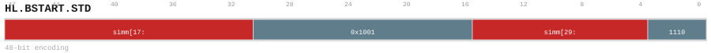

# HL.BSTART.STD

<div class="insn-header">

<span class="badge-48">48-bit HL.</span> **Group:** <a href="../groups/bstart.md">BSTART</a> &nbsp;|&nbsp;
<span class="ch-tag ch-tag-04">Ch 04</span>
&nbsp; <strong>Block ISA — Block-structured Control Flow</strong> &nbsp;|&nbsp;
**Length:** <code>48</code> &nbsp;|&nbsp; **Decode:** <code>—</code>

</div>

## Assembly Syntax

- `HL.BSTART.STD FALL<, fixup_label>`
- `HL.BSTART.STD COND, <label>`
- `HL.BSTART.STD CALL, <label>`
- `HL.BSTART.STD DIRECT, <label>`

## Encoding

<div class="enc-diagram">

<figure id="encoding-hl_bstart_std_48_170d04be4f7e">

<figcaption><code>hl_bstart_std_48_170d04be4f7e</code> — <code>HL.BSTART.STD FALL<, fixup_label></code>. MSB is on the left, LSB is on the right.</figcaption>
</figure>

<figure id="encoding-hl_bstart_std_48_436ff4a95f39">

<figcaption><code>hl_bstart_std_48_436ff4a95f39</code> — <code>HL.BSTART.STD COND, <label></code>. MSB is on the left, LSB is on the right.</figcaption>
</figure>

<figure id="encoding-hl_bstart_std_48_4eff98193028">

<figcaption><code>hl_bstart_std_48_4eff98193028</code> — <code>HL.BSTART.STD CALL, <label></code>. MSB is on the left, LSB is on the right.</figcaption>
</figure>

<figure id="encoding-hl_bstart_std_48_c970f578674f">

<figcaption><code>hl_bstart_std_48_c970f578674f</code> — <code>HL.BSTART.STD DIRECT, <label></code>. MSB is on the left, LSB is on the right.</figcaption>
</figure>

</div>

## Description

[48-bit HL.] Terminates the current block and begins the next.

## Pseudocode (informative)

```c
EndBlock(); BeginNextBlock(/* kind */);
```

## Encoding Notes

- `Closes the current bundle, initializes the next bundle descriptor, and selects its transfer and execution kind.`

## Full Catalog Forms

| Form ID | Assembly | Length | Decode | Encoding |
|---------|----------|--------|--------|----------|
| `hl_bstart_std_48_170d04be4f7e` | `HL.BSTART.STD FALL<, fixup_label>` | 48 | — | [SVG](../wavedrom/enc_hl_bstart_std_48_170d04be4f7e.svg) |
| `hl_bstart_std_48_436ff4a95f39` | `HL.BSTART.STD COND, <label>` | 48 | — | [SVG](../wavedrom/enc_hl_bstart_std_48_436ff4a95f39.svg) |
| `hl_bstart_std_48_4eff98193028` | `HL.BSTART.STD CALL, <label>` | 48 | — | [SVG](../wavedrom/enc_hl_bstart_std_48_4eff98193028.svg) |
| `hl_bstart_std_48_c970f578674f` | `HL.BSTART.STD DIRECT, <label>` | 48 | — | [SVG](../wavedrom/enc_hl_bstart_std_48_c970f578674f.svg) |

<div class="insn-nav">

← [BSTART](../groups/bstart.md) &nbsp;&nbsp; [Index](../index.md) &nbsp;&nbsp; [All instructions](index.md) →

</div>
