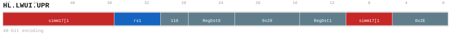

# HL.LWUI.UPR

<div class="insn-header">

<span class="badge-48">48-bit HL.</span> **Group:** <a href="../groups/lda_pre_index.md">LDA/PRE_INDEX</a> &nbsp;|&nbsp;
<span class="ch-tag ch-tag-11">Ch 11</span>
&nbsp; <strong>AGU — Address Generation Unit</strong> &nbsp;|&nbsp;
**Length:** <code>48</code> &nbsp;|&nbsp; **Decode:** <code>—</code>

</div>

## Assembly Syntax

- `hl.lwui.upr [SrcL, simm], ->Dst0, Dst1`

## Encoding

<div class="enc-diagram">

<figure>

<figcaption>Bitfield encoding diagram. MSB is on the left, LSB on the right.</figcaption>
</figure>

</div>

## Description

HL.LWUI.UPR snapshots its scalar sources, forms its encoded address, and loads one aligned little-endian 4-byte value.

## Pseudocode (informative)

```c
// Execute HL.LWUI.UPR as defined by the LDA/PRE_INDEX semantics.
```

## Encoding Notes

- `HL.LWUI.UPR snapshots its scalar sources, forms its encoded address, and loads one aligned little-endian 4-byte value.`

## Full Catalog Forms

| Assembly | Length | Decode |
|----------|--------|--------|
| `hl.lwui.upr [SrcL, simm], ->Dst0, Dst1` | 48 | — |

<div class="insn-nav">

← [LDA/PRE_INDEX](../groups/lda_pre_index.md) &nbsp;&nbsp; [Index](../index.md) &nbsp;&nbsp; [All instructions](index.md) →

</div>
