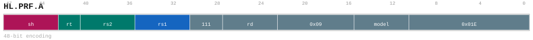

# HL.PRF.A

<div class="insn-header">

<span class="badge-48">48-bit HL.</span> **Group:** <a href="../groups/lda.md">LDA</a> &nbsp;|&nbsp;
<span class="ch-tag ch-tag-11">Ch 11</span>
&nbsp; <strong>AGU — Address Generation Unit</strong> &nbsp;|&nbsp;
**Length:** <code>48</code> &nbsp;|&nbsp; **Decode:** <code>—</code>

</div>

## Assembly Syntax

- `hl.prf.a{.l1,.l2,.l3} [SrcL, SrcR<{.sw,.uw,.neg}><<<shamt>], ->{t, u, Rd}`

## Encoding

<div class="enc-diagram">

<figure>

<figcaption>Bitfield encoding diagram. MSB is on the left, LSB on the right.</figcaption>
</figure>

</div>

## Description

HL.PRF.A snapshots its scalar sources, forms its encoded address, and issues a non-binding 1-byte-granularity prefetch hint and publishes the effective address.

## Pseudocode (informative)

```c
// Execute HL.PRF.A as defined by the LDA semantics.
```

## Encoding Notes

- `HL.PRF.A snapshots its scalar sources, forms its encoded address, and issues a non-binding 1-byte-granularity prefetch hint and publishes the effective address.`

## Full Catalog Forms

| Assembly | Length | Decode |
|----------|--------|--------|
| `hl.prf.a{.l1,.l2,.l3} [SrcL, SrcR<{.sw,.uw,.neg}><<<shamt>], ->{t, u, Rd}` | 48 | — |

<div class="insn-nav">

← [LDA](../groups/lda.md) &nbsp;&nbsp; [Index](../index.md) &nbsp;&nbsp; [All instructions](index.md) →

</div>
