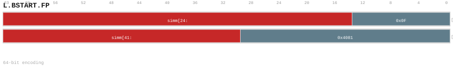

# L.BSTART.FP

<div class="insn-header">

<span class="badge-32">32-bit Base</span> **Group:** <a href="../groups/bstart.md">BSTART</a> &nbsp;|&nbsp;
<span class="ch-tag ch-tag-04">Ch 04</span>
&nbsp; <strong>Block ISA — Block-structured Control Flow</strong> &nbsp;|&nbsp;
**Length:** <code>64</code> &nbsp;|&nbsp; **Decode:** <code>—</code>

</div>

## Assembly Syntax

- `L.BSTART.FP DIRECT, <label>`
- `L.BSTART.FP FALL<, fixup_label>`
- `L.BSTART.FP CALL, <label>`
- `L.BSTART.FP COND, <label>`

## Encoding

<div class="enc-diagram">

<figure id="encoding-l_bstart_fp_64_52a1fd45d908">

<figcaption><code>l_bstart_fp_64_52a1fd45d908</code> — <code>L.BSTART.FP DIRECT, <label></code>. MSB is on the left, LSB is on the right.</figcaption>
</figure>

<figure id="encoding-l_bstart_fp_64_59792b6f0002">

<figcaption><code>l_bstart_fp_64_59792b6f0002</code> — <code>L.BSTART.FP FALL<, fixup_label></code>. MSB is on the left, LSB is on the right.</figcaption>
</figure>

<figure id="encoding-l_bstart_fp_64_9673fedb498b">

<figcaption><code>l_bstart_fp_64_9673fedb498b</code> — <code>L.BSTART.FP CALL, <label></code>. MSB is on the left, LSB is on the right.</figcaption>
</figure>

<figure id="encoding-l_bstart_fp_64_b27a4726298b">

<figcaption><code>l_bstart_fp_64_b27a4726298b</code> — <code>L.BSTART.FP COND, <label></code>. MSB is on the left, LSB is on the right.</figcaption>
</figure>

</div>

## Description

Instruction from the BSTART group.

## Pseudocode (informative)

```c
// Execute L.BSTART.FP as defined by the BSTART semantics.
```

## Encoding Notes

- `Closes the current bundle, initializes the next bundle descriptor, and selects its transfer and execution kind.`
- `Bare L.BSTART.FP CALL preserves ra. A returning call must be preceded by SETRET or C.SETRET with an explicit return label.`

## Full Catalog Forms

| Form ID | Assembly | Length | Decode | Encoding |
|---------|----------|--------|--------|----------|
| `l_bstart_fp_64_52a1fd45d908` | `L.BSTART.FP DIRECT, <label>` | 64 | — | [SVG](../wavedrom/enc_l_bstart_fp_64_52a1fd45d908.svg) |
| `l_bstart_fp_64_59792b6f0002` | `L.BSTART.FP FALL<, fixup_label>` | 64 | — | [SVG](../wavedrom/enc_l_bstart_fp_64_59792b6f0002.svg) |
| `l_bstart_fp_64_9673fedb498b` | `L.BSTART.FP CALL, <label>` | 64 | — | [SVG](../wavedrom/enc_l_bstart_fp_64_9673fedb498b.svg) |
| `l_bstart_fp_64_b27a4726298b` | `L.BSTART.FP COND, <label>` | 64 | — | [SVG](../wavedrom/enc_l_bstart_fp_64_b27a4726298b.svg) |

<div class="insn-nav">

← [BSTART](../groups/bstart.md) &nbsp;&nbsp; [Index](../index.md) &nbsp;&nbsp; [All instructions](index.md) →

</div>
