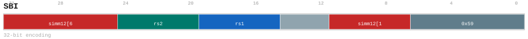

# SBI

<div class="insn-header">

<span class="badge-32">32-bit Base</span> **Group:** <a href="../groups/sta_base_imm.md">STA/BASE_IMM</a> &nbsp;|&nbsp;
<span class="ch-tag ch-tag-11">Ch 11</span>
&nbsp; <strong>AGU — Address Generation Unit</strong> &nbsp;|&nbsp;
**Length:** <code>32</code> &nbsp;|&nbsp; **Decode:** <code>—</code>

</div>

## Assembly Syntax

- `sbi SrcL, [SrcR, simm]`

## Encoding

<div class="enc-diagram">

<figure>

<figcaption>Bitfield encoding diagram. MSB is on the left, LSB on the right.</figcaption>
</figure>

</div>

## Description

SBI snapshots its scalar sources, forms its encoded address, and stores one aligned little-endian 1-byte value.

## Pseudocode (informative)

```c
// Execute SBI as defined by the STA/BASE_IMM semantics.
```

## Encoding Notes

- `SBI snapshots its scalar sources, forms its encoded address, and stores one aligned little-endian 1-byte value.`

## Full Catalog Forms

| Assembly | Length | Decode |
|----------|--------|--------|
| `sbi SrcL, [SrcR, simm]` | 32 | — |

<div class="insn-nav">

← [STA/BASE_IMM](../groups/sta_base_imm.md) &nbsp;&nbsp; [Index](../index.md) &nbsp;&nbsp; [All instructions](index.md) →

</div>
