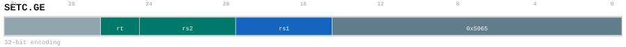

# SETC.GE

<div class="insn-header">

<span class="badge-32">32-bit Base</span> **Group:** <a href="../groups/bru.md">BRU</a> &nbsp;|&nbsp;
<span class="ch-tag ch-tag-16">Ch 16</span>
&nbsp; <strong>BRU — Branch and Compare</strong> &nbsp;|&nbsp;
**Length:** <code>32</code> &nbsp;|&nbsp; **Decode:** <code>—</code>

</div>

## Assembly Syntax

- `setc.ge SrcL, SrcR<{.sw, .uw}>`

## Encoding

<div class="enc-diagram">

<figure>

<figcaption>Bitfield encoding diagram. MSB is on the left, LSB on the right.</figcaption>
</figure>

</div>

## Description

Sets the block-commit condition.

## Pseudocode (informative)

```c
SetCommitArgument(/* condition */);
```

## Encoding Notes

- `SETC.GE - Compare scalar operands and update the bundle commit condition.`

## Full Catalog Forms

| Assembly | Length | Decode |
|----------|--------|--------|
| `setc.ge SrcL, SrcR<{.sw, .uw}>` | 32 | — |

<div class="insn-nav">

← [BRU](../groups/bru.md) &nbsp;&nbsp; [Index](../index.md) &nbsp;&nbsp; [All instructions](index.md) →

</div>
