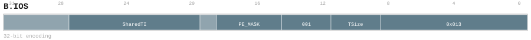

# B.IOS

## 功能

`B.IOS` 为一个块操作绑定一个绝对索引的 Shared Tile 寄存器。每个 core
拥有一组私有的 `S0` 到 `S255`；同一 core 的四个 PE 都能访问该组中的
全部寄存器。另一个 core 中同名的 `Sx` 属于另一组寄存器。Shared
寄存器的架构编号由编译器分配，硬件可以对选中的架构寄存器进行重命名。

机器可读指令目录是编码的唯一权威来源。本页只解释该记录，不建立另一套编码定义。

## 汇编语法

源绑定：

```asm
B.IOS S<SharedTID>, mask=<PE_MASK>
```

目的绑定：

```asm
B.IOS mask=<PE_MASK>, ->S<SharedTID><TSize>
```

`SharedTID` 是 0 到 255 的绝对整数。规范汇编名称因此是 `S0` 到
`S255`；不接受 `S#1` 这样的相对编号写法。

## 编码



| 位 | 字段 | 含义 |
| --- | --- | --- |
| 31:28 | 固定 `0000` | 主编码 |
| 27:20 | `SharedTID` | 0 到 255 的 Shared 寄存器绝对索引 |
| 19 | 固定 `0` | 固定保留位；其他值不属于 `B.IOS` |
| 18:15 | `PE_MASK` | 四个 PE 的参与掩码 |
| 14:12 | 固定 `001` | 功能选择码 |
| 11:9 | `TSize` | 源/目的形式选择和目的寄存器的单 PE 容量 |
| 8:0 | 固定 `000010011` | 次编码 |

32 位解码标识为 mask `0xf00871ff`、match `0x00001013`。PTO 来源
form 是 `b_ios_32_4ba5ef98fdaa`，独立 Linx 目录中的 form 是
`b_ios_32_11ff57a2e635`。

全部 256 个 `SharedTID` 值和全部 16 个 `PE_MASK` 值均已分配。三个
`TSize` 位也按下表全部分配，因此该 form 没有未分配的 `TSize` 编码：

| `TSize` | 形式 | 每个 PE 的目的容量 |
| --- | --- | --- |
| 0 | 源绑定 | 不适用；不分配目的寄存器 |
| 1 | 目的绑定 | 128 B |
| 2 | 目的绑定 | 256 B |
| 3 | 目的绑定 | 512 B |
| 4 | 目的绑定 | 1 KiB |
| 5 | 目的绑定 | 2 KiB |
| 6 | 目的绑定 | 4 KiB |
| 7 | 目的绑定 | 8 KiB |

固定字段不匹配的字不解码为 `B.IOS`。

## 操作

`PE_MASK` 是四个固定 PE quarter 的谓词，允许同时置多个 bit。
`PE_MASK=0000` 是严格 NOP：不执行绑定、分配、寄存器读取、描述符
更新、payload 更新或可能产生异常的访问。对于非零掩码，每个置位 bit
使能相应的 PE quarter。目的绑定选择的总容量等于单 PE 容量乘以置位
bit 数量。

源绑定使用 `TSize=0`。参与的 PE 读取指定 Shared 寄存器，并且读取
不会修改描述符。读取未初始化的 Shared 寄存器会得到未定义值，其行为
与读取未定义的标量寄存器相同。

目的绑定使用 `TSize=1` 到 `TSize=7`。选中的 Shared 架构寄存器需要
获得新的分配，同时更新其描述符。Shared 写操作以一次原子的
read-modify-write 同时更新描述符和 payload 状态。除了该原子属性之外，
架构不规定 PE 之间的顺序；软件必须避免不同 PE 使用冲突的 offset。

表中的容量始终是单 PE 容量。描述符中的 rows 和 columns 都必须是 2
的次幂。rows 由 `TSize`、columns 和元素大小推导；valid rows 和 valid
columns 不能超过已分配 shape。矩阵操作也遵循同一 shape 约束。

## 示例

将 `S7` 作为 PE quarter 2 和 3 的源：

```asm
B.IOS S7, mask=0011
```

在 `S23` 中为每个参与 PE 分配 128 B；四个 PE 全部参与时总容量为
512 B：

```asm
B.IOS mask=1111, ->S23<128B>
```

完全禁止该绑定：

```asm
B.IOS S7, mask=0000
```

`B.IOT` 仍是独立的 Local Tile 绑定指令，不绑定 Shared `S0` 到
`S255` 寄存器组。
